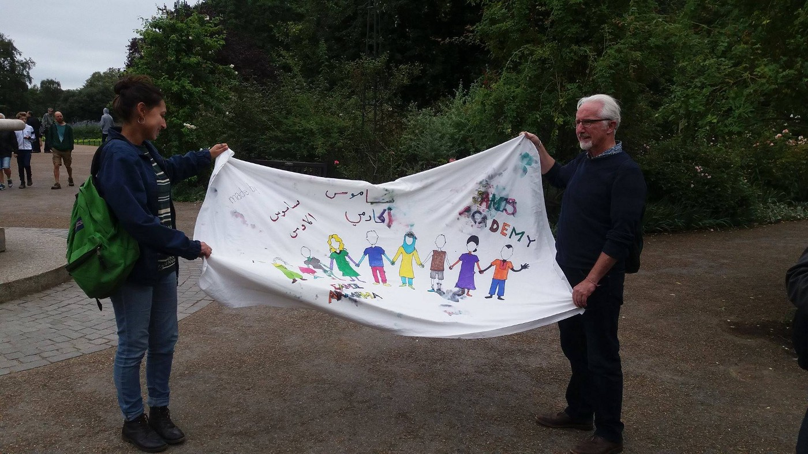

### AYS DAILY DIGEST 17/9: Anger and disbelief among refugees in Greece

_Some refugees in Greece will have to wait until next April for their next interview\. Among those who are waiting are many whose family members are already in Europe waiting to unite for too long\. In Serbia, ultra right organizations announced protest agains refugees for the beginning of October\. In Germany, another refugee shelter under attack\. In Hungary, 22 NGO urging citizens to reject the referendum on October 2\. Yazidi girl Nadia Murad the UN’s new Goodwill Ambassador for the Dignity of Survivors of Human Trafficking\._

 \.](assets/c919414f2c2/1*URWM2YVaOWgQb1ct5sw0gg.jpeg)

“Today we remembered what winter is like in the camp\. The ground is sandy and the water has nowhere to drain\. They live in tents and have nowhere to get warm\.” There are around 10\.000 people in Calais now, and more are arriving\. Photo [Care4Calais](https://www.facebook.com/care4calais/photos/a.1046164975416459.1073741829.1046117708754519/1284902881542666/?type=3&theater) \.
### Greece
#### SEVERE WEATHER WARNING

> On Monday, storms are expected to sweep across the country, starting in northwestern Greece\. Hail and gale\-force winds are expected in some parts\. The temperature will drop significantly\. The bad weather is set to continue into Tuesday\. 

Thousands of people will be under tents in camp or on the streets, people who left their homes because of war or lack of democracy, and they arrived in Europe to find the safe place\.
#### New arrivals

Kos: 10

Chios: 46

Lesvos : 51

Currently, 60\.079 refugees are in Greece, but people are arriving all the time\. [Volunteer Rafat](https://www.facebook.com/rafat.hammoud?fref=nf) Hammoud posted a story about a group of refugees he found near the road on the south coast in Mytilini\.

> “They were very scared, and at first, refused to speak or admit they had just landed on the island unassisted\. ON THEIR OWN\. We eventually were able to calm their concerns and rounded them up in one location while we waited for the bus to come and transport them to be processed… We had been coordinating with volunteers from other NGO’s on the coast and water and blankets to keep them warm while they waited were brought\. 

> 26 people\. 10 of them children \(including 2 babies\) 

The [Emergency Response Centre International](https://www.facebook.com/ercintl/) team also reports about new arrivals today\. They found 26 people on a small speedboat on the south shore of Lesvos\. Their rescue experts determined the boat was designed to hold between four to six occupants and was in poor mechanical condition\. Eight children were among the refugees, including one infant\.

All the people from this group have been taken to the Moria refugee camp\.

Photo by ERCI

[ERCI](http://www.ercintl.org) is always looking for volunteers in search and rescue, child education, and other fields\. If you would like to join please visit their site\. To donate, go [here](http://www.ercintl.org/donate) \.

The significant changes in number of people in some of the camps are noticeable even today\.

Merchant Marine Academy \(Elfesina\): \-139 \(from 359 to 220\) 
UNHCR Accommodation Centers dropped from 1360 to 1286\.
Kalymnos: \-28 \(from 34 to 6\) 
Katsikas Ioannina: \-30 \(from 739 to 709\)
#### Full interview registration dates

Full list for interviews starting from October and ending April next year, is available [here](https://search.rescueapp.org/#/search) \.

The Greek Asylum Service will be sending SMS out two weeks in advance for those who will have the interview in October\.

There is a [new registration number search tool](https://search.rescueapp.org/#/) that enables people to search for their registration appointment by their registration number\. The tool is in all languages\.

Refugees in many camps are disappointed they will have to wait for so long for their interview\. For some of them, it will mean they will have to spend more than one year in camp, and the winter is coming\. Some of the refugees we spoke to today told us they are thinking about going back to Turkey, even though they do not feel safe, of even Syria\. Some other are considering to try to cross over the Balkans, alone or with smugglers\.

Our regular correspondent [Abdulaziz Dukhan](https://www.facebook.com/throughrefugeeeyes/) , writes about a family of 8 who arrived in Greece on February 2 this year\. They are living in a tent and finally they got the appointment for relocation set but for April 5, 2017\. Abdulaziz asked them about how do they feel and this is what they told him\.

> “UNHCR is the worst organization we have come across in the humanitarian field\. It seems there is no justice in this world — we heard there would be rights for women, for children — for human beings, but no spoken right has been put to action\. 

> Several countries contributed to the destruction of our country by silence and sending weapons\. Here too, we are being destroyed\. If you don’t want our presence — tell us\. Don’t leave us like this\. Allow us to return back to our own country with a little dignity at least\. We would rather die as humans instead of being devalued to something not worthy of a life\. Look around you, look around this camp and you will see that this place is not suitable for children if you wish them health\. It is not suitable for parents you wish mental health for\. This place was meant for animals\. Take a breath and try to smell\. This place you wouldn’t put your own family in\. Would you?”” 

![“I asked if it’s possible for them to wait and the father replied: “We spent 7 months here by now another 6 months will pass before our first appointment will come\. And then we will have to wait for the second\. It will be 15 months\. I think, most likely, I will have lost my mind by then and what can I then give? What do I then have left to give my family? If I had money I’d be ready to go back to Syria\. Show my children that they deserved at least the chance of a normal life\.If you can… please just take us back there\.”](assets/c919414f2c2/1*Tk-n92Mpr4Cy2TdCVQQ0AQ.jpeg)

“I asked if it’s possible for them to wait and the father replied: “We spent 7 months here by now another 6 months will pass before our first appointment will come\. And then we will have to wait for the second\. It will be 15 months\. I think, most likely, I will have lost my mind by then and what can I then give? What do I then have left to give my family? If I had money I’d be ready to go back to Syria\. Show my children that they deserved at least the chance of a normal life\.If you can… please just take us back there\.”

In the meantime, people who are stranded in Greece are waiting to be reunited with their families who are leaving in Europe\. Today we [read a story about 1 year old Amina](https://www.facebook.com/achilleas.zavallis) who this week saw her father today for the first time in her life\.

](assets/c919414f2c2/1*UdogeatY0MUPg2kikEW2mQ.jpeg)

Photo by [Achilleas Zavallis](https://www.facebook.com/achilleas.zavallis)

Amina was born one month after her father left Syria for Germany, hoping that once he arrived there he would be able to bring his then unborn daughter and wife Najah to Europe\. After Amina’s birth, her mother took her on the journey only to arrive in Greece on the day when the border was closed\. They remained on Lesvos for months, and finally, they managed to find their way and go to Germany\.
#### Calls for help

Philoxenia volunteer needs your help\. They are collecting help for the kitchen that will feed refugees living in the streets and homeless people in Thessaloniki area\. You can help by visiting their [FB page Philoxenia](https://www.facebook.com/teamphiloxenia/) \.

> “With the right funds, we could reach much more people by investing in more efficient industrial kitchen equipment as well as more ingredients each day which would help us to continue expanding our efforts\. Any donations will go straight to the team on the ground, and as a small amount can go a very long way, anything you can give would be much appreciated\!” 

They also need volunteers to help us with their daily operations in Thessaloniki\! If you are interested in helping out, please get in touch via [philoxeniaaction@gmail\.com](mailto:philoxeniaaction@gmail.com) \.
### Serbia
#### Ultra right protest announced

Ultra right organization _Nacionalni srpski front_ announced anti\-migrant protest for the beginning of October to be held in Belgrade\. This organization, which is officially registered in Serbia, as one of the goals of their work, puts “to stop migrant invasion”\.

At the same time, _Srpski narodni pocket Zbor_ announced a public event for the end of September with the guests from ultra right German groups\.

The police could not confirm exact location and time of the protests\.
### Bulgaria
#### More money from EU for stronger border control

The EU continues to support Bulgarian straightening of closed borders, [local media reports](http://www.novinite.com/articles/176326/Bulgaria+To+Receive+EUR+108+M+in+Emergency+Assistance#sthash.7YAt5qWH.dpuf) \. The government will soon receive additional 108 million Euro for border defense and for dealing with the migrant flow\. Already 12 million euros were awarded to the country to “respond to the migration crisis”\.

2776 **asylum seekers in August**

[The State Agency for Refugees](http://www.aref.government.bg/?cat=21) \(SAR\) registered 2,776 asylum seekers in August, that is 1,543 asylum seekers more than in July\.

From January the 1st until August the 31st, the SAR granted refugee status to 376 people and 302 got humanitarian status, 597 people were refused\. Until the end of August, 11,952 people were registered by the SAR to have sought “protection” in Bulgaria in 2016\.

The number of people in camps is also rising and currently, 93 percent of the overall capacity is filled, the [Border monitoring reports](http://bulgaria.bordermonitoring.eu/2016/09/17/bulgarias-state-agency-for-refugees-is-registering-more-asylum-seekers/) \.

According to the [Ministry of Interior](https://www.mvr.bg/default.htm) , from the 2nd\-8th of September, the 664 people have entered Bulgaria\. During this year, police in Bulgaria arrested 12,500 people who tried to cross the country, most of them from Afghanistan\.
### Hungary
#### Campaign to invalidate referendum

On October 2 referendum with the questions _“Do you want the European Union to be able to mandate the obligatory resettlement of non\-Hungarian citizens into Hungary even without the approval of the National Assembly?”_ will be held\. The activists are warning how dangerous this can be and calling for a referendum to be invalidated\. [A group of 22 NGOs](http://www.liberties.eu/en/news/invalidate-the-referendum-hungary-ngo-statement) , issued the common statement against the inhuman politics of the Hungarian government against refugees\.

> “We, Hungarian NGOs and citizens with a sense of responsibility for our country, believe in a country where our common matters are managed with humaneness, solidarity, and mutual respect\. We are concerned about seeing the government threaten our common values, therefore we speak out against the referendum scheduled for October 2, as well as the hate campaign surrounding the vote\. 

> We decided to start a campaign to invalidate the referendum, which fails to promote our common concerns and is both pointless and inhuman\.” 

The groups are claiming that the referendum is “pointless” because it does not offer a solution “either to the situation of refugees or the future of the European Union”\. Additionally, the referendum “rejects solidarity with our fellow human beings in plight, just like with the other European member states\. It has no intention to create a framework for peaceful coexistence\. We are convinced that nobody can feel safe in the long run where public discourse is defined by hatred\.”

The question this group is asking is whether Hungary “will ever be able to become a human community?\.”

Twenty\-two NGOs are calling the referendum “nothing more than a xenophobic hate campaign”\.

Turnout needs to be at least 50 percent for the referendum to be valid\.
### France
#### Petition to stop demolition of Calais Jungle

> “The Calais refugee camp is under imminent threat of demolition, meaning thousands of refugees will lose their tiny makeshift homes\. With winter around the corner, we need your support to stop this before it is too late\. 

> The rapid growth of the camp and the increasingly violent tactics being employed by people smugglers on the roads entering the port have meant that many parties are calling for something to be done\. In response, the French Interior Minister has said that the camp will be progressively dismantled between now and the end of the year\. 

> In February over half the camp was demolished, yet six months later the camp is bigger than it has ever been before\. This clearly shows that demolitions do not act as a deterrent and that refugees will not stop coming to Calais\. Destroying their homes will do nothing more than make living conditions so much more inhumane\. “ 

The population of the camp is over 10,000 people\.

[Here you can see demands and sign the petition](https://www.change.org/p/amber-rudd-mp-stop-demolition-of-the-calais-jungle) \.

At the same time, [the demonstrations are announced](https://watchtheborders.wordpress.com/2016/09/14/call-out-to-demonstration-in-calais-1st-october-2016-migrants-welcome/) in Calais for October 1\. CISPM — [Coordination Internationale des Sans Papiers et Migrants](http://www.cispm.org) is calling all “collectives, associations, unions, parties … and particularly those present in Calais and its region” to participate in the organization of this event and support this action by sending their signature\.
### Germany
#### Another attack on refugees

Refugee home in Erbach, southern Germany, was set a fire yesterday\. [Five people were injured and taken to the hospital](http://m.dw.com/en/fire-injures-five-in-refugee-home-in-southern-Germany/a-19558948ƒ) \.

Police said the place was deliberately set on fire overnight while 26 people were inside\.

In 2015, there were 1,047 attacks on planned and completed refugee shelters across Germany, and authorities warn the tally could be even higher for 2016\.
### UK
#### Refugees are welcome in UK

Big solidarity march was held today in London with tens of thousands people on the streets wishing welcome to refugees\. They urged the government to take more action and help refugees, demanding that the UK take a “fair and proportionate” share of international refugees, provide more safe routes to the UK and offer more support to those already in the country\.

Solidarity with Refugees director Ros Ereira said:

> “This demonstration is the public’s best opportunity to show the Government that’s what we want them to do\. Britain is a country that should welcome people fleeing desperate situations — let’s make that message heard loud and clear\.” 

Several past Samos Volunteers joined a march\.

Photo by Samos Volunteers

> “We were so proud and honored to carry a colorful banner made by the kids in Samos Academy\. We marched with our friends in Samos in mind, hoping that a better future would come soon for them, and in acknowledgment of their strength and spirit despite the difficult times, they have experienced\.
 

> Thousands turned out today to raise awareness about the continuing refugee crisis and to demand that the British government and EU stand up and take a decent human and response to the situation\. The past year has seen a tide of closing borders and anti\-refugee feeling across Europe, and this is why it is so important that we add our voices to the demands for more to be done — and ultimately to place ourselves on the right side of history\.” 

### General
#### Lottery for US

Today, at [RefuComm FB page](https://www.facebook.com/refucomm/posts/319793708372438?hc_location=ufi) we found an interesting post\.

> “Any person interested in immigrating to the United States may enter their name in the Diversity Visa Lottery program during the entry period from October 4 to November 7\. Basic requirements are birth in an eligible country \(Syria, Iran, Iraq and Afghanistan and many others are all eligible countries, but Pakistan is one of several that are not allowed\) and at least a high school diploma or two years of qualifying work experience\.” 

You can find instructions at the [State Department site](https://travel.state.gov/content/visas/en/immigrate/diversity-visa/instructions.html) \.

Good luck\!
#### UNHCR: No need to panic

In an [interview with Deutsche Welle](http://m.dw.com/en/we-can-manage-refugee-influx-says-unhcrs-director-for-europe/a-19557970) , UNHCR director for Europe Vincent Cochetel said that he does not believe his organizations is “in a position to solve the problem,” but told that they are in a position “sometimes to help countries and find pragmatic ways of working\.”

> “We have a total of maybe 50,000 asylum seekers today in Greece\. This should not be an emergency; it should not be a crisis\. We need to tell people and governments this is manageable\. Good screening; good registration; good refugee status determination; return for those not in need of protection; relocation for those who are in need of protection; some local integration because some people have to stay in Greece — this is manageable\. It should not be a crisis\. The crisis is not about the numbers; it’s more about the solidarity among European Union member states\.” 

He also said that we should not panic about a current number of refugees who are arriving in Europe\.

> “It’s not the first time Europe has been confronted by a movement of people\. Not everybody is a refugee\. We need to make sure that returns work better, that integration does not happen by chance\. You need to invest in that\. That’s an investment for the future\. People also don’t need protection forever\. Look at the refugees from Bosnia\-Herzegovina\. Many returned to their country, sometimes with the passport of another country\. So they keep one foot in one country and one foot in another country\. But that’s fine; that’s mobility\.” 

Over 60\.000 people who are stranded in Greece, and many others along the Balkan route, or in Italy and all over Europe, living in inhumane conditions, could hardly find solace in these words\.
#### Nadia Murad to be appointed as the UN Goodwill Ambassador

Nadia Murad, a Yazidi girl from Iraq who was captured by an ISIS, was named the UN’s new Goodwill Ambassador for the Dignity of Survivors of Human Trafficking\.

She announced to focus on advocacy initiatives and “raising awareness around the plight of the countless victims of trafficking in persons, especially refugees, women and girls,” during her mandate\.

Nadia was among approximately 5,000 Yazidi women who were taken after ISIS militants swept across Nineveh province\. She was kept as a sex slave for ISIS for three months before she managed to escape\. Today she is living in Germany where she has been granted asylum\. She was also nominated for the Nobel Peace Prize and named one of Time Magazine’s 100 most influential people of 2016\.

Murad and the Yezidi activist group Yazda are leading efforts to bring the perpetrators of the crimes against the Yezidi community to justice\.

Nadia is also launching ‘Nadia’s Initiative” that will be run by Yazda and focus on advocating for the countless victims of mass atrocities as well as developing and supporting field programs in the areas of healthcare, psychosocial support and education for women and children\.

An induction ceremony will be held on Friday at the UN headquarters in New York\. [You may watch the ceremony here](http://webtv.un.org) \.
#### Borderless Europe is under threat

Portuguese cartoonist Christiano Salgado from Expresso commented on a current situation in EU\. His cartoon is part of the project “Drawing Europe”\. 28 cartoonists from the member countries have been invited to comment on how they view the EU today\. Saldago was among few to focus on refugees and closed borders\.

“I see us slowly shutting ourselves off\. We are building borders at a time when we should stand united\. The idea of a borderless and open Europe is under threat\.” By Christiano Salgado

_Converted [Medium Post](https://areyousyrious.medium.com/ays-daily-digest-17-9-anger-and-disbelief-among-refugees-in-greece-c919414f2c2) by [ZMediumToMarkdown](https://github.com/ZhgChgLi/ZMediumToMarkdown)._
