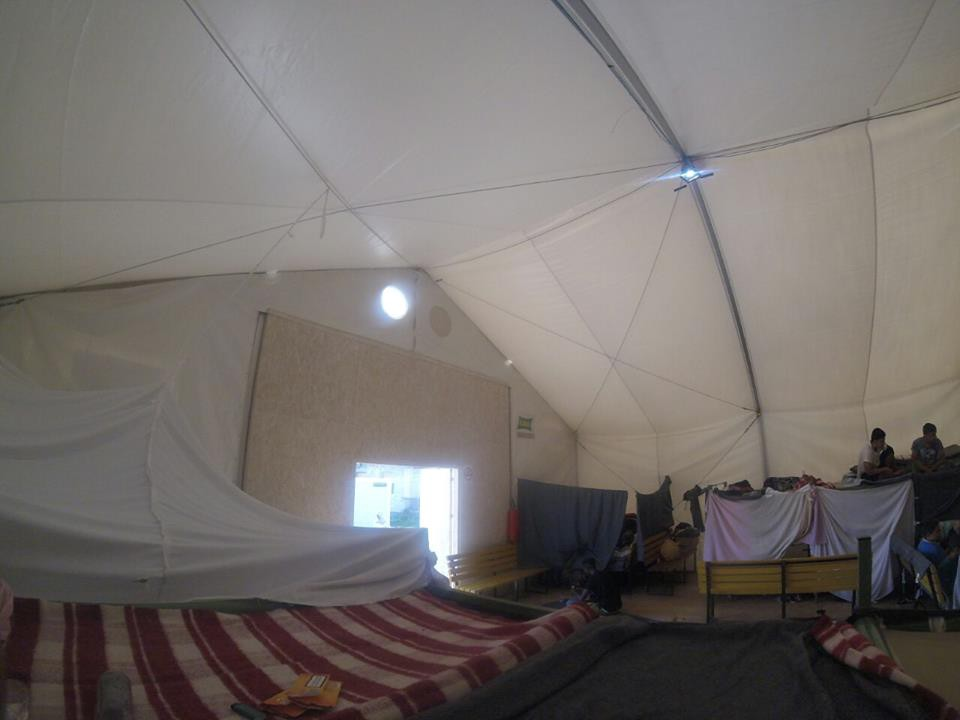
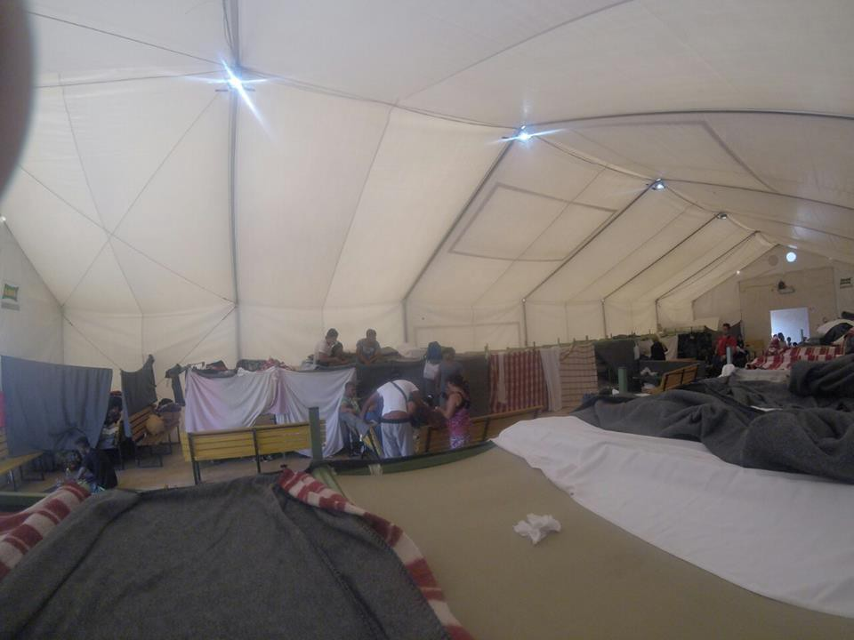

### AYS NEWS DIGEST 16/9 — Refugee at Adavasci Transit Center on the border with Hungary reveals horrid conditions\.
#### Pictures and video footage were sent to AYS, revealing the squalor and the shameful conditions that refugees are forced to endure\. They are unable to go elsewhere, as they are waiting to cross the border into Hungary, and not being present for the nightly roll call means losing the chance to make the crossing\. Residents also abuse rampant alcohol and drug abuse, sexual harassment, and mishandling by guards\.
#### Syria
### Despite the ceasefire, regime forces continue to prevent vital aid from reaching besieged Aleppo\.

The UN has raised concerns today about the lack of aid being allowed into rebel\-held Eastern Aleppo\. The government had promised the UN permits to deliver aid, but no such permits have thus far been delivered\. Although progress seems to be made, it could be several days before vital aid reaches the besieged residents\.
#### Greece
### A three year old girl has died of pneumonia\.

The girl was a Yezidi living in the Petra Olympus camp\. She died in the hospital after having been under care for more than two weeks\. This is incredibly alarming news, seeing as the summer heat is only just beginning to die down\. Policymakers should think about the implications of this death when refugees all across Greece are housed in close quarters in harsh conditions, a factor which may have nasty implications for the spread of infectious diseases\. This, coupled with the often irregular access that camp residents have to doctors, means that a serious disease could easily spread and infect the other residents of the camp before being noticed\. All of this must be kept in mind with winter on the horizon and the prospects of better housing slim\.
### Rumors of more hotspots on Lesvos and Chios trigger a strong response\.

Lesvos, the site of the dangerously overcrowded Moria and Kara Tepe camps, is seeing construction work which local officials believe will become another hotspot\. The islands are already overburdened, and have made calls for help from the mainland\. The camps and hotspots on the islands, which have a capacity of 8,000, are collectively holding 13,000 refugees\. Local officials worry that such strained conditions are fueling tensions between different groups of refugees, and that efforts should be made to improve the living conditions of refugees already living there\.
### Numbers

Arrivals: 
Kos: 36
Kalymnos: 28
Total: 64

Voluntary returns: \+4 \(81 this month\)

No arrivals but significant changes during the last 24h:
Oreokastro: \+46 \(from: 1282 — to: 1328\) — capacity: 1500
Vagiohori: \-38 \(251–213\) — 631
Skaramagas: \-32 \(3286–3254\) — 3200

This brings the total number of refugees in Greece according to the government to 60,086\. More detailed data may be found [here](http://media.gov.gr/index.php/component/content/article/258-%CF%80%CF%81%CE%BF%CF%83%CF%86%CF%85%CE%B3%CE%B9%CE%BA%CF%8C-%CE%B6%CE%AE%CF%84%CE%B7%CE%BC%CE%B1/3977-summary-statement-of-refugee-flows-16-09-2016?Itemid=595) \.
#### Serbia
### Adasevci Transit Center: suitable for nobody\.

Living conditions in the Adasevci Transit Center near the Serbian border with Croatia are unspeakable, to the point that the place resembles a detention center more than a place that offers refuge to people running away from war and insecurity\.

Over the past couple of weeks, AYS received disturbing reports from refugees, volunteers, and activists in Serbia regarding this center\. According to refugees, the center management restricts their freedom of movement\. While during a day they are all free to leave the center, they have to be back in the evening for a roll call\. If somebody is not present, they are threatened with the possibility of losing their place in the camp, but more importantly losing the opportunity to receive a number that will allow them to cross the Hungarian to continue their journey\.

Photos sent to us by a refugee\.

Inside of the center, 10 families are sharing one big tent and five toilets\. They sleep on a provisional sleeping surfaces, close to each other\. There is no separate space for man, women, and families with kids, and so they all sleep and live in the same area\.

Refugees are telling us that there is no hot water at all\. Food is distributed three times a day, but it is a very bad quality\. At this moment, people must wait about 4 months to cross the border\. Once they get their number, they are free to leave the camp\.

The camp is under the jurisdiction of the Serbian Commissariat for Refugees and Migrants and is supported by various UN agencies\.

According to the information gathered by AYS, Adasevci are just one of the camps in Serbia where living conditions are unbearable\. There are reports of drug and alcohol abuse, sexual violence, corruption, and mistreatment by those in charge\.

Serbia, an aspiring member of the EU, announced strict measures against refugees who are arriving into the country\. Some member of the government also announced the possibility that barriers will be erected in the border areas to prevent people from crossing\. This week, Serbian prime minister met with his counterparts from Hungary and Bulgaria to discuss the issue and measures they can take against the new wave of refugees\. Reports about draconian measures against refugees in Bulgaria are often present in the media, as well as in Hungary, but a reaction from the international community are weak\. Serbia is even more obscure, but dire conditions in the camps are a warning sign that something should be done to help people who are searching for refuge\.
#### Italy
### Anti\-trafficking unit denies having turned boats back to North Africa\.

The claim surfaced following the British foreign secretary Boris Johnson’s meeting with his Italian counterpart, after which he claimed that the unit had “saved 200,000 migrants and turned back 240 boats\.” He also said that turning boats back should be used as a deterrent against further crossing attempts being made\. The anti\-trafficking unit denies Johnson’s claim, stating that as a matter of course they save the passengers aboard and destroy the boats so that they may not be reused by smugglers and so that they do not constitute a hazard to other vessels\.
#### France
### A makeshift camp in Paris dismantled by police\.

The camp was situated in Montmartre and was home to over 1,500 refugees\. The majority have been taken to shelters throughout the city, with a small minority refusing to be relocated\. These refugees are believed to want to cross the English Channel and hope to make it to the UK\.
#### Sweden
### The Swedish Minister of Migration says that Europe can take in 1 million refugees per year\.

[“We are the world’s richest continent and it is obvious that if anyone can actually handle this, it is Europe with its 500 million inhabitants,”](http://uk.reuters.com/article/UKNews1/idUKKCN11M1RG) said Morgan Johansson\. It is true\. Europe, despite its wealth, hosts only 20% of the world’s 21\.3 million refugees, with countries such as Turkey, Pakistan, Lebanon, and Iran taking on the biggest burdens\. Johansson called for a mechanism by which the burden of the refugees can be born collectively\. Countries like Hungary, who refuse to cede and have erected fences to keep refugees out pose a challenge however\. Johansson said that should Hungary continue its behavior, it ought to be taken to court\.
#### US
### Hundreds of life jackets of refugees crossing the Mediterranean displayed in New York\.

The life jackets were displayed near the Brooklyn Bridge\. They were recovered from the water, and some of the people who had worn them were no doubt killed\. The display is shocking to behold, as this is the intention, to raise awareness about the plight of refugees\. Many of the life jackets are padded with regular sponges, showing further that the smugglers who traffick people by the hundreds on insecure boats do not care for the safety of passengers\. This exhibit serves as a reminder that current means employed are incredibly dangerous, and there needs to be a safe and legal route which would allow refugees to come to Europe with dignity\.

### Refugees interested in moving to the US will soon be able to apply to the visa lottery\.

People may register from October 4 to November 7\. Applicants must have at least a high school diploma or two years of work experience\. Note that not all nationalities are eligible for the program\. People originating from Pakistan, for example, may not apply\. Although there are only 50,000 places each year and it may take as many as two years to complete the process, but it nonetheless presents a potentially great opportunity for refugees stranded in Greece and elsewhere\. The instructions and eligibility criteria may be found [here](https://travel.state.gov/content/visas/en/immigrate/diversity-visa/instructions.html) \. If you know that you do not qualify, please do not apply\! Furthermore, be aware that you may double your chances if both you and your spouse apply to the program\.

_Converted [Medium Post](https://areyousyrious.medium.com/ays-news-digest-16-9-refugee-at-adavasci-transit-center-on-the-border-with-hungary-reveals-horrid-70ba8b9ab89f) by [ZMediumToMarkdown](https://github.com/ZhgChgLi/ZMediumToMarkdown)._
