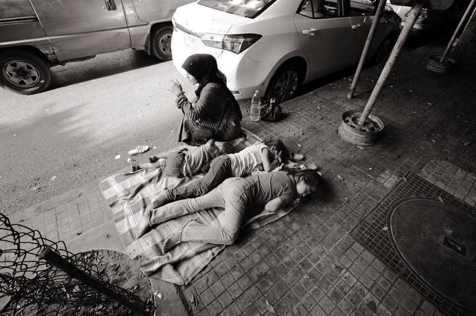
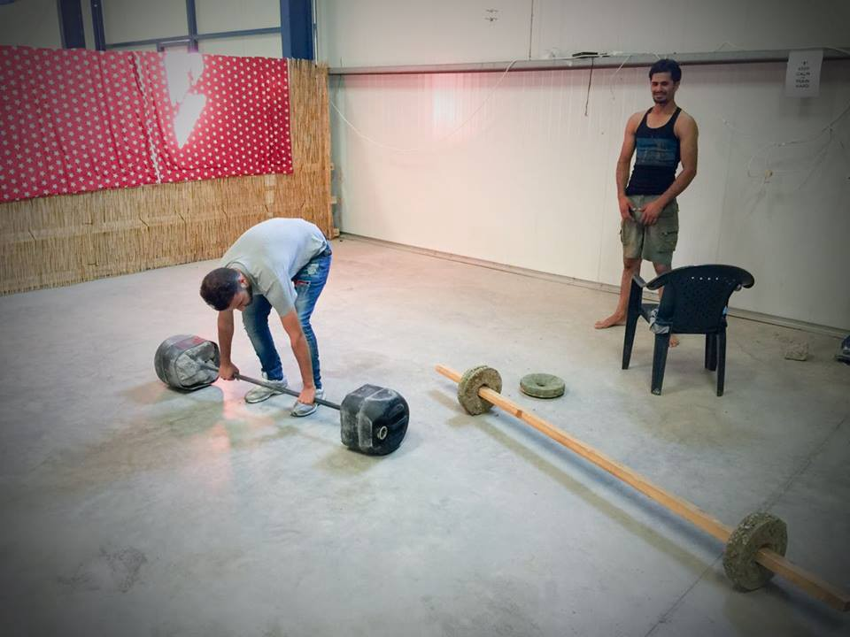
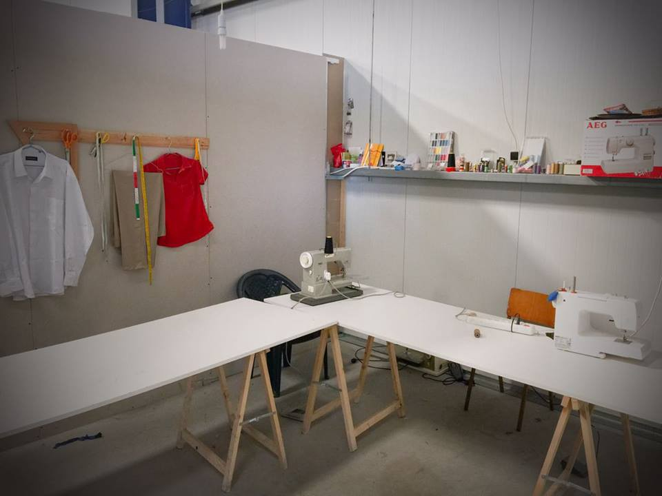
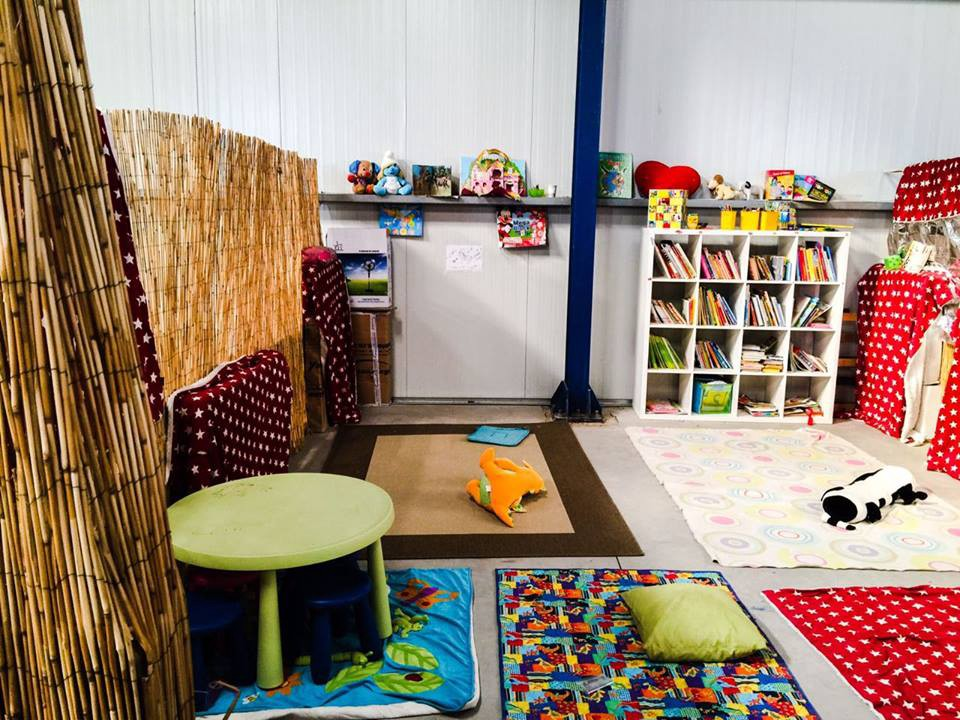
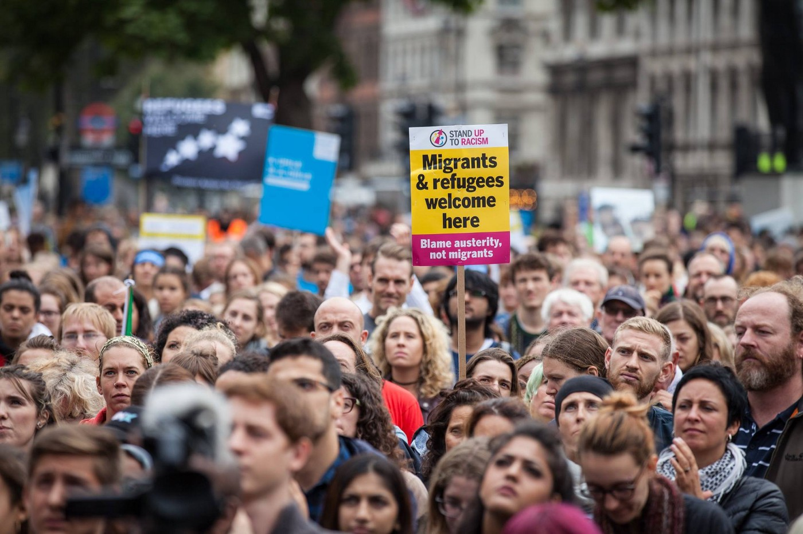
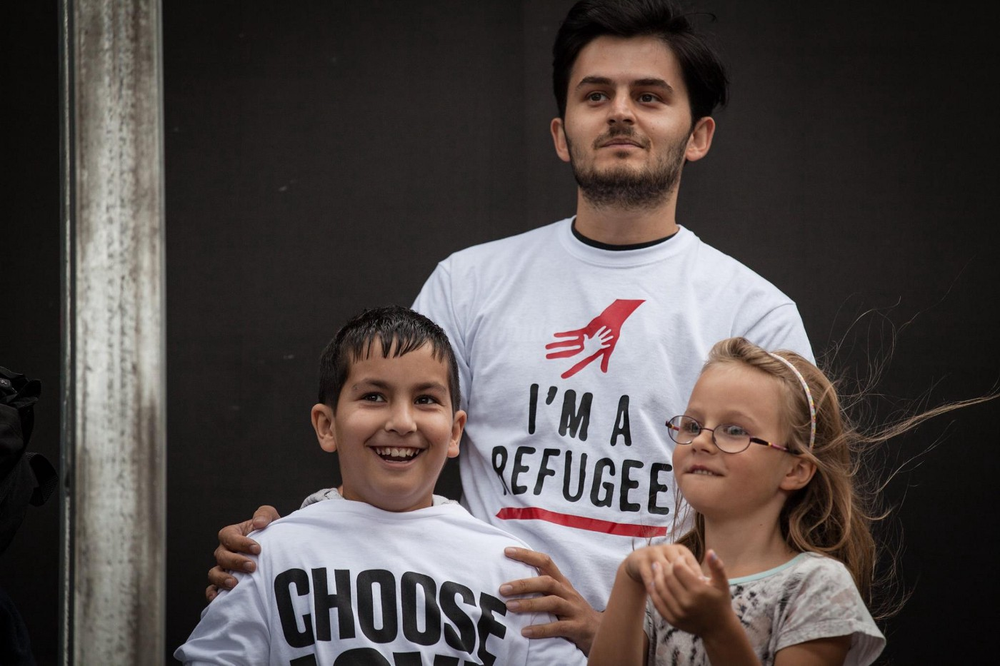
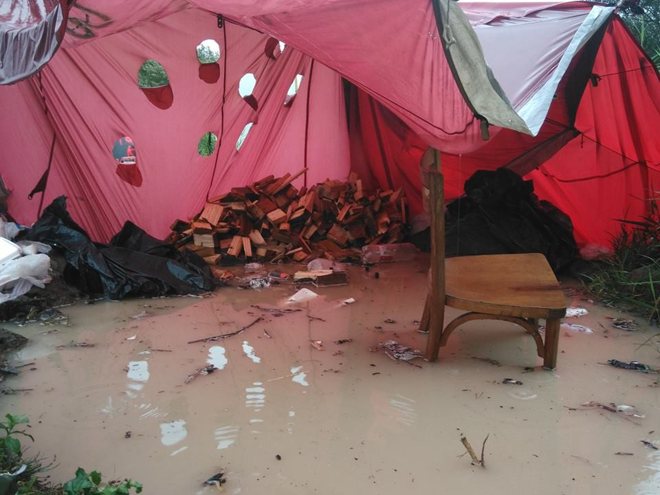
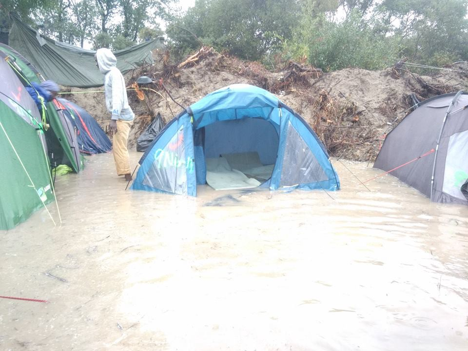

### AYS Digest 18/9: Volunteers call on UK to resettle unaccompanied minors from Calais

_After the “ Refugees Welcome” rally this Saturday in London, volunteers call on the government to relocate unaccompanied minors to the UK\. This comes after a 14\-year old boy was killed in a hit and run accident while trying to reach his family in Britain\. Theresa May however is expected to talk about “reducing today’s unmanaged population movement” during today’s UN summit\. Most experts do not believe the summit will yield results, while IOM analysts believe 10,000 refugees could die this year\. Female volunteers in Greece are needed to conduct interviews with pregnant women and mothers of newborns to present a report on the reproductive rights of refugee women in Greece\._

Homeless refugees in Greece\. Photo by Refugee Biriyani & Bananas
#### Syria
#### Four airstrikes hit Aleppo despite ceasefire

The [BBC](http://www.bbc.com/news/world-middle-east-37401586?ocid=socialflow_twitter) says that four airstrikes have hit rebel\-held parts of Aleppo, the first raids since a ceasefire began last Monday\. Russia has said the future of the truce is in doubt after the US\-led coalition struck the Syrian army in Deir al\-Zour\.

The Syrian Observatory for Human Rights also says that helicopters dropped barrel bombs in the countryside of Daraa, killing ten people including a child\.

#### UN Summit
#### UN summit unlikely to address real challenges

[The Guardian](https://www.theguardian.com/commentisfree/2016/sep/17/summit-migration-refugees-un-obama?utm_source=esp&utm_medium=Email&utm_campaign=GU%20Today%20main%20NEW%20H%20categories&utm_term=190872&subid=10974989&CMP=EMCNEWEML6619I2) reports that tomorrow’s UN meeting will “focus more on abstract principles of commitment than concrete practice”, with the final declaration revealing “only vague principles, denuded of substance by spoiler governments\.”

The Obama\-led Leader’s Summit on Tuesday will focus on galvanizing significant new global commitments to increase funding to humanitarian appeals and international organizations, admit more refugees through resettlement or other legal pathways, and increase opportunities for education and legal work for refugees\.

The paper says that both summits will not address the real challenges on the ground, including the rapid relocation of refugees from Greece to the rest of Europe\. It also says that the UNHCR has not the necessary tools for “political engagement, development and economics”, saying that this explains why _“the overwhelming majority of Syrian refugees receive no assistance whatsoever from UNHCR or its partners\.”_

On Twitter, Jeff Crisp of the Refugee Studies Centre Oxford, hopes the UN Refugee Summit will be used to speed up relocation, stop the detention of refugee children and increase accountability for aid agency use of donor funds, especially in Greece\. Like many however, he believes these outcomes are unlikely — it is up to the civil society to keep pushing so that tangible results are produced during the summit\.
### 10,000 migrant deaths expected this year

[The Guardian](https://www.theguardian.com/world/2016/sep/17/migrant-death-toll-2016-syria-united-nations) reports migrant deaths are due to set a new record this year, with 10,000 deaths projected, according to forecasts by the International Organization for Migration\. Julia Black, a data analyst from the IOM’s Missing Migrants Project, confirmed this forecast:

_“Last year we had more than 5,000 deaths across the world\. This year we’re already at more than 4,000, but outside of the Mediterranean and Europe the information is so poor we really think it’s a gross underestimate,” she said, adding that experts expect the figure to be twice that, and “greater than anything we’ve seen\.”_

](assets/757f4cf02bad/1*BDR-lm6TfxWiLiDAXAuxMw.png)

Photo by [r2hox](https://www.instagram.com/r2hox/)

The International Federation of Red Cross and Red Crescent Societies \(IFRC\) is urging world leaders to use tomorrow’s UN General Assembly Summit for Refugees and Migrants as an opportunity to stop indifference to deaths and suffering along migration trails\.

_“This death and suffering can be prevented and must be stopped\. The world must come together to focus first on saving lives and respecting human dignity\.”_
#### Greece
### Call for female volunteer support in Greece

The reproductive rights of refugees are firmly rooted in international law, but they are often neglected, if not completely disregarded on the ground\. In Greece, many refugee women are forced to undergo a C\-section, even if they are perfectly capable of delivering their babies naturally\. They are quickly stitched up and sent back to filthy camps with wounds on their bellies and crying babies in their hands\.

The volunteer community needs to put pressure on authorities to provide better support to refugee mothers and their kids and we can’t do it without international support\. Our friends from Pleiades law group led by the amazing [Electra Leda Koutra](https://www.facebook.com/electra.koutra) are conducting an important nation\-wide research about reproductive rights of refugee women in Greece, in cooperation with Human Rights in Childbirth and with humble support of AYS\.

In order to make their report ready for the HRiC summit in Strasbourg \(19th of October\) and to present as many as possible real\-life cases to the international audience, we need female volunteers who are already working in Greece, who have strong bonds with refugee women, and who would be willing to conduct a series of structured interviews with pregnant women and mothers of newborns in Greek camps, squats and other places where refugees reside\.

If you are willing to take this task seriously and commit to collecting testimonies in the next two weeks, please send us a message\. We’ll provide questionnaires and other materials you might need\. Let’s make this work\!
### 13,205 refugees live on Aegean Islands despite capacity of only 7,450

In the 24 hours up to 7:30 AM today, 47 refugees were registered in Lesvos 46, in Chios, 35 in Samos and 36 in Kos\. There are now 13,205 refugees on the Aegean Islands, for a capacity of only 7,450\.

According to volunteers, 110 refugees on two different boats arrived early in the morning in Chios, while a boat with 25 people and one with 46 people landed in Lesvos\.
### Asylum Service translates FAQ

The Greek Asylum Service’s questions & answers sheet has now been translated to [Arabic](http://asylo.gov.gr/en/wp-content/uploads/2016/09/Qandanswers_ENG_Sep1_final-ARABIC.pdf) , [Sorani](http://asylo.gov.gr/en/wp-content/uploads/2016/09/Qandanswers_ENG_Sep1_final-ENG-7-Sept-SORANI.pdf) , [Urdu](http://asylo.gov.gr/en/wp-content/uploads/2016/09/Qandanswers_ENG_Sep1_final-ENG-7-Sept-URDU.pdf) and [Farsi](http://asylo.gov.gr/en/wp-content/uploads/2016/09/Qandanswers_ENG_Sep1_final-ENG-7-Sept-FARSI.pdf) \. It includes detailed information about registration, family reunification and relocation\.
### Refucomm looking volunteers

Refucomm, a group that provides information to refugees on everything from Greek asylum procedures to medical and education services, is looking for new volunteers\. They have proven to be a reliable source of information for us as well and have recently expanded their operations, creating video and audio versions of their documents and launching a new project in Germany\. A wide range of positions need to be filled, including positions as fundraising manager, writer, translator and lawyer\. You can contact them on refucomm@gmail\.org
### Photos of Sindos Karamanlis shows improvements made by refugees and volunteers

Photos of Sindos Karamanlis show how living spaces, inside or outside refugee camps, are being built and improved by refugees and volunteers\.

Spaces built by refugees and volunteers in Sindos Karamanlis\. Photo by أبو إيمار الرجب

Spaces built by refugees and volunteers in Sindos Karamanlis\. Photo by أبو إيمار الرجب

Spaces built by refugees and volunteers in Sindos Karamanlis\. Photo by أبو إيمار الرجب
#### Serbia
### Volunteers prevented from visiting refugees

Following the recent destruction of squatted facilities behind a bus station in Belgrade, where refugees used to take shelter during the night, independent volunteers were prevented from approaching the refugees who still reside in the area\.

Today, police told these volunteers that no one can visit the refugees behind the bus station without an authorisation from the police\. Facilities behind the bus station are being torn down by the city authorities, allegedly in preparation of the notorious Belgrade Waterfront real estate project\.
#### Croatia
### Bad living conditions reported in reception centres

Inicijativa Dobrodošli \(Initiative Welcome\) says that 932 refugees have seeked asylum in Croatia since the beginning of the refugee influx last year to beginning of August\. 34 of these people were granted protection, while 81 were rejected\. The country has also accepted only 14 people as part of the relocation program\.

Inicijativa Dobrodošli has visited reception centers in Sid, Adasevci and Principovac this Sunday and estimates that 1,500 people are currently in Sid while 550 reside in Adaševci — numbers for Principovac are difficult to estimate, as many people come and go\.

Almost all of the refugees interviewed by the group complained about their living conditions, especially about the lack of hot water, bad food, long waiting lists for entry into Hungary and the lack of translators\. Refugees also said they are being pushed back to Serbia when crossing the Serbian\-Croatian border\.

The Welcome Initiative calls on EU institutions to turn to integration and solidarity instead of militarization, saying Europe should not resort to violence against people who are fleeing from violence\.
#### Hungary
### Sirious help needs donations and volunteers

Sirious Help has been granted access to the Horgos/Röszke and Kelebija/Tompa transit zones and needs mainly donations of hygienic products, men’s shoes and food in order to start providing help\. You can look at the full list of needed items and see how you can donate by looking at their [Facebook post](https://www.facebook.com/sirius.help/photos/a.186845441655682.1073741828.181933462146880/344368972569994/?type=3&theater) \. Volunteers, in particular doctors, are also needed to work at the transit zones\. The group is also looking for online volunteers to help with translation from Hungarian to English, and to manage their social media presence\. More info is available on their [website](http://www.sirius.help/get-involved/) \.
#### UK
### Taking action after “Refugees Welcome” Rally

[Calais Action](https://www.facebook.com/calaisaction/) reports on Saturday’s Refugees Welcome Rally in London and on the need to take action after the rally\.

_“People say that there isn’t enough room in the UK to let in all these refugees,” said Lord Dubs speaking at the enormous Refugees Welcome rally on Saturday\. “But there’s more than 20,000 of you in this square, and there’s only 9,000 refugees in Calais\._

_The crowd cheered and waved its banners\.The demonstration was indeed a fantastic and emotional display of solidarity\. Now we need to USE that feeling of collective anger and disappointment at our government’s inaction and pressure them to DO something to ensure a real lasting change\!_

_As Juliette Stevenson highlighted at yesterday’s rally, there is a list of names \- compiled by @CitizensUK — of children in Calais which is sitting on Amber Rudd’s desk, ALL of them have a legal right to asylum in the UK and have family waiting to receive them\. Please lobby your MP and local councils telling them to expedite these children’s claims under the Dubs Amendment and demand that they are ready and willing to receive their quota of refugees — a template letter is on our pinned post\. Councils say that they do not have enough foster parents, so PLEASE offer yourself as a foster carer, or help advertise for others in your borough\!_

Photo Credits: Rob Pinney, Clare Struthers

Photo Credits: Rob Pinney, Clare Struthers
### Politicians call on May to resettle more refugees

Yvette Cooper, Labour’s refugee taskforce chair, said Prime Minister May should use the UN summit to gain support for the creation of safe routes for those fleeing conflict and persecution, and urged her to resettle 500 lone child refugees before Christmas\.

David Miliband, former foreign secretary and the president of the International Rescue Committee, has called for the UK to take four times as many refugees as currently planned by the Government, saying the current government proposals equated to taking only six refugees per parliamentary constituency\.

Theresa May however is expected to call for a new global approach aimed at “reducing today’s unmanaged population movement”, saying these movements reduce resources and popular support for refugees\.
#### France
### Afghan boy killed after hit and run accident in Calais

A 14 year\-old Afghan boy was killed in a hit and run accident on Friday after trying to jump on to a lorry\. He was trying to reach his family in Britain and had a legal right to asylum in the UK\. [The Independent](http://www.independent.co.uk/news/uk/home-news/14-year-old-boy-is-youngest-refugee-to-die-trying-to-cross-uk-border-from-calais-jungle-a7315281.html) reports the boy had started the legal process to join his family in Britain but had been left languishing in the Calais Jungle for more than three months\. Lliana Bird, co\-founder of Help Refugees, told The Independent: _“Witnesses say he had managed to climb onto the back of a lorry, which swerved to try and get him off\. He fell and was hit by a car\. Neither the lorry nor the car stopped\. Many other children witnessed his death and are traumatised by what they saw\.”_
### Donations needed as winter approaches

Calais still needs help, as winter approaches and rain is predicted for the next week\. Refugee Info Bus says the natural water level in the Jungle is only only one or two feet below ground level, meaning that homes, bedding and possessions get flooded every time there is a heavy rain\. Putting pallets below tents could help ease the situation, but the police won’t let pallets into the camp as it is considered a building material\.

Photo by Refugee Info Bus

Photo by Refugee Info Bus

Given the situation, new tents and sleeping bags are urgently needed\. The [Refugee Community Kitchen](https://www.facebook.com/groups/RefugeeCommunityKitchen/) needs donations, while [Help Refugees](https://www.facebook.com/HelpRefugeesUK/) needs volunteers who can commit for more than two weeks
#### Italy
### Child refugees sexually abused in Italy

[The Independent](http://www.independent.co.uk/news/world/europe/child-refugees-sexually-abused-by-italian-men-after-being-picked-up-while-sleeping-homeless-in-parks-a7201081.html?utm_content=buffer447bf&utm_medium=social&utm_source=twitter.com&utm_campaign=buffer) reports child refugees are being sexually abused and extorted in Italy, with teenage asylum seekers in Sicily saying they have been targeted by local men\. The paper adds that the proportion of unaccompanied minors arriving on Europe’s shores reaches record highs and many girls are forced into prostitution to repay their debts\.

_Converted [Medium Post](https://areyousyrious.medium.com/ays-digest-18-9-volunteers-call-on-uk-to-resettle-unaccompanied-minors-from-calais-757f4cf02bad) by [ZMediumToMarkdown](https://github.com/ZhgChgLi/ZMediumToMarkdown)._
