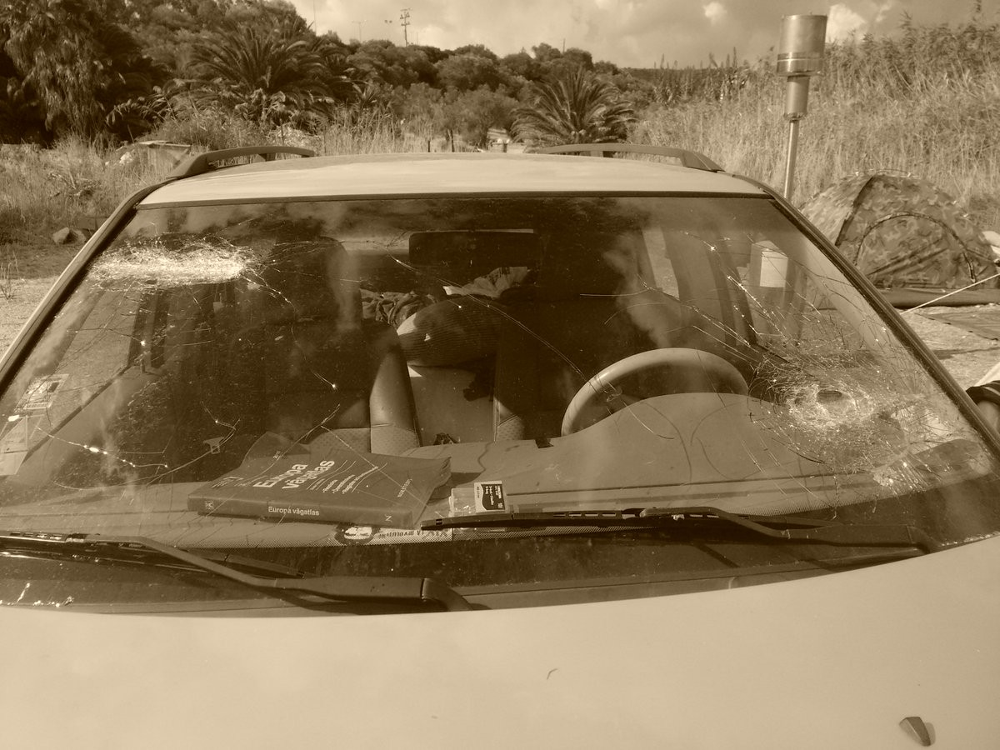
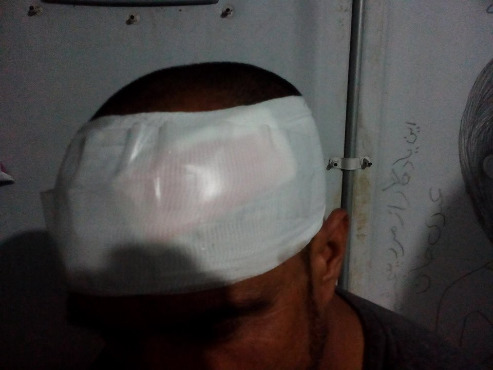
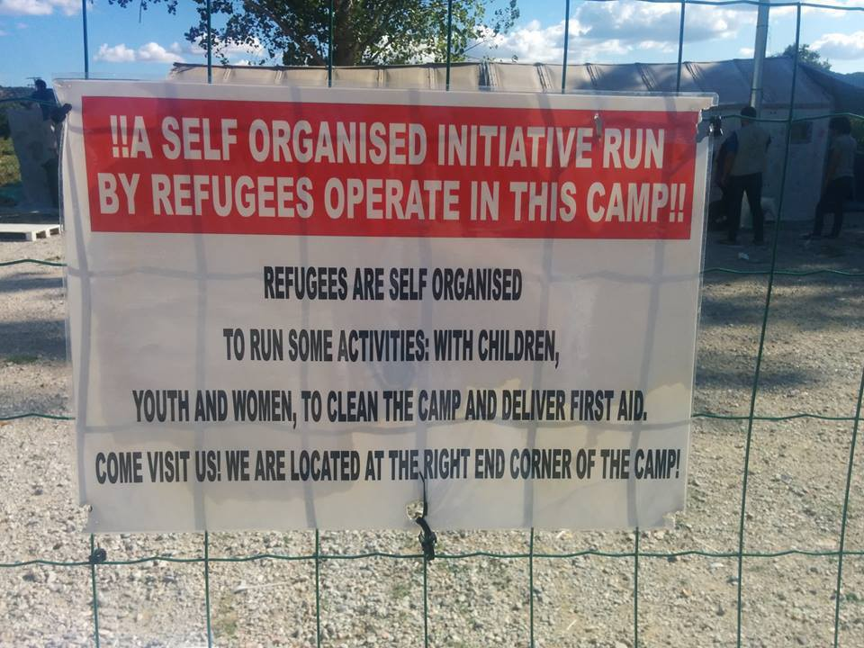
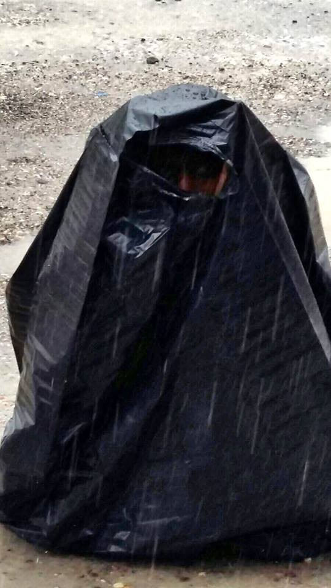

### AYS News Digest 20/9: The most urgent story of our time

> UN suspends all aid after convoy hit, civilians in Syria will pay with their lives for circumstances beyond their control\. Refugee children in Athens started school, Greek parents started boycotting their admission\. Injuries in the aftermath of the Moria fire are severe, yet denied by the Greek government\. UK teachers expected to act as border officers, inquiring children, aged 2–19, about their nationality and immigration documents\. 

](assets/456a2cfdb248/0*zsg8yMSAZ-KnDm7R.)

Credits: [**Help Refugees**](https://www.facebook.com/HelpRefugeesUK/)
#### Syria
### The UN humanitarian convoy became a target of a Syrian regime, 13 UN workers died

The pictures show an aftermath of a Syrian regime airstrike on a UN humanitarian aid convoy which was heading into besieged Aleppo\. The attack at Urum al\-Kubra destroyed 18 of 31 lorries\. This airstrike killed the director of the Syrian Arab Red Crescent, Omar Barakat, in addition to 12 other volunteers from the SARC\.

> Amnesty International: “Witnesses in Syria have told the organization that the convoy, along with the Syrian Arab Red Crescent warehouse where it had docked, were bombed intensively for two hours on Monday evening, heightening the suspicion that Syrian government forces deliberately targeted the relief operation\. If the convoy was — as it appears — deliberately attacked, this would be yet another war crime committed by the Syrian government\. It illustrates how civilians in Syria are paying with their lives for five years of total impunity for systematic war crimes and crimes against humanity\. Until the international community shows that it is serious about bringing perpetrators to justice, these appalling crimes will continue on a daily basis\.” 

](assets/456a2cfdb248/0*jka_X1PCR3wP_UPZ.)

Credits: [**Tamer Altaiar**](https://www.facebook.com/ishak.altaiar)

](assets/456a2cfdb248/0*UDlP9xVc8jyJdwgj.)

Credits: [**Tamer Altaiar**](https://www.facebook.com/ishak.altaiar)

](assets/456a2cfdb248/0*ffq-Rjs7kDfZkFxE.jpg)

Credits: [**PROACTIVA OPEN ARMS**](https://twitter.com/PROACTIVA_SERV)

> The UN has suspended all aid convoys in Syria after a devastating attack on its lorries near Aleppo on Monday\. 

### UN Emergency Relief Coordinator, Stephen O’Brien — Statement on Convoy to Urum al\-Kubra, Syria

> I am disgusted and horrified by the news that a United Nations/Syrian Arab Red Crescent convoy was hit this evening in Urum al\-Kubra, northwest of Aleppo\. Initial reports indicate that many people have been killed or injured, including SARC volunteers, as a result of these sickening attacks\. A SARC warehouse was also hit and a SARC health clinic was also reportedly severely damaged\. 

> I condemn what happened in Urum al\-Kubra in the strongest possible terms\. Notification of the convoy — which planned to reach some 78,000 people — had been provided to all parties to the conflict and the convoy was clearly marked as humanitarian\. Let me be clear: if this callous attack is found to be a deliberate targeting of humanitarians, it would amount to a war crime\. 

#### Greece
### Refugee children in Athens are back to school

](assets/456a2cfdb248/0*qGLZj3G6gH7TIaUE.)

Credits: [**Darja Babić**](https://www.facebook.com/profile.php?id=100000879563532)

**](assets/456a2cfdb248/0*LJw01Fgil7GU08iK.)

Credits: **‎ [Darja Babić](https://www.facebook.com/profile.php?id=100000879563532&fref=nf)**
### At the same time, parents at Greek elementary school oppose admission of refugee children

The parents’ association of an elementary school in the northern Greek town of Filippiada on Tuesday sent a memo to education authorities expressing their opposition to government plans to use school facilities to hold classes for refugee children staying at nearby camps\. The memo comes in the wake of a protest by parents in Oresteiada, also in northern Greece, opposing the admission of refugee children into the local school\.

In the memo, which refers to the refugees as “irregular migrants,” the parents’ association of the Second Elementary School of Filippiada lists a number of reasons why it is opposed to the measure, including fear of infectious diseases\. They also cite “educational reasons,” arguing that their children will be unable to “coexist with migrant children” who have not received any schooling for several years and have “different perceptions on the role of family, the place of women and religion to Greek children whose parents have made sacrifices to offer their children the best education\.” They also go on to argue that “100 percent” of the students at the school are Christian Orthodox and that they “will not allow religious fanaticism… that will harm our religion\.” “Icons of Christ and the Virgin, and of our saints and heroes, continue to adorn our classrooms and we expect all students to respect them,” the association said in its memo\. “The cultural chasm is so great that a violent installation of migrants in our town will only create adjustment problems,” the association adds\. “And this is likely to erode elements of our own culture, such as our national, cultural and religious identity\.”

The memo goes on to warn authorities that the association will “hold them responsible for any extreme behavior that may arise\.”

**Will these empty ideologies prevent a whole generation of refugee children from receiving education and growing into skilled adults?**
### How European inefficiency and disregard caused the fire at Moria

The yesterday’s fire at Moria camp forced the evacuation of the camp’s estimated 4000 residents, who ran into fields in the vicinity, tried to seek shelter in the nearby village of Moria — where, according to some reports, they were thwarted by disgruntled residents — and even trekked 6 kilometers to the island’s capital of Mytilene\.

Videos posted on social media on Monday night showed elderly men and women and families with children trying to flee the burning camp with little but the clothes on their backs, many squeezing through an opening in a fence as they scrambled to get away\.

Authorities on the island said that the fire was most likely started by camp residents frustrated by cramped conditions and delays in processing\. Clashes inside the camp between different ethnic groups prevented the fire service from bringing the blaze under control before it could spread\. Indeed, the fire service was called in shortly before 8 p\.m\. but firefighters were unable to enter the premises for at least half an hour because of the rioting\. Its task was also made harder by strong winds fanning the flames\.

Authorities also say that tensions have been running high at the Moria camp for some time now, but spilled over on Monday amid rumors of mass deportations to Turkey\. Deputy Minister of Citizen Protection says protests happened particularly because of the such lack of information and rumors, while the Lesvos mayor said PASOK, ND and Golden Dawn supporters propagate xenophobia and try to provoke already frightened refugees\.

Another assumed reason suggests that a group of very agitated and frustrated refugees, for the reasons of being closed in for so many months, tried to go to Mytilene centre, but the police blocked their way and returned them back to Moria camp\. The situation became tense among the refugees and the fire started in protest to being enclosed\. Before the events in Moria, the region’s governor had made an urgent appeal to relieve the overcrowded camp, which went unheard\.

Police remanded 18 refugee protesters into custody and, on Tuesday, arrested nine of them\. Because of the damaged tents and housing units, many refugees are spending the nights without shelter and food\.
### A statement by the [**Refugee Accommodation and Solidarity Space City Plaza**](https://www.facebook.com/sol2refugeesen/) **blaming** the government and police for the events in Moria

> The government and police are responsible for the explosive situation in Moria yesterday\. On the one hand, the police showed provocative tolerance to fascist bullies pretending to be “indignant citizens” — exactly as they did in Chios recently\. Fully armed riot police stood idly by as the Nazis bullied defenseless people\. On the other hand, the government \(with the EU’s blessing\) insists on the unacceptable policy of detaining refugees inside terrible camps, with no future in sight\. The explosion of violence is but a natural consequence of the deadlock in which thousands of people are trapped\. It is this same government and this same police that organized the smear campaign against solidarians, and which violently evacuated the refugee housing squats in Thessaloniki\. Now, with their acts and with their negligence, they are contributing towards the incubation of the serpent’s egg: fascism\. At this crucial moment, it is essential that we unreservedly stand on the side of refugees, that we put up an impenetrable wall against fascists, that we overthrow the government’s antirefugee policy\. 

### Fire at the Moria camp has died down, yet left nothing but devastation

The fire at the Moria camp was put out by around midnight, with initial assessments saying that around 60 percent of the facility has suffered extensive damage\. Most of the refugees have been sent back to the camp, with the exception of a few vulnerable cases who are now residing in a small improvised camp \(numbers have not been yet confirmed\) \. As many refugees returned at first light on Tuesday morning, they were faced with the sight of their tents and meager belongings reduced to ashes, and pools of mud from the water firefighters used to extinguish the flames\.

](assets/456a2cfdb248/0*wcaIkjxp8N07VRgQ.)

Credits: [**Cris Andflowers**](https://www.facebook.com/profile.php?id=100010949321328&fref=ufi)

Although the fire in Moria is out, most of the tents were wiped out\. United Rescue Aid has been transporting the most vulnerable refugees away from the fire and the ensuing chaos for the most of the night, and are now trying to provide refugees with food\. On the other hand, police has pushed refugees who escaped the fire back to the camp, but there is no plan on how to provide the refugees with what they need\. About half of the refugees have now returned to Moria\. If you are in Lesvos and have food to donate, please get in touch\. The 74 refugees who arrived to the island yesterday still remain detained in the Schengen area of Mytilene Port since yesterday morning\.
### In the fire’s aftermath, unaccompanied refugee children to be transferred from Lesvos to mainland

The government on Tuesday put into motion the transfer of 91 unaccompanied refugee children from Lesvos to the Greek mainland, following a destructive fire in Moria\. The 91 kids were transferred to a separate site at the PIKPA summer camp when rioting broke out at the government\-run Moria camp\. Several families with children were also transferred from the Moria hot spot to unofficial center run by non\-governmental organizations and the municipality at Kara Tepe, as authorities assess the damage at Moria and begin replacing shelters\.
### Local extremists attacked refugees and volunteers who were escaping the Moria fire

As No Border Kitchen reports, around 200 [fascists](https://twitter.com/hashtag/fascists?src=hash) attacked [refugees](https://twitter.com/hashtag/refugeesgr?src=hash) and their supporters in M [oria](https://twitter.com/hashtag/moria?src=hash) village yesterday\. One volunteer car was smashed but, luckily, all volunteers and refugees managed to escape the fascists’ violence\.

Credits; No Border Kitchen
### Greek government denies injuries in Moria

Volunteers report many serious injuries\. Many of them are a result of thrown rocks and fights that broke between refugees, most common among which are head injuries and broken bones\. Smoke inhalation is a major issue for refugee children, especially since fire largely broke out by the camp’s family compound\. Other common conditions include panic attacks and nervous breakdowns, especially among refugee women\.

](assets/456a2cfdb248/0*y-Ex_j8cg3dfeGL4.)

Credits: [\#advocatesabroad](https://www.facebook.com/hashtag/advocatesabroad?source=feed_text&story_id=10101968252672856)

](assets/456a2cfdb248/0*-zgGGWiD0V-97or3.)

Credits: [\#advocatesabroad](https://www.facebook.com/hashtag/advocatesabroad?source=feed_text&story_id=10101968252672856)

](assets/456a2cfdb248/1*vZWt9Cp4UElVJkDZDgkHmg.jpeg)

Credits: [\#advocatesabroad](https://www.facebook.com/hashtag/advocatesabroad?source=feed_text&story_id=10101968252672856)

](assets/456a2cfdb248/0*TKiWYrQhADKEs66b.)

Credits: [\#advocatesabroad](https://www.facebook.com/hashtag/advocatesabroad?source=feed_text&story_id=10101968252672856)

According to the Greek government, no injuries occurred during the fire, however eyewitnesses have contradicted this, as well as photos which show injuries sustained during the violence in the camp\.

Ariel Ricker \(Advocates Abroad\) has told MEE that the claim there were no injuries was “ridiculous”\. “I saw many injuries,” she told MEE via phone\. “People with respiratory problems from smoke inhalation, articularly the elderly and young, these were mainly people in the family compound\. I saw people hurt with rocks and metal rods, head injuries, some broken bones, broken fingers, we made a lot of splints\. Refugees were reluctant to go to the hospital because they were worried if they did they’d be arrested for being involved in the violence,” she added\.

However, the Greek government refused to respond, calling these statements on the extensive injuries inside the camp “hearsay’, with this unbelievable line: “What I know and what I have been told is that there were no injuries,” he said\. “Officially there were no injuries\.”
### Northern Aegean governor: “the islanders are well\-intentioned, but here’s fatigue”

“The islanders are well\-intentioned but there is fatigue,” Regional Governor of the North Aegean Christiana Kalogirou of Nea Dimokratia told Skai TV on Tuesday, referring to a protest on Monday by local residents of Moria\.

> “The Northern Aegean cannot bear such a burden alone and neither can Greece\. Europe has not responded to its commitments\. This is a humanitarian issue, but there is also the question of the burden on the local economies and communities, Kalogirou said, warning that the islands of the region are currently hosting more than 10,500 refugees when they have facilities for half that number\. “Measures must be taken immediately; there is no time to lose,” she said, adding that an uptick in arrivals from Turkey is further exacerbating the situation\. 

### Volunteers struggle to meet the refugee needs in the fire’s aftermath

Please consider a contribution or a donation to [movementontheground\.com/donations](http://movementontheground.com/donations) \. If ever, the Moria refugees need the help now\!

The top 5 priorities at the moment are the following:
- Tents \(storm proof\)
- Sleeping bags
- Underwear, all sizes
- Shoes, mainly for men 40–44
- Food

The items can be shipped to:
- The Kempsons: Eric Kempson, Eftalou, Molyvos, Lesvos, Greece, 81108/ please call in advance to the phone number 0030 22530 72004 for proper coordination\.
- SAO — ATTIKA warehouse: Larsos 81100, Lesvos — Greece, C/O Aris Vlachopoulos Mob: \+30 6945 985 788
- Local shops that might supply: [http://aegeanshopping\.com/](http://aegeanshopping.com/) \(Meaning that you can buy the items online at different local shops and send them to the mentioned warehouses\)

Medicine List
- Ibuprofen tb’ \-Mesulid tb, \-Voltaren tb ,\-Comtrex tb ,\-Proctosynalar cr\.,\-Daflon 500mg \-Synalar Otic \-Augmentin 625 \+ 1gr \-Tegredol 200mg \+ 200mg CR \-Depakine 500mg ,\-Glucophage 850mg \+ 1000mg , \-Filicine tb ,\-Ferrum tb \-Atrovastatin ,\-Valsartan ,Xozal syrup \+ tb \-Tobradex \+ Tobrex coll\. Paracetamol 500mg \+ syrup, Betnovate cream, Panthenol cream, Ranitidine inj Zinadol tb 500mg \+ syrup Ciproxin 500mg tb
- **Injections:** \-Apotel IM \+ IV \-Celestone Chronodose \-Voltaren _Insulins:_ \-Novomix ,\-Novorapid ,\-Lantus ,\-Actrapid \(1 πακετο\) ,\-Humulin 70/30 \+ NPH

](assets/456a2cfdb248/0*8wfPNLaPQuNExWII.)

Credits: [**Movement On The Ground**](https://www.facebook.com/movementontheground/)
### UNHCR statment on the fire

[Here](http://www.unhcr.org/news/briefing/2016/9/57e0fbfc4/fire-reception-site-lesvos-island-greece.html) is a link to the summary of what was said by UNHCR spokesperson William Spindler at today’s press briefing at the Palais des Nations in Geneva\.
### EU Commission spokesperson, Natasha Bertaud: “refugees will remain on Lesvos as long as possible”

During a press conference on Tuesday, the EC coordinating spokesperson, Natasha Bertaud, revealed the well\-hidden plans\. To avoid secondary movement to the rest of Europe, the European Commission will aim at keeping asylum seekers on the islands for the most part\. Transfers to the mainland would remain limited, Bertaud said\.

Credits: Vocal Europe
### Greek authorities will send a ship to house refugees on the island after fire destroys refugee tents

Greek Maritime Affairs ministry officially announced the ferry rental where the refugees of Moria will be housed for the next month\. The merchant marine ministry launched an urgent tender for a ferry that could accommodate at least 1,000 people and reach Lesvos by Wednesday\. Minister Thodoris Dritsas said families would be granted priority on the vessel, while different ethnic groups would be kept apart\. Officials said people who couldn’t get ferry berths would be housed in new tents at Moria\.
### Refugees turning camps into living spaces

Activities, ranging from educational to environmental, can now be find in many camps, an example of which is shown bellow and found in Lagkadika\.

Credits: Cicilie Bråten DiO
### Dancing classes for Kavala female refugees

Northern Lights Aid organises dancing and aerobics classes for Kavala refugee women three times a week\. The turnout is always great, with about 20 women showing up for the classes\! Their goal is to learn the cha cha slide, and they thank everyone for donating yoga mats, rubber bands, TRX and medicine balls which will diversify their training and dancing styles\.

Though entertainment sometimes doesn’t seem as a crucial need, many refugees would not be able to keep moving forward without a periodic laughter and relaxation\. If you would like to support this group, please visit [their website](http://www.northernlightsaid.org) for more details\.
### Resources for finding cheap rental accommodation in Greece

1\) [www\.homegreekhome\.com](http://www.facebook.com/l.php?u=http%3A%2F%2Fwww.homegreekhome.com%2F&h=JAQF75ih3&s=1&enc=AZM8Z1aUrMXAMKsBl1x1l3h4QdI1x6rCvD65e9qEKcnqJLZNOAl9J3GcVAOEkZxS23NoREaLTMxLudXqYQNRvknV&hc_location=ufi) 
2\) [www\.xe\.gr](http://www.facebook.com/l.php?u=http%3A%2F%2Fwww.xe.gr%2F&h=BAQHUFQgy&s=1&enc=AZOGWN0WBFZtSNNMX0vz3lEdltkPBFrJ8mmtQZmFuTE8cj8NKP9-YoDFVz8_w9Qkrh-aMyhnFSfOUVPlNBmnx2Hc&hc_location=ufi)
### List of appointments with Asylum Service has been released

](assets/456a2cfdb248/0*E1OfAXLula2z4QGy.)

Credits: [**Mobile Info Team for refugees in Greece**](https://www.facebook.com/mobileinfoteam/)
### Information for those refugees concerned that they may have a second registration interview

Refugees do not have a second registration interview, rather, they ought to wait for the Asylum Service to contact them when their relocation or family reunification has been accepted\.

Please see the following article for more details on the numbers:
[https://newsthatmoves\.org/en/explaining\-protection\-cards/](https://newsthatmoves.org/en/explaining-protection-cards/)

Website for checking:
[https://search\.rescueapp\.org/\#/](https://www.facebook.com/l.php?u=https%3A%2F%2Fsearch.rescueapp.org%2F%23%2F&h=UAQH-rAgBAQEQlbVu7rozE7kTr6kPjG3u7izdmEcJG7rUhg&enc=AZM8RnmTBKehtGDOydmIsShzu_6o-3c0-tfzSMXIUjzn4jPwscezsxtD3h17yv4Zg3W-0xSvWLcfCtFXD6op_jG8KdZxXzMHo61kEHoxWe8TEN7Lfaf_DD_JxtyyqO1VuBFpDB6JwbJyUrDgfMuMdA7k7izxXHuYoGpGC3MX1Pd-Uw&s=1)
### More information on the interview

Refugee applicants that have a case number belong to the following categories
- Persons that are eligible for the Relocation program\. These are not required to have an interview\. All relevant data is collected on the day of the full registration\.
- Persons eligible for a transfer to another European country under the Dublin Regulation\. These have to present themselves on a scheduled day for a short interview or for renewing their asylum cards\.
- Persons under normal proceedings, meaning that their asylum claim will be examined in substance in Greece\. These have to have an interview before a decision for whether they are entitled to asylum in Greece is taken\.
- Syrians with national passpots\. These can choose to enter the Fast\-track program, meaning that they can be recognized as refugees on the same day that they are being registered\. All is needed is their full registration and no discreet interview takes place\.

Therefore, the date of full registration is not the same as the date of a personal interview\. An interview is required only under the normal examination process\.
### Urgent request from the Greek Asylum Service

> “It’s very important that asylum seekers share the responsibility for their future, being **more accurate with timing** of arrival for the interviews; i **f they don’t get on the buses early enough to arrive for their full registrations in time, they will not be registered\.** 

> For now, individually arriving POCs and buses continue to arrive after 10 am every morning; — Asylum Office staff keep being asked whether they can replace the asylum seeker IDs for those who say the have lost them\. **The answer is no\. If they claim the Asylum service card to be lost, they will be rescheduled for the later time in 2017;** \- 

> Asylum staff see that many people do not turn up for their full registration, and among those who do, some do not want to register fully, there were quite a few cases in Piraeus yesterday\. Apparently, they think that if they get fully registered in Greece, they cannot move to other countries\. However, people apparently have not understood that since they have been finger\-printed by the police, they will be returned to Greece anyway\. But by the time the POCs realize this, they will start calling frantically skype again, and then complain that ‘it is not working’\. Meanwhile, the precious few human resources are wasted\.” 

### Official numbers for 20/9

Newly registered refugees on the islands
- Lesvos: 38
- Chios: 27
- Total: 65

Lesvos has now hit the record number of 5708 refugees in total\.

Changes during the last 24h
- Two voluntary returns, which makes 83 voluntary returns in this month
- The number of refugees in Softex raised from 1339 to 1600 \( \+261\)
- The number of refugees in northern Greece raised from 16188 to 16453 \( \+265\)
- The number of self\-settled refugees dropped from 8150 to 7800 \( \-350\), which may be an explanation for the changes above
- The number of refugees in Skaramagas dropped from 3450 to 3350 \( \-100\)
- The number of refugees in UNHCR apartments \(so called accomodation places\) raised from 4638 to 4750 \( \+112\)
- The island of Mikonos, which has previously held one refugee, has now been deleted from the official list
- There were 65 registrations on all of the islands, as indicated above, but the total count raised from 13536 to 13619, which makes for \+83 new arrivals during the last 24h

#### Serbia
### Another rainy season is coming, still no solution for proper refugee shelters

It was raining yesterday in northern Serbia and, as organisations run out of raincoats, refugees used everything available to cover themselves\. Funding and donations are urgently needed for autumn clothing and protection from the rain\!

](assets/456a2cfdb248/1*22OLrqVZwYIi0OFVBUWkNg.jpeg)

Credits: [**Fresh Response**](https://www.facebook.com/freshresponseserbia/)
#### Hungary
### New Human Rights Watch report: Hungary is failing to protect vulenrable refugees

Part of a report claims that [Hungary](https://www.hrw.org/europe/central-asia/hungary) is keeping many of the most vulnerable asylum seekers stranded on its border in poor conditions for weeks while they wait to enter the country and file their claims\. Some said that border officials had used excessive force against them\.

Moreover, Hungary has imposed a daily cap on the number of asylum seekers who can enter Hungary to present asylum claims, and a July 5, 2016, law allows push\-backs of people found to have entered the country irregularly\. This means that even especially vulnerable people are being sent back to the Serbian border and spending weeks in poor conditions there as they wait to enter\.

Read a full report [here](https://www.hrw.org/news/2016/09/20/hungary-failing-protect-vulnerable-refugees) \.
### “Did you know that the average Hungarian sees more UFOs than refugees in a lifetime?”

It’s part of a satirical campaign with a serious purpose: To oppose the government’s anti\-immigration rhetoric and policies ahead of a controversial referendum on migrants\.

The Two\-Tailed Dog Party, a grassroots activist group that often wields humor as a political weapon, issued a call to the public for donations in order to create the campaign\. More than 4,000 Hungarians responded with their wallets, donating about 100,000 euros to finance the satirical posters\. It’s an unusual display of dissidence\.
### News from the refugee camp in Bicske

> [**MigSzol Csoport**](https://www.facebook.com/migszolcsoport/?fref=nf) **writes :** “Many of the refugees described how they had come to the camp in the recent weeks after being released from the prisons in Kiskunhalas and Bekescsaba\. They all said that the camp is a good place, now — they all have their own rooms, the food is good, and they get weekly allowance money\. They said they can sleep in peace in the camp\. Given this positive feedback \(and we would like to extend our gratitude to the person managing the camp\), we are only left to wonder, why does the government so vehemently try to close the camp?” 

#### Slovenia
### A refugee testimony on racism and discrimination he experiences in Slovenia

> Last Thursday, one of our friends was attacked by three neo\-nazis in the center of Ljubljana at 10 in the morning\. Another guy was hit by car in front of the asylum home in Vic and the police is not solving this as racist attacks\. One of the guys was waiting for two hours for the emergency to come, and doctors did not allow us to go inside, just because we are refugees\. Everyday we are facing racism on the streets, in the asylum home, and in governmental institutions\. 

> In the asylum home, strict rules are limiting our freedom, the food is not good, no cleaning service, no language courses, they are not helping us with enrolment in the educational system, no medical care except Painkillers\. At closed type of institutions like Asylum homes we are deprived of our dignity and self\-initiativeness\. The racism of security guards makes us uncomfortable, the atmosphere is more like a prison than a place to live\. Even if we have not received a status yet, we are not criminals\. 

> When we come to a bank and want to open a bank account, they tell us that they cannot do it for us, because they think we might support terrorism with our money, and this is pure racism\. 

> Special thanks to the Slovene health system to send us a young doctor without specialization to practice her medical skills on us\. 

#### Austria
### Austria wants Turkey\-style refugee deal with Egypt

Austrian chancellor Christian Kern said the EU should conclude a refugee deal with Egypt mirroring the one with Turkey, under which the bloc gives Ankara money so it stems the flows of migrants\. “The EU must have an interest in stabilising the region,” Kern said on Monday\. Austria fears asylum seekers could start coming to the EU from Egypt next year\.
#### Germany
### Another attack on a refugee shelter

In Bremen, a yet uninhibitated container shelter has been set on fire with molotov\-cocktails in the night from Monday to Tuesday\. Four of the 80 containers completely burnt out, twelve have been damaged\. State security is investigating the case\.
#### France
### Demolition of refugee shelters has far reaching effects on them as they get flashbacks of their homes being demolished back in their countries

This is “Abdo” a 26 year old Sudanese man who left Sudan shortly after the militia arrived at his village\. He said they razed everything to the ground\. “Even the trees were on fire\.” Everyone just ran and in the confusion he was separated from his family who he hasn’t seen since\.

In February when the French police demolished his small shelter in the southern zone of the jungle it brought back these painful memories\. Once again there was nothing he could do to stop the destruction of the tiny bit of normality that was his life\. Once again he was subject to violence and fear\.

After they had gone we had nowhere for him to sleep so I led him to the mosque\. I offered him some food and a blanket\. He sat on the floor and turned away the food I had brought for him\. He said “I don’t care any more\.” Not even enough to eat\. I never want to see a grown man that despondent again\. He had given up all hope\. This is just one reason why demolishing their homes is such a cruel thing to do to a refugee\. They are here because they lost their homes once\.

Don’t let it happen again\. Please sign the petition and stop the demolition\! [http://bit\.ly/savethecalaiscamp](http://l.facebook.com/l.php?u=http%3A%2F%2Fbit.ly%2Fsavethecalaiscamp&h=BAQHUFQgyAQGtshCuK0Rv96nulmzviIrERqAh2TscGZptCQ&enc=AZODo8sfkmev9o-vxE3FBI6Qy4zzOrjZmDjjpu5qYn0gS-TTVhFAGNISMwt2E2zp8JfsWEqZ7uf_aSuMUqb7W9WQGWMYAg_iwJcVFCxWv7YDIGQDkq5iPC3lXypX1wKvK0NxCsaJlqDAEUgC7FfmrTKPkOW8n2B4Q5F0S67PnOD9AEb7znp6lHZxQ8Zh7EwM8tU&s=1)

](assets/456a2cfdb248/0*K_AbcxkHkNrNwJGe.)

Abdo\. Credits: [**Care4Calais**](https://www.facebook.com/care4calais/)
### Infographics on the “Jungle” children

](assets/456a2cfdb248/0*h1aBAYjqnof8HwyY.)

Credits: [**Help Refugees**](https://www.facebook.com/HelpRefugeesUK/)

](assets/456a2cfdb248/0*ZedLL7Qyl-EHr1iZ.)

Credits: [**Help Refugees**](https://www.facebook.com/HelpRefugeesUK/)

](assets/456a2cfdb248/0*YJWGeAQke0TMspUx.)

Credits: [**Help Refugees**](https://www.facebook.com/HelpRefugeesUK/)
### Work starts on wall near Calais ‘Jungle’ migrant camp

Building work began Tuesday on a wall in the northern French city of Calais to clamp down on repeated attempts by refugees to stow away on trucks heading for Britain\. The British\-funded wall, one kilometre \(half a mile\) long and four metres \(13 feet\) high, will pass within a few hundred metres of the “Jungle”, which charities say now houses more than 10,000 people\. The concrete wall will extend the wire fences that already run down each side of the main road leading to the city’s port\. It has been widely criticised by rights groups, and by local residents who say it will fail to stop migrants from trying to board trucks\. Britain is paying the 2\.7 million euro \($3 million\) cost of the wall, which local authorities in Calais say will be completed by the end of the year\.
#### UK
### Teachers as border agents?

The requirement on schools to ask for immigration data on kids aged 2–19 was introduced by the Department for Education \(DfE\) last May, so that it can assess the impact immigration is having on schools in the wake of an inquiry into ‘education tourism’ announced in 2015\. The fear among campaigners is that in the aftermath of the poisonous debate around immigration during and after Brexit \-especially with Theresa May’s refusal to guarantee the rights of EU citizens currently resident here — this data may be misused for ideological reasons and make teachers effectively border agents\. The Against Borders for Children campaign has launched a new website calling for teachers and parents to boycott the collection of immigration data through the school census this October\. Parents are not legally obliged to supply the data and the campaigners are calling for the DfE to scrap the new requirement amid fears that the data may be shared with the Home Office and used for immigration enforcement purposes\. Check out the [Facebook](https://www.facebook.com/schoolsabc/) page , and the campaign website [here](https://www.schoolsabc.net/) , which supplies template letters to your school, your board of governors, and your MP\.
### How many more children need to die in trying to reach the UK?

Last Friday morning, a 14 year old boy was killed in Calais as he attempted to climb aboard a lorry to the UK\. He had a legal right under the Dublin regulations to enter the UK as his brother lives here, but delay after delay made him resort to taking a terrible risk\. He is the third refugee child to die in Calais this year\. Children in Calais can legally enter the UK but government idleness allows such tragedies to happen\. Please let your MP and councillors know that you demand action: [http://writetothem\.com/](http://l.facebook.com/l.php?u=http%3A%2F%2Fwritetothem.com%2F&h=VAQGxRuhB)
#### Mediterranean
### Mediterranean refugee crossings down, but UN fears deaths on rise

Fatalities among refugees attempting to cross the Mediterranean to Europe could outstrip last year’s total even though total numbers fell in the first nine months of this year, the UN said Tuesday\.

> “The number of refugees and migrants reaching European shores this year passed the 300,000 mark today,” William Spindler, spokesman for the UN refugee agency \(UNHCR\), told reporters\. 

](assets/456a2cfdb248/0*ALeP7p4Rre51QOZZ.jpg)

Credits: [Proactiva Open Arms](https://www.proactivaopenarms.org/)

While that is well down on last year’s January to September total of 520,000, fatality rates had risen, with 2016 on track to be “the deadliest year on record in the Mediterranean Sea,” the agency added\.

So far, 3,211 people have been reported dead or missing on the Mediterranean in 2016, just 15 percent lower than the total number of fatalities for all of last year \(3,771\), a UNHCR statement said\.
#### US
### President Obama: U\.S\. Will Accept 110,000 Refugees From Around the World

President Obama announced Tuesday the U\.S\. will accept 110,000 refugees from around the world in the coming year, a [nearly 60% increase](http://time.com/4492775/white-house-refugee-increase-2017/) in the number of refugees that were welcomed over the past year\.

Obama called the global refugee crisis a “test of our common humanity” during an an address at a summit on refugees during the United Nations General Assembly meeting in New York\. He urged all leaders to do more to take in those who are being driven out of their homes in droves as a result of conflict in Syria and other Middle Eastern and Northern African nations\.

World leaders will accept 360,000 refugees from war\-torn areas over the course of 2017, with Germany and Canada among the countries accepting the most\. The U\.S\. will begin to accept the 110,000 new refugees in fiscal year 2017, which starts on Oct\. 1\.
#### UN
### World leaders met at the UN to discuss refugees, but they mostly talked about keeping them out

As the 71st United Nations General Assembly kicked off in New York, world leaders are tackling what is arguably the most pressing international emergency of the moment: refugees and migrants\.

The New York Declaration contains bold commitments both to address the issues we face now and to prepare the world for future challenges\. These include commitments to:
- Protect the human rights of all refugees and migrants, regardless of status\. This includes the rights of women and girls and promoting their full, equal and meaningful participation in finding solutions\.
- Ensure that all refugee and migrant children are receiving education within a few months of arrival\.
- Prevent and respond to sexual and gender\-based violence\.
- Support those countries rescuing, receiving and hosting large numbers of refugees and migrants\.
- Work towards ending the practice of detaining children for the purposes of determining their migration status\.
- Strongly condemn xenophobia against refugees and migrants and support a global campaign to counter it\.
- Strengthen the positive contributions made by migrants to economic and social development in their host countries\.
- Improve the delivery of humanitarian and development assistance to those countries most affected, including through innovative multilateral financial solutions, with the goal of closing all funding gaps\.
- Implement a comprehensive refugee response, based on a new framework that sets out the responsibility of Member States, civil society partners and the UN system, whenever there is a large movement of refugees or a protracted refugee situation\.
- Find new homes for all refugees identified by UNHCR as needing resettlement; and expand the opportunities for refugees to relocate to other countries through, for example, labour mobility or education schemes\.
- Strengthen the global governance of migration by bringing the International Organization for Migration into the UN system\.

The New York Declaration also contains concrete plans for how to build on these commitments:
- Start negotiations leading to an international conference and the adoption of a global compact for safe, orderly and regular migration in 2018\. The agreement to move toward this comprehensive framework is a momentous one\. It means that migration, like other areas of international relations, will be guided by a set of common principles and approaches\.
- Develop guidelines on the treatment of migrants in vulnerable situations\. These guidelines will be particularly important for the increasing number of unaccompanied children on the move\.
- Achieve a more equitable sharing of the burden and responsibility for hosting and supporting the world’s refugees by adopting a global compact on refugees in 2018\.

However, while the heads of state agreed on paper to work hard to protect refugees, many of the speeches and comments seemed more concerned with how to stop them\.

British prime minister Theresa May [attacked economic migrants](http://www.bbc.com/news/uk-politics-37405598) and called for stronger borders, and said that refugees should have to apply for asylum in the first safe country they reach, which is seldom the UK\.

Donald Tusk, president of the European Council, was more moderate [in his speech](https://www.neweurope.eu/press-release/speech-by-president-donald-tusk-at-the-un-summit-for-refugees-and-migrants/) , but stressed the need to “restore order” at Europe’s borders, ushering in “a new pragmatic approach and a shift towards a global system of more orderly movement, where the responsibility is shared and where no one will bear the burden alone\.”

Among Asian countries, China pledged a further [$100 million](https://www.yahoo.com/news/china-pledges-additional-100-million-humanitarian-aid-refugees-145024116.html) for refugee aid on top of a $1 billion fund announced last year in support of the UN’s work\. [Japan pledged](https://www.japantoday.com/category/politics/view/japan-pledges-2-8-billion-in-refugee-aid-over-three-years) $2\.8 billion over three years\. Neither offered to take in any refugees\.

Australia — which has been criticized for its treatment of [asylum\-seekers on the island of Nauru](https://www.theguardian.com/australia-news/2016/aug/10/the-nauru-files-2000-leaked-reports-reveal-scale-of-abuse-of-children-in-australian-offshore-detention) — defended [its tough immigration policies](http://www.abc.net.au/news/2016-09-20/australia-urges-un-nations-to-adopt-its-border-control-policy/7860160) , claiming they give citizens more confidence in accepting migrants and refugees\.

As Nobel laureate [Malala Yousafzai](http://www.usatoday.com/story/news/politics/2016/09/19/obama-final-visit-united-nations-focus-refugees/90624454/) noted, “the declaration does not include any new, substantive commitments for refugees” — and if the first day of its existence is anything to go by, not only will it not change the facts, it will fail to change attitudes, too\.
#### General
### Volunteers needed to conduct field research in France and Greece from 5 to 13 November 2016

The Refugee Rights Data Project \(RRDP\) is a non\-governmental organisation and registered UK charity working to fill the information gaps relating to refugees and displaced people in Europe\. Read more and apply [here](https://docs.google.com/forms/d/e/1FAIpQLSdv3L4oFV00iqj_3O4XYSH8bogi-787oM5Iu6Fg0izvkCDYhA/viewform) \.
### The refugee camp “de La Liniere” in Grande Synthe \(France\) is in urgent need of volunteers

Almost all large organizations have left the camp\. MSF left the camp a couple of weeks ago and no organization wanted to take the lead after that\. Currently there are only 8 volunteers of Kesha Niya Kitchen onsite to help the 1000 refugees almost alone\. Your help is needed\! If you are interested in becoming a volunteer get in touch with IHA or Kesha Niya Kitchen directly\.

_Converted [Medium Post](https://areyousyrious.medium.com/ays-news-digest-20-9-the-most-urgent-story-of-our-time-456a2cfdb248) by [ZMediumToMarkdown](https://github.com/ZhgChgLi/ZMediumToMarkdown)._
