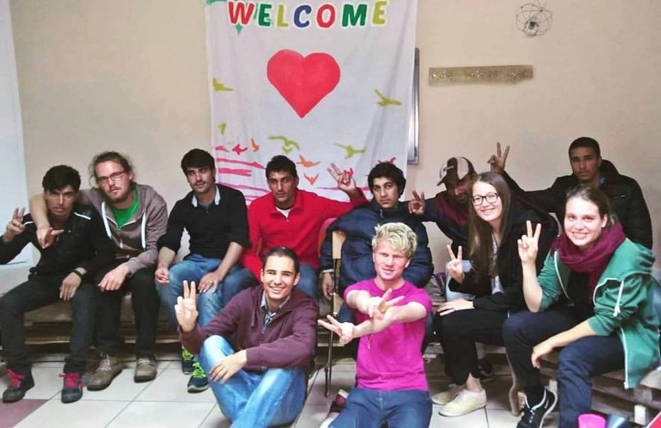
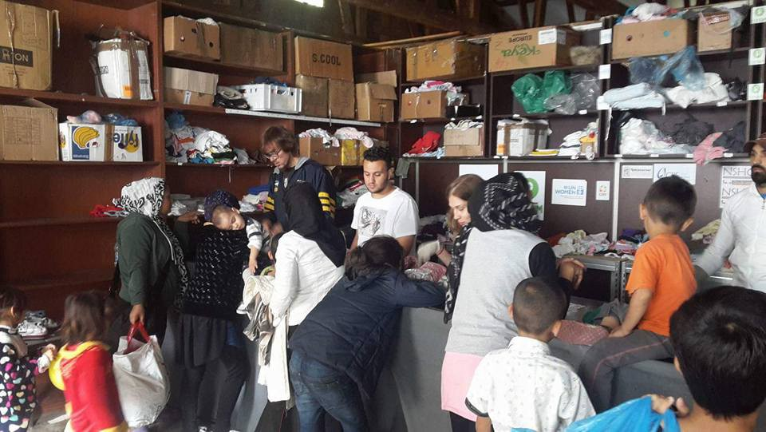
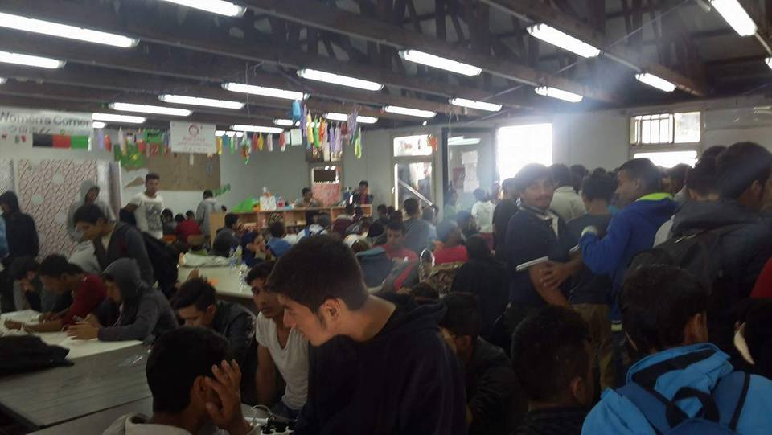
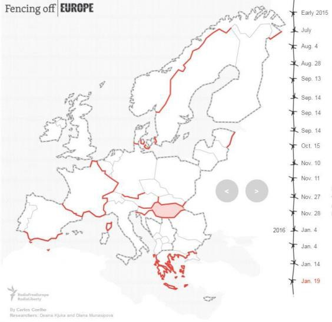
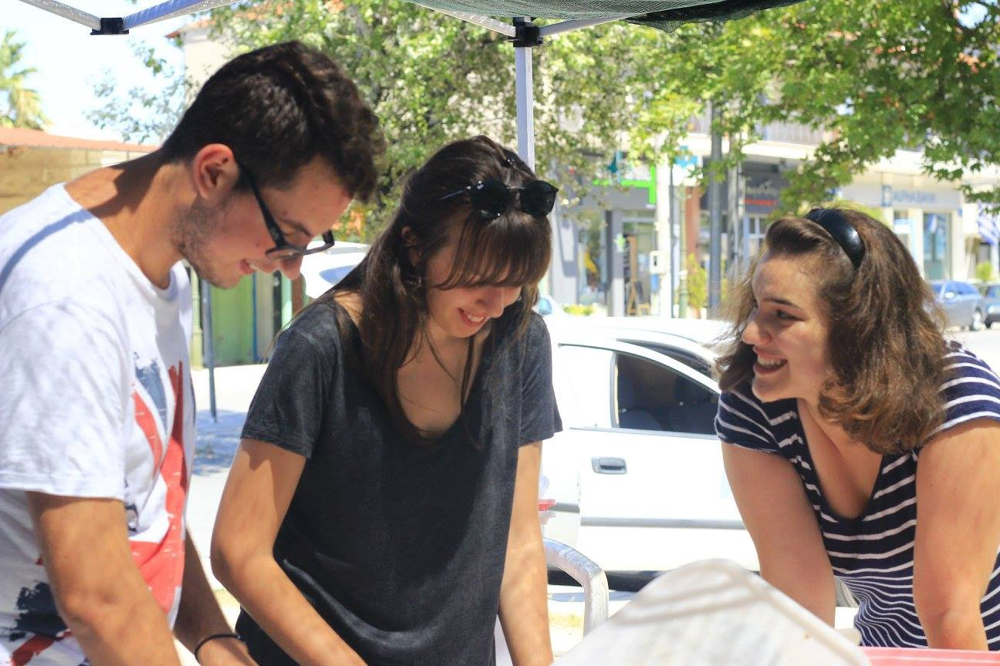

### AYS Digest 22/09: 2016 will be the deadliest year on record in the Mediterranean Sea — Mayday\!

_Greek islands mark new arrivals, as international organizations once again warn about the appalling conditions\. Serbia struggling to deal with the latest surge of arrivals\. Calais evacuation plan out\. While White helmets lose lives to save others, the international community awards them with a prize and is reluctant to help those whom they had saved\._

](assets/ece48948f6d8/1*KvkeCNWVXNb_vnrjoIEwzQ.jpeg)

Photo by: [Through Refugee Eyes](https://www.facebook.com/throughrefugeeeyes/?fref=ts)

3211 people died this year trying to reach safety on the other side of the Mediterranean\.

According to the UNHCR [Report](http://www.unhcr.org/news/briefing/2016/9/57e0fb264/300000-cross-mediterranean-year-unhcr-calls-admission-pathways-refugees.html) , the number of people reported dead or missing so far this year is only 15 % lower than the total number of casualties for the whole of 2015\.
### Unceasing efforts to urge faster relocation and to raise awareness in the West of the situation embarrassing for the human kind — are they futile?

Fast and effective relocation from Greece and Italy to other European countries is not only the officially agreed plan by the EU member states, but also the only immediate way \(apart from the obvious\) to address irregular secondary movement and reliance on smuggler networks\. 
So far, less than 5,000 asylum\-seekers have been relocated from Greece \(3,791\) and Italy \(1,156\), which constitutes only 3% of the original target\.
**It will take 18 years at the current rate to fulfil relocation pledges\.** 
Due to such a slow procedure,horrible conditions in most camps, everyone turning the blind eye to the fastest growing business of smuggling and — going back to the beginnings — seemingly unstoppable global arms trade, a large number of people continue to risk their lives and lives of their children by walking the dangerous paths, woods and roads to reach a safe place\.
#### GREECE

> The people stranded in Greece are living in “appalling conditions” and face “immense and avoidable suffering” 

Another report shaming the European countries for their lack of political will and poor response to the refugee crisis, along with the recent [harsh critics](http://www.ekathimerini.com/212236/article/ekathimerini/news/juncker-lashes-states-over-refugee-failings) from the president of the EC, comes from [Amnesty International](https://www.amnesty.org/en/documents/eur25/4880/2016/en/) \. 
“The organization noted with regret that Greece’s current response to the refugee crisis, including the European Union \(EU\) \-Turkey Agreement of 18 March 2016, is not consistent with international human rights and refugee law, including the principle of non\-refoulement\. Amnesty International urges Greece to refrain from returning asylum\-seekers to Turkey under this deal\.”

Lesvos, Greece 21 September 2016 
“This is no camp\. It’s a prison\. We live like animals here\.” \(Photo credit: Savvas Karmaniolas\)
### Stop fanning the flames on Lesvos — a [statement](https://legalcentrelesbos.wordpress.com/2016/09/22/eu-and-greece-stop-fanning-the-flames-in-lesbos/) by the Lesvos Legal Centre

> The fire and destruction in Moria camp on 19 September is indicative of an already volatile situation, and unless concrete action is taken, we are concerned that refugees and migrants will continue to face violations of their rights\. 
 

> We urge immediate action to protect the rights of refugees and migrants, and process their applications for protection in Europe in accordance with European and international law\. 

#### Arrivals

92 people were registered arriving to the Greek islands by 7:30 in the morning on Thursday, according to the official government statistics: 50 on Lesvos, 19 on Samos and 23 on Kos\.

125 arrivals were registered on the island Chios during the morning, according to the Chios Eastern Shore Response Team\.

 **\)**](assets/ece48948f6d8/1*WJhFSzoNRyWGscfIJNt-7w.jpeg)

Arrivals on Chios \(Photo: [**Salvamento Marítimo Humanitario**](https://www.facebook.com/smhumanitario/) **\)**

Citizens’ Protection Minister Nikos Toskas on Wednesday visited a new annex of a facility in Amygdaleza, north of Athens, which is exclusively for migrants who want to return to their homelands, Ekathimerini [reports](http://www.ekathimerini.com/212223/article/ekathimerini/news/amygdaleza-annex-to-host-departing-migrants) \. 
Greek government is expecting from the Greek IOM, that runs voluntary repatriation scheme, to provide decent living conditions at the infamous facility\.
#### Serbia
### A shift in the approach — The Daily Center for Refugees

The [Daily Center for refugees](https://www.facebook.com/izbegliceusrbiji/) in Belgrade opened in this September and more than 70 refugees visit them daily\. It was formed by a small group of diverse, but experienced volunteers and their aim to provide a place to relax, get together for cultural and sport activities, learn languages, use the internet, take a shower and have a warm beverage\. They also plan to prepare and serve warm soup for the refugees\. Apart from the great need for [financial support](http://refugeesfoundationserbia.com/donateinstruction.html) , they could also use: male shoes, underwear, trousers, backpacks, beanies and gloves\.

The Daily Center for Refugees team

539 people were reported arriving to Refugee Aid [Miksalište](https://www.facebook.com/RefugeeAidMiksaliste/?fref=ts) in Belgrade today, seeking food and shelter\. This number includes **416 minors** , **86 women and 37 men** \. Most of them came from the Bulgarian border, muddy, exhausted, hungry and traumatized, volunteers report\. These figures mark a record number of arrivals and they are running out of almost everything needed to welcome refugees at their centre\. That is why, for the time being, they will only serve families with children and unaccompanied minors\.

Photos: Miksalište
### Stop the war, not refugees

On the occasion of the World Peace Day and in solidarity with the refugees, members of the Women in Black movement organized a performance in Belgrade city centre demanding the shift of attention to stopping the war, rather than the refugees\. That was also a way to point out the wrong turn in the refugee politics that was announced also by the Serbian officials, that includes a possible fence or a wall between Serbia and Bulgaria, Radio Free Europe [reports](http://www.slobodnaevropa.org/a/beograd-zene-u-crnom/28004978.html) \.
#### Hungary
### “See the person”

The fight against the government’s propaganda in Hungary continues\. In days leading up to the protest ahead of the discriminatory referendum proposal, there is a [campaign](http://444.hu/2016/09/22/alfoldi-az-en-hazam-olyan-hely-amelyik-nem-rugdos-bele-a-segitseget-kerokbe) urging the Hungarians to see the man instead of a refugee, “an invader”, “a foreigner”,…\.

> “I really love my country\. And I believe that my country is a place that is not kicking out those who turn to them for help\. My country is also a place where people live who are able to see others in distress\.” 

On behalf of a number of Hungarian NGOs, Hungarian director Alföldi Róbert said this at a press announcement today, adding that it is important that people who think this way can see their voices heard and know that **they don’t stand alone** \.

> “Freedom is invincible at the end\. No wall can permanently withstand the desire for freedom” 

This was proclaimed by Christian Wolff, German president at the time, during the grand festival event marking the 25th anniversary of the fall of the Berlin wall\.

Fencing reminder \(Image: Radio Free Europe / Carlos Coelho\)

Only two years afterwards, Europe has set what was just recently an unimaginable image of the continent\. A lot to explain to the future generations looking at the topographical maps of the old continent\. The refugee crisis has tested the humanitarian tolerance of Europe and beyond, as pointed out in this [video story](http://www.euronews.com/2016/09/22/fortress-europe-builds-barriers-to-stem-the-refugee-flow?utm_source=dlvr.it&utm_medium=gplus) about _Fortress Europe_ \.
#### ITALY
#### Eritrean smuggler on trial in Italy

Authorities have [reportedly](http://palermo.repubblica.it/cronaca/2016/09/21/news/traffico_esseri_umani_a_giudizio_a_palermo_boss_eritreo-148248646/) identified Medhanie Yehdego Mered, as the man alleged to be a 35\-year\-old smuggler known as “the general”, earlier accused of sending thousands of migrants to Europe and hundreds to their deaths at sea\. He will face trial in Italy with the first hearing on November 16\.

 **\)**](assets/ece48948f6d8/1*FcxsXaeudjWzzb0qxO_Iig.jpeg)

“Camp is no solution\.” \(Photo: [**WelCom — Osservatorio Migranti Como**](https://www.facebook.com/osservatoriomigranticomo/) **\)**
#### Nobody wants to be forgotten

The newly opened refugee centre in Como has reached its capacity of 300 people in just two days and has taken in even more people\. The ones who refused to enter the centre in via Teodolinda preferred to continue their journey during the night, leaving empty tents in San Giovanni\.

> This is a turning event for Como, one phase is ending and another one is begining\. However, we should keep in mind that restoring “decency” and “public order” does not solve the problem\. Oromo people who refused to move to the centre said “we do not want to enter the centre because we don’t want to be forgotten”\. 
 

> It is our duty to keep on working, in order to avoid keeping “the problem” away from the city’s eyes\. — Osservatorio Migranti Como 

](assets/ece48948f6d8/1*jiUnVASsAnCAg198u0mqog.jpeg)

Photo: [**WelCom — Osservatorio Migranti Como**](https://www.facebook.com/osservatoriomigranticomo/)
#### France
### The evacuation plan for the Jungle is under way

Minister of Interior Bernard Cazeneuve has explained the [government’s plan](http://www.interieur.gouv.fr/Presse/Les-communiques/Mise-en-aeuvre-de-la-prochaine-evacuation-du-campement-de-la-lande-de-Calais) to redistribute the Calais migrant population regionally, promising not to install large reception centres in small towns\. The process will start as soon as the estimated number of 9,000 places accross the country are prepared and ready to welcome the residents of the informal yet largest camp in France\. They will start by relocating the first 2,000 people on the first day of the operation\. Mobile teams will be active on the field to explain and persuade the most persistent that eviction is inevitable, despite the growing [skepticism](http://www.huffingtonpost.co.uk/natalie-stanton/calais-wall_b_12111570.html) over the plans of both the UK and the French governments concerning the refugees\. It was also noted that following the Dublin regulations, not everyone from Calais will settle in one of French regions, but will be sent back to the first EU country where they entered\. Concerning the family reunification cases not much was said concretely, except that they will be working hard on solving the 45 cases \(out of approximately 900 minors in Calais\! \) and a special project for minors is one of the options for resettling them in France\. 
There is not yet a published start date for the clearance of the camp, but once it begins it’s expected to be over within 3 weeks\.
### Want to help?
#### Kalochori, Greece

Pharma Community kitchen cooks for 500 people in Kalochori camp and they are running out of funds and volunteers, so they ask for both [financial](https://www.facebook.com/blueants4refugees) and [volunteering](https://www.facebook.com/farmacommunitykitchen/) support\.
#### Calais, France / www

Care4Calais is looking for someone to [join their team](https://www.facebook.com/photo.php?fbid=10154393479155549&set=gm.1134156823329619&type=3&theater) to assist with administration\. They need someone to be able to commit to do a minimum of 1 hour a day, 5 days a week\. Tasks will include replying to e\-mails and updating spreadsheets\.

Antony, Anita and Christina, local young volunteers from Kalochori who made the Kitchen project in their village possible \(Photo: Pharma Community Kitchen, Kalochori\)
#### Yemen

The death toll from an Arab coalition air strike which hit a house in a residential area in western Yemen has risen to 26 people, medics and residents in the Houthi\-held area said on Thursday\. 
Nearly half of Yemen’s 22 provinces are on the verge of famine, according to the U\.N\. World Food Programme, as a result of the war that has drawn in regional rivals Iran and Saudi Arabia, [Reuters](http://uk.reuters.com/article/uk-yemen-security-idUKKCN11S17I) reminds\.
#### Jordan

The UEFA Foundation for Children opened the [House of Sports](https://uefafoundation.org/news/inauguration-of-the-zaatari-house-of-sports/) at the Za’atari refugee camp in Jordan\. They will now expand its activities in local host communities in Jordan, which are home to many child refugees from Syria and other countries in conflict\. The aim of this new initiative is to reinforce the work with Jordanian children and child refugees through socio\-educational and sports projects, in particular football\.

Photo: White Helmets
#### White Helmets’ bravery awarded The Right Livelihood Award

Voluntary Syrian aid group that assists civilian victims of the country’s civil war has been named as one of the winners of an award often called “the alternative Nobel prize”\. 
The Right Livelihood Award Foundation cited the White Helmets, also known as Syria Civil Defence, for “outstanding bravery, compassion and humanitarian engagement in rescuing civilians”, [AlJazeera](http://www.aljazeera.com/news/2016/09/white-helmets-alternative-nobel-prize-winners-160922082500686.html) reports\.

You can still [add your name](https://nobelpeaceprize.whitehelmets.org/en?source=fb2209) to the campaign in support of the White Helmets receiving the 2016 Nobel Peace Prize\.

_Converted [Medium Post](https://areyousyrious.medium.com/ays-digest-22-09-2016-will-be-the-deadliest-year-on-record-in-the-mediterranean-sea-mayday-ece48948f6d8) by [ZMediumToMarkdown](https://github.com/ZhgChgLi/ZMediumToMarkdown)._
