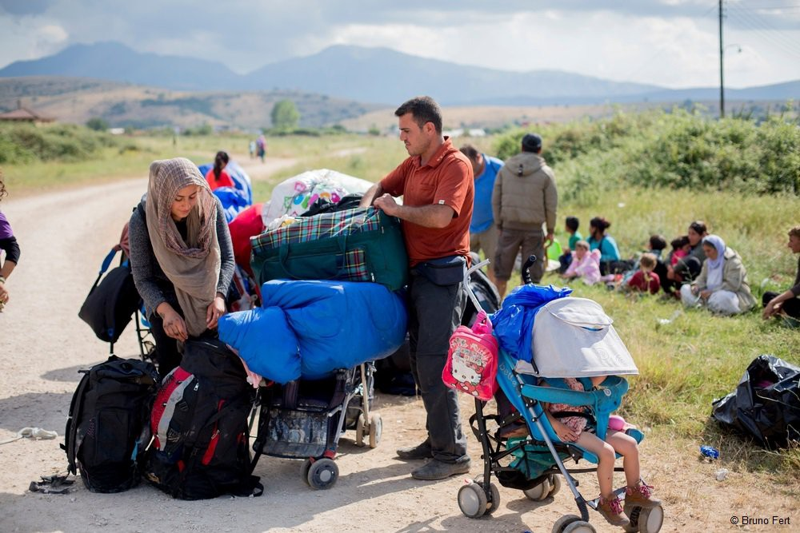
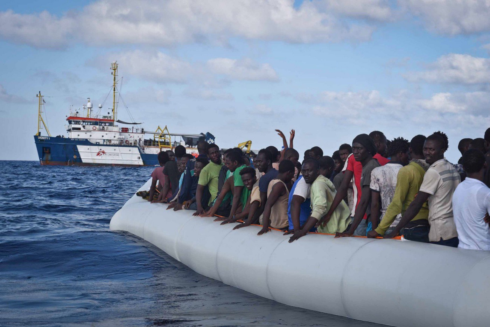
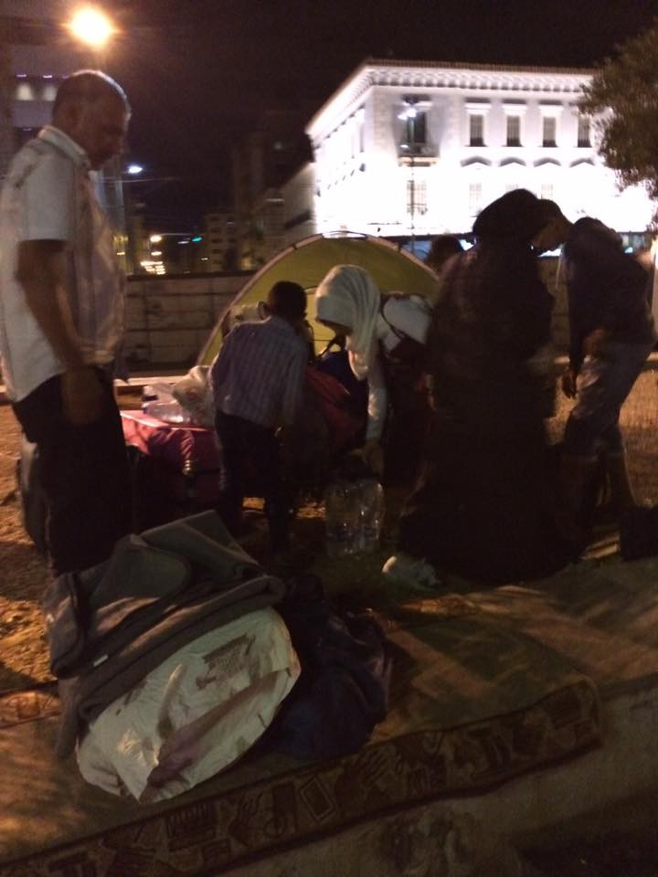
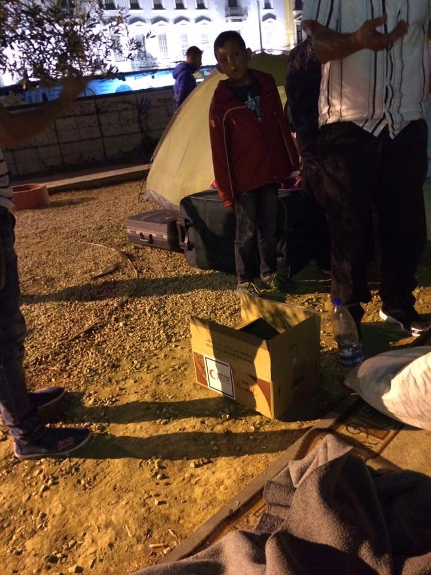
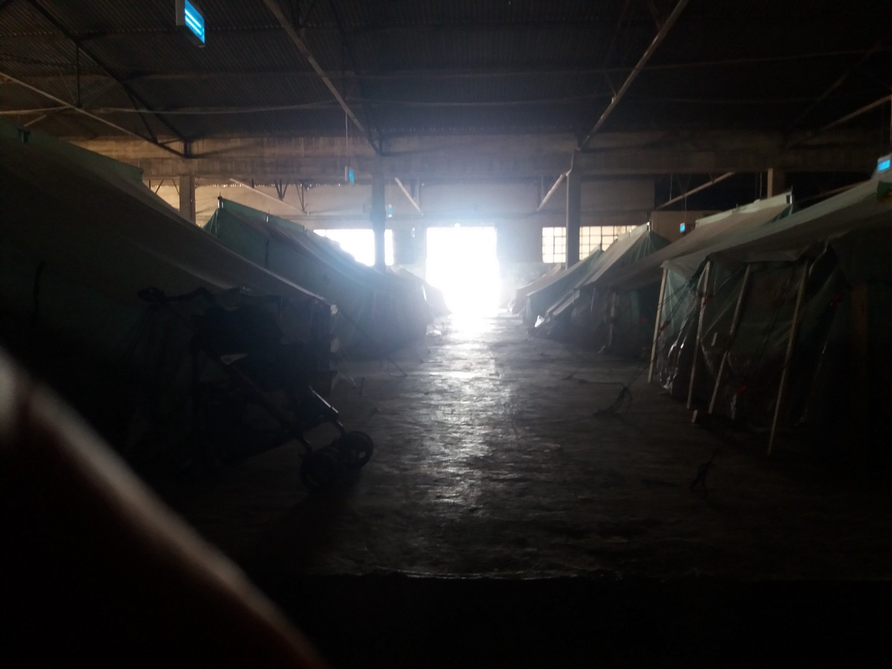
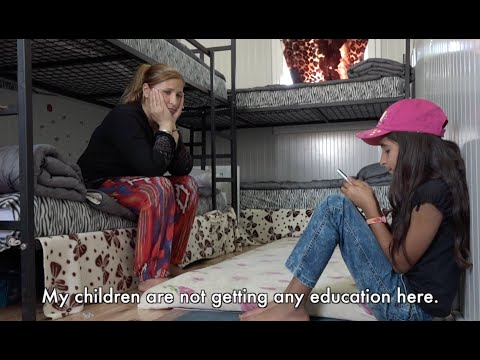
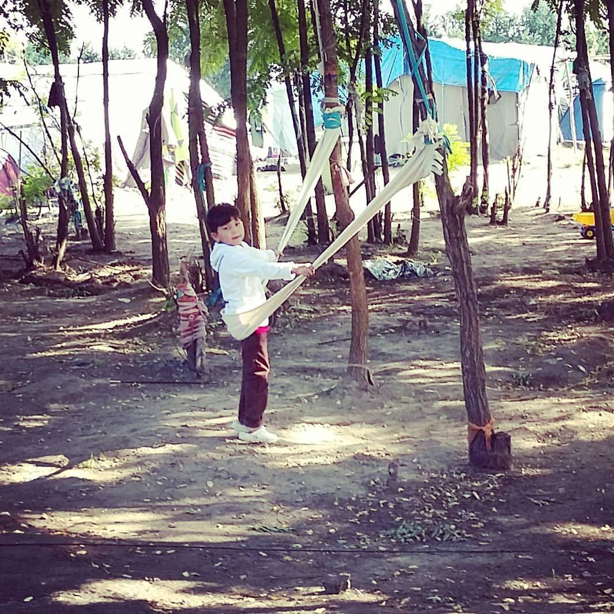
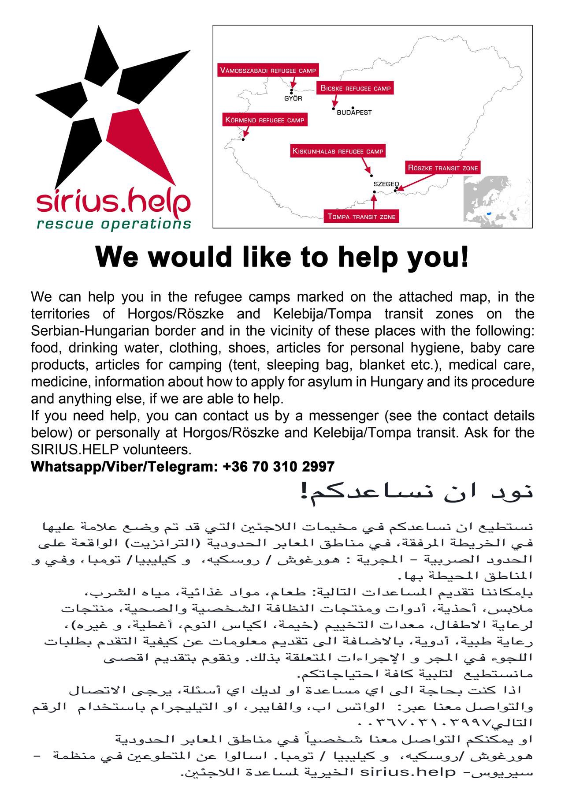
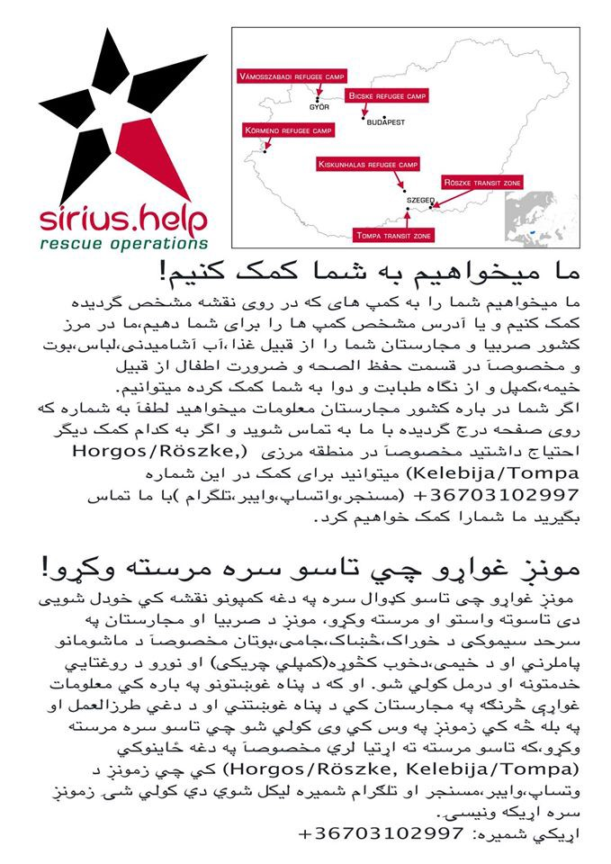
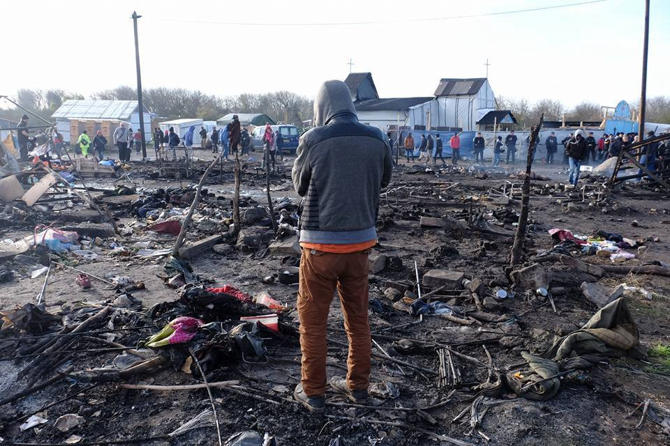

### AYS DAILY DIGEST 23/9: Do we still recognise human rights?

_More refugees are arriving from Syria every day, while the war is raging and taking more lives\. Aleppo is under constant attacks and people are being killed every day\. People who arrive to Europe dream of freedom and safety, only to be left on the streets\. European leaders still cannot figure out how to resolve this humanitarian crisis\. Nordic countries are demanding EU to punish Hungarian prime minister\. Preparations for eviction of Calais Junge camp are ongoing\._

“You can call them names, you can say horrific xenophobic things about them but the truth remains — this family could so easily be yours\.” MSF
#### Syria

According to some estimates, 27 people got killed in a warplane attack in Aleppo\. Three of four [White Helmets](https://www.whitehelmets.org/?source=fb2309) centers were hit, too\. Around 250,000 civilians are still trapped in this city\.
#### Mediterranean

MSF teams rescued 380 people today\. 129 were found on a rubber boat in the sea\. Everybody is safe now\.

MSF

Unfortunately, the bodies of 162 people have been pulled from the waters off the Egyptian coast by Friday\. These are the bodies of people from [the boat that capsized in the Mediterranean two days](https://medium.com/@AreYouSyrious/ays-digest-21-09-boat-with-600-people-capsizes-off-egyptian-coast-23fe6e1f2233#.kxpqmut1w) ago while attempting to head to Italy\. The search operation is still ongoing, while authorities are afraid that the death toll could be very high and could include many children\.
#### Greece

Today, 241 new arrivals were registered in Greece \(1 at Lesvos, 123 at Chios, 41 at Samos, 58 at Kos, and 18 at Kalumnos\) \. Unofficial number could be higher\.

For a long time we are reporting about dire situation on overcrowded islands, but until now little has been done to improve the situation\. Those responsible — authorities, UN and the EU — are not finding any solution\. Chios will soon have 4,000 people, and that means that the capacity will be at 400 percent\. Skaramangas increased from 3362 to 3450 refugees\. People have no place to stay, no warm clothes, or anything\. In total, 13,983 refugees are currently on the islands of the northern and eastern Aegean while the maximum capacity of the camps is 7,450\.

Those who arrive are often sent by the UNHCR to the mainland, Athens in the first place, where instead of big organizations or officials, volunteers are taking care of them\. Our friend Rando Wagner found a family of 12 from Aleppo at the Omonia Square in Athens\. The UNHCR sent them from the islands to the mainland, but did not provide them with anything\. Volunteers moved them to the Archanon school Squat, which is now well over maximum capacity as well\.

They escaped the city under the siege and they were left to sleep on the streets\. Photo Rando Wagner\.

Due to unbearable conditions, and the fact that many refugees will be forced to stay in Greece during the winter, unrests in camps are becoming almost a daily routine\. Today on Chios, a group of Algerians, who are believed to have been inebriated, started breaking beds and throwing stones\. Riot police was called, and it provoked further unrest leaving four refugees injured\. After [unrest in Moria camp](https://medium.com/@AreYouSyrious/ays-digest-19-9-overcrowding-despair-riots-or-selforganization-512393f8ccb3#.nw7pe3cdn) , many people are on the streets, not knowing what will happen with them\. The government pledged they will send a ship to accommodate some of them, but nothing happened until now\.

In the Thessaloniki area, at the Softex camp, police arrested 25 people on Friday morning\. According to ground volunteers, they are being accused àf thievery, dealing with drugs and several other crimes\. This is the third time this kind of arrests happens in Softex camp, which many people consider the most dangerous camp in Greece\. It is overcrowded and people live in extremely inhumane conditions\.

Softex camp\. Photo AYS\.

Talking about living conditions in camps in Greece, illustration comes from Kavalari where after many months, on Friday, showers and toilets have been installed\.

Another example comes from the Elliniko camp in Athens\. Residents of the Baseball site of the Elliniko Camp have written a letter to the press to protest deteriorating conditions there\. So far, the heads of 114 families have signed the letter that will be distributed to the press and social media outlets\.

> First, refugees are protesting the poor state of the facilities in the camp\. Tents were recently removed from the corridors of the stadium due to the presence of a gas pipe\. Refugees are now forced to sleep in the field area of the stadium where they are exposed to the elements\. Rainwater has gathered under the tents making them unlivable and causing camp residents to fall ill\. They complain of the cold, backaches, and nausea from the stench of the drenched tents and personal belongings\. Some refugees were forced to dig holes in the ground with their bare hands in order to divert the rainwater from entering their tent to no avail\. 

> Second, there is a lack of sanitation in the camps’ restrooms\. They is no proper drainage and few cleaning materials provided\. The distribution of cleaning products is insufficient was decreased after reports of theft\. This has led to a high rate of urinary infections among residents\. 

> Third, hygiene products\. Families are only given one small bottle of shampoo that they must share among themselves and even use to wash their clothes\. There is a widespread problem of lice and scabies in the camp due to a lack of soap and shampoo and places to do laundry\. 

> Lastly, the residents demand an immediate change of the current camp manager who they feel is unresponsive to the needs of the residents\. 

Other cases:

One disabled boy is unable to use the shower facilities in Elliniko\. Lacking assistance in the camp, he must rely on his parents to bathe him\. But the mother cannot enter the men’s shower and they are forced to wash him in cold water in the field inside the stadium\.

A pregnant camp resident faints after she is exposed to stress\. She was referred to a psychologist in Katechaki, which is too far for her to visit regularly\. Despite needing additional psychological assistance, she was told to simply move her tent closer to the washroom in the event of an additional fainting episode\. The Elliniko facilities are unfit for residency and especially for pregnant women and children\.

One more example is from Retsona camp\. This is how it looks like under the rain\.

While people are sleeping on the streets in Greece, but also in Italy, France, Serbia, Bulgaria… ten European leaders, including the Greek prime minister, will meet on Saturday in Vienna to talk about the humanitarian crisis they are also responsible for\. They plan to talk about the situation along the Balkan route\. We will wait and see if they can come out with the a solution that is better then the last one\.

[Relocation](https://www.easo.europa.eu/questions-and-answers-relocation) has so far been seen as the best solution, but it is going too slow\. As of September 21, only around 5,300 people have been relocated from Greece and Italy: 4,134 from Greece, 6\.2% of the 66,400 target\. Another 1,156 have been transferred from Italy, 2\.9% of the 39,600 target\. On the largest daily move ever, on September 20th, 221 people were relocated from Greece\.

Among the countries that accepted asylum seekers from Greece are France \(1,581\), The Netherlands \(496\), Finland \(430\), Portugal \(351\), Spain \(223\), Germany \(195\), Romania \(190\), and Belgium \(153\) \.
#### Registration update from [RefuComm](https://www.facebook.com/notes/refucomm-communication-and-information-for-refugees/greece-mainland-full-registration-update-23rd-september-2016-هام-جدا-بخصوص-تسجيل/313859768965832)

> The latest is that there is the new registration search tool that can be found [here](https://search.rescueapp.org/#/sear...) \. 

> RefuComm registration guide is available [here](http://www.refucomm.org) \. 

> Their YouTube films and audios on full registration, in four languages, are available [here](https://www.youtube.com/channel/UCg...) \. 

> The new full schedule of appointments is [here](https://drive.google.com/file/d/0B2...) as a list\. 

[The Mobile Info Team warns](https://www.facebook.com/mobileinfoteam/photos/a.1800063030222418.1073741830.1796286800600041/1843774035851317/?type=3&theater) that when a country is considering somebodies application for relocation, there is a chance that that person will need to travel to Athens for an interview at their embassy\. This is, however, not the case for every country\. France and the Netherlands are definitely doing it; most countries are not\.

> “If you need to go to an interview like this, you will be contacted about it\. If not, you will be called directly to the Asylum Service to collect your acceptance or rejection when it is ready\.” 

#### Help if you can

Phone Credit for Refugees and Displaced people group is looking to recruit a new member, preferably in the Athens area\.

> “We are looking for someone who can commit to 1 hour, 3 days a week, Monday, Wednesday and Friday\. This would preferably be someone who is based in the area on a longer term commitment\. The role is as simple as, going to Vodafone, Cosmos and Frog to complete a prearranged list of top ups\.” 

If you are interested in this role please get in touch with [Éamonn Liam Maguire](https://www.facebook.com/eamonn.maguire2?fref=nf) \.

You can also help [Refugee Support Greece team](https://www.facebook.com/RefugeeSupportGreece/videos/vb.1594504597535679/1679003199085818/?type=2&theater&notif_t=notify_me_page&notif_id=1474483583792337) that, at least twice a week, pack up food and essentials in Alexandreia for delivery to the nearby camp of Veria where there are 350 refugees, many of young children\. Here’s the team getting it all ready\.

#### Macedonia

While nobody is watching, more people are arriving to Macedonia, while about 180 are stranded in the camps of Tabanovce and Gevgelija since February\. After so many months, the [UN human rights team visited Macedonia and raised some concerns](http://www.ohchr.org/EN/NewsEvents/Pages/DisplayNews.aspx?NewsID=20567&LangID=E) about the conditions in “transit centers” in Macedonia, noticing that people’s freedom of movement is restricted, while kids do not go to school\.

> “Since their arrival, there has been no individual assessment of the necessity or proportionality of their de facto detention,” the High Commissioner said\. “This is simply unacceptable, in particular when it comes to children\.” 

UNHCR, the Red Cross and the local NGO Legis are currently working on providing refugees in camps with warm clothing for the coming autumn and winter\.
#### Serbia

There is no improvement of living conditions for refugees in Serbia, another country that hardly anybody pays attention to at this moment\. Hundreds of refugees are arriving every day, while hundreds are already in different centers, private accommodation, or out in the streets\. Last night temperature warm 8 degrees\. People who are in centers have limited freedom of movement, and people in the streets are in constant fear of police that is every day in the are near a train station in Belgrade\. Most of the people have the only document saying they can stay in Serbia for 72 hours, but many of them are there for a couple of months waiting to cross to Hungary and continue their journey\.

Refugee Aid Serbia has started a [Crowdfunder for their Warm Meals project](https://www.gofundme.com/supportras) , which has been running in Belgrade’s parks since March 2016\. Unfortunately, the need continues to grow and RAS are nearly out of financial resources to keep the program going\. To ensure the continuity of the dinners in the parks, please donate — keeping in mind that just 1 EUR can provide two warm meals and water \(you can make quite a difference\! \)
#### Croatia

There are more than 580 asylum seekers in Porin, meaning that this place is overcrowded, too\. This week, the gym was turned into space where people can sleep, while some people are already sleeping in halls\. Center in Kutina is also overcrowded\. This happened due to a huge number of people who are being returned from other EU countries\. At least 20 people cames back to Croatia, daily\. Local authorities do not have the proper answer for this situation for now\. Initiative Dobrodošli\! have been asking authorities to find the solution, but no answer, yet\.
#### Hungary

About 100 refugees are living in tents at the Hungarian\-Serbian border while only 15 are allowed to enter transit area per day\. For a long time, they spend there, they’ve built a playground with swings for kids\.

Photo by Sirius\.Help

Organization Sirius Help provides help for all the people in transit\.

In the meantime, Hungarian PM said the EU should round up and deport asylum seekers, taking them “to supervised refugees camps on an island or in North Africa”\. Will EU leaders in Vienna say anything about this?

Some countries already spoke up\. Denmark, Finland, Iceland, Norway and Sweden called on the European Union to take “measures” against Hungary over its refusal to take in registered asylum seekers\.

In a letter from September 9, they expressed “great concern” at Budapest’s refusal to act by the Dublin rules under which refugees must seek asylum in the first EU country they enter\. The Nordic ministers said this position constitutes “a violation of the EU law and it is not acceptable,” and called on EU Migration Commissioner Dimitris Avramopoulos to “act promptly”\.
#### Italy

The Refugee center in Como reached a quota of 305 in two days, over\-numbering the capacity of the center\.

On Friday night new exhibition by Chinese artist Ai WeiWei has been open in Florence\. This time, Ai WeiWei hung 22 orange rubber dinghies onto the facades of Florence’s historic Palazzo Strozzi\. The piece, called Reframe, draws attention to the plight of refugees as part of his retrospective, Libero \(Free\) \.

“I have enormous respect for those people who fight for their freedom,” he said, adding that he considers refugees “heroes of our time”\.
It is the first time an artist’s exhibition has featured on the facade of the Palazzo Strozzi as well as inside the building, and Ai’s works will also be on display in the city’s Uffizi Art Gallery and the central market until 22 February\.
#### France

Paris is still struggling with the number of minor refugees, many are living in the streets\. The state has the obligation to protect children, but they need to prove that they are really underage, that is for many of them, who have no documents, hard or impossible\. It makes easy for the social services \(Demie\) to dismiss many of the cases, even when it is apparent that the child is younger than 18\. The kids can appeal the decision, but the process takes several months\. Volunteers report that when the state does offer them a place to sleep, these are often seedy hotels with bed bugs and violent employees , and some kids prefer to go back outside\.

As authorities announced earlier, the Calais “Jungle” will be evicted in the coming weeks\. Currently, there are over 10,000 people, including 1022 unaccompanied minors, in this camp\. Minister of the Interior has promised to make 10,000 places available in refugee accommodation centers \(CAOs\) around France\. This is on top of the 2000 places in Calais’s Jules Ferry Center and CAP \(container camp\) \. Currently, authorities have no concrete plans for the 1022 unaccompanied minors living in squalid conditions inside the \`Jungle\` \.

[Calais Kitchens intends to provide food during](http://react-text: 187 https://www.facebook.com/groups/CalaisMigrantSolidarityActionFromUK/permalink/1178599112214834/) the coming eviction of Calais, but they need donations; portable tents, sleeping bags and backpacks\.

Info Bus expressed their concern because of the eviction of Calais, promising that they will continue to provide their services, including internet provision and workshops on UK and French asylum and human rights, regardless of any decisions made by the authorities\.

> “We, at the [Refugee Info Bus](http://react-text: 321 https://www.facebook.com/RefugeeInfoBus/photos/a.1756184407950313.1073741828.1756144974620923/1833982700170483/?type=3) are extremely worried about the thousands of people who will be displaced across France\. After the chaos and destruction caused by the violent eviction of the south side of the camp in March 2016, NGOs lost track of almost 200 unaccompanied minors\. Without comprehensive provision for alone child refugees, we fear much more will be lost this Winter\. We will continue to provide our services of internet access and workshops on the UK and French asylum and human rights throughout the North of France in the coming months, regardless of any decisions made by the authorities\. We will stay as long as our services are needed\.” 

[Two Belgian police officers have been detained](http://www.independent.co.uk/news/world/europe/belgian-police-detained-france-driving-van-refugees-trying-reach-uk-over-border-diplomatic-row-a7324556.html) on accusations of “aiding illegal immigration” in France after driving a van full of refugees to the border on Tuesday\. The two Belgian officers were briefly detained but released after interviews, with the asylum seekers, who include three children, being kept in custody for checks\.
#### UK

Another great initiative from the UK\. Organization [Refugees at Home](http://www.refugeesathome.org) helps to connect people with a spare room in their home with asylum seekers and refugees in need of accommodation\.

So if you have a spare room and want to help by opening your home and welcoming a refugee then, please contact them\.

_Converted [Medium Post](https://areyousyrious.medium.com/ays-daily-digest-23-9-do-we-still-remember-what-human-rights-are-73024535b7de) by [ZMediumToMarkdown](https://github.com/ZhgChgLi/ZMediumToMarkdown)._
