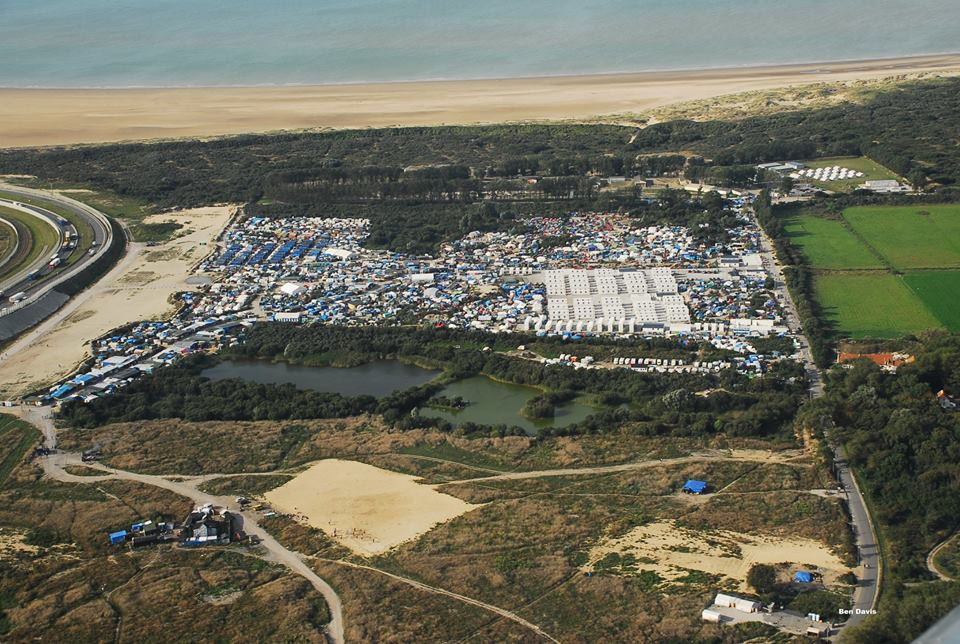
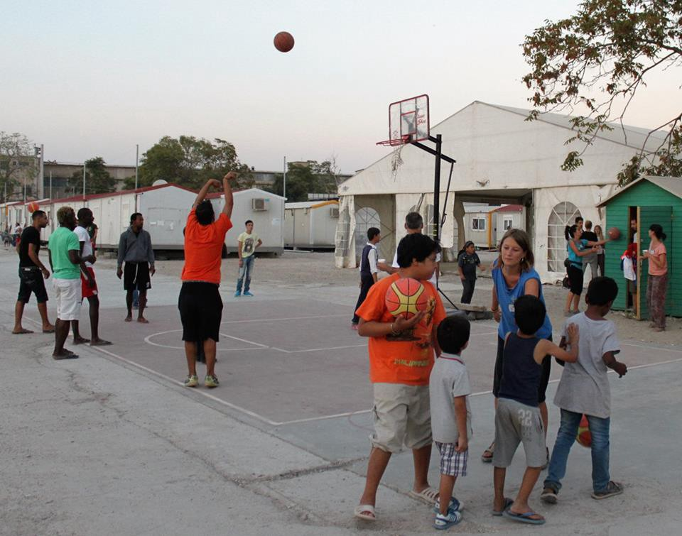
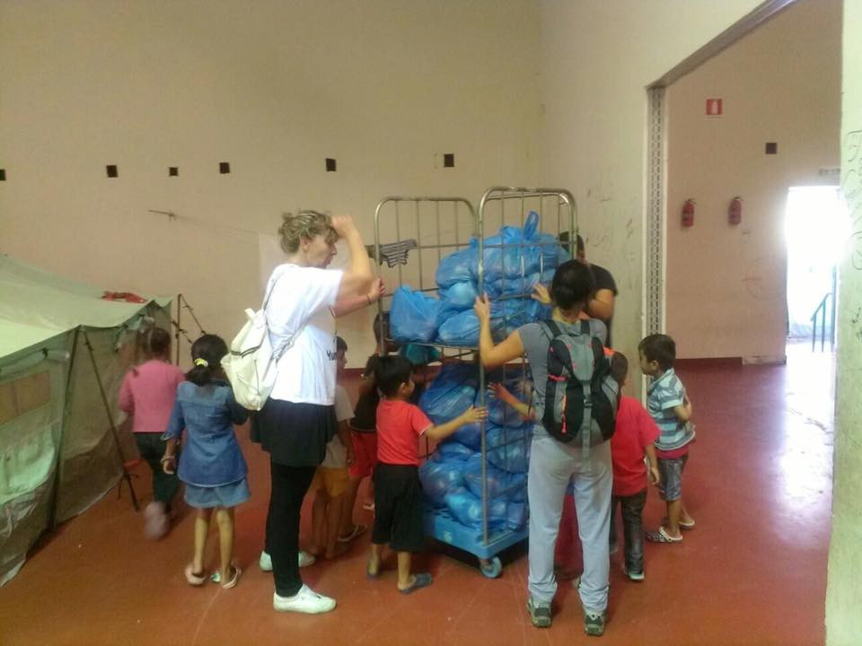
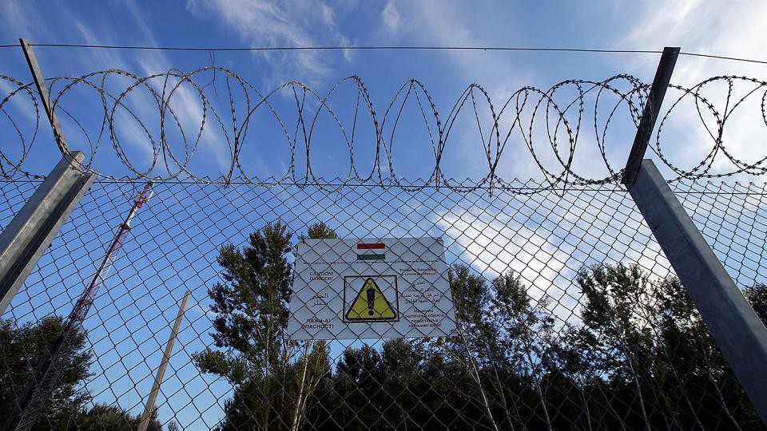
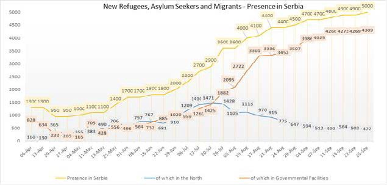
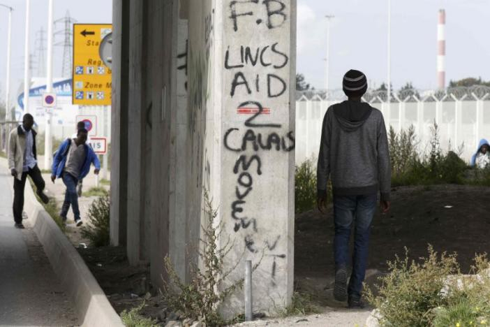

### AYS digest 26/09: Calais to be shut down while more money is funneled to Turkey

EU Commissioner for Humanitarian Aid and Crisis Management to visit Turkey tomorrow / UNHCR having trouble with appointments for interviews / Be aware of people posing as lawyers and asking for money / New deportations to Turkey from Greece / Volunteers and donations needed in Greece and France / Hungary to hold a referendum on Sunday — left wing parties and civil society organizations campaigning for abstention from the vote / Calais to be closed — vague promises made on relocation — strong measures to be upheld

“Jungle”, Calais
#### Turkey
### **More money destined for Turkey**

The EU Commissioner for Humanitarian Aid and Crisis Management Christos Stylianides is currently in Ankara to launch the EU’s flagship humanitarian aid programme, which is set to provide a monthly electronic cash grant to benefit 1 million refugees in Turkey\. In Ankara, Commissioner Stylianides pumped more money into Turkey, as opposed to opening the borders\. He stated, “I’m confident that EU humanitarian aid will make a real difference for refugees in Turkey, helping one million people\. The launch of our new programme here in Turkey today is a clear example of the strong partnership of the EU and Turkey in finding together new, innovative ways to address one of the most important humanitarian challenges of our times\.” The Commissioner will take part in the official launch event of the €348 million Emergency Social Safety Net \(ESSN\) aid programme in Ankara alongside Ertharin Cousin, Executive Director of the World Food Programme\.
#### Greece
### **51 new arrivals to Lesvos**

There were no new arrivals this weekend to the Greek islands, but as of 8 o’clock this morning, 51 people arrived to Lesvos\. Regarding the camps since Friday — the population of Vagiohori dropped by 51, from 132 to 81, against an overall capacity of 631\. Meanwhile, Skaramagas’s occupancy total jumped from 3450 to 3597 \( \+147\), with only 3200 in official capacity\. Overall, there are over sixty thousand people still stuck in Greece, a number that rises slightly each day\.
### **UNHCR and troubles with appointments for interviews**

Given that the possibilities of leaving Greece are either embarrassingly scarce or prohibitively dangerous, both asylum office and UNHCR have expressed concern about the refugees’ lack of attendance to the interviews\.

If you have an appointment time set and you want to go to the interview, try to get there in time\. If you do not attend, the agencies responsible are claiming that you might not get another one anytime soon\. If you are not able to come to the place where interviews are being held, or you know people who can’t come, please contact us\. Tell us why people are not able to come at the given time, what the difficulties people are facing, and other relevant details, so we can transfer that message through our daily digests\. Of course, if you do not want to have an asylum interview, we also believe that’s your own decision to make\.
### **Be aware of people posing as lawyers and asking for money**

Volunteers and activist on the ground are warning about people coming to the camps claiming to be lawyers and asking for money\. It is very difficult to get an appointment sooner than scheduled and paying a lawyer does not necessarily guarantee that your case will be expedited\. It is also not possible to choose your relocation country; paying someone will not get you the country you want\. Some people have already lost money by paying criminals who claimed to be able to do these things\.

Lawyers from various organisations are visiting camps and providing free legal advice and assistance\. Those who ask for money are usually not to be trusted\.
### **New deportations to Turkey**

While we are playing the numbers game — 76 people were returned from Greece to Turkey today, having been deemed as “irregular migrants”\.
### **Project Elea in Eleonas camp calls for volunteers and donations**

A dedicated group of volunteers are working at the Eleonas camp in Athens, collaborating with the residents there to build more livable spaces and organizing sport, language learning and other activities for both children and grown\-ups\. For more on their activites, please see you their [Facebook page](https://www.facebook.com/projectelea.volunteers/) \.

They are also calling for any kind of help, either in the form of donations or in volunteers who have the time to assist in their vital work\.

Photo: Project Elea
### **Donations needed in a small squat in Thessaloniki**

Further north, a new small squat in Thessaloniki in need of some donations\. Urgently needed items include blankets, dry food \(rice, beans, etc\. \), spices, salt, coffee, and tea\. The squat is located in Ano Poli, and currently there are sixteen people living there\.

People who wish to donate can arrange for pickups with the group, but all are also welcome to come join the residents and volunteers for tea and friendly conversation\.

Thessaloniki
### **Parents’ initiative to block refugee children attending school**

In other bad news, there is an initiative in various parts of Greece that aims to ban refugees for attending school with local children\. As reported by Ekhitamerini: “In the wake of similar decisions in Oraiokastro, near Thessaloniki, and Filippiada, near Preveza, the groups representing the parents of two primary schools in Alexandreia, Imathia prefecture, voted against the inclusion of refugees in school classes even though they would be segregated from their children\. A regional education official who attended the vote, Dionysis Diamantopoulos, said the Education Ministry would decide which schools will be included in the initiative\.”
#### Hungary
### **Fear and hate referendum to be held in Hungary this Sunday**

Hungarian border

The right\-wing government of Hungary is inciting more hate through a biased, prejudicial referendum about refugees on October 2nd\. The referendum will ask voters: “Do you want the European Union to be able to mandate the obligatory resettlement of non\-Hungarian citizens into Hungary even without the approval of the National Assembly?”

Left\-wing parties and civil societies throughout Hungary are urging residents to boycott this fear\-mongering exercise, in the hopes of rendering the results invalid\. Twenty\-two Hungarian NGO’s, as well as a satirical political party, the Two\-Tailed Dog Party, have teamed up to campaign against the vote\. After the government, these groups have spent the largest amount on publicity surrounding the referendum, making fun of the government’s message there are strong left wing parties campaign and civil society one trying to advocate for abstinence and make this shameful fear mongering referendum invalid\. 22 Hungarian NGO’s and the Hungarian satirical party, the so\-called Two\-Tailed Dog Party, teamed up to campaign for invalid votes\. They are spending the second biggest amount on its campaign \(after the government\), making fun of the government’s messages with funds donated by regular people\.

“I think it is good to show that Hungary is not the same as its government, but is full of nice, friendly and normal people, even if the government is not showing this side of Hungary,” Gergő Kovács, the leader of the party told [euronews](http://www.euronews.com/2016/09/07/hungary-prepares-for-anti-refugee-referendum) \. Hungarian law says at least 50 percent of those eligible to vote have to take part, otherwise the referendum is invalid\. Unfortunately, as reported by euronews, the [latest polls](http://republikon.hu/elemzesek,-kutatasok/160914-kvotareferendum.aspx) suggest this figure will be reached\. We very much hope that people of Hungary will not succumb to this right\-wing ploy to conquer and divide\.
#### Serbia
### **Official camps accommodate only 86% of those stuck in Serbia**

The latest numbers from Serbia have just been published by the UNHCR: “The number of new refugees, asylum\-seekers and migrants, encountered by UNHCR and partners in Serbia, continued growing, now to 5,000\. 86% \(or 4,309\) were accommodated in governmental facilities, including 1,560 in the five Asylum Centres and 2,749 in Refugee Aid Points/Reception Centre, while the others were counted at night in Belgrade City or the border with Hungary\. UNHCR, authorities and partners maintained reinforced presence and support at all sites throughout the country\.”

For more statistics and data, download the full [UNHCR update](https://data.unhcr.org/mediterranean/download.php?id=1955)

Image\. Graph from UNHCR update
#### France

Photo borrowed from Reuters
### **“Jungle” to be closed in a month with vague promises of relocation, but assurances of government’s strong hand**

President François Hollande and his administration have decided to definitely empty the Calais camps in record time \(before October 31st\) \. Of the more than ten thousand people living there, 10% are unaccompanied minors\. Only 387 of these approximately 1,000 children are promised to be transferred to the U\.K\. according to the Dublin 3 procedures; 209 of these children are eligible under Alf Dubs amendment\.

As a reminder, not one child has reached the U\.K\. since the Dubs Amendment came into effect\. Volunteers and activists are sending these four points as the most important things to note:
1. **Full eviction of Calais camp, including containers and Jules Ferry Centre, expected prior to the 31st October**
2. **President assures the associations an assessment census of the entire camp will be carried out ahead of evictions**
3. **387 children who have been referred to the Home Office for relocation to the UK under Dublin 3 and Alf Dubs amendment should be quickly processed and brought to safety in the UK**
4. **Large backpacks, suitcases, suitcases with wheels and funds needed urgently\. Please follow the link** [http://bit\.ly/29QyKxP](http://bit.ly/29QyKxP) **or** **e\-mail calaisdonations@gmail\.com if you have physical donations\.**

### **People sleeping on the streets of Paris need tents and those who are in hotels need food**

Meanwhile in Paris and the Île\-de\-France region, some refugee families are hosted in hotels but are not always provided with food\. Volunteers try to identify emergency situations and inform city hall or the state of what is happening, as they are responsible for providing basic services\. Other volunteers loosely organised within the Collectif Parisien de Soutien aux Exilés \(CSPE\) try to fill the gaps by cooking and providing food themselves\. Their next project is to provide families with rice and rice cookers, so that they can cook on their own\. Money for this project is collected through crowdfunding \(around €1,000 are available so far — the €37,000 are the total funds collected since November 2015\) \. The funds also allow volunteers to provide food, sim cards, hygiene products and metro tickets for refugees sleeping in the streets of Paris\. If you are able to help, please follow the [link](https://www.leetchi.com/.../solidarite-de-migrants-de…)

_Converted [Medium Post](https://areyousyrious.medium.com/ays-digest-26-09-calais-to-be-shut-down-while-more-money-is-funneled-to-turkey-4edb8ded00a5) by [ZMediumToMarkdown](https://github.com/ZhgChgLi/ZMediumToMarkdown)._
