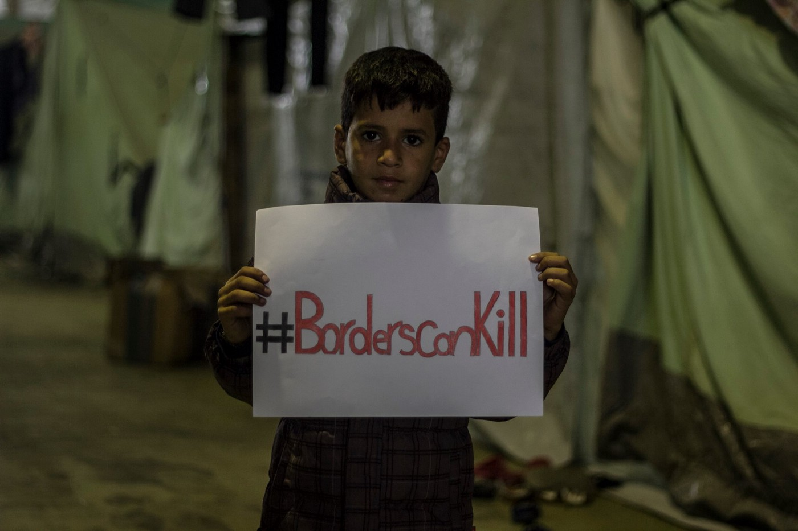
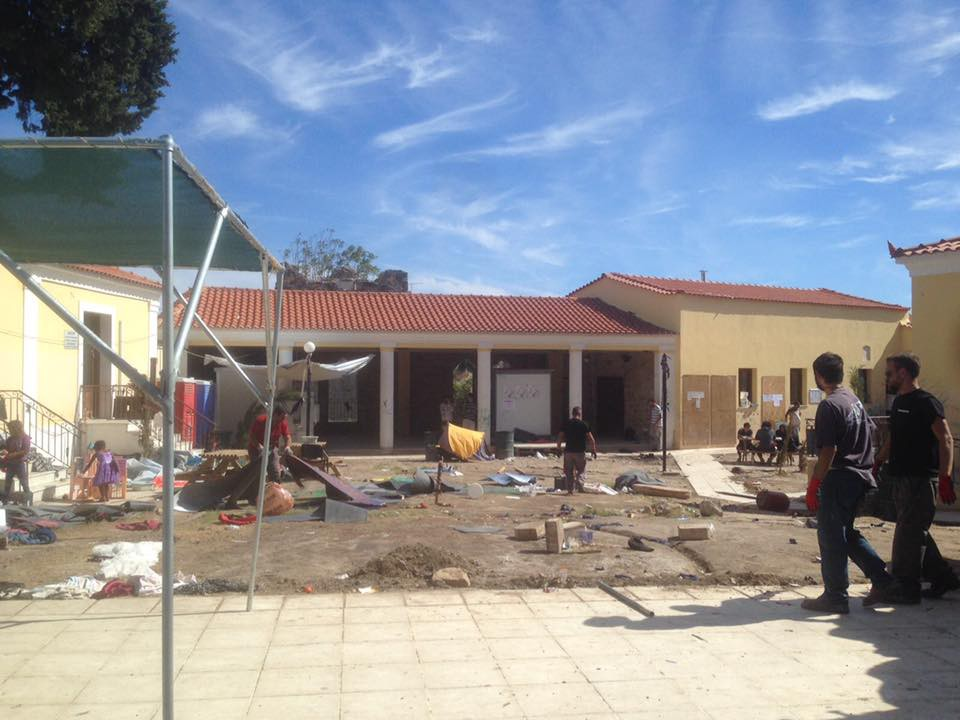
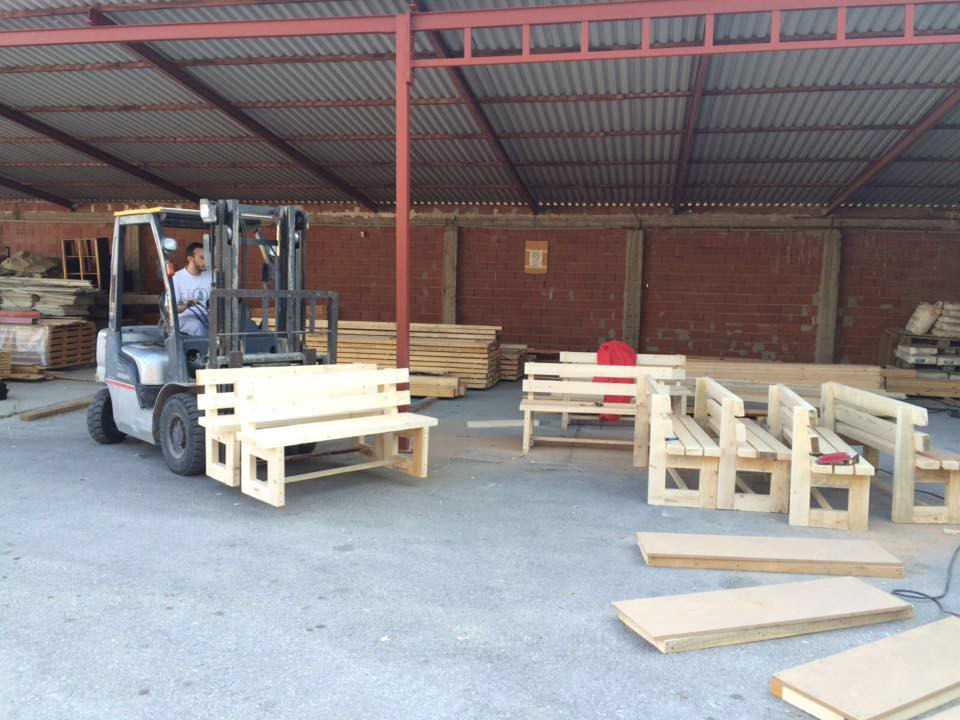
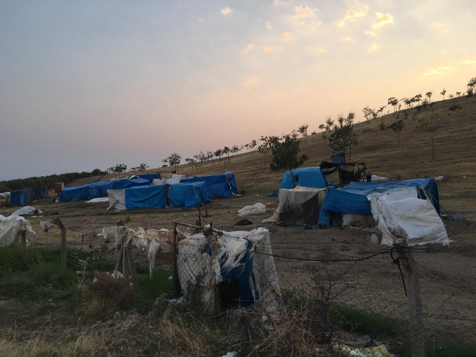
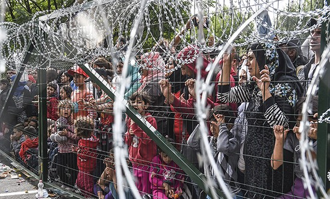
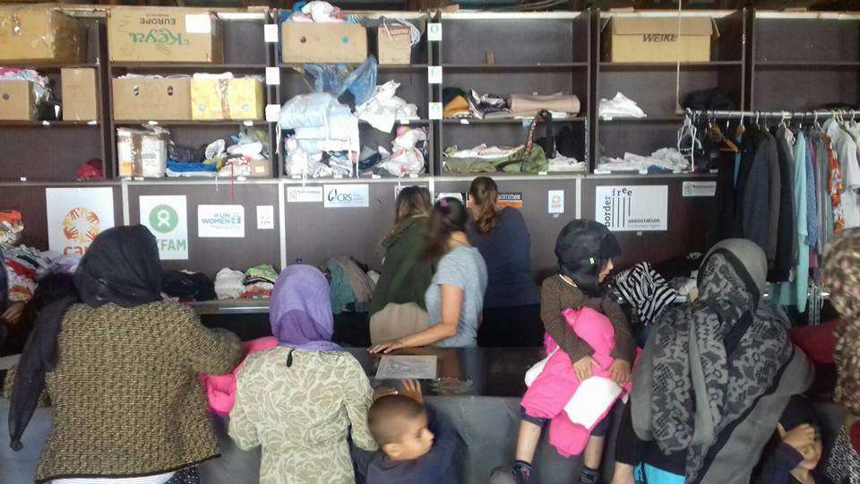

### AYS Digest 27/9: As doors close to Syrians fleeing by thousands, instead of ceasefire — Aleppo ceases to exist…

_Rights, conventions and solidarity more and more geographically limited / Confusing and slow process of relocation finds resistance and mistrust with some refugees / UAE finally agrees to start welcoming Syrian refugees / EU strengthening Bulgarian border / Hungarian government ignores global outrage by their populist politics_

](assets/171bd02c4c47/1*RfwBFb3rQLa6cP3amvnVUQ.jpeg)

Photo credit: [The White Helmets](https://www.whitehelmets.org/)
#### SYRIA
### Contest over territory turns into an endless battle in Aleppo

According to [The Daily Beast](http://l.facebook.com/l.php?u=http%3A%2F%2Fwww.thedailybeast.com%2Farticles%2F2016%2F09%2F26%2Fu-s-was-warned-of-attack-on-aid-workers-in-syria.html&h=jAQG-obI-) , „Two days prior to devastating aerial attacks \[on Aleppo\], Michael Ratney, the U\.S\. special envoy to Syria, was told the Assad regime was planning to hit the Aleppo facilities of the Syrian Civil Defense, a volunteer rescue group“ widely known as the White Helmets\. No action was taken and Russian and regime warplanes continue systematically targeting civilians and humanitarian workers with impunity\.

> “There will be no water and no electricity, no fuel, hospitals will not be able to keep going\. If the situation continues like this, I expect a big genocide\.” Raed Saleh 

During one week in Aleppo, between September 21 and 26, 377 battle\-deaths were [documented](http://www.vdc-sy.info/index.php/en/) by The Violations Documentation Center in Syria\. 369 were civilians, and only 8 non\-civilians\. And as dozens of bombs continue to rain down on besieged Aleppo, where more than 250,000 civilians are believed to be trapped, Reuters [reports](http://l.facebook.com/l.php?u=http%3A%2F%2Fwww.reuters.com%2Farticle%2Fus-mideast-crisis-syria-attack-idUSKCN11X1MB&h=uAQFRt3fH) that the Assad regime and its regional and international allies have launched a ground attack\.

> “What is happening in Aleppo is a brutal violence against the people, against the civilian population to an extent that is totally unacceptable,” said German chancelor Angela Merkel earlier on Tuesday at a press conference in Berlin\. 

Merkel expressed regret for the failure to stop fighting, but said it was worth every effort to continue trying to achieve a ceasefire deal which actually works\. Meanwhile, [Irinnews](https://l.facebook.com/l.php?u=https%3A%2F%2Fwww.irinnews.org%2Fnews%2F2016%2F09%2F27%2Fexclusive-un-waiting-assad-approve-its-new-syria-chief&h=5AQGd4DJx) tells us that The UN, recently facing criticism for allowing the Assad regime to influence its aid deliveries, is still without a top official in Syria, as they are waiting for Assad to approve its new Syria chief\.
#### Mediterranean
#### Number of arrivals in Europe lowers sharply as number of deaths is up

3501 fatalities were documented among Mediterranean refugees this past weekend, according to the latest [report by IOM\.](https://www.iom.int/news/migrant-arrivals-mediterranean-reach-302149-deaths-sea-3501)
#### EU
### Selective solidarity at its worst

5200people were relocated out of the 160,000 asylum seekers that were to be sent across the EU, according official data\.

This devastating result stems from the lack of political will, dispersion of responsibility, poorly done job, but also the complexity of the whole procedure\. It is, however, slowed down and made _even_ more complicated due to some right wing populist governments who have previously raised objections to the relocation of Muslim refugees from Italy, Greece or Turkey\. Chancellor Angela Merkel stressed Tuesday that EU member states should provide shelter for refugees fleeing terror and civil war, irrespective of their religion or faith\.

> **This is my opinion, has always been my opinion, and continues to be my opinion,” Merkel stressed\.** 

As the Višegrad countries, the Czech Republic, Hungary, Poland and Slovakia, who have long opposed the scheme of quotas, continue to [bully their ideas through](https://euobserver.com/migration/135245) , how the previously agreed system of relocation will speed up and start being more effective in the coming winter months — remains a question\. 
**„Solidarity is a principle not cherry picking and if some countries put that principle in doubt they put in doubt the basis of the European Union\.”** 
This overall view on the situation in the EU was a common point during the short joint interview by Mr Juncker and Mr Schulz on the French TV station France 24 where they discussed the future direction of the slow and insufficient European refugee project\.

> You cannot impose solidarity, solidarity has to come from the heart\. — Jean\-Claude Juncker 

Photo: Through Refugee Eyes
#### GREECE

On the other side of the continent, some refugees stuck for months in appalling conditions in Greece have started opposing the system of relocation in such way that they either miss the interview appointment, due to different fears \(being relocated to one of the poorer countries with no system of integration and support, one that they did not mention in previous preregistration interviews, etc\. \), difficulties of getting to the official centres from the distant areas of their accommodation \(in case they loose their card or miss on the bus sometimes leaving as early as 5 a\.m\., they have no means of arriving or rescheduling\) or they choose another way to reach the EU — some of them months ahead of their interviews scheduled for a later date next year\. However, the Greek Asylum Service has available information and [answers](http://asylo.gov.gr/wp-content/uploads/2016/09/Qandanswers_ENG_Sep1_final.pdf) to the questions of those reluctant to come to the full lodging registration interview\.
#### New registrations

The number of official registrations on Greek islands until 7\.30h on Tuesday morning was 38: 37 on Lesvos and 1 on Chios\. With some people being transferred to mainland, the number of refugees on Lesvos has been decreasing, as well as the number of people staying in camps Skaramagas \(decreasing by 215 today\) and Alexandria \(decreased number by 170\) \.
#### Chios

Depethe camp on the island Chios was dismantled\. Some camp residents were moved to another accommodation in local hotel buildings, while others were moved to Souda\.

](assets/171bd02c4c47/1*1Yd7R0E2uSHUE0DELj9Q7A.jpeg)

Chios photos: [Salvamento Marítimo Humanitario](https://www.facebook.com/smhumanitario/?ref=page_internal)

#### Thessaloniki
### Are you a refugee in Thessaloniki in need of information?

If you have questions concerning your asylum application and live in Thessaloniki, Legal Info Session are provided every Tuesday, from 7 to 9 pm at Mikropolis Social Space library \(Vasileos Irakliou 20, 2nd floor, on the left\) by the [Mobile Info Team](https://www.facebook.com/mobileinfoteam) \. Their team will answer the questions concerning legal issues with the help of Arabic and Farsi translators\. Don’t forget to bring any documents relevant to your application\.
#### Cherso

In collaboration with the IRC and Save the Children, the Cultural Centre in Mazaraki camp in Cherso has three more rooms for the educational program\.They also opened up a carpentry workshop with the locals where they manufacture furniture for the new classrooms\.

](assets/171bd02c4c47/1*uGh46Uxb1Fl8cZ3CKU6ZVQ.jpeg)

Mazaraki Cherso photos: by [Open Cultural Center — OCC — former Idomeni Cultural Center](https://www.facebook.com/OpenCulturalCenter/)

#### UAE opening two new camps in Greece

Emirates Red Crescent is ready to start welcoming Syrian refugees at one of the two camps they are setting up in Greece\. The camp in Athens is ready to accommodate refugees, while the other one with the capacity of 2,000, located in Larissa, about 360 kilometres from Athens, will be opened on October\. The camps will be directly run by the Greek Red Cross under the supervision of the UAE Red Crescent\. The sites were selected by the Greek government\.
#### Athens

Khora Community Centre is looking for a volunteer kitchen coordinator to join their team\. The kitchen would offer warm nutritious food, a safe day\-time space and other well needed facilities to refugees in Athens\. The role will be full time as part of a team of international and local volunteers\. If you are interested in applying, contact Khora team at: khora\.athens@gmail\.com by Friday 30th September\.
#### Earth Refugee needs volunteers in camp Sounio

Experienced volunteers willing to stay and work for at least 11 days are welcome to take part in projects at Sounio refugee camp, located two hours by bus from Athens\. Those among volunteers with experience in teaching English \(TEFL\), design and supervising children’s activities, volunteers fluent in Arabic and Farsi, as well as those with experience in food preparation would be a special asset to the team\.

Turkey makeshift camp near Manisa, photo: ARC
#### TURKEY

Apart from a number organisations active in the Izmir area, a small group of volunteers gathered in the [ARC Campaign](https://www.facebook.com/ArcTurkey/) recently started supporting refugees in informal camps in Western Turkey\. The region of Manisa has a lot of smaller camps that host refugees who work on farms and then pay rent to their employers to camp on their land, according to the volunteers\. „The tents are really makeshift and, mostly just pipes and ripped tarpaulins, there’s no running water and they are having to rely on donations for everything, except meagre amounts of fruits and vegetables from the land\. A lot of the times they don’t receive payment for their hard work\. We’ve also heard that there are young children having to join their parents to work in the fields\. Its a very desperate situation\.“ 
Currently supporting 500 people, as much as they can, the group wishes, at least partly, to be able to address the needs of hundreds more in the surrounding camps\. Asking for help and [support](https://www.youcaring.com/syrian-refugees-644637) , they also invite news volunteers to join them\.
#### BULGARIA
### EU equipping Bulgarian border

Bulgaria has a 127\.3\-kilometre fence with Turkey\. Another 55\.7 kilometres is under construction as of mid\-September\. [Reportedly](https://euobserver.com/migration/135253) , most of the recent emergency funding from the EC is used for equipment and vehicles for border security and surveillance\.
**14132** refugees are currently officially staying in Bulgaria, according to the official reports of the Bulgarian Ministry of Interior\. They reported a decline in refugee arrival in the previous week \(September 15–22\), but they still warn that most of the country’s refugee centres are full\. Those refugees that manage to cross through the well secured border in the hope of reaching Serbia before heading further north to Germany or Sweden, are sent to one of three detention facilities, facing overcrowding and poor conditions\. The number of unaccompanied and separated children is also on the rise, which is quite a worrying trend, the [EU Observer](https://euobserver.com/migration/135253) sources claim\.

Üdvözlet\! \(Photo credit: AFP / Getty Images via Amnesty International\)
#### HUNGARY

Violent push\-backs at the border, unaccompanied children are housed with adult men, hundreds of people in degrading conditions, unlawfully detained single refugees, asylum\-seekers living in dire conditions\. \. These are just some of the grave findings in Hungary by the [Amnesty International](https://www.amnesty.org.uk/hungary-anti-refugee-campaign) team who were repeatedly not allowed to visit the asylum detention centres to document the conditions people were kept in\. 
The government has spent millions of Euros on a xenophobic advertising campaign, while refugees are left to languish\. The toxic rhetoric of the Prime Minister Viktor Orbán, calling asylum\-seekers “poison”, has trickled down to local government, police and asylum centres\.

> ‘In the end no one wants us\. So I wish I wasn’t here\. I wish I wasn’t where people didn’t want us\.’ — A 15\-year\-old from Syria 

#### SERBIA

Refugees Anthem is hosting an [event](https://www.facebook.com/events/135436080249212/) to clean the streets of Belgrade for Refugees and are looking for volunteers\. The event is also an opportunity for refugees in the area to volunteer in the cleanup and show thanks for the kindness and hospitality of local Serbs and volunteers alike\.

The organizers encourage all the participants to take photos during the clean up \(asking for permission beforehand\) and share images of the clean up with the hashtag [**\#refugees4acleanerbelgrade**](https://www.facebook.com/hashtag/refugees4acleanerbelgrade) 
 Schedule: Briefing & Recruiting: 9\.30–10h Clean\-up: 10–12h

Refugee Aid Miksalište continues helping and THANKS to all those who have donated since the beginning of the crisis in Serbia \(Photo: Refugee Aid Miksalište\)
#### ITALY

The European Union and Rome voiced exasperation on Monday after the southern Swiss canton of Ticino voted to curb job access for workers living across the border in Italy, The Local reports [in detail](https://www.thelocal.it/20160927/eu-and-rome-warn-swiss-region-over-vote-to-curb-migrants) \. [Italian](http://milano.repubblica.it/cronaca/2016/09/26/news/referendum_frontalieri_svizzera-148550168/?ref=HREC1-9) officials found the possible implementation of the results of the so called „First ours“ referendum that would limit the free circulation of people and work force put the further relations between the EU and Switzerland in risk\.
 Italy has been on the front line of welcoming the refugees and continues to do whatever is possible, bishop Bagnasco, the permanent council of CEI, said\. Like the Pope, who continues to be [active](https://buzcast.com/Humanitarian-Channel/62307115/Pope-Francis-and-UN-Refugees-Chief-discuss-global-humanitarian-crisis--2016-09-1609:10:21) in the refugee question and recently [auctioned](https://www.thelocal.it/20160927/pope-cars-auctioned-off-to-help-syrian-refugees) his cars to collect money for the refugees, “never getting tired of reminding”, Bagnasco added: 
**“the hospitality and integration require generosity and socio\-politic intelligence”\.** It’s a style that involves everyone, those who host and those who are been hosted\.
#### GERMANY

Just hours after the latest anti\-Islam PEGIDA march dual explosions rocked the city of Dresden late on Monday\. “Although no one has come to us claiming responsibility, we have reason to suspect a xenophobic motive\. At the same time, we certainly see a connection to the upcoming celebrations for German unification day,” the police commissioner told [DW](http://www.dw.com/en/explosions-in-dresden-police-suspect-far-right-motive/a-35898078) \.
### EU needs to establish migrant deals similar to the EU\-Turkey deal with African countries

Chancellor Merkel promised Germany will make more money available to spend on development aid to tackle the root causes of migration\. She said it is important that ‘we give African countries perspectives for the future’, saying the EU either has to ‘let those people come to us, or we have to combat the root causes of migration so that people see prospects for staying there, close to their homes’, [Der Spiegel](http://www.spiegel.de/politik/deutschland/entwicklungshilfe-angela-merkel-verspricht-mehr-geld-fuer-afrika-a-1114049.html) reports\.
#### UK

As the Calais camp is set to close by the end of October, the question of unaccompanied minors stranded in the Jungle remains one of the most prominent questions for both countries involved\. Despite of the [British doubts](http://news.sky.com/story/calais-camp-must-be-completely-dismantled-hollande-10593829) over the French plan to dismantle the Jungle, the French president expressed determination to persuade the UK to have their share in solving the refugee problem of Calais\. On the other hand, speaking at Labour conference on Wednesday, the former Shadow Home Secretary is expected to tell Theresa May to stop “the bureaucratic delays” and provide sanctuary to the child refugees, according to [Huffington Post](http://www.huffingtonpost.co.uk/entry/yvette-cooper-we-must-take-500-lone-child-refugees-before-france-closes-the-calais-jungle_uk_57ead5e7e4b0e315f281b87c?ir=UK+Politics&utm_hp_ref=uk-politics) \. Calling on her Government to take 500 lone child refugees, Cooper proposes bothe France and the UK now take half the children of Calais and get them into safety fast while their assessments are done\. 
This comes at a time of growing [scepticism](https://www.brookings.edu/blog/order-from-chaos/2016/09/26/what-brexit-means-for-migration-policy/?utm_medium=social&utm_source=twitter&utm_campaign=fp) over asylum and refugee policy changes in the post\-Brexit Britain that suggest such decisions could negatively affect the rights of asylum seekers in the country\.

[![URGENT NEEDS IN CALAIS We urgently need rolling suitcases and medium and large backpacks at our warehouse in Calais. There are over 10,000 people living in the Calais camp and we want to help them leave in a dignified way. If you can host a collection and bring items to Calais email calaisdonations@gmail.com If you want to find out where collections are happening in your area try the Calais People to People Solidarity on Facebook. We only have a few weeks. Your help is, as ever, enormously appreciated. #helprefugees #chooselove www.helprefugees.org.uk]( "URGENT NEEDS IN CALAIS We urgently need rolling suitcases and medium and large backpacks at our warehouse in Calais. There are over 10,000 people living in the Calais camp and we want to help them leave in a dignified way. If you can host a collection and bring items to Calais email calaisdonations@gmail.com If you want to find out where collections are happening in your area try the Calais People to People Solidarity on Facebook. We only have a few weeks. Your help is, as ever, enormously appreciated. #helprefugees #chooselove www.helprefugees.org.uk")](https://www.instagram.com/p/BK3dguUgB88/)

#### IRELAND

> _The failure of the majority of our politicians to engage meaningfully in Europe’s humanitarian crisis of today cannot be excused\._ 

The Irish, who pledged to accept 4,000 refugees with particular emphasis on families and unaccompanied minors, have so far taken in just over 300 people, one of whom is an unaccompanied minor\. 
 This fact alone brings many of the Irish people to ask themselves whether their future generations are the only ones who will be asking themselves why they failed to find courage and voice to help their fellow humans, as reported in a [commentary](http://www.irishtimes.com/opinion/fintan-drury-ireland-has-failed-europe-s-refugees-once-again-1.2805983) text\.

> _The Christian churches, which have lost whatever moral high ground they had been granted by previous generations, have not been sufficiently vocal as the great humanitarian crisis that envelops Europe now has unfolded\._ 

### _We have, seemingly, lost our voice, our anger, our capacity to demand of politicians that they introduce a moral compass to their work on our behalf\._

_Converted [Medium Post](https://areyousyrious.medium.com/ays-digest-27-9-as-we-close-doors-to-syrians-fleeing-by-the-thousands-instead-of-ceasefire-171bd02c4c47) by [ZMediumToMarkdown](https://github.com/ZhgChgLi/ZMediumToMarkdown)._
