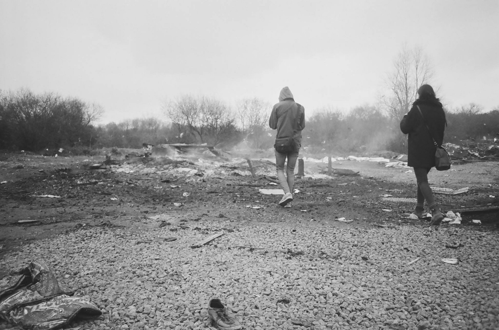
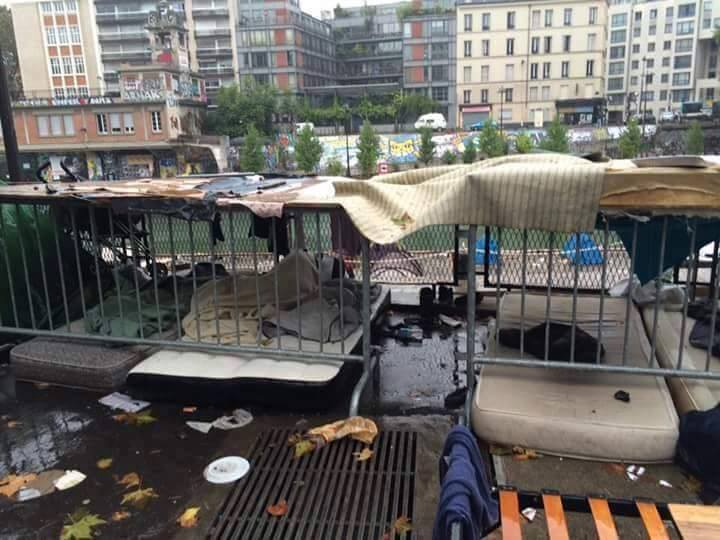
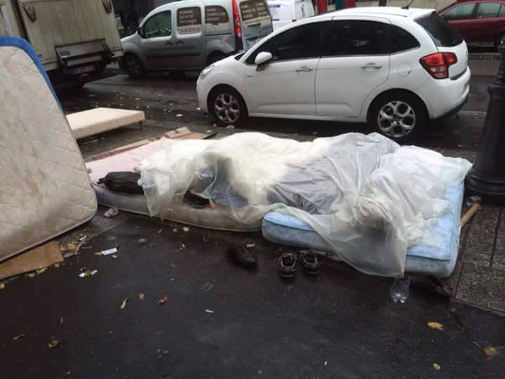

### AYS Digest 28\.09 — Calais bracing for eviction

Photo by The Worldwide Tribe

_Syrian government troops launch ground assault on Aleppo\. Only 4,455 refugees relocated from Greece so far\. Donations needed for Calais and Paris\._
#### Syria
### Syrian troops launch ground assault on Aleppo

[Al Jazeera](http://www.aljazeera.com/news/2016/09/syrian-troops-launch-major-ground-assault-aleppo-160927125537456.html) says that after massive aerial bombardments, Syrian troops have now launched a major ground assault on Aleppo\. More than 400 people have been killed, and hundreds of others wounded since the ceasefire broke down last week\.

The UN has denounced the use of “bunker\-busting bombs” in densely populated areas, with Secretary\-General Ban\-Ki Moon saying the use of advanced weaponry against civilians could amount to war crimes\. A [Human Rights Watch report](https://www.hrw.org/news/2016/09/28/syria-new-deadly-chemical-attacks) has also accused the Syrian government of using toxic chemicals in two recent attacks in Aleppo, that killed five civilians and injured dozens\.

[DW](http://www.dw.com/en/aleppos-two-largest-hospitals-bombed-by-syrian-regime/a-35912877) said Aleppo’s two largest hospitals were bombed by the Syrian regime, quoting one doctor as saying, “the warplane flew over us and directly started dropping its missiles on this hospital”\. According to a report by the Washington Post, two patients died in the attack that also injured three staff members\.
### France to put forward UN Security Council resolution for Aleppo ceasefire

[Reuters](http://www.reuters.com/article/us-mideast-crisis-france-idUSKCN11Y1T5?il=0) reports that France’s foreign minister Jean\-Marc Ayrault said he was working to put forward a U\.N\. Security Council resolution for a ceasefire in Aleppo, and that any country that opposed it would be deemed complicit in war crimes\. He also accused Syria, backed by Russia and Iran, of carrying out an “all\-out war” on its people, something that Paris could not sit by idly watching\.

A senior diplomat said “the idea is not to get a Russian veto, but to have a proper discussion with them on ending the violence, enabling humanitarian access and putting a mechanism in place to enforce the ceasefire — if they don’t play the game then we will have no qualms taking this to the Security Council even if it means a Russian veto\.”
#### Afghanistan
### EU to threaten reduction in aid if Afghanistan does not accept 80,000 deported asylum seekers

[The Guardian](https://www.theguardian.com/global-development/2016/sep/28/eu-secret-ultimatum-afghanistan-accept-80000-deportees-lose-aid-brussels-summit-migration-sensitive) reports the EU plans to threaten Afghanistan with a reduction in aid if it does not accept at least 80,000 deported asylum seekers, even while acknowledging that security in Afghanistan is worsening\. The paper adds that 11,000 were killed or maimed in Afghanistan last year and that it is extremely difficult to find work — many of the returnees leave Afghanistan , trying their luck again in Europe or settling in neighboring Iran or Pakistan\.
#### Turkey
### Turkey expected to complete border wall with Syria by February

Turkey is expected to complete its Syria border wall within five months\. [Reuters](http://www.reuters.com/article/us-mideast-crisis-syria-turkey-idUSKCN11Y1MB) says Turkey is under pressure from its NATO allies to seal off the border with Islamic State\-controlled territory in Syria and is also concerned by the presence of the Syrian Kurdish YPG militia, which controls most of its Syrian border\.
#### Greece
### 79 refugees arrive in Greece

A total of 79 refugees have been registered in the last 24 hours up to 7:30am this morning — 49 in Lesvos, 9 in Samos and 21 in Kalymnos\.

Two boats arrived on Lesvos today according to volunteers, one with 55 people on the southeast coast, and the other with 47 on the north coast\.

The number of refugees in Skaramagas has increased from 3,382 to 3,500 according to official statistics\.
### Four minors arrested for rape of 16 year old in Moria

Four 17 year old Pakistanis were arrested on Sunday for the rape of a 16 year old in Moria camp\. Police says they recorded their actions on their mobile phones\.

In a statement, the Refugee Accommodation Space City Plaza wrote:

“ _The government, along with the EU, carry the blame for the fact that refugee camps have developed into spaces in which human dignity is under attack\. Thousands of people are incarcerated in spaces lacking the necessary infrastructure, without provisions, without protection for the most vulnerable, without any hope for the future\. The most vulnerable groups \(especially unaccompanied minors and women\), are in the worst position, since the law of the most powerful prevails in camps\.”_

Major humanitarian organizations, including Humans Rights Watch and Amnesty International, had previously criticized the presence of minors in Greek hotspots\. Ruairidh Villar, communications manager at Save the Children, said “children, under no circumstances, should be detained”, but have nevertheless been forced to remain for months on end in squalid, overcrowded camps\.

Greek media had previously said that the government planned to transfer unaccompanied minors from Moria to the mainland\.
### Large number of refugees to be transferred from islands to mainland

Nikos Xydakis, junior foreign minister for European affairs, has said in an interview with Die Welt that “we will start the transfer of a large number of refugees to ease the pressure on the islands”, adding that refugees will be moved to guarded facilities in a “well\-organized” and “orderly” manner\.

He also criticized EU member states for not accepting enough refugees under the relocation program, saying “most member states do not take in enough refugees from us\. Some countries do not respond to our requests at all”\.
### Chios residents protest and demand measures to reduce the number of refugees on the island

Chios residents held a protest today, demanding immediate measures to reduce the number of refugees on the island\. Organizers said the rally will be closely monitored to avoid the intrusion of far\-right elements\. Employees of the Greek and European Asylum Service on Chios also staged a symbolic protest on Tuesday, by blocking the entrance to the overcrowded Vial camp, demanding greater policing\.

### Only 4,445 refugees relocated so far

Only 4,445 refugees out of 66,400 have been relocated from Greece so far, with more than 1,700 relocated to France\. Some countries have showed their willingness to accept refugees, but have frustrated families with the slow relocation process\. Portugal for example, has made 1,130 places available but has only relocated 372 people so far\.

Austria, Denmark, Hungary and Poland have not taken a single refugee from Greece or Italy\.

The European Commission says that “September recorded 1,202 relocations \(from Italy and Greece\), the highest monthly number so far”, adding “it should be possible to relocate the remaining relocation candidates present in Greece \(around 30,000\) within the next year\.”

Meanwhile, Brussels has also asked Greece to implement EU asylum standards in order to “gradually resume transfers of asylum seekers \(…\) from other Member States under the Dublin Regulation”\.

Given Greece’s financial situation and the efforts to step up relocation, the EU’s wish to resume Dublin transfer to Greece seems paradoxical\.
### Five children held in custody for wearing army costumes

Five refugee children from the Jasmine School in Athens have been held in police custody yesterday night for carrying army costumes and toy plastic guns, while walking towards a cultural centre where they were supposed to perform a play that explains their journey from Syria to Greece\.

The police forced these kids to be strip\-searched and assaulted those who refused to take off their underwear\.

Lawyer Electra Koutra says they were detained for more than six hours with no access to water\. They were not allowed to use their cellphones to call their parents\.

The parents of the children have tried to file a lawsuit, but the testimony of the first child was interrupted, after which they were transferred to two different services\. After this, the child was interrogated in a closed room with two policemen and one interpreter, with nobody else allowed in\. The families remain determined to demand accountability for the police abuse of their children\.

Update: the full, horrifying account of what happened has been [posted on Facebook by Electra Koutra](https://www.facebook.com/electra.koutra/posts/10210730374644974)
#### France
### Donations needed in Paris

[Aid Box Convoy](https://www.facebook.com/Aid-Box-Convoy-Bristol-to-Refugees-in-Europe-1497749723870532/?fref=ts) says it will be opening a new warehouse in Bristol next week to respond to the crisis in Calais and Paris, and asks people to have their “tents, sleeping bags and camping equipment ready for drop off”\. These items are especially necessary in Paris, as people arrive there to claim asylum and are often forced to sleep in the streets without protection from cold or rain\.

The group plans to buy things directly from shops in Paris until their physical donations can get there\.

Parisian volunteers are also collecting hygiene items, men’s clothes, and shoes at the church St\. Bernard de la Chapelle, 12 rue St\. Bruno 75018 Paris\. If you live in Paris, you can deposit items Tuesday to Saturday from 15h to 18h\. The items are then distributed during the weekend\.

Photo by Craig Rennie

Photo by Craig Rennie
### Donations needed in Calais

[Aid Box Convoy](https://www.facebook.com/Aid-Box-Convoy-Bristol-to-Refugees-in-Europe-1497749723870532/?fref=ts) also needs large holdalls, rucksacks and wheeled suit cases for the impending Calais demolition\. Calais volunteers are bracing for the eviction, which many believe will be completed before the start of November\. A list of drop\-off points has been written down [here,](https://docs.google.com/spreadsheets/d/1MBIIQkMVWw3-DNb8KszPbuCWvGVDLE4u6yvF8ZGVMYA/edit#gid=0) and contains everything from addresses to items needed\. All these convoys will leave for Calais before the end of October to ensure that donations arrive and can be used before the evacuation\.

_Converted [Medium Post](https://areyousyrious.medium.com/ays-digest-28-09-calais-bracing-for-eviction-55af37cdb7a7) by [ZMediumToMarkdown](https://github.com/ZhgChgLi/ZMediumToMarkdown)._
