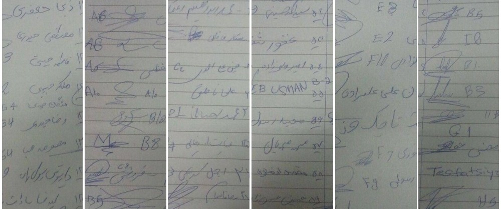

### Letter from the heads of 141 families in the Elliniko camp \(Baseball site\)

Parts of 141 signatures on the letter that was sent to us by the refugees in Elliniko

September 23, 2016\.

In the name of God:

Greetings to all people who work in the service of every human being and every refugee, and to those who have dedicated their lives to help people who are in pain, in need, and homeless\. This letter will explain the conditions of the refugees at the Elliniko Refugee Camp \(Baseball site\) to all organizations working in the field\.

We are not politicians\. We are victims of politics\. We have lost our possessions, livelihoods, and lives because of politics\. Although we come from different countries, different religions, and different ethnic groups, we are first and foremost human\. Many families and children lost their lives in the hope of reaching safe territory\. We took our lives and the lives of our wives and children in our own hands\.

We took a big risk and crossed dangerous borders, travelling through Pakistan, Iran and Turkey, and later crossing the Mediterranean Sea\. Dear leaders of the world, we understand your situation, we know it’s hard to create policies and create change\. We know it takes time\.

Yet, our question is: “do you understand our situation?” If yes, how much do you really know about what we are experiencing on a daily basis in the camps\.

Since February, 2016 we have resided here in the tents with no facilities\. We have bared the burden of the cold winter during which the children, youth, mothers and fathers fell ill with colds, pneumonia, and other infectious diseases\. Because the inside of our tents are wet many camp residents have rheumatism and pain in their backs and legs\.

There is lack of access to doctors and medicine to help us address these problems\. In the spring and summer high temperatures caused heat exhaustion\. The dust of the camp causes respiratory problems\. There are rats, insects and reptiles including snakes everywhere in the camp\. Unclean water has caused diarrhea and nausea\.

The longer we stay here, the worse conditions have gotten and now most people are suffering from mental illnesses, depression, and other diseases that have put pressure on families and which may turn into chronic and/or permanent problems\. Unfortunately, when we ask officials why they are negligent in their obligations to the camp’s residents and about the discrimination between Syrians and non\-Syrians, we are told that this is due to the fact that Afghans are not eligible for relocation and therefore not a priority\.

We are also told that we cannot do anything and we should be thankful for what the Greek government has provided so far\.

We are told we have no choice but to apply for asylum in Greece or face being deported back to Afghanistan\.

The comments of Greek officials compound the multiple pressures on the refugees in the camp\. With the start of the fall, and colder weather, and considering the lack of facilities and the lowering of our immunity due to existing illnesses, people are even more worried and even more desperate to escape these conditions and Greece\.

In order to leave the country we are forced to resort to using smugglers, which puts us in a great danger as you are well aware\. Some additional problems and difficulties in the camp are:

> _1\) Inappropriate environment of the camp i\.e\. residing in the field\._ 

> _2\) The low standard of the tents which are inappropriate for different climates \(rain, extreme cold and heat\)_ 

> _3\) The managers of the camp are not professional\. In addition, there is high turnover rate among camp managers and the lack of continuity among camp personnel means that long\-term plans cannot be executed\. The camp manager’s behavior toward the camps’ residents is inappropriate\. Over the last seven months, there have been seven camp managers\. Each manager has treated us differently and most of them have made false promises to us\._ 

> _4\) There is no one responsible for the maintaining a high level of hygiene in the camp, including the cleaning of toilets and showers\._ 

> _5\) There is a lack of fulltime medical staff\._ 

> _6\) It takes many hours for ambulances to arrive at the camp\. In one emergency situation we waited 10 hours\._ 

> _7\) Camp residents only receive old and worn clothes and shoes\._ 

> _8\) There is a lack of air conditioning during the summer and heat in the winter\. If these are your desired outcomes, we should congratulate you\. You have achieved your goals\. If this is not the case, and you are not really aware of our conditions, please come to the camp and take a closer look at our real conditions\. We don’t want to lose any more lives due to your negligence and we ask you to relocate us to the facilities with the appropriate living conditions\._ 

We hope that no human being finds himself or herself in the same situation and if they should, we hope they will be saved from it\.

_Converted [Medium Post](https://areyousyrious.medium.com/letter-from-the-heads-of-141-families-in-the-elliniko-camp-baseball-site-689989d7a1d8) by [ZMediumToMarkdown](https://github.com/ZhgChgLi/ZMediumToMarkdown)._
