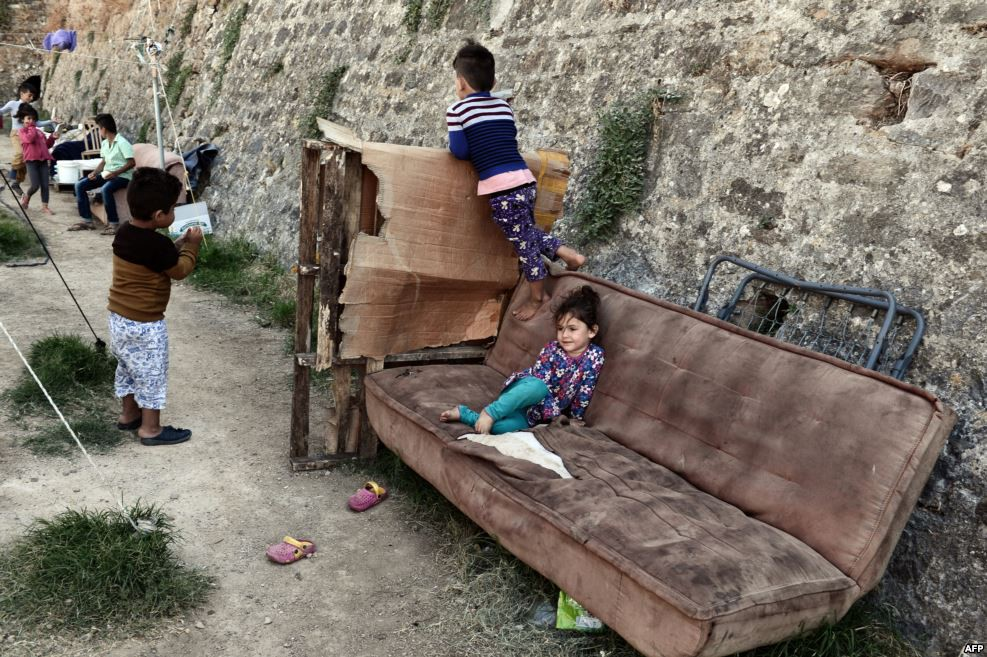
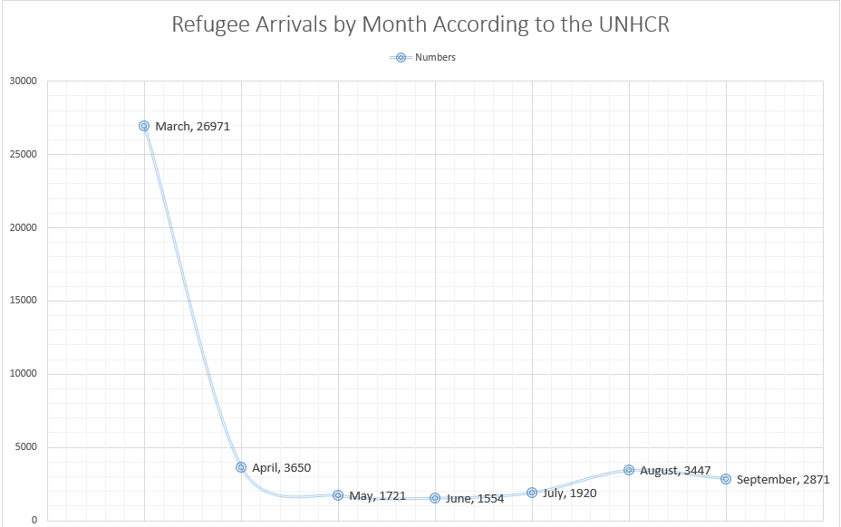
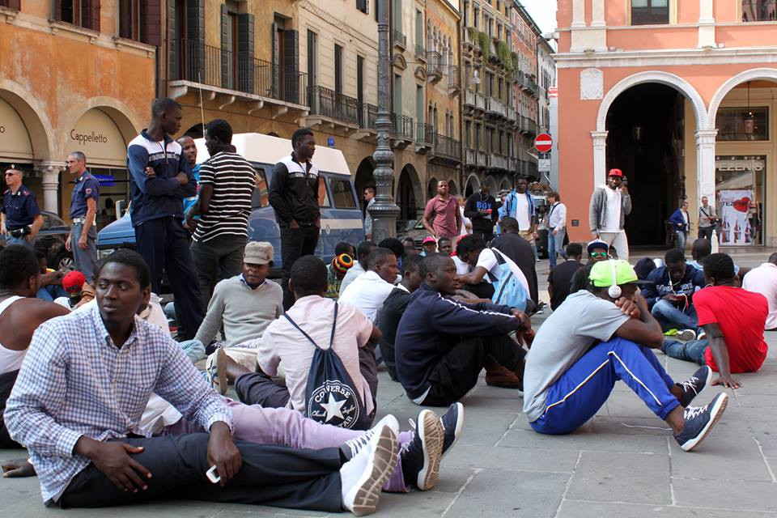

### AYS NEWS DIGEST 29/9 — UN prepares for a mass exodus of civilians from Mosul
#### Meanwhile, according to EU standards, Iraq is a “safe” country and refugees from Iraq have to jump through hoops to be considered for asylum\. This, along with the shame of yesterday’s news of the EU blackmailing Afghanistan to take in refugees deported from Europe, shows that despite posturing, Europe remains morally corrupt and indifferent about the lives of people fleeing war\.

Children playing in a camp on the island of Chios\. Photo Credit: Louisa Gouiliamaki, AFP
#### Iraq
### As the Iraqi military gears up for assault on ISIS stronghold, worries about mass exodus arise\.

The UN warned today that as many as a million civilians, of whom 400,000 may be left without shelter, could be forced out of Mosul as the Iraqi military prepares to retake the city\. Emergency camps have been set up, totaling 18,000 tents, and 50,000 emergency shelter kits are to be distributed\. Another 30,000 will get planks to create some sense of privacy in communal shelters\. The Iraqi government will also extend a helping hand for 150,000 individuals\. The UN continues to be underfunded, having only 33% of the necessary aid\. “Each family plot in a UNHCR camp costs $2,000\. We are short of 6,200 family plots, $15 million\. It’s not cheap,” said Bruno Geddo, chief of the UNHCR in Iraq\.

All of this comes at a time while the EU continues to classify Iraq as a “safe country,” putting refugees from Iraq in a particularly difficult position\. This goes to show how detached EU refugee policy remains from the reality on the ground\.
#### Syria
### UNICEF reports that 96 children have been killed in Aleppo since Friday\.

An additional 223 have also been injured\. Pro\-regime forces have escalated attempts to take rebel\-controlled parts under their control as a ceasefire that had previously been agreed upon was broken\. UNICEF has also reported that there are only 30 doctors remaining in the rebel controlled part of the Eastern Aleppo, who have to care for the 250,000 civilians who have remained in the city\.

The alarmingly low number of doctors in the city can be explained by the fact that the Syrian regime and its Russian allies regularly target hospitals\. Countless examples of hospital bombings have been documented\. The latest of these bombings happened on Wednesday, with strikes disabling the hospital’s oxygen and power generators, forcing the evacuation of the patients\. Such attacks are a violation of international law, and yet, despite countless hospitals being targeted and many doctors being wounded or killed, nothing seems to be done about the problem\.
#### Greece
### No Border Kitchen Lesvos issues a harrowing report on the situation in Lesvos\.

The post, which may be accessed in its entirety [here](https://www.facebook.com/NBKLesvos/posts/790511737755284) , speaks of an unprecedented wave of deportations from the island, with random arrests happening throughout, and reports of violence being employed by the police\. Some of the people arrested and slated for deportation were in the middle of applying for asylum\. They report that a total of 136 people were deported on Monday alone\.
### Khora Community Center promises support for vulnerable people\.

The center is scheduled to open on Monday, October 3\. The space will be offering support, food, and various services to not only refugees but to other vulnerable populations in Athens as well\. In their own words, [“The space has been created for long term residents and new arrivals in Athens to support each other\. We are always looking for more people to get involved and become a part of this project, especially from the local community\. We need help with cooking, child care, teaching, legal support, information and any other skills you have to offer\. This is an open space to be shaped by the people who use it\.”](https://www.facebook.com/KhoraAthens/photos/a.534472740058672.1073741829.531581440347802/592360264269919/?type=3)
### Numbers

There are a total of 151 new arrivals in the last 24 hours: 104 on Lesvos and 47 on Samos\. This brings the total number of refugees on the island to 14,003\. This is the first time that the figure has been over 14,000\. The population continues to grow despite official camp capacity remaining at 7,450\.

In the last 24 hours, Megisti formerly housing 14 refugees has been removed from the list of camps\. Skaramagas Dock witnessed a drop of 121 people, bring the number from 3,500 to 3,379\. The complete figures provided by the Greek government may be found [here](http://media.gov.gr/images/prosfygiko/REFUGEE_FLOWS-29-09-2016.pdf) \.

September has proven to be a rather slow month for refugee movement into Europe, as evidenced by the chart below\. The numbers continue to be higher than they were before the attempted coup in Turkey in July, but remain comparatively small\. Such results come as a result of the EU\-Turkey deal, which formally remains on the table but which seems to be coming to its end\. An end to the deal would mean an end to Turkish border control preventing refugees from making the crossing in larger numbers\.

### In the Loop has published an excellent newsletter on the Moria Fire\.

The newsletter features the testimony of the camp’s inhabitants and may be accessed [here](https://lookaside.fbsbx.com/file/in_the_loop_%2315-en.pdf?token=AWzSNBMq8H0kkS4POaBg3Vg50nQdLW1xA_4tgl0rZOmt5nIPkops9iP2x595GmInDyuDnAf2XaJQ1uB5KPVd9sNU6Dp0M7VEPrUlKms_5Z_Zr1yzPicTOAJccROlGhjQw-KxXOhZGyT09-w12zMh3X6e7_VGz8hqttrhRWvU1eGLvg#) \.
#### Italy

Refugees staging a peaceful protest of conditions in ex\-barracks Serena in Treviso\. Photo Credit: Melting Pot Europa
### Refugees in Treviso protest living conditions\.

More than 150 asylum seekers — most of them residents of the Centro di Accoglienza Temporaneo per Migranti, situated at the ex barracks “Serena”\- are protesting in front of the city’s prefecture\.
Since yesterday, they have been hoping to meet with the prefect in order to receive clarifications on the long waiting time to receive ID documents, or even to get an interview with the commission\.
They are also denouncing the inhumane conditions in which they live, overcrowded spaces \(more than 880 people are hosted in the ex barracks\), lack of proper hygienic standards, and and poor food servings\. Moreover, there is no legal service active in the center\. The asylum seekers are worried about the large number of international protection requests which have been rejected and complain about the no clear policy and system of the local authorities\.
### Vigil to be held for refugees who lost their lives\.

On Monday 3rd October, associations Archivio Memorie Migranti and 4CaniperStrada, collaborating with high school Margherita di Castelvi and 12th and 13th Educational Club \(circolo didattico\) in Sassari will host a vigil for refugees killed while making the crossing\. This is the National Day in Memory of the Victims of Immigration\.

On 3rd October 2013, a ship sank close to Lampedusa, causing the death of 367 migrants\. The institution of the National Day in Memory of the Victims of Immigration represents an important step to remind everybody of all the migrants who lost their lives, and the ones dying every day on their migration route to Europe\. Remembering this day is a way to associate a story and a name to each person, reflecting on their dreams of freedom and ambitions, and to comprehend and interpret the migratory phenomena\.

The event will be held at Cinema Auditorium Provinciale in Sassari, in via Monte Grappa 2, from 9,30, involving students and schools of different levels\. The program includes:

\- Vision of the documentary “Asmat — Nomi” directed by Dagmawi Yimer \(2015\), presented by the Eritrean activist and AMM founder Gabriel Tzeggai

\- Presentation of the project “Benediddos” \(the blessed ones\) from headmaster Cristiana Piazza; the project foresees the inclusion of the refugees in academia

\- Vision of the participation documentary “Oltre i Miei Confini” \(beyond my borders, 20', 2016\), produced by association 4CaniperStrada within the project “Video Partecipativo Sardegna” \( [www\.videopartecipativosardegna\.net](http://l.facebook.com/l.php?u=http%3A%2F%2Fwww.videopartecipativosardegna.net%2F&h=dAQEZS44S) \), realized by a class of the high school, within an educational laboratory in collaboration with the refugees centre Baja Sunajola di Lu Bagnu \(Castelsardo\) \.

\- Meanwhile, schools San Donato and San Giuseppe will stage a performance of the show “TUUTTI in Viaggio\!” \(Let’s travel\! \)
#### France
### A list of drop\-off points for UK residents wishing to donate to refugees in Calais may be found [here](https://docs.google.com/spreadsheets/d/1MBIIQkMVWw3-DNb8KszPbuCWvGVDLE4u6yvF8ZGVMYA/edit?usp=sharing) \.

You can also buy a backpack for a refugee in Calais with a 20% discount thanks to the lovely people of Leisure Fayre\. The selection is found [here](https://www.leisurefayre.com/section.php/86100/1/help_refugees) \.

_Converted [Medium Post](https://areyousyrious.medium.com/ays-news-digest-29-9-un-prepares-for-a-mass-exodus-of-civilians-from-mosul-e4e8f4e64396) by [ZMediumToMarkdown](https://github.com/ZhgChgLi/ZMediumToMarkdown)._
