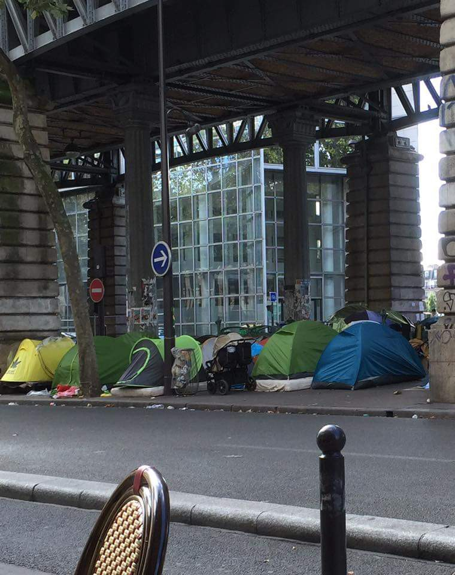
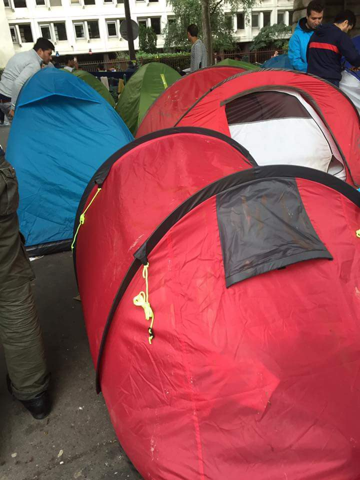
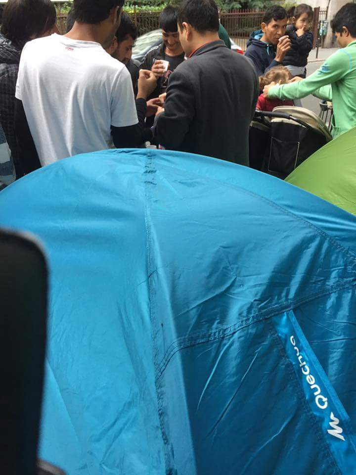
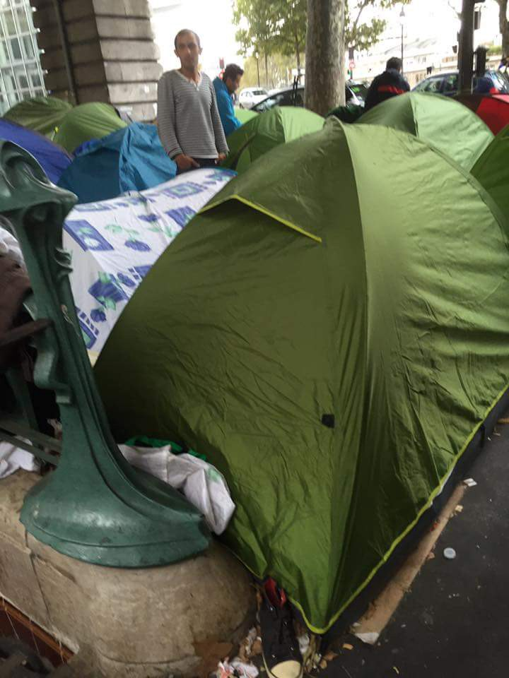
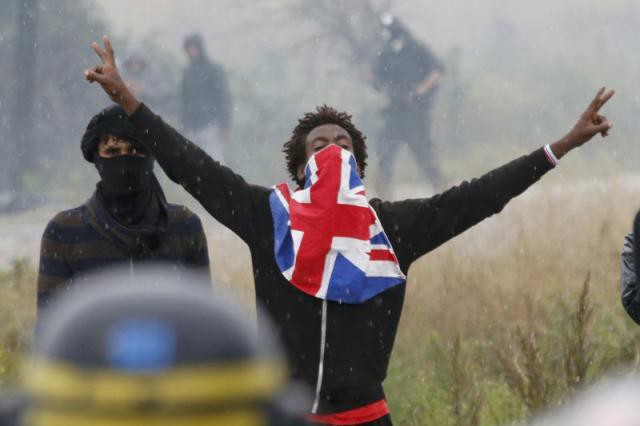
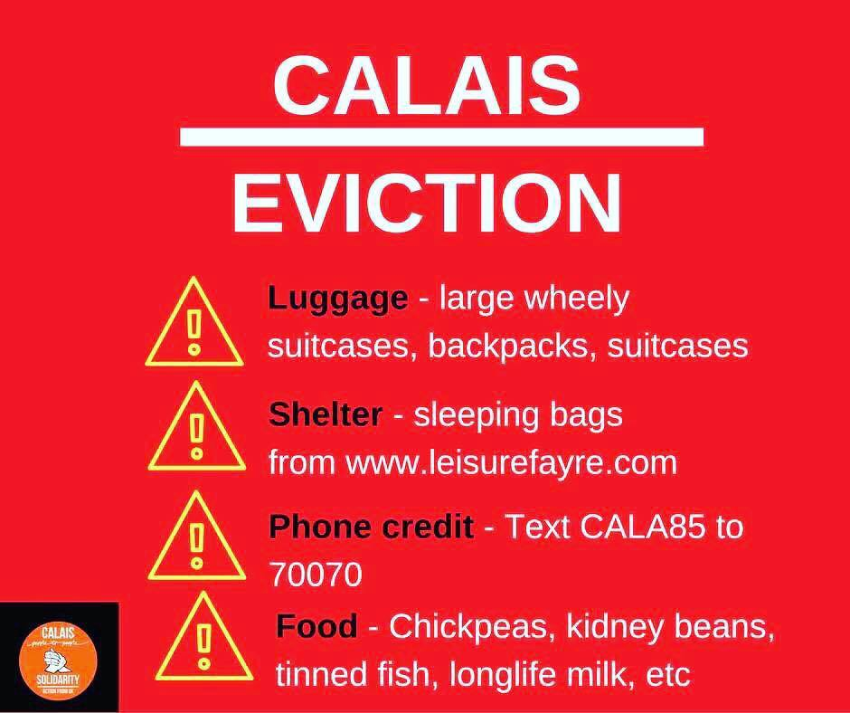
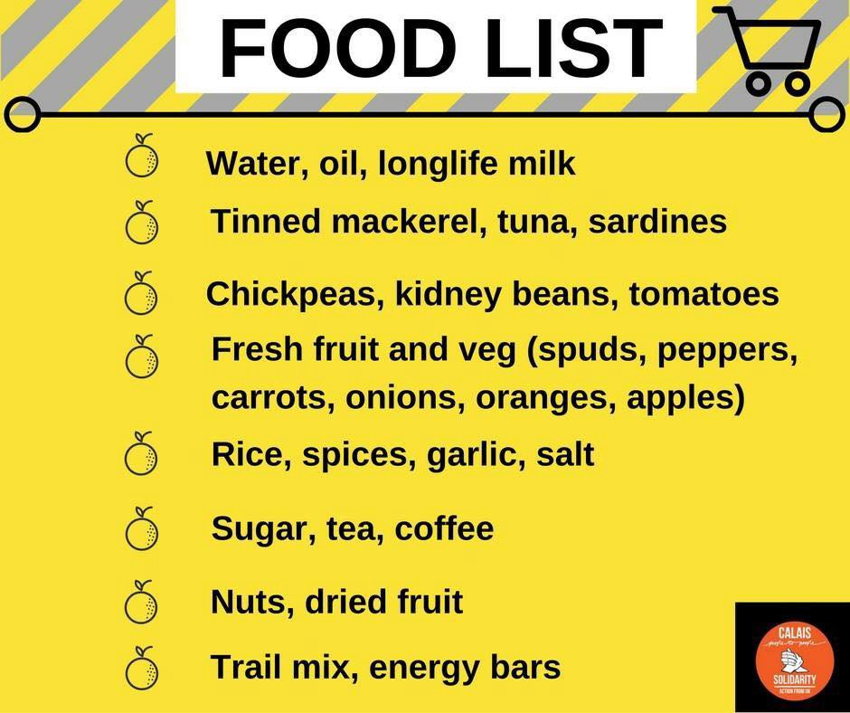

### AYS 1/10: Refugees welcomed to Europe with water cannons, flash balls, pepper spray and teargas

> Calais closure confirmed, volunteers and refugees protest the demolitions, only to be met by police violence\. Following the UK promises, still no solution for the Calais refugee children\. An afghan boy commits suicide in Sweden, following Europe’s continuous postponment of resolving his case\. Is this how we welcome people escaping war zones? 

](assets/43f6ecf0395a/1*HxSzJvabBNtQNScOxhfrYw.jpeg)

Credits: Credits: C [**endrine Pouzet**](https://www.facebook.com/cendrine.pouzet)
#### Thousands of refugee lives to be uprooted once again in forced evictions: Refugees are becoming the Europe’s new homeless class

The Calais camp in France is home to 9,000 of the Europe’s most vulenrable refugees\. A week ago, French President Francois Hollande has confirmed plans to close this camp, with but a fleeting idea of where these people will go after the camp closes\.

French president Hollande said on Saturday that he hopes authorities can relocate Calais refugees to reception centres across France in the coming weeks\. France is trying to find 9,000 new places at “welcome centres” across the country to receive those [living in the camp](https://www.theguardian.com/uk-news/video/2015/jul/27/calais-migrants-jungle-camp-video) before the beginning of winter\. The reception centres will hold 40–50 people for up to four months while authorities study their cases, Hollande said\. People who do not seek asylum will be deported, he added\.

The plan to relocate the refugees to towns across France has prompted vehement protests from many local conservative and far\-right politicians, who say they fear the consequences of having refugees in their towns\. Hollande indirectly criticised that resistance and called for more solidarity, noting that neighbouring Germany had taken in one million people, compared with the 9,000 that will be relocated from Calais\.

What is more, there is little guarantee that refugees will want to go to these “Welcome centres”\. Above all, refugees fear deportations and often perceive those centers as the deportation processing hospots which has, in fact, often showed as true\. Thusly, refugees will not go there, but instead be forced onto the streets following the evictions\.

There are currently around 200 refugees on the streets of Paris alone\. Most of them are located on Jaures street, where the refugee tents have now been fenced off, so people are crammed into a tiny space under the metro bridge\. Refugees are literally stepping on each other\. The streets are also surrounded on all sides by busy roads, which makes the space extremely dangerous, especially for children\.

Jaures street\. Credits: RAN UK

Refugee tents crammed under the bridge\. Credits: RAN UK

Efforts towards closing Calais have previously been unsuccessfully attempted as well\. Half of the Calais camp was dismantled in March but its population has since doubled\.

Calais is not being closed with a necessarily bad intention\. Hollande insisted that the reason for closing it is the poor living conditions in Calais, “We cannot have such camps in France”, Hollande insisted\. He said that France must show it is “capable of being dignified, humane and responsible”\. However, the real question is whether the camp’s destruction can really be a solution, or will it engrave the problem of displacement of refugees within Europe?
#### 1/10 Demonstrations

Multiple volunteer and activist groups argue that dismantling Calais camp will only worsen the situation of refugees in France by making them a new class of Paris homeless, destitute, unserviced and in hiding due to fear of deportations\.

Over thirty organizations and groups have called for a demonstration today in Calais in solidarity with the soon to be displaced refugees\. Rather than destroying the camp, the organisations places the following demands upon France and Europe:
- France and the UK to break the Le Touquet agreement, by which the UK border controls are in France
- Stopping the construction of the great wall between France and the UK, along the route national 216
- For national reception scheme to be implemented in France, as France is one of the rare European countries where refugees are really put to the mercy of street life and left without any national support
- The abolition of the Dublin regulation which enforces refugee returns to random countries where they were first registered along the route, althought those may not ne countries where they would want to live
- Dismantling of Frontex, the European border control scheme which is to be blamed for much of the refugee life loss
- The closure of all detention facilities, for refugees are not criminals but victims of war

](assets/43f6ecf0395a/1*Lgo_Z-dkn1d91geMCVPpbA.png)

Leaflet which calls for a demonstration in Calais on Oct 1st\. Credits: [Calais Migrant Solidarity](https://calaismigrantsolidarity.wordpress.com/)

Following this call, about 200 migrants and some 50 protesters assembled under a bridge to protest against living conditions and demolitions in the nearby camp that President Francois Hollande has vowed to close by the end of the year\. Another 177 protesters who left Paris on Saturday aboard four coaches were blocked by police at a toll road Setques about 30 miles \(48 km\) short of the northern port\. Police was allowed to prevent volunteers from coming to Calais as protesting about anything concerning the refugees was forbidden on Thursday by the prefect, thus denying volunteers and refugees two important human rights: to move and to protest\.

](assets/43f6ecf0395a/1*17BcxKbQwfsYabp5YZUkBg.jpeg)

Credits: C [**endrine Pouzet**](https://www.facebook.com/cendrine.pouzet)

The demonstrators were met by police water cannons, flash balls, pepper spray and teargas\. The police blocked the demonstration and repeat the well used refrain “Go back to the jungle”; the jungle the Europe itself created\.

](assets/43f6ecf0395a/1*IXqDAX2gqcNLYqHU0UmPAA.jpeg)

Credits: [**Louis Witter**](https://twitter.com/LouisWitter)

](assets/43f6ecf0395a/1*BfD2QyUn5SRICWcDTxCmRQ.jpeg)

Credits: [**Louis Witter**](https://twitter.com/LouisWitter)

](assets/43f6ecf0395a/1*9MwQNaAZoJixtj7Spa2jdw.jpeg)

Clashes between police and refugees during the Calais clousure protest\. Credits: [Reuters](http://uk.mobile.reuters.com/article/worldNews/idUKKCN1213IA)

A refugee showing a peace sign and a British flag, thus expressing its hopes for relations between Britain and refugees\. Credits: Reuters

](assets/43f6ecf0395a/1*HxSzJvabBNtQNScOxhfrYw.jpeg)

Credits: C [**endrine Pouzet**](https://www.facebook.com/cendrine.pouzet)

](assets/43f6ecf0395a/1*fuMJbkkhfT435X9Bdg1AGw.jpeg)

Credits: C [**endrine Pouzet**](https://www.facebook.com/cendrine.pouzet)

](assets/43f6ecf0395a/1*aLJ8uSi_5BN3XaHMbpEGrg.jpeg)

Credits: C [**endrine Pouzet**](https://www.facebook.com/cendrine.pouzet)

Many of the Calais refugees are failing to claim asylum in France as they wish to reach their families and perceived better opportunities in the UK\. This is especially true of the 1,000 unaccompanied Calais refugee children who are trying to reach their families and guardians in the UK\.

Lily Caprani, Unicef UK’s deputy executive director, called on Britain to act to help lone children stuck in the camp, who she said were prey to child traffickers\.

> “For refugee children, who left their homes fleeing conflict and persecution, the pending demolition of the camp threatens their hopes of reaching their families in the UK\. It is now more urgent than ever for our government to get these children to safety\. Before the bulldozers arrive, there must be robust plans to safeguard the hundreds of unaccompanied children currently stranded in the camp\. If mistakes from the first eviction are repeated, we will see more children going missing, falling prey to traffickers and facing the winter without a home\.” 

However, the UK Home Office spokesperson said: “The dismantling of the camp in Calais is a matter for the French government\.” Herewith, the UK indicated that its care for refugees is still a dead letter on a paper\. Namely, its promises to telocate the Calais refugee minors have not happened yet, neither there is any sign of the program’s initiation\. Despite a commitment in May to take thousands of child refugees from across Europe, not a single unaccompanied minor has been accepted to the UK\.

Incidents of self\-harm and depression among children in the [Calais](https://www.theguardian.com/world/calais) refugee camp are increasing as the mental health of unaccompanied minors deteriorates in advance of the site’s demolition\. Charities, volunteers and aid agencies say they were witnessing psychological collapse among many of the site’s child refugees after President François Hollande confirmed last week that the camp would be shut down\.

One senior official from Médecins Sans Frontières \(MSF\) warned that some child refugees had threatened to harm themselves if the camp was destroyed\. Aid workers also said other unaccompanied minors, many of whom are eligible to claim asylum in the UK, had talked about killing themselves, such was their despair over the camp’s future\.

Abdul Afzali, who works for the charity Refugee Youth Service and looks after unaccompanied minors inside the Calais camp, said:

> “Some are burning themselves with cigarettes, one arm, then the other\. Others have told me that they want to jump in front of a lorry and give up\. Unfortunately, most have developed serious depression\.” 

Liz Clegg, who runs the site’s unofficial women and children’s centre, said that from her observations, as many as 80% of the site’s unaccompanied minors exhibited mental health issues that would be flagged up as serious in an institution where normal child protection safeguards existed\.

> “They would be flagged up as ‘at risk’ — some would be placed on suicide watch\. There is self\-harming, repetitive behaviour; many of them are stuck in a loop\. We have nine\-year\-olds who are barely hanging on,” said Clegg\. 

Alexander Simmons, a volunteer for charity Care4Calais, confirmed it was monitoring “quite critical mental health issues” among a number of child refugees in the camp and that the longer they spent in the camp, the more vulnerable they became\. He also lamented the fact that there was no record of the extent of the problem\. The camp is not officially recognised by the authorities and no official mental health assessments have been conducted among its children\.

Mary Jones, who runs Jungle Books for the camp’s child refugees, revealed that she had repeatedly seen new arrivals gradually go from initial optimism to a depressed state; some youngsters lay in bed for days\. Simmons said that on Thursday an Afghan boy was taken from the camp to hospital after spending 48 hours lying in bed, unable to move\.

Here are several testimonies of Calais refugee children
#### **Idrissa, 17, from Darfur, Sudan**

Idrissa has been in the camp since February and is hoping to be reunited with his uncle in Birmingham\. Since leaving Darfur last year, he has lost contact with his entire family and has no idea where they are, or even if they are alive: “I have tried calling, but I have no idea what has happened to them\.” The teenager’s only ambition is to reach the UK\. Waiting in the Calais camp has been a grim and depressing experience\. “There is too much violence here\. We feel afraid,” he says, gesturing to a group of unaccompanied youngsters nearby\.
#### **Yemani, 15, from Tsorona, Eritrea**

Yemani has been in the Calais camp for three months and is hoping to be reunited with his aunt, who lives in London\. He is travelling alone and says that life inside the camp scares him: “There is too much fighting, people hitting each other\. Bigger people than me hit me\.” The teenager also says that the French police terrify him, pointing to a used teargas canister lying in the dirt outside a tent where some of the unaccompanied minors gather\.

“They hit us, and fire at us,” he says, rubbing his eyes to mimic the pain\.
#### **Fadl, 17, from western Sudan**

Fadl arrived in the Calais camp four weeks ago, the end of a journey from close to the Darfur border via Libya, across the Mediterranean and through Italy\. His aim is to reach London and find a job as a mechanic\. He says that he is petrified of the camp, especially at night, and has sought the protection of Sudanese elders to keep him safe\. “There are big problems here, people fighting, coming to the tents and scaring us,” he says\. He thanks the charities for providing sustenance and says he is “extremely grateful” for their kindness\.
#### **Mubarek, 16, from Ethiopia**

A member of the persecuted Oromo people, Mubarek, who arrived in Calais three months ago, says his family are counting on him making it to the UK\. Like many unaccompanied minors, he felt unsafe in the camp\. “It is dangerous\. Also, the police come in and scare us\. If they try and shut the camp, they will be very bad,” he said\. Mubarek raises his his hands and waves them frantically, recalling the terrors of his journey from northern Ethiopia: “I try not to think about it,” he says\.
#### Donations for Calais

In these hard times, public involvement and your donations are more than needed\. [Here](https://docs.google.com/spreadsheets/d/1YhW04fSvx897t42pGZc2sp1Z7CmkyvSaj0tOofBxPwI/edit#gid=1659061988) is a list of times which are needed as essential travel items for the unaccompanied minors and families in Calais\. If anyone could donate any of these items that would be greatly appreciated\.

Priorities are:
- Any form of shelter: tents, sleeping bags, blankets, roll mats
- Bottles of water, as people are likely to lose their access to the standpipes and we are not sure where they will be able to get safe drinking water from
- Food: all the kitchens are running low on food
- Wheelie suitcases and medium or large rucksacks, so refugees can move their belongings in relatively clean state
- Phone credit, as forms of communications are crucial when people are dispersed and on the move, especially so volunteers could keep in touch with the unaccompanied minors

Many volunteer groups will be driving to Calais in the upcoming weeks, and in this list [here](https://docs.google.com/spreadsheets/d/1MBIIQkMVWw3-DNb8KszPbuCWvGVDLE4u6yvF8ZGVMYA/edit#gid=0) you may find the name of the organisation, its needs, collection point and drop off time\. Please go through the list, see what you have that is needed, and contact the organisation that will drive your donation to refugees\.

A team from Carry the Future will be headed to Calais next Saturday to deliver rucksacks to the camp\. If you have any backpacks to donate, please write to the organisation [here](http://Baby Carrier Collection for Refugees - UK) \.

Donate in person: Little GEMs, 243 Victoria Park Road, London\. E9 7HD
Donate by post: Carry The Future UK, M42, 400 Wick Ln, London E3 2JG
Buy new from our Amazon Wishlist: [http://bit\.ly/rucksacksforcalaisfamilies](http://bit.ly/rucksacksforcalaisfamilies)

](assets/43f6ecf0395a/1*Oa2bs4XpguffXQ-nSsNLcA.jpeg)

A donated backpack\. We hope the donor recognizes his gift and sees is it being in good hands \(or on good back\) \. Credits: [Baby Carrier Collection for Refugees — UK](https://www.facebook.com/CarryTheFutureUK/)

With the coming eviction phone credit becomes a vital asset\. Above all, is the main mechanism for keeping in touch with unaccompanied minors during the eviction, so it’s really important\. Help through regular top\-ups\!

](assets/43f6ecf0395a/1*bMMaUGPQhu9llChWWvnDGA.jpeg)

Credits: [**Calais — People to People Solidarity — Action from UK**](https://www.facebook.com/photo.php?fbid=10154117096924472&set=gm.1188202464587832&type=3)
#### Hungary
### This Sunday, Hungarians go to the polls to vote on the referendum question: “Do you want the European Union to be able to order the mandatory settlement of non\-Hungarian citizens in Hungary without parliament’s consent?”

According to Fidesz MEP György Schöpflin, the referendum is “about strengthening the legitimacy of the Hungarian government in its disagreement with the European Commission\.” Schöpflin recently suggested on social media that pigs’ heads should adorn Hungary’s border fences to deter refugees\.

And for desperate refugees on the border, things have become ever more brutal\. Lydia Gall from Human Rights Watch has documented evidence of people being severely beaten with batons, bitten by dogs, punched and kicked by men in uniforms “consistent with those of Hungarian police, army, or local paramilitary — so\-called field guards\.”

While far right paramilitary groups have been patrolling parts of the border to catch ‘illegals’, the government has gone one better — it recently announced that 3,000 people will be recruited as members of ‘border hunter action units’\. After a few months’ basic training, these recruits will be let loose with guns and ammunition to go hunting refugees\.

Billboards, buses, trams and wall and bridges across Hungary have been plastered with a “did you know?” government\-sponsored poster campaign full of deceptive messages such as that sexual harassment of women has risen sharply across Europe since the beginning of the migrant crisis, or that the Paris terrorist attack were committed by immigrants\. The official referendum propaganda booklets, sent to every home, contained the blatant lie that several hundred immigrant ‘no\-go zones’ exist in cities across Europe sparking diplomatic protests\.

Orbán speaking to a Reformed Church media outlet on the impossibility of integration of refugees and migrants stated: “You need to have a wild imagination to think that masses of young Afghan men would marry into traditional German Christian families, or that Christians would marry into Muslim families\. The best that we can hope for is peaceful co\-existence, but not integration\. This is what we call parallel societies\.”

Where lies and propaganda don’t have the desired effect, Orbán and his henchmen have deployed more heavy\-handed tactics\. According to Hungarian Spectrum, Orbán emphasized that this nationwide referendum is also thousands of local referendums, meaning that the government will judge each city, town, and village according to the outcome of the referendum\.

Towns where mayors refused to send out propaganda material have been warned that they will be the ones hosting the migrants in the event of a ‘yes’ vote\. Roma communities have been told that if Hungary has to admit refugees they will be deprived of government assistance\.

Opposition parties and NGOs have called for a boycott or spoiling of votes in the hope that turnout will be less than the required 50% for the referendum to be considered valid\.

Whatever the outcome of this shameful charade of a referendum, the relentless, government\-sponsored, anti\-refugee and anti\-Muslim propaganda, with its attendant scapegoating and scaremongering, has had an detrimental impact\. It has hardened hearts and deepened prejudice against people desperately fleeing war and conflict\. Worse still, this inhumane populist approach may embolden neighbouring countries to follow suit\.
#### Anti\-referendum demonstrations

Twenty\-two Hungarian NGOs have launched a joint campaign to persuade Hungarians to either boycott the October 2 referendum or cast an invalid ballot, [reports](http://index.hu/belfold/2016/09/14/22_civil_szervezet_kampanyt_indit_az_ervenytelen_nepszavazasert/) daily online Index\.hu\.

They are doing so in the belief that the referendum does not contribute to the future of either Hungary or the European Union\. In a joint statement, the 22 NGOs emphasize that the referendum is pointless:

_No decision has been reached by the EU, and there is not discussion either, of prescribing an obligatory “settlement” quota\. Moreover, there is no concrete legal consequence for the answer given to the referendum question\._

The organizations believe the purpose of the referendum and accompanying campaign is to incite hatred of the refugees arriving to Europe\. They believe the real question is whether Hungary is capable of becoming a humane community\.

](assets/43f6ecf0395a/1*RrGbfJnp3ONDtGqX3kn-PA.jpeg)

Credits: [**Tamás Zoltán Szüts**](https://www.facebook.com/szuts.tamas)

](assets/43f6ecf0395a/1*-ifT_czKRwtfjt_at6pmlQ.jpeg)

Credits: [**Tamás Zoltán Szüts**](https://www.facebook.com/szuts.tamas)

](assets/43f6ecf0395a/1*IEVfM-6mW2vLmiJD_QYJqQ.jpeg)

Credits: [**Tamás Zoltán Szüts**](https://www.facebook.com/szuts.tamas)
### Other important news in brief:
#### Fighting intensifies in Syria

Russia is sending more warplanes to Syria to bolster its air campaign\. Fighting is reportedly intensifying a week into the latest Russia\-backed Syrian government offensive to capture rebel\-held eastern Aleppo and crush the last urban stronghold in a five\-year revolt against President Bashar al\-Assad\.

Aleppo hospital was hit by barrel bombs and cluster bombs\. This crucial facility in rebel\-held district had already been bombed earlier in week in an assault described by UN chief as war crime\.
#### Europe begins to prepare for collective deportations of refugees to Afghanistan

The British organization, [Statewatch](http://www.statewatch.org/) reveals that the European Union is about to sign, at the time of the [conference of 4th and 5th Octobe](http://www.statewatch.org/news/2016/sep/eu-council-afghan-conf-background.pdf) r on Afghanistan in Brussels, an agreement with that country to boost voluntary and forced returns and the organization of charter flights\. The agreement will take effect from the day of its signing, and evictions will be facilitated through the issuing of European laissez\-passer\.
#### Arrivals of boat refugees to Greece continues

Lesvos: 21
Chios: 103
Samos: 29
Total: 153

3 voluntary returns
#### Reports that police harassed refugee kids in Athens to be probed

A prosecutor has ordered a preliminary investigation into reports that five refugee children were harassed by officers at a police station in Omonia Square in the center of Athens last Tuesday\.

According to reports, the five minors, aged between 9 and 14, were stopped in the street by officers and taken to the local precinct because they were carrying bags containing plastic guns and costumes for a theatrical show\.

They were detained for seven hours, during which time the children said they were subjected to sexual innuendos, racist comments and other humiliating treatment\. The minors also said that during their detention they shared a cell with drug addicts and other criminals, and did not have access to drinking water\.
#### A group of 30 Germans has attacked a group of 10 migrants in the German town Schwerin, with one person slightly injured

Police have increased their presence in the town in recent weeks following a number of confrontations between migrants and locals\.
#### Afghan boy’s hope of new life in Europe ends in suicide

Mustafa Ansari’s journey ended one April morning in his bedroom in a quiet Swedish village\.

At around 7 a\.m\., staff at the young asylum\-seekers’ center where Ansari was staying found him dead\. The sheets of his metal bunk bed were tied so tightly around the Afghan teenager’s neck, an inquiry later learned, the staffer who found him had to cut the noose with a knife\.

Around the soccer\-mad boy’s room were brightly colored Post\-It notes scribbled with Swedish words he had been learning\.

An autopsy found Ansari, who had no papers but was described in the autopsy as 17, had committed suicide\. During nine months in Sweden, the authorities had not managed to carry out a single interview for his asylum application\.

The young Afghan was a new kind of casualty in Europe’s migration crisis\. While thousands have died on the journey to Europe, Ansari made it, only to become caught up in an overloaded system\. His story highlights the limits on capacity even in a country like Sweden, which has one of the most open policies towards migrants and refugees\. It also underlines the anxieties and risks faced by the more than 100,000 unaccompanied young asylum\-seekers who have reached Europe since 2015\.
#### After the eviction of Via Cupa yesterday, 15 more people arrived during the night\. They slept rough in the street

](assets/43f6ecf0395a/1*MS_2xARCxfI_qy6qHwcOUQ.jpeg)

Credits: [**Baobab Experience**](https://www.facebook.com/BaobabExperience/)

](assets/43f6ecf0395a/1*nGQ67YP_gnVsosRmEbeMHw.jpeg)

Credits: [**Baobab Experience**](https://www.facebook.com/BaobabExperience/)

_Converted [Medium Post](https://areyousyrious.medium.com/ays-1-10-refugees-welcomed-to-europe-with-water-cannons-flash-balls-pepper-spray-and-teargas-43f6ecf0395a) by [ZMediumToMarkdown](https://github.com/ZhgChgLi/ZMediumToMarkdown)._
