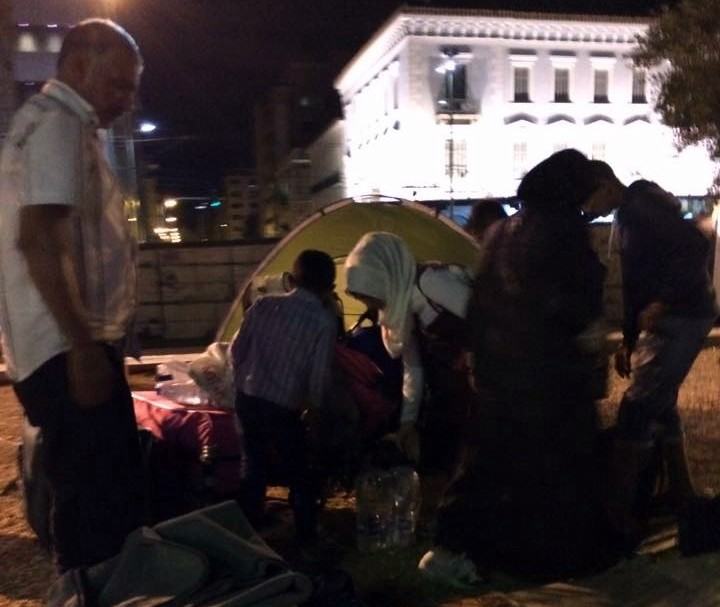
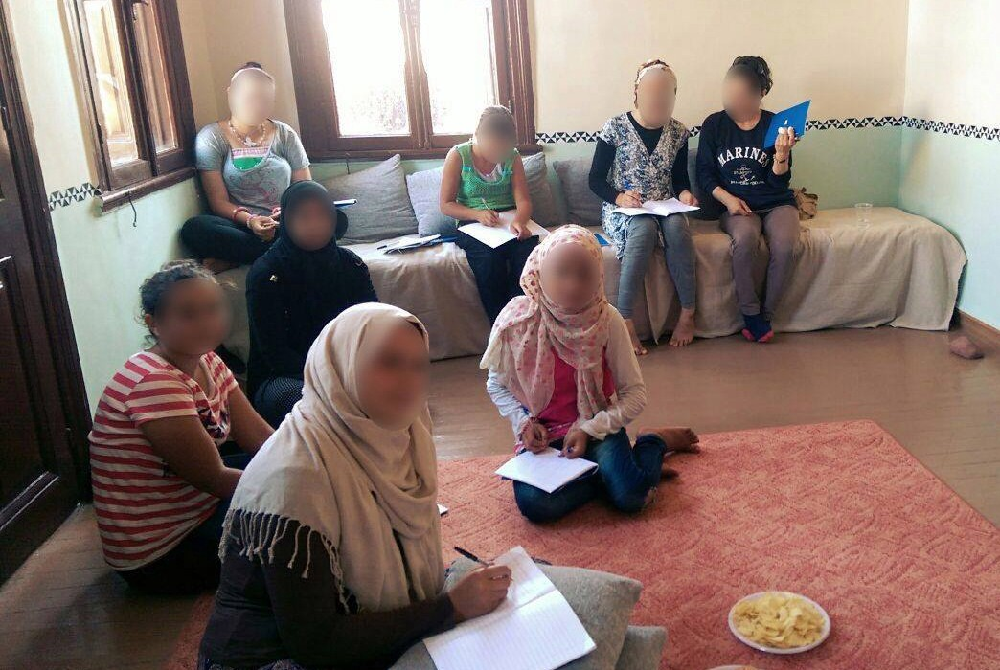
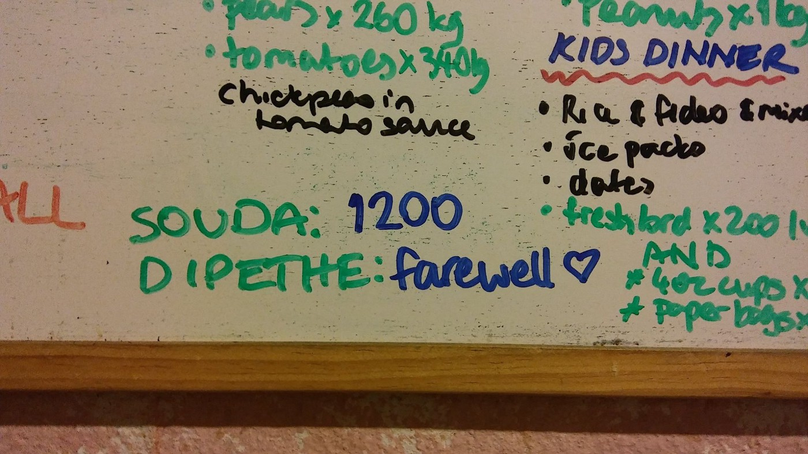
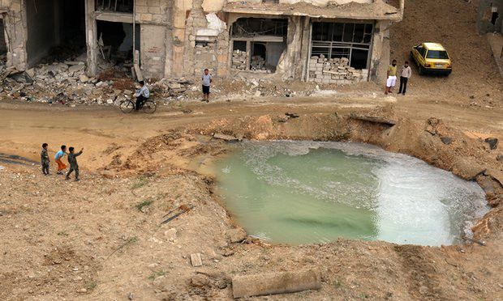
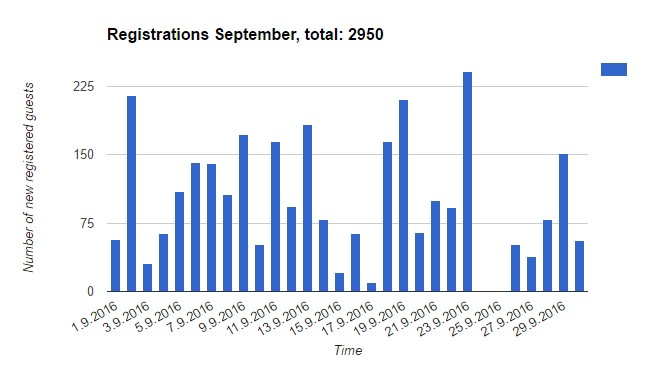
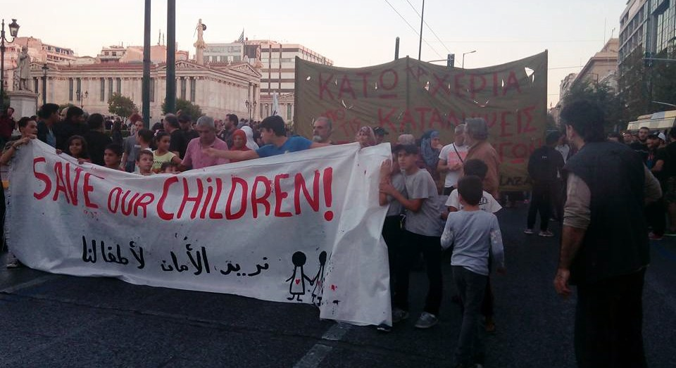
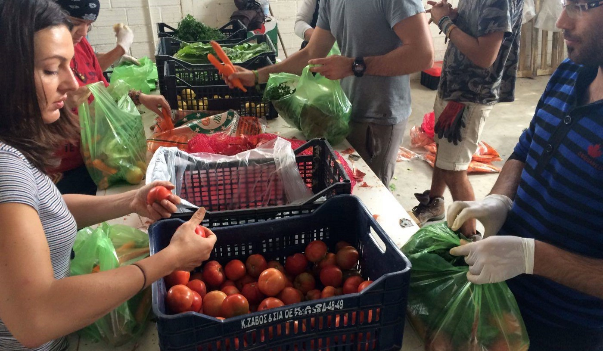
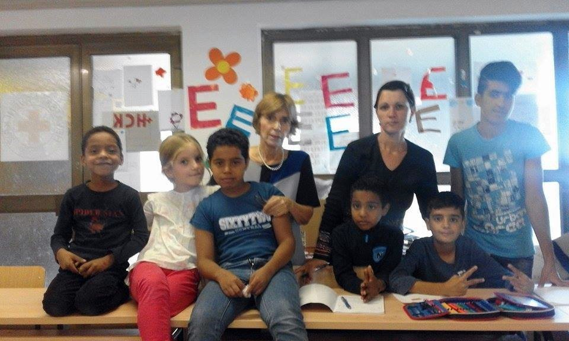
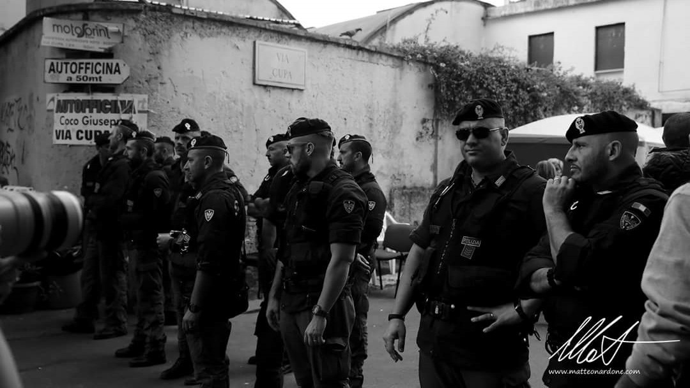
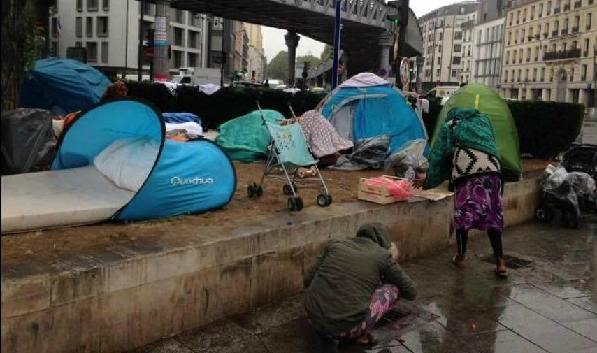

### AYS 30/9: UNHCR sends refugees to the streets
#### Volunteers struggle to provide accommodation for refugees who arrive to Athens from the islands\. Public outrage in the wake of shameful arrests of refugee children\. Situation worsens in the Balkans\. Hundreds of refugees sleeping rough in France

](assets/7e1094acbefb/1*_FQmj9eZWyWRXHPR-UYiJA.jpeg)

Photo of a refugee child by our collaborator, the 18\-years old Syrian refugee Abdulazez Dukhan / [Through refugee eyes](https://www.facebook.com/throughrefugeeeyes/?ref=page_internal)
### Vulnerable refugee families sent to the mainland without accommodation or any form of support

Following many conversations we had with our fellow volunteers from Chios and Athens, we want to warn about the irresponsible and dangerous practice of UNHCR branches on Chios and Leros, possibly other islands as well\. On several recent occasions we were warned about entire families, including those with small children, sick and/or elderly, who have been cleared to leave the islands by UNHCR, but were left without any accommodation or other form of institutional support on the mainland\. Volunteers have been struggling to provide alternative forms of accommodation for them, usually in the squats, but also pulling their private contacts to find places in the camps for those who are left on the streets after arriving from the islands\.

Entire families are sometimes left on the streets after arriving on the mainland\. Photo: Rando Wagner, Athens

A week ago, a family of 12, from Aleppo, was found by volunteers, sleeping rough at the Omonia Square in Athens\. This was one of the first cases of refugees arriving from Chios without the previous announcement\.

> Our group has welcomed at least 150 people who have arrived like this since the end of June\. They usually come from Chios, sometimes Leros, but until now local UNHCR was sending e\-mails to volunteers on the islands, and then volunteers would alarm us, to arrange some form of accommodation before the families arrived\. Ten days ago, the e\-mails have stopped, but the refugees kept arriving\. The family I met the other night had 6 or 7 small children and they ended on the street\. Squats are full and we’re trying to put them in camps, but they are sometimes also full\. Right now, a woman with her 2\-year old daughter and her elderly mother is waiting for me in the basement of one squat, while I’m trying to find some better place for them\. UNHCR got millions of euros to take care of the refugees\. Where did that money go? They should be doing this — said Rando Wagner, London\-based volunteer who often visits Greece, in a recent phone call\. 

Single mothers with children might be at risk after leaving the islands\. Photo: Athena Centre for Women, Chios

This situation was also confirmed by Gabrielle Tan, the founder of the Athena Centre for Women on Chios, who has expressed her concern about many vulnerable families who are sent to the mainland with neither a place in an official camp nor any other accommodation offered\. Every now and then, she issues a public appeal for help if she doesn’t manage to find a solution for families who depart to the mainland with nothing but ferry tickets\. Most of the Athens squats are overpopulated and finding accommodation for vulnerable families is becoming harder every day\.

> Recently I had to send off to Athens a single mother with three kids, a pregnant woman with disabled husband and 5 children… The list goes on\. All with no assisted accommodation or help from the UNHCR here on Chios\. The Greek government responds to Chios UNHCR saying its full\. The UNHCR responds on its website that they are responsible in protecting these refugees’ rights\. Surely it is someone’s responsibility to house these people? I’m talking about the basic human right to have a shelter and someone must be held accountable\. Not unpaid volunteers — says Gabrielle Tan\. 

Diepthe camp was closed down without the timely announcement from the officials\. Photo: Love Pyotu

This week, Dipethe camp on Chios was closed without an official announcement\. Most of the families were moved to hotels, but volunteers warn that some of the vulnerable families were left in Souda, where single men from Dipethe were moved after the closure of the camp\. The move again seemed mishandled: on the same night when 6 other families left from Chios to Athens with the promise of accommodation, an emotionally fragile Afghan mother with 6 kids was told there was no accommodation waiting for them\. Some of the families were offered accommodation in the camps near Athens, but some refugees, including the single mother with 9 children who came back to Chios, felt unsafe in those camps and decided to leave\.

Tonight, a ferry full of refugees from Lesvos, where recent fire in Moria camp has further reduced capacities of the overpopulated hotspot, has arrived to Athens\. A number of refugees from other islands arrived as well\. Some of them went straight to the buses, some proceeded towards the city centre\. Some of them will surely try to find alternative ways of getting to Western EU countries\. If sleeping on the streets or waiting in horrid, overpopulated camps are the only alternatives Greece can provide at the moment, who can blame them for making the desperate move in their pursuit of safety?
#### SYRIA
### Aleppo’s children not safe from bunker\-busting bombs even in underground schools, NGO warns

Dreaded “bunker busting bombs” are meant for destroying military objects\. Photo: A\. Ismail, Aleppo

Children in Aleppo are in so much danger from bunker\-busting “earthquake bombs” that they cannot even go to underground schools, Save the Children [has warned](http://www.savethechildren.org.uk/2016-09/aleppos-children-not-safe-bunker-busting-bombs-even-underground-schools) today\. The NGO that supports 13 schools in the city, eight of which have moved underground\. Schools in Eastern Aleppo were due to re\-open for the new school year tomorrow \[Saturday\], but as the city continues to suffer a ferocious assault with the use of so\-called bunker busting bombs over the last week, which burrow four to five metres underground then explode, the schools will remain closed, depriving almost 100,000 school\-age children of an education while they live in fear for their lives\.

**More than 1,000 people, many of them children, have been killed this week by 1,700 airstrikes on east Aleppo alone\.**

> “All intensive care units are full\. Patients have to wait for others to die so they can be moved to an available bed in intensive care\. We only have three operating theatres and yesterday alone we had to do more than 20 major abdominal surgeries,” says Dr\. Abu Waseem, manager of an MSF\-supported trauma hospital in east Aleppo\. In [today’s statement](http://www.msf.org/en/article/syria-msf-urges-syrian-government-and-its-allies-stop-indiscriminate-bombing-aleppo) , MSF has confirmed that two more MSF\-supported hospitals were seriously damaged by bombing and went out of service\. 

#### TURKEY
### At least 6 refugees drowned off Bodrum coast

According to volunteer sources, a speedboat carring 31 people from Pakistan went down off Bodrum coast last night\. First reports say 3 people were saved, 6 bodies found in the sea, and 21 missing\. A video of the rescue operation was uploaded by the Turkish coast guard, confirming the incident\.
#### GREECE

**105 new refugees have arrived to Chios today** , according to volunteer sources\. The government has reported 56 newly registered refugees, including 29 on Kos, 9 on Samos and 18 on Megisti\. Total number of arrivals in September was 2950, which is 441 fewer than in August\.

### Protests, public appeals following arrests and mistreatment of refugee children in Athens

A protest was held in Athens today, in the wake of appalling mistreatment of the children’s theatre group from Jasmine school, who were arrested, stripped down, humiliated and detained for 7 hours after being intercepted on their way to a theatre play, wearing military costumes and toy guns\. The incident occurred three days ago, on Tuesday 27 September\. The children were stopped and searched by four police officers on motorbikes, who called more officers for support, before being taken to Omonoia police station\. Following the arrest, 5 children aged between 12 and 14, and two young refugees aged 20 and 22, were reportedly forced to strip off their clothes and walk around the small room in circles, and those who refused to remove their underwear were beaten and verbally assaulted by the police officers\.

Protests in Athens following arrests and mistreatment of refugee children\. Photo: City Plaza

On behalf of one child’s father, well\-known Greek lawyer Electra Koutra has filed the lawsuit against one of the officers\. Today, a [press release](http://www.mopocp.gov.gr/index.php?option=ozo_content&perform=view&id=5934&Itemid=634&lang) was issued by the Ministry of interior, saying they are “investigating any case of excess of laws and regulations”\. Amnesty International [also reacted](https://www.amnesty.org/en/latest/news/2016/09/greece-syrian-refugee-children-detained-for-carrying-toy-guns-allegedly-ill-treated-by-police/) today, calling it “a deeply disturbing incident that must be properly investigated”\.

> **_Volunteer opportunities for today:_** _[City Plaza refugee hotel](https://www.facebook.com/groups/943355035786244/) is looking for long term English teachers to teach adults a few lessons a week\. They also need French and German teachers \(these can be shorter term\) \. An comprehensive list of volunteer needs in Greece can be found [here](http://greecevol.info/) \._ 

### **Volunteers bring vegetables to Northern camps, where lack of nutritious food remains a problem**

Team Bananas and IHA have joined forces to bring some vitamins to the camps\. Photo: Team Bananas

IHA and Team Bananas have started feeding the people in Thessaloniki parks, together with the Pharma Community Kitchen and the Soul Food Kitchen team that’s been cooking and distributing food for a month now\. They also provide vegetables in 8 Northern Greek camps, where people are often undernourished due to low\-quality military meals\. Lack of proper food, among other things, remains a big problem of the camps\. Even the refugees who came healthy are often leaving the camps weak and sick\.
#### SERBIA
### Refugees locked up in Presevo for three months, still no explanation on how to leave the camp

Presevo remains to be the only Serbian camp without any procedure on how the refugees will ever get out, when and how and where\. Following this summer’s intense flows of refugees both in and out of the camp, authorities have decided to “solve” the problem by locking up the camp, leaving the residents unable to leave\. According to recent estimations, there are around 800 people in Presevo\. Some are being held there for more than three months\. No one seems to be willing to solve this situation\.
#### CROATIA
### Increase of returns from Austria according to Dublin, no one mentions new accommodation facilities

AYS volunteers are helping to prepare the refugee children for school, and adults for work\. Photo: Elizabeta Jačov

Forced returns of refugees from the other EU countries, mainly from Austria, are undergoing according to Dublin regulations\. Groups of refugees are being returned on daily basis now, many without the opportunity to pack and bring their belongings with them, leaving them feeling even more humiliated and afraid\. Both Porin centre in Zagreb and the refugee centre in Kutina have reached their capacities, but the government is still not mentioning the opening of any additional facilities to accommodate returning refugees\. This need to be addressed because the current facilities can barely accommodate few hundreds of returning refugees, and Croatia has already received requests to receive around 3,500 returning refugees according to Dublin\.
#### ITALY
### Refugees, volunteers evicted from Baobab centre

Today, police has sent away all Baobab Experience volunteers from via Cupa in Rome and entered the Civico 1 building, which was abandoned and squatted since December\. The reason given by the commissioner Tronca for the closure of the old Baobab centre is that the authorities want to give back the property to the legal owner\. The refugees are now left on the streets\. According to volunteer sources, some have been taken to the police headquarters for questioning\. Police was taking down donated tents and food today\. There’s still no alternative location to host ex residents of via Cupa, so our friends from Baobab are inviting all of the available people to join them in via Cupa and help protesting and stopping the eviction\.

Police in front of the Baobab centre — a place that hosted numerous refugees until today\. Photo: Matteo Nardone

Local branch of Amnesty International has issued a [statement](http://www.amnesty.it/forte-preoccupazione-per-lo-sgombero-del-centro-baobab-di-roma) , expressing their concern about the Baobab eviction and calling for urgent solutions and finding alternative means to accommodate evicted people\.

Some 132,000 mostly African refugees have landed on Italy’s southern shores since the start of 2016; a rate of arrivals that has been steady for the best part of three years now\. Thousands more have reached the country overland\.
#### FRANCE
### While Calais prepares for the eviction, at least 800 refugees are sleeping rough on the streets of Paris

There are at least 800 refugees, including women and children, sleeping rough in Paris\. Photo: Christine Dolan

With the threat of the forthcoming evictions, more and more refugees are being forced to flee Calais and sleep on the streets\. According to local volunteers, there are now at least 800 men, women and children sleeping rough in Paris alone\. Meanwhile, international volunteers in Calais are doing their best to ensure that the camp’s residents are equipped with bags and backpacks which will allow them to take their possessions with them, leaving the camp in a dignified way\. Volunteers are also carrying out targeted distributions to the most vulnerable people in the camp, ensuring they have everything they need to stay warm and dry\. Both the Legal centre and the Refugee Info Bus are informing the refugees about the asylum process and the services available to them\. In order to ensure transparency and accountability, Human Rights Watch will be overseeing the eviction\.

> **_Sleeping bags, roll mats and bottles of water are needed in Calais, but the bags are the top priority at the moment\. If ordered through [this link](https://www.leisurefayre.com/index.php?jssCart=e07db6dbe6723c86917344da0f1e7ce8) , they will be delivered straight to the volunteers of Help Refugees group\. Also, Care4Calais has provided a [link](http://care4calais.org/donate/) for money donations\._** 

_Converted [Medium Post](https://areyousyrious.medium.com/ays-30-9-unhcr-sends-refugees-to-the-streets-7e1094acbefb) by [ZMediumToMarkdown](https://github.com/ZhgChgLi/ZMediumToMarkdown)._
