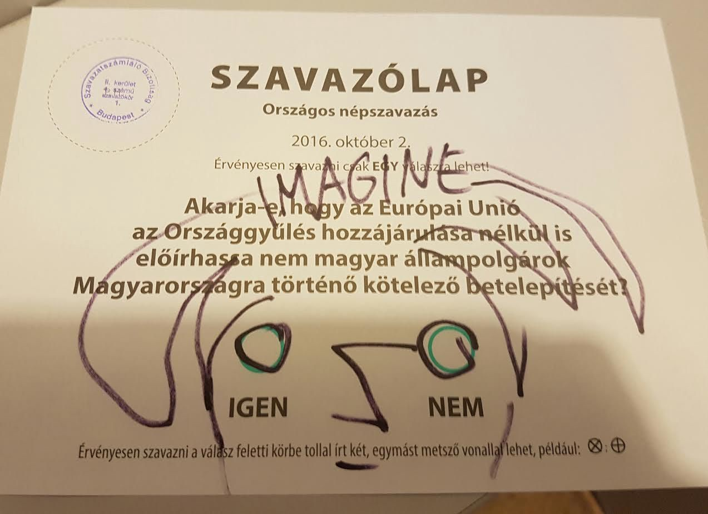
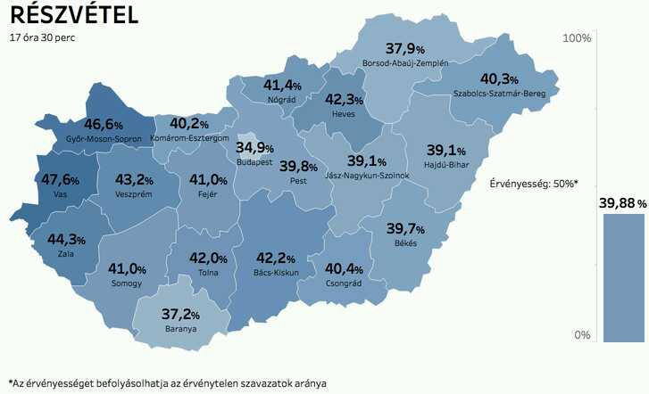
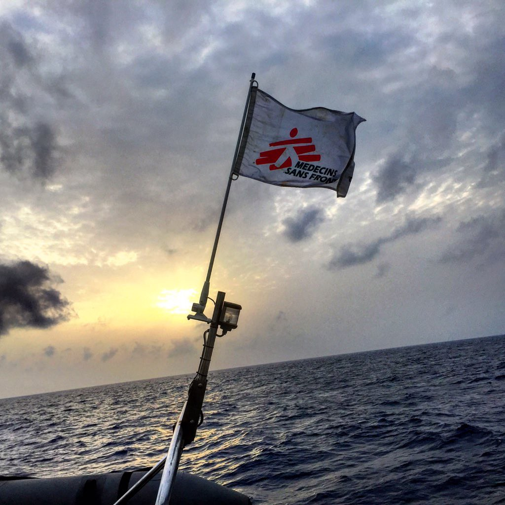
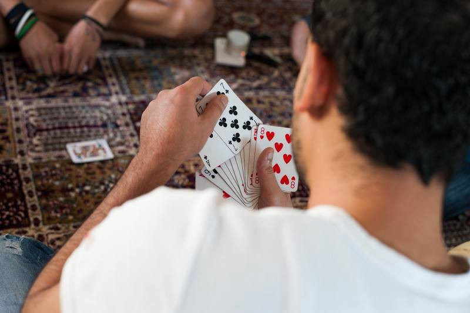
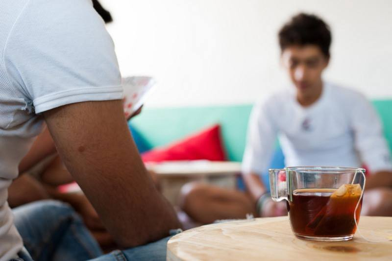
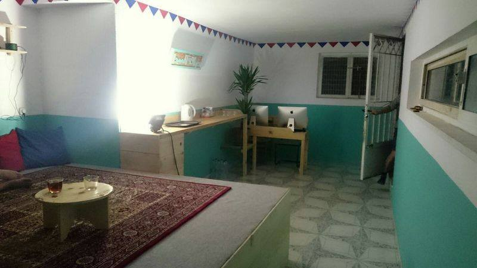
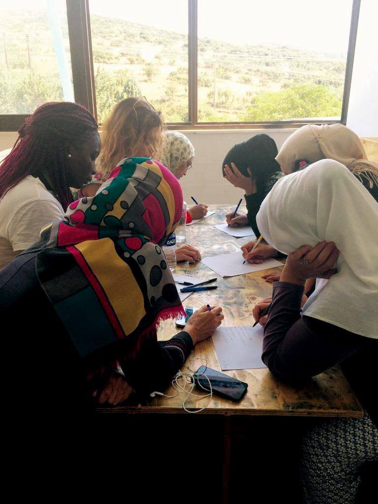
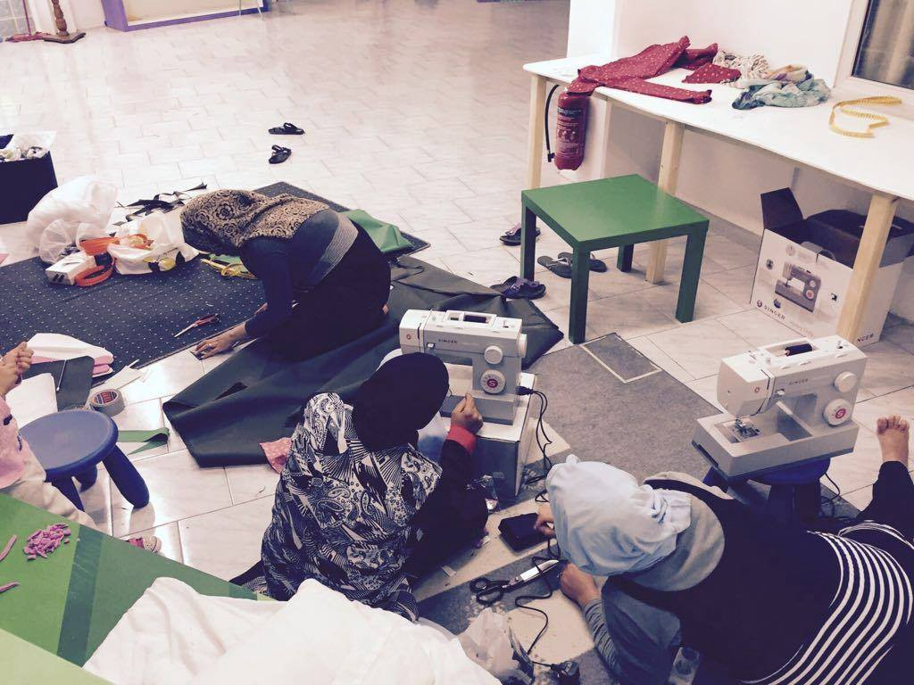
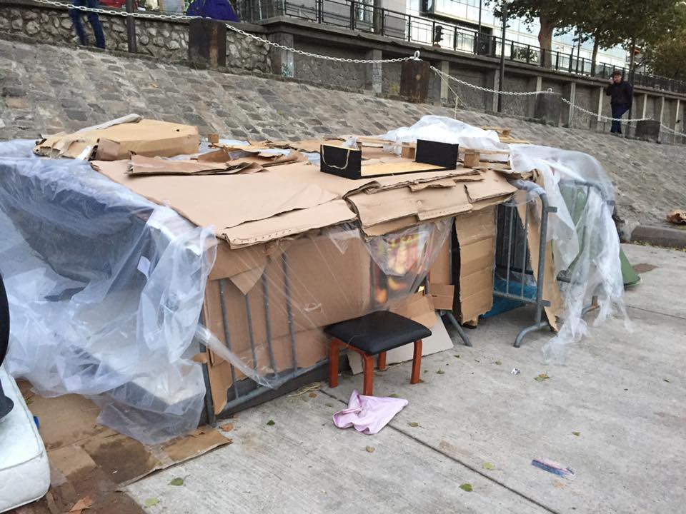
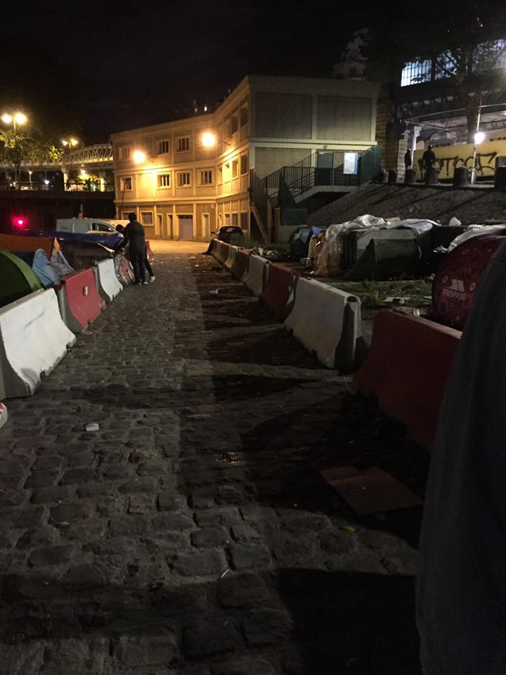

### AYS DAILY DIGEST 2/10: Humanity wins in Hungary

_People in Hungary said no to hate and xenophobia\. Orban promissed to resign if referendum fails\. We hope he is a man of word\. Almost 1000 people arrived to Greece during September\. Volunteers needed in Athens\. New rules for new commers in Como refugee center\. Help needed in France\._

Nationally, 6 percent of the ballots were spoiled\. Voters answered the satirical Two Tailed Dog Party campaign caling on voters to spoil their ballost\.
### Feature story
#### Hungarian referendum declared invalid

The national referendum on EU “migrant quotes” for Hungary is declared invalid, after turnout fell well below the minimum threshold of 50% plus 1, and despite strong hate campaign from the government and pro\-government media\. The referendum and the campaign will cost taxpayers €40,000,000\.

The morning before the referendum, [Hungarian leader Viktor Orban promised publicly that he will resign if not enough people turns out](http://ukropnews24.com/orban-said-he-will-resign-if-the-referendum-on-quotas-for-migrants-hungarians-will-vote-for/) , regardless the government having mounted the largest advertising campaign in Hungarian history\.

The referendum question was _“Are you are in favor of the EU being allowed to make the settlement of non\-Hungarians obligatory in Hungary even if the parliament does not agree?”_ Interestingly, turnout was highest in more affluent districts \(also within Budapest\) \.

Low turnout is also a victory for the opposition parties and human rights groups which called on Hungarians to boycott the referendum describing it as illegitimate\. _“The question is unconstitutional,”_ argued opposition leader Viktor Szigetvári, _“And it’s a sign of our illiberal democracy that such a formally illegal question can be put on the ballot paper\.”_ Rights campaigners described the pre\-referendum atmosphere as dark and scary\. _“The mood is quite reminiscent of the 1930s,”_ Márta Pardavi, co\-chair of the _Hungarian Helsinki Committee_ , told the media\.

Very few migrants now reach Hungary, after the country’s controversial new border fence blocked their path\. In August, Orban announced plans to build a second fence to prevent people from crossing the border\. It will stand next to its current 500km razor wire fence that runs alongside its border with Croatia and Serbia\. Orban also announced that 3000 “border hunters” will be hired to police its new border wall\. They will be equipped with trucks, night vision goggles, and sniffing dogs\.

Eastern European countries, including Hungary, Slovakia and Poland have vehemently opposed accepting migrants\. Hungary has not accepted even one of the 1,294 refugees allotted to it and is instead filing a legal case against the EU together with Slovakia\.
### NEWS
#### Mediterranean

MSF boat crew were busy last night and today saving over 200 people from the sea\. All the people are transferred to the safe places\. 40 percent of those rescued were unaccompanied kids\.

Photo by MSF Sea\.
### Greece
#### Numbers

According to the official numbers, 3 new persons are registered on Lesvos, 98 on Chios, and 19 at Megisti\. With the recent arrivals, the total number of arrivals since the Turkey deal hit 20\.000\. More than 14\.000 of them are still stuck on the islands\.

**Comparison 5/9–30/9**

Lesvos: From 5388 to 5942 \( \+554\)
Chios: From 3316 to 3678 \( \+362\)
Samos: From 1351 to 1582 \( \+231\)
Kos: From 1531 to 1863 \( \+332\)
Total: From 12\.515 to 14\.053 \( \+1538\)

Northern Greece:
Softex: From 1339 to 1574 \( \+235\)
KATSIKAS IOANNINA: From 790 to 683 \( \-107\)
Giannitsa: From 274 to 0
Alexandria: From 652 to 440 \( \-212\)
Total: 16774 to 16024 \( \-750\)

Central Greece:
Total: From 2406 to 2296 \( \-110\)

Attiki:
Schisto: From 1100 to 760 \( \-340\)
ELEFSINA: From 350 to 230 \( \-120\)
Total: From 9097 to 8529 \( \-568\)

UNHCR Accomodation Places:
Appartements: From 4467 to 4783 \( \+316\)
Hotels: From 2183 to 2343 \( \+160\)
Total: From 8207 to 8655 \( \+448\) \+2056 capacity change overall

Self\-Settled: From 7800 to 8300 \( \+500\)

Total throughout Greece: From 59569 to 60475 \( \+906\)
#### Legal info sessions in Thessaloniki

New announcement from [the Mobile Info Team](https://www.facebook.com/mobileinfoteam /react-text) \. Legal info sessions will be held in Micropolis Social Centre, Thessaloniki\. If you know anyone who has questions concerning their asylum application and lives in the city \(especially people in flats and squats\), don’t hesitate to send them their way\. [They have Arabic and Farsi interpreters](https://www.facebook.com/mobileinfoteam/posts/1845688942326493) \.

**_Address: Micropolis Social Space library \(Vasileos Irakliou 20, 2nd floor, on the left\) \._**

People should remember to bring any documents relevant to their application\.

You can contact them anytime on their Facebook page\.
#### RefuComm communication and information for refugees

RELOCATION IMPORTANT CHANGES

**Greece, Italy** 
**_Main change:_** 
The countries that were eligible for relocation before this report were: Syria, Eritrea, Central African Republic, Seychelles, Dominica, Bahrain, Laos, and Saudi Arabia\. A _ccording to the latest quarterly report \(Quarter 2 2016\) published by Eurostat on 22 September, the nationalities eligible for relocation as from now are Syria, Eritrea, Burundi, Mozambique, Bahrain, Bhutan, Qatar, and Yemen_ \.

The nationalities, which met the 75% eligibility threshold according to the Eurostat data from quarter 1 of 2016, that do not meet this threshold anymore, are Central African Republic, Seychelles, Dominica, Laos and Saudi Arabia\.

Although Iraqis are no longer eligible for relocation, this does not affect those Iraqis already identified as persons in possible need for international protection \(thus, those preregistered can still be relocated\) \. This would also apply to applicants belonging to the other nationalities that are no longer eligible for relocation

#### Volunteering opportunities in Athens

As at 1 October
#### OFFICIAL CAMPS:

> Please note that independent volunteers are not allowed in any of the official camps\. Volunteers need to be registered with one of the NGOs/Groups mentioned below\. 

1\) **Ellinikon Camp II — the old Airport** — the [Danish Refugee Council](https://drc.dk/where-we-work/europe-and-caucasus/greece) are looking for: volunteer teachers, fluent in Farsi able to teach Greek or English and a volunteer football coach\. Minimum age: 20 years and minimum one\-month commitment\. Email at [volunteer@drc\-greece\.org](mailto:volunteer@drc-greece.org) to find out more\.

2\) **Ellinikon Camp III — Baseball** — English teachers needed\. Classes take place every day\. English teachers\. must be 18 years or older\. Preferably ESL teaching experience or related experience\. Ideally, 2\-week minimum commitment\. Volunteers will need to complete the one\-page Ministry of Interior’s volunteer approval form\. PM [Angela Schöpke](https://www.facebook.com/angela.schopke) \.

3\) [**Kids activities/ English learning for everyone OUTSIDE Ellinikon camp**](https://www.facebook.com/groups/1573328976308662/) \. In front of the old airport — entrance of arrivals\. please note these activities are not part of the main camp but set by independent volunteers outside of the main camp in a sheltered area\. We meet every day at 4pm for 2–3 hours\. Contact person is [Ellice Christopher](https://www.facebook.com/ellicechristopher) \.

4\) **Eleonas — volunteer via [Project Elea](https://www.facebook.com/projectelea.volunteers/)** — minimum 2 weeks and minimum age requirements \(18 years\) \.

5\) **Skaramangas with [Drop in the Ocean](http://drapenihavet.no/en/) \(** see below for more info\) \.

6\) **Skaramangas with Organisation [Earth](https://www.facebook.com/EarthRefugee)** \(see below for more info\) \.

7\) **Oinofyta** \(1 hr drive from Athens\) — [ArmandoAid](https://www.facebook.com/ArmandoAid/?fref=ts) who provides the schooling at this camp is looking for volunteers, volunteer teachers, a gardener to run workshops for children… and also has openings for remote roles\. Contact [Laying Siu Munro](https://www.facebook.com/LayhingSiu) \.

Do Your Part is also in need of general volunteers as well as someone with IT experience\. Contact [Lisa Campbelll](https://www.facebook.com/lisa.campbell.5099) \.

8\) **Agios Andreas** — register through [HSA](http://www.humanitarian-support-agency.org) via and follow the instructions\. More info under [volunteer@humanitarian\-support\-agency\.org](mailto:volunteer@humanitarian-support-agency.org)
#### OTHER LOCATIONS:

1\. [**Khora community Center**](https://www.facebook.com/KhoraAthens/?fref=ts) — Tsimiski 21, Athens — interested volunteers and community members can send an email to [Khora\.athens@gmail\.com](mailto:Khora.athens@gmail.com) \. Or show up at 9\.30am from Monday\-Saturday\.

2\) **Pamperaiki Warehouse at Ellinikon** — from 11–6pm Monday to Friday [Katerina Reunion](https://www.facebook.com/rouniouk) — continuous need for volunteers to help sort donations — you can turn up at the hours stated — you don’t need to book in advance\.

You can also volunteer at the warehouse with Organisation Earth \(see below for more info\) \. The warehouse is within the disused Ellinikon airport, at the back of the huge Basketball Stadium on the coastal road \(Posidonos\), across the tram/bus stop “Elliniko”\. Please report at the security check\-point — between the Olympic Airways terminal and the Stadium — and tell the guard you are a volunteer at the warehouse of “Pampiraiki”\. The warehouse is the big blue building \(pinpoint here [https://www\.google\.com/](https://www.google.com/) …/data=\!4m5\!3m4\!1s0x0:0x0\!8m2\!3d37\.8…

Spanish volunteers, you can join a Spanish Speakers volunteers WhatsApp chat, message Patricia Colón \+34 678318021

3\) [**Marhacar team**](http://marhacar.org/) is looking for volunteer drivers to help with distribution of Aid in and around Athens\.

4\) **Orange House** — we need volunteers preferably Farsi or Arabic speakers — contact [volunteer@zaatar\.org](mailto:volunteer@zaatar.org) or PM [Aida Khalil Trissell](https://www.facebook.com/aida.khalil1)

5\) Project leaders needed to help run projects with groups of refugees \(Rooftop gardening, Solar cooking, Woodworking, Civil engineering \(building maintenance and conservation\), Herbalism, IT and electronics \(e\-Learning and R&D\), General tinkering and DIY\. Contact [Harper Pollock](https://daedalus.libtech.website/ltg-athens/)
#### SQUATS:

_When working on the squats, please note that you need to be able to work within the informal structures that are set up at each squat\. The environment can be extremely unstructured and sometimes confusing for volunteers\._
1. [**Notara 26**](https://www.facebook.com/profile.php?id=100010239857028) — contact via FB\.
2\) [**Merlie Oktaviou 19**](https://www.facebook.com/5olikeio/) \(5th school squat \(5th Likio\) \) — contact via FB\. 
4\) [**Acharnon 78 and Katrivanou \(Hotel City Plaza\)**](https://www.facebook.com/sol2refugeesen/) — help with English classes \(long term\) and French and German contact [Emily Bowyer](https://www.facebook.com/emily.bowyer.3) and for kids activities contact via [FB](https://www.facebook.com/groups/868661516611629/) \. They require a minimum commitment of at least a full week\. 
5\) [**Sourmeli 1,3**](https://www.facebook.com/2ofiloxenioprosfigon/?fref=nf) **\(2o filoxenio prosfigon\)** — This is the 2nd school squat \(also known as the [Jasmine school](https://www.facebook.com/Jasmine-School-Athens-2298699407…/…) more recently\) — contact via FB\. 
6\) [**Spyrou Trikoupi 57 in Exarchia \(ex Hotel Oniro\)**]() **\.** In particular, this squat needs teachers or experienced volunteers to help set up English and German classes, contact [Mahmoud Rihawiy](https://www.facebook.com/mahmoud.rihawiy) if you can help with the classes\. This squat also needs volunteers who would like to help cook and do children’s activities, please contact [Mahmoud](https://www.facebook.com/mahmoud.rihawiy) for this also\.

#### ORGANISATIONS THAT TAKE VOLUNTEERS

[**No Border School**](https://www.facebook.com/noborderschool/) need volunteers for squats and other locations in Athens\. Minimum age 18 and the minimum commitment of two weeks is required\. They do not need to be teachers, just confident to deliver a lesson\! Interested volunteers can message through their FB page or PM [Laura Cesaro](https://www.facebook.com/laura.cesaro.12) \.

To volunteer with [Drop in the Ocean](http://drapenihavet.no/en/) , you have to register first\. Send an email to [volunteer@drapenihavet\.no](mailto:volunteer@drapenihavet.no) and ask for more information, or go to [web pag](http://drapenihavet.no/en/) e and submit the register form from there\. Their requirements are that volunteers should be minimum 25 years old, can commit for at least 10 days, and can communicate in English\. It’s not necessary to have any particular competence, but pre\-school personnel/teachers, medic/health care, people with relevant language skills, and long\-term are highly valued\.

To volunteer with [**Organization Earth**](https://www.facebook.com/EarthRefugee) at Ellinikon Warehouse, Skaramangas, and Lavrio \(Sounio — accommodation provided at Lavrio only\) \), please fill out the form [on the attached link](https://docs.google.com/…/1FAIpQLSdOuLqvHoDR9aQKQ…/viewform…) \. Minimum age limit is 18\.

For wider opportunities in Greece, please [check here](http://WWW.GREECEVOL.INFO) \.

[Please read google doc for more info](https://www.google.com/maps/d/viewer?shorturl=1&mid=19aM_viPIZgRWZ736GBRKxvxQ20U) \. It is essential that new volunteers read the Guidance on Volunteering in Athens to familiarize themselves about Athens before starting their volunteering\.
Please contact the project/team leaders directly to sort out your volunteering arrangements\.
When you are offering your help and agreeing to a date and time, please do honor that commitment\. Team leaders and project managers rely on you and sometimes turn other people away if they think they have enough volunteers\. Therefore please only commit to helping if you are definitely committed to helping\.
#### Time for something different in Elpida

Men’s space in [**Elpida**](https://www.facebook.com/elpidafactory/) is complete and today they celebrated the opening with lots of tea and delicious chocolate cake\.

Photo by Together for Better Days\.

Also, a group of women in Elpida joined a sewing group\. They are making school bags for the children, pajamas, dresses and mending and altering the clothes they already have\.

Photo by Together for Better Days\.
#### People at Samos needs your help

During September, over 400 new arrivals were registered in Samos\. Volunteers are expecting that the number could increase during October\. Among new arrivals, are many children, as well as disabled people\. If you can help, please consider donating to [**Samos Volunteers Gofundme**](https://www.gofundme.com/samos4refugees) \.

[**No Border Kitchen Lesvos**](https://noborderkitchenlesvos.noblogs.org/call-out/) is back, up and running again\. After being evicted from Tsamakia Beach it took some time to reorganize but now they have a new place\. Unfortunately, due to the eviction volunteers and equipment have been lost\. Therefore No Borders Kitchen Lesvos urgently needs new volunteers and also financial support\.

A full dental team from [**Health\-Point Foundation**](https://www.facebook.com/healthpointfoundation/) has arrived at Alexandreia camp\. The dental needs in the camp are huge so they will be treating at least 25 of the more urgent cases on the first day\.
### Italy
#### Rules for refugees in Como center changed

The rules for the access to Como refugees centre have changed and from today, it is not allowed for people who are in transit to show up spontaneously at the centre, but only after an interview at the police headquarters to verify the person’s law status \(meaning if this person has a residence permit or an expulsion measure pending\) \. The decision has been taken from the prefecture, in order to allocate the free placements to unaccompanied minors received in Italy\.

At the moment, the center is hosting 240 migrants, meaning around 60 places are still free\. The center will become a “hub” co\-directed by the police, which will send there the children received at the border while waiting to be allocated in other parts of the territory \(like Institute Guanella and Rebbio parish\) or out of the province\. However, in most cases, unaccompanied children leave without the trace in few days\. Free access will still be guaranteed to families and vulnerable subjects\.

For more info about situation in Como area, follow FB page by [**WelCome Osservatorio Migranti Como**](https://www.facebook.com/osservatoriomigranticomo/photos/a.744394972361875.1073741828.730614903739882/836729349795103/?type=3) **\.**
### France

It became cold all over Europe\. In Paris, people live on the streets\. Many don’t have tents, a coat or a jumper\. They have built shelters from whatever they can find\. Is this Europe?

[![[Shortcut] Manif interdite à Calais : affrontements avec la police - 1er octobre 2016](assets/26455e44497f/8ab1_hqdefault.jpg "[Shortcut] Manif interdite à Calais : affrontements avec la police - 1er octobre 2016")](http://www.youtube.com/watch?v=iequ5u9Outc)

#### LIFE\-SAVING PHONE CREDIT NEEDED

People who are leaving the camp need your help\. Phone credit can save their lives\! 
Please text CALA85 with the amount you want to donate to 70070 and support [campaign to fund phone credit for refugees](https://www.facebook.com/calaisaction/photos/a.1018687118183793.1073741828.1018579608194544/1287558761296626/?type=3&theater&notif_t=notify_me_page&notif_id=1475238170599978) \.
### General
#### Scholarship for Syrians

The Institute of International Education \(IIE\) announced [t **he Scholarship Program for Syrian Students in the United States**](http://www.iie.org/Programs/Syria-Scholarships/Opportunities%20for%20Students/IIE-Scholarship-For-Syrian-Students#.V-9Fh_krKM-هب) \. The IIE scholarship will provide up to $50,000 to cover students’ living expenses\.

_Eligibility Criteria_ 
_• Applicants must be Syrian citizens or Palestinians with a Syrian Travel Document;_ 
_• Applicants must have proficiency in written and spoken English to carry out their proposed studies\. Applicants will be required to take the TOEFL or IELTS exam prior to the start of their studies;_ 
_• The scholarship is open to undergraduate students “Bachelor” and graduate students “Master”\. Students seeking a Doctoral degree are NOT eligible for this scholarship;_ 
_• The scholarship is open to all academic fields with the exception of medicine, pharmacy, and dentistry\. The law is only available on the graduate level\._ 
_• Preference will be given to applicants who have clear academic, professional, and personal goals\. Applicants should demonstrate civic engagement and the desire to help rebuild their home country\._

You can learn how to apply on IIE page\.

The deadline to submit the pre\-application is November 1, 2016\.
#### The new w2eu\.info Balkan Route Info site is online\!

[This new page](https://www.facebook.com/l.php..) provides important information for people on the move about their legal situation and state practices in the different countries of the so\-called Balkan route\.

_Converted [Medium Post](https://areyousyrious.medium.com/ays-daily-digest-2-10-humanity-wins-in-hungary-26455e44497f) by [ZMediumToMarkdown](https://github.com/ZhgChgLi/ZMediumToMarkdown)._
