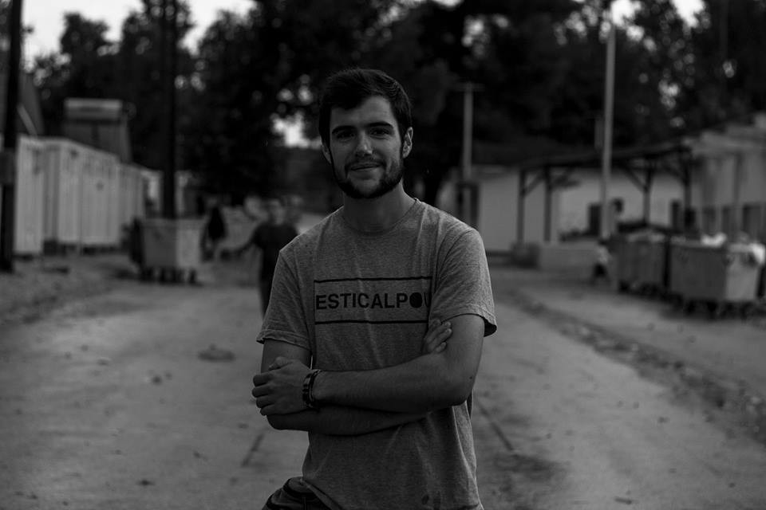

### AYS 03/10: EU\-Afghan deal: Death awaits in this ‘safe country’

> EU\-Afghan deal: Returning people to a war\-torn state\. 600 children have died in the Mediterranean this year\. Over 6,000 refugees saved from the sea in a single day\. 

](assets/571bc4143e8/0*ZROylufJ3jwM60tv.)

Credits: [**Through refugee eyes**](https://www.facebook.com/throughrefugeeeyes/)
### What Afghan children are running away from?

Security in Afghanistan is worse than ever\. According to the United Nations Assistance Mission in Afghanistan, civilian casualties in the country hit a record\-high 11,000 in 2015\. More than 3,500 civilians died, including an unprecedented number of children — one in four casualties over the past year was a child\.

Amidst such violence and death, the EU has somehow come to a decision that Afghanistan is a safe country to which asylum seekers will be returned\. As European governments and international decision\-makers gather for the Brussels Conference on Afghanistan on October 5th, we wish to make a special news report on Afghan refugees and answer why they are really here\.

Afghans make up the second largest group of migrants arriving in Europe, with [196,170 applying for asylum](https://www.easo.europa.eu/sites/default/files/public/EN_%20Annual%20Report%202015_1.pdf) last year\.

> “15 years after the US\-led invasion of Afghanistan, the conflict is worsening, the number of people displaced is increasing, and funding for humanitarian assistance is drying up,” says Dan Tyler, Regional Protection and Advocacy Advisor at NRC\. 

Despite this reality, the European Union is in denial about the causes and effects of displacement in Afghanistan\. The newly signed EU\-Afghanistan deal will oblige Afghanistan to accept 80,000 deportations of its citizens, in exchange for weak aid\. More specifically, according to the terms of the deal, Afghanistan commits to readmit its citizens who are deemed not permitted to stay in Europe, and supply travel documents for migrants without papers within a month\. In turn, the EU is expected to pledge 1 billion euros a year to Afghanistan through 2020\.

The pressure placed on Afghanistan is part of a broader EU strategy of making aid to poor countries conditional on them accepting deported migrants\. The best known example is the [€6 billion deal offered to Turkey](https://www.theguardian.com/world/2016/mar/18/eu-deal-turkey-migrants-refugees-q-and-a) in exchange for taking back asylum seekers and improving border controls\. Other targeted countries include Niger, Ethiopia, Nigeria, Lebanon and Libya\. The EU has also considered similar deals with Eritrea and Sudan, the governments of which are accused of war crimes and crimes against humanity\.

> “This is putting unreasonable pressure on the Afghan government, which is not able to respond to such numbers,” said [Timor Sharan](https://www.crisisgroup.org/who-we-are/people/timor-sharan) , senior analyst for the International Crisis Group in Afghanistan\. 

What is more, the EU is sending people back to danger and destitution in Afghanistan\. In exchange for money, the EU is returning people to unsafe places that have been intentionally, and unfoundedly, baptised as ‘safe’\.

Perhaps the clearest example of the moral bankruptcy of this policy is around Afghan refugee children\. In 2015 more than 90,000 unaccompanied children reached Europe\. Over half of them were from Afghanistan, mainly boys\. Afghans constitute the world’s largest refugee population\. In spite of these stark numbers, very few people seem to ask the question so many Afghan children undertake the treacherous, often traumatising, 5,000 km journey to reach Europe\.

Here we would like to shed a light on what it’s like for a child to grow up in Afghanistan, to help our readers understand what these children are running away from\.

Violence against children is widespread in Afghanistan\. Earlier this year, Save the Children conducted a household survey among 1,000 Afghan citizens\. More than half of the respondents were below the age of 15\. 91% of the children reported experiencing some level of violence, mainly kicking, beating with objects, choking or burning\. Nearly 40% saw a household member being killed in the last year\. One in three have been exposed to gun fire, bombing or fights\. About one in five children reported being subject to rape and the most egregious forms of violence\.

Violence en route to Europe is not any less significant\. The journey to Europe is often traumatising\. [In Norway](http://resourcecentre.savethechildren.se/library/hear-it-children-move-and-arriving-norway) , Save the Children interviewed 78 children coming from Syria and Afghanistan\. Children suffered from hunger and thirst along the route, and they were lonely and scared\. Some were shot at, received death threats, almost drowned or were nearly killed\. They mentioned police brutality and violence at the borders\.

Politicians claim that Afghans coming to Europe are job\-seekers looking for a better life\. The reality is much more complex\. Afghanistan is still one of the poorest and most dangerous countries in the world\. As long as Afghanistan lacks the systems in place to guarantee protection, people should not be sent back there\. The EU’s obligation to protect and promote human rights does not stop at its borders\.
#### Mediterranean
### Over 6,000 migrants plucked from sea in a single day, nine dead

About 6,055 migrants were rescued on Monday as they tried to reach Europe on about 40 boats\. This was one of the largest tallies for a single day since the current migration crisis erupted, Italy’s coast guard said\.

The rescues came on the third anniversary of a migrant ship fire and sinking near the island of Lampedusa which left 366 people dead and alerted the world to the unfolding drama in the Mediterranean\.

**](assets/571bc4143e8/0*ABsFReH0RyY3fhjY.)

**Credits: [Anima](https://www.facebook.com/anima.hrt.hr/)**
### 600 children have died in the Mediterranean this year

The toll, from a new analysis of data by Save the Children, means that two children a day on average have died or disappeared between January 1 and September 26\.
### Message from refugees to volunteers: “Thank you\!”

> For 7 months, we have been stuck in Greece\. As much as the situation is difficult, we were able to find awesome volunteers around us, who are trying to make this life easier for us\. They didn’t accept the situation, just as we didn’t accept it; they couldn’t handle to stay at home and watch refugees through TV, they decided to do something, they came from different counties to help us\. 

> Here you can find small number of photographs of volunteers I met, such a nice people always with their smile\! 

> Today, through our voice, we want to say to volunteers thank you so much and we really appreciate what you did and what you are still doing\.
 

> So much love to each one of you\.
 

> We don’t care about government if the people are amazing like you\! 
 

> With you \. \. we can continue our way and fight for humanity\. 

 \. Credits: [**Through refugee eyes**](https://www.facebook.com/throughrefugeeeyes/)](assets/571bc4143e8/0*8fvfFZSG1X4fLSa_.)

[Laila Baum](https://www.facebook.com/laila.baum.5) \. Credits: [**Through refugee eyes**](https://www.facebook.com/throughrefugeeeyes/)

 and [Josh Mojica](https://www.facebook.com/josh.mojica.1) \. Credits: [**Through refugee eyes**](https://www.facebook.com/throughrefugeeeyes/)](assets/571bc4143e8/1*6rJ-fuaqx9TJVtiCchluOQ.jpeg)

[Chandra Marthaler](https://www.facebook.com/chandra.marthaler) and [Josh Mojica](https://www.facebook.com/josh.mojica.1) \. Credits: [**Through refugee eyes**](https://www.facebook.com/throughrefugeeeyes/)

 \. Credits: [**Through refugee eyes**](https://www.facebook.com/throughrefugeeeyes/)](assets/571bc4143e8/0*AITLedrNZv5ReJqq.)

[Alec Terrana](https://www.facebook.com/alecterrana) \. Credits: [**Through refugee eyes**](https://www.facebook.com/throughrefugeeeyes/)

 \. Credits: [**Through refugee eyes**](https://www.facebook.com/throughrefugeeeyes/)](assets/571bc4143e8/0*NmIoqjAsI01yz9Q8.)

[Fab Bra](https://www.facebook.com/profile.php?id=100009438927228) \. Credits: [**Through refugee eyes**](https://www.facebook.com/throughrefugeeeyes/)

 [Camilla Patricia Hoeeg](https://www.facebook.com/CamillaPatricia) \. Credits: [**Through refugee eyes**](https://www.facebook.com/throughrefugeeeyes/)](assets/571bc4143e8/1*SLrdFvt9JKOVZ2iT4VPV_A.jpeg)

[Dési Ré and](https://www.facebook.com/desiree.jaksch) [Camilla Patricia Hoeeg](https://www.facebook.com/CamillaPatricia) \. Credits: [**Through refugee eyes**](https://www.facebook.com/throughrefugeeeyes/)

 and [Maria Airam](https://www.facebook.com/maria.airam.16503) \. Credits: [**Through refugee eyes**](https://www.facebook.com/throughrefugeeeyes/)](assets/571bc4143e8/1*ZVbnMDca36pSWkpYNSvLFw.jpeg)

[Edgard Vega](https://www.facebook.com/edgard.vega.5) and [Maria Airam](https://www.facebook.com/maria.airam.16503) \. Credits: [**Through refugee eyes**](https://www.facebook.com/throughrefugeeeyes/)

 and [Katrin Schiesser](https://www.facebook.com/katrin.schiesser.7) \. Credits: [**Through refugee eyes**](https://www.facebook.com/throughrefugeeeyes/)](assets/571bc4143e8/1*pmpWbofg8E0OE4W1WWAWaA.jpeg)

[Bernat Conill Hernandez](https://www.facebook.com/bernat.conillhernandez) and [Katrin Schiesser](https://www.facebook.com/katrin.schiesser.7) \. Credits: [**Through refugee eyes**](https://www.facebook.com/throughrefugeeeyes/)

 and [Jasmin Mer](https://www.facebook.com/jasmin.m.merkel) \. Credits: [**Through refugee eyes**](https://www.facebook.com/throughrefugeeeyes/)](assets/571bc4143e8/1*f40MblXZT35Qlyd_Yp6_yA.jpeg)

[Fay Sidiroglou](https://www.facebook.com/fay.sidiroglou) and [Jasmin Mer](https://www.facebook.com/jasmin.m.merkel) \. Credits: [**Through refugee eyes**](https://www.facebook.com/throughrefugeeeyes/)

 \. Credits: [**Through refugee eyes**](https://www.facebook.com/throughrefugeeeyes/)](assets/571bc4143e8/0*bMHsXYiwP9NXKzqM.)

[Sarah Misteriosa](https://www.facebook.com/sarah.misteriosa) \. Credits: [**Through refugee eyes**](https://www.facebook.com/throughrefugeeeyes/)

 \. Credits: [**Through refugee eyes**](https://www.facebook.com/throughrefugeeeyes/)](assets/571bc4143e8/0*5g2qhiDKUmCQF2se.)

[Achilles M\. Peklaris](https://www.facebook.com/achillespek) \. Credits: [**Through refugee eyes**](https://www.facebook.com/throughrefugeeeyes/)

Now, dear volunteers and colleagues, I hope this post gives you motivation to continue with this great work, as it did for me\. :\)
#### Greece
### Refugee flows in Greece, October 03, 2016

New arrivals: 71

Lesvos 17

Samos 25

Chios 29
#### Serbian\-Hungarian border
### Vigilantes continue to patrol the border and harm refugees

](assets/571bc4143e8/0*ByPm-C-j3Dnrtwae.)

Credits: [**MigSzol Csoport**](https://www.facebook.com/migszolcsoport/)

](assets/571bc4143e8/0*8wxqrI65ucLizQUn.)

Credits: [**MigSzol Csoport**](https://www.facebook.com/migszolcsoport/)
#### Serbia
### Serbian president warns the EU, announces possible border closure

Serbian president Tomislav Nikolic announced today that Serbia will close its borders if EU countries continue to reject the refugees\. “We need to close the border to migrants, because they didn’t want to stay here in the first place\. Europe needs to solve this problem\. If other countries close their borders, we need to do the same in order to avoid having so many people stranded in our country\. Since the EU is not angered by Hungarian actions, I’m sure they will have no problem with Serbia in case of the border closure”, he told journalists\. He added that he does not understand how Serbia is the first country along the Balkan Route to register refugees, as if “they fell from the sky\.”

According to him, Serbia cannot take more than 5,000 to 6,000 refugees, and that the government is currently in negotiations with Brussels to resolve the matter\.
### Refugee situation in Serbia: Tents and people are crowded, but services offered by the authorities are scarce

On the border between Serbia and Hungary, the situation is dire\. Thousands of people, crammed into makeshift camps, are waiting to cross the border into the EU\.

Since April 2016, the number of migrants transiting in Serbia has grown [from 1,600 to nearly 5,000](http://data.unhcr.org/mediterranean/country.php?id=502) — a steadily growing population that tests the country’s reception capability and poses serious questions in view of the impending winter\.
#### France
### Help Calais refugees in the face of new 40\-per\-day police deportation quota

Help Calais refugees as they deal with yet another demolition\. Again, Especially the many unaccompanied children living in Calais are especially vulnerable\. Here is a call for help by [The Help4Refugee Children Team](http://us11.campaign-archive1.com/?u=9e3007a2cf41874015d1965b4&id=020a92f93b&utm_content=bufferd208e&utm_medium=social&utm_source=twitter.com&utm_campaign=buffer) :

> In light of the Calais demolitions we are doing an emergency appeal to help the unaccompanied minors currently living in Calais\. Currently there is nothing officially in place for them to support them during and after the destruction of the camp\. During the last demolitions, more than 300 children went missing and many remain unaccounted to date\. We know that this will also be equally or more catastrophic as the demolitions threaten to dismantle the Jungle completely, leaving no place for them go\. 

> **We need to equip them with waterproof shoes, jackets and trousers, tents, sleeping bags, blankets and backpacks with a change of clothes and basic provisions and a phone if possible so that they can keep in touch with authorised volunteers who will to continue to support them after the demolitions\.** 

> We ask you to pledge as much as you can, please\. This is the most critical appeal we have ever done, by donating you are providing direct help to these children who are alone in Europe after travelling a gruesome journey\. Please help us by donating any of the items mentioned above or donating directly to us\. 

#### Switzerland
### Switzerland opens doors to refugees from Greece

**For the first time, Syrian asylum seekers from Greece are to be admitted to Switzerland under the European Union Relocation Programme\.** The 30 Syrians are mainly people affected by the long\-running conflict in their homeland, the Swiss news agency [SDA](http://www.blick.ch/news/schweiz/fluechtlinge-schweiz-nimmt-syrische-asylsuchende-aus-griechenland-auf-id5557703.html) reported\.

_Converted [Medium Post](https://areyousyrious.medium.com/ays-03-10-eu-afghan-deal-death-awaits-in-the-safe-country-571bc4143e8) by [ZMediumToMarkdown](https://github.com/ZhgChgLi/ZMediumToMarkdown)._
