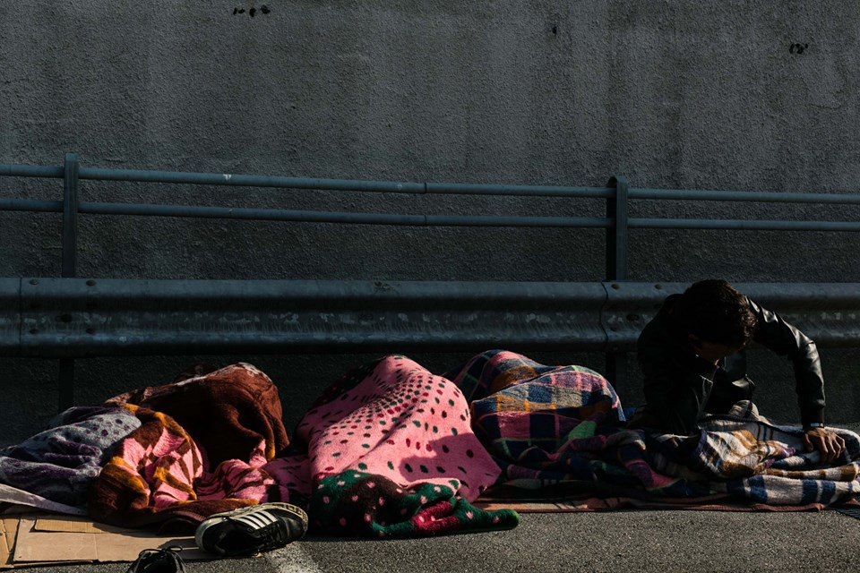
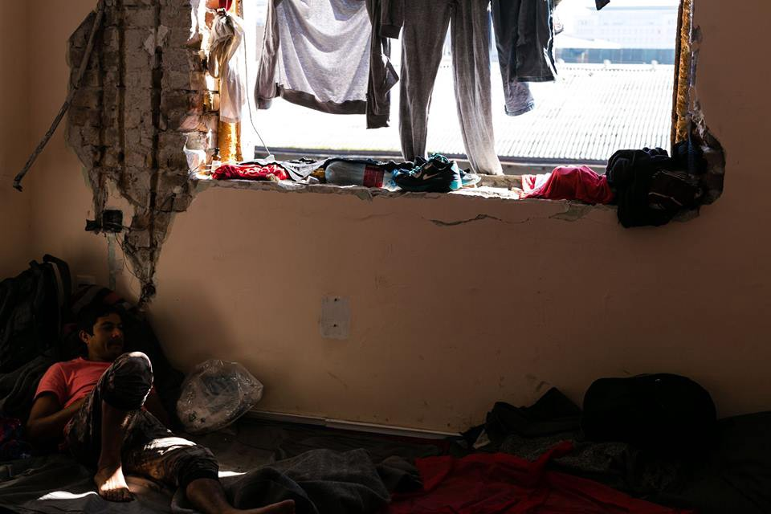
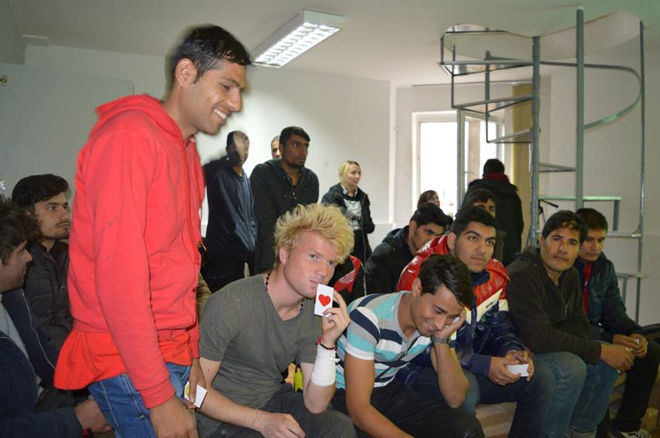
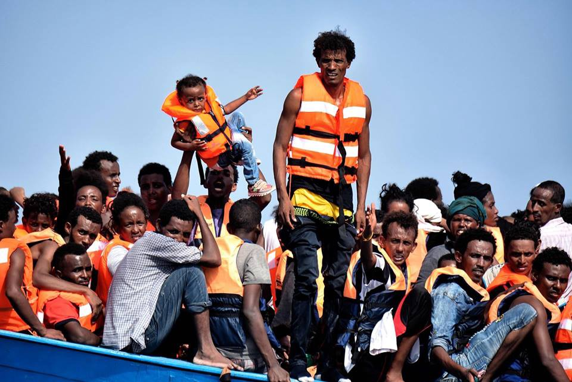
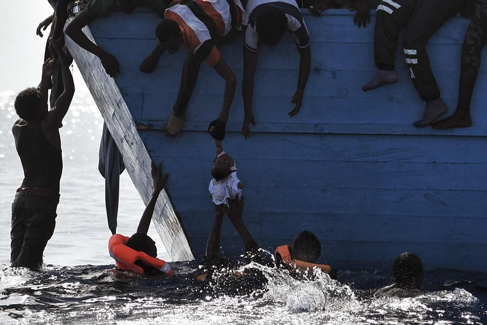
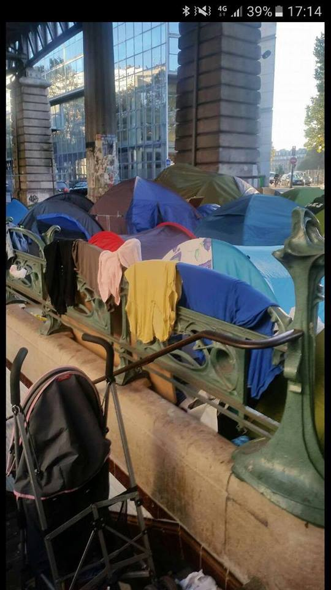
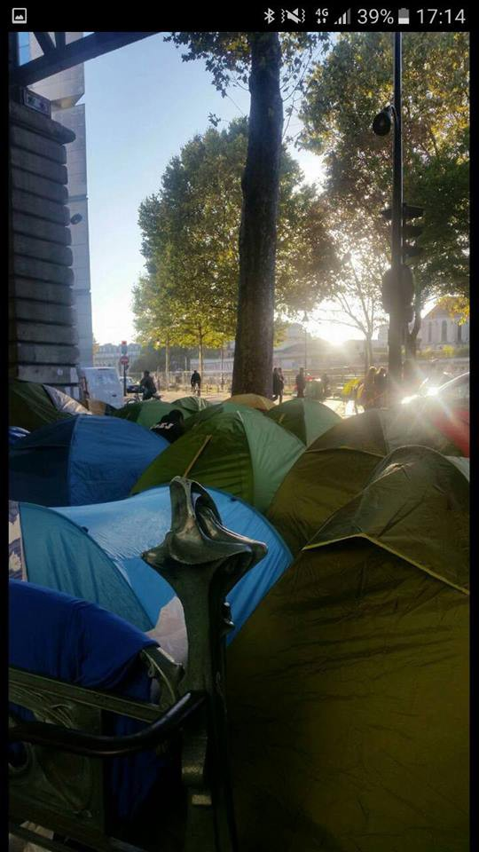
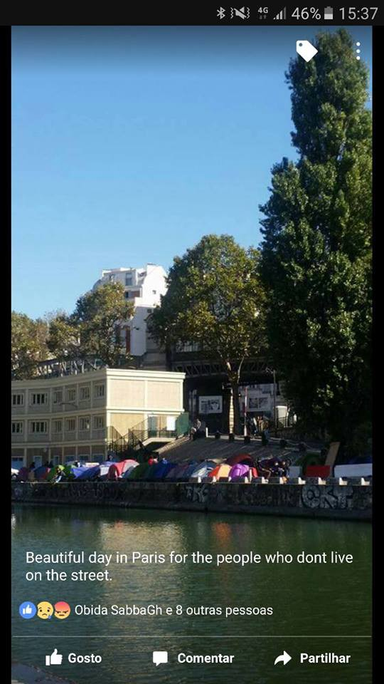

### **AYS digest 05/10: Unrest in Belgrade in the aftermath of yesterday’s march towards the border**

_Unrest in the parks, media frenzy and organizations trying to decipher what really happened yesterday/ Two international activists arrested and released in relation to the protest / Dangerous precedent unfolding as the first man is to be deported to Turkey under the EU — Turkey deal / 11,000 rescues in Mediterranean in just three days / Calais needs help and hope / Streets of Paris full of refugees sleeping rough /_

Sleeping rough in Belgrade\. Photo Mette Flansome

As people have returned to Belgrade following the yesterday’s exhausting march towards border, organizations and activists from Belgrade are trying to decipher what has actually happened yesterday\.

Many are casting blame on to those who led the protest, while others are warning that the blame is not to be assigned solely to the leaders of the unrest, but that we should re\-examine the bigger picture\. No border Serbia states that media and some other organizations have accused them of leading the protest\. They are stating that it wasn’t them who led it, but regardless, we should consider how the horrible conditions people are forced to live in are those that lead them to dangerous paths and perhaps justified unrest\.

Belgrade\. Photo Mette Flansome

On the other hand, Info Park warns that this situation has made things worse and that in a country where propaganda against refugees has been on the rise, the boat should not be rocked further\. This morning there were fights between those that returned and those who did not want to march\. It seems that refugees, as well as volunteers and activists, are in danger given the increase in violence in the Belgrade parks, following tensions that arose from yesterday’s failed attempt to reach the border\. They understand this attempt as something that just harms the refugees and pushes them into an even more dangerous position\.

Two international activists who participated in the march were detained by the police and were released in the evening\.

Without aiming to be judge and jury in this case, we understand that yesterday did not bring any good to any of those involved, but we would like to post a video made by Info Park that, when seen from the outside, perhaps shines a light on how dire the situation is in Belgrade\. Things are undoubtedly even worse where cameras did not go\. This video can perhaps state what people were hoping to escape\.

This video was posted today with this message from Info Park: “By now you have probably read everything about the sad events in the Belgrade park yesterday\. No need to comment on something that harmed the migrants and refugees themselves the most\. After the morning riot which targeted people who did not deserve it, Info Park decided to resume food distribution as soon as possible and keep supporting every person who needs help\.”

Also, Refugee foundation Serbia is warning that the weather is cold and getting colder and that their Day center is overcrowded with people seeking warmth\. They are asking for volunteer help, as well as for donations of winter clothes and shoes\. If you are able to help you can contact them on their FB page or go to their Day center\.

Refugee foundation Serbia Day center

As the next days are going to be difficult, organizations on the ground are working tirelessly trying to get things back to normal\. Refugee aid Serbia distributed 600 warm meals and need help to continue\. If you want to support, please follow the [link](https://www.gofundme.com/supportras) \.

Also, in more news of life returning to “normal”, the Psychological Innovation Network \(PIN\) held an English cafe workshop in Refugee foundation Serbia\. The workshop was full and seemed to be fun based on these photos\.

English cafe workshop\. Refugee foundation Serbia
#### Greece
### **90 new arrivals**

There have been 90 new arrivals to Greek islands in the last 24 hours\. The total numbers are pretty much the same, with some deviations\. There are 102 fewer people in Skaramagas camp, with 3,398 people left\. The number of “self settled” people dropped from 8,300 to 7,500\. The government points to the increase in voluntary returns to explain the drop\. Yearly voluntary returns are now at 4,712\.
### **The migration “problem” is too big for Greece**

As situation in Greece becomes more and more absurd with the EU packing people inside this country, Deputy Defense Minister Dimitris Vitsas, who heads a task force on migrants, urged the EU and the United Nations to help his country accommodate refugees coming from the Middle East in an interview with AP: “The migration problem… is too big, it’s not only in Syria, it’s in Africa, it’s in Asia\. It’s a problem that the United Nations must consider,” Vitsas said\. “We need to move from words to actions\.” Vitsas urged Eastern European countries, such as Hungary, the Czech Republic and Poland, which have been reluctant to accept refugees, not to shut their doors on migrants, Khathimerini news reports\.
### **Greece may be obliged to return money to Brussels, not receive it**

Turning an absurd situation into something more tragic, European officials have indicated that Greece may be obliged to return more than 500 million euros in funding disbursed by the European Union to help authorities tackle the refugee crisis due to the slow pace at which those funds are being absorbed, Kathimerini reports\.
### **First man to be deported by EU — Turkey deal**

To add insult to injury, Amnesty international published the story of Noori\. Noori is a young man from Syria who is to become the first one to be deported by the EU to Turkey under EU — Turkey deal\. Amnesty international warns that this is a dangerous historic precedent\. By deporting Noori to Turkey, Greece \(on behalf of the EU\) would be taking an ominous step in history\. They would deliberately turn away a refugee without first examining the substance of his asylum claim under this cruel and dodgy deal with Turkey\. To European leaders, Noori says that he — and other refugees — simply want to be somewhere safe: _“You are safe, please open your eyes and see why we came here\.”_ Read [Noori’s story](https://www.amnesty.org/en/latest/campaigns/2016/10/deportation-a-dangerous-precedent/) and do not forget this moment when a 21 year old young man’s destiny became a historical turning point\.
#### Mediterranean

Mediterranean yesterday\. Photo: Art against
### **11,000 people rescued in the Mediterranean in just three days**

As we’ve been reporting since Monday, staggering numbers of people have arrived, amounting to 11,000 people who were rescued from the Mediterranean sea in just three days\. The total death toll for Monday and Tuesday is up to 50\. Wednesday saw a sharp decline in rescues with only 368\. The latest surge in new arrivals means at least 142,000 migrants have reached Italy since the start of the year and around 3,100 have died making the perilous trip\.

Mediterranean yesterday\. Photo: Art against
#### France
### **Jungle has grown before even though it was set for demolition — a letter by Calais4calais founder**

As the announced eviction and demolition of the Jungle is approaching, we bring you a letter from Clare Moseley, founder of Calais4Calais in which she asks not just for help, but for everybody to understand that the Jungle has never been fully destroyed after many government attempts\. We bring you her letter in full:

“The Calais refugee camp is under imminent threat of demolition, meaning thousands of refugees will lose their makeshift homes\. With winter around the corner we need your support to stop this before it is too late\.

French President François Hollande has said he will completely dismantle the camp by the end of the year, and recent reports have suggested as soon as mid October\.

However, in February over half of the camp was demolished and yet six months later the camp is bigger than it has ever been before\. This clearly shows that demolitions do not act as a deterrent and that refugees will not stop coming to Calais\. Destroying their homes will do nothing more than make living conditions so much more inhumane\.

The alternative provisions offered by the French Government do not address the key reasons refugees are settling in Calais and therefore cannot provide a long\-term solution to the crisis\.

The escalation of problems in Calais, and the fact that we know that more, not fewer, refugees are on their way, means that a longer term solution than demolitions is required\. We need a sustainable solution that will help the refugees, the hauliers and the Calais townspeople\.

Demolitions are not the answer until a longer term solution is in place\. Please join us by signing the petition to MP Amber Rudd and demand that action is taken to prevent these innocent people from going through even more suffering\. They have already lost their homes; family and friends don’t let them lose the only thing they have left\.”

Clare Moseley

Founder, Care4Calais
### **City of love, but not for everybody — many sleeping rough on the streets of Paris**

Even though the Jungle situation is uncertain, many are opting for moving to Paris which is by now filled with those that are forced to sleep on its streets\. We bring you a couple of photographs from those very streets\.

Streets of Paris\. Photo: Heather Young

Streets of Paris\. Photo: Heather Young

Streets of Paris\. Photo: Heather Young
### **Help needed in Calais**

Calais4Calais is asking for help in donations, mainly shoes — if you can help follow the [link](https://m.facebook.com/story.php?story_fbid=678553535632452&id=518273324993808&hc_location=ufi) \.

Also, there is a need for translators, and if you happen to be one and can go to Calais, please follow this [link](https://m.facebook.com/story.php?story_fbid=1301329639899990&substory_index=0&id=1046117708754519&hc_location=ufi) \.

_Converted [Medium Post](https://areyousyrious.medium.com/unrest-in-belgrade-in-the-aftermath-of-yesterdays-march-towards-the-border-c0b87b7f57b7) by [ZMediumToMarkdown](https://github.com/ZhgChgLi/ZMediumToMarkdown)._
