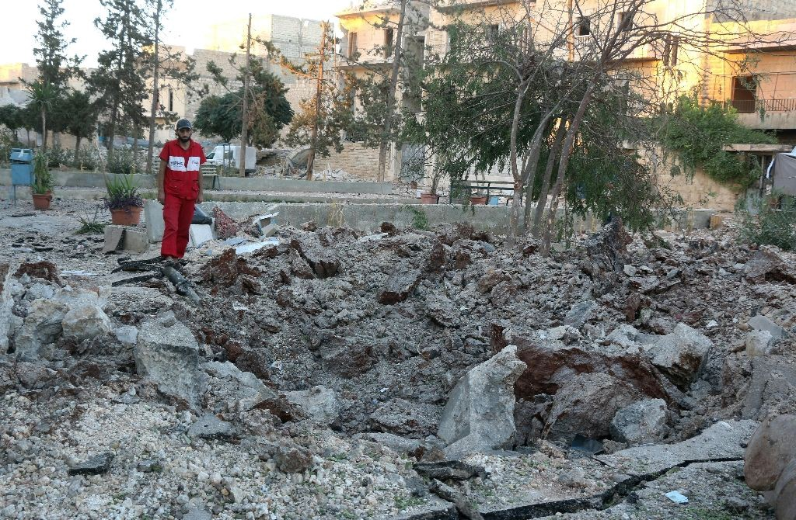
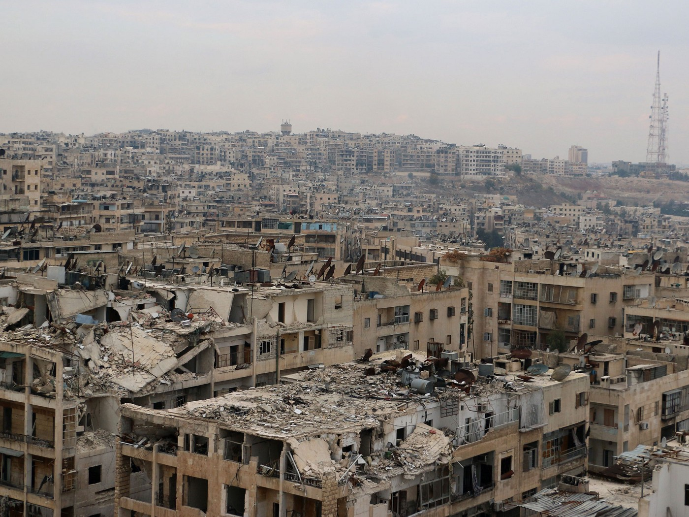
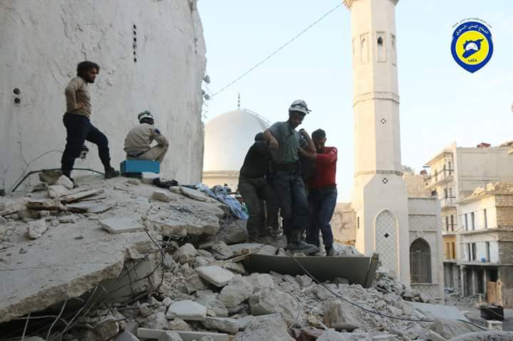
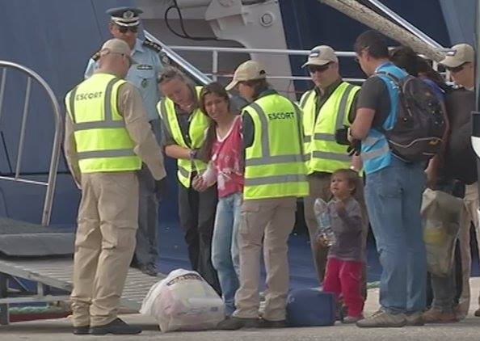

### AYS Digest 06/10 — Russian ambassador admits to the deliberate targeting of hospitals by regime and Russian forces

Syrian physician looks at the rubble of a medical facility recently targeted by a regime airstrike\. Photo credit: Thaer Mohammed, AFP Photo

The Russian ambassador to Britain Alexander Yakovenko has implicated his government’s involvement in war crimes\. In a shocking tweet, the ambassador made the outrageous claim that Russia and the Syrian regime is fully justified in going so far as to bomb hospitals\.

The AYS digest, as well as the media at large, has already covered the extremely damaging legacy of this practice\. As we reported last week, there are currently around 30 doctors left in the entirety of rebel\-occupied East Aleppo, and as hospitals get bombarded on a regular basis, treatment for even the simplest of conditions is becoming more and more difficult\. Russia and the regime have shown its commitment to keeping the city under siege, having gone so far as to bomb an aid convoy during the failed ceasefire\. Such blatant violations of human rights and the laws of warfare poke massive holes in the regime’s narrative that it is simply defending itself against terrorists\.

Rebel\-held al\-Asari District in November 2014\. Photo credit: Mohammad Baraa, AFP\.

Of particular interest is a parallel comparison of the reactions of regime supporters to this grotesque practice to the near\-identical practice employed by the Israeli military during its periodic assaults on Gaza\. When Israeli officials claim that they bombed a hospital, a school, or another piece of civilian infrastructure, Assad regime supporters as a rule voice outrage, and rightfully so\. It seems that these practices take on an entirely different character when the Assad regime is carrying these attacks out, because they are done in the name of “anti\-imperialism”\. Another anti\-imperialist tactic of the Assad regime is bombing schools, forcing pupils to go underground for an education\.

The regime and its Russian allies does not limit itself to targeting hospitals\. Another practice commonly employed as of late is dropping mine busting bombs in the vicinity of civilian infrastructure, causing heavy structural damage and often leading to the collapse of entire buildings\. The signs seem to suggest that the regime is planning a new attempt to capture the districts currently held by rebel forces\. The regime is once more telling the fighters and residents of the rebel sector to get out, offering “amnesty”, the value of which is rather questionable given the regime’s numerous previous violations\. The government ominously added that, “all those who do not take advantage of the provided opportunity to lay down their arms or to leave will face their inevitable fate\.”

As always, it must be added that even those whose primary concern is the refugee crisis must pay close attention to the horrific and bloody situation on the ground\. Lest the bloodshed ends, Syria will continue hemorrhaging thousands of people in addition to the thousands killed, and Europe will be dealing with the horrors of the present crisis for many years to come\.
#### Greece

A refugee being forced onto a boat to be deported to Turkey, her daughter looking on\. Source: Europe says OXI
### DENTAL HYGIENE PROBLEMS IN CHILDREN

A message from a dentist volunteer\. Do not give the children sweets while they are unable to clean their teeth adequately\!

“ Dear volunteers,
We know that there are now many children and adults with noticeably black and decaying teeth and swollen gums\. As many of you will be aware, we have for a while, been trying to get dental care for families as this is becoming an area of increasing concern throughout Greece\. We really only have one dedicated unit up the North that is providing dental care\.
We know that volunteers, when bringing donations, want to put a smile on the kids’ faces\. This is natural; however, because of the concern about dental hygiene, it is probably better not to bring sweets or chocolate bars\. Whilst these may be a quick energy supplement, it is actually not good for their overall health, never mind for their teeth and gums\. And for some kids the level of sugar isn’t necessarily helpful for their behaviour and emotions — too much sugar can make kids hyperactive \(mums and dads will recognise this :\- \) \)
So, please can we ask that volunteers be aware of what they are buying\. If in doubt, check with the Squat leaders regarding the food that is running low and use the money to buy items that are needed \(e\.g\. cooking oil, tins of beans, pay towards bread debts at bakery etc\) \.
We are slowly making progress on the dental situation but it is going to be very slow progress so in the meantime, please help us help families to keep the teeth shining white and their gums healthy\.”
### RUMOR ALERT: US and Canada are NOT resettling refugees from Greece\.

[“ The US and Canada are already doing a lot to resettle Syrian refugees, but only from Turkey, Lebanon and Jordan and not from Greece\. The US recently welcomed its 10,000th Syrian and by the 18/09 Canada had received 30,862\. On the 17/09 an EU politician, Dimitris Avramopoulos, stated vaguely that he looks forward to enhancing cooperation with them\. This is not an official policy and Canada and the US have not made any statements saying they will take people from Greece\.”](https://www.facebook.com/mobileinfoteam/photos/a.1800063030222418.1073741830.1796286800600041/1846946492200738/?type=3)
### 1,500 refugee children to start schooling on October 10\.

The program is much smaller than the 15,000 anticipated by the Greek government\. Tensions arose in September when news of the plan became public, as parents did not want refugee children attending the same schools, [going so far as to stage a sit\-in](https://medium.com/@AreYouSyrious/ays-news-digest-09-09-2016-c985156bf49e#.jl3m7bjlc) \.
### Greek government issues instructions for people who lost their documents\.

They may be accessed [here](http://www.refugee.info/greece/#lost-documents) \.
### All flights into Greece will be cancelled from October 9 to October 13 due to a strike\.
### [Greek government numbers](http://media.gov.gr/index.php/component/content/article/258-%CF%80%CF%81%CE%BF%CF%83%CF%86%CF%85%CE%B3%CE%B9%CE%BA%CF%8C-%CE%B6%CE%AE%CF%84%CE%B7%CE%BC%CE%B1/4160-summary-statement-of-refugee-flows-06-10-2016?Itemid=595) record only 2 arrivals\.

Two boats arrived On Lesvos during the day, with 52 people on board\. 160 arrived on Samos\. 55 refugees were deported to Turkey on Wednesday, 37 of whom had their asylum application rejected twice\.
### MSF has opened a new clinic in Athens\.

The center is open Tuesday to Friday from 9\.00 to 16\.00\. Go to the clinic in Solonos street 133, Athens; Call \+30 210 3839372 for more information\.
