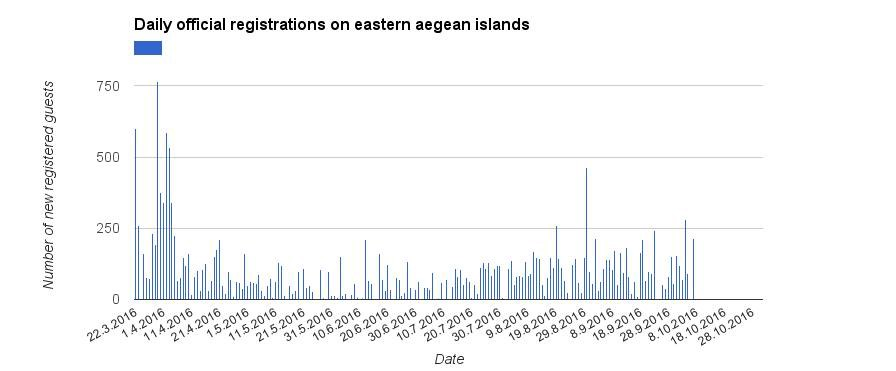
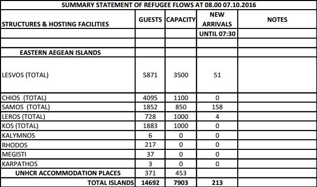
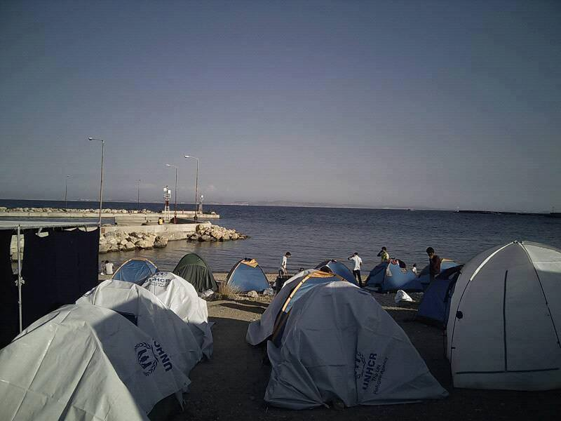
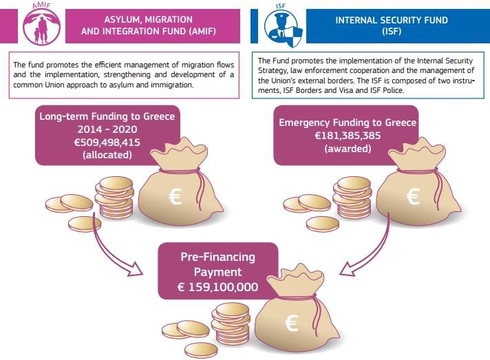
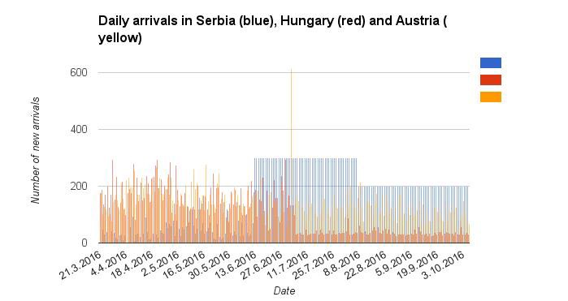
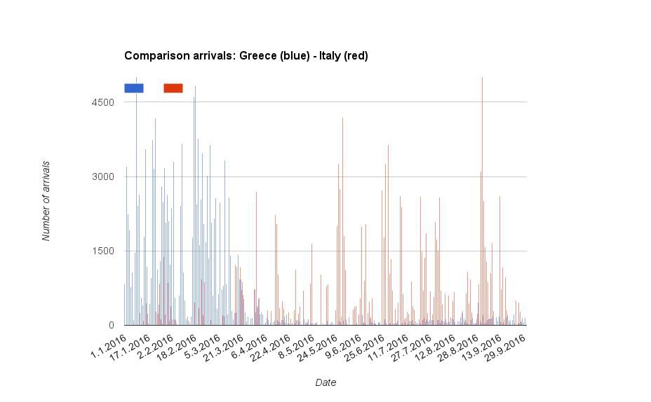

### AYS SPECIAL: 200 days after EU — Turkey deal

_Today, October 7th, the agreement on refugees becomes 200 days old\. In this special report we want to analyze what this deal and the closure of the Balkan\-Route meant to refugees\._

](assets/5656e6ce0dbf/1*i8sGd4DMYyVk56Wfb8FI4g.jpeg)

Thousands of people are stuck in Serbia, arrived with smugglers, and waiting to continue their journey\. Photo by [**Mette Flansmose**](https://www.facebook.com/mette.flansmose)
### Greece

The deal was implemented in the night from 20th to 21st of March and said, that Turkey will take back refugees who arrive on the Greek islands and for every Syrian another Syrian is allowed to resettle in an EU country\. But in fact, this deal never worked really\. In the first days Greece sent back some refugees with high international attention and the EU received the first ones from Turkey\. But even there it was obvious, that the one to one exchange didn’t work\. According to the last [factsheet](http://europa.eu/rapid/press-release_MEMO-16-3204_en.htm) 578 refugees and migrants \(only few Syrians\) have been sent back, while 1614 refugees have been resettled\. That Greece didn’t send back the new arrived people had various reasons, including courts ruling, that [Turkey is not a safe country](http://www.telesurtv.net/english/news/Greece-Court-Rules-Turkey-Not-Safe-Country-for-Refugees-20160521-0021.html) for them\.

By AYS

Another point was, that refugees were no longer allowed to leave the islands and put in the so called hotspots\. Since the deal didn’t work, the hotspots were soon overcrowded\. Greek authorities registered 21723 since then\. By now Chios with 4095 refugees is about to hit 400 percent of it’s offical capcity, Lesvos is hosting almost 5871 refugees which is almost 158 percent of the capacity of 3500\. Samos hosts 1852 with a capcity of 850\. All together the islands are close to 200 percent of the capacity\. The international community seems not to care about this fact\.

Source media\.gov\.gr

While the number of new arrivals significantly dropped in May \(1472\) and June \(1450\), it nearly doubled since then\. The statistics clearly show, that after the Turkey coup on 15th July there has been a high increase of new arrivals\. The first days in October were even higher than in the first days in the months before\. We assume that this is connected to the deadline Turkey hat set the EU for visa liberalisation — some media reported end of October, others the end of the year — and wants to put pressure with letting pass refugees\. According to volunteer reports refugees have now to sleep in tents at the beach because the hotspot is overcrowded\. We are concerned that soon the situation on Chios, Samos and also Kos will worsen during the next weeks and months, if the people won’t be transferred to the mainland\.

Chios, October 5\. Photo by Evangelia Avdeliodi

Since Macedonia closed its borders to Greece in early March, more than 35\.000 refugees are stuck on the mainland\. The living conditions in the camps sometimes are still inhuman, every week we get to know about medical emergencies who don’t get a appropriate treatment\. While we see, that Greece authorities are working together with volunteers to improve the conditions, we also see, that these efforts are not enough\. Soon temperatures will drop and we don’t see that the camps are prepared for autumn not to mention winter\. According to EU documents, since March 198 Million \( \! \) Euro have been transferred to NGOs and authorities working in Greece as emergency funding to improve the conditions\. This means more than 3000 Euros for every of the 60\.000 refugees\. And there have been [even more fundings](http://ec.europa.eu/dgs/home-affairs/what-we-do/policies/european-agenda-migration/background-information/docs/20160412/factsheet_managing_refugee_crisis_eu_financial_support_greece_en.pdf) \. Seeing this amount of money we are asking, what has been done with it?

Source ec\.europa\.eu

Further demographic [statistics](http://data.unhcr.org/mediterranean/country.php?id=83) of the UNHCR show, that since 1st January 37 percent of the new arrivals \(more than 167\.000\) were children, 21 percent women\. Our information is, that some 6000 refugees in Greece are waiting for family reunion under Dublin III which can last up to 11 months\. They came to Greece by sea, because the embassies in the middle eastern country and Turkey weren’t working fast enough\. Now that the balkan countries are blocking the borders, they still have to wait\. But it is their right to be reunited\.
### Turkey

In Turkey we registered conflicting reports\. While the programs made possible with EU money, like the [cash cards](http://www.reuters.com/article/us-turkey-eu-refugees-idUSKCN11W1E7) improved the living conditions of refugees and boosted the local economy, we also see, that not all refugee benefit from this programs\. There are still reports of homeless people who have barely nothing, children who have to work and don’t get access to education\. There have also been reports, that from Greece returned refugees faced detention with no access to legal aid and insufficient care\. Further Turkey is about to close its border to Syria and already blocked refugees from there, while there have been [bombings](https://www.theguardian.com/world/2016/may/06/syrian-refugee-camp-bombing-airstrikes-sarmada-un-msf) on refugee camps in Syria\. It’s obvious, that the number of new arrivals in Greece has raised after the failed coup, but we can’t say, that the situation for refugees has significantly worsened since then\.
### Eastern Europe

Since the EU sealed the agreement with Turkey to stop refugees from crossing to Greece the so called Balkan route was closed as all the borders got virtually closed to illegal migrants\. Although it soon reduced dramatically the flow through the sea another route remained as people still managed to cross from Turkey to Bulgaria and then to Serbia but this time going up to Hungary like happened in the beginning of the crisis and not through Croatia\. This route has been described by many refugees as extremely hostile and there are countless reports and proof of violence towards refugees between Turkey and Serbia\.

According to UNHCR, in Serbia refugee numbers using that route started increasing not long after the border closures and peaked at an average of 300 a day around the end of June staying steady until now\. Unfortunately an average count or daily crossing doesn´t give the best picture of the reality on the ground and raises some concerns about the accuracy of the data UNHCR is providing\.

During the summer, in the beginning of June, Hungary tried once more reducing the flow of refugees through the country passing a law that allowed security forces to expel all illegal migrants that were caught 8 kilometer within its borders sending them back to the country they came from\. As the graphics show, by the end of June, refugee numbers in Hungary fell significantly but this just caused the numbers in Serbia to rise enormously, going from about 2000 at that time to about 5700 at the moment\. These drastic measures implemented by Hungary have put increasing pressure on and stress on refugees stuck there causing protests like the refugee attempt marches from Belgrade to the border on the 24th of July and more recently on the 4th of October\.

AYS

At the end of the route, in Austria there always has been a flow of refugees after the EU\-Turkey agreement, showing that some people still manage to overcome all the obstacles on their way to reach safety\. There has been a steady flow of between 100 and 200 refugees a day going through this country since then coming from Hungary but also from Italy, the other big route that has also brought huge numbers of refugees to Europe this year\. Since the deal was implemented, 28770 refugees have been registered entering the country, while Hungary only let pass 21061\. The average numbers provided for Serbia would indicate that some 32000 people passed through the country\.

Overall the EU\-Turkey deal, despite tackling the smuggling of people through Greece, it pushed more people to go on an alternative, hostile and dangerous route and fueled smugglers business throughout eastern Europe\. Further there have been several reports, that smugglers still manage to bring the refugees from Greece to Serbia\. The border closure forced the refugees to take more dangerous ways hidden from authorities or UNHCR\. Among refugees, who don’t have the money or who don’t want to take the risk, the slogan “the borders are closed for us but not for smugglers” spread\.
### Italy

So far, UNHCR has registered almost 140\.000 arrivals what is a similar number to the 153\.842 arrivals in 2015\. The feared mass influx, when officials spoke of one million refugees ready to cross the mediterranean sea earlier this year, has not happened by now\. Nevertheless the last days there have shown, that an increasing number is trying to come to Europe before winter — recently only in two days more than 10\.000 refugees have been rescued by coast guards and volunteer lifeguards like Sea\-Watch and SoS Mediterrane\. What we saw is, that by 6th October 3056 refugees had died attempting to find a safe place in Europe compared to 2913 in 2015\. This is not only because the boats have to run longer distances, if they for example depart from the coasts of Egypt, but also because the boats are bigger so the smugglers make more money\.

Even if the the number of arrivals in Italy has increased after the Turkey deal, we believe this is more linked to the better weather conditions and not the agreement itself\. From January until August UNHCR registered only a few refugees from Syria \(577\), Iraq \(322\), Afghanistan \(279\) or Iran \(108\) \. So it seems like at least in this year this has not been an alternative route for refugees from the middle east\.

AYS

From what we heard from volunteer reports, Italy is making efforts in offering the refugees a safe space\. The number of people who continue their journey dropped significantly as authorities manage to meet the basic needs \(see also our [special report for Northern Italy](https://medium.com/@AreYouSyrious/ays-special-situation-of-refugees-in-northern-italy-c5701864a3a4#.j6v1c2bsd) \) \. But Italy is as Greece suffering from the slow relocation process so far and maybe get more problems as the arrivals rise\. Rome already suspended asylum requests until end of October\. This could cause another movement of refugees northwards\.

Note: For the statistics and graphs AYS has researched the number of new arrivals provided by the [Greek Secretariat General for Media&Communication](http://media.gov.gr) and [UNHCR](http://data.unhcr.org/mediterranean/country.php?id=83) \. Our tables and graphs will be updated in future can be found in this [Google Doc](https://docs.google.com/spreadsheets/d/1xWVKJMQ3z90m8CsZMNFC7TAyjRgA3puRHFbwZ8YIjUk/edit#gid=0) \.

**_\(Report by AYS volunteers Niklas G\. and Joao P\. \)_**

_Converted [Medium Post](https://medium.com/are-you-syrious/today-the-agreement-on-refugees-becomes-200-days-old-5656e6ce0dbf) by [ZMediumToMarkdown](https://github.com/ZhgChgLi/ZMediumToMarkdown)._
