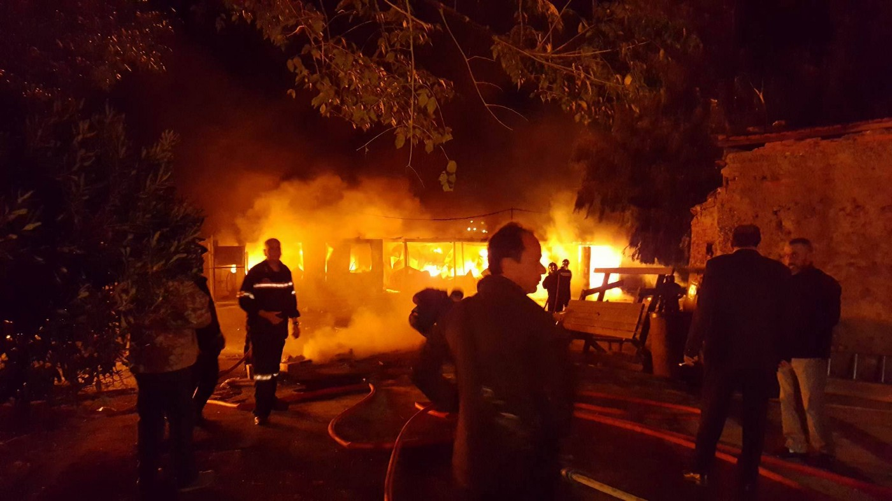
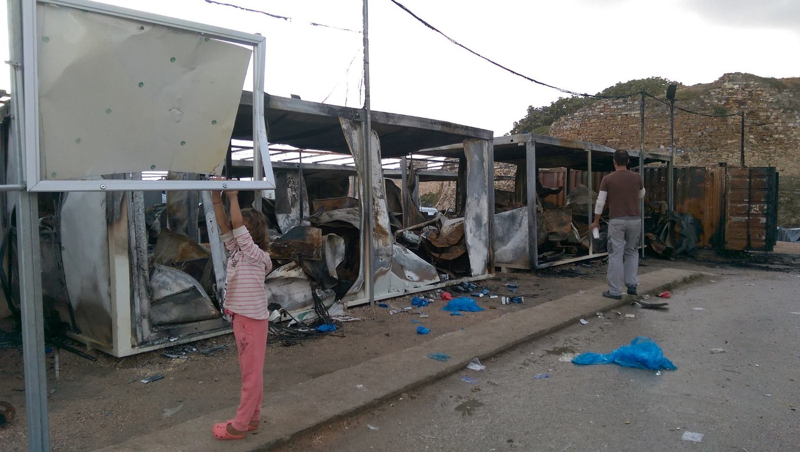
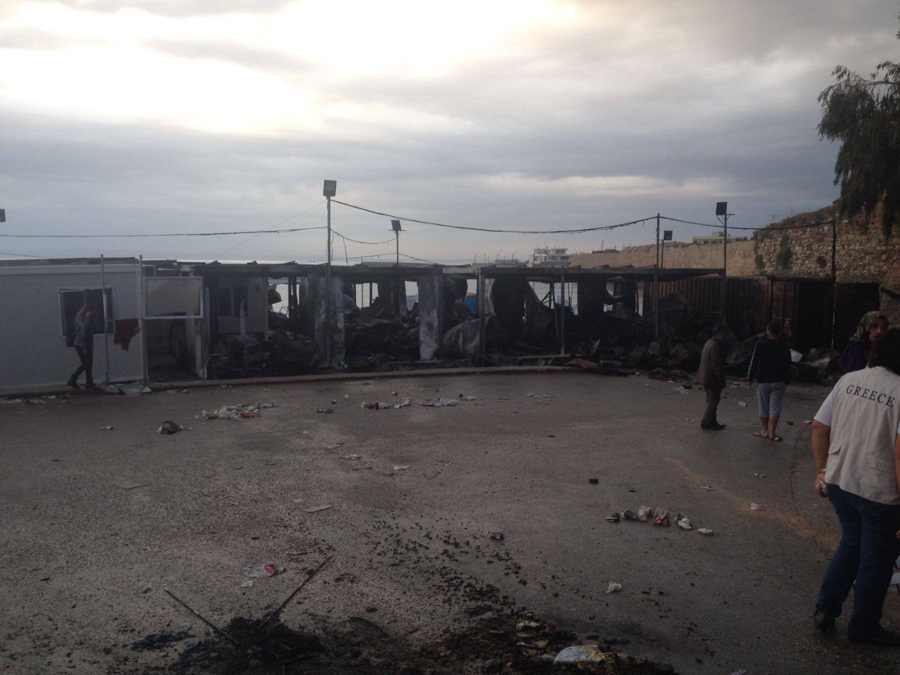
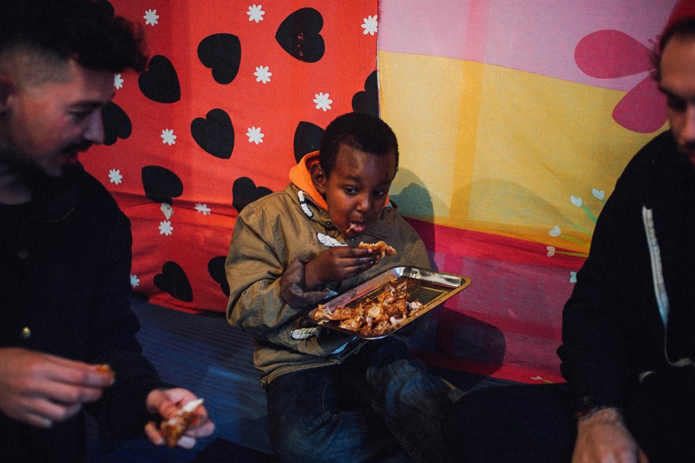
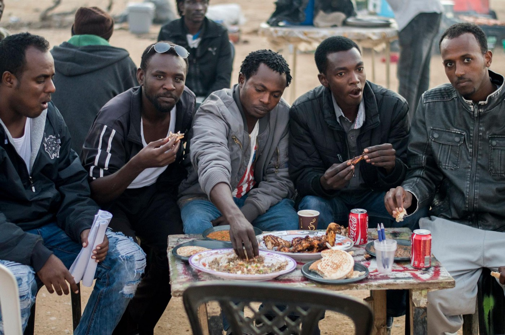

### AYS Digest 8/10: Souda fire triggers new tragedies

Souda Fire\. Photo Credit: Sana À Dada
### FEATURE

The stormy Friday night was punctured by an additional disruption on Souda, Chios when a fire broke out in the camp\. It appears that the containers and administration zone of the camp was the central point, leading to the assessment that this fire was sent intentionally as an outburst of frustration towards the bloated and stagnant bureaucracy of the camp\. Throughout the night, due to the rain, electricity was also irregular, which could have further escalated the situation\.

In addition to destroying containers that had aid prepared for distribution, the fire displaced many residents of the camp as well, and response teams have been scrambling to find ways to house and tend to not only the new arrivals to the island, but the newly\-re\-displaced people\. [Salvamento Marítimo Humanitario](https://www.facebook.com/smhumanitario/?hc_ref=PAGES_TIMELINE) [humanitarian rescue](https://www.facebook.com/smhumanitario) was able to set up emergency medical facilities in order to respond to the crisis\.

Photo Credit: Gabrielle Tan/Action from Switzerland

Organizations report urgent need for tents \(four\-person minimum\) and jogging pants\. UAREUK has a [fundraiser linked here](https://www.gofundme.com/chiosfire) in order to support the efforts of Chios Eastern Response Team\. Additionally, [Action from Switzerland](https://actionfromswitzerland.ch/) maintains a presence on Chios\. If you wish to help, please donate to these organizations which are now pulling 24\-hour shifts in order to cover the needs\. With capacity now diminished, new arrivals on Chios will now face even greater hardship\.

The photos below shows the extent of the damage\.

](assets/b901d1d7a70c/1*JrviLOayp-_RtfHF7iu90w.jpeg)

Photo Credit: [**Pothiti Kitromilidi**](https://www.facebook.com/pothiti.kitromilidi)

The recent disaster gives the opportunity to be reminded resist normalizing these kinds of tragedies\. Although frustration and desperation in the light of the catastrophic failure of bureaucracy is the most likely motivator for this event, we must abstain from our answers and explanations from becoming too quick and too regular\. Even if the explanations do not change over time, it is dismissive to provide knee\-jerk responses these situations\. A crucial part of affirming humanity is taking the time to contextualize events that occur in the complex realities of the world\.

Photo Credit: The Worldwide Tribe

It can become too easy to generalize and rely on standard arguments\. We can start from “frustrations boiling over caused this,” but we should not end there\. While we push for the situation to be changed, it is also imperative to reach out and continue to build community ties as it is always the community that will face the repurcussions for the actions of a few\.

> Many of the perceived interethnic or internationality conflicts that “boil over” between refugees find their roots in a combination of economic, social, cultural, religious, and even political factors\. Understanding cannot be automated or generalized\. 

Everyone should seek to be educated on the various influences that affect the communities across Greece and beyond\. Working to face these quiet currents together is an important step forward and, when taken with a willingness to be proven wrong, can help de\-escalate dangerous situations\.

There are many stories that buck the common “lore”\. For example, on the project Refugee Site we find the story of [Ahmad and Fuad](https://refugeesite.com/2016/06/07/ahmad-and-fuaad/) who, while at a school near Athens, have forged a friendship that opposes the notion that Syrians and Afghans do not get along\. We hope that in spite of the horrific and inhumane conditions faced by refugees, that the kindness of other residents and of volunteers on the ground will strengthen rather than fragment the communities\. In the face of abandonment by the EU, the only way forward is together\.
### Greece

Strong winds topple shelter supports in Katsikas camp\. In what could have been a disaster, many concrete and wire pillars supporting the shelter stretching over Katsikas camp crumbled in the face of strong winds\. The true absurdity of the event, which could have killed children of the camp, is revealed when it is learned that the establishment and maintenance of this camp is, indeed, far more expensive than alternative housing options such as temporarily letting houses and apartments in a nearby town\.

You can’t house people more expensively than to house them in tents on a field that is not intended to house people

points out Florian Horsch in a video published by Soup and Socks\. The full video is linked below, and there will be more detailed information about the event tomorrow\. Stay tuned\!

### Austria

Some good news from Austria as it has been decided that taxis that transport or transported refugees will not be charged with people smuggling\. According to [The Local](https://www.thelocal.at/20161007/taxi-drivers-who-transported-refugees-not-people-smugglers) :

> **Taxi drivers and members of the public who picked up refugees who had made it across the Austrian border last summer and drove them to their destination cannot be prosecuted as people smugglers, Austria’s high court \(OGH\) has ruled\.** The OGH decided that “the mere transport of strangers who have already illegally crossed Austria’s border” is not a criminal offence punishable by law\. 

As other states within Austria begin to lower their social allowances for refugees, more refugees congregate in Vienna, which has kept its offerings stable\. In Vienna, the monthly amount is over nine\-hundred euro, where in some cities, it is just over half of that amount\.
### France

Former French President, who is eyeing a return to power, is advocating that a referendum be held in favor of suspending the family reunification procedure\. Sarkozy also recommends a referendum advocating for the administrative detention of those individuals who have received the “S” mark indicating a supposed risk to state security\.

[Villagers of Pierrefeu](http://m.france24.com/en/20161008-french-towns-protest-plan-relocate-calais-jungle-migrants-pierrefeu-refugees) , a southeastern French town slated for becoming relocation spots for former residents of Calais camp, have staged protests against this action\. The government plans to house refugees in the abandoned ward of a psychiatric hospital; however a few hundred protestors, including the mayor voiced their opposition\. Sadly, far\-right demonstrators plan another “anti\-migrant” protest soon as well\.

Photo Credit: The Worldwide Tribe

Meanwhile, the preparations for the demolition of Calais continues\. As such, there is a dramatic and urgent need for bedding, winter coats, winter shoes, cold\-weather items, and of course money as people and children are driven out of the relative protection of Calais into fending for themselves\. If individuals wish to get involved, they should contact Danica Jurisic on Facebook\.
### United Kingdom

The charity Help Refugees is pursuing legal action against the UK government, citing that the mishandling and lack of action on assisting unaccompanied minors in Calais is a serious breach of duties\. According to the Guardian:

> [Help Refugees](http://www.helprefugees.org.uk/) says the home secretary, Amber Rudd, has breached her relocation duties to some unaccompanied children in Europe, by misconstruing or misapplying the May Immigration Act under which the government was obliged to take some children into the UK\. 

It is the hope of Help Refugees that this action will result in the relocation of minors in Calais to the UK in order to prevent them from being driven even further to the margins\. Considering the chilling numbers from last year on the number of missing children in Europe, it seems they are correct\.

Pro Syrian activist Oz Katerji confronted Jeremy Corbyn at an event, criticizing the politicians lack of centering of the voices of Syrians in conversations regarding the Syrian war\. Corbyn is well\-known for his involvement in the Stop the War campaign, which advocates for non\-intervention in the Syrian conflict on part of the UK\.

Katerji also called out the politician’s lack of condemnation of the atrocities resulted by the bombing campaigns and airstrikes conducted by the Syrian Arab Army in partnership with Russia\. Russia, meanwhile, vetoed a U\.N\. demand to cease bombing Aleppo\.

_Converted [Medium Post](https://areyousyrious.medium.com/ays-digest-8-10-souda-fires-trigger-new-tragedies-b901d1d7a70c) by [ZMediumToMarkdown](https://github.com/ZhgChgLi/ZMediumToMarkdown)._
