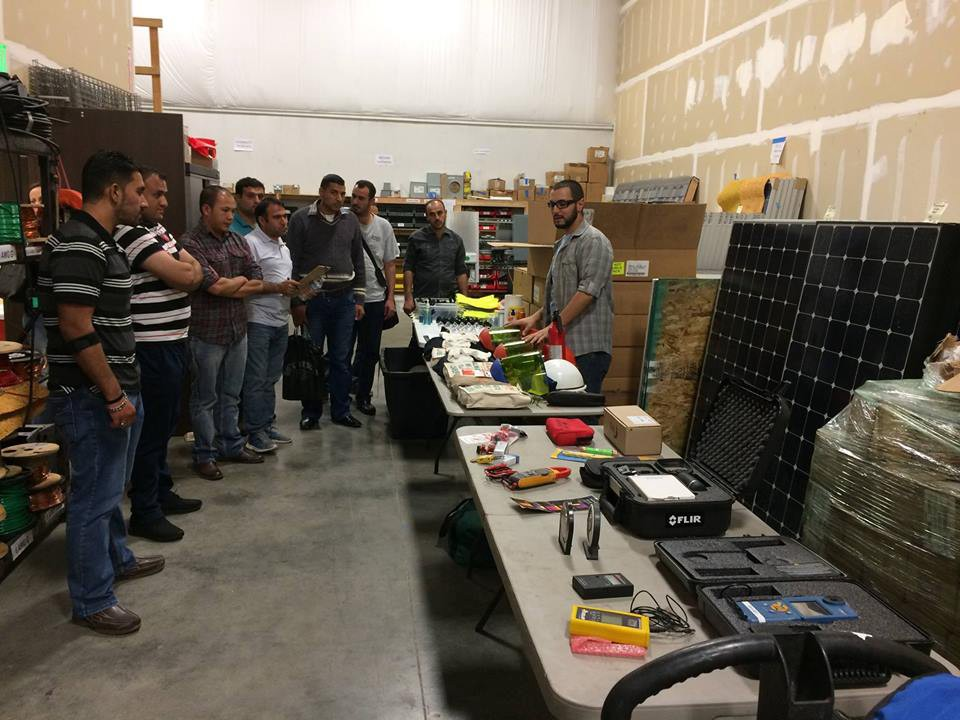

### AYS 11/10: Calais: The fear of **eviction** constantly looming

> Arrests, demolitions and evictions in Calais have started, refugees are largely not offered any other shelter\. Push\-backs from Serbia to Macedonia occuring on a scale larger than we have previously thought\. A potential of a new camp opening in Serbia\. Merkel promises millions in aid to poor African countries to stem migrant flow\. 

](assets/15c4d0375349/0*hDlF2fWa5tfA2P6x.)

Credits: [**Help Refugees**](https://www.facebook.com/HelpRefugeesUK/)
### What the life in Calais camp looks like with demolitions and evictions on the horizon

We still have no final confirmation of when the eviction will take place but many fear it could begin as soon as Monday — and still there is no plan for how refugees will be taken care of\.

The organisation [**Help Refugees**](https://www.facebook.com/HelpRefugeesUK/?fref=nf) expresses a special concern for the camp’s most vulnerable refugees, namely, the unaccompanied minors, families, women and, especially, pregnant women, people with chronic medical conditions, people needing special medical treatment, people suffering from severe mental health issues resulting from trauma and, finally, the elderly\.

Arrests of refugees and demolitions of their Calais bussinesses has already started\. Namely, police in camp arrested volenteers from Kids cafe, as well as they smashed the door of the Jungle Books store room\.

](assets/15c4d0375349/0*0x2wEoLXwU-m1-3Z.)

Refugees from Kids cafe arrested\. [**Refugee Info Bus**](https://www.facebook.com/RefugeeInfoBus/)

In addition to these, [**Kesha Niya Kitchen**](https://www.facebook.com/keshaniya/?fref=nf) reports that two tents, which were housing over 15 Afghani refugees, were taken down today, thus leaving two families without any shelter\. Moreover, two businesses were closed and demolished, namely the barbershop and the sandwich shop, while other businesses were forcibly closed\.

](assets/15c4d0375349/0*Bb2g6T6OelMXY60S.)

Refugees from Kids cafe arrested\. [**Refugee Info Bus**](https://www.facebook.com/RefugeeInfoBus/)

While the British Home Secretary Rt Hon Amber Rudd and the French Interior Minister Bernard Cazeneuve claim that they are working together to ensure the successful dismantling of the Calais camp, the Emmaus president Thierry Kuhn says the conditions for an efficient evacuation of the camp are not fulfilled and that, furthermore, Interior Minister Cazeneuve seems to be doing everything so that the evacuation leads to a violent confrontation\. The Secours Catholique says “This is a security operation that is only humanitarian by name”\.

](assets/15c4d0375349/0*hrF64sVXgsZidJfN.)

Smashed doors of the Jungle Book store room\. Credits: [**Refugee Info Bus**](https://www.facebook.com/RefugeeInfoBus/)

**At 8:30 a\.m\. on Monday, CRS and plain\-clothed police blocked two Parisian avenues and the metro exits in order to prevent refugees from fleeing** \. After rounding them up and looking at their papers, 75% of them were placed outside of the security cordon, waiting and hoping for housing\. The avenue was once more cleaned up and a lot of things were thrown away, despite the cold of the last days\. 25 people were brought to the police station and around 10 people were granted a shelter for a couple of days, yet that this 10 out of about 100 people that were rounded\-up during this day\. This is the 20th round\-up since the 31th of July in Paris\.

](assets/15c4d0375349/0*3NOdJal7ekTRQnBf.)

Credits: [**Rose Lecat**](https://www.facebook.com/rose.lecat)
### Push\-backs of refugees from Serbia to Macedonia

Systematic push\-backs of people from Presevo camp has been confirmed by both Serbian and Macedonian volunteers\. Refugees who have been locked up for months in Presevo are allegedly being returned to Macedonia without a legal procedure, in groups of 30–40 people per day, most probably over the green border\. Refugees who are still in Presevo say they are very afraid because they don’t have any information if they too will be pushed back to Macedonia\. According to local volunteers, those who are returned to Macedonia are not brought to official camps, but left to find their own arrangements in the villages around the border\. Most of them are single men from various countries including Syria\. Volunteers have also reported that Afghan families are being pushed back to Macedonia in a crude attempt to clear out Presevo camp\.

From unofficial information we find out that, tomorrow, the Reception Center Presevo will admit another 200 refugees that are coming from central Serbia, thus making the number of people in the camp higher than 800\. At the same time, by the end of this week, a new camp Bujanovac will be opened in the ex\-factory Svetlost\. Families from Presevo, which make for around 250 people, will be transferred to Bujanovac, while Presevo will remain holding largely single males and those refugees Serbia named “economic migrants”\. We will try to expand on these info tomorrow\.

**Serbia has also enforced border controls with Bulgaria and Macedonia** , vowing to send back to the respective countries all refugees who cross irregularly, amid fears these may end up locked within its own boundaries as neighboring Hungary has stepped up border security\.

**Some 4,992 refugees were stranded in Serbia as of 5 October** \. This represents a significant increase \(348 percent\) from 1,114 migrants and refugees reported beginning of the July, when Hungary adopted legislation which allows its border patrols to send migrants apprehended within an 8km radius of the border back to Serbia\.

The total number of stranded refugees in Greece and the Western Balkans is **73,721,** a **56** percent increase since the implementation of the EU–Turkey agreement on the 10 of March 2016\. In Greece, there was a **40** percent increase during the period\. Notably, Bulgaria recorded an increase of around **717** percent from 863 to 7,070 between the 10th of March and the 15th of September, 2016\.

**Relocation Updates** — As of 21 September, a total of 5,297 refugees were relocated from Greece \(4,140\) and Italy \(1,157\) by IOM under the EU relocation programme\.

**Readmissions to Turkey** — According to Turkish Directorate General of Migration Management \(DGMM\), as of 5 October, a total of 579 refugees were returned from Greece to Turkey as a part of the EU–Turkey agreement\. During the period, 1,670 refugees from Syria were resettled by IOM from Turkey to 13 EU countries\. The majority were resettled to Germany \(614\), Sweden \(269\), France \(228\) and the Netherlands \(170\) \.
#### Syria
### Russia resumes heavy bombing of eastern Aleppo

Russian jets resumed heavy bombing of rebel\-held eastern Aleppo on Tuesday after several days of relative calm, a rebel official and the Britain\-based Syrian Observatory for Human Rights monitoring group said\. The Observatory said the death toll from bombing in Bustan al\-Qasr, Fardous and other neighbourhoods rose to at least 25, with scores of wounded\.

**Air strikes mostly hit the Bustan al\-Qasr neighbourhood** , Zakaria Malhifji of the Aleppo\-based Fastaqim rebel group told Reuters\. At least 50 civilians were killed by strikes on the rebel\-held part of the city and nearby villages controlled by insurgents, residents and rescue workers said\. In Bustan al Qasr, residents said, the strikes hit a medical centre and a children’s playground\.
#### Jordan
### Jordan to allow aid to refugees stuck on border

Jordan has announced that it will permit humanitarian aid deliveries to tens of thousands of refugees stuck on the country’s border with Syria, which has been closed since a deadly attack on soldiers in June\.
#### Greece
### Volunteers needed in Sounio camp

Earth Refugees needs volunteers to help their work in camp Sounio, located two hours by bus from Athens\. Volunteers must be able to work for a minimum of 14 consecutive days\. Proficiency in English is required\. Volunteers with experience in English language instruction \(TEFL\), designing and supervising activities for children, volleyball instruction, food preparation, and Arabic and Farsi fluency are highly valued, though basic organizational skills as well as a commitment to humanitarian service are also needed\. A bed in a shared cabin within the camp is provided to all volunteers for the duration of their stay\. If you are interested, please fill out this [form](https://docs.google.com/forms/d/e/1FAIpQLSdgTPA86W8-mxZdGaQOYI0yK81tCJREOz5D717x5hZjPNsdgQ/viewform?c=0&w=1) with your contact details, skills, and availability\.

**Visit this [page](http://www.greecevol.info/) for all other volunteering opportunities in Greece\.**
### Locals of Profitis village place Greek flags and a locker on the main door of the school where refugee children were due to start lesson

](assets/15c4d0375349/0*4kcfIIH80g9CrVHs.jpg)

Credits: [Dimitris Tosidis](https://twitter.com/d_tosidis)
### Greek authorities have opened a new reception center for unaccompanied refugee children near Athens

Migration Minister Yiannis Mouzalas said Tuesday that the center at Paeania, just east of the Greek capital, would host up to 100 minors\. It is funded by the International Organization for Migration, and run by the Doctors of the World charity\.

Mouzalas said some 2,200 unaccompanied minors are currently in Greece, of whom 1,000 live in specialized accommodation, which shows that, although the new centre is a progress, it is not nearly enough to meet the demand\.
### Donations needed for a kindergarden in City Plaza, Athens

Feel free to drop by and give your solidarity supplies, including toys, books, and everything else a kindergarden needs\.

](assets/15c4d0375349/0*MLkvQ7Cd4Wh64TZZ.jpg)

Credits: [City Plaza Squat](https://twitter.com/sol2refugees)
### More rain and hail fell on Katsikas camp, reminding us that the winter is coming

](assets/15c4d0375349/0*Lr_IhbD_oWduy3o-.)

Credits: [**KatsikasLive**](https://www.facebook.com/KatsikasLive-1747980202123076/)
### For the first time there are now more than 15,000 refugees on the islands \(official capacity is 7903\)

](assets/15c4d0375349/0*cFjcQfuOVUDYL38e.)

Helping new arrivals\. Credits: [**Salvamento Marítimo Humanitario**](https://www.facebook.com/smhumanitario/)

**New arrivals**
- Samos: 88
- Kos: 6
- Kalymnos: 26
- Megisti: 23
- Chios: 39
- Lesvos: 22

**Voluntary returns: 1**

](assets/15c4d0375349/0*r6B6xjBHGISK4IWO.)

Comparison of arrivals in the last three months\. Credits: [**Niklas Golitschek**](https://www.facebook.com/Niklas.golitschek)
#### Bulgaria
### Refugees are leaving Bulgaria’s accommodation centers

Twice as many refugees left state\-owned accommodation facilities in Bulgaria compared to the rate in September, according to recent statistics\. More than 500 went out of the centers in the first week of October, while newcomers were 400, Interior Ministry data suggests\. There are more than 5000 people in the facilities, which are currently working [beyond their capacities](http://www.novinite.com/articles/176628/Bulgaria%27s+Migrant+Centers+%27Overcrowded%27) \.

From the beginning of 2016 through 29 September, 14,656 undocumented migrants were identified in Bulgaria\. Of these, 4,046 were identified on exit, 3,965 on entry \(3,521 entered from Turkey\) and 6,645 inside the country\.
#### Croatia
### Petition to fight against the Dublin Deportations

Many of these refugees are well integrated in Austria and Germany; they have new partners, friends and families, have learned the language and are for nearly one year in these countries\. The police takes refugees at 4 a\.m\.out of bed, they take children directly out of their classroom in school and pick up people from hospital; they split families, the refugees have no time to pack all their things or say good bye to their beloved ones\. Sign the petition against these obscenities [here](https://www.openpetition.eu/at/petition/online/petition-stopp-von-dublin-iii-abschiebungen-nach-kroatien) \.
#### Mediterranean
### Mediterranean migrant arrivals reach 316,331; Deaths at sea: 3,611

IOM reports that 316,331 migrants and refugees entered Europe by sea in 2016 through 9 October, arriving mostly in Greece and Italy\. Some 167,972 people have arrived in Greece and 144,527 in Italy during 2016\. The total is well below the number of arrivals at this point in 2015, when over 520,000 migrants and refugees had made the journey\.

However, the death toll in 2016 is higher\. This year some 3,611 people have drowned or been reported missing in incidents off Egypt, Libya, Greece, Italy, Turkey, Morocco and Spain\. In 2015 at this time, the total was 3,039\. For the whole of 2015, IOM’s Missing Migrants Project calculated 3,673 people were confirmed dead or missing\.

**According to the MoI, as of 9 October around 160,900 migrants and refugees were hosted in formal reception centres in Italy\.**
#### The powerful report [‘The economic impact of immigration’](http://www.fondazioneleonemoressa.org/) shows the value of migrants for Italian economy

A new study reveals that foreign workers in Italy contribute almost as much to the national economy as Fiat — Italy’s biggest car manufacturer and one of the country’s largest companies\.
#### USA
### Employment opportunities for refugees in Denver

Denver is growing hub for resettlement of refugees from the war\-torn countries of Syria, Afghanistan and Iraq\. There are 40 Syrian refugee families that are being resettled in the Denver area, as well as over 100 Afghan and Iraqi refugees\. In order to succeed and integrate into their new communities, they will need to secure stable employment offering living wages and opportunities for growth\.

The solar industry is a growing sector that offers well paid employment\. The Green Jobs for Refugees initiative seeks to provide refugees in the Denver area with the technical skills to be able to secure employment in the solar sector\. A pilot will be launched in October 2016 for up to 15 participants that will provide them with a background orientation, a start to finish residential solar install as well as discounted pricing on the online course to obtain certification through the North American Board of Certified Energy Professionals \(NABCEP\) Associates Program certificate exam\. Participants that finish the course will be connected with local employers such as Namaste Solar, Sunrun, and Aerotek, for apprenticeships and employment\.

For more information, please contact:
- Allison Moe\- Workforce Development Manager, GRID Alternatives Colorado, 303\.481\.4384 amoe@gridalternatives\.org
- Anna Segur \(Afghan refugee liaison\) annasegur@yahoo\.com 720–412–6847
- Nawara Chakaki \(Syrian refugee liaison\) nchakaki@gmail\.com 717–982–2202

Credits: Green Jobs for Refugees
#### Kenya
### Kenya forces refugees to return to war\-torn Somalia

**With the closure of the world’s largest migrant camp in Kenya, thousands of Somali refugees could be forced to return to their war\-ravaged homeland\. The move has been branded a violation of international law\.**
#### Niger
### Merkel promises millions in aid to Niger to stem migrant flow

German Chancellor Angela Merkel on Monday announced a €27 million aid package for Niger, her second stop on a three\-nation Africa tour aimed at fighting terrorism and stemming the migrant flow to Europe\.

The German leader said the army of the arid West African country, one of the world’s poorest, would receive €10 million in equipment next year\. Merkel also promised €17 million in development aid for [Niger](http://www.france24.com/en/tag/niger/) ’s desperately impoverished [Agadez region](http://www.france24.com/en/20160909-video-reporters-niger-agadez-migrants-west-africa-exile-europe) , which she said can no longer subsist on its once\-thriving tourism industry\.

Niger is a key transit point for people from sub\-Saharan Africa who try to cross the Mediterranean to enter Europe\.
#### General info
### “I am stateless \(I don’t have any citizenship\) \. Will this damage my chances of getting asylum?”

Find an answer [here](https://www.facebook.com/mobileinfoteam/posts/1851806471714740:0?hc_location=ufi) \.

](assets/15c4d0375349/0*gSosNKKf14kuJ6WQ.)

Credits: [**Mobile Info Team for refugees in Greece — الفريق المتنقل لمعلومات اللاجئين**](https://www.facebook.com/mobileinfoteam/)

_Converted [Medium Post](https://areyousyrious.medium.com/ays-11-10-calais-the-fear-of-eviction-constantly-looming-15c4d0375349) by [ZMediumToMarkdown](https://github.com/ZhgChgLi/ZMediumToMarkdown)._
