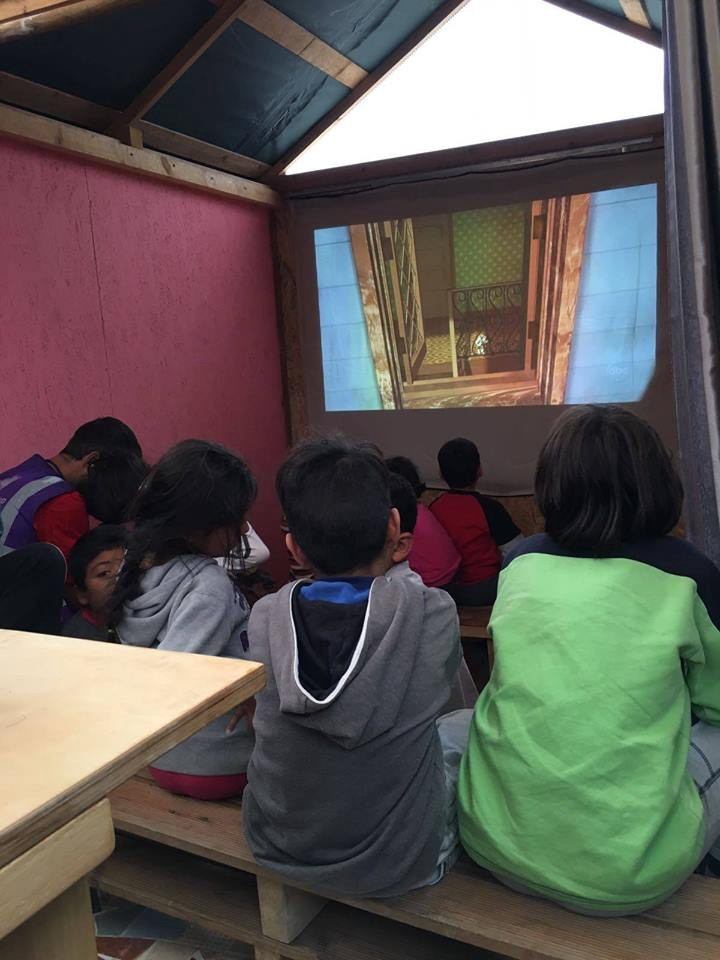
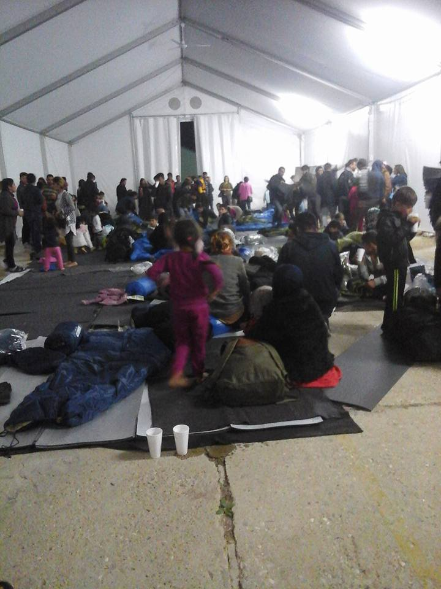
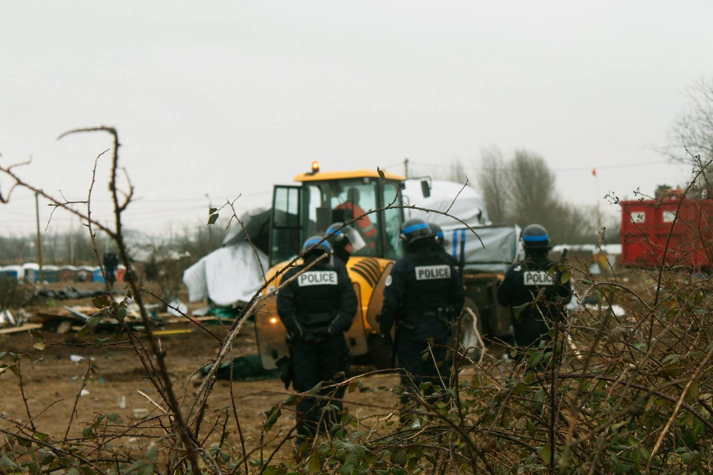
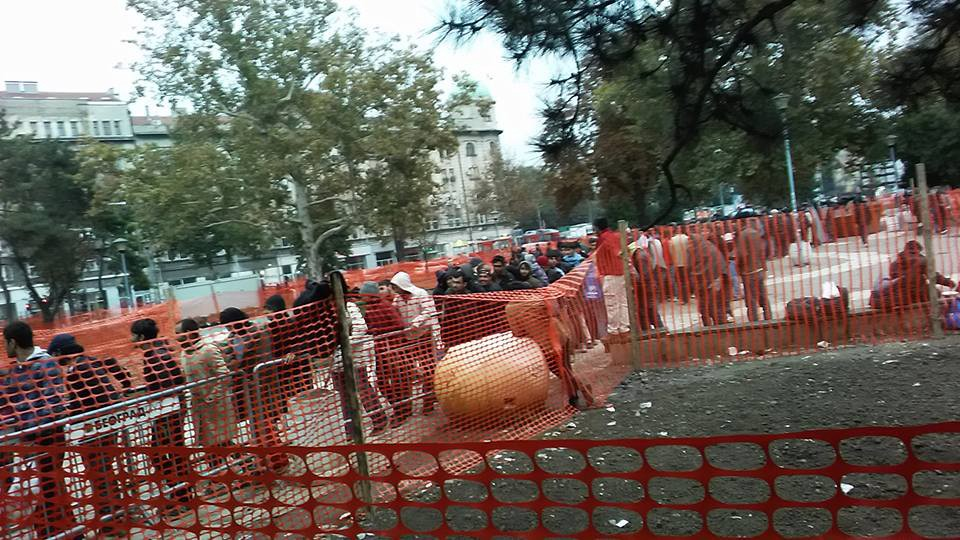

### AYS Digest 12\.10 — _515 people have arrived on Samos since beginning of October_

_515 people have arrived on Samos since beginning of October — 2,089 refugees are on Samos despite capacity for only 850\. Calais eviction could be postponed by a week\. Concerns emerge over lack of plan for child refugees after Calais eviction\._

Arrival in Lesvos\. Photo by The Worldwide Tribe
#### Greece
### 515 people have arrived on Samos since the beginning of October

Mosaic in Lesvos\. Photo by the Dirty Girls of Lesvos

162 people were registered up to 7:30am this morning — 22 in Lesvos, 38 in Chios and 102 in Samos\. Samos is now at 245% of its capacity with 2,089 guests and is quickly becoming one of the busiest islands in terms of arrivals, with 515 people arriving since the beginning of October, compared to 436 in Chios and 127 in Lesvos\. One sixth of this year’s total arrivals in Samos took place this month alone\.

In Chios, were no further formal shelters are available, new arrivals are given tents provided by the Norwegian Refugee Council \(NRC\) and are forced to sleep on the beach\. Hosting capacities will have to be expanded rapidly on Samos to prevent a similar situation\. Given

Given the pace of arrivals, [Samos Volunteers](https://samosvolunteers.org/) needs additional long\-term volunteers and donations, in particular men’s clothes, adult shoes and school items\.

According to volunteers, one boat with 42 people reached Chios and one boat with 38 people reached northern Lesvos today\.
### Refugee camps on Aegean Islands at 200% capacity

In the daily summary of refugee flows, the UNHCR accomodation places were shifted from the islands’ capacity to the one for UNHCR, mathematically dropping the official capacity of the islands from 7,903 to 7450\. With this change, there is now close to the double the refugees, as there is capacity in the camps\.

Movie night in Greece\. Photo by Northern Lights Aid

The number of refugees in Cherso and Nea Kavala again dropped by a hundred people each, while 68 refugees were transferred to Filippiada\.

Arrival of refugees in Filippiada
#### France
### Calais evacuation could be postponed by a week

Calais\. Photo by the Worldwide Tribe

[Le Monde](http://www.lemonde.fr/societe/article/2016/10/12/les-associations-deposent-un-refere-contre-le-demantelement-de-la-jungle-de-calais_5012664_3224.html#AWwSDK0tx1FVB7Cq.99) believes the Calais eviction will be postponed to the 24th of October, saying the French government wants to convince British authorities to accept more minors and hopes to create new reception centres, as the difference between existing space in the “welcome and orientation centres”\(CAO\) and the number of refugees counted in Calais is very small\.

[Liberation](http://l.facebook.com/l.php?u=http%3A%2F%2Fwww.liberation.fr%2Ffrance%2F2016%2F10%2F11%2Fcalais-le-demantelement-de-la-jungle-une-operation-tres-delicate_1521245&h=IAQHOx8Hz) reports that 7,000 new places have been created in these centres according to officials, while [France TV Info](http://www.francetvinfo.fr/france/nord-pas-de-calais/migrants-a-calais/moins-de-5-700-migrants-vivent-desormais-dans-la-jungle-de-calais_1868663.html) says that police counted 5,684 refugees and 6,486 when using a “declarative method”, meaning that police relied on refugees themselves to tell them how many people live in each shelter\.

A source within the Ministry of Interior tells Libération, “we do not know whether we will be ready \(for the evacuation\) by the 17th of October” but the paper insists the camp’s evacuation will take place in the last two weeks of October\.

Local newspaper [Nord Littoral](http://www.nordlittoral.fr/accueil/jungle-le-demantelement-reporte-au-24-octobre-ia0b0n351454) also says that several policemen were initially prohibited from taking vacation days next week, but have finally been authorized to do so, indicating that the evacuation could be delayed by a week or more\.

Le Monde adds that associations have launched a petition in court, asking for the protection of the Jungle’s inhabitants and the suspension of the camp’s evacuation\.

Many refugees are expected to remain in the Calais region despite the camp’s evacuation, wishing to join the UK or fearing deportation to other EU countries according to the Dublin regulation if they join official registration centres\.
### Concerns emerge over plan for child refugees after Calais eviction

[The Guardian](https://www.theguardian.com/world/2016/oct/11/calais-doubts-raised-over-accuracy-of-child-refugee-censuses) says concerns have emerged over the accuracy of the first official attempt by “France Terre d’Asile” to find and register child refugees in Calais\. The paper reports several children said they had not been asked for their names, while Help Refugees and L ’Auberge des Migrants were not consulted, despite preparing a detailed census of the camp — the “France Terre d’Asile” census took only two days, while the Help Refugee census is taking ten days\.

Later today, “France Terre d’Asile” said it had identified nearly 1,300 unaccompanied minors in the Jungle, with 95% of them wishing to go to the UK and 40% having family there\.

Help Refugees has expressed its worries about what will happen to unaccompanied minors after the eviction, as no plan has been prepared for them — unaccompanied minors can not join the “welcome and orientation centres” and the French government’s strategy so far seems to rely as much as possible on the UK taking in these kids\.

Help Refugees also worries that they could go missing, since 129 children went unaccounted for after the last eviction\.

_The easiest way to help and make sure this does not happen again?_

Support the “Phone Credit for Refugees” project, that helps keep unaccompanied children safe and connected\.

#### Serbia
### Over 1,000 refugees sleep in the streets of Belgrade

IOM says some 4,992 migrants were stranded in Serbia as of the 5th of October, while UNHCR counted 5,800, including over 1,000 people sleeping in the streets of Belgrade\.

The number of people sleeping rough in Belgrade could be much higher than official UNHCR numbers, as the Miksalište centre, which provides food, clothing, medical and psychological help for refugee families, says that today alone, 26 adults and 382 children used their services\.

Distribution of 600 meals in Refugee Aid Sebia\.
### 121 men transferred to Presevo while volunteers report push\-backs from Presevo to Macedonia

As we reported yesterday, systematic push\-backs of people from Presevo camp have been confirmed by both Serbian and Macedonian volunteers\. Refugees who have been locked up for months in Presevo are allegedly being returned to Macedonia without legal procedure, in groups of 30–40 people per day\.

Today, 121 men, including 25 minors, were transferred from Subotica to the Presevo Reception Center\. By the end of this week, the new Bujanovac centre will open in a former factory and will host families from Presevo\. Presevo will then hold largely single males and those refugees that Serbia calls “economic migrants”\.
#### Germany
### 579\.000 asylum applications still pending

[_FAZ_](http://www.faz.net/aktuell/politik/fluechtlingskrise/fluechtlingskrise-213-000-asylsuchende-kamen-2016-bislang-nach-deutschland-14477848.html) reports that in the first three quarters of 2016, 213\.000 asylum seekers came to Germany compared to 890\.000 in 2015\.

More than 660\.000 applied for asylum in 2016 until the end of September, 117% more than during the same period last year — the majority of those applying for asylum this year came to Germany in 2015\.

The process is still very slow and by the end of September there were still 579\.000 pending applications — 100\.000 more than during the summer\. However, in the first nine months of 2016, 462\.314 applications have been processed, 165% more than during the same period last year, and the last September week was the first one with more closed than new applications\.
### Interior Minister de Maizière aims to tighten Germany’s asylum rules\.

[DW](http://www.dw.com/en/de-maiziere-seeks-to-further-limit-asylum-exceptions/a-36019931) says new legislation would establish new rules for the deportation of migrants who have broken German law and who pose a significant danger to the public, but have been able to obtain waivers allowing them to remain in the country\. The paper report that, as of August 31st, there were 210,029 migrants in Germany who were required to leave the country, of whom 158,190 had been granted some kind of waiver allowing them to stay in the country temporarily\.

_Converted [Medium Post](https://areyousyrious.medium.com/ays-digest-12-10-515-people-have-arrived-on-samos-since-beginning-of-october-df6721dede02) by [ZMediumToMarkdown](https://github.com/ZhgChgLi/ZMediumToMarkdown)._
