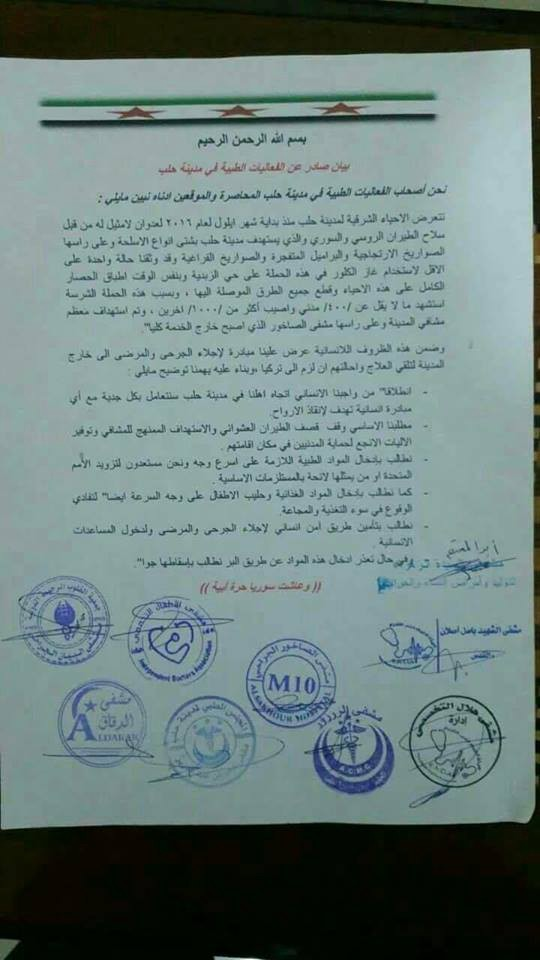

### AYS NEWS DIGEST 13/10 — “EU\-Turkey Deal 2\.0” with African states? A no\-go\.

A man displays the phone numbers of his loved ones which he has written on his shirt so that they may be informed of his death\. Photo Credit: MSF Sea
#### Feature

In the midst of German Prime Minister’s Angela Merkel historic trip to North Africa to address the problem of Mediterranean crossings, the Interior Ministers of EU countries are gathering in Luxembourg to discuss the flow of refugees from Africa to Europe, namely to Italy\. Merkel has offered military and financial aid \(read: bribes\) to Ethiopia, Mali, Niger, Nigeria, and Senegal in exchange for halting immigration, while the German Interior Minister Thomas de Maizere has called for a new solution to the problem; those who are rescued at sea ought to be taken to centers in North Africa while their case for asylum is studied\.

> _“People who are rescued in the Mediterranean should be brought back to safe accommodation facilities in northern Africa… Their need for protection would be verified and we would put into place a resettlement to Europe with generous quotas, fairly divided between the European countries… \[And\] the others have to go back to their home countries\.”_ 

In other words: EU\-Turkey Deal 2\.0\.

The contradictions of such a plan could not be more obvious\. Firstly, where would such centers be established? The most likely place of settlement would be Libya, the departure point for most refugees who test fate by making the crossing which has killed tens of thousands of people\. But how would Libya, whose government is currently embroiled in a civil war against various groups, be a safe place for the hundreds of thousands of people who would ultimately be returned under such a program?

Secondly, How would Europe ensure humane conditions in such North African camps when it can’t even secure decent conditions within EU countries? How would processing be done in a timely manner when the system in Europe is so over\-congested? How could this plan work when it presumably requires action by the Libyan government, currently embroiled in war, to limit departures in the first place?

Thirdly, assuming that the system is as fair and just as Mr\. de Maizere makes it out to be, how would the EU ensure that countries take up their fair burden when several countries within the EU are in open revolt against the quota system?

Why does Europe insist on implementing convoluted systems which ultimately do much to harm the refugees when the end\-result is so blatantly obvious? The deaths caused by the crossing could easily be avoided with changes to the Dublin Accords, which would allow asylum seekers to access safer means of transport\. And yet, EU officials continue twiddling their thumbs, ejaculating empty words bemoaning the tragedy of deaths which could easily avoided\. Refugees need safety, something they’re not going to get while trapped in a camp in a war\-torn country\. If the system continues to be as slow an inefficient as it currently is, asylum seekers will be much better off in the safety of European countries\.
#### Syria
### Syrian government agrees to UN aid plan\.

The plan will cover 25 of 29 designated besieged and hard to reach places, but Aleppo notably isn’t among them\. The government is dead\-set on retaking the rebel\-occupied eastern Aleppo districts, and has an interest in keeping aid out, as demonstrated by its criminal bombing of an aid convoy during the short\-lived ceasefire\. The rebel\-occupied districts are home to 275,000 people, and supplies are running dangerously low\.
### Doctors in Aleppo have released a letter asking for medical airdrops\.

As the Syrian regime’s siege around rebel\-occupied areas in Aleppo tightens, all kinds of goods are difficult to come by\. Hospitals and clinics are in especially bad shape, as they are regularly targeted by Russian and Syrian airstrikes and the shortages\. As such, if the regime does not weaken its grasp, other means of delivery will be necessary\.

#### Greece
### Refugees are increasingly resorting to making a land crossing from Turkey to Greece\.

As fall and winter weather approaches, police say the number of refugees and migrants trying to get across Greece’s northern land border with Turkey is growing\. Hundreds of asylum seekers have continued attempting to cross the frontier during the past several weeks despite authorities recently breaking up a smuggling ring on the Greek side and arresting 70 people\. Much less dangerous than the sea\-crossing from Turkey to Greece’s eastern Aegean islands, many asylum seekers have been apprehended after walking across the shallows of the Hebrus River, which marks the Greek\-Turkish border\.
### 93 appointments to take place at Piraeus have been rescheduled\! If you are supposed to come in on December 12, check your status at [www\.search\.rescueapp\.org](http://www.search.rescueapp.org)
### Information for people applying for relocation together with others\.

The following helpful information was posted on Facebook:

“If you want to be relocated together with people who are not your core family members \(“core family” means your husband, wife or minor children\), it is important to ask at your interview for your cases to be linked\. You can even ask to be linked with someone who is not officially your family, such as your fiancee \(religious marriages are not recognised by law\), your partner or someone you are looking after\.

When you finish your “full registration” interview with the Asylum Service, you will get a new white card with a CASE NUMBER, which will replace your registration number\. If your interviews are on different dates, the person whose appointment is first should give their case number to the others who have later appointments; they must give the case number to the Asylum Service at their appointments\. This is important even if you are core family\. If possible, it is best to take printed copies of the other people’s white cards\. Do not take their original white cards, as this is not allowed and may cause problems\.

If — after you have all been interviewed — you have the same case number as the others, then you will definitely be processed together as one case and will not be split up\. If you have a different case number, it does not mean that your cases are not linked\. As long as you ask to be linked and give the correct case numbers, your cases will be linked\.

Please note: Being linked does not guarantee that you will stay together\. You may ultimately not end up in the same country\. Despite this, it is still very important to ask to be linked\.”
### To those in need of accomodation

UNHCR will make their accomodations available to needy persons starting from next week\. Please also refer to [EKKA](http://www.ekka.org.gr/EKKA!show.action?lang=en) \.
### Numbers

A total of 160 refugees have arrived on the islands today\. 72 of them on Lesvos, 43 on Chios, and 45 on Samos\. Additionally, 4 volunteered to be returned, bringing the monthly total to 23\. There have been no deportations to Turkey this month\.

With the arrival of the new refugees, Lesvos has surpassed 6000 guests \(6,044\) and is at 172\.68% of its capacity\. The capacity of the UNHCR accommodations on the islands \(which has been shifted in the paragraph yesterday and is 558\) is now added to the total which makes a total of 8008 guests and decreases the total capacity of the islands below 200%\.

“Official structures” capacity has also been raised from 64,160 to 65,790, an additional 1,630 places\. This comes as a result of the UNHCR, which increased available spaces from 12,583 to 13,655 on the mainland, an increase of 1,072 \(it should be noted that these facilities currently only host 8,515\)and the aforementioned 558 on the islands\.

Milos has been deleted from the islands\. It was the western island with 111 arrivals from North Africa earlier this week\.

As always, detailed numbers may be found [here](http://media.gov.gr/images/prosfygiko/REFUGEE_FLOWS-13-10-2016.pdf) \.
### InterVolve is seeking donations\!

In Softex, there are four expecting mothers who will be giving birth soon\. With winter approaching, they are in need of help\. You may contribute [here](https://fundrazr.com/718SN9?utm_campaign=new-campaign&utm_medium=email&utm_source=05-2016) \.
#### Serbia
### UNHCR releases report on Serbia\.

The report may be accessed [here](http://data.unhcr.org/mediterranean/download.php?id=2057) \. Among other things, it states that 6,300 refugees are currently in Serbia\. 80% are being accomodated in government facilities, the rest are in asylum centers and reception centers\. Around 1,000 spend the night in the Belgrade city center\.
### Hot Food Idomeni calls for donations\!

The group is now in charge of hot meal distribution in Mikaliste, and they need your help as the number of refugees in Belgrade steadily grows\. Currently there are over 500 people depending on Mikaliste’s services\. Please consider donating by going to their [Facebook page](https://www.facebook.com/Hotfoodidomeni/) \.
#### Italy
### Italy has rebuked other EU members for shirking on their responsibilities\.

The other countries are not doing enough to take their fair share of refugees, according to Italy\. In just the first half of October, 10,000 people have arrived in Italy, bringing the total number of refugees in the country to 470,000\. Only 13,000 of the 39,000 refugees to be relocated have been moved\. The Italian PM Matteo Renzi called for funding to non\-cooperating countries to be cut\.

_Converted [Medium Post](https://areyousyrious.medium.com/ays-news-digest-13-10-eu-turkey-deal-2-0-with-african-states-a-no-go-764bd49751af) by [ZMediumToMarkdown](https://github.com/ZhgChgLi/ZMediumToMarkdown)._
