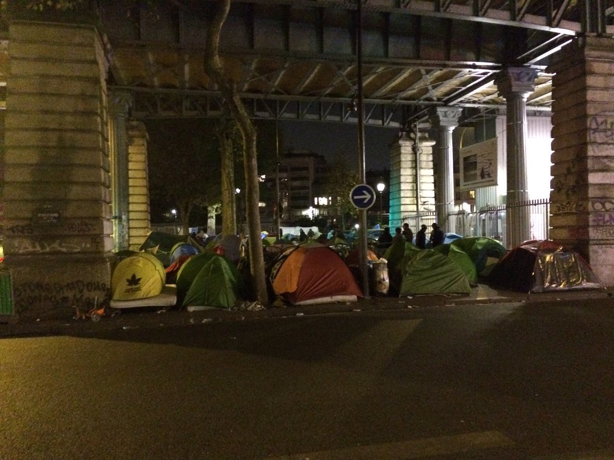
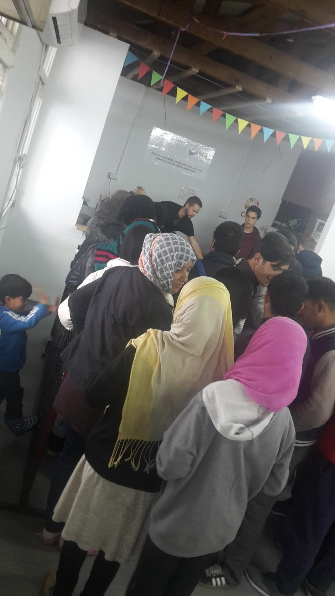

### AYS NEWS DIGEST 14/10 — Manipulation and confusion for refugees on both sides of Europe

> October 14 — new date set for the demolition of the Jungle; UNHCR supporting the eviction and closing of the Jungle, while also raising fears of child trafficking; Britain expected to take only around 300 children in total; aid delivery stopping soon due to fear of demonstrations; protests over Calais occurring in the UK as well; temporary Paris homes for refugees destroyed; warnings of false information spreading 

](assets/a5abdb76ccba/1*vXpDjNxnMRcShyvKdP_TAg.jpeg)

Photo: [Nima Y\.](https://www.facebook.com/nyagphotos/)
#### FRANCE
### CALAIS

The newest date for the begining of the evacuation of the Calais Jungle is Monday, October 24, according to some [sources](http://www.lefigaro.fr/actualite-france/2016/10/14/01016-20161014ARTFIG00136-jungle-de-calais-une-evacuation-a-haut-risque.php#xtor=AL-202) \. Despite increasing information from the field, the French state still insists on withholding any official confirmation of the date and details of the evacuation\. Nevertheless, media and public sources claim that dozens of so\-called Welcome and Orientation Centres \(CAO\) in all parts of France are preparing will provide around 7000 places to lodge those currently staying in Calais\. The whole process is supposedly organized so that the people, although in fact free to move, are supervised and accompanied at all times\. Around 3000 police officers will take part in the operation\. Among other risks and concerns around the evacuation of the Jungle, there are signs of increased efforts to illegally cross into the U\.K\., with reports of a higher than normal number of smugglers lurking around the exhausted, desperate and confused Jungle residents\.
### Although others worry about closing, the UNHCR believes it’s for the best

Many NGOs, media sources, and individuals who have been working in Calais, have expressed their worries over the evacuation of the Jungle\. The [UNHCR](http://www.unhcr.org/5800a2024.html) , however, openly and with no reserves welcomes the anounced closing, as they say, “with the camp population to be moved to centres where better help can be provided\. This is welcome\.” They also urging the French government to further increase the number of places\. “An additional 20,000 places would ensure that all asylum seekers and refugees have adequate accommodation while their claims are processed\.” It remains to be seen whether it is realistic to believe the French authorities would countenance making extra places available for new arrivals, given the challenging current situation and deeply divided opinions of the French public\.

As for the results of the evacuation, surely the UNHCR is well aware of the complexity of motivations and reasons behind many of the life stories of Jungle residents\. Thousands have now been waiting for months and even years there, living in the most sincere conditions, who have been patiently waiting and hoping in the most severe conditions, while constantly ignored, discouraged and manipulated from all sides\. Too often we have seen proposed “solutions” whose real intentions are not to help these people, but rather just to provide better statistics for big NGO’s and allow the government to clear the area\.
### Many talks — who will take the responsibility of the children?

France Terre d’Asile [has urged](http://www.nordlittoral.fr/calais/jungle-de-calais-les-mineurs-iront-ils-dans-les-conteneurs-ia0b0n352098) the officials to take responsibility over solving the question of security and care for the unaccompanied minors of Calais, the most vulnerable group of Jungle residents and the group that will surely be most affected by its upcoming dismantlement\. French, Belgian and British children’s rights advocates have pushed to allow unaccompanied minors to stay in the so\-called provisional welcome centers \(CAP\), at least on a short\-term basis\. The CAP, white containers set up on\-site, have a total capacity of 1,500 and could thus provide protection for all 1,297 of these vulnerable children\.

Terre d’Asile met with the prefect of Pas\-de\-Calais to discuss this situation and remind the government that that providing safety and daily support for these young people also requires financial resources\. While child welfare advocates maintain that the CAP are the only plausible solution for protecting unaccompanied minors in the Jungle, the prefect has so far declined to either approve or reject the proposal\.

Meanwhile, the UNHCR has raised fears of child trafficking in the Jungle \(while still supporting its closure and the eviction of its residents\) \. Save the Children is r [eportedly](https://www.theguardian.com/world/2016/oct/14/uk-volunteers-with-donations-for-calais-denied-entry-to-france?CMP=share_btn_fb) working with the Refugee Youth Service to distribute a backpack containing a coat, mobile phone and emergency information to several hundred children over the weekend\. Phones are given to allow children to make emergency calls and phone home\.

Under EU\-wide regulation, asylum claims must be made in the first safe country a person reaches, but children can have their claim transferred to another country if they have family members living there\. The Dubs Amendment to the Immigration Act, originally put forward by Lord Dubs, requires the government to arrange for the transfer to the UK and support of unaccompanied refugee children from Europe\.

> The British State Secretary stressed to her French counterpart that children eligible to come to the UK should be moved out of the camp before the demolition process starts\. 

Britain is [expected](http://www.bbc.com/news/uk-37663125) to take more than 300 children in total\. This figure, however, contradicts with the number of children that French officials expected would be reunited with their family members in the U\.K\., when evacuation plans for the Jungle were initially proposed: 100 children\. Each of these totals, in turn, differs from both current French projections \(500 children\), as well as the UNHCR’s estimated number of children who are eligible for resettlement \(200\) \. This tangle of numbers illustrates how political rhetoric, no matter how well\-intentioned, cannot be the sole source for solving complex problems\. Without concrete, on\-the\-ground action, complications inevitably arise — in this case, up to 500 at a time\.
### Growing petitions and protests over the fate of Calais

Despite the efforts to silence those who oppose the demolition of the Jungle and the relocation of its occupants, several popular initiatives have sprung up on the refugees’ behalf\.Concerned citizens in the U\.K\. and elsewhere are demanding that the United Kingdom and France share the responsibility over solving the matter, particularly by providing safety and protecting children refugees\.

[Care4Calais](https://www.facebook.com/care4calais/posts/1309403699092584) has pushed for renewed attention to Lord Alf Dubs’s petition on behalf of the children of Calais, urging people to sign and force the British Parliament to formally discuss implementation of the Dubs Amendment:

> With the forthcoming evictions imminent we are deeply concerned for the safety of the 1022 unaccompanied children\. Earlier this year when the southern part of the camp was demolished, a total of 129 children went missing\! We cannot let this happen again\! 

> We hereby call on the UK government to bring these children to the UK NOW\! Please join us and let your voices be heard\! 

You can find the original petition [here](https://petition.parliament.uk/petitions/128833) \.

So far, 82,100 people have signed the petition, bringing it nearer to the 100,000 signatures required to trigger it being considered for debate in Parliament\. The UK Home Office has already issued a reply, saying in part that:

> We will consult relevant NGOs, UNHCR, UNICEF and Member States on how best we implement this legislation\. The very nature of this amendment means we must take the time to consult others before bringing final proposals on how to implement\. 

We hope those who really care about refugees are deemed “relevant” in the eyes of the British government\.

At the same time, many Brits have turned out for the [demonstration](http://www.oxfordtimes.co.uk/news/14803641.Protestors_rally_in_central_Oxford_against_Calais_Jungle_refugee_conditions/) in Oxford this Friday to protest the ‘horror’ faced by refugees in the Calais Jungle camp\.

Refugee rally in Oxford — \#DubsNow \(Photo: Twitter — @CassiopeiaKnits\)
### Volunteers bringing milk, sugar, coffee, tea, sleeping bags and tents are “thought to represent a danger to public order or internal security”

This Friday morning, we received a number of accounts of volunteers being stopped while trying to bring aid to Calais\. Even those who were eventually allowed to enter were first stopped and questioned, very likely due to rumours about upcoming demonstrations in Calais against the Jungle’s dismantlement\.

Despite the circumstances, volunteers at an aid warehouse in Calais are making emergency packs for refugees, so that they have essential supplies when they are evicted from the camp later this month\. Donations are still very much welcomed\.
### Paris

An evidently well\-planned and highly organized dismantling and evacuation of the makeshift camps in the Jaurès area took place throughout the day was this Friday\. Afghan refugees witnessed their tents and belongings being swept from the area, the BAAM team reports\.

According to French volunteers, sometimes these people are given lodging at one of the reception centres, but lately, they are being taken to the police stations instead\. Afterward being officially processed, we are told, they are either released back on the street or taken to a detention centre and given the option to leave France\.

Volunteers are collecting warm clothes, sleeping bags, tents and other things that might help these people stranded on the streets, as the weather gets colder by the minute\.

Paris city centre \(hoto credit: Twitter — Mark Dummett\)
#### SERBIA

[Miksalište](https://www.facebook.com/RefugeeAidMiksaliste/) reports welcoming 425 people who arrived today: 10 men, 32 women and 383 children\.

Hot Food Idomeni team provides hot meals on daily basis for everyone \(Photo: Refugee Aid Miksalište\)
#### GREECE
#### Arrivals

Three boats carrying 70 people landed on the north\-east coast of Lesvos Friday\. Among them there were 18 women, one pregnant woman and 19 children\. Everyone was safe, thanks to the excellent work of the rescue teams\.

According to the official registration, there were 89 newly registered arrivals in Greece: 10 on Lesvos and 79 on Samos\. 58 people were deported, with 16 voluntary departures\. Since the Turkey\-EU deal in March, there has been 701 deportation officially registered by the Government, with 39 voluntary departures reported this month\.

In the camps across the mainland, Vagiochori’s population has dropped by 52 people, while Elefsina has 90 new residents\. At Filippiada refugee camp, families have begun to receive hotel accommodation after their interviews, reducing the total population in the camp\. Around 70 Kurdish people who arrived at the camp two days ago after reaching to the Peloponnese by boat and have left for Athens in a private arrangement\.

 \)](assets/a5abdb76ccba/1*S47xfTLPdvwdURAltbLTqQ.jpeg)

Filippiada camp \(Photo: [Filippiada Camp News](https://www.facebook.com/filippiadacampnews/) \)
### Want to help?
#### Athens — The Schoolbox Project

Calling all credentialed teachers, art therapists, occupational therapists, psychologists, musicians, social work professionals, 1:1 educational aids , translators, sports coaches and basic volunteers with experience with children\! We are a mobile schoolhouse and art and play center that delivers all services through a lens of trauma informed care\. We we currently based in Athens\.

Note that you should be able to stay 2–4 weeks and you must be English speaking\. For more information and applying, please write to: schoolboxvolunteers@gmail\.com

#### Warning

We are forwarding [a text](http://www.beirut.diplo.de/Vertretung/beirut/en/00__Startseite/Wichtige__Hinweise__English.html) from the German embassy in Beirut, explaining some of the problems that false information causes when circulated among the refugees by misleading and manipulative sources\.

Please remember that you can rely on information coming from the [Refugee Info Bus](https://www.facebook.com/RefugeeInfoBus/?fref=ts) and [Mobile Info Team for refugees in Greece](https://www.facebook.com/mobileinfoteam/?fref=ts) \.

> **To Put The Record Straight** 

> Concerning the recent rumours this Embassy would like to clarify: 

> Germany is NOT sending ships to Lebanon or Turkey to take refugees\!
 

> Germany has NOT decided upon a new refugee program\.
 

> The German Embassy does NOT accept applications for asylum\. 

> These are false rumours, instigated by smugglers, illegal networks and misinformed media\. Please note: Smugglers do lie\. It is not in their interest to inform refugees about the existing problems\. Smugglers are NOT reliable sources of information about the refugee situation in Europe\. 

> As of 5 January 2015 new and stricter regulations have been established for Syrian nationals to enter Lebanon\. Travellers from Syria are urged to check the available information before commencing their trip \(for example at [www\.general\-security\.gov\.lb](http://www.general-security.gov.lb/) \) and should provide information about their intended travel to Lebanon in Arabic translation\. Also, long delays at the border should be expected\. Furthermore, the Embassy would like to point out that the new regulation is also relevant for persons who have already spent a longer time in Lebanon\. However, legally binding information can only be given by the Lebanese authorities\. 

> **Fraud Warning** 

> The German Embassy strongly advises caution in dealing with companies that claim to offer appointments for visa applications, visas without personal application at the Embassy or preferential processing of applications for additional payment of money\. 

> This Embassy does not work with external agencies\. Quite the opposite:
 

> \- Appointments can be made FREE OF CHARGE at the Embassy’s homepage at
 

> [www\.beirut\.diplo\.de/termine](http://www.beirut.diplo.de/termine) 
 

> \- The system will send a notification about the appointment together with information about the visa process automatically after the appointment has been made\.
 

> \- Every applicant needs to make an appointment in order to apply at the Embassy\. You will not be able to enter the Embassy to apply for a visa without appointment\.
 

> \- Applications can only be processed after all necessary documents have been provided by the applicant\. Please have all documents mentioned in the Embassy’s leaflets ready when you apply at the Embassy\. 

> Please be vigilant and check if any offer you are made may be a scam\. If you have suspicions, please report it to the police authorities\. 

> Should you use an agency in order to make an appointment, only this agency can answer further questions concerning cancellation or validity of that appointment\. 

> Caution: There has been information that so\-called ‘visa agencies’ use telephone rerouting systems in order to have the Embassy’s telephone number appear in their display\! This has to be considered an attempt at scamming applicants\. Please note: This Embassy will send ALL appointment notifications via e\-mail, even if the initial contact may have been made via telephone\. Only with an e\-mail\-notification can you be sure that the appointment has been really made\. 

_Converted [Medium Post](https://areyousyrious.medium.com/ays-news-digest-14-10-manipulation-and-confusion-for-refugees-on-both-sides-of-europe-a5abdb76ccba) by [ZMediumToMarkdown](https://github.com/ZhgChgLi/ZMediumToMarkdown)._
