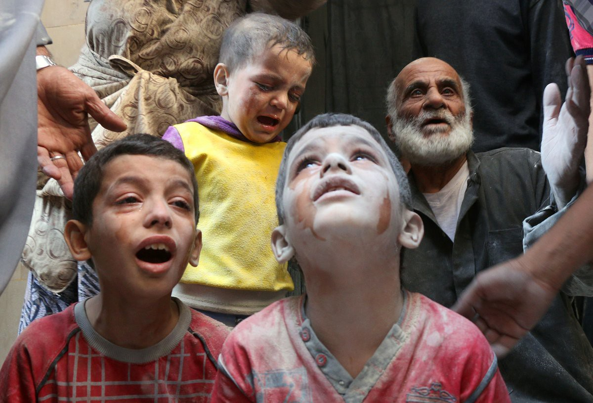
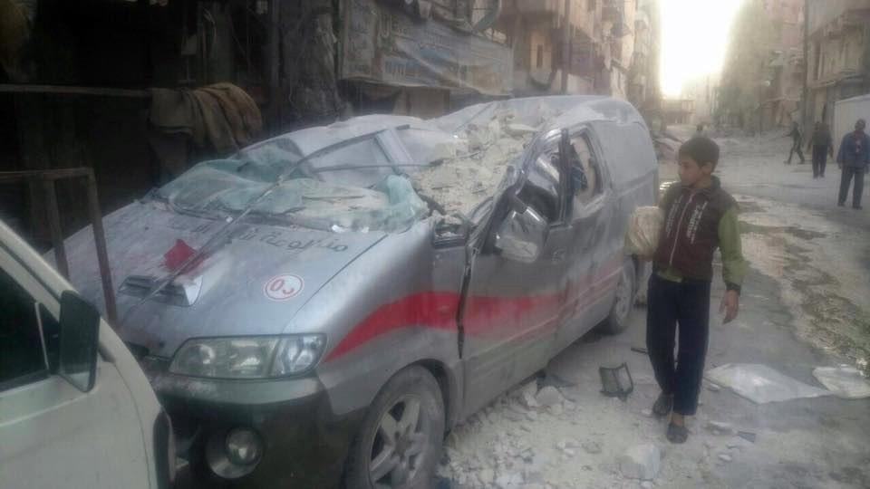
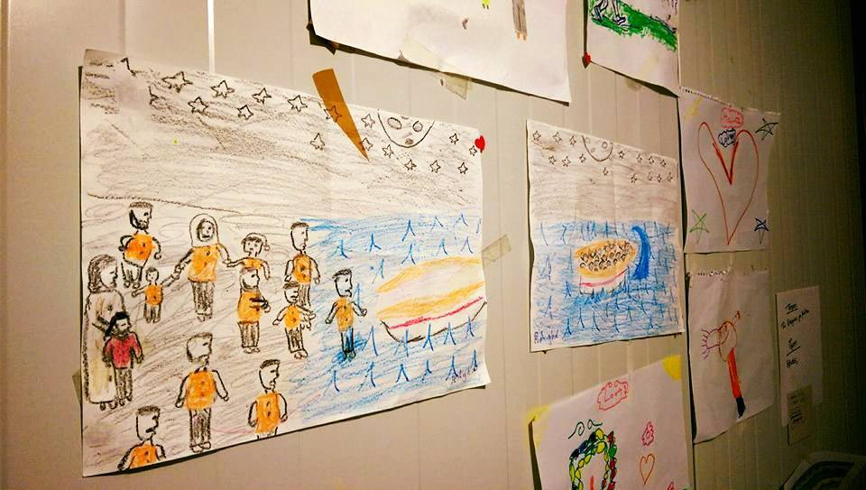
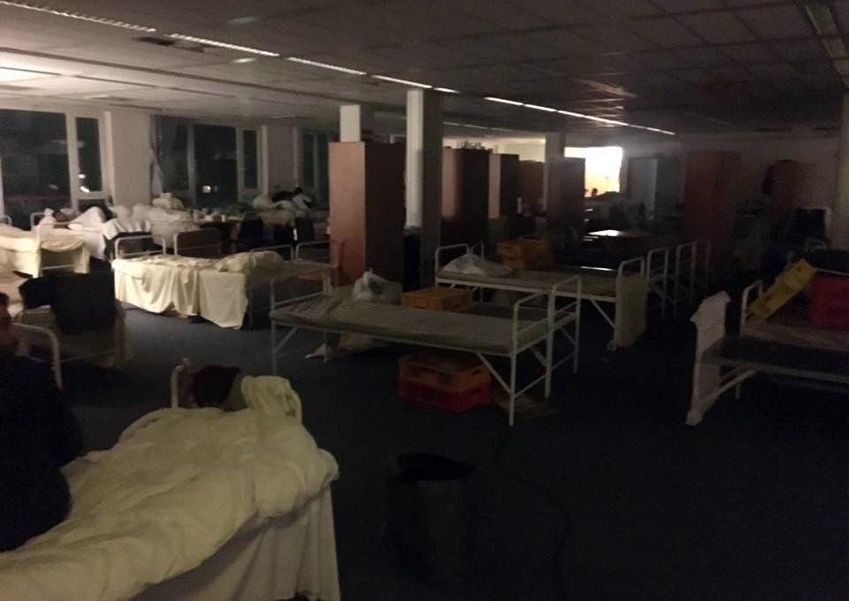

### AYS digest 15/10: Four hospitals and an ambulance bombed in Aleppo
#### MSF describes “the worst damage to health facilities so far”\. Womens centre on Chios needs funds, volunteers needed in Thessaloniki\. Landmines pose a lethal threat for the refugees who might try travelling through Bosnia\. Refugees evicted from the squat in Berlin\. Volunteers to load aid for Syria needed in Essex\.

**This photo of crying kids from Aleppo has travelled around the world today— will they still be alive tomorrow?**
### MSF describes indiscriminate bombing, “a clear turn for the worse” in rebel\-held eastern Aleppo

Airstrikes by Syrian and Russian forces have hit four hospitals in besieged east Aleppo in the past 24 hours, causing huge damage to one of them and injuring at least two doctors, [MSF reported](http://www.doctorswithoutborders.org/article/latest-attacks-eastern-aleppo-hospitals-leave-medical-care-shambles?utm_medium=social&utm_source=facebook&utm_campaign=social) \. The bombings also destroyed an ambulance run by Al Sham Humanitarian Foundation \(AHF\), that has provided free medical aid since 2011\. The ambulance’s driver was killed\. According to Directorate of Health, **only 11 ambulances were left in working condition in the city** after recent attacks and a lack of spare parts due to the siege\. A small number of basic vehicles for emergency transport of the wounded are run by volunteers and NGOs such as AHF\.

**AHF ambulance was destroyed and the driver killed in the Russian/Regime areal attack on October 14**

> “The indiscriminate bombing campaign has taken a clear turn for the worse\. One of the hospitals hit yesterday received huge damage\. It was a major trauma center that had been already hit three times in recent weeks\. The pace of attacks is suffocating what little capacity for medical care the health care system still has, in a city \[that\] is rapidly falling apart, day by day and hour by hour\. By damaging the few remaining places where lives can be saved, it is clear that Syria and Russia are squeezing the life out of eastern Aleppo”, says Carlos Francisco, Doctors Without Borders/Médecins Sans Frontières \(MSF\) head of mission in Syria\. 

According to MSF, the struggling health care system in besieged eastern Aleppo suffered its worst day yet on October 14\. The [Syrian Observatory for Human Rights](http://www.syriahr.com/en/?cat=26) described more attacks and deaths today, as Assad forces and their allies have advanced further and are now controlling blocks in Karm al\-Trab neighbourhood of the eastern Aleppo\.

**An average of 17 children have been injured _every day_ since the aerial bombing campaign resumed**

The latest destruction comes amid an intensification of the bombing campaign on the besieged rebel\-held parts of Aleppo, where **at least 62 people died and 467 people, including 98 children, were wounded between October 11 and 13** , according to reports obtained from the Directorate of Health and the Forensic Center of east Aleppo\. These figures might well be an underestimate, as many families bury dead relatives themselves, rather than bringing their bodies to overcrowded and understaffed hospitals\.

**According to data from the Directorate of Health, an average of 17 children have been injured _every day_ since the aerial bombing campaign resumed on September 23, following an all\-too\-brief ceasefire\.** This figure does not, however, take into account casualties registered in the past week, during which the bombing campaign has intensified\.

According to [Reuters](http://mobile.reuters.com/article/idUSKBN12F0PM?utm_campaign=trueAnthem%3A%20Trending%20Content&utm_content=58028bef04d3014cf0d96c65&utm_medium=trueAnthem&utm_source=facebook) , German chancellor Angela Merkel wants to get other European Union member countries to agree to step up sanctions against Russia because of its shameful role in the war in Syria\.
#### Greece

115 **new refugees were registered by the authorities today, including 70 on Lesvos, 41 on Samos and 4 on Chios\.**
### Lack of accommodation proves to be a chronic problem for refugee families who arrive to Athens

A large group of volunteers gathered at Humanitarian Bridges Initiative to feed and give blankets to homeless refugees around Omonia Square in Athens last night\. They have encountered two Kurdish families with 16 members who’d arrived from Kalamata near the Peloponnese\. They’d attempted to take a boat from Turkey to Italy but something went awry and they ended up in Greece after being at sea for 3 days\! They were exhausted and sleeping on the ground\. Volunteers have tried to find the accommodation for them, but have encountered the same problem we have reported in the previous digests: a chronic lack of space in hotels, hostels and squats in the city\. Thanks to the joint volunteer efforts, the family was taken care of and managed to get some rest, but many families and single refugees are still left to sleep on the streets as the official humanitarian response in Greece continues to fail them\.

**Volunteers keep searching the streets to identify and support most vulnerable refugees\. Photo: Norman Hering**
### Gender violence, lack of medical care and education identified as burning issues by 12 NGO’s in Greece

The Joint policy brief on the situation for displaced persons in Greece was issued by 12 NGO’s including Red Cross/Red Crescent, Save the Children and International Rescue Comitee\. They have identified gender violence, lack of the access to medical care and education as some of the burning issues for the refugees in Greece\. The entire document can be found [here](http://refugees.gr/en1/wp-content/uploads/2016/10/More-than-Six-Months-Stranded-What-Now-English-final.pdf) \.

> “All humanitarian responders should assume and believe that gender based violence, and in particular sexual violence, is taking place and is a serious and life\-threatening protection issue, regardless of the presence or absence of concrete and reliable evidence\. Despite this, however, **there is a significant lack of available safe spaces and support services on sites throughout Greece for women and girls generally, and survivors of gender based violence in particular** “, says the report\. 

### Athena Centre for Women needs urgent support\!

Athena Centre for Women led by Gabrielle Tan on Chios remains one of the few safe spots dedicated to supporting refugee women, many of whom have endured severe trauma and violence on their way to safety\. Athena’s daily work includes protecting women and children exposed to stabbings, suicides, attempted sexual assaults and rape\. However, they won’t be able to continue their valuable work if they don’t secure a steady flow of funds for their activities\. At the moment they are in an urgent need of support, so please follow [this link](https://www.facebook.com/actionfromswitzerland/posts/928111284000028:0) for more info and consider donating\.

**Drawings by a traumatized 12\-year old refugee who found support in Athena centre for Women on Chios**
### Volunteers needed to get shit done in the North\!

The Get Shit Done Team, currently operating in Northern Greece, have issued an urgent [call for volunteers](https://www.facebook.com/permalink.php?story_fbid=323000411407932&id=304001796641127) to to help with winterization of camps\. This includes building tent floors, drainage, water proofing building etc\. They have good machinery to help and a great workshop, located 20 mins from the centre of Thessaloniki and accessible by bus\. They also work in camps in and around Thessaloniki\. Their mission is very important, and they say no experience is needed, so please [contact them](https://www.facebook.com/The-Get-Shit-Done-Team-304001796641127/) on FB if you are interested\.
#### Balkans
### Landmines: a lethal threat for refugees who might attempt travelling through Bosnia and Herzegovina

 \.**](assets/b205b92435de/1*z2UnCkuTLz5_nF1EEEmJjQ.jpeg)

**Red colour indicates minefields left from the ex\-Yugoslavian war in 1990's\. Full map can be found [HERE](http://beta.bhmac.org/mapa.jpg) \.**

Ever since the borders have officially closed, refugees managed to find a way to travel via Kosovo, Macedonia, Serbia, Croatia and Slovenia\. Every now and then, we hear about alleged attempts to travel through Bosnia and Herzegovina\. If there are any refugees considering that route at the moment, we’d like to warn them about a lethal risk of the landmines that are left scattered around since the ex\-Yugoslavian war in the 1990’s\. We’re attaching the map of known minefields in a hope no one will have to use it in order to reach their preferred destination country\. Hi\-res map can be found [here](http://beta.bhmac.org/mapa.jpg) \.
#### Germany
### Refugees evicted from Bornitzstraße camp in Berlin, no electricity, food and water for those who stay

According to volunteer sources, 120 Syrian refugees are on strike in the Bornitzstraße camp in Berlin\. Journalist Doha Hassan, who visited the camp today, says the strike happened after camps administration banned food, water, toilets, and electricity\. They also changed the locks almost a week ago\. They wanted the refugees out of the camps despite the fact that they have legal status and that they are allowed to be in the camps in certain times\.

**Shameful conditions in the camp have turned worse in the wake of unofficial eviction\. Photo: Doha Hassan**

According to one of the volunteers, the refugees were asked to leave their shelter for another, which is described as crowded and offering even less privacy\. The announcement that they should move was not done in the official written form\. Instead, they have been told vocally to leave\. According to volunteers, the security and the camp workers have acted aggressively against 4 girls who refused to leave\. One young woman was allegedly physically attacked after the short quarrel\. The locks were removed even from the rooms where only women leave, leaving them with no way to keep their privacy and afraid for their their physical integrity\. At least one of the rooms from were electricity was cut out hosts young children\.
#### Great Britain
### **Samara’s Aid Appeal needs volunteers in Harold Wood \(Essex\) to receive and load aid for Syria\!**

Samara’s Aid Appeal needs volunteer help in Essex, on Monday and Tuesday next week, receiving and loading aid for Syria\. They will be receiving more than 1,000 boxes and relief items on Monday \(17th Oct\) at the Christian Hope International warehouse in Harold Wood\. They will then be loading a container there at 9AM on Tuesday 18th\. After they have loaded the container, they are expecting another half a lorry of aid to be delivered and will need some people to help us unload this into the warehouse which will be going out to the Middle East shortly after\. You can find more detailed information on their needs and the expected workflow [here](https://www.facebook.com/winterclothesappeal/photos/a.705181182886102.1073741827.704669776270576/1191619854242230/?type=3&theater) \.

_Converted [Medium Post](https://areyousyrious.medium.com/ays-digest-15-10-four-hospitals-and-an-ambulance-bombed-in-aleppo-b205b92435de) by [ZMediumToMarkdown](https://github.com/ZhgChgLi/ZMediumToMarkdown)._
