### AYS 16/10: Refugee family killed by a car in front of Oreokastro camp
#### Terrible car tragedy in one of the refugee camps in Northern Greece\. City Plaza mourns the drowning of one of their first residents\. Volunteers and donations needed in Greece, Serbia\. Alleged smuggler arrested after at least 18 deaths in Italy\. Clashes in Calais, still no solution for 1,300 children in the camp\.

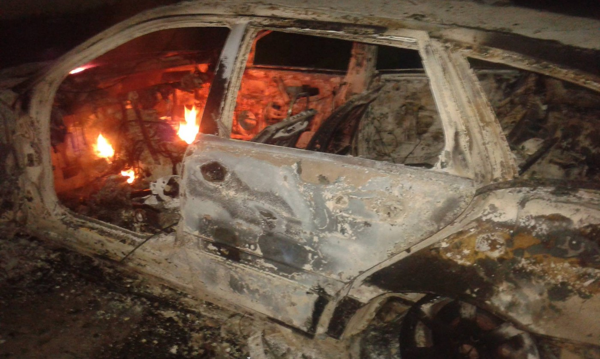

The car was set to flames after the tragedy\. We choose not to publish explicit photos of victims\. Photo: Abo Emar Alrajab‎
### At least two dead in front of Oreokastro camp, in a tragedy that ignited **righteous anger** and riots

We are deeply saddened by the tragedy that happened in front of Oreokastro camp tonight\. According to numerous witnesses on site, a refugee family was walking across the road in front of the camp when a car hit them, leaving two people dead and one in critical condition\. First reports, including the info from Team Humanity, say the mother and the son died on the spot, while the daughter was rushed to the hospital in Thessaloniki\. According to Greek press, three victims were residents at the Fessas camp in Oreokastro\. They were hit by the 76\-year\-old driver outside camp, who was held by the police\. Associated Press identified the victims as the 35\-year\-old Kurdish Syrian woman and her 10\-year\-old son\. The extent of the injuries of the third child is still unconfirmed, but it seems to be out of the life\-threatening danger\.

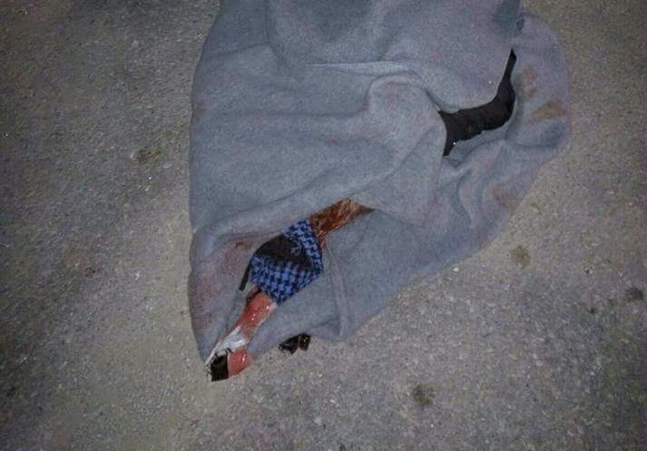

According to the first info, mother and son died immediately, while daughter was still fighting for her life\. Photo: TH

The tragedy ignited righteous anger among the refugees, who rushed to the site in the attempt to help the victims\. According to some sources, the ambulance was late to arrive, and the police allegedly refused to take the victims to the patrol car and transfer them to the hospital\. Tension increased rapidly, the car was set on fire, and the police allegedly responded by firing gas bombs to disperse the angry crowd\. Both refugees and volunteers have published the photos of the unrest that followed the tragedy\. Riot police rushed to the spot and clashed with the refugees, causing additional injuries\.

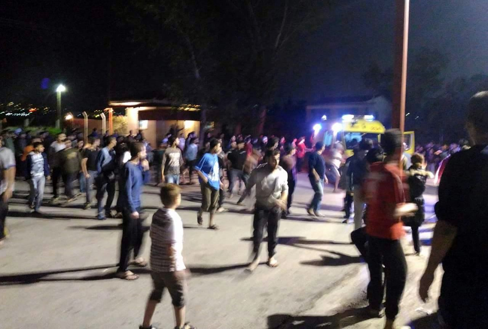

Righteously angry refugees clashed with the riot police int he wake of the tragedy\. Photo: Alaa Hasan

The road in front of the camp is described as very bad, with insufficient lighting and no signs that would indicate the speed limit\. Also, it seems there’s no clear warning about the close proximity of the refugee camp by the road\.

> “We spoke to NRC on plenty of occasions to fix the road but we were ignored, I blame NRC for all this, now we have 3 deaths in the camp but what would NRC or the GOVERNMENT will do about this\. We want changes for these people\. There are deaths every day but the world don’t see it”, Team Humanity said in their first [report](https://www.facebook.com/TeamHumanityDK/posts/692983050870708) , which included a shocking video of the crash site, in which people were still trying to bring the victims back to life\. 

These people fled unimaginable dangers in the hope of reaching safety\. Europe has failed them, leaving them in inhumane conditions of the refugee camp, prone to the dangers that took their lives in the end\. This shouldn’t have happened\. This is no way to treat victims of war, persecution or poverty\. They should have been able to reunite with their father and live peaceful lives in the country of their choice instead of being killed on the filthy road in Greece, where they were forced to stay due to international ignorance and neglect\. Someone needs to be held accountable for their deaths\.
#### In the focus: France
### Clashes between Calais residents and the police, volunteers prevented from approaching the site

Another violent clash between the riot police and the refugees happened in Calais, where refugees are preparing to leave the site they got to call home over the last months\. On Saturday, workers started erecting a controversial wall along the motorway leading to the ferry terminal\. A crane was deployed to the site to lift four\-meter\-high cement panels to prevent the refugees from blocking traffic and jumping onto trucks\. This action, along with the increased police presence and the uncertainty about the days to come, ignited the clash in which police used water canons and other means of oppression in the attempt to “pacify” desperate camps residents\.

[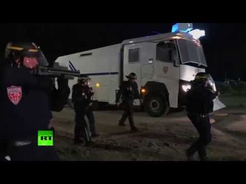](http://www.youtube.com/watch?v=wq11WxAu8oU)

With just over a week to go before the demolition day, many volunteers and international donors have rushed to Calais in the attempt to prepare its residents for leaving the camp\. For example, [Care4Calais](https://www.facebook.com/care4calais/) had over 100 volunteers this weekend, and has received 30 donation deliveries a day\. However, there’s still a need for external battery chargers, sleeping bags and other items that will help the refugees after they leave the camp\.

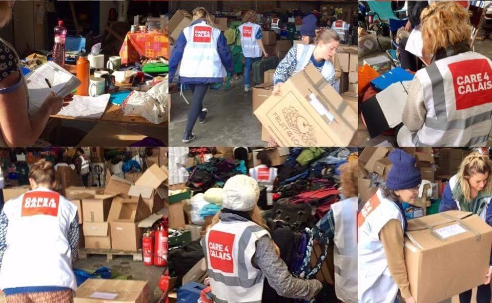

Donation are poring in, but the needs are still high as the demolition day approaches\. Photo: Care4Calais
### First group of child refugees from Calais arrive in Britain — what will happen to the others?

According to [BBC](http://www.bbc.com/news/uk-37663125) , “a significant number” of child refugees from Calais will be reunited with their families in the UK in the following days\. The Telegraph reports the first group of unaccompanied children from the Calais “Jungle” have travelled to Britain for resettlement with relatives today\.

> “Five Syrian minors and one Afghan travelled to the United Kingdom on Saturday\. Another 10 children are to follow on Monday, and 10 more on Tuesday\.”, an official at the Calais Prefecture said to the press\. 

Although six children arrived in the UK on Saturday from the migrant camp, with 24 more due over the coming week, it has emerged that the Home Office has not provided detailed plans about how it and the French authorities intend to protect minors before, during and after demolition\.

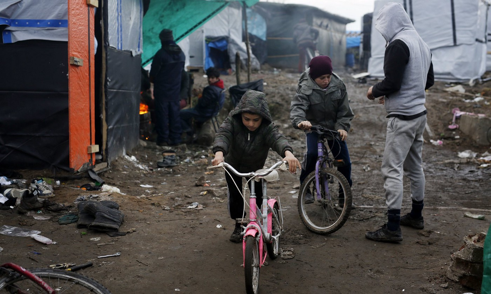

As many as 600 children \(out of the 1,300\) in Calais have the right to be reunited with their families in the UK\. Photo: AFP

This, however, proves many of them shouldn’t have been left in Calais in the first place, as they obviously had legal grounds to travel to UK and be reunited with their families\. According to the volunteers in the camp, there are up to 1,300 minors in Calais\. What will happen to the rest of them?

According to [The Observer](https://www.theguardian.com/world/2016/oct/15/home-office-in-court-for-failing-calais-refugee-children) , **as many as 600 minors inside the camp are eligible to come to Britain** \. It has also emerged that the Home Office has yet to produce any detailed operational plans setting out precisely how the remaining children will be transferred to the UK\.
#### Greece
### City Plaza mourns the death of one of the first Afghan refugees to come to the squat

On this sad day full of tragedies, refugees and volunteers of City Plaza community mourn the loss of Hamid Rezapour\.

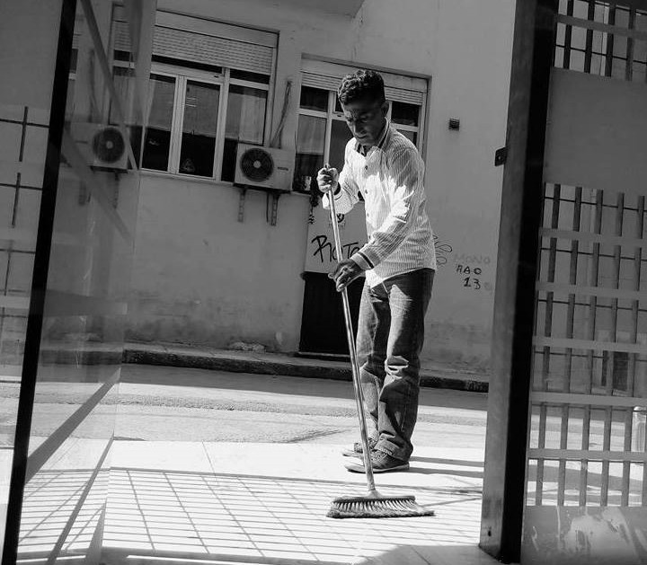

Hamid, who fled from Afghanistan, has drowned today at Elliniko beach\. Photo: City Plaza Hotel

> “Hamid, who drowned today at Elliniko beach, was among the first refugees to come to City Plaza\. Hard working, selfless and easy going, we all came to like him and admire him very quickly\. From war torn Afghanistan to the watery grave of the Aegean, he went through a lot, which did not tarnish his personality, however\. His untimely death fills us with emotions of frustration and despair\. Our only consolation is the fact that people like Hamid prove in practice that life can be a gift, an offering, and a desire to connect with the other, a journey which takes on meaning through the field of “we”\. We express our deepest condolences to the Rezapour family\. Farewell our friend\. We will not forget you\!”, wrote Refugee Accommodation Space City Plaza in their emotional statement\. 

#### Residents of Notara 26 are in need of:

Milk, sugar, cereals, tomato sauce, oil, rice, shampoos, shower gel, soap, toilet paper, brooms&mops, garbage bags, cleaning supplies, sponges, saucepans, frying pans, kettles and coffee pots\. If you can help and contribute with something from the list, please bring it to the squat on a Tuesday or Friday \(19:00–23:00h\) \. If these hours are not suitable for you, please [write to them](https://www.facebook.com/%CE%9A%CE%B1%CF%84%CE%AC%CE%BB%CE%B7%CF%88%CE%B7-%CE%A3%CF%84%CE%AD%CE%B3%CE%B7%CF%82-%CE%A0%CF%81%CE%BF%CF%83%CF%86%CF%8D%CE%B3%CF%89%CE%BD%CE%9C%CE%B5%CF%84%CE%B1%CE%BD%CE%B1%CF%83%CF%84%CF%8E%CE%BD-%CE%9D%CE%BF%CF%84%CE%B1%CF%81%CE%AC-26-645186555621294/?fref=nf) \.
#### Oinofyta camp refugees need fabrics

Oinofyta camp now has a sewing room\. The residents have asked for fabrics \(for example, jersey\) to enable them to make their own dresses and other garments\. Also needed are notions \(ribbons, zips, buttons etc\) \. If anybody has fabrics or notions or are able to purchase them, please let them know\.
### 130 refugees evicted from the building in Thessaloniki, volunteers need support to feed them

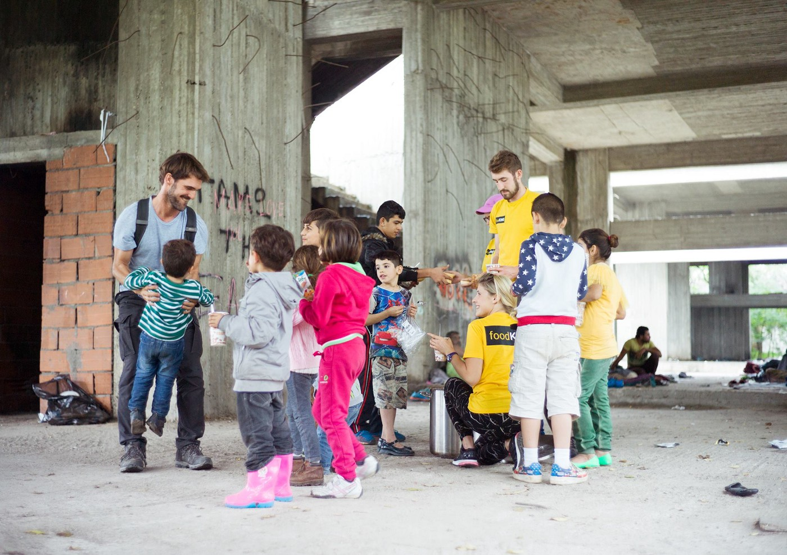

This morning more than 130 refugees were evicted from the abandoned building in Thessaloniki by the police\. They were vaguely instructed to go to one of the official camps across Northern Greece\. Many of those camps are full and not accepting new refugees and many refugees stayed in different parts of the city\. This made the meal distribution done by [foodKIND](https://www.facebook.com/foodKIND/posts/1841355749419017?hc_location=ufi) , [Team Bananas](https://www.facebook.com/TBananita/) , [SOUL FOOD Kitchen](https://www.facebook.com/dirtybunch/) , [IHA](https://www.facebook.com/iha.help/) , [Refugee Biriyani & Bananas](https://www.facebook.com/RefugeeBiriyaniAndBananas/) and other groups more challenging, but they plan to continue helping all those in need scattered around the city\. If you can support them, either with donations or with volunteer work, please contact any of the mentioned groups — all of them do terrific work on the ground\.
#### Dirty Girls of Lesvos will collect old blankets

A good reminder came up — If you are volunteering in a camp and are allowing blankets and sleeping bags to be trashed after use you are contributing to global warming\. Instead, remember to contact [Dirty Girls](https://www.facebook.com/dirtygirlslesvos) of Lesvos who wash blankets to hospital standards\. Decomposing blankets in landfill release methane, a significant contributor to global warming\.

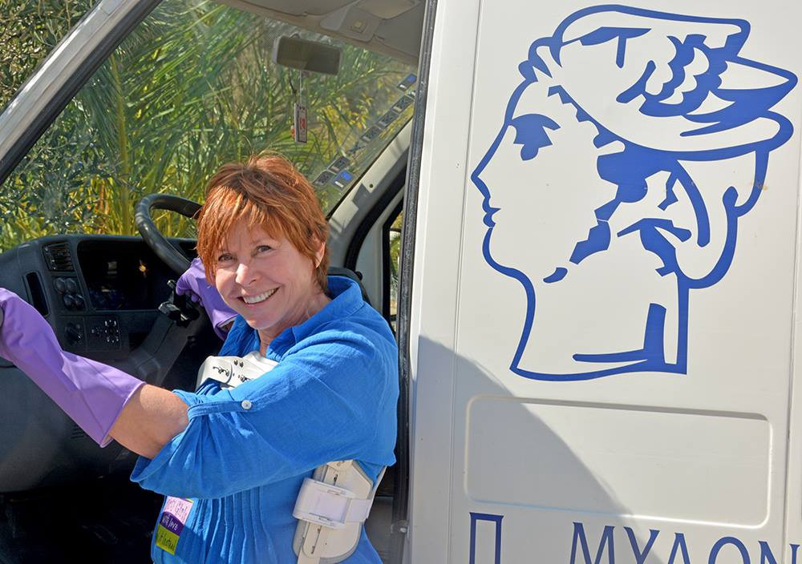

Dirty Girls have processed numerous clothing items and blankets so far\. Photo: Dirty Girls of Lesvos Island
#### CK Team offers co\-ownership of their van

In order to secure the continued operation of their aid truck in Greece \(and usage on Lesvos during the winter\) the CK Team is syndicating its ownership\. If someone would like to share the ownership over the famous yellow van, please check out this [link](http://shoutout.wix.com/so/aLVCxl_I#/main) \.
#### Samos needs clothes for the refugees

There has been a huge influx of refugees arriving in Samos since the start of October and the camp population has almost doubled in size\. Samos Volunteers strives to provide all newly arrived residents with two sets of clothing, as often they arrive with nothing but the clothes on their backs\. To check what they need and how to help, [contact them](https://www.facebook.com/l.php?u=https%3A%2F%2Fsamosvolunteers.org%2F2016%2F08%2F09%2Fdonations%2F&h=3AQHRvnIe&s=1&hc_location=ufi) \.
#### Serbia
### Warm meals and clothes needed in Belgrade

Refugee Aid Serbia continues welcoming and helping many people who arrive daily\. If you would like to support their dedicated work so as to provide warm meals, clothes and other essential items to the people we work with every day,to those in dire need who come with barely anything, you can do it [here](https://www.gofundme.com/supportras) \.

**15 men, 42 women and 416 children passed through the Miksalište aid space today** , where the team is in need of warm clothes, hygiene products such as shampoo, soap, razors, etc\. Considering the number of children that visit the centre, baby carriers and strollers would be of great help\.

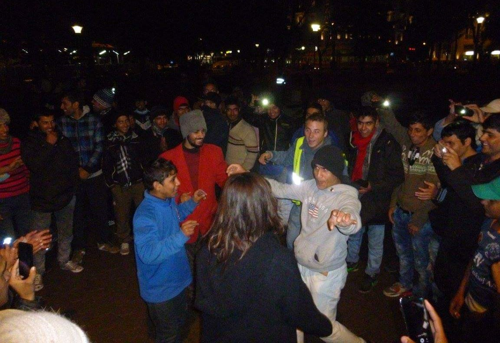

Weekly dance parties keep the morale high in a cold Belgrade park\. Photo: Refugee’s Anthem

On the lighter side, for the past three months [Refugee’s Anthem](https://www.facebook.com/refugeesanthem/) team has been organising weekly dance parties in the park in Belgrade\.

> “It is an event that brings strangers together, dancing to national dances, laughing at the volunteers and their funky moves, teaching about each other’s cultures\. With such a simple task as bringing a speaker on a rainy day, it turns a mundane day of waiting into 3 hours of laughter and joy” , they explain\. 

#### Italy
### Probably smuggler arrested after the death of at least 18 people, including a 3 year old child

A probable smuggler was taken into custody of the Italian police and questioned about the circumstances of smuggling 113 people, who witnessed about the death of at least 18 people, including a 3 year old child\. According to their testimonies, while the dinghy was sinking and fire broke out, the smuggler threw himself into the water using a plastic barrel as floating platform\. Some of the male passengers on the boat managed to jump off and others were caught in flames from the fire\. As taking off clothes was not something the women wanted to do straight away, they were the victims of the fire\. Psychologists met the surviving refugee passengers from the boat to help with the post traumatic situation, Italian sources report\.
### Refugees help to clean up the public park in Milan, but their own living conditions remain beyond repair

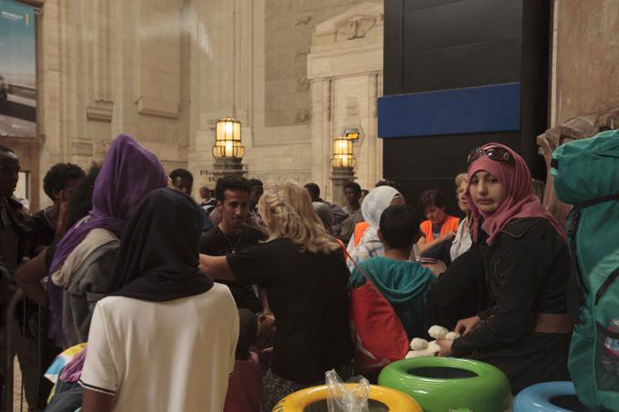

Community centres for refugee families in Italy are often overcrowded\. Photo: ANSA

Out of the estimated 730 refugees in the city of Milano, about 500 are staying in several lodgment facilities run by Fondazione Progetto Arca\. The limit of 500 people was posed because of the rough conditions at this refugee centre in via Sammartini in Milan, that has the capacity to host 150 people, so only women and children are allowed to sleep in the centre\. Others are often taken by buses to other centres from this facility that used to be just a transit point, with a daily flow of about 100 people while it was still possible to cross the border on the north\. The question of minors is also alarming\. Due to overcrowded community centres for children refugees, many are left with the only option of going back to the centre in via Samartini, with no proper child care or educational activities provided\.

Meanwhile, refugees in Milan are taking part in communal projects of the city\. A group of about a 100 helped cleaning the leaves of the city park trees from the streets and helped moving furniture to a hospice in the city\.

_Converted [Medium Post](https://areyousyrious.medium.com/ays-16-10-refugee-family-killed-by-a-car-in-front-of-oreokastro-camp-ee93ba049e30) by [ZMediumToMarkdown](https://github.com/ZhgChgLi/ZMediumToMarkdown)._
