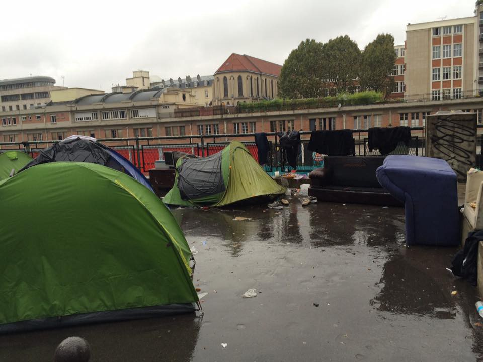

### AYS digest 17/10: City of Love is in reality a city of tents — many refugees with no other choice than to live on the streets of Paris

Many sleeping rough on the streets of Paris / MSF protesting the plan of french authorities to close the camps / Donations on the streets should be organized and not hectic — a message from the volunteers / Donations and volunteers needed in France, Serbia and Greece / List of companies profiting from securatization / Hungarians said no to violence, authorities say yes — Migszol report

Streets of Paris\. Photo: Sarah fenby Dixon
#### **France**

It seems that per usual, the authorities have not calculated the consequences of their actions — not only are they closing the Jungle, but the authorities have announced that there should be no new arrivals in the camp ‘La Linière’ in Grande\-Synthe, on the outskirts of Dunkirk\. This camp that was partly built by the resources provided by MSF was the only somewhat safe place for many waiting to get into England\. MSF strongly condemns this decision and has stated that: “Blocking new arrivals from accessing the camp at Grande\-Synthe is all the more baffling given the impending dismantling of the Calais ‘Jungle’,” said Franck Esnee, MSF Head of Mission in France\. “Where should the refugees and migrants who come to Linière camp go instead? This decision has been taken hastily, without thought for the consequences, and without proposing alternative solutions\. All those who refuse to abandon their dream of getting to England will have to find shelter somewhere\!” “This policy of systematically destroying existing camps and preventing the construction of new ones will lead nowhere,” “Without alternative plans to provide shelter, individuals, families, and even unaccompanied children, will be condemned to survive the winter as vagrants, destitute and vulnerable to violence\.” For more on the MSF stance follow the [link](http://www.msf.org/en/article/france-msf-denounces-decision-condemning-dunkirk-refugee-camp-probable-closure) \.

This rash action on the part of the authorities is becoming painfully obvious in Paris\. For many months, there has been an increase of refugees in Paris that is reaching it’s climax ever since the authorities announced that they are closing the Calais “Jungle”\. By the reports we are getting, and unfortunately, we do not have official number for Paris, there are some 1200 people living on the streets just in the northeast part of the city\.

According to the volunteers on the ground, local authorities claim that around one hundred refugees arrive in Paris daily, but they do not necessarily go to the hot spots\. While some build up tents on the sidewalk or traffic islands, others have to sleep outside without any shelter\. On Friday authorities bulldozed some 100 tents in the Afghan area, where the people had almost no time to take their goods so items such as cell phones, clothes or blankets have been destroyed with this action\. Some refugees also reported that police took their phones\.

Streets of Paris\. Photo: Sarah Fenby Dixon

There is literally no infrastructure in the area, where the refugees stay\. No community centers, no distribution points, no NGOs present but military patrolling with machine guns\. Only locals and a handful of international volunteers\. Local volunteers told us, that before July families and vulnerable cases have been taken from the streets immediately and were given a shelter\. Thus the majority in the streets are men, mainly from Sudan, Ethiopia and Afghanistan\. The Afghans, EU politicians want to send back, because of their quite arbitrary decision that Afghanistan is now safe country\. Yet the militaries from many EU countries are present in Afghanistan, which deems it an unsafe country by default\. Perhaps a statement from a young Afghan more vividly speaks to the fact of Afghanistan is a very dangerous place to live: “If you are looking more Asian, Daesh and the Taliban persecute you, if you are Shiite, you are fresh flesh for them”\.

Back to the families\. As the number of new arrivals is increasing, more and more families are living in the streets, too\. Nowadays there are some mothers with young, even new born children\. And the ones in shelters, accommodated in the middle of nowhere, are reportedly lacking nearly all necessities, as most of the volunteers focus on the streets\.

Police and tents on the streets

We have also been told that refugees who get arrested and fingerprinted for some reason, are being checked if a Dublin deportation to another EU country is possible\. Also, another alarming practice has been documented — While it’s illegal to oblige asylum seekers to leave the French territory, platforms where people can make their asylum demands are often saturated, meaning that they can spend weeks in the streets and be brought to the police station, without yet having the papers proving that they are indeed asylum\-seekers\. There are reports that police are removing some of the tents that have sprung all around the city, but it cannot be confirmed that this is a standard practice\.

Streets of Paris\. Photo: Niklas Golitschek

As for distribution of food, clothes and other needed things, it seems that the frenzy has started within the locals who are bringing a great amount of donations to the spots, but volunteers are warning and also asking people to try and understand that there is some structure to solidarity and that people should consult with those that have worked for many months on the streets of Paris and in its camps\. In that regard please read a message from a volunteer on the ground who is working on the distribution point Solidarités Saint Bernard de la Chapelle: “Good evening, excuse me to curb your enthusiasm, I’m volunteering on refugee camps for many months\. Wild distributions are not always ok … 98 percent of guys who have nothing \. \. sometimes cause fights \. \. the clothes should be brought the collection room of the church St\. Bernard , close to metro barbés\- there is a schedule for distribution and collection\. However, we are looking for duvets, blankets, emergency blankets, tents and very warm clothes\. I can store it\. Thank you for your attention and thank you for everything\. If you really want to make this distribution by yourself no problem but beware … you could cause a problem\. We are looking for donations \(in addition to the usual things\) in backpacks, socks, leggings, hats, shoes\! thank you”\.

So, if you really want to help, go to 12 rue St\. Bruno 75018 Paris, angle rue St\. Luc where you can drop off men’s clothes, blankets and hygiene times from Tuesday to Saturday, from 15h to 18h\. Clothes are distributed from 9h to 12h, or longer, on Saturdays and Sundays\.

Streets of Paris

Funds are also always needed by the Collectif parisien de soutien aux exilé\.e\.s \(CSPE\), which supports refugees through material, medical and legal help — for example they help refugees navigate the French bureaucracy and asylum system, accompany them to the hospital, make food for families and try to get unaccompanied minors out of the streets\. Currently, funds are needed to buy rice cookers for families living in hotels in the Paris suburbs but also for everyday expenses, such as metro tickets for refugees, financial support for volunteers hosting unaccompanied minors and many other things\. If you are able to help, please follow the [link](https://www.leetchi.com/c/solidarite-de-migrants-de-republique) \.
#### Calais

Since we are talking about donations there are some urgently needed in Calais\. As eviction notices are nailed up in the Calais jungle, refugees show what they think of them\!

Police putting up eviction notice on a Jungle “house” Photo: Calais action

What do people think of this eviction notice Photo: Calais Action

Now more than ever it is important to support the people who will be displaced possibly very very soon\. For their safety they need to keep in contact with loved ones and people who can help them and you can help by donating for phone cards\. Please text CALA85 with the amount you want to donate to 70070 and please note the maximum you can donate on a single text is £10 but you can text as many times as you like\! \. Also, for further explanation on how this works please watch this two minute video where everything is explained\.

Last but not least, somebody is always making money out of others misery, therefore Calais Research Network, a research group formed this August, has compiled an expanded list of over 40 companies profiting from the border regime, which can be viewed in English and French\. These companies have an interest in building up ‘security’ in Calais and beyond, part of a flourishing industry surrounding everything from the privatization of lorry inspections to the manufacturing of tear gas canisters and the constantly proliferating fences and walls along the highway\. The full list with detailed information on each company can be viewed on the new Calais Research website \( [calaisresearch\.noblogs\.org](http://l.facebook.com/l.php?u=http%3A%2F%2Fcalaisresearch.noblogs.org%2F&h=mAQFtmaUm) \) \. This list of companies is the first page to be published on the site\. In the coming days further pages will be added to map out some of the many axes of power that shape the reality of the border, including further information on the decision\-makers behind the securitisation of Calais, and more detailed investigations of key companies including Eurotunnel and Vinci\. This list is still far from complete, and we will continue to update it as we uncover more information\. If you have any information on these companies or others, please send it to us at calaisresearch\(at\) [riseup\.net\.](http://l.facebook.com/l.php?u=http%3A%2F%2Friseup.net%2F&h=mAQFtmaUm)
#### Syria
### **A hard day’s work in Syria**

As world leaders are holding endless talks on Syria in expensive hotels, continued intensification of the bombings of Aleppo is overwhelming what is left of the hospitals where doctors work around the clock without sufficient resources\. We opted today not to report on the talks as we have many times before, but to post a video of a surgeon’s work in Syria from where many come and suffer in Europe’s camps

#### Greece
### **Calls for volunteer help and donations in Greece**

With 57 new arrivals on the Greek islands today the number of those stranded in the south remains more or less the same\. As people are waiting in vain there are many calls for help in donations and volunteer work coming from Greece\.

There is a call for help at Agios Andreas, a small camp situated near Athens\. The site is under\-resourced and the humanitarian support agency needs help to improve the conditions in the camp\. Here is their message: “As we have already done with great success at Kara Tepe, we will create a community tea point, provide much needed clothing and hygiene items using our appointment system and set up non\-formal education activities including the establishment of our famous community garden\.”If you are able to help follow this [link](http://www.humanitarian-support-agency.org)

Humanitarian support agency also needs some urgent volunteer help for winterization as well as for the storage and logistics management of Kara Tepe camp\. If you see your hands working there, please [contact them](http://humanitarian-support-agency.org/volunteer/)

Following the tragic accident that killed a young mother and son on the 16th October in Oreokastro camp, on which we [reported extensively yesterday](https://medium.com/@AreYouSyrious/ays-16-10-refugee-family-killed-by-a-car-in-front-of-oreokastro-camp-ee93ba049e30#.9l808e8fz) , due to, besides other reasons, the very bad conditions on the roads leading to camps, volunteers on the ground are appealing for donations of reflective arm bands so the circulation of refugees is safer\. If you manage a warehouse, coordinate a street group or can help with the distribution of this live saving items, please contact Ana Jorge\.

Reflective bands

ERCI — Emergency Response Centre International is seeking teachers who can work in Greek camps\. If you are one of them, please contact them through their [FB page](https://www.facebook.com/ercintl/)
#### Serbia
### **Volunteers needed in Belgrade**

As humanitarian crises is very much present in Belgrade and with Info Park losing their license to have a stand in a park, there is an increasing need for help\. Miksalište is calling for more volunteer help and if you can do it, please let them know via their FB page Refugee Aid Miksalište\.

There is a new centre opened in Bujanovci in the ex factory Svetlost\. The facilities can accommodate up to 250 people and the first of them will be able to come on Wednesday 19th of October\. This is suppose to relieve some pressure in Preševo which is overcrowded with 800 residing there\. And those that are there, haven’t been able to go out of the camp for months, but are going to be allowed to do so now\. This means that people can go out in groups of 35 and spend up to 3 hours in the city and feel the sweet smell of very limited freedom\.
#### Hungary
### **People voted against the violence in Hungary, but cannot stop it — new report from Migzsol**

Migzsol have published a new report on Hungary\. As they point out: “Contrary to what many people in western Europe might think, Hungary is not full of supporters of Viktor Orbán or Jobbik\. \. First of all, on October 2nd, 60% of the Hungarian electorate ignored the propaganda machine of Fidesz and did not bother to even show up at the racist referendum\. The referendum result, therefore, is invalid”\.

People protesting against the referendum, 30th September\. Photo by István Huszti / Index

That being said, they point out to be aware that what authorities are doing on the border is once again — not the will of the majority of people and therefore contrary to any democratic process\. Migzsol reports on the behaviour of Hungarian police and violations of human rights that are going on despite the clear message from the people that they do not tolerate it\. For more, please read the report and follow the guys from Migzsol\.

Hungarian police smashing phones of those trying to cross Serbo/Hungarian border\. Photo: No border Serbia

_Converted [Medium Post](https://areyousyrious.medium.com/ays-digest-17-10-city-of-loves-is-in-reality-a-city-of-tents-many-refugees-with-no-other-then-bfc55143ac26) by [ZMediumToMarkdown](https://github.com/ZhgChgLi/ZMediumToMarkdown)._
