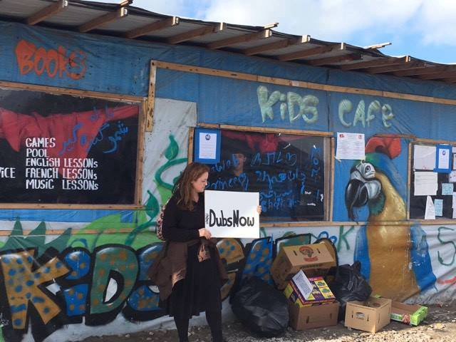
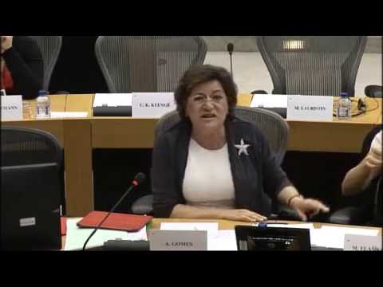
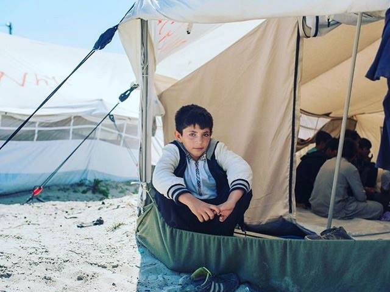
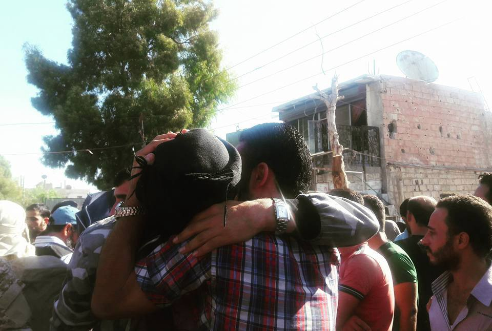
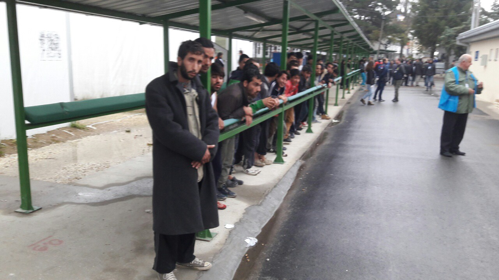
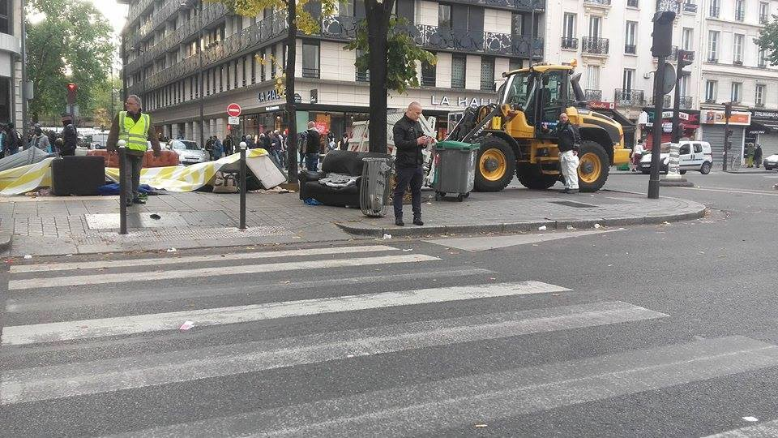
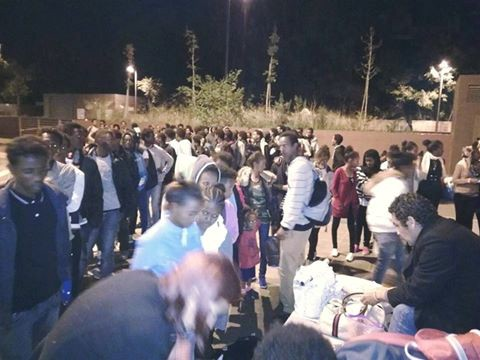

### AYS Digest 19/10: Still no Dubs Transfers

_The EU\-Turkey deal — a blueprint to control migration from Africa\. EU plans to accelerate returns to Turkey\. Relocation process still extremely slow\. Some kids transferred to the UK under the Dublin Regulation but not a single child brought over under Dubs\._

Photo by Calais Action
### EU
### The EU\-Turkey deal, a blueprint to control migration from Africa

Several newspapers, including [El País](http://internacional.elpais.com/internacional/2016/10/18/actualidad/1476811503_017250.html) say **EU officials are happy with the first results of migration partnership deals signed with Niger, Nigeria, Ethiopia, Mali and Senegal** to reduce the flow of migrants to Europe\. [Reuters](http://uk.mobile.reuters.com/article/UKNews1/idUKKCN12J1QY) says the EU wants to persuade African states to take back their own citizens, adding that African officials are already coming to Italy to identify citizens who may try to conceal their identity to avoid being sent home\.

During Thursday’s summit, EU leaders are expected to decide that they want to get “measurable results in terms of preventing illegal migration and returning irregular migrants” — this could include threats of cutting development aid and restricting trade with those African countries that do not cooperate\.

[_Ansa_](http://www.ansa.it/europa/notizie/rubriche/altrenews/2016/10/18/migrantimogherinifatto-piu-in-4mesi-che-in-anni_243706ba-2681-44e3-99bf-fa34fee45646.html) quotes High Representative Mogherini, saying the EU has achieved more in the last four months than in several years by offering such deals\. The EU\-Turkey deal is seen as the blueprint for these partnerships, but refugee camps on Aegean Islands remain overcrowded, as arrivals continue while returns to Turkey go on at a slow pace\.
### EU to accelerate returns to Turkey

[The Telegraph](http://www.telegraph.co.uk/news/2016/10/18/eu-to-call-on-greece-to-speed-up-migrant-returns-toturkey/) says draft conclusions from this week’s European Council summit show EU leaders will call for **‘further efforts to accelerate returns from the Greek Islands to Turkey’** and a major drive to enhance the ‘efficiency and speed of appeals’ of migrants who have claimed asylum in Greece\. The communique will also call for member states to increase their support for Greece\. Meanwhile, Turkey’s EU minister Celik tells [_Reuters_](http://www.reuters.com/article/us-europe-migrants-turkey-idUSKCN12I26L?feedType=RSS&feedName=worldNews) Turkey could cancel its side of the EU\-Turkey agreement if the EU keeps pressing Turkey to change its anti\-terror laws while holding back on visa liberalization\.

**High Representative Mogherini adds that rules on the relocation of refugees within the EU must be respected according to agreed quotas** \. In an interview with AYS however, Portuguese MEP Ana Gomes insists that several countries, such as Portugal, are willing to accept refugees more rapidly, but are unable to do so\. She points out several problems, including the difficult cooperation between EASO and Greek authorities\. She adds that the European Commission has the political authority to speed up the process and could allocate more resources and staff to solve the issue\. She also insists she “cannot understand why this takes so long, especially since countries like mine are open to take in refugees”\. We will post the full interview soon\. In the meantime, her intervention before the European Parliament explains her frustration well\.

_As of now, only 4,814 refugees have been transferred from Greece to the rest of Europe\._
#### UK
### Kids from Calais

After the arrival of unaccompanied minors to the UK on Monday, British tabloids started questioning the age of those arriving, with images of these kids splashed across their front page\.

Conservative MP David Davies has even suggested that “hulking teenagers who look older than 18” should undergo teeth checks to weed out adults in disguise\.

[The Independent](http://www.independent.co.uk/news/uk/politics/child-refugees-calais-jungle-age-david-davies-mp-teeth-checks-add-to-trauma-a7368966.html) reports that these comments have been criticized by the British Association of Social Workers saying “intrusive medical tests are not necessarily going to be at all appropriate and would be considered to be very intrusive and would be retraumatising\.” The British Dental Association also said that dental checks are not accurate, adding that “it is both inappropriate and unethical to take radiographs of people when there is no health benefit for them\.”

Rachel Mantell, a Calais volunteer, makes some other good points:
- The kids being brought over are not brought over in order of age, vulnerability, risk or need\. They are being brought over because their paperwork is in order and their claims are verifiable\.
- All are ‘Dublin’ kids have family over here and so have the right to be reunified with them and have their claims processed here under the terms of the Dublin 3 treaty\. Not a single child has been brought over under Dubs\- the ‘modern day Kindertransport’ aimed at protecting the most vulnerable\.
- There are girls in Calais but most are either with family \(and so not eligible\) or are Dubs kids \- so with a few exceptions not in the current batch the Home Office are processing\.
- There are some very young kids covered under both Dubs and Dublin\. None have come over because of Dubs and they weren’t allowed to photograph the Dublin ones\.
- So they have photographed teenage boys, on the cusp of manhood\. And expressed horror that they look like teenaged boys on the cusp of manhood\. Not just that \- they are teenaged boys who have slept rough in the most hostile of environments for months\. So of course they aren’t doe\-eyed and smooth\-skinned and vulnerable looking\. That wore off along their horrific journey\. \(Also, as an aside, one ‘kid’ photographed was actually an adult interpreter\)
- By photographing and identifying these children and making horrible insinuations about them, the press have made them targets\. Which is shocking\. But what is more shocking is that members of parliament have joined in, calling for dental checks \(which are ethically dubious and scientifically discredited\) \.

### Still no Dubs Transfers

**Calais Action adds that children coming under Dublin protocols and children coming under the Dubs Amendment are two very different things** — “Dublin children” have family in the UK and come to the country under “an existing system of transfer under EU asylum policy which can be activated when there is a relative in an EU country” while “Dubs” children are unaccompanied children without family in the UK and the system to take them from France and transfer them safely to the UK is still being built\.

Calais Action says “ _we must make sure that our governments do not confuse the two and leave “Dubs” children behind whilst trumpeting their “Dublin” children through convenience\. It is much easier to process “Dublin” children and speed up the system, than create a whole new system for “Dubs” children\. So when the press and the Government show stories about bringing children over from the camps, do READ CAREFULLY whether they mention joining relatives or being reunited with families\. If it does — then they are “Dublin” children\._

_We call upon this Government to enact the spirit of the Dubs Amendment and bring over Dubs children as well as Dublin children — ALL children in the camp are worthy of our protection\.”_

Photo by Calais Action

Help Refugees says “ **_whilst we welcome the arrival of so many children who qualify under the Dublin III amendment it is important to remember the most vulnerable demographics in camp — the girls and the under 13s who would qualify under the Alf Dubs Amendment are still there_** _not knowing what is going to happen to them\. At present not one child who qualifies under this amendment has been officially registered let alone brought to safety\. Demolition is due to start Monday\. In the last eviction 129 children went missing_ \.”

Photo by Help Refugees
### Syria
### Moaddamieh forcibly evacuated

Inhabitants of the Damascus suburb of Moaddamieh have been forcibly evacuated today, following a local truce which will return the district to the Syrian regime\. Around 3,000 local rebel fighters and residents will leave their homes and head north to opposition\-held Idlib province\. [Al Araby](https://www.alaraby.co.uk/english/news/2016/10/19/another-opposition-held-damascus-suburb-to-be-evacuated-on-wednesday) says the neighborhood has been besieged by regime forces since 2013, with residents enduring chemical attacks, barrel bombing, and starvation\.

Photo provided by “Marvin Gate”
#### Iraq
### Civilians flee Mosul area and cross into Syria

[BBC](http://www.bbc.com/news/world-middle-east-37701235) reports on civilians crossing the border into Syria after fleeing the Mosul area, as the army attempts to retake the city from ISIL\. Up to 1\.5 million civilians and up to 5,000 IS fighters are thought to still be in Mosul, and the UN is preparing for what it fears could be the biggest man\-made humanitarian crisis in recent times\. According to Save the Children, 5,000 people have crossed the border into Syria in the last 10 days — the UN disputes these numbers and says its camp received 912 people in the last 24 hours\.
#### Serbia
### 161 refugees transferred to Presevo

180 people were transferred from Presevo to the Bujanovac camp, but a small number of families are still in Presevo\. 261 refugees, including 182 adult men, 78 unaccompanied boys and one unaccompanied girl arrived in Presevo from Northern Serbia, as Presevo seems to be transformed into a camp for single men and those who Serbia considers “economic migrants”\.

As we reported earlier, systematic push\-backs of people from Presevo camp has been confirmed by both Serbian and Macedonian volunteers\. Refugees who have been locked up for months in Presevo are allegedly being returned to Macedonia without a legal procedure, in groups of 30–40 people per day, most probably over the green border\. Refugees who are still in Presevo say they are very afraid because they don’t have any information about whether or not they too will be pushed back to Macedonia\.

Arrival of people from Northern Serbia to Presevo\. Photo by a volunteer\.
#### Hungary
### Migszol updates FAQ on Serbian\-Hungarian border

Migszol, the Migrant Solidarity Group of Hungary, has updated its website with a detailed FAQ on the Serbian\-Hungarian border\. It is available in English, Serbo\-Croatian, French, Arabic, Russian and Turkish and Farsi\.

The FAQ answers the following questions:

1\. What is the situation on the southern border of Hungary and where are the transit zones?
 2\. What is in the reports about violence on the Hungarian border?
 3\. How long do I have to wait in front of the transit zone?
 4\. What kind of support is offered in front of the transit zones?
 5\. Who can go inside first and what is inside?
 6\. What is the registration procedure and are fingerprints taken?
 7\. What are the admissibility rules and what happens during the interview?
 ​8\. What is important to remember during the interview?
 9\. Are people sent to open camps or closed camps after the transit zone?
 10\. How are the living conditions in the open camps in Hungary?
 11\. How are the living conditions in the closed camps?​

The organization is still looking for people to translate the text into Somali, Kurdish, Urdu and Pashtu\. If you know anyone or think you could help, please drop an email to minnastiina@riseup\.net
#### France
### 23rd roundup in 80 days

The 23rd roundup of refugees since the 31rd of July took place today in Paris\. Today, around 50 refugees were arrested, with many tents, sleeping bags, and personal belongings destroyed in the process\.

Photo by Collectif La Chappelle Debout

Photo by Collectif La Chappelle Debout

During these arrests, many refugees are notified with an “obligation to leave the French territory”\. Others are sent to retention centers — some get a warm place to sleep for a couple of days, but they are quickly put back on the streets\.
### 80 refugees leave Calais for university

80 refugees, mostly from Sudan, have left Calais on Tuesday to start an intensive course to learn French\. Interior Minister Cazeneuve said “after the initial training period, they can pursue a traditional university curriculum in the field of their choice”\.
#### Italy
### Baobab Experience need help

[Baobab Experience](https://www.facebook.com/BaobabExperience) in Rome continues to fight for the rights of refugees, even after being evicted by police from their center in via Cupa\. They urgently need biscuits, blankets, and sleeping bags\.

Photo by Baobab Experience

_Converted [Medium Post](https://areyousyrious.medium.com/ays-digest-19-10-still-no-dubs-transfers-a6330b2d14bf) by [ZMediumToMarkdown](https://github.com/ZhgChgLi/ZMediumToMarkdown)._
