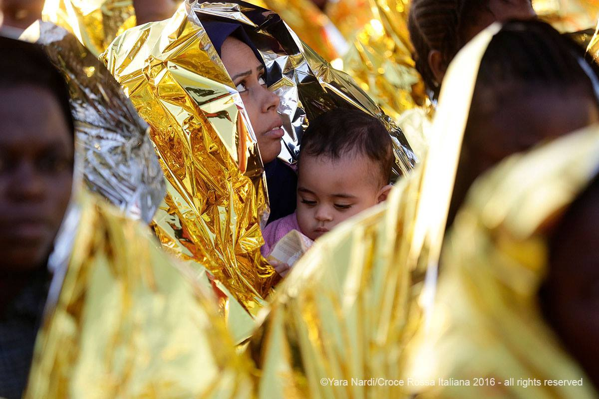
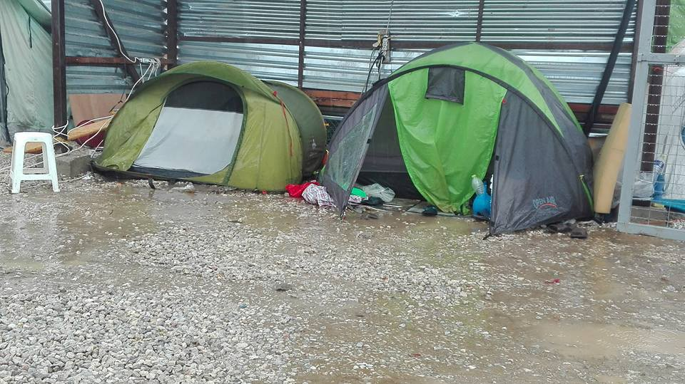
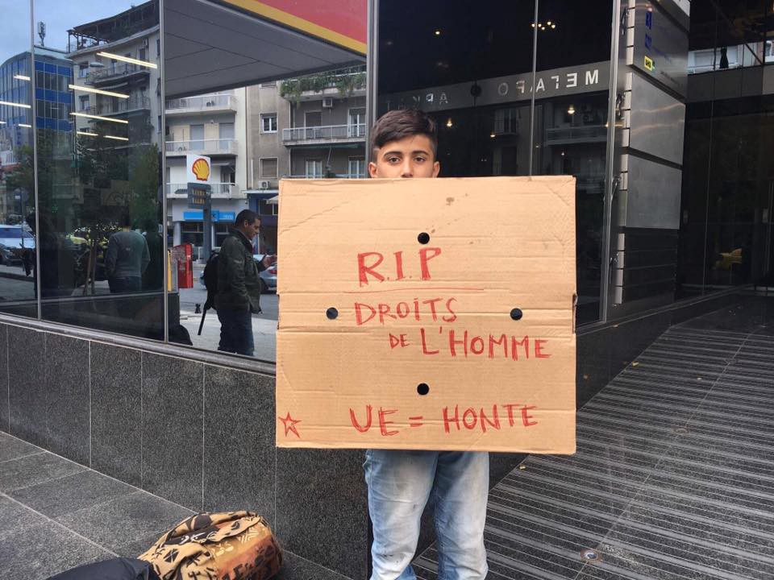
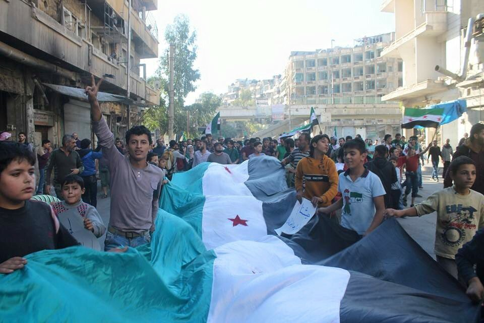
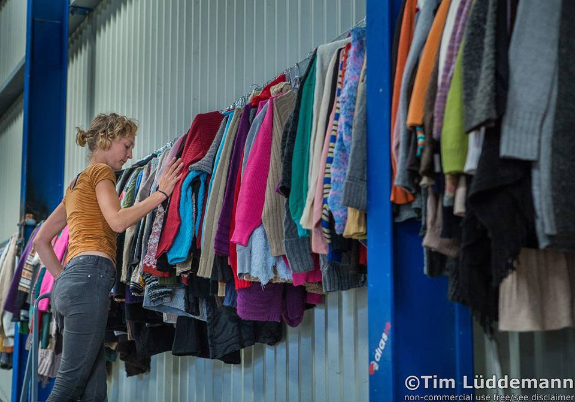
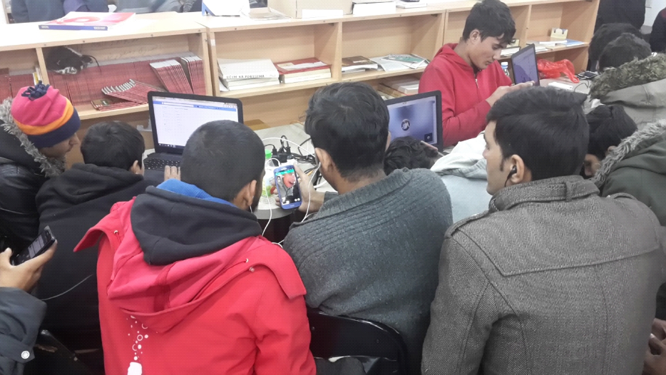
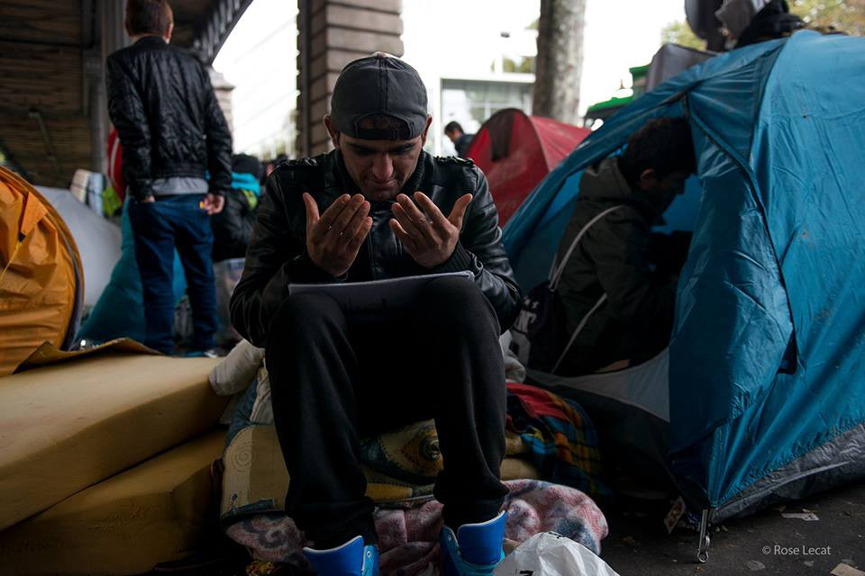
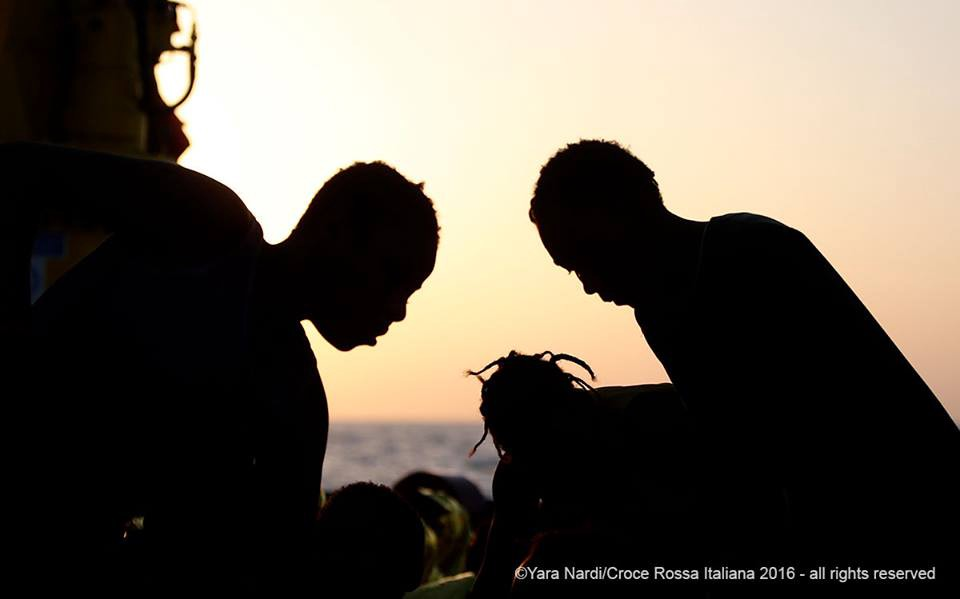

### AYS NEWS DIGEST 20/10 — MSF calls attention to squalid conditions in Greek camps\.

Refugees after having been rescued in the Mediterranean by MOAS\. Photo Credit: Yara Nardi
#### Feature

In its new report, MSF has condemned the unacceptable conditions that refugees are forced to endure\. They no longer have to fear bombs, but this does not mean that there isn’t plenty of room to complain\. The report is titled “ [Greece in 2016: Vulnerable People Left Behind](http://reliefweb.int/sites/reliefweb.int/files/resources/Summary_Report_Greece_201016.pdf) ”, and calls attention to the difficulties faced by the 60,000 refugees stranded in Greece\. The most atrocious examples are to be seen in the Hotspots on the islands, which are currently at 200% over capacity and are preventing refugees from coming to the mainland until the painfully slow bureaucracy processes their asylum application\. the majority of whom live in flimsy tents and otherwise no protection from the elements, even as winter approaches\.

An example of the kind of tents refugees must dwell in\. Taken in Softex Camp\. Photo Credit: Gerhild Salzer

[One volunteer](https://www.facebook.com/gerhild.salzer/posts/10153786354400881) has published a strong condemnation of what he has witnessed in Softex Camp near Thessaloniki\. “And when it rains again, when within an hour the whole camp is drowning, all the tents are flooded, even the ones inside the filthy building, when you see people trying to fight the mud and the water, when you know that they will have to go to sleep wet and soaked only because we decided that they have to — then all your serenity has gone in a second\. You are as speechless and taken aback as you were when you first stepped into a rain\-drenched Idomeni back in March\.”

In addition to the weather\-related difficulties, services are severely lacking\. Those with physical ailments have difficulty accessing medical care and medications, and psychiatric ailments such as PTSD are going untreated\. Food is often of poor quality and served in inadequate quantities, and bureaucracy is a nightmare\. Quite frankly, Greek and EU authorities ought to be ashamed of themselves for having failed the desperate people who want nothing more than to live a peaceful life without the threat of danger hovering over their heads\.

Greece alone cannot be blamed, of course\. Mismanagement of resources and incompetence of authorities aside, country has been in the midst of one financial crisis or another for several years\. This is why a large part of the blame falls on the structural failures of the EU\. For instance, of the 160,000 refugees who were to be resettled from Greece and Italy to other EU countries, only a bit over 5,000, in other words 3%, have been relocated to other countries\. Europe has the resources to care for these people, and yet it seems that policy makers spend most of their time sending insincere condolences unbacked by concrete action\.

“RIP human rights\. EU = shame\.” A refugee protests outside of UNHCR headquarters in Athens\. Photo Credit: NoBorders
#### Syria
### Amidst a break in hostilities, residents of East Aleppo protest against regime violence\.

Taking advantage of today’s relative calm, the residents of rebel\-occupied Aleppo have taken the chance to protest against the regime’s brutality\. The people refuse to give in to the regime’s violent attempts to force them to vacate their homes in an attempt to further isolate rebel fighters and break their morale\.

### Even as Aleppo was spared, the White Helmets were targeted in Kafranbel\.

An airstrike hit the White Helmets’ center in Kafranbel\. Consequently, 3 volunteers were injured, one of them critically\.
#### Greece
### New project distributes much\-needed warm clothing as winter approaches\.

IHA, Epigrafes Nea Magnisia, and Team Bananas are coming together to provide a much needed service to to Northern Greece\. It’s only October, and it is already starting to get quite chilly\. Project Clothes is now working with refugee camps in Northern Greece, with its “shop” providing a wide array of clothing in proper sizes for men, women, and children\.

The project is in the process of expanding its mobile truck “shop” and selection of clothing\. You may help them do so by making a contribution [here](https://www.gofundme.com/project-clothes-2utxcp8) \.
#### Serbia
### Miskalište has released their report for the week of October 12–18\.

The indicates that over 500 people continue to be dependent on the services provided by the center, the majority of them being people from Afghanistan followed by Syria\. They warn about cases of Scabies, Pediculosis corporis, Pediculosis capiti and Varicela zostar among refugees\.

> “Currently, we don **’** t have a sufficient amount of volunteers\. The situation is more than worrying especially because we don’t have enough warm clothing and footwear for distribution, and the number of new refugees arriving is on the rise\. This is especially worrying because a lot of the refugees sleep in the park without enough clothing, bedding or quality footwear **\.** The weather is not likely to improve as we expect a lot of rain, and we don’t have enough raincoats\. It is also a major problem that there is no breakfast on weekends, which means we have to use our stock level which are limited and soon to be used up\.” 

Miksaliste is also in need for blankets, because many refugees are sleeping on the street, as well as warm clothing and shoes, as cold days are coming\. Also, they need hygiene products, and the most razors, shampoos and soaps\. Please, help if you can\.

Miskalište’s IT center provides an opportunity for refugees to use computers to stay in touch with their loved ones\.
#### France

Man in Jaures prays as the evacuation takes place\. Photo Credit:Rose Lecat
### Tents in Jaures metro area destroyed by French authorities\.

The police arrived unannounced at 8 in the morning to begin the destruction of the impromptu camp, whose residents are mostly from Afghanistan\. The police asked those with documents proving they are asylum seekers to line up to verify their ID\. Those without papers were brought to the police station\. Those who were not brought to the police station refused to leave and police finally authorized them to get their stuff out of their tents, but their tents were destroyed afterwards\. Some Afghans said they are sleeping in the streets for one and a half months now and expressed their disappointment over the country of “human rights”\. Over 100 people were left without anything, without any indication of where they are to spend the night\.
### Police coerces, lies to refugees in attempt force them to sign paperwork pledging to leave the country\.

Yesterday, police notified 14 Sudanese and one Libyan of an obligation to leave the French territory \(OQTF\) \. The Collectif La Chapelle Debout says police tries to convince migrants to sign these papers by saying it will help them in their asylum procedure\. Those who refused to sign were told that they would not be allowed to leave the police station\.
### La Cuisine des Migrants is in urgent need of food\.

Pasta, rice, lentils, beans, onion, canned tomatoes, peas, potatoes, sugar, coffee, and tea and spices, among other things, are urgently needed\. Also needed are trays, cups, and plastic spoons\. Donations may be made at 4 rue Jean Moinon from 10am to 9pm on Mondays and Tuesdays, and 10am to 1pm on Wednesdays, Thursdays, and Fridays\.
#### Mediterranean
### MOAS has rescued 434 people from boats\.

Refugees after having been rescued in the Mediterranean by MOAS\. Photo Credit: Yara Nardi
#### General
### ECDC, WHO assures that fears of refugees bringing disease are not grounded in fact\.

As rumors of diseases coming with refugees spread, representatives of the European Center for Disease Control and WHO state that refugees are more likely to catch diseases in Europe than the other way around\. “People wrongly assume that refugees carry infectious diseases and that they will infect people in the host population\. A more accurate picture is that refugees and other migrants are more vulnerable to infectious diseases but the risk of infection to a host population is very small,” said Andrea Ammon, the director of ECDC\. Refugees are in particularly high risk of disease because of the poverty and unsanitary conditions that many are forced to live in upon arrival to Europe\. Rather than spreading rumors, Europe must do more to assure the well\-being of refugees\.

_Converted [Medium Post](https://areyousyrious.medium.com/ays-news-digest-20-10-msf-calls-attention-to-squalid-conditions-in-greek-camps-49e2149b4e66) by [ZMediumToMarkdown](https://github.com/ZhgChgLi/ZMediumToMarkdown)._
