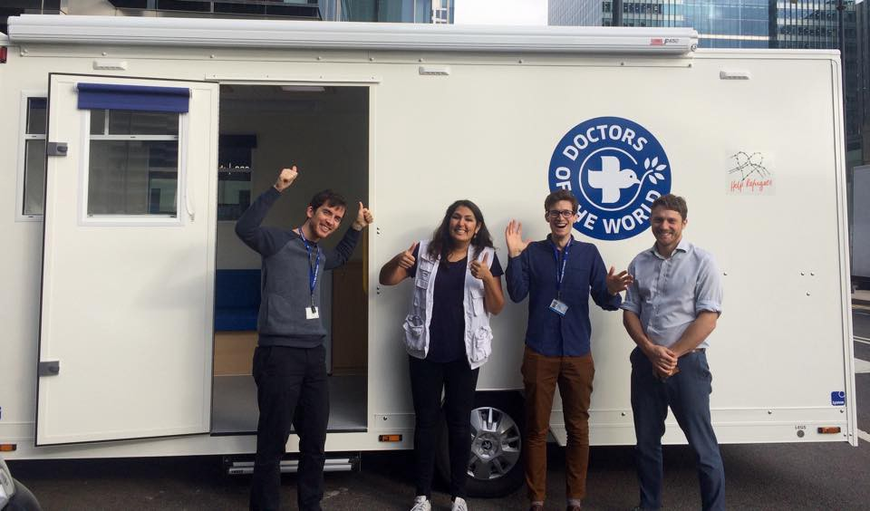
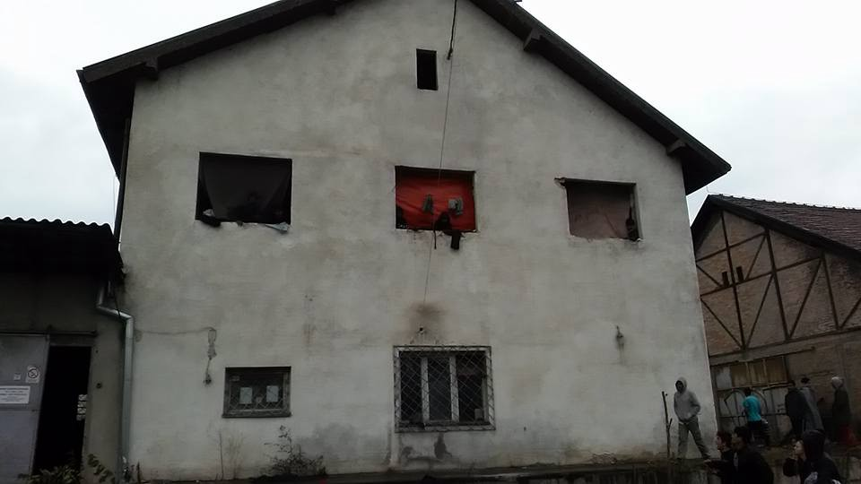
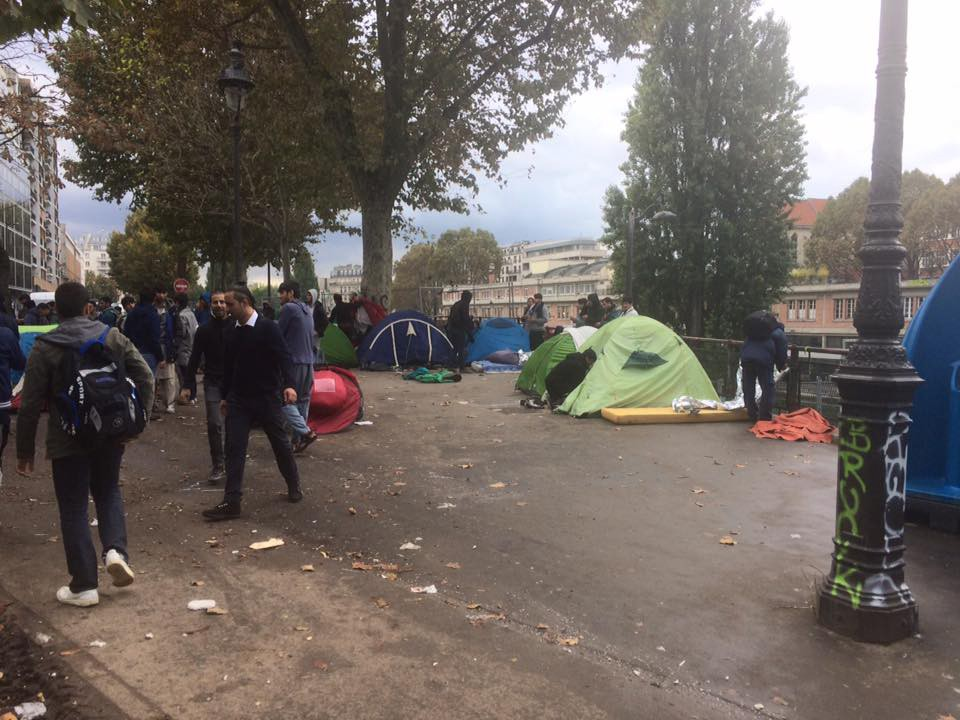
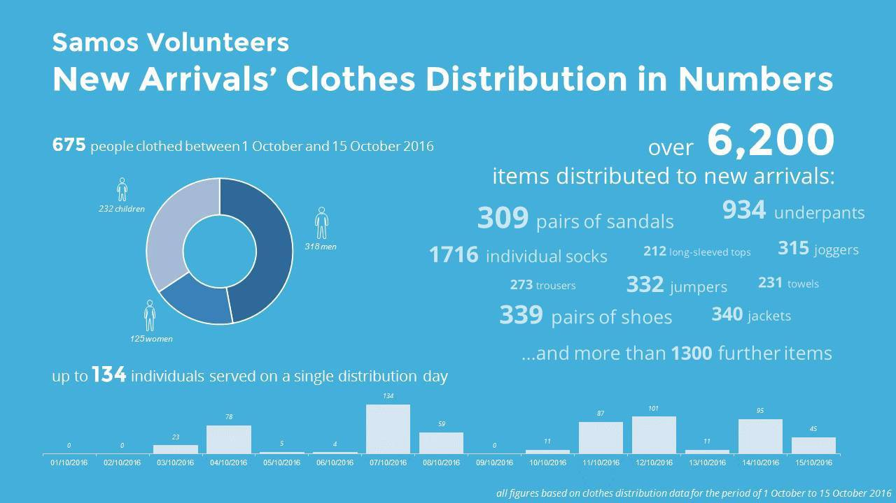

### AYS NEWS DIGEST 21/10 — Countless people in dangerous conditions while official processes go steadily — but slowly

_Turkey planning to send aid to Mosul / UNHCR concerned about illegal returns to Turkey and lack of information about people’s whereabouts / Anti\-refugee protests announced in Bulgaria / fatal end to many attempted Mediterranean crossings / preparation weekend for the Calais closing / French police determined to clean the streets of tents, leaving hundreds in cold and danger_

](assets/16a3b19823b0/1*lxG-E4eb8pS7JgW-O7lMow.jpeg)

Photo: [Care4Calais](https://www.facebook.com/care4calais/photos/a.1046164975416459.1073741829.1046117708754519/1318014918231462/?type=3&theater)
#### TURKEY

Reuters reports the Turkish Red Crescent is sending trucks of aid to northern Iraq with enough food and humanitarian supplies for 10,000 people displaced by fighting in Mosul\. The first aid consignment will go to nearly 30 villages around Mosul where up to 4,000 people are on the move, says the agency\.
#### CYPRUS

A reception center on the outskirts of Nicosia is being prepared for the 83 Syrian refugees who arrived via boat\. The boat has been towed to a harbor on the northwestern coast of Cyprus\.
#### GREECE

Two boats arrived to Lesvos on Friday: one with 45 people on board and the other, brought by the Greek coast guard to Skala Sykaminia, with 46 people on board\. Samos marked 75 new registrations\.

 — Emergency Response Centre International](assets/16a3b19823b0/1*TpzuJRB6zwmAxdkXUCAhdw.jpeg)

Photo: [ERCI](https://www.facebook.com/ercintl/) — Emergency Response Centre International

Currently, about 15,400 people are hosted on the Greek islands, where the capacity of organized sites is slightly over 8,000, according to Greek government data\.
### UNHCR denied access to people taken by Greek authorities to unknown locations

The UN refugee agency has expressed serious concerns the over illegal treatment of refugees by Greek officials\. They state [two examples](http://www.unhcr.org/news/briefing/2016/10/5809e78d4/unhcr-concern-illegal-return-10-syrian-nationals-greece.html) : first, the return of 10 Syrian nationals from Greece to Turkey, without due consideration of their asylum claims in Greece; and secondly, the undisclosed location and legal status of 33 people from a group of 131 who arrived to Peloponnese on October 8\. These disturbing incidents contradict the stated efforts to accelerate returns from the Greek islands to Turkey by enhancing the efficiency and speed of asylum procedures\. Instead, the procedure is anything but clear in these cases, and possibly many more\.
### EC gives finances and responsibility to 8 NGOs in Greece

The European Commission has signed contracts with 8 NGOs in relation to the refugee crisis in Greece\. These NGOs \(UNHCR, Red Cross and Doctors of the World, Danish Refugee Council, Oxfam, Save the Children, ASB Federal Association and International Rescue Committee Hellas\) will receive about 83 of the 700 million euros that have been earmarked for Greece\. Greece will receive 300 million euros for 2016 in total, 200 million euros for 2017, and a further 200 million euros for 2018 in European funding\. The NGOs will provide food, shelter, medical care, training and protection to refugees\. It is said that the NGOs will coordinate their actions with the Greek government and will recruit people from local communities\. Greek minister Mouzalas noted that “we can manage 50,000 to 60,000 refugees” and estimated that most are in transit\. He also suggested that about 14,000 or 15,000 refugees will be relocated to other European countries\.

](assets/16a3b19823b0/1*zkR34GbYiCQ1gcxQMiF7Pg.jpeg)

Photo: [Through refugee Eyes](https://www.facebook.com/throughrefugeeeyes/)

Please find updated information about the asylum interview in Greece on [this link](http://refucomm.com/infopacks/greece-mainland/what-happens-at-the-asylum-interview/information-about-the-asylum-interview/en/greece-mainland_what-happens-at-the-asylum-interview_information-about-the-asylum-interview_EN.pdf) provided by the RefuComm\.
#### In Greece, when officials fail, once again the volunteers step in…

 in Cherso has been continually working with children in the Mazaraki camp, providing educational, cultural and social content daily for all ages of children staying at the camp\. \(Photo: OCC\)](assets/16a3b19823b0/1*jcKs2ien8PponpgCWvFxww.jpeg)

[Open Cultural Centre](https://www.facebook.com/OpenCulturalCenter/) in Cherso has been continually working with children in the Mazaraki camp, providing educational, cultural and social content daily for all ages of children staying at the camp\. \(Photo: OCC\)

 \)](assets/16a3b19823b0/1*IqsvV0rImS4jvJPEx8bjnQ.jpeg)

Fully restored and furnished cultural centre in Softex is ready to welcome residents for the 13 daily activities organized for children, teenagers and adults \(Photo: [Lo Lucho](https://www.facebook.com/lois.simac.3) \)

 also prepared new space for educational activities of their young residents, who are expected to start studying in new classrooms any day now\. \. \(Photo: [Refugee Support Greece](https://www.facebook.com/RefugeeSupportGreece/) \)](assets/16a3b19823b0/1*uEgD_-InCS2q7SuYqTyCQQ.jpeg)

[The Refugee Support Greece](https://www.facebook.com/RefugeeSupportGreece/) also prepared new space for educational activities of their young residents, who are expected to start studying in new classrooms any day now\. \. \(Photo: [Refugee Support Greece](https://www.facebook.com/RefugeeSupportGreece/) \)
### Dictionary for doctors working with refugees

In 2014, the Swiss Embassy in Greece published as ‘Small dictionary’ in cooperation with a local NGO, EADAP, to facilitate medical workers communicating with migrants and refugees not able to speak Greek\. The glossary can be helpful also for refugees and migrants seeking health assistance in Greece, as it contains useful medical terms and phrases in Greek, Arabic, English, Farsi, French and Urdu\. You can download it [here](http://l.facebook.com/l.php?u=http%3A%2F%2Fwww.eadap.gr%2Fnew%2Fwp-content%2Fuploads%2F2015%2F11%2F%CE%9C%CE%99%CE%9A%CE%A1%CE%9F-%CE%9B%CE%95%CE%9E%CE%99%CE%9A%CE%9F-%CE%A7%CE%A1%CE%97%CE%A3%CE%99%CE%9C%CE%9F-%CE%A3%CE%95-%CE%99%CE%91%CE%A4%CE%A1%CE%9F%CE%A5%CE%A3-%CE%9A%CE%91%CE%99-%CE%9D%CE%9F%CE%A3%CE%97%CE%9B%CE%95%CE%A5%CE%A4%CE%95%CE%A3.pdf&h=hAQF1SHuS) \.
### A new mobile clinic arriving to Athens

[Doctors of the World UK](https://www.facebook.com/DoctorsoftheWorldUK/) mobile clinic is leaving London and heading to Greece\. It should arrive in Athens in the next few days\. The clinic’s mobility will allow it to reach the most vulnerable people\. Over the next six months, the clinic will see over 3,000 refugees\.

Photo: Doctors of the world UK
### EU — Turkey Statement in pratice

Despite an increase in the number of people returned to Turkey from Greece in recent days, the implementation of other parts of the EU\-Turkey deal has proceeded slowly, according to official EU data\.

From March, when the deal took effect, to October 14, almost 2,000 Syrians were resettled from Turkey to the EU, most of them going to Germany \(766\), France \(367\), Sweden \(269\), Netherlands \(170\) and Finland \(122\) \. During the same period, 668 people were returned from the Greek islands to Turkey\. Most of those returns were carried out in April \(386\) \.
### Protecting the external borders and tackling migratory flows — the focus of the European Coucil

“The European Council calls upon Member States to further intensify their efforts to accelerate relocation, in particular for unaccompanied minors, and existing resettlement schemes\. This is without prejudice to the position of Hungary and Slovakia and to the position of Poland, which has intervened in support of the applicants\.“

This is one of the [conclusions](http://www.consilium.europa.eu/en/press/press-releases/2016/10/20-european-council-conclusions-migration/) made by the members of the European Council at their latest debate\. They also expressed their support of the New York Declaration for Refugees and Migrants and called on all global actors to shoulder their responsibilities in this respect\. At the same time, they clearly stated that the lasting stabilisation of the situation in the Eastern Mediterranean requires the further implementation of the EU\-Turkey statement and continued support for countries along the Western Balkans route\.
#### BULGARIA

The protesters who announced gatherings against refugees to be held in Sofia, Varna and Yambol demand that no refugees be admitted on the territory of Bulgaria\. According to [Novinite](http://www.novinite.com/articles/176955/Anti-Refugee+Protests+To+Be+Held+in+Sofia%2C+Varna%2C+Yambol) , they insist on closing the border and the refugee centres that have been built already, as well as denying the refugees financial aid\. According to the protesters, the official migration statistics have been purposely manipulated\.
#### SERBIA

> Today, several organizations in Belgrade conducted a joint action to distribute blankets, socks and wet wipes from MSF to people sleeping in the parks and abandoned barracks\. More than 1,000 packages were distributed\! We would like to thank MSF for their support and the amazing response from our volunteers \(we had more than 30\! \) who didn’t hesitate to participate today at 6 am and under the rain\. — Refugee Aid Serbia 

An empty house squatted by the refugees as all camps were full\. \(Photo: RAS\)
#### AUSTRIA

A police investigation into human trafficking has found that female refugees in Austria are being sold into forced prostitution, Austrian [sources](https://www.thelocal.at/20161020/refugees-sold-into-forced-prostitution) report\. The young refugee women found during a Europol\-led operation against human trafficking were mostly African\. According to the officials, the smugglers brought the girls to Austria and sold them to traffickers\. They were told they had to work off their debts, and were made to have sex in asylum centres and brothels, or to work as escorts\. Eighteen people were arrested\.
#### ITALY

Numerous attempts at the dangerous crossing of the Mediterranean are continuing despite worsening weather as winter approaches, with more than 2,400 migrants rescued off Libya in total since Sunday\. Hundreds were saved by the MSF, MOAS and the Italian coast guard\. However, an intervention by a speedboat, labelled as Libyan Coast Guard, during one of rescue operations caused several deaths on Friday\.

The violent intervention of the Libyan Coast Guard caused mass panic on board the rubber boat in distress\. One tube of the rubber boat collapsed, causing the majority of the 150 people to slip into the water\. The [Sea Watch](https://www.facebook.com/seawatchprojekt/?fref=nf) crew attempted to save as many as they can\. They are calling for an immediate and detailed solution of this violation of humanitarian law\.

> Exhaust fumes, hypothermia, dehydration and overcrowding are some of the direct causes of many deaths on the rubber boats\. The ongoing crisis is the worst maritime tragedy in the Mediterranean since World War II\. 

](assets/16a3b19823b0/1*FQ014dq0dTgxVvXFpZcraA.jpeg)

Photo: [Sea\-Watch](http://Sea-Watch)
#### FRANCE
### Calais prepares for closure

Evictions of the Calais camp’s residents will begin on Monday\. A system for registering camp residents exists but does not cover vulnerable people\. Starting on Monday, 60 buses will be provided to transport 3000 people, with a 45 buses on Tuesday for a further 2400 people, and 40 on Wednesday for 2000 people\. The buses will take refugees to accommodation centres across France \(CAO\) \.

 n\)](assets/16a3b19823b0/1*Gjgz195IJzO-_I2pQRMu9A.jpeg)

Mobile registration offices set up by the officials in Calais \(Photo: [Calais Actio](https://www.facebook.com/calaisaction/) n\)

Ministry officials say migrants will have to present themselves at a giant hangar where they will be separated into families, adults, unaccompanied minors and vulnerable individuals, including elderly people and single women\. They will then be bused to a network of 450 reception centres across the country, where they will receive medical checks and, if they have not already done so, decide whether to apply for asylum\. Some 1,250 police and gendarmes will oversee the operation, and any migrants who refuse to move on risk being arrested, Reuters [report](http://news.trust.org/item/20161021160320-c2jk8/) s\.

Calais kitchen teams will continue distributing food and supporting people throughout the eviction process\.

Starting on Friday and all over the weekend, Care4Calais teams of volunteers, together with interpreters, are going around the camp to prepare people by giving them as much information as possible and distributing the many backpacks and travel bags their donors have sent in\. They are working hard to minimize shock, resistance and panic on Monday\.

 volunteers are distributing contact cards to the Jungle residents, hoping to be able to continue helping all those whom they’ve accompanied during their time in Calais\. There is now also [Info CAO Refugees page](https://www.facebook.com/infoCAOrefugees/?fref=ts&hc_location=ufi) \.](assets/16a3b19823b0/1*iZxfEvWIlRqeC-OOz-BMCA.jpeg)

[L’Auberge des Migrants](https://www.facebook.com/LAuberge-des-Migrants-358496450338/?fref=nf) volunteers are distributing contact cards to the Jungle residents, hoping to be able to continue helping all those whom they’ve accompanied during their time in Calais\. There is now also [Info CAO Refugees page](https://www.facebook.com/infoCAOrefugees/?fref=ts&hc_location=ufi) \.
#### Paris

A desperate situation has unfolded in the past few days, as officials move to evict the provisional campsites in the city, throwing away the tents with few private posessions these people have with them\. Volunteers present in the areas where refugees tried to find shelter are exhausting all sources of help and possible accomodation\. Families with small children are treated no better than anyone else\. Long after being thrown out of their temporary sleeping place, they were left standing outside in the cold with no official organization coming to their aid, volunteers claim\.

Photo: Danika Jurisic

A useful map for refugees staying in Paris providing the locations of free showers, food, internet access and more services can be found here: h [ttp://welcomemap\.fr](http://welcomemap.fr/)
#### SWEDEN

A home for asylum\-seekers was set on fire in a Stockholm suburb early on Friday, the second such incident in the Swedish capital in less than a week, [sources](https://www.thelocal.se/20161021/second-stockholm-asylum-centre-fire-in-a-week) say\. All of the nine residents and two staff members were evacuated in time\. Around 20 firefighters tackled the blaze, but the building could not be saved\.
#### NORWAY

Norway has pledged to accept 1,500 refugees from Greece, Italy and Turkey, with 750 asylum\-seekers arriving this year and 750 arriving in 2017\. They have also promised to take 600 Syrian refugees from Turkey, as part of the refugee agreement between the EU and Turkey\.

However, so far not a single person came\. What’s the sticking point in the relocation process? So far, the Norwegian State Secretary has said several that withdrawal commissions have been carried out and they are working on doing more, Norway Today [reports](http://norwaytoday.info/news/norway-pledged-accept-refugees-no-one-come/) \.
### Want to help?

**UK** — There is [a call](https://www.facebook.com/groups/PeopletoPeopleSolidaritySouthernSEEurope/permalink/557323274465343/) to collect clothes that will be shipped in containers to Lebanon to keep warm and support Lebanon’s Syrian refugees\. 
 video: [https://www\.youtube\.com/watch?v=xplnM3PO\-oo](https://www.youtube.com/watch?v=xplnM3PO-oo)

**France** — [Kali](https://www.facebook.com/assokali/?fref=nf) association is collecting metro tickets and mobile phones to give the refugee women their group is supporting\. If you can provide them with a metro ticket or two or you have an extra mobile phone you don’t use, contact them on Facebook or write to: [association\.kali@gmail\.com](mailto:association.kali@gmail.com)

**Women project in Northern Greece** 
[Refugee Trauma Initiative](https://www.facebook.com/RefugeeTraumaInitiative/) wants to fund a knitting project for Syrian women living in refugee camps in Northern Greece\. 
This project aims to bring back some semblance of normalcy but also empowers women by giving them a way to create their own solutions rather than having to rely on hand\-outs which can be incredibly demoralising\. [Contribute](https://www.justgiving.com/crowdfunding/refugee-knitting-project?utm_id=108&utm_term=mJmRMQxme) if you can\.

**Eliniko Library** 
An idea came up to set up a library at one of the Elliniko camps\. If anyone has Farsi books \(either for children or adults\), Farsi\-English dictionaries, novels in English \(all levels, ie\., for children, teens, adults — interesting and appropriate ones\), please contact [the initiator of the project](https://www.facebook.com/vicki.trapalis?hc_ref=SEARCH&fref=nf) \.

[**Samos Volunteers**](https://www.facebook.com/samosvolunteers/) have witnessed a spike in the number of new arrivals this October, and the camp population has almost double in one month\. If you can make a donation in cash or in kind then check out their [site](https://samosvolunteers.org/) for more info\.

_Converted [Medium Post](https://areyousyrious.medium.com/ays-news-digest-21-10-countless-people-in-dangerous-conditions-while-the-official-processes-go-16a3b19823b0) by [ZMediumToMarkdown](https://github.com/ZhgChgLi/ZMediumToMarkdown)._
