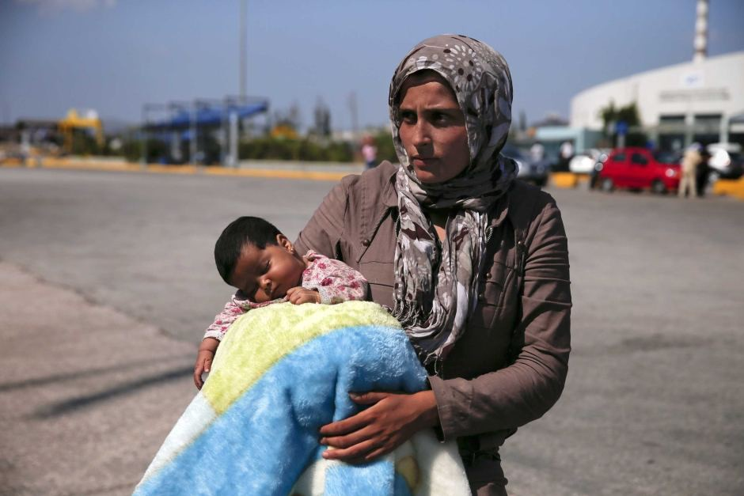
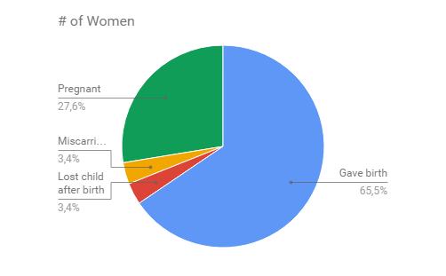
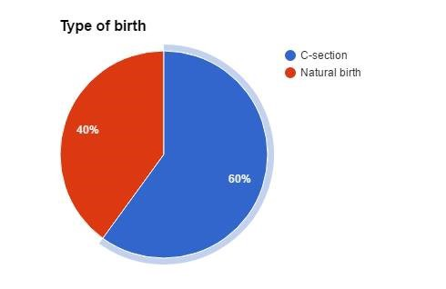
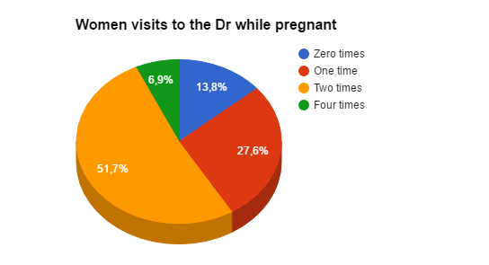
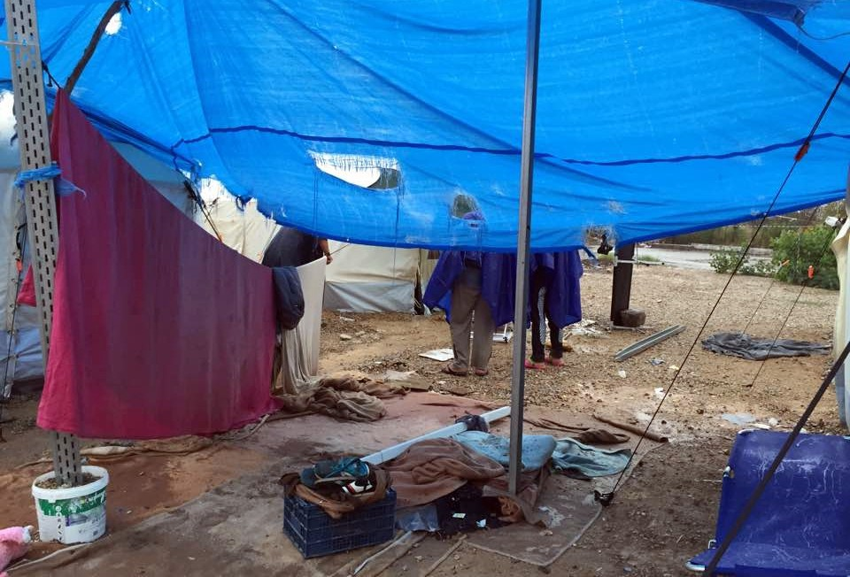
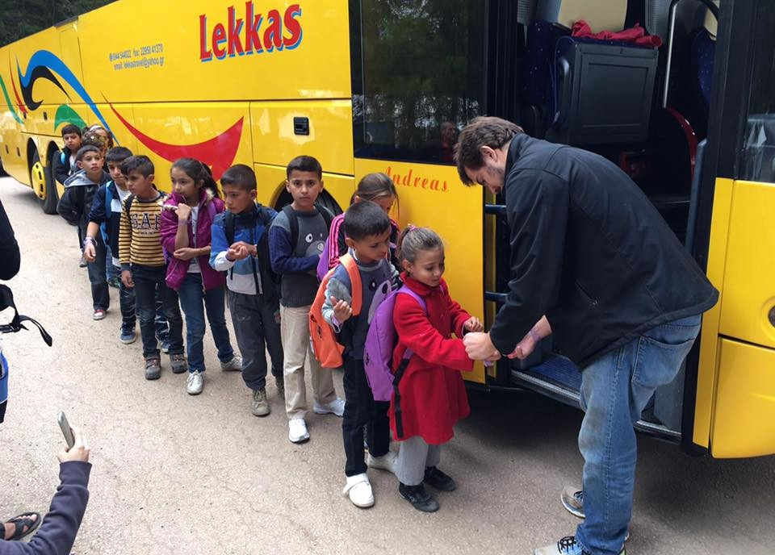
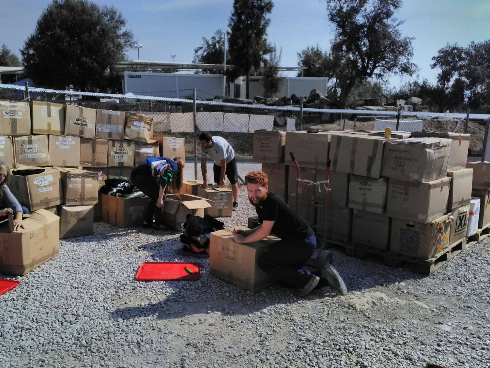
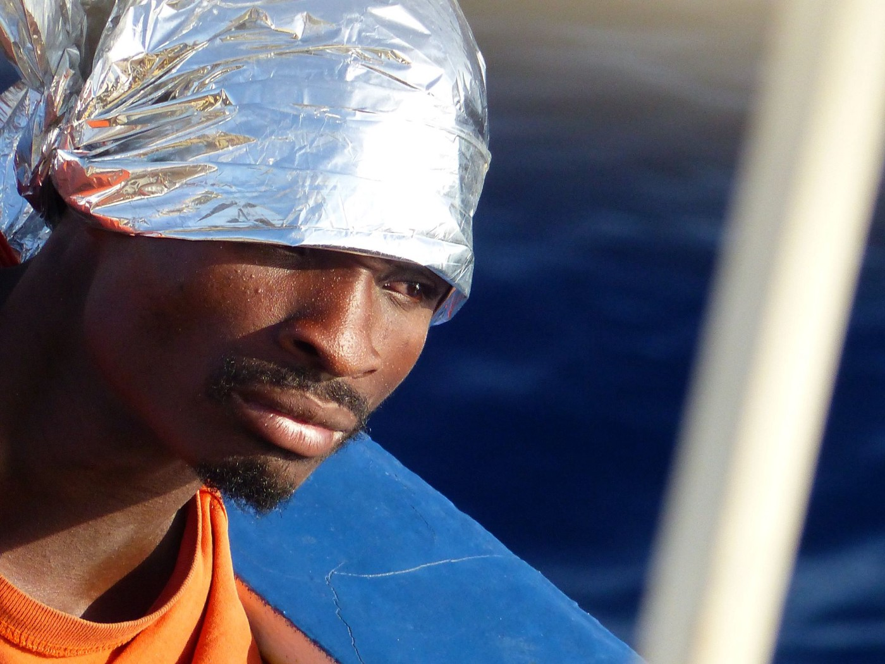
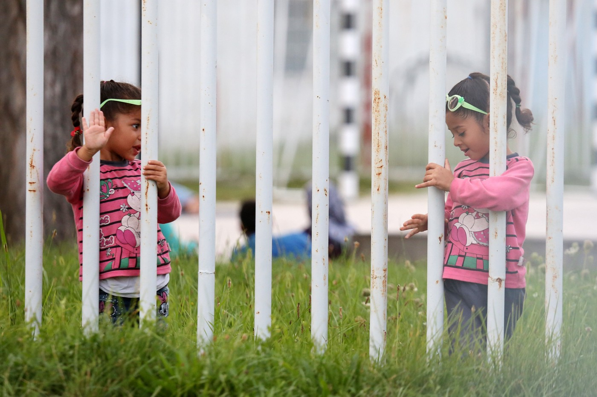
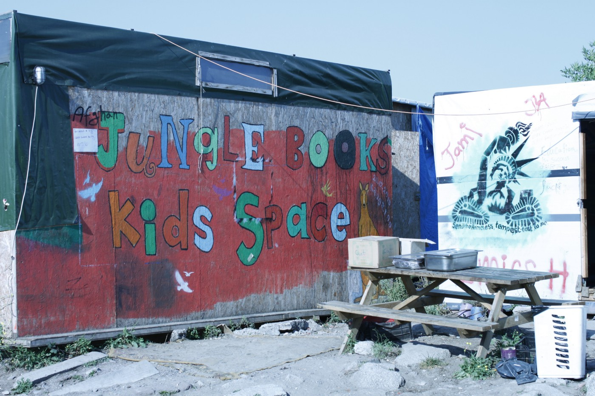

### AYS 22/10: Refugee mothers cut open, stitched up and sent back to filthy camps
#### Research reveals systematic mistreatment of pregnant women and mothers with newborns in Greek camps\. Children from Ritsona finally enter Greek school system\. Another tragic day on the Mediterranean\. Family with a newborn baby held in detention in Croatia\. A group of 54 unaccompanied girls from Calais arrives to the UK according to the Dubs amendment\.

Refugee mothers are one of the most vulnerable groups in Greece, but often not treated as such\. Photo: A\. Konstantinidis

The reproductive rights of refugees are firmly rooted in international law, but they are often neglected, if not completely disregarded on the ground\. In Greece, many refugee women are forced to undergo C\-section, even if they are perfectly capable of delivering their babies naturally\. They are quickly stitched up and sent back to filthy camps with wounds on their bellies and crying babies in their hands\. The volunteer community needs to put pressure on the authorities to provide better support to refugee mothers and their kids and we can’t do it without international support\. This is why our friends from Pleiades law group led by Electra Leda Koutra have conducted an important field research about reproductive rights of refugee women in Greece, in cooperation with Human Rights in Childbirth and with the humble support of AYS\. Today, we are ready to publish preliminary results and testimonies collected during the period of September/October 2016\.

**Many interviewed refugees have reported potentially life\-threatening complications for both mother and child resulting from living conditions \(including journey to reach Greece\) or denied/insufficient assistance\. In some cases, miscarriage resulted from denied assistance\.**

> “ At 3am my bleeding started\. I didn’t have emergency contact information\. No one did\. I had to wait until the camp manager came to the camp the next morning\. At 10am the camp manager came to the camp, and my sister\-in\-law spoke to her\. The camp manager said that the ambulance would not come to the camp because it was Saturday\. She suggested that I go to the MDM clinic, which is 10 minutes walk from the camp\. I was bleeding and she did not offer me a means of transportation at least to reach the clinic, which is 2 minutes away by car\. I went to MDM\. No gynecologist was there that day\. A general doctor visited me and injected a serum\. They returned me to the camp after my serum finished\. They said “We have no ambulance to take you to the hospital and you should go back to the site where you live and be picked up from there\.” I was at the office from 2pm until 9pm when the manager left\. I was in pain and I was screaming but she didn’t care\. I left the office and went up the stairs to my tent\. My pain got worse\. I went to the washroom and miscarried\. Ambulance came at 7pm the next day\.”, said the 35 year old woman from Afghanistan\. 

This research also reveals that 60% of refugee birthing mothers were subjected to C\-section without them being informed and providing valid consent\. None of the women interviewed by the volunteers were invited to question any form or decision being made for her\. **One of them underwent a removal of the uterus after the C\-section, without ever being informed about the reason why\.**

> “After 12 hours of trying to give birth naturally, they told me they will give me a C\-section\. While I was still awake and bound on the bed they started cleaning the area of my abdomen with alcohol\. I was scared and I asked the anesthesiologist for sedation saying in Arabic “Khadirini”\. The anesthesiologist started laughing and telling me “no Khadirini”\. I panicked and started screaming from the pain and the fear, so much that I tore the belts that kept my hands\. Luckily, at that moment, the doctors came in and started talking to me and relaxed me\.”, said a 37 years old mother from Syria\. 

No pain medication was given to women who did not have a CS\. Among the women who were subjected to CS, only 1 was given an epidural, while the others were subjected to total anesthesia\. No medical history could be taken before proceeding to anesthesia, because of a complete lack of translation\. All women who had a natural birth report having asked for pain sedation \(through hand gestures\), but they got the feeling, from the reaction of the medical staff, that this was not an option in the case of natural birth\.

**Almost all of the interviewed women faced discrimination during gestation or birth\. Among many reported issues, most of them have talked about inadequate accommodation, lack of safety, sanitation and hygiene, insufficient medical support, lack of female doctor personnel, no legal assistance and the worrying lack of information or inability to access information, including denied access or lack of translator\.**

Women are finding it extremely difficult to convince NGOs operating on camp to call an ambulance for their transfer to the hospital\. 100% report finding it extremely difficult to return to the camp or squat, since they had no money and no relative social support\. Risks and information about any interventions was never given\. No information was given on possible psychosocial support and “medical directions” upon exit from hospital\. Lack of interpreters is directly linked to the lack of informed consent\. Women have no practical and effective remedy at hand to achieve their information during labour\.

The problems they face in their place of accommodation after birth remain the same as above since the State once again did not take any action to provide them with better living conditions\. Additionally, they report a lack of provision for milk and specialised food for their children that forces them once again to buy it on their own and a pronounced absence of sanitary environment for them and their kids that puts them in a great risk of infections and contagious diseases\. AYS will keep on expanding on these findings, together with our colleagues from Pleiades law group\.
#### GREECE

194 new refugees have been officially registered in Greece, including 96 on Lesvos, 78 on Samos and 20 on Kalymnos\. According to volunteer sources, one boat carrying 20 refugees arrived to Skala Sikaminia north of the Lesvos island this morning \(Oct 22\) \.
### Heavy rain hits Greece: refugees report floods, cold weather and wind, calls for winterization of camps

](assets/22c5bfcfb838/1*HKc6RvC7KawBA_GebUAryA.jpeg)

Distrubing photo of flooded Katsikas camp taken by Muhammad Ali from Damascus / [KatsikasLive](https://www.facebook.com/KatsikasLive-1747980202123076/?ref=page_internal)

The storm had hit the western mainland and flooded the south of Aitoloakarnania prefecture hours before heavy rain moved to the Attica region, causing flooding and infrastructural problems in Athens and surrounding areas\. Tent\-based refugee camps have experienced severe flooding, which will continue to be a big problem as colder weather and rain is approaching\.

On their FB page, refugees from Katsikas camp have been posting regular updates, often describing the worsening of the situation due to the rain, wind and cold\. Their posts included a report about an inadequate concrete structure collapsing on the baby stroller \(the kid miraculously survived\) due to recent heavy winds in the camp\. Page administrators warn that many vulnerable cases are still living in the camp while the weather is getting worse and worse\. You can find their valuable updates [here](https://www.facebook.com/KatsikasLive-1747980202123076/) \.

Makeshift refugee shelters like these won’t survive heavier winds and rain\. Photo: Lisa Campbell

> Today it is raining — no, pouring\. The families living in tents are working feverishly to direct the rain away from their tents\. The temperature is 51 F and bone chilling\. These families need to move inside and even though I have had an architect draw up plans, no large government organisation has funding available so they have asked [Do Your Part](http://www.dyp3.doyourpart.org/) to do it\. Does anyone have a spare €120,000 laying around they would like to donate? — wrote Lisa Campbell of Do Your Part team, perfectly summing up the situation on the ground and inability of government and bigger NGO’s to provide support to the refugees\. 

In order to prevent further humanitarian catastrophe, refugees should be moved to closed facilities\. But knowing how slow and ignorant the authorities often are, volunteers are urged to help winterizing the camps\. This can include improving or providing better infrastructure, providing heating devices, bringing in more warm, rainproof clothes and blankets, and building draining systems in order to prevent the flooding of tents\. In the nearby future, we’ll try to make a list of all of the volunteer groups dedicated to winterizing the camps and/or moving refugees to better, solid facilities\.
### Kids from Ritsona camp finally enter the Greek school system, locals welcome them with a song

After months of preparation the Greek government is finally able to offer formal education for refugee children in Greek school\. Ritsona camp is the sixth camp involved in the schooling program\. Greek school is now running afternoons from Monday through Friday\. The lessons are Greek, English, Maths, Arts and IT\. The students will receive a certificate outlining how many hours they have done and this will be accepted by any European education system\. Therefore they can continue when they leave Greece\.

> There has been some disturbing images from protests at Greek schools when children from different camps attended\. However yesterday we experienced the complete opposite\! Greek parents cheered and sang as they welcomed the children and together planted an olivetree in honor of the event in school, wrote [I AM YOU](https://www.facebook.com/iamyourescue/) non\-profit that works in the camp\. 

**How to help & who’s already helping:**

**Party for the LGBTIQ\+ refugees in Athens** will be held on 25th of October, in order to show solidarity and raise funds to support them\. You can find more details about the event [here](https://www.facebook.com/events/1333567640010049/) \.

**Refugee Support Greece have set up a library** in Alexandria camp, and Anne Braak\-Katz has kicked it off with some Arabic books she’s brought over\. If you want to contribute, please contact [them](http://www.refugeesupport.eu/help-us-with-your-time/) \.

**Internews team has produced 40th issue of Rumors** , a valuable guide through all of the misinformation that’s circulating at the moment, together with reliable explanations of the topic\. You can find it [here](https://drive.google.com/drive/folders/0B-_rJ_0o5IZIaGV1TWVod1FzNzQ) \.

**Fresh Response has a new shiny wan** thanks to the support by Verein FAIR and IHA\. The old wan Zokhi, that was provided by Michal Borkiewicz and Bartek Sińczuk, remains active\. Click [here](https://www.facebook.com/freshresponseserbia/posts/1204218552958636?hc_location=ufi) to see them in action\.

**Three \(non\-killing\) clowns want to go to Malakasa** , but they need help connecting with volunteers and refugees of the camp\. If you want to help them, please contact [Chief Clown Officer](https://www.facebook.com/laurence.quetel) on FB\.

**Donation of 100 parcels from Starfish Foundation** was brought today to HSA warehouse in Kara Tepe\. Congratulations to all of the donors and volunteers who made this [big action](https://www.facebook.com/groups/Humanitarian.Support.Agency/permalink/941566145986731/) possible\!

100 valuable parcels have arrived to HSA warehouse in Kara Tepe today\. Photo: Fred Morlet
#### MEDITERRANEAN

11 people, including 7 adults and 4 children, drowned during the rescue this morning according to MSF\. 250 refugees were saved by SeaWatch2 vessel alone in the past 24 hours\. At 8am a small wooden boat carrying a single family was located and all passengers were brought on board the Dignity1 rescue boat\. At 8:30am another rubber boat arrived carrying many men & two bodies\. With the deck full Dignity1 could only hand out life jackets\. The Aquarius has brought 261 people on board this morning, including some rescued last night and some from a tiny wooden boat this morning\.
### Still no explanation for the violent attack by the Libyan coast guard in international waters\.

Volunteers are still assessing yesterdays violent attack by the Libyan coast guard and see no justification for it, as they were in international waters\.

> “This weekend we were able to rescue hundreds of people\. Sadly, our friends and colleagues at Sea\-Watch suffered a terrible tragedy\. They were prevented from doing their work by unfriendly attackers causing a refugee boat to break open\. Four people are confirmed dead by drowning and many more thought to be lost\. 120 people were saved\.”, Boat Refugee Foundation wrote in today’s statement\. 

The refugees were attacked on their way across the Mediterranean sea towards Italy\. Photo: Sea Watch

> “What happened in the last 48 hours?The passed days have been a challenge for all of Sea\-Watch\. Our crew was forced to witness people drowning that could not be saved anymore\. The lives of further hundreds of people could be preserved\. They are safe now\. We are still assessing and analysing yesterday’s incident, in which the aggressive behaviour of a Libyan boat caused the death of many people\. We are checking on numerous details and footage\. But did the Sea\-Watch 2 operate in Libyan Territorial Waters, following the accusation of the Libyan Coastguard? No\. The visualization of our data clearly proves that the vessel has not been within the 12nm zone at any time during the mission\. We don’t have any explanation for that inhuman behaviour”, says Sea\-Watch staff\. 

### Refugees survive entire day at sea off Spain

**29 refugees were rescued out of Granada** , Spain\. They were found 57 miles from the coast in a 2 meter boat\. Authorities were looking for them since Friday\. The boat left from the Moroccan town Bouyafar and got stuck in the sea\. It’s a miracle they managed to survive\.
#### CROATIA
### AYS visits a family with a newborn baby and two small children held in Jezevo detention site

Ježevo detention center — AYS volunteers have visited the closed detention center Ježevo, a 20 minute drive from Zagreb\. In this center people who are considered to be ‘illegal migrants’ are detained until the deportation or until they seek asylum in Croatia\. AYS volunteers managed to see the newly built \(2016\) structure within the center the construction of which is funded by EU funds money — this new structure is intended for vulnerable groups — families and unattended minors\. The structure is clean and almost empty — besides a Kurdish family with 3 children age 9 y, 6y and 7 days old baby\.

Jezevo has improved facilities for families and vulnerable groups, but it’s still a prison\. Photo: M\.P\./PXL

Although the general impression was that the police officers and the rest of the staff act decently and with care, that the structure is clean and that there are necessary utilities available — clean rooms, joint room with a TV, 3 meals per day, social worker and a doctor \(although 2 times per week only\), this is a closed center with surveillance cameras, freedom of movement is limited and it is surrounded by a high wall and razor wire\. Visits are aloud with the announcement in advance to the Ministry of the Interiors’ Department for borders\. What is worrying is that the new structure might mean more detained minors, families and children — this fact cannot be improved even by the availability of a new, modern playground in the middle of high walls, surveillance cameras and razor wire\. AYS volunteers did not see the rest of the center — the Kurdish family was allowed to meet other detained people in the other structure that hosts mainly single adults\.
#### FRANCE
### 54 unaccompanied girls finally taken out of Calais, brought to Britain under the Dubs amendment

Today [The ‘Unofficial’ Women and Children’s Centre](https://www.facebook.com/The-Unofficial-Women-and-Childrens-Centre-Jungle-Calais-160982470942565/) worked tirelessly with the home office to get the most vulnerable group in Calais camp — the unaccompanied girls to the safety of the UK\.

> 54 girls were brought to Croydon on buses and are now being taken care of by social workers\. This is incredibly special because 43 of them were TRULY ALONE in Europe and had no family they were trying to reunite with who would eventually look after them, say the volunteers from Help Refugees\. 

According to Refugee Info Bus, extra police and buses have been called to Calais today\. The prefecture have informed NGO’s that the total eviction of the Jungle will start on Monday\. In camp, there is an atmosphere of fear, resignation and frustration, at not knowing what will happen\.

Hundreds of makeshift shops, community centres and houses will be torn down as of Monday\. Photo: Refugee Info Bus

Hundreds of makeshift shops, houses and a church will be torn down as part of a massive police operation to wipe out the camp for good and send its 10,000 inhabitants to smaller camps dotted around France\. According to The Telegraph, around 12,000 refugee places have been allocated by the French government to various spots around the country\. They say welcome centres of up to 300 people will be set up in low\-populated areas, such as Auvergne, but in reality, many will end up living on the streets of Paris and other cities\. As the winter is approaching, and the streets don’t offer the same level of volunteer support as the refugee camp, their situation might turn to worse\.

> “The police are clamping down harsher than ever on people “trying\.” Many of our friends who have been arrested, have been sent straight to detention centres\. Just yesterday, we saw two refugees being arrested, on the side of the road by 5 police officers\. It is getting very dangerous for people to leave the “Jungle\.” The official policy of Dunkirk camp, is to send people to Calais\. Hotels, camping sites and hostels have been told that they must provide the passport details to the local prefecture, of all guests\. They have stated that they will not tolerate anyone providing accommodation to “activists” or “migrants\.” The full force of the law is being inflicted on refugees, as the authorities are on the cusp of erasing the more visible face of this “refugee crisis,” from the Calais landscape\.”, wrote Refugee Info Bus in today’s [statement](https://www.facebook.com/RefugeeInfoBus/photos/a.1756184407950313.1073741828.1756144974620923/1848890652013021/?type=3&theater) \. 

_Converted [Medium Post](https://areyousyrious.medium.com/ays-22-10-refugee-mothers-cut-open-stitched-up-and-sent-back-to-filthy-camps-22c5bfcfb838) by [ZMediumToMarkdown](https://github.com/ZhgChgLi/ZMediumToMarkdown)._
