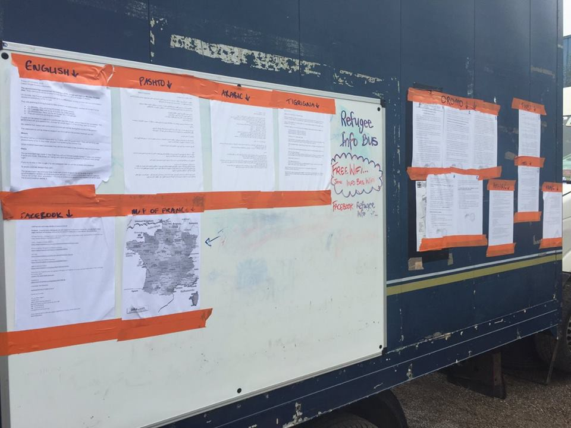
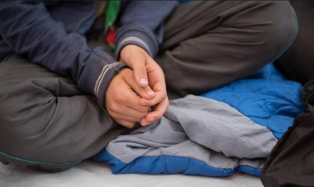
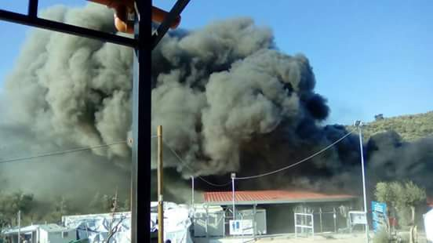
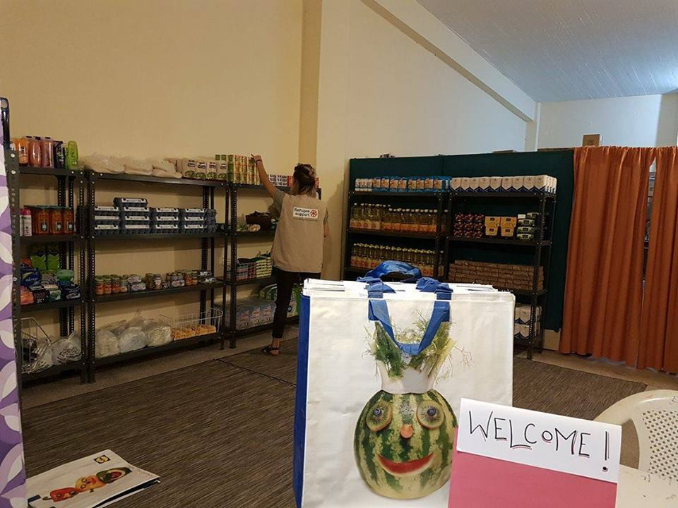
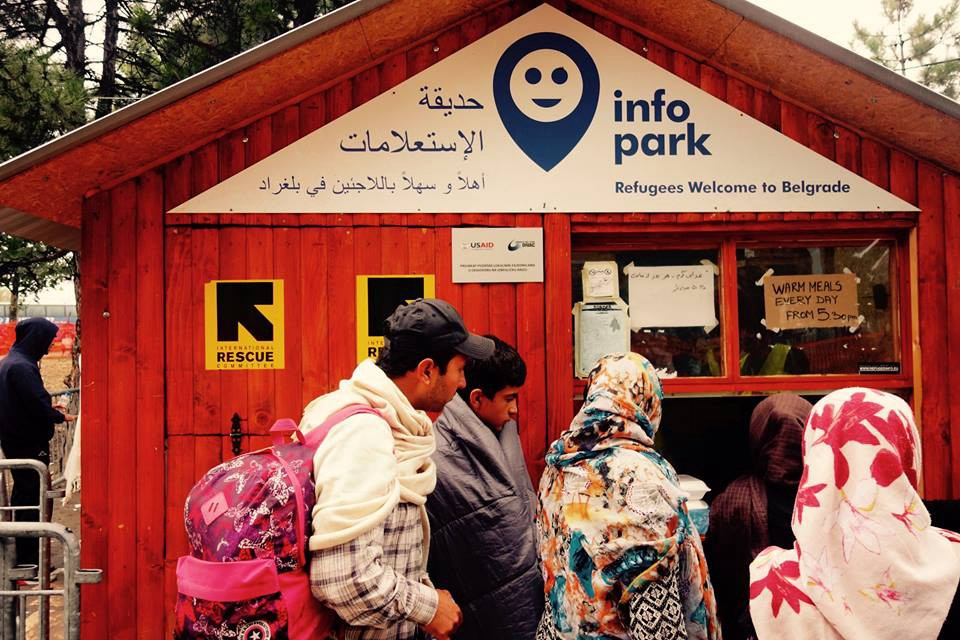

### AYS digest 24/10: Evictions, persecutions and fires — welcome to Europe of today

First day of “final” eviction of the Jungle / Confusion as to where people are going especially when it comes to unaccompanied minors / Fire in Moria camp, EASO staff left the camp, unclear when the procedure will continue / Info park kiosk closing, but organization is continuing the work in the streets of Belgrade / Ahmad H\. trial to begin soon, if you were at Rozske — you can help with additional video materials and testimonies

First day of evictions in Calais, 1200 police depoloyed
### **First day of “final” clearing of “The Jungle”**

As we have been reporting, today the announced final eviction of the Jungle has begun\. Just as a small history reminder — the Jungle was first acknowledged by the humanitarian organization before seventeen years, even though the stories and legends of this hotspot are even older\. Today, the French government has started what they perceive as the final action of ending this story, but as long as there are such “hard” borders as the one between France and U\.K\. there is reason to believe that there is no “quick fix” for such things\. Several associations believe that refugees will stay or come back to Calais, forced to sleep in the city centre or below bridges and fear the creation of smaller camps in the region\. Be the future and history as they may, the authorities have organized a steadfast action that aims to empty and “destroy” the settlement in one week\.

Around 1200 police officers have been deployed for this action and total of 60 buses are driving around the clock in an action to relocate those who have stayed \(by some reports 6500\) \. Many have moved by them selves \(around 3500\) and around 200 unaccompanied minors that have been allowed to go to U\.K\. out of more than a 1000 that have been registered by September census\. As we have reported tensions were high yesterday, but today it seems that today most of the people left peacefully\.

Leaving the Jungle

As Calais Action reports many of them are tired of the horrible conditions in the Jungle and are hoping for better accommodations in other settlements\. This, according to the reports, prompted people to carefully prepare for the dignified departure\. Many groomed themselves, but more interestingly for all of you who answered the call for donation in suitcases — they really helped people to leave in as dignified way as it was possible\. They carried their belongings in those suitcases and hopefully will use them in a better place then that they have been living for months on\. For more on the atmosphere watch the video bellow:

Calais is a place that seems as if it is the end of the world, probably the worst place one can find themselves at, but as Refugee info bus reports — many do not know where they are being taken away since authorities have not provided this information and the only thing people have to go on are leaflets distributed by the mentioned organization\. In a move so familiar to all of those on the move, as to us working with them — authorities did not consider that they are dealing with people with their own dignity and rights and did not see fit to properly inform about where people are going to after the Jungle\.

Refugee Info Bus
### **Info on the eviction procedure**

Depending on the aimed destination, the refugees get a colored wrist\. If 50 persons have the same wrist, the bus is leaving from Calais\. The first one left in the morning with 50 Sudanese refugees to Burgundy\. 2000 refugees say, they want to stay in the Jungle\. They will have to face arrest and deportation\. Another 600 refugees have disappeared, before the eviction started\. 45 out of a planned 60 buses left Calais today, with 1,918 refugees on board\. 400 kids were placed in a ‘temporary reception centre’, until their case is examined\. Women and families were particularly absent and women seemed uninformed about the procedure\. For more on the procedure follow this [link](https://www.facebook.com/HelpRefugeesUK/posts/325644464462900:0?hc_location=ufi)
### **Unaccompanied minors**

The confusion becomes really alarming when it comes to unaccompanied minors\. It seems that 49 of them are still kept in the Jungle in order for world forces to decide what to do with them\. We bring you the report about the situation with unaccompanied minors from Help refugees in full:

“Our team on the ground have informed us that The Home Office have NOT been allowed to register children today\. As such, the most vulnerable group, the under 13’s \(who would qualify under the Alf Dubs amendment\) are being forced to remain in the Calais camp itself amidst all the confusion and chaos\.

Our latest census shows there are 49 unaccompanied children in the Calais camp who are 13 years old or under\. All are eligible under the Dubs amendment for resettlement in the UK\.

There are also many unaccompanied girls remaining in camp who are eligible to come to the UK but who were not registered over the weekend\.

The shipping containers on site in the Calais camp were emptied of residents at 7am this morning, on the understanding that unaccompanied minors would be housed there until they were properly processed \(either sent to the UK under Dubs or family reunification, or suitable accommodation was found for them in France\) \. However, the minors already living in the containers were ALSO asked to vacate this morning\. Children are being asked to go to the warehouse for registration to queue up to then be sent back to the containers\. Others are being told registration has stopped for the day\.

This chaotic set up is extremely distressing and confusing for the lone minors, the youngest of which is 8 years old \(according to our last census\) \. The younger children are struggling to understand where they are supposed to go, and how they are supposed to get there\.

Up to a thousand children are expected to be housed in the shipping containers and at present it appears there is nothing in the way of youth workers or social workers to be responsible for, and help calm these young people and children\.”

UK Home Secretary Amber Ruud defends the slow process to bring unaccompanied minors to the UK, saying her administration received the green light from French authorities to interview these kids only last week\. She adds that “several hundred more” will arrive in the next three weeks and that “Dubs children” have not been brought over until recently because the French government feared it would encourage more kids to come\.
#### Greece
### Fire in Moria

Moria camp

There was 92 new arrivals at Greek island in the last 24 hours\. As for the numbers game situation remains pretty much the same, but, or precisely because of that fact the fire broke out in the Moria center on Lesvos where over 6000 people wait for months to have their claim processed\. As Kathimerini news reports “Asylum\-seekers attacked the premises of the European Asylum Support Office \(EASO\) on the island of Lesvos on Monday, protesting against delays in dealing with asylum claims, Greek and EU authorities said\. About 70 people, most from Pakistan and Bangladesh, threw rocks and burning blankets at EASO containers inside the Moria migrant camp, damaging three of those, a Greek police spokesman for the island said\.” EASO staff has evacuated the camp and have announced that the process will be halted for unforeseeable time\.

Fire in Moria
### Portugal wants to relocate 450 Yazidis, Greek administration says its discrimination

On the other side of Europe, Portuguese government has been pressuring Greece for the last 6 months to give home to 450 Yazidis\. Portugal is also willing to make the exception to the relocation rule and keep the community together instead of spreading it around 70 counties like with the rest of the refugees\. Greek government and its defense vice minister Dimitrios Vitsas, do not agree with such request , they consider it discriminatory and against the European rules for relocation, since they priorities vulnerable cases — which Euro parliamentary, Ana Gomes, considers outrageous due to the proven vulnerability of this community\. In this process families must elect Portugal as their preferred country in their asylum application, there were a few that already applied, but many are reluctant because they have family members in Germany\.
### New relocation statistics

As for relocation in general, on the 21st of October the Greek Asylum Service published a new relocation statistic\. You can get an overview, which country is taking how many applicants and how high the rejection rate in every country is\. Liechtenstein and Norway are also part of this statistic\. For more follow the link [http://bit\.ly/refugees\-info\-sheets](http://l.facebook.com/l.php?u=http%3A%2F%2Fbit.ly%2Frefugees-info-sheets&h=3AQF0nhf-)
### Dietitian offers help

In more helpful news, a dietitian who has recently volunteered in Greece with the Nurture project offers her help to any other organization in need of such help\. If you are a part of such organization, contact Zoe at [zoe@zoeconnor\.co\.uk](mailto:zoe@zoeconnor.co.uk)
### Mini market opened in Filippiada

Also, Refugee support group from Greece reports Big news in Filippiada: “our free mini\-market has opened\! Our volunteers have created a pleasant, calm shop environment and we are using a unique points system so that refugees can choose what they need rather than being given a set basket\. This is a huge leap in dignity\. Thank you to all our donors who made this possible and to [Live for Lives foundation](https://www.facebook.com/liveforlivesfoundation/) whose lovely volunteers emptied shelves from the local supermarket so that we can offer great choices on our first day”
#### Serbia
### Info Park closing

With around 1000 refugees on the streets of Belgrade, Info park has been moved from the park next to Bristol hotel\. As the organization has pointed out — they will distribute help around the places where people currently settle, but also will move into new place starting October 1st\. There they will have other activities besides the ones they were doing up until now\.
### Volunteer in Serbia

If you are willing to volunteer teaching English, please contact Refugee aid Serbia on their FB page and for more information follow this [link](https://www.facebook.com/refugeeaidserbia/posts/1719784095011442?hc_location=ufi)
#### Hungary
### Rozke trial

As the trial for Ahmad H\., one of Roszke 11 is approaching, people from Free Roszke campaign need help and support\. Ahmad’s lawyer would like to postpone the trial and for that he needs different narratives of the happenings than the current ones, that is mostly the testimony of the police\.
### **If you were at Rozske last year, please please read this — testimonies and video material needed\!**

For that Free Roszke is looking for video materials, photos and personal testimonies from people \(journalists, activists\) who were present at the border on the 16th of September 2015\. Contact Free Roszke if you were on the border when the protest happened, and if you could provide video materials or/and you’d be willing to give testimony at the court\! Also you can maybe contact people who were there\. The deadline is the day of the trial, that is the 28th of October 9:00, but the lawyer wants to send the details before\. He needs nothing else than the name and address of the witness\.
### **Demo in Budapest**

They will also organize a smaller demonstration in Budapest on the 28th of October at Deák Square\. At the same time demonstrations will take place in Vienna, in Berlin and in Malmö\. On the 3rd of November we plan to organize another demonstration and press conference\. For more information see: [www\.freetheroszke11\.weebly\.com](http://www.freetheroszke11.weebly.com/) \.
### **Come to the demonstration in Budapest\!**

After all the confusing information about the trial we couldn’t make a wider international call to protest, but we really would like if you could join us on the 28th of November\. Write to Free Roszke team if you can come\!

Solidarity with Roszke 11\!

_Converted [Medium Post](https://areyousyrious.medium.com/ays-digest-24-10-evictions-persecutions-and-fires-welcome-to-europe-of-today-efd3ca5a8be5) by [ZMediumToMarkdown](https://github.com/ZhgChgLi/ZMediumToMarkdown)._
