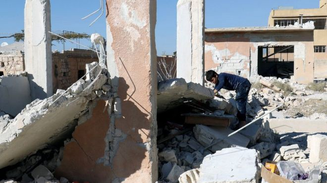

### AYS News Digest 27\.10 — As Syria burns, Putin hints at massive push to take East Aleppo\.

A child looks through debris following yesterday’s airstrike on a school in Hass, north of Idlib\. Photo Credit: Reuters
#### Feature
### “A nest of terrorists”

Speaking today at a conference in Sochi, Russian president Vladimir Putin had the following to say:

> [The bells toll for the dead of Aleppo\. Let us also toll them for the dead in Mosul\. A military operation has begun in Mosul\. Already, more than 200 people have been murdered by terrorists in the hopes of slowing the advance on the city\. Let us not forget that\. In Afghanistan, one air strike kills 120 people\. We have forgotten about this\. And what is now happening in Yemen\. Bells must toll for all of these innocent victims, I agree with you\. And yet, all we hear is, “Aleppo, Aleppo, Aleppo\!” Thus stands the question: either we leave there a nest of terror, or we do everything to avoid deaths among the civilian population while bringing an end to this “nest”\. If we mustn’t do anything at all, then nor should one advance on Mosul, let’s leave everything as it is\. Let us leave Raqqa alone\. But we hear from our partners, “we must advance on Raqqa, we must destroy this nest of terror\!” But in Raqqa too there is a civilian population\. Are we to leave them alone entirely? When they capture hostages, are we to leave them alone?](http://www.vesti.ru/doc.html?id=2815274) 

While Putin is correct in his assessment of the hypocrisy and the selective outrage voiced by the United States and its military allies, this is undoubtedly a case of the pot calling the kettle black\. All lives are valuable, and every victim of war is a calamity, be it in Syria, Yemen, Iraq, Afghanistan, or in one of the other countless active war zones\. So why then are Russia and the regime bombing rebel\-held territory indiscriminately? Why does the Russian ambassador to England have the audacity to claim that hospitals are legitimate targets because they supposedly serve as a front for “terrorists”? Why is Eastern Aleppo being blockaded as food, medical supplies, and other necessities, which the city’s 200,000 civilian inhabitants need, are dropping to critically low levels? If these are all hostages of the ‘terrorists’ occupying the city, why do so few leave despite repeated regime insistence and threats? Why does Russia continue to support the Syrian regime which has inflicted by far the largest civilian casualties of a war that is quickly approaching its sixth year with no end in sight? For whom do your bells toll, Mr\. Putin?

Eastern Aleppo after 5 weeks of relentless assaults\. The dotted lines represent territories captured by the regime\.
### The Hass school bombing

The Syrian regime and its Russian allies have been hellbent on bringing rebel\-held areas of Syria to their knees\. The cause of East Aleppo is only the most publicized of these outrageous war crimes\. Yesterday in the town of Hass north of Idlib, the bombing of a school by jets claimed the lives of 35 people, the majority of whom were children\. Was this school too a nest of terrorists? Russia continues to deny responsibility for the attack, making the absurd allegation that the ruins are not consistent with the aftermath of an airstrike\. But even if the attack isn’t Russia’s doing, then regime jets were the ones to inflict the damage\. If this is indeed not Russia’s doing, and Russia is as outraged by this crime as the rest of the world, why do they not reprimand their ally?

### Syrian women’s scars run deep\.

The Syrian High Negotiation Committee, an assembly of opposition groups working for peace in Syria, warns about women in Syria who _“hold scars from a brutal war now in its sixth year”\._

Expressing their admiration for the courage of women in war, the HNC believes that it is only with women that Syria will find a successful political transition and a path to peace\.

_“We heard about the efforts of Syrian women on the ground to keep their local communities running despite the tremendous challenges they face\. They articulated legitimate demands on how we can reach a political transition for Syria\. The women made clear to us how they want — and need — to play a greater for a future Syria…_

_According to some media, the US administration is now considering airstrikes against Syrian military positions as retaliation for attacks on civilians in Aleppo, in the form of a so\-called “no\-bomb zone”\. Similar arguments are being made at the UK parliament\. The HNC and a vast array of Syrians from across civil society, human rights defenders and civilian activists, have argued in favour of a “no\-bomb zone” as the only way to effectively protect civilians in Syria and we welcome the news that the international community is discussing it as a credible option\._

_But words are not enough\. The international community must act now to ensure that civilians are protected and no longer targeted\._

_The international community — and in particular the European Union — must recognise and join these efforts\. We are all in debt to the scores of innocent children who lost their lives or were victims of war crimes in Aleppo and across Syria\. We owe their mothers, fathers, and communities our efforts to end the conflict and ensure that those responsible will be brought to justice\. We know that the women of Syria are increasingly participating in this effort\. It is time for the international community to empower and protects them in return\.”_
### Mediterranean
### 2016 has surpassed 2015 as the year with the highest number of casualties on the Mediterranean crossing\.

The UN has confirmed that at least 3,800 have been reported dead or missing this year, ahead of last year’s figure of 3,771, and there will still be two months to take account of\. This comes even as the number of Mediterranean crossings has dropped in comparison to last years, and estimates show that 1 in 47 refugees crossing from Libya to Italy have died\.

Photo by MSF Sea
### 29 corpses found aboard boat off the coast of Libya\.

The boat was found by MSF, filled with a mixture of water and fuel and the victims were found to have died of suffocation, burns, or drowning\. Over 100 were rescued from this boat, many of whom also suffered from burns\.
### Sea\-Watch is looking for a new captain and machinist\.

Please send your application \(with all necessary papers\) to crew@sea\-watch\.org\. Subject “NOVEMBER Captain / Machinist\.
#### Greece
### NATO to intensify efforts to prevent refugees from crossing the Aegean\.

NATO’s plan consists of sending war ships to patrol the seas to deter smugglers\. Turkey opposes the plan, saying that such a presence is unjustified given that today’s flow is but a small trickle in comparison to what it was in the recent past\.
### 103 new arrivals to Lesvos brings number on island back up to 6,000 for the first time since September\.
### Fundraiser begins for LGBTQ refugees in Greece\.

Reviled by their compatriots, looked upon with suspicion by Greek authorities, and afraid to leave their homes from fear of harassment \(or worse\), LGBTQ refugees face particularly dreadful conditions\. You may help them in their plight by contributing [here](https://www.youcaring.com/lgbtqi-refugees-in-greece-679429) \.
### Greek Asylum Service releases instructions for refugees whose Protection Applicant Card was stolen\.

**_How to get a new card:_**

> Go to the Asylum Office that issued the card, and then inform the staff there that you have lost your International Protection Applicant Card;
 

> The Asylum Office will issue an attestation letter confirming that the card has been lost;
 

> Go to a police station with the attestation letter and declare that your card was lost or stolen;
 

> The police will provide a notice;
 

> Return to the Asylum Office with the police notice and request a card replacement\.
 

> Please note that the process for replacing the card will take at least two months\. Until you receive a replacement card from GAS, you must keep with you the police notice and the GAS attestation\. \( [Source](https://newsthatmoves.org/en/explaining-protection-cards/) \) 

### Legal info workshop to take place in Micropolis, Thessaloniki\.

If you have any legal questions, the [Mobile Info Team for Refugees in Greece](https://www.facebook.com/events/1677186699170448/permalink/1677193762503075/) is devoted to informing refugees about their rights\. More information may be found on the [Facebook event](https://www.facebook.com/events/1677186699170448/?acontext=%7B%22feed_story_type%22%3A%22308%22%2C%22action_history%22%3A%22null%22%7D) \.
### Warehouse volunteers needed on Lesvos\!

[Save Assist Outreach](https://www.facebook.com/save.assist.outreach/) is currently looking for volunteers\! Are you interested in working with us on Lesvos and support our warehouse project Attika? Please spread the word — thank you\. For any questions about our volunteer work please write to volunteers@sao\.ngo\.
#### Serbia
### Kelebija Community Center needs your help\!

“ 15 euros can support tea/snack distribution for one day\. 
 20 euros can help us fund much\-needed infrastructure repair/expansion and cleaning costs\.
 50 euros can pay our rent and electricity for one week\.
 Temperatures are hovering barely above freezing overnight, so many people are relying on heating and electricity at the space, meaning our costs are spiking\.”

You may contribute [here](https://www.youcaring.com/kelebija-community-center-675966) \.
### Bulgaria

The president of the Bulgarian Helsinki Committee, Krassimir Kanev, was assaulted by two men on the morning of October 27 outside a central Sofia hotel, the committee said\.

_“Over the years, staff members have been repeatedly harassed and threatened because of their work in defence of human rights in Bulgaria, but so far had not reached a physical assault,”_ the BHC said\. This group is involved in work with refugees in Bulgaria providing one of the rear reliable sources of information\.

Information about refugees in this country is still hard to find\. IOM estimates that currently there is 6,969 people in overcrowded centers around Bulgaria\. According to the same source, among refugees in this country, are manly people from Afghanistan \(48 per cent\), Syria \(22 per cent\), Iraq \(20 per cent\) and Pakistan \(seven per cent\) \.

People are still arriving, on a daily basis\. In the period between October 13 through 19, 796 people were registered as new arrivals\.

Local authorities are not willing to deal with the issues that people who are searching for refugees have\. Bulgaria’s Defense Minister Nikolai Nenchev told the media that, _“the refugee crisis is a problem jeopardizing the national security of Bulgaria directly\. We shall commit ourselves to protecting our state borders most earnestly,”_ announcing that if people continue arriving in big numbers, 2000 soldiers can be deployed along the border within hours\.

This attitude by the government, and pro government media, incites hatred toward refugees\. It is often that anti\-refugee protests are organized, and close to the border areas, there are still people who are engaged in illegally search for people who are crossing\.
### Belgium
#### 4000 euro per day fine for refusing to issue visa to Syrian family

A Syrian couple, with two children, currently in Aleppo, requested a visa to join a family in Belgium, who were taking responsibility for accommodating them, but they were refused the visa that, according to the Aliens Litigation Council, they have a right to\. However, the Secretary of State for Asylum and Immigration refused to grant it\.

The court imposed a penalty upon Belgium of 1,000 Euros per family member per day, for the duration that the family do not receive the visa\. The state filed an appeal and the Secretary of State announced they will “exhaust all judicial procedures” to win the case\.
### France\-Calais Eviction update

No good news from Calais\. Treatment of unaccompanied children by the French government during the eviction is more that reason to be worried\. The media and volunteers are reporting about scores of unaccompanied children who remained unaccounted for in an increasingly chaotic situation at the Calais\. According to some estimates, about 100 children are left without adequate safeguards\.

_“Everything has been destroyed, so we are very worried about the unaccompanied minors\. We’ve been told the container camp is full, we’ve also had reports of children who’ve lost their wristbands giving them entry or those who’ve had them ripped off them in the struggle to get access\. Where they will sleep tonight is a massive concern,”_ said a Doctor of the World spokeswoman\.

](assets/c5c8ee44d2c/1*U377IGCvgxbxxxWL1fP40g.jpeg)

“These are children left sleeping outside at Calais camp\.” By [**Glenys Newton**](https://www.facebook.com/glenys.newton.58?fref=nf)

Volunteers from [**Refugee Rights Data Project**](https://www.facebook.com/RefugeeRightsData/?fref=nf) are reporting dozens of children who slept on the cold ground in front of the containers they were supposed to be housed in\.

_“Volunteers have watched over them, when no one else would\. They were not given accommodation because they hadn’t been registered\. They weren’t registered because registration for minors was closed at 1pm yesterday, and hundreds of children were sent back into a burning Jungle\._

_The Prefete Fabienne Buccio stated their “mission was accomplished”, the Jungle is empty, all children are in state protection\. That is a lie\. We are terrified that hundreds of children have been forgotten and will not be granted the protection they deserve\._

_This morning, at least 100 children were waiting in the minors’ line to be processed at the registration centre\. The centre was closed, and no officials present\._

_We plead with the French and British authorities to grant these incredibly vulnerable children protection as a matter of urgency\.”_

The same organization made public results of the research from February 2016\. They surveyed 870 people living in Calais\. These are some of the gathered data:

ARREST AND DETENTION OF CHILDREN IN CALAIS:
\- 49\.6% of children surveyed in the Calais camp said they have been arrested or detained since arrival in Calais\.

\- The average period of detention was a few days\. However, a 15\-year\-old claimed to be held by the French authorities for 60 days, while a 17\-year\-old reported being detained for 40 days\.
- Respondents reported that the conditions experienced within detention centers do not satisfy humanitarian standards:
- Many interviewees explained that they had little or no access to food or water\. Toilets and shower facilities were also scarce, if not completely unavailable\. Some reported being kept in darkness for long periods of time\. Others found that they had no opportunities to walk or exercise\.
- One 15\-year\-old said, “they gave me no food or water and kept me in a cold place”\. Another minor reported that his friends returned with no money and all their hair cut off\.

\- Many respondents \(adults and minors\) reported being detained in Calais following arrest, but some were sent further afield — held in detention centres as far away as Paris, Rennes, or close to the French borders with Italy and Spain\. On release, many found themselves in a new city with no money\.

\- Many respondents reported excessive police violence during arrests — regularly involving severe beatings and pepper spray, or unorthodox methods\.

\- In other instances, respondents experienced verbal abuse with police using swear words and profanities as they sent detainees away\.

[Human Rights Watch](http://linkis.com/www.hrw.org/news/201/U0Dn8) also warns that authorities “acted prematurely on October 26, 2016, in ending registration and relocation of children and adults from the Calais migrant camp”\. They found that for unaccompanied children, the registration process was plagued by significant problems\.

> “Unaccompanied children were supposed to have had a designated line to allow them to register and receive temporary accommodation in an area of the camp made up of converted shipping containers\. But each of the three days of registration ended with large numbers of children still waiting to be seen\. Most of the children turned away on October 26 had lined up before dawn after being sent away at the end of the day on October 25\. 

> Unaccompanied children’s sense of safety diminished with each day as the adults they had lived with departed\. A volunteer in the camp told Human Rights Watch, “Many of these adults were, in effect, raising other people’s children, and now they’re gone — leaving kids without the little protection they had\.” 

Authorities failed to ensure that accurate information reached all children, and unaccompanied children faced practical barriers in access to the registration process, HRW adds\.

These young boys have nowhere else to go, they’re sat in a smouldering tent waiting to hear what will happen next\. \. By Care4Calais\.

In the meantime, embarrassing pictures are coming about methods used by the police to take people away from the camp\. They put plastic covers on the seats in busses that were taking away people from the Jungle\.

Is this really necessary?

Despite this violent eviction, people keep coming to France\. The latest news from Paris is that a new big “wild” camp is born in 3 zones of the 19th neighborhood of the capital, next to Stalingrad metro station\. According to volunteers from the field, there is about 3000 people in this area\. Paris council promised to create a shelter for hundreds of people but now has no solution for the amount of people that arrived in the last few days, many of them are coming from Calais\.

Early morning\. …\.Time to leave the place we called home\. \. \. By Ifty Patel

Donations are still needed for all the people from Calais\.

“We’re only asking for a few specific men’s items that we are very short of, as well as food\. Please hold on to other donations that could be suitable while the situation develops\. There are some items we are unlikely to need soon \(children’s clothes, mattresses, sanitary towels…\) \. Many others items we will quite probably need again in a few weeks’ time, but we cannot be certain of this at the moment\.

The men’s clothes we can receive right now are the following:
men’s underwear \(new\)
men’s waterproof jackets, size S and M
men’s hats
men’s gloves
men’s socks
Trainers

The food items we want are the following:
Vegetables that you can keep like squash and pumpkin
Spices, especially chili flakes
Big tins of tomato
Lemon juice
Courgette
Fresh tomatoes
Onion
Garlic
Sea salt
Olive oil
Cooking oil
Pureed tomato
Milk
Tea

The kitchen also needs:
Bin bags
Cling film
Tin foil

For anything else, please hold on to it for now if you can\.
Thank you for your patience in this complicated situation\.

Please email calaisdonations@gmail\.com to book a delivery or if you have questions\.

Amazing photo series by Jess Hurd on Calais eviction

_Converted [Medium Post](https://areyousyrious.medium.com/ays-news-digest-27-10-call-to-empower-syrian-women-c5c8ee44d2c) by [ZMediumToMarkdown](https://github.com/ZhgChgLi/ZMediumToMarkdown)._
