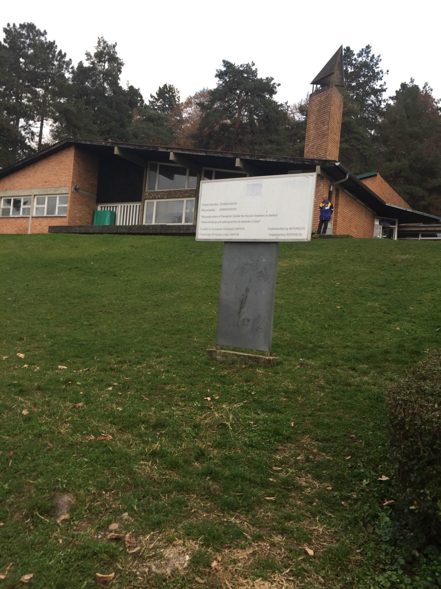
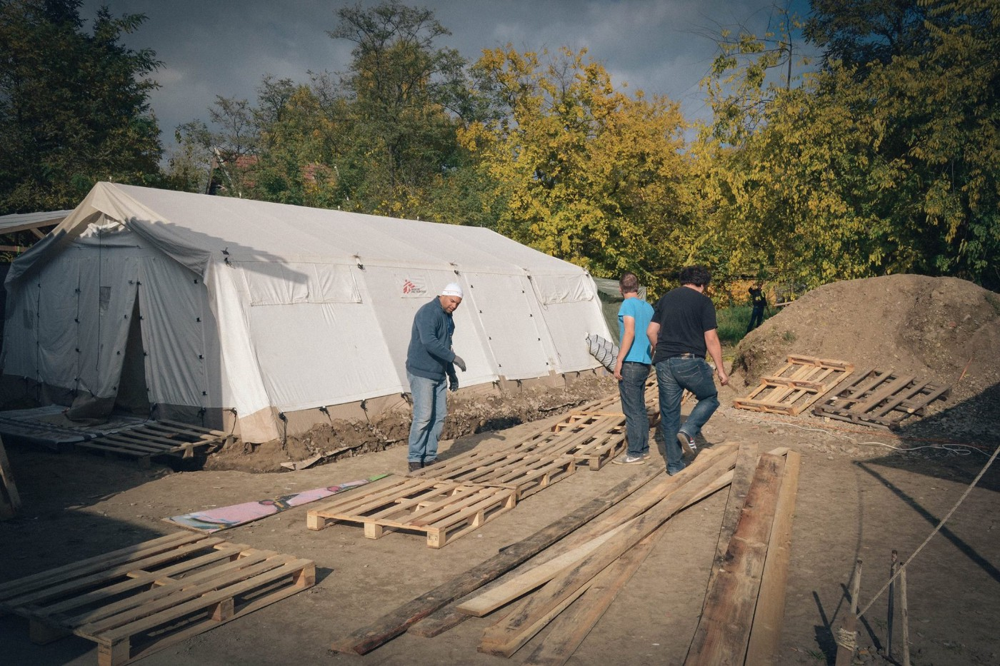
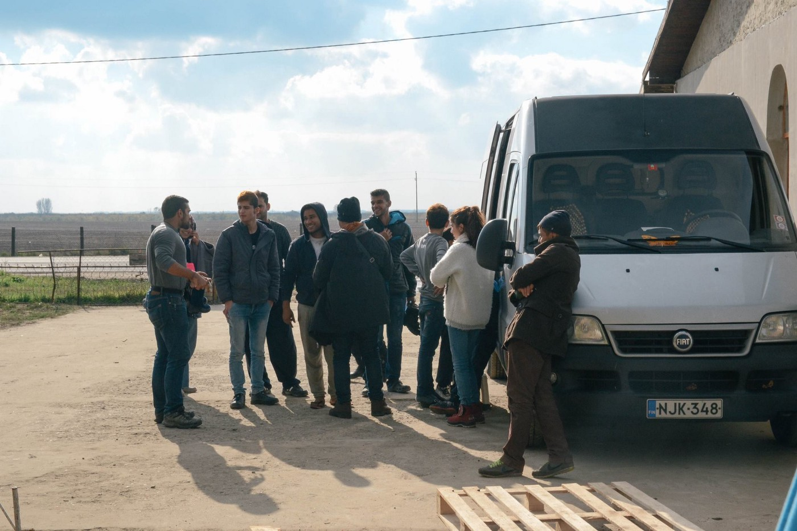
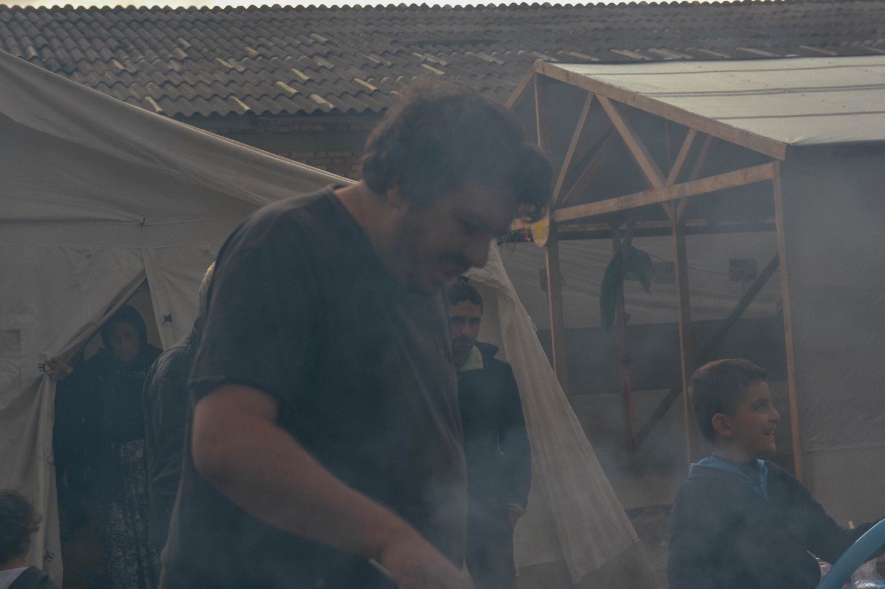
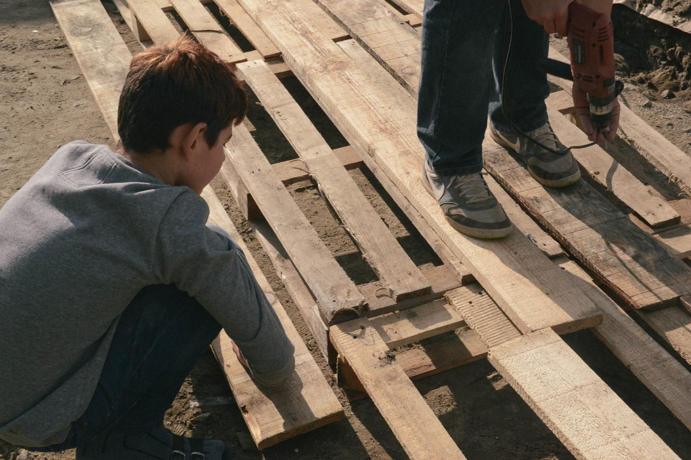
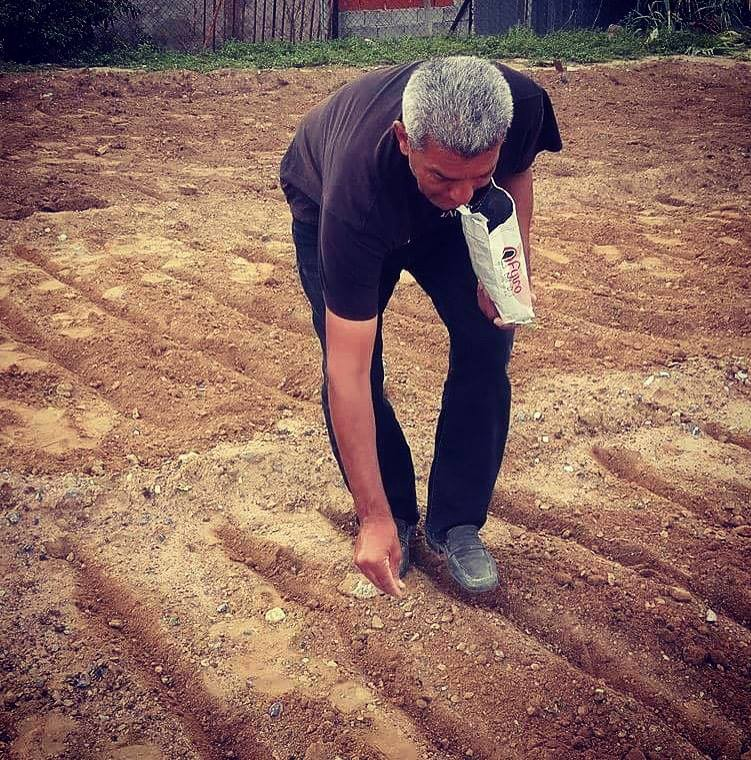
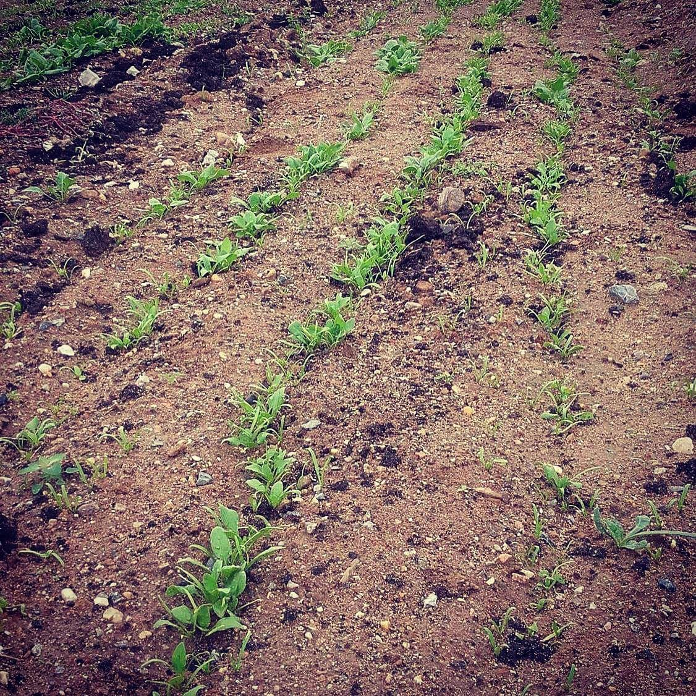
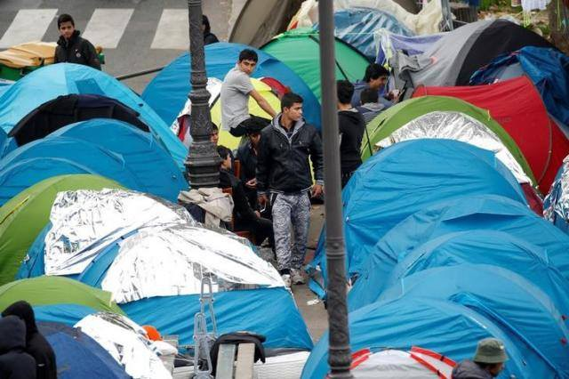

### AYS DAILY DIGEST 29/10: Montenegro — a new route for refugees in the Balkans?

_Group of refugees arrested in Montenegro after trying to enter from Serbia by train // New arrivals registered daily in Serbia // EU\-countries refuse to send asylum experts to Greece // Over 27\.000 people arrived in Italy in October // Children of Calais need our help_

](assets/b7d5c72cba96/1*_McvszTjbFA8YddQrGR6CQ.jpeg)

Hasakeh province, Syria 26 October 2016, An Iraqi refugee child who fled Mosul, looks to the sky at the Al\-Hol refugee camp in Syria’s Hasakeh province\. War operation in\. Mosul forced millions of people to flee their homes\. Many are still trapped on the border between Iraq and Syria\. Photograph by Delil Souleiman [Art Against](https://www.facebook.com/artagainstproject/)
### Feature
#### New routs along the Balkans

As the winter is approaching the Balkans and more people are starting their difficult journey through the region, hoping to reach EU before snow and cold\. [Regional media are informing about the group of 20 people](http://www.slobodnaevropa.org/a/prijepolje-migranti-kazne/28082424.html) — 19 from Afghanistan and one from Pakistan \-arrested on Friday in a train near the border\. Half of those arrested are minors\.

After the arrest, people were sent back to Serbia, and taken to the prison in Užice\. Minors are under the care of the Center for Social Work, and they will be transferred to the camp in Krnjača\. Six people had to pay misdemeanor fine and their permission for the stay in Serbia was taken away\. They had to leave Serbia over the next 24 hours, and not to come back for the time of one year\. Four people, who were not able to pay their fines, were left in prison for the next five days\. They will be expelled from the country with the ban to enter for one year\.

This is the first time we publish information about people who tried to enter Montenegro\. This small country by the Adriatic Sea, did not report the presence of a significant number of refugees so far\. Though, local politicians announced in March this year they will strengthen control at the border crossings\.

In neighboring Serbia, the situation is much different\. More people are being registered and taken to different camps around the country on a daily basis\. According to the local media, there are between 700 and 800 people in Preševo\. They are accommodated at different places, including one migrant center\. Local Red Cross provides food\. Among refugees, there are many kids\.

A volunteer in Serbia reports about between 120 and 140 — mostly from Afghanistan — people in an asylum center in Banja Koviljača, close to Bosnian border\. The center is a semi\-open type, and refugees — like in some other centers and camps in Serbia — have to be inside after 8pm\. They receive food and clothes, English classes are provided occasionally\. There are no volunteers inside, but they are allowed to come and visit outside premises where people are accommodated\.

Center in Banja Koviljača

In one of the three camps near Šid, the volunteer from the field reports, between 250–300 people are living, and share three showers and three toilets\. They are provided with breakfast, soup for lunch and tuna with a loaf of bread and a bottle of water for dinner every day\. People going into the town 3\.5km away to purchase their own food to cook in the forest\. Warm water comes and goes since there are electricity shortages\. According to our reporter, “guards refusing asylum seekers shampoo and razors, and force them to clean and threaten to deport if they don’t\.”

There were 472 people today in Miksaliste\. Additionally, around 270 single man comes for food daily\.

Many people are in Serbia to help\. The beautiful story comes from the [Kelebija Community Center](https://www.youcaring.com/kelebija-community-center-675966) \. A group of volunteers built together a pallet walkway that will keep people out of the mud\. They will continue building and soon there will be the newly\-expanded outdoor warehouse to help sort winter clothing for safer distribution\.

Photo Kelebija Community Center

> “A wonderful family from Finland came to distribute sturdy Finnish footwear and clothing\! WAVE project Subotica brought some friends from Bosnia to cook delicious halal ćevapi, which brought out at least half of the camp\. Fresh Response team stopped by on their regular visit to drop off healthy fresh veggies and food for people to cook in the camp\. A real atmosphere of community\.” 

If you want to get involved, send them a message\.
### Greece

For the first time this year, new arrivals are registered at Megisti where 19 people arrived by boat\.

Despite pleads from the Greek government, the EU member countries decided not to send asylum experts in order to support local authorities, as promised in the EU\-Turkey\-Agreement\.

According to the [German magazine Spiegel](http://react-text: 87 http://m.spiegel.de/politik/ausland/a-1118701.html...) , the reason is safety concerns for their staff\.

> “They quote an internal document of the Council of Europe saying the security situation is “extremely unstable”\. This could lead to “problems for the staff of the national asylum service, EU\-agencies, and NGOs”\. 

[The Mobile Info Team for Refugees in Greece](https://www.facebook.com/mobileinfoteam/) published a link to [the Greek Asylum Service web page](http://asylo.gov.gr/en/?page_id=1031) with all the case numbers whose relocation decisions are ready for delivery\.

“This means if your case number is there \(IMPORTANT: NOT your pre\-registration number\), you will soon be notified of the outcome of your relocation case\. The page is only in English and Greek, but if you click on one of the links there, you will reach a document with all the case numbers, which is also in Arabic\.”

We received an urgent call for teachers and/or teacher assistants to volunteer in ArmandoAids school in Central Greece\. They need volunteers from the 8th of November\. 4 teachers and 2 teaching assistants\! They will consider exceptional candidates with teaching experience, qualifications or that are fluent in Farsi and English and who can commit for at least two months for free accommodation\. But two weeks commitment is also welcomed\.

Please contact them through [their Facebook page](https://www.facebook.com/ArmandoAid/) or to [ArmandoAid@mail\.com](mailto:ArmandoAid@mail.com)

[SAMS Global Response \(SAMS\-GR\)](https://www.sams-usa.net/foundation/index.php/component/content/article/2-uncategorised/263-sams-global-response-april-medical-mission#!April_2016_free_doctor_sign) in Northern Greece needs volunteers\. They now work in four official camps in Northern Greece \(nearest airport is Thessaloniki\) and provide primary health care for up to 3,500 refugees\. Their remit is to provide “innovative, culturally appropriate primary health care to the refugees, as long as there is a need and we are able to work”\.

They call for following medical volunteers: pediatricians, OBGYNs, GPs, and emergency medicine physicians\. They also require nurses/ EMTs\. Additionally, they need Arabic and Kurdish \(Kurmanji\) translators\. Preference is given to Arabic\-speaking, physicians\.

If you do not fulfill the stated criteria, still get in touch\. Depending on the needs, they might consider an application\. SAMS are asking for at least two weeks and preferably longer than four weeks, but they may consider senior specialists for a shorter period\.

There is a particular need through October, November and December 2016 so please contact them if you are available\. They may be able to provide support for those able to commit for a longer term\.

Please contact, [SAMS\-GR ‘s Greece Volunteer Coordinator](https://www.facebook.com/samsglobalresponse/?fref=ts) , Nikoletta at [SGRVolunteers@sams\-usa\.net](mailto:SGRVolunteers@sams-usa.net) with details of when you are available, the duration you can stay, and a copy of your CV\.

Beautiful story from Soxtex camp where garden, planted by refugees and volunteer together, is growing\. The vegetable was planted in September, and started growing now\.

Photo by the Welcome Foundation\.

If you are in Greece and want to help, join a workshop / discussion about refugee communities and struggles in Athens\.

The talk will delivered by someone who moved to one of less known migrant communities, [Prosfygika in Athens](http://prosfygika.espivblogs.net/) \. The place has fascinating history, reaching back to 1930s\. Today it is a self\-governed radical community, integrating migrants of all origins and the Greeks\.

With a small collective of local technical group \(LTG\) people work hard to improve the quality of life and the infrastructure of the community\. For more info, see [here](https://daedalus.libtech.website/tag/prosfygika/) \.
### Bulgaria

Though many refugees from Greece are being relocated to Bulgaria, atmosphere toward refugees in that country remains hostile\. Today, [Bulgarian News Agency reports about several hundred people who have demonstrated against government plans to accommodate refugees near the village of Boyanovo, Southern Bulgaria](http://www.novinite.com/articles/177101/Protest+Held+in+Bulgarian+Village+over+Migrant+Center+Plans) \.

Previously, the government announced that some people will be sent to this village, that the makeshift accommodation facility will be provided and will be operating under a regime of restricted movement and guarded by the police around the clock\.
### Italy

Over 27,000 people arrived in Italy in October, mostly from West Africa and the Horn of Africa\. So far this year, around 159,000 people arrived in Italy, which is the increase in comparison to the last year when 153,000 new arrivals were registered\.

Meanwhile, voices of those who are against hosting refugees in Italy, are rising in public\. The [local media are reporting about protests](http://eact-text: 251 http://www.ilfattoquotidiano.it/.../migranti-in.../3128054/) against refugees in some villages, while in a small city of Abano Terme \(Padua province\), the first anti\-refugees’ list was established\. It will be formed from citizens’ committee “Grande Abano”, a group created to guard “the gates of the ex\-barracks Primo Roc”, a place subject to a possible project of a refugees’ hub\.

Padua’s prefecture gave up with this plan, but Grande Abano is aiming to make the new mayor sign an ethical code, including:
\- To create popular houses in the ex\-barracks;
\- To obtain the possibility, from the region, to exclude the receiving duty of asylum seekers for any touristic town\.

Grande Abano is working along with “Abano 19”, another anti\-refugees committee presiding the ex\-barracks from any arrival\.

In [Bari, Palombaio’s citizens raised the barricades](http://react-text: 260 http://www.lagazzettadelmezzogiorno.it/.../migranti-da..) against the transferring of 27 refugees within a city building\.
### France

Calais, the Jungle camp, looks post\-apocalyptic today\. Most of the people were taken away or left, but around 1,500 unregistered minors are still there, waiting to hear about their destiny\.

Officials hope to complete the clearance by Monday night\.

At the same time with Calais demolition, the number of refugees sleeping rough on the streets of Paris, is rising\. Since Monday, when the demolition started, it has grown by at least a third\. Some estimates there are some 2,000–2,500 people sleeping in the area now\.

Photo No Border Network\.

Calais Action volunteers are still in the field, together with Refugee Community Kitchen, Ashram Kitchen and the Calais Kitchen who are feeding the homeless and evicted at the camp\.

Currently, unaccompanied children are moved into a fenced\-off area with converted shipping containers\. Since it is overcrowded, many are left sleeping outside\.

French president today sent the message that his government will not tolerate any more makeshift camps\. _“We had to rise to the challenge of the refugee issue\. We could not tolerate the camp and we will not tolerate any others,”_ Hollande said\.

He also promised that minors who are now in the camp will soon be sent to reception centers\. He still hopes the UK will take a significant number of kids from Calais\.

Since mid\-October, Britain has taken in 274 children from the camp, mostly youngsters with relatives already living in the country\.

Nevertheless, those present in the field, are claiming that both, French and the UK government, are leaving kids to be taken care by the charities and volunteers\.

If you have somebody from Calais who needs help and information, the team at Help Refugees/ L’Auberge des Migrants have set up [page to help people connect after demolitions](https://www.facebook.com/infoCAOrefugees/) \.
### Germany

In Germany, a Berlin\-based photographer Christian Vagt will put up an exhibition from Softex camp in Greece\. \(Berlin \(Neukölln\) from Nov 1 to 12;\) On November 11, an open discussion about how to actually help will be held at 19:00\.

Softex is considered to be the most notorious refugee camp in Greece\. It was established inside of an abandoned toilet paper factory\. Today, around 1000 people ae forced to live in\.

The photographs are captured from a moving vehicle and so the fences take the foreground, obscuring the human figures that would normally be the focus and making the viewer aware of their own ignorance about what is actually going on inside these camps\. The result: images that deny the viewer the opportunity to replace action with catharsis\.

_Converted [Medium Post](https://areyousyrious.medium.com/ays-daily-digest-29-10-montenegro-a-new-route-for-refugees-in-the-balkans-b7d5c72cba96) by [ZMediumToMarkdown](https://github.com/ZhgChgLi/ZMediumToMarkdown)._
