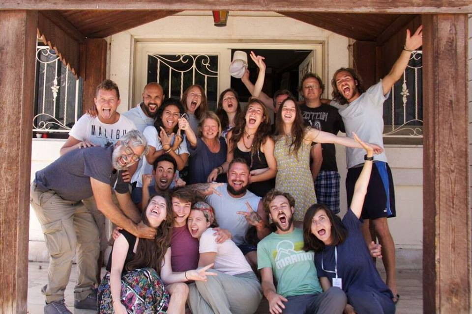
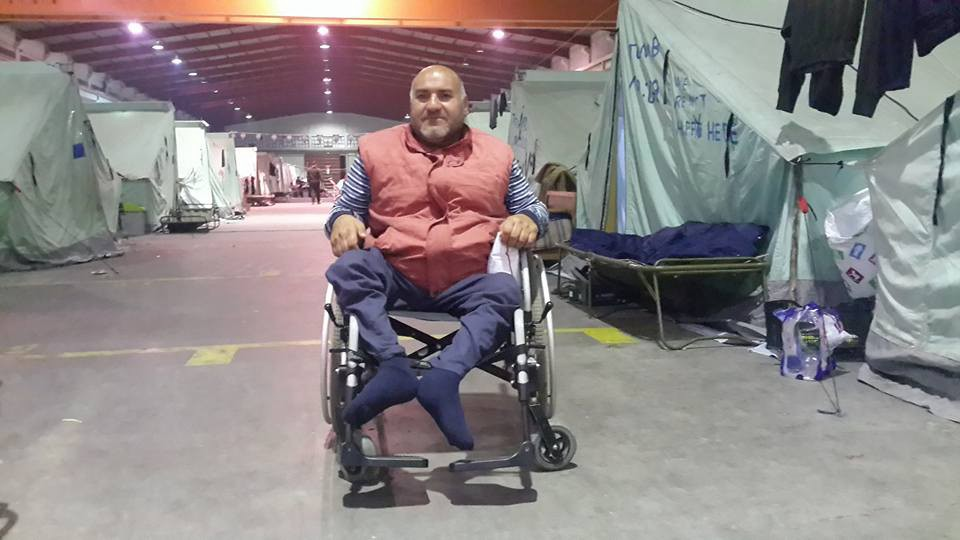
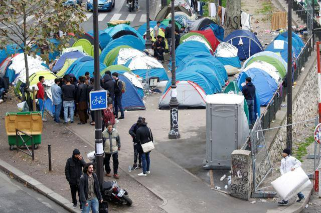
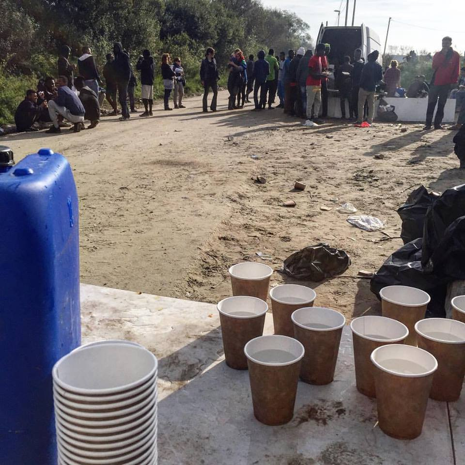

### **AYS DAILY DIGEST 30/10:** _Battle to break the siege of Aleppo keeps claiming innocent victims_

_… with mutual accusations of chemical weapons use / New clashes at Souda camp, Chios Island / Stalingrad station in Paris to be cleared in the coming week / War in Yemen cripples healthcare for millions / UK declines France’s request to take more Calais children / Refugees face lifetime ban to enter Australia if they arrive by boat / Donation and volunteer calls for Lebanon and Greece_

 , killed by an attack on the way to rescue civilians in Aleppo\.](assets/1a5eed1e584d/1*OLVp8VS1OwwnMPUu9bWlBg.jpeg)

White helmet Ibrahim rescuing a child\. [The organization is mourning his loss](https://twitter.com/syriacivildef/status/792696750767280128) , killed by an attack on the way to rescue civilians in Aleppo\.
### Syria

On the third day of a major offensive, Syrian rebels opened a new front in Aleppo as fighting spread to break the government’s siege of the opposition\-held part of the city; each side accused the other of using poison gas\. Syrian state media said militants had fired shells containing chlorine gas at al\-Hamdaniya, a residential area of the government\-held western part of the city\. Rebels denied the accusation, saying that government forces had fired poison gas on another frontline\. According to state media citing an Aleppo hospital director, three dozen people — civilians and soldiers — asphyxiated in the alleged rebel gas attack\. Rebels reported government forces bombed rebel\-held Rashideen district with chlorine and shared videos of victims with breathing problems\.

The Syrian Observatory for Human Rights, UK\-based organization that reports on the war, confirmed reports of suffocation among government fighters in two frontline areas shelled by rebels, but it did not confirm it was caused by a gas attack\. It did confirm that at least 38 people, including 14 children, were killed in rebel shelling of government\-held areas of Aleppo in the last 2 days\.

Without any kind of hope for the end of the conflict in the near future we can certainly expect that more people will try to leave the country for refuge\.
### Yemen
#### The healthcare system in Yemen is on the brink of collapse as the UN estimates that 600 health facilities

More than a fifth of the total in the country have been put out of action because of the fighting leaving 14 million people without adequate health services\. Also they report that hospitals across the country are in a state of chaos facing severe shortages of everything like X\-rays, CAT scan and dialysis machines to IV fluids, basic medications and disinfectants\. Due to a very week economy public sector salaries have been stopped in the last 3 months so most of the staff left the country and the ones that remained face a huge amount of people and are overwhelmed by the situation\.

Adding to these difficult conditions disease like dengue and cholera are spreading in a population that in certain areas is facing serious malnutrition\.

Additionally, UNICEF estimates that 2\.6 million children are at risk of contracting measles, and 1\.8 million are at risk from diarrhea\.

“If a peace agreement isn’t signed this month, I don’t think the health system can be saved” UNICEF’s Meritxell Relano” said in a BBC report published on October 14 of 2016

A report about the condition of hospitals in Sana’a, Yemen can be read [here](http://www.sincere.global/blog/international-middle-east.php#264) \.
### Afghanistan
#### Deportation, challenges post return & re\-migration\!

A family of four was deported from Norway 2 weeks ago\. The older son has been sick with sever fever since they have been returned\. The family doesn’t have any network in Kabul and do not know anyone that would help them after they are forced out of the hotel they are currently staying\.

This is not the story of only this family, but the story of many other families and adults who have never been to Afghanistan and are now returned to a country they know very little about and are treated like strangers\!

Full story [here](https://www.facebook.com/photo.php?fbid=10154637475472973&set=a.184902167972.123891.636337972) \!
### Lebanon

Salam LADC volunteers

The volunteer group [Salam LADC](https://www.facebook.com/salam.ladc/) in Lebanon is looking for a coordinator at the moment, check out [the link](https://www.facebook.com/notes/salam-ladc-%D8%B3%D9%84%D8%A7%D9%85/volunteer-coordinator-position/1368744596471138) for more information\.
### Greece

Clashes broke out today between Afghans and Kurdish Iraquis in Souda camp on the island of Chios on Saturday\. According to Ekathimerini, three refugees were taken to hospital with stabbing injuries\. One person was detained as the police intervened to stop the violence\.

There were reports that at the same time, on Lesvos, an undetermined number of refugees had a rally to protest delays in the process of their asylum applications in another episode of high tension on the overcrowded islands\.

Therewere 54 new arrivals at the greek islands today, 49 to Samos and 5 to Kastellorizo setting the total on the islands at 15864\.

Hotel City Plaza in Athens is making [a call for donations](https://www.facebook.com/cityplazaathens/photos/a.1546534592308042.1073741829.1546516778976490/1606880509606783/?type=1&theater) , their immediate needs are toilet paper, washing powder, chlorine and large bin bags\.

The group [From Shoreham to Greece](https://www.facebook.com/groups/1521377734842289/) from England is going to ship 2 pallets of donations including clothes and educational resources to the Softex camp in Northern Greece and they have launched a fundraising\. Follow [this link](https://gogetfunding.com/from-shoreham-to-greece-november-2016-shipment-to-fillipiada/) if you can help\.

Today there was also a kind request to help a Syrian man on a wheel chair in Oreokastro camp, north of Thessaloniki\. He has very little mobility and his friends are wishing for someone that might be able to [donate Abo Ahmad an electric wheelchair](https://www.facebook.com/groups/1096358837095826/permalink/1193940574004318/) \.

Abo Ahmad in Oreokastro camp

If you are interested to volunteer in Athens, [the latest requirements and opportunities update](https://www.facebook.com/groups/204202716585823/permalink/367307973608629/) was just published by Sumita Shah\. So please consider one of these options from the list at [the link](https://www.facebook.com/groups/204202716585823/permalink/367307973608629/) \.
### Macedonia

Red Cross team at the Macedonian\-Serbian border say they have been helping many people in the region in the last months and that even with the so called balkan route closed [many people keep crossing the borders trying to get to EU countries](http://balkans.aljazeera.net/vijesti/hiljade-izbjeglica-i-dalje-pristizu-u-makedoniju) \.

Refugees in the area also report that they get a very bad treatment from the police in Serbia when they get caught which includes threats of getting shot, physical violence if they don’t go back across the border and there are also reports of the police pushing refugees to Macedonia even if they got into the country through another route\.

_“There is little difference between the ISIL, the Taliban, police and the limits that do not allow us to move\. We ran into a lot of trouble,”_

Nevertheless and even enduring very hard conditions and pushbacks many are still willing to try to reach their objective and usually end up paying great amounts of money to smugglers to do so\.
### Serbia

Today at Miksaliste in Belgrade a total of 436 people were served, including 14 men, 19 women and 403 children\.

During the trip searching for a refuge, large number of families lost at least a member\. There is [an initiative](https://www.facebook.com/RefugeeAidMiksaliste/posts/1783200691946547) by the [Red Cross of Serbia](https://www.facebook.com/redcrossofserbia/) to help families to find lost members in Serbia, so they can be re\-united again\.
### Germany

According to internal documents of the German Federal Office for Migration and Refugees \(BAMF\) the safety situations in the Magreb countries, Algeria, Morocco and Tunesia cannot be regarded as “safe” by far\. This estimation denies clearly the justifications of the law draft by the Federal Minister of Interior, Thomas de Maizière, to classify the Magreb states as “safe third countries”\. The draft even violates the principles in the German constitution, which makes limitations of issuing states as safe\.

De Maizière’s draft was formed after the sexual attacks in Cologne in the New Year’s night in term of accelerated deportations of North Africans while deliberately having ignored assessments of experts\. Whilst the leading Green Party member Volker Beck is hoping this draft won’t be put on the agenda of the Bundesrat \(German “upper house”\), the Ministry of the Interior is even still trying to spin a wider plan\. Their aim is to sign bilateral contracts with North African countries in a similar manner to the EU Turkey Deal\.

\( [Full story in German language](http://www.zeit.de/politik/2016-10/maghreb-staaten-bamf-sichere-herkunftsstaaten-gesetz-thomas-de-maiziere/komplettansicht) at ZEIT\.de\)
### France

Refugee tents between Stalingrad and Jaures metro stations

The makeshift camp near Stalingrad metro station in Paris is due to be cleared in the now beginning week according to the Prime minister Manuel Valls\.

Following the evacuation of the ‘Jungle’ in Calais, the camp at Stalingrad is now the largest in France, with some 2,000 people in makeshift accommodation there\. Now the government says it will address the situation in Paris\.

_“We have evacuated Calais, and will address the issue of Paris next week, where there are 2,000 people who need to be protected and are entitled to protection\.”_

Evacuees will be taken to reception centers, the regional official Jean\-François Carenco said\.

Volunteers on the ground have confirmed information about imminent evacuation of the areas possibly starting as early as Monday morning, concentrating initially on the Ave\. de Flandres where most of the Sudanese gather\. They also state that refugees have been approaching them asking when the centers will be open as the weather conditions are deteriorating and they don’t want to be on the street\. On the other hand it is hard to know how the services will cope with the constant arrival of more people to Paris since new people keep arriving every day\.

In the meanwhile there are still many people at the “jungle”, even if the the French government claims it did a great job clearing the area and many of these now sleeping on the street are minors\. With no support from official organisations or big NGOs have been the volunteers who take care and protect the ones left behind, even looking after the refugees at night when they are more vulnerable\. Both refugees and volunteers feel abandoned by the British and French governments\.

_“Where are the French and British governments? Where is the [British Red Cross](https://www.facebook.com/BritishRedCross/) or [Oxfam](https://www.facebook.com/Oxfam/) or any other heavily funded organizations?”_

by Kitchen Calais

At the same time the French president François Hollande called on the UK to consider its moral duty and take their fair share of the 1500 asylum\-seekers children in Calais\.

“Their transfer to Britain is urgent,” he added\. “We ask you to take your responsibilities and assume your moral duty by immediately organising their arrival\.”

The British prime minister, Teresa may, has declined though to make any extra commitments on receiving child refugees affected by the demolition of the Calais refugee camp\. Downing Street said the UK has already taken a “considerable number of unaccompanied minors”, and several hundred more children and young people would be arriving in the coming weeks\.
### Australia
#### [Migrants face lifetime ban from entering Australia if they arrive by boat](https://www.theguardian.com/australia-news/2016/oct/30/asylum-seekers-face-lifetime-ban-on-entering-australia-if-they-arrive-by-boat)

said the government\. The new law will apply to any adult who has been sent to detention centres on Nauru or [Manus Island](https://www.theguardian.com/australia-news/manus-island) since 19 July 2013 and it means adults who have previously tried to enter Australia by boat since July 2013, but who have chosen to return home, will never be allowed to get a visa to Australia — even as a tourist, or a spouse\.

The ban will not apply to children\.

Source: [The Guardian](https://www.theguardian.com/australia-news/2016/oct/30/asylum-seekers-face-lifetime-ban-on-entering-australia-if-they-arrive-by-boat)

_Converted [Medium Post](https://areyousyrious.medium.com/ays-daily-digest-30-10-battle-to-break-the-siege-of-aleppo-keeps-claiming-innocent-victims-1a5eed1e584d) by [ZMediumToMarkdown](https://github.com/ZhgChgLi/ZMediumToMarkdown)._
