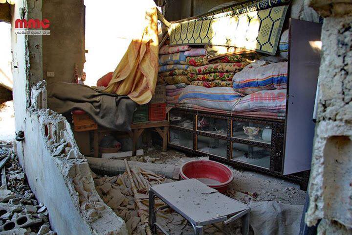
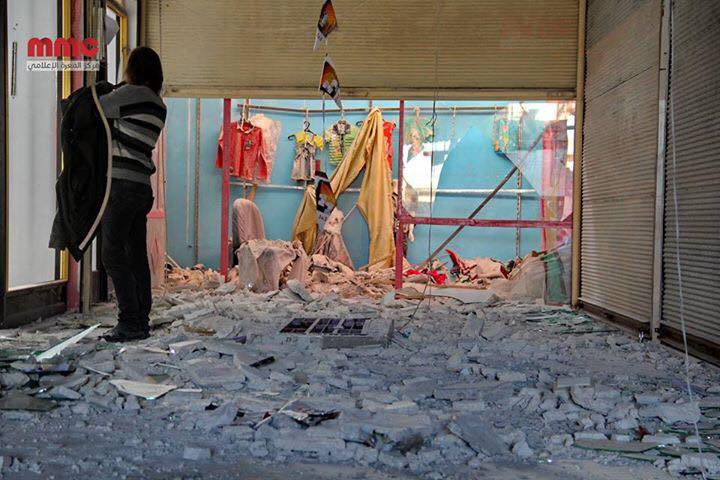
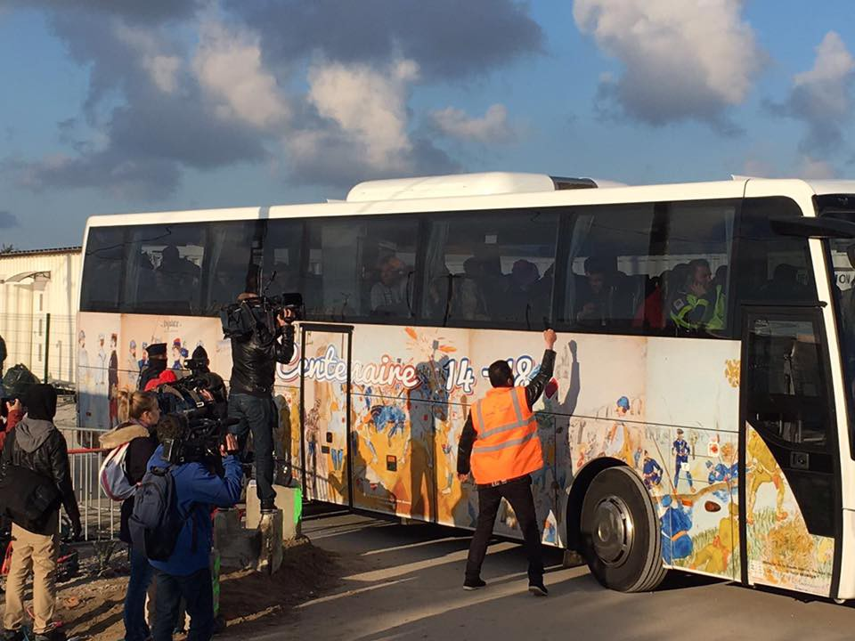
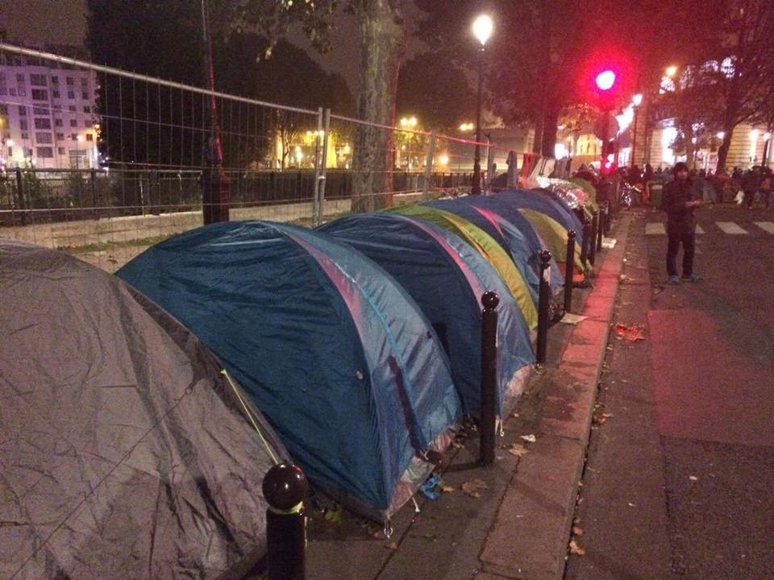
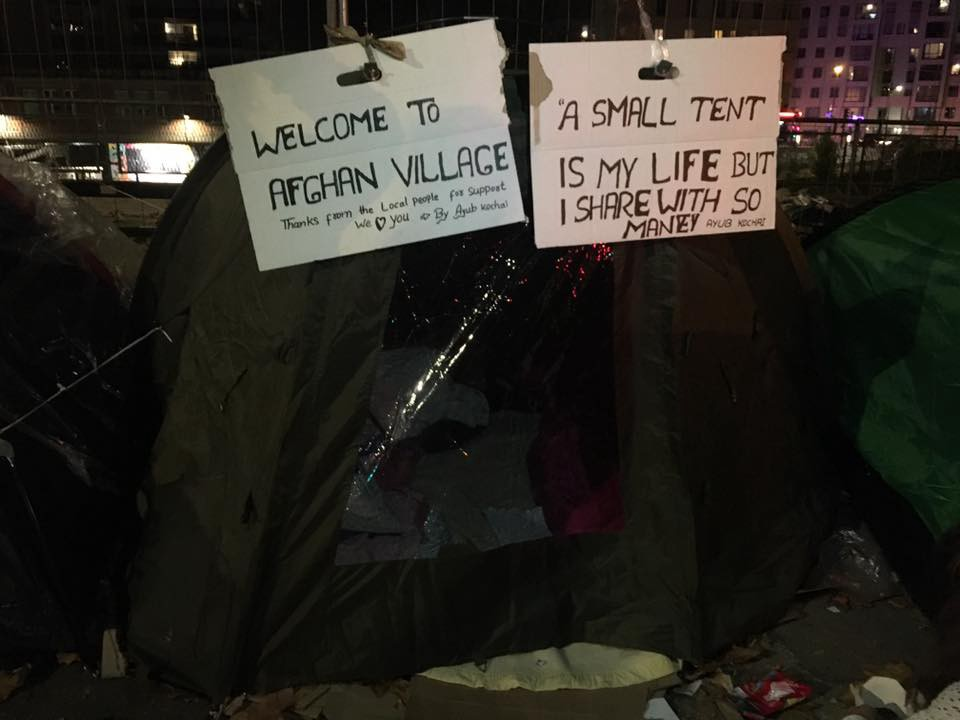
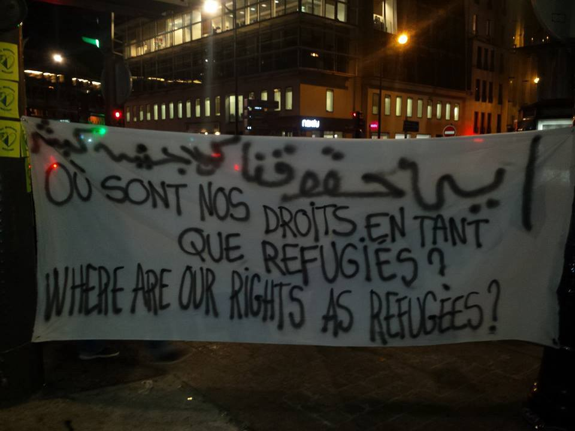
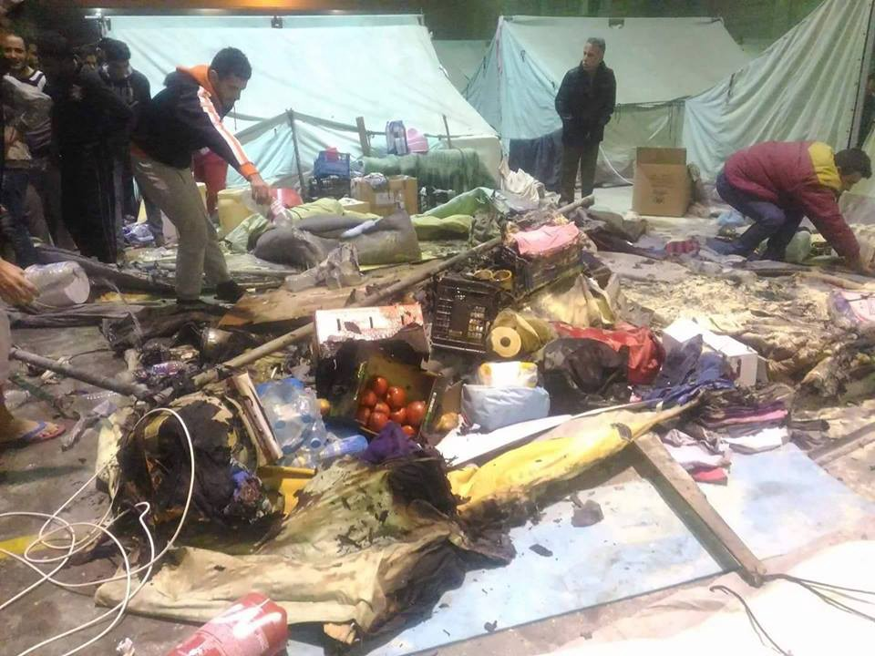
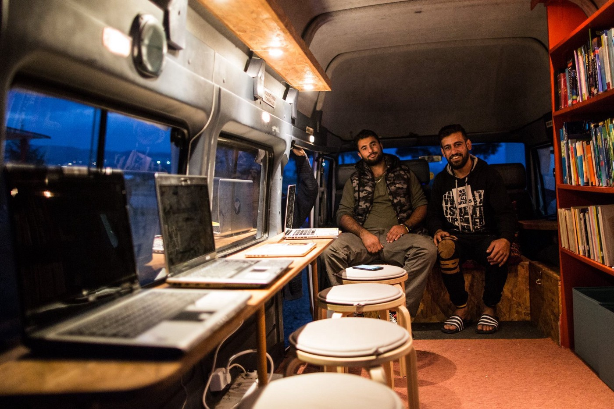

### AYS Digest 02/11 — “We are not dangerous…we are in danger\!”

_Russia tells rebels to leave by Friday while activists say Aleppo still under attack\. Palestinian camp in Syria under siege\. Unaccompanied children transferred from Calais container camp\. 27,136 refugees arrive in Italy in October\._

](assets/9300db0c76bc/0*m8E90s-oD9EnOBdP.)

Photo provided by [Bienvenidos Refugiados — España](https://www.facebook.com/BienvenidosRefugiados/)
#### Syria
### \#WhatCeasefire

Earlier today, Russia declared that it had notified anti\-government rebels in besieged Eastern Aleppo to leave via two corridors between 9am and 7pm this Friday and that it would extend the ceasefire until this date\. Rebels have rejected Russia’s demands\. Syrian journalist Rami Jarrah believe _s “when the deadline comes the bombardment of Aleppo will see an escalation_ ”\.

He adds “ _the reason this is significant now is that it comes just before the US elections which is expected to swarm mainstream and social media platforms\. And could pretty much leave any activity in Aleppo, however horrific yet in the shadow of the elections that all will be focused on\._

_It is important that we take advantage of the time we have from now until Friday evening to shed as much light as possible on this strategy by the Russians\. When the time comes and if the plan is carried out, our voices will be weak in the midst of the world’s media focus\.”_
### Airstrikes kill at least 8 in rural Idlib

Regime or Russian airstrikes on residential areas of Saraqib \(in rural Idlib\) have killed at least 8 people and injured more than 50\.

Photo by Hadi Abdullah

Photo by Hadi Abdullah
### Palestinian refugee camp under siege

The Palestinian refugee camp Khan al Shih, west of Damascus, has been under siege for five days\. The Syrian army occupied the abandoned brigade base on the road connecting Khan al Shih with the town of Zakiya, the only remaining lifeline to the camp\. The camp is home to 9,000 Palestinians and 3,000 children\. It is now suffering from severe shortages of all basic necessities including flour, bread, fuel, medicine, and baby formula\. Prices inside the camp are skyrocketing\. Before completely cutting off the camp, regime forces laid a partial siege after taking over the village of a\-Darkhebiya\. The regime used this position to fire machine guns and artillery on the last road out of Khan a\-Shaikh\. Numerous residents of the camp were killed and injured when attempting to smuggle bread and flour into Khan al Shih from Zakiya at night\.

[Irin](https://www.irinnews.org/analysis/2016/07/08/palestinian-refugee-camp-syrias-next-yarmouk) reported in July that the same camp was lacking basic materials and goods\. At least nine civilians were killed in a month of shelling and airstrikes\. Siegewatch also says “the area is de facto besieged, with snipers on Zakiya Road”\.
#### France
### Unaccompanied children transferred from Calais container camp

French authorities have begun the transfer of 1,500 remaining unaccompanied minors from the container camp in Calais to reception centers across France\. Caroline Gregory from Calais Action says unaccompanied minors do not know where they will be sent, but many of them believe they will brought to Paris, which is highly unlikely\. Tensions between London and Paris have mounted in recent days after President Francois Hollande urged British Prime Minister Theresa May to follow through on Britain’s “moral duty” and take in minors from Calais\. Calais Action also expressed its hope that the minors’ claims to join the UK under Dubs or Dublin will be processed, even after they have left the Jungle\. French newspaper Le Monde says that 38 buses have left so far, with 1,618 minors brought to special reception centers \(CAOMI\) \.

However, minors were already sent to several of these centers last week and regional newspapers report that a lot of these kids have already left\. [Sud Ouest](http://www.sudouest.fr/2016/10/31/ils-fuient-deja-fouras-2552765-1352.php) says 22 kids arrived in Fouras last Thursday, but 11 have disappeared since then\. [L’Est Républicain](http://www.estrepublicain.fr/actualite/2016/10/30/meurthe-et-moselle-19-des-40-jeunes-de-calais-ont-quitte-le-site-d-accueil-a-sion) says 40 arrived last Wednesday in Sion but 19 had gone by Saturday, hoping to reach England\. 14 of the remaining ones have expressed their desire to leave and only three have said they want to remain in France\.

This time around, Home Office officials will be traveling with the unaccompanied minors\. Their cases will be processed inside the reception centers in order to prevent kids from leaving and accelerate their transfer to the UK\.

Photo by Calais Action
### Tents and sleeping bags distributed in Paris

A new group [Paris Refugee Support Group](https://www.facebook.com/PRGS.team/) has provided tents, sleeping bags and roll mats to over 400 people, some of whom lost their tents in police evictions, leaving them bare and exposed to the Parisian winter\. The aid was provided with the support of [Jersey Calais Refugee Aid Group](https://www.facebook.com/JCRAG2015/) [, Homeless Refugee Relief](https://www.facebook.com/HomelessRR/) [, Care4Calais](https://www.facebook.com/care4calais/) and countless individuals\.

Photo by Paris Refugee Support Group

Photo by Paris Refugee Support Group

A simple way to help if you are in Paris, is by dropping off men’s clothes and blankets at the St Bernard church, from Tuesday to Saturday between 15h and 19h\. Clothes and blankets are then distributed during the weekend\. Shoes are especially needed\.

You can also drop off food for [“La Cuisine des Migrants](https://www.facebook.com/La-Cuisine-Des-Migrants-305783063121648/) ”, at “la Nouvelle Rôtisserie” 4 Rue Jean Moinon on Mondays and Tuesdays\.

Finally, wherever you are, you can contribute to the funds of the Collectif Parisien de Soutien aux Exilés \(CPSE\), which supports refugees through material, medical and legal help — for example they help refugees navigate the French bureaucracy and asylum system, accompany them to the hospital, make food for families and try to get unaccompanied minors out of the streets\. If you are able to help, please follow the [link](https://www.leetchi.com/c/solidarite-de-migrants-de-republique) \.

Photo by KevinWidanel Belcher
#### Italy
### 27,136 Refugees arrive in Italy in October

With 27,136 arrivals in October, Italy has now seen more new arrivals in 2016 \(160,639\) than Greece \(159,490\) according to UNHCR numbers\. Rescue efforts continue to depend not only on the Italian coastguards but also on volunteer organizations such as Sea Watch, a group that was recently attacked by the Libyan coastguard\.

[The Local](https://www.thelocal.it/20161102/eu-hopes-libyan-coast-guard-training-will-end-attacks-on-migrant-boats) says that an EU mission is now under way to train the Libyan coastguard and stop these attacks\. It aims to train 500 Libyans in total but will also supply at least ten coast guard boats\.

[Amnesty International](https://www.amnesty.org/en/latest/news/2016/11/italy-beatings-and-unlawful-expulsions-amid-eu-push-to-get-tough-on-refugees-and-migrants/) meanwhile, says that “the European Union’s pressure on Italy to “get tough” on refugees and migrants has led to unlawful expulsions and ill\-treatment which in some cases may amount to torture\.”

Amnesty particularly criticizes the use of coercive practices to obtain fingerprints, including “arbitrary detention, intimidation and excessive physical force”\.
#### Serbia
### Around 1,000 sleeping rough in Belgrade

UNHCR says that the number of refugees in Serbia is stable at around 6,300, with 73% of them accommodated in 11 governmental facilities\.
Over 1,000 are sleeping rough at night in Belgrade City centre, with national and local authorities advising agencies to stop assisting refugees in the city centre and refer them to the Asylum Centre of Krnjaca instead, even though Krnjaca — already fully occupied — is unable to accept new residents\.
#### Bulgaria
### Refugees start hunger strike in Busmantsi over living conditions

Bordermonitoring Bulgaria says 200 refugees have started a hunger strike in the detention centre of Busmantsi, protesting bad living conditions, sanitation, quality of food and lack of medical treatment\. They are also protesting the staff’s aggressive behavior and discrimination by the State Agency for Refugees \(SAR\), saying the agency discriminates against Pakistanis when reviewing their asylum applications\.
#### Greece
### Family injured in Oraiokastro camp

A mother and her two children were injured after their tent caught fire inside the Oraiokastro camp and the boy was brought to the hospital\. Just last week, a mother and her child died after being hit by a car near the same camp\.

### Echo Refugee Library has started operating

Since traveling all the way from the UK to Greece with 4,000 books donated by schools and individuals all across the country, the Echo Refugee Library van has been equipped with bookshelves, a computer station, electricity and wifi\. The finishing touch was the beautiful graffiti on the outside\. The mobile library started operating Tuesday\.

Photos by Echo Refugee Library

Photos by Echo Refugee Library
#### Belgium
### Belgian Immigration Minister Theo Francken continues to refuse visas to Aleppo family

[DW](http://www.dw.com/en/belgian-immigration-head-fined-over-visa-rejections/a-36241533) reports Belgian Immigration Minister Theo Francken has refused to pay a fine on Wednesday over his refusal to issue visas to a family from Aleppo\.

Francken is being charged €4,000 for each day that he does not attend a tribunal over the matter, equating to €1,000 per person in the family\. Francken reportedly rejected the family’s asylum request for having relatively tenuous ties to Belgium, even though friends in the town of Namur have offered to host the couple and their two children, ages 5 and 8\.

Although a court has ruled three times in favor of the asylum seekers, Francken has said he believes the government, and not the courts, should be in charge of handing out visas\.

Olivier Stein, a lawyer helping the Syrian family, has accused Francken of hypocrisy, saying the Immigration Minister “can’t cry about migrants drowning in the Mediterranean, then force people to put their lives in danger”\.

_Converted [Medium Post](https://areyousyrious.medium.com/ays-digest-02-10-we-are-not-dangerous-we-are-in-danger-9300db0c76bc) by [ZMediumToMarkdown](https://github.com/ZhgChgLi/ZMediumToMarkdown)._
