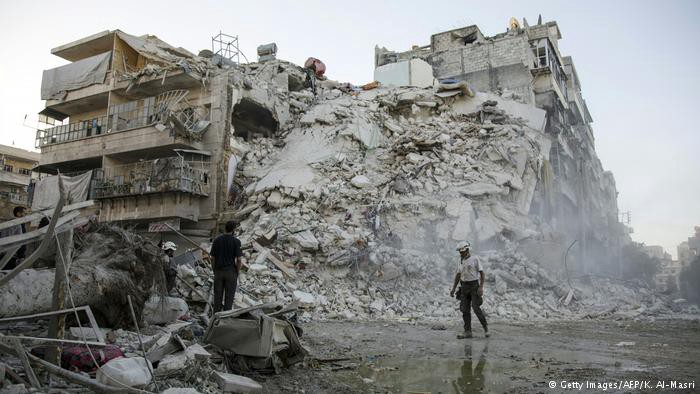
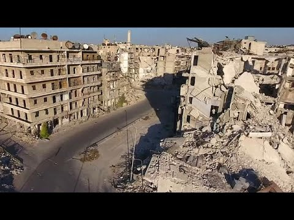
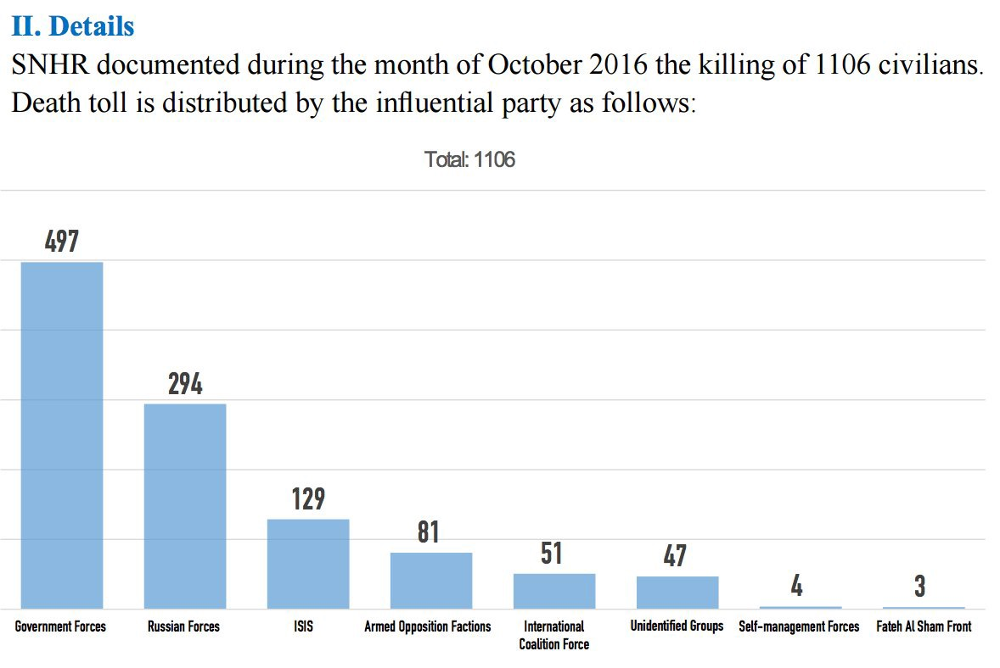
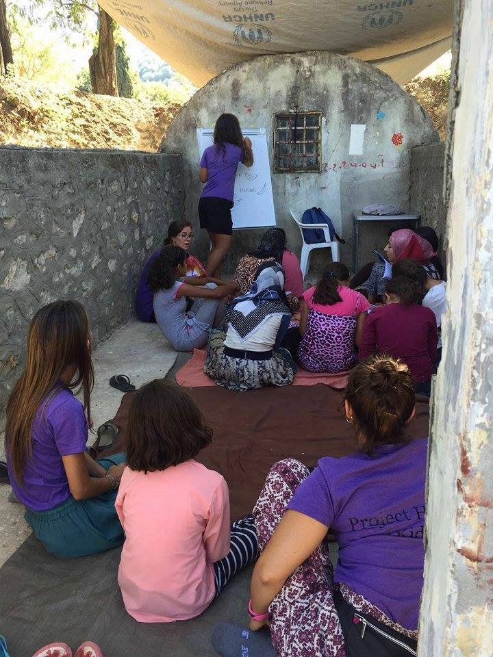
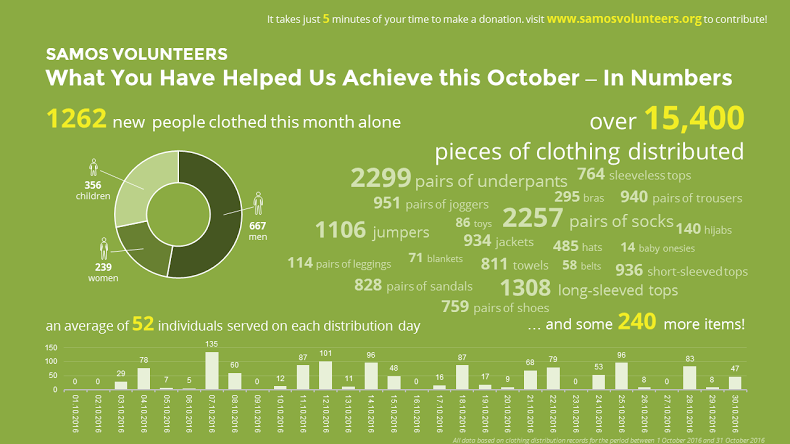
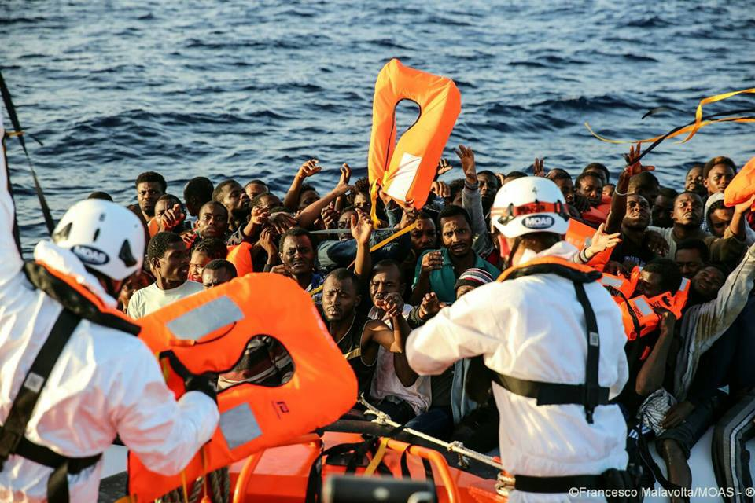
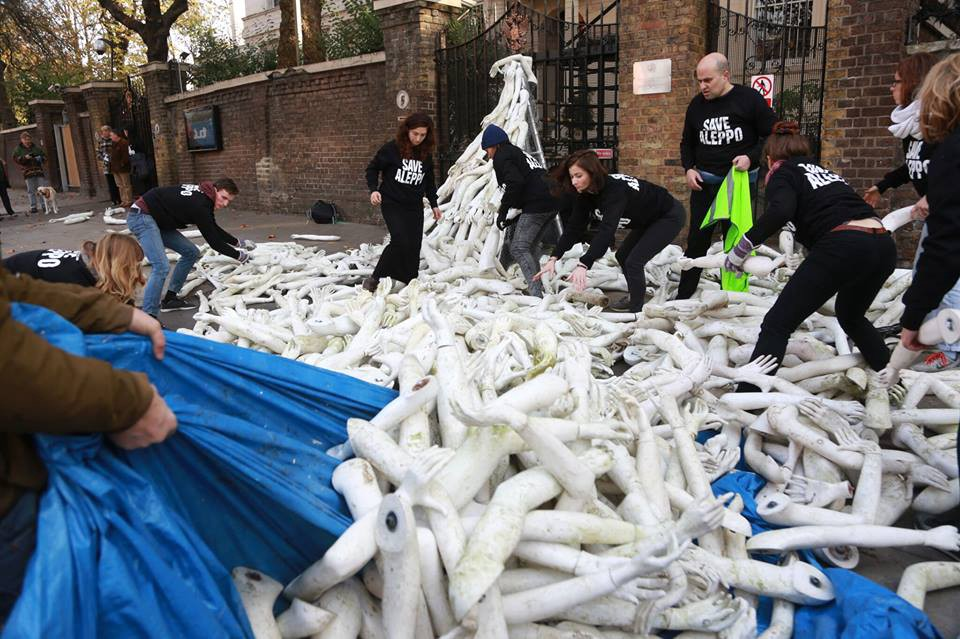

### AYS DAILY DIGEST 03\.11\.2016 — Ultimatum hangs over the heads of East Aleppo rebels\.

A demolished building in rebel\-held East Aleppo\. Photo Credit: Getty Images
#### Feature

Russia has announced that a ‘humanitarian pause’ is to take place in Aleppo on November 4, from 9am to 7pm, to give civilians and rebels one last chance to leave the besieged eastern districts of the city\. The plan includes a total of eight corridors, 6 for civilians and 2 for rebels, that will allow those wishing to leave a final chance to do so before what will be a massive military push to bring the rebel\-controlled districts under the Syrian regime’s control\.

Russia says that the assault will consist of a massive bombing campaign which will proceed to level what’s left of the city which has been the site of battle for almost 5 years\. People on the ground however are questioning the very existence of these supposed routes to safety\. Mistrust of regime forces and their Russian allies is incredibly high owing to their indiscriminate bombings of civilian targets such as hospitals and schools under the guise of so\-called anti\-terrorism operations\. Regime promises of amnesty are cause for much skepticism for who might otherwise consider laying down arms\. Indeed, what guarantee exists that there won’t be reprisals?

> [“Russia is already bombing us\. This doesn’t make us scared\. It won’t be that different for us if they increase their attacks\.”](https://www.theguardian.com/world/2016/nov/03/aleppo-braces-russian-assault-rebels-vow-defy-putin-ultimatum) 

There is no telling how this offensive will go\. Indeed, the regime and Russia have already made several heavy pushes this year to take rebel\-held neighborhoods of the city, only to be pushed back by rebel groups\. The rebels are making a concerted effort to hold their ground as before\. Their morale remains strong despite hellish conditions in the besieged city\. A government victory in East Aleppo would, in their eyes, mean the consolidation of power in a time when thanks to its Russian and Iranian allies, the regime at last has a military advantage against those who seek to depose it\.

Rebels continue to cite the injustice of the continuation of a government led by the same man who escalated hostilities as the Syrian people went out to peacefully protest for the democratization of their society\. A brutal repression prompted armed self\-defense, followed by further escalation\. And thus we have the current situation: the country lies in shambles\. Perhaps as many as 500,000 are dead, millions are displaced, violent sectarianism rose to unprecedented heights where before different religious communities lived side by side, a traumatized and desensitized generation of children grows up playing in the craters left by airstrikes\. And yet, the battle continues\.

Make no mistake, the ultimate fate of Aleppo will determine what lies in store for the rest of the country, and the world would be wise to keep its eyes peeled\.
#### Syria
### Khan Eshieh Palestinian refugee camp is under siege\.

The following harrowing report comes to us from Budour Hassan on Twitter:

> [_“Spoke to aid worker in Khan Eshieh Palestinian camp west of Damascus, says situation beyond desperate, 12,000 people under complete siege\. No functioning hospital in the camp, and way to treat ill/wounded\. The sole pharmacy lacks medicine or baby milk; no sanitary pads for women\. Aid worker says a cancer patient died in his arms after failing to get treatment for months, another woman died shortly after giving birth\. Russian & Syrian jets continue to drop bombs on the camp; residents plead for ceasefire, end to siege, provision of bread & medicine\.”_](https://twitter.com/Budour48/status/794234117437145088) 

The story of the camp’s siege is unfortunately not new\. The camp has been under attack since 2013, with air strikes and shells taking a massive toll on the inhabitants, who remain few\. The way out is perilous for those who remain, as the road leading out of the camp is targeted by regime snipers\.
### SNHR releases numbers of dead for the month\.

The SNHR shows yet again that the government and its Russian allies have been responsible for the greatest civilian casualties\. The two were responsible for nearly 72% of the deaths that have occurred in October, followed by ISIS with 12% of casualties\. These figures go to show that while opposition forces have been behind some of the grisly crimes committed during this bloody war, one cannot simply place a sign of equivalence between the regime and those who oppose it\. All war crimes are to be condemned equally, and yet it is clear who the biggest perpetrator is\.
### Aleppo doctor calls for donations to help hospital on the frontlines of war\.

In a Facebook [post](https://www.facebook.com/DoctorShajulIslam/posts/1855432998076645) , Dr\. Shajul Islam made the following request:

> _The great battle to open Aleppo has intensified\. The hospital I am currently at, is the first hospital from the front line\. We have had so many injured\. We are not managing here, we are out of basic drugs\. It is so cold and we don’t even have blankets to keep our patients warm\. I fear that they will die from hypothermia\._ 

> _This is going to be a major problem for all hospitals in Syria\. It is standard practice to strip off patients’ clothes in trauma to assess them\. When we do this, we don’t have any clothes or blankets to cover them with\. I can see the patients turning blue because or how cold they are… But I am helpless as I can’t find anything to cover them with\._ 

> _If anyone can buy them emergency foil blankets and send us boxes of them, please message me\. I will send them to most of our hospitals\._ 

> _I hope Aleppo does open soon, as our doctors are running out of medical supplies\. Please make dua for them\._ 

> _Please share, as someone else on your friends list might be able to help with foil blankets\._ 

> _You can order from this Amazon wish list created by “UK Action For Refugees” \(who will be parcelling to me\) and send it to the “High Wycombe” address that is on the delivery page\._ 
 

> _[https://www\.amazon\.co\.uk/registry/wishlist/1EA6DLXHOFVSO](https://www.amazon.co.uk/registry/wishlist/1EA6DLXHOFVSO)_ 

> _Please feel free to contact [Nina Coulson](https://www.facebook.com/nina.coulson.7) If you wish to post to them from your own sources as well\._ 

#### Bulgaria
### Refugees trying to enter Bulgaria are beaten on the border\.

Stories of Bulgarian hostility towards those who wish to cross the country on their route to Western Europe is well\-known\. A new report published in [The Intercept](https://theintercept.com/2016/11/03/bulgaria-welcomes-refugees-with-attack-dogs-and-beatings/) has uncovered a darker side to the story\. The piece chronicles the attempts made by a group of refugees to cross from Turkey into Bulgaria, and reveals that the border police has extorted bribes from those making the crossing\.

> “15 passengers, 1,400 euros \($1,561\) for the group\. And then, finally: a time and a location pin via Google Maps\. Bulgarian police, the smugglers said, would tell them to meet at a certain mile marker along the border\.” 

### 200 refugees took part in a hunger strike in Busmantsi Detention Center\.

The residents of the camp [cite](http://bulgaria.bordermonitoring.eu/2016/11/02/breaking-news-hunger-strike-in-busmantsis-detention-center/) difficult conditions in the center, including lack of medical care, substandard food, and dirtiness, as well as discrimination against Pakistanis seeking asylum\. The hunger strike was called off after police promised to act on the refugees’ demands\.
### 24 refugees detained by Bulgarian police\.

The refugees, all of whom are from Afghanistan, were found being smuggled in several cars in Eastern Bulgaria when the vehicles were stopped for a traffic check\.
### 5 men responsible for assaults on refugees arrested in Sofia\.

The attackers were arrested on Wednesday after they had attacked a group of refugees outside of a restaurant, and are now in police custody\.
#### Greece
### Paramedic / nursing volunteers are needed on Chios\!

> [_It was with a heavy heart that the CESRT family bid goodbye on Monday to our friends SMH from Chios\._](https://www.facebook.com/groups/421759534684819/permalink/547686552092116/) 

> [_Their departure has left a big gap in terms of highly responsive professional and reliable medical aid at landings\. Winter is almost here and the nights are only going to get colder\. The young and old, men, women, children face a huge risk of hypothermia and we’ve witnessed many other medical emergencies at landings over the past year\. We are urgently looking for nurses, paramedics and doctors to join our CESRT family\. Please get in touch\._](https://www.facebook.com/groups/421759534684819/permalink/547686552092116/) 

### Project Hope 4 Kids asks for applicants to teaching positions in Filippiada

> [_QUALIFIED TEACHERS Project Hope 4 Kids, registered non\-profit is looking for experienced teachers to help run our school and activity program in Filippiada\._](https://www.facebook.com/projecthope4kids/photos/a.1718327121735432.1073741828.1718312291736915/1875923495975793/?type=3) 

> [_Preferred Qualifications:_](https://www.facebook.com/projecthope4kids/photos/a.1718327121735432.1073741828.1718312291736915/1875923495975793/?type=3) 

> _\*Past Experience of teaching_ 
 

> _\*Field Experience ideal_ 
 

> _\*Passionate about children and education_ 
 

> _\*Daily hours 10–7pm 6 days a week_ 
 

> _\*Demonstrated behavior that is professional, ethical, and responsible_ 
 

> _\*Ability to perform a variety of tasks, often changing assignments on short notice, with little to no direction;_ 
 

> _\*Ability to communicate effectively and appropriately with other team members and other organizations_ 
 

> _\*One month commitment ideal with free housing_ 

> _Interested applicants please email your CV and qualifications to projecthope4kidsnonprofit@gmail\.com_ 

### Long\-distance Arabic, Farsi, and Kurdish translators are needed\.

> _We have experienced some communication difficulties in the hospitals in Greece between doctors and \(refugee\) patients, because of the lack of translators in Greece\. As the translations are often simple questions, it doesn’t require that the translator is present at the hospital, which means that the translation can easily be solved via phone or Skype/WhatsApp calls\. So if you are able to translate either Arabic/English, Farsi/English, Kurdish/English or Arabic/Greek, Farsi/Greek or Kurdish/Greek, you can sign up to be one of our phone\-translators by sending your translation abilities, phone number/Skype contact and availability in an email to infobodiesonthemove@gmail\.com_ 

### A total of 82 arrivals, with 71 to Lesvos and 11 to Rhodes\.
### Donations needed to buy clothing for refugees\!

> [_The figures here speak for themselves\! During October, we had well over 1000 new arrivals\. We aim to provide each individual with a set of clothes and shoes if theirs are broken or they are walking around barefoot\. We have now run out of men’s shoes, so no\-one has had shoes for over a week\. To continue to fulfil the basic clothing needs of refugees arriving on Samos and securing them a little bit of dignity, please consider taking 5 minutes to make a donation to us\._](https://www.facebook.com/samosvolunteers/photos/a.567427800102051.1073741828.565209816990516/677889982389165/?type=3) 

### Greek Migration Ministry general secretary resigns\.

Vasilis Papadopoulos has submitted his resignation, according to one newspaper [as a result](http://www.ekathimerini.com/213375/article/ekathimerini/news/migration-ministry-general-secretary-confirms-resignation) of the increasingly volatile situation on the islands\.
#### Hungary
### Austrian military unit sent to patrol Hungarian/Serbian border\.

There are already 20 Austrian police officers on the Serbo\-Hungarian border, and they are about to be joined by several more who are to remain for six months\. Hungary has been particularly keen on preventing refugees from ‘illegally’ crossing the border to make their way into other EU countries, and Hungarian police along the border have been known to use force against those who make such a crossing\.
#### Germany
### Police statements questioned following a “hunt” staged against refugees\.

[On Tuesday](https://www.thelocal.de/20161103/refugees-hunted-through-notorious-east-german-town) , group of 40–50 fascists staged a hunt against two refugees in the town of Bautzen in Saxony\. The two were fortunately able to escape\. Unfortunately, some are saying that the police failed to intervene until the very last moment\. Furthermore, contradicting eyewitness reports, the police downplayed the story on the following day, saying that there were closer to 10–15 attackers who threw stones at the refugees after an altercation had occurred between the refugees and a German teenager\.
#### France
### Following shutdown of Calais camp, police plans to dismantle camp in the vicinity of Stalingrad in Paris\.

The operation is to begin by the end of this week, according to the French interior ministry\. This will entail the relocation of 4,000 refugees, for many of whom accommodations simply do not exist\. This, along with the long and dramatic Calais saga, goes to showcase the French state’s unpreparedness in the face of the refugee crisis\.
### Transfers from Calais are being finalized\.

Over 1,600 refugee minors have been moved to CAOMIE centers from Calais\. Additionally, the women and children who were at Jules Ferry Center have been transferred to the camps, which are located throughout France\.

The quality of the camps are said to vary widely, some reporting that they have their own flat with a bedroom for each person, while others report being crammed in a room with 25 other people\. Many report difficulty with the food, and 30% complain about the quality and/or quantity of servings\. Please consider [donating to Care4Calais](http://care4calais.org/donate/) to better the situation of those in need of help\.
#### Libya

Some of the 605 refugees rescued today by MOAS vessels\. Photo Credit: Francesco Malavolta\.
### At least 239 refugees were killed after two boats capsized\.

Refugees told their saviors about the catastrophe which took place off the coast of Libya\. The gruesome accident happened after smugglers who arrange the journeys told migrants that European training of Libyan coastguards means the rescue missions will soon be handed over to Libya and any rescued migrants will be taken ashore in Libya rather than Italy\. This possibly caused the rush to board boats now, he said, although the information, gleaned from rescued migrants, was not confirmed\.
#### Italy
### Amnesty International brings attention to abuse of refugees in Italy, European Commission says that it cannot be held responsible\.

Amnesty International has published a [new report](https://www.amnesty.org/en/documents/eur30/5004/2016/en/) today which brings to light horrific allegations of asylum seekers in Italy\. According to Amnesty, the abuses are the result of the hotspot system, which requires that all refugees be fingerprinted upon arrival to Italy\. The failure of relocation programs has meant that the Greek and Italian systems are overburdened\. This puts pressure on all involved, and according to one witness testimony, a refugee who refused to be fingerprinted was tasered into submission\. Another alleged that policemen has tasered his testicles\.

In response to the shocking report, the European Commission denied responsibility, and denied the accounts of torture presented in the report\. The EC states that it allows force to be used “proportionally\.”
### BREAKING NEWS FROM BAOBAB EXPERIENCE — ROME:

> _Another eviction at Tiburtina Station, la last one of a long series without any alternative solutions\._ 
 

> _This morning the police intimate the Baobab activistes to dismantle the garrison at Piazzale Spadolini, at the east side of Tiburtina Station, where during the last two weeks migrants and volounteers and donors found shelter\._ 

> _The gazebo where dismantle and the windows and doors of a not used underground parking was the shelter for 190 people from rain and cold\._ 

> _The relocations are blocked, as the possibility to ask for political asylum, the borders are closed and thousand of migrants from the hotspots are moving to Rome\. With the aggraviting of the cold season\._ 
 

> _Now, not only the migrants are hunted in the optical of dispersion, but even the citizens and the volunteers, that since more than a year and a half are the unique solution\._ 

> _Now it’s very important to stay united and keep the attention high\._ 
 

> _But Baobab Experience doesn’t end, just go through a transformation\._ 
 

> _Please, stay tuned\!_ 

> _Thank you for your attention\!_ 
 

> _Michelle_ 

#### UK
### Demonstration staged outside of Russian embassy in London\.

Masses of mannequin arms [were left outside](https://www.facebook.com/ramijarah/posts/10154791134982873) of the Russian embassy in London by activists working with The Syria Campaign, in protest against the violence of the ongoing bloodshed on East Aleppo and the coming escalation\. The Russian embassy war targeted owing to the country’s central role in the ongoing war tearing the country apart\.

_Converted [Medium Post](https://areyousyrious.medium.com/ays-daily-digest-03-11-2016-ultimatum-hangs-over-the-heads-of-east-aleppo-rebels-9d9f828e37b0) by [ZMediumToMarkdown](https://github.com/ZhgChgLi/ZMediumToMarkdown)._
