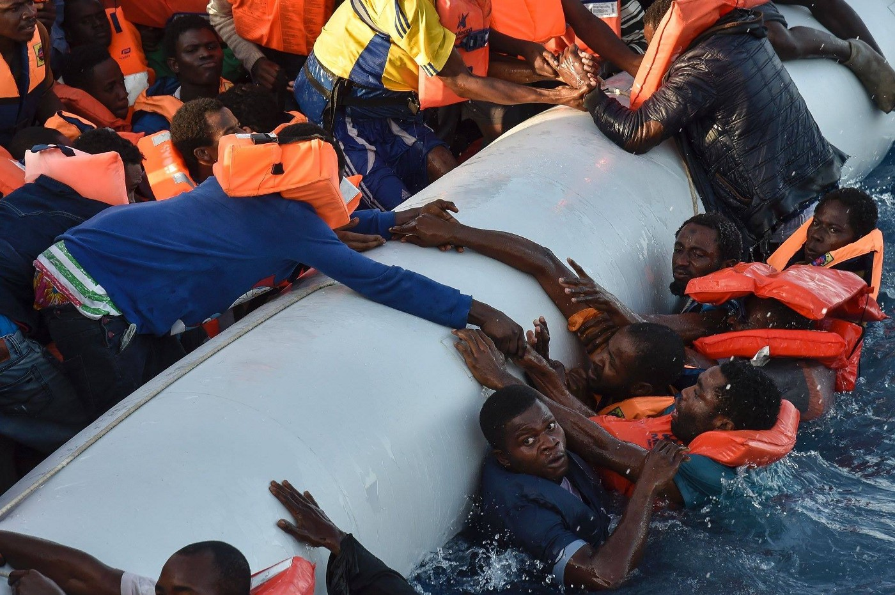

### AYS 4/11\. Authorities evacuate thousands from the streets of Paris
#### Refugees forwarded to various sites in France\. Food, medicine supplies running out in east Aleppo\. Tension rises on the Greek islands\. Asylum seekers manage to get out of the Gevgelija camp, others left behind\. AYS needs money to keep helping the refugees\.

### Camps in and around Stalingrad and Jaures Metro stations, Avenue de Flanders cleared out

Today, Paris saw the evacuation of refugees from Stalingrad and Jaures Metro stations a well as Avenue de Flandres\. According to AYS volunteer on site, the evacuation started very early in the morning, in a rather calm, but undignifying atmosphere\. The refugees have been told to sit on the cold and wet pavement before being put on busses and taken to various accomodation centers\. Our volunteers have confirmed that around 3,000 people were taken away until the noon, including families and children\. [Media reports](https://www.theguardian.com/world/2016/nov/04/french-police-move-4000-migrants-out-of-paris-camp) mention up to 4,000 refugees taken from the streets today\. The operation was organised jointly by the state and Paris city authorities\. Officials said families and vulnerable refugees would be housed in and around the capital, while lone male migrants would be taken to reception centres around the country

> Paris attracts people, but the problem is one that the whole of France needs to deal with\. We cannot have camps of this nature in the city\. Finding accommodation for the thousands camped at Stalingrad would enable us to start with a clean slate and control the flow of new refugees in a humane manner— Paris major Anne Hidalgo told the Guardian, in a clear message that she won’t allow making of new camps in the city\. There were 30 attempts of eviction so far, but some refugees kept returning and new refugees kept coming, especially after closure of Calais camp\. 

](assets/cb16316e9407/1*1fCX_XoxvQzX90XMHpOK9g.jpeg)

Refugees were forced to sit on a cold, wet pavement before being forwarded to the buses\. Photo\. [BAAM](https://www.facebook.com/baam.asso/)

Today, some refugees were lucky enough to end up in a hotel, but at least 1000 of them were taken to gyms\. Some of the new accommodation places have inadequate infrastructure, with only a few toilets, no showers etc\. Most of the refugees didn’t have any information on where they are being taken\. They weren’t given the option to choose where to go in order to be at the same place as their friends and relatives\.

> “Refugees were again treated like merchandise and brought to unknown destinations, towards dreadful centres where no infrastructure is put in place to help people with their asylum procedures\. After that they will go to CAOs\. Several people have already come back as they sleep in gyms with no real social/legal/food support\. Minors were brought to the centre for the evaluation of unaccompanied minors \(DEMIE\) but the majority has been rejected and is now back in the streets” — BAAM has announced\. 

Paris campsites have been quickly cleared out in order to prevent people returning to their tents\. Photo: Reuters

Some refugees were left behind and the volunteers are trying to accomodate them or at least give them fresh sleeping bags and tents because the police won’t let them go back to their old camping sites\. Also, it is quite clear that the refugees will keep on arriving to Paris, and it is unclear what will happen to them due to increased police presence at the usual spots where their compatriots were sleeping rough for weeks\. Paris Refugee Ground Support, a rather new team that has been distributing necessities on the streets of Paris in the past few weeks, says you can [write to them](https://www.facebook.com/PRGS.team/?fref=nf) if you know a refugee that needs volunteer support\. Apart from providing most necessary items, they say they can help them to make phone calls to their lost relatives\.

There’s a closed Facebook group that was recommended to us by different volunteers, including our own staff members, as the best source of info about the situation in Paris\. It is mostly for French speakers, but it if you are actively involved in Paris events, you should probably [join it](https://www.facebook.com/groups/177642579245883/) \.
#### Syria
### Food, medicine supplies running out in east Aleppo

According to UN OCHA flash update, less than 30 doctors currently serve the six only partially\-functional hospitals east Aleppo, which means there is only one doctor for every 9,000 people\. Essential medicines, including anesthetics, IV fluids, vaccines and trauma supplies, are running out\. Available beds and blankets are insufficient, and **some patients are using body bags to keep warm** \. Only eleven operational ambulances remain in service for the collection and transportation of injured people which results in many being left unattended\. In the absence of any significant humanitarian assistance reaching besieged east Aleppo since 7 July and the failed attempt to medevac the most critically injured and ill, people in east Aleppo are in ever growing need of urgent medical supplies and other humanitarian assistance\.

> Our outpatient departments are overwhelmed\. We are getting between 120 and 150 children every day\. We received one child who needed to be admitted to the intensive care unit, but we were forced to keep him in the ward for some time\. He wasn’t able to make it and he passed away — emergency room nurse Abu Al Motassem from east Aleppo said to MSF 

Nine\-year\-old Abdul Hadi lies on a bed in a hospital ward, watched over by his older brother, after being injured by a barrel bomb while playing outside his home in besieged east Aleppo\. Photo: MSF

According to MSF, of the seven hospitals currently functioning in east Aleppo, just one specialises in treating children\. There are four paediatricians — two qualified doctors and two final\-year medical students — in the besieged area, but no paediatric surgeon\. **At least 136 children have been killed and at least 468 have been wounded by airstrikes since 22 September** \. The hospitals where they are being treated are desperately overcrowded and short of staff, medical supplies and intensive care beds\.

Food, drinking water and medical care are becoming increasingly scarce, while medical staff are struggling to cope with large numbers of wounded\. According to UN, as of 25 October, some 10,113 complete food rations and 1,883 incomplete food rations and 100 metric tons of bulgur remain in storage in east Aleppo\. Although UN’s partners on the ground are already splitting rations in half and prioritize vulnerable groups during distributions, the Gaziantep\-based food security and livelihood cluster estimates that the **food supplies in eastern Aleppo city will run out in mid\-November** \.
#### Mediterranean

239 people died trying to cross the Mediterranean Sea yesterday\. The two rubber dinghies capsized 25 miles of Libya’s shores\. The rescuers saved 27 people and recovered 12 bodies including 3 babies\. 2016 is the deadliest year so far — 4,220 souls are dead and missing\.

Refugees fall into the water during a rescue operation off the Libyan coast\. Photo: Andreas Solaro
#### Greece

156 people were officially registrated today: 16 on Chios, 79 on Samos and 61 on Lesvos, island that welcomed three new boats of people, only in the past two days, according to the locals\. At least 15,000 people are stuck on the Aegean Islands at the moment: about 6,000 on Lesvos, 4,200 on Chios, 2,000 on Samos, 1,900 on Kos and 750 on Leros\.

> **_“Greece’s Aegean islands will gradually turn into the Ellis Island of the EU” — said Greece’s Migration Minister Yiannis Mouzalas\. However, he seems to forget people arrived to Ellis Island as passengers of regular boats, and were welcomed to the US after their intial registration on the island\. The comparation would probably be better if he referred to the [shameful episode](http://www.smithsonianmag.com/history/us-government-turned-away-thousands-jewish-refugees-fearing-they-were-nazi-spies-180957324/?no-ist) in American history, when USA rejected to accept boats full of Jewish refugees from WW2\._** 

**Yesterday a smuggler dumped 12 vulnerable people fleeing war and conflict into the water on a sheer cliff face\.** According to Help Refugees, the group included a small baby, 3 teenage girls and an elderly woman of 80 who when found was severely hyperventilating\. Refugee rescue completed a very dangerous rescue with their boat Mo Chara, the only boat on Lesvos that could get close enough for the very difficult rescue\.
### Tensions rise on the Aegean islands following rain, new arrivals, deportations of refugees to Turkey

The already horrible living conditions in Greek camps were worsened by the floods that came after Friday’ rains\. [Ekathimerini](http://www.ekathimerini.com/213424/article/ekathimerini/news/unrest-returns-to-migrant-facility-on-chios) reports this brought fresh bout of unrest at one of the reception centers for refugees on Chios, although volunteer coordinators say the unrest was rather easily contained\. Tensions in and around reception centers, also among the locals, on the islands of the eastern Aegean are growing, as arrivals of refugees from neighboring Turkey continues\. Deprived of the basic freedom of movement, frustrated at delays in the processing of their asylum applications, many desperate refugees have been protesting this status quo, at times [violently](ays-digest-24-10-evictions-persecutions-and-fires-welcome-to-europe-of-today-efd3ca5a8be5) \. Authorities and residents on Samos are planning protests to draw attention to the poor conditions in which refugees are held in detention on the island\.

[No Border Kitchen Lesvos](https://www.facebook.com/NBKLesvos/?fref=nf) reports the police violently evicted their social center on Friday, bringing the refugees to Moria and arresting three people who were released later\. Following the announcements of deportations to Turkey \(on average about 200 people per week announced, according to some [sources](http://lesvos.w2eu.net/2016/11/04/lesvos-turns-into-a-deportation-hub-to-turkey/) \) that will be coordinated by Frontex and should begin during November, the Greek government announced opening of 3 more“hot spots” only for pre\-removals on Lesvos, Chios and Kos\. These weekly deportations would mean that people would be constantly transferred from the mainland to the islands, creating a deportation hub on Lesvos\.

No Borders collective has been supporting refugees in protesting the deportations\. Photo: No Borders Lesvos Kitchen
### A year after the first relocation…

Insufficient numbers of relocation pledges by the European states, rejections of relocation claims on grounds which are unfounded and insufficient numbers of relocation pledges for unaccompanied minors are just some of the problems and obstacles from calling the relocation programme a successful solution for the current situation edured by the thousands of patient refugees stuck on the cold soil of the Greek camps\.

> The need to accelerate the process remains imperative since, despite the Greek Asylum Service’s operational preparedness and the repeated urgings to the EU Member\-States for speeding up the relocation procedures, we are still very far from the realization of our common European goal — from the [press release](http://asylo.gov.gr/en/wp-content/uploads/2016/11/Press-Release-on-Relocation.pdf) of the Greek Asylum Service 

Greek government officials have appealed to the European Commission for more asylum experts to accelerate the process on the islands but the additional staff is yet to arrive\. **The updated list of appointments at the Greek Asylum Service is available [here](http://asylo.gov.gr/en/?page_id=987) \.**
#### **Working in Greece and other things explained:**

Can I work in Greece? How do I know if I have been Fully Registered? What do I need to do in order to be eligible for working in Greece? What are AFM, AMKA and IKA numbers and how do I open a bank account in Greece?
Answers to these and other related questions regarding employment in Greece for refugees can be found [here](http://www.refugee.info/athens/info/working-greece) \.
#### Macedonia
### Asylum seekers finally got out of the closed Gevgelija camp, but 104 refugees remain locked up

All asylum seekers that were being held in the camp of Gevgelija with zero freedom of movement have been allowed to go to Skopje today to the asylum centre of Vizbegovo\.

Due to the recent changes in the Macedonian legislation \(“…all asylum seeker shall be legally transferred to the open asylum centre of Visbegovo _or some other place_ ”\), even asylum seekers were held in the closed camp in Gevgelija for a few months without freedom of movement \(unless accompanied with the Red Cross for an hour or so for medical issues or purchases outside the camp\) \. Today, after a long struggle, they are finally able to go to the open asylum centre in Skopje where they can exercise their freedom of movement\.

Gevgelija was one of the mains transit camps while the Balkan route was still officially open\. Photo: Al Jazeera

However, the struggle continues for the ones that remain undocumented in the camp \(~104\), the ones who have not wished to seek asylum for different reasons, either wanting to be reunited with their family members from other countries, or being afraid of the political and economic turmoil in the Republic of Macedonia, considered according to some criteria as an “unsafe country”\. Given the fact Macedonia is not part of the EU, no relocation program applies for anyone, so they are left in a limbo outside the system\. Moreover, due to the recent changes in the law after the balkanroute closure, almost all people that sought asylum in Macedonia were rejected\.
#### Serbia

266 refugees have arrived to Miksaliste center in Belgrade today, including 224 children, 29 women and 13 men\. Most of the single men seeked support from other organizations in the city\.
### AYS continues to support our colleagues in Serbia: we finally have the new van for field missions\!

White Arrow was bought with generous donations of two wonderful human beings\. Photo: Luka Juranic, AYS

We are happy to confirm our donations have arrived to Refugee Aid Serbia today, in a humble effort to keep the refugees warm in the coming weeks\. Our team with a new contingent of donations is already on their way to Hungarian\-Serbian border\. We are also happy to announce that we have a new \(pre\-owned\) van, thanks to generous donation of two wonderful human beings from UK\. As our legendary Silver Arrow is an very old van prone to misbehaviour on longer routes, the new White Arrow will take over all of the international team deployments and donation shippings, which will be especially needed in the winter months\.
#### Hungary
### Formally condemning abuse “would paint a false, negative picture of the police” says Hungary

The Budapest Beacon has published a very interesting [article](http://budapestbeacon.com/civil-society/formally-condemning-abuse-would-paint-a-false-negative-picture-of-the-police-says-hungary/41862) , referring to today’s Council of Europe [report](http://www.cpt.coe.int/documents/hun/2016-27-inf-eng.pdf) today on Hungary, written by representatives of the European Committee for the Prevention of Torture and Inhuman or degrading Treatment or Punishment \(CPT\) \. Even more interesting is the government’s lengthy written [response](http://www.cpt.coe.int/documents/hun/2016-28-inf-eng.pdf) to the report\. The Hungarian government rejected the CPT’s recommendation to issue a formal statement condemning physical abuse of asylum\-seekers in Hungary, saying it was unjustified because “it would paint a false, negative picture of the police and of the organization of the prison system\.”
#### Croatia
### Insufficient medical support, new refugees returned from western EU according to Dublin agreement

The number of refugees in the country varies due to many new arrivals and departures\. According to latest estimations, this week there were 520 refugees in Porin hotel in Zagreb, 80 people in Kutina accommodation center for families and voulnerable groups, and 34 people in Jezevo detention center\. Approximately 200 people per month are returned to Croatia from western EU countries according to Dublin agreement\. Most of the returnees come from Austria\. Some have been in the country for months, and their children already went to Austrian schools\. **Our friends from an Austrian law group have managed to stop some deportations, using the argument of poor medical service for the refugees in Croatia\.** Asylum seekers are entitled to medical care only in cases of emergency, but sometimed even urgent cases have to rely on volunteers to take them to the hospital\.

Learning groups for the kids remain one of our most important activities in Porin hotel\. Photo: Elizabeta Jacov, AYS

AYS keeps providing daily support to the refugees, many of whom were recently returned to Croatia from other EU countries\. We provide clothes and other information, organize sports and arts activities, and we are very proud to have a big group of young proffessionals who work with children, helping them with their homework and polishing their language skills\. Soon we’ll be joined by a groups of 27 students from Faculty of Pedagogy, who will be valuable support to our teaching/learning activities\. We also provide legal, logistical and material support for those in the process of claiming asylum\. All of this requires lots of funds\. We rarely ask for donations for our own group, but at this point, we really need it\. If you are willing to help us help them, please click on an ongoing [fundraiser](https://www.gofundme.com/areyousyrious) which was set up by our generous friend Rando Wagner, and is forwarded to our Croatian bank account for the sole purpose of supporting the refugees in need of basic necessities\.
#### UK
### Container shipment for Syria is being prepared, multiple UK locations for donations are open

> “The winter season in Syria is very harsh and with the current situation in Syria it is another battle that those facing and fleeing the oppression have to face\. We are in a position to make things easy for them by sending winter aid containers consisting of essential aid that will keep those in need warm”, says One Nation, a registered charity with drop off points for the aid around the country\. Please find your nearest donation hub in the attached leaflet: 

_Converted [Medium Post](https://areyousyrious.medium.com/ays-4-11-authorities-evacuate-thousands-from-the-streets-of-paris-cb16316e9407) by [ZMediumToMarkdown](https://github.com/ZhgChgLi/ZMediumToMarkdown)._
