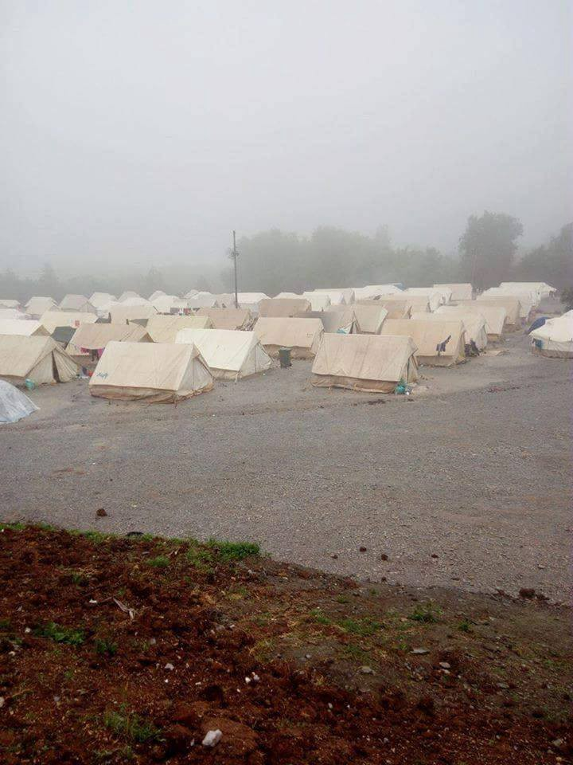
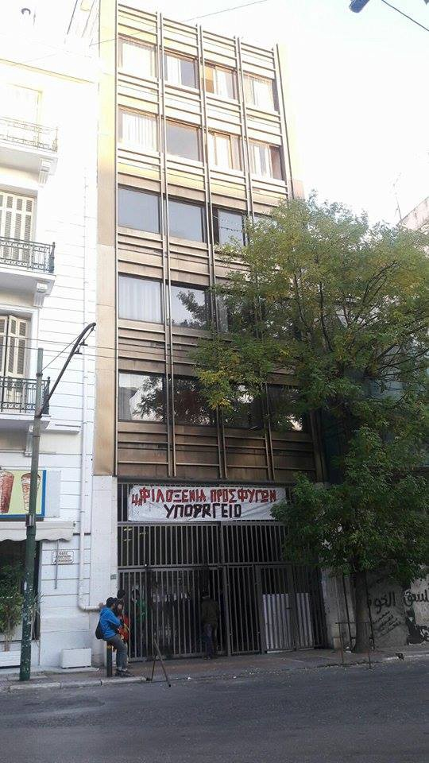
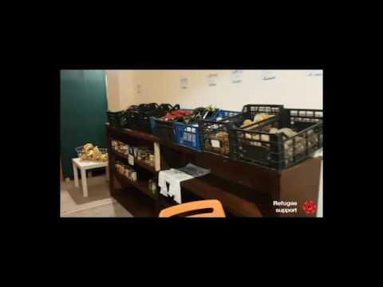
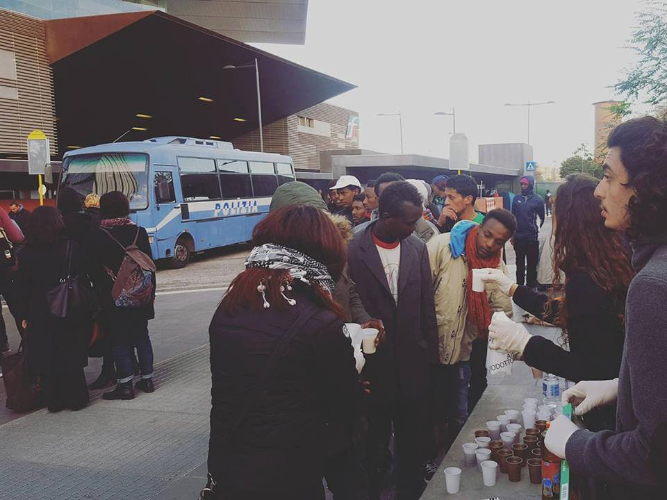
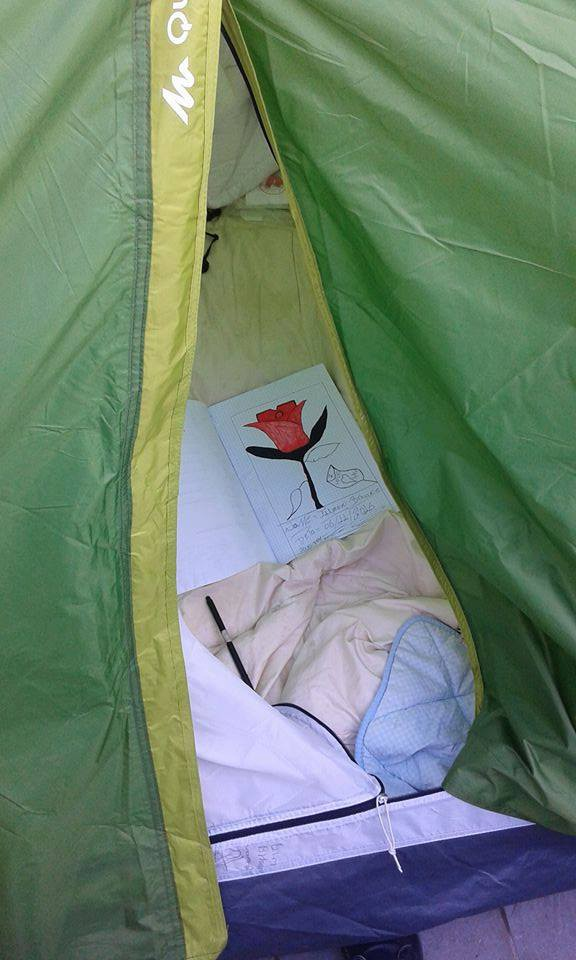
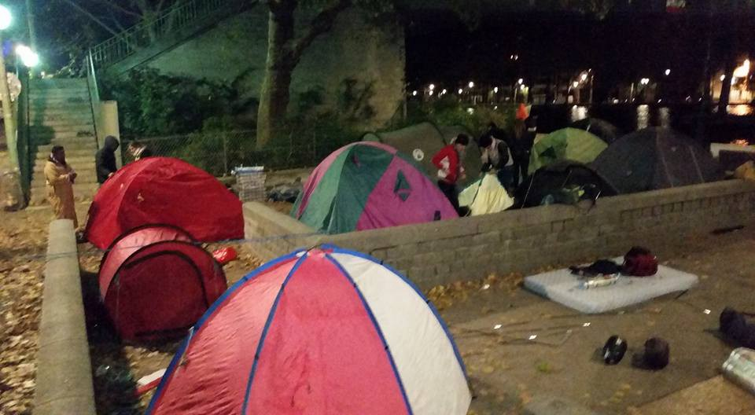
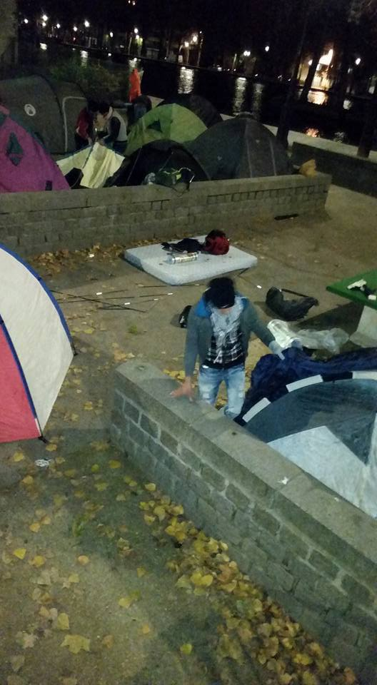
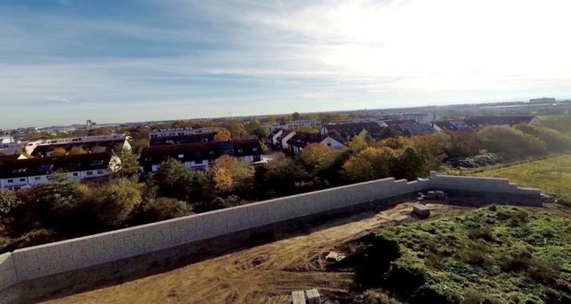
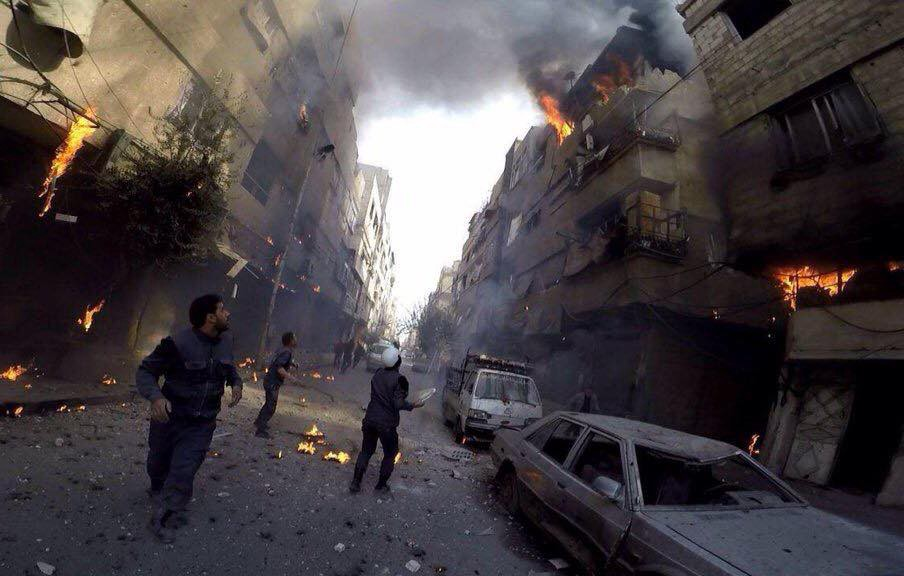

### AYS digest 7/11: UN report proves — No link between migration and terrorism — detention and encampment are the real threats

_No link between migration and terrorism — UN reports / Letter from the Petra camp in Greece / Reports of increased repression towards migrants, activists and volunteers / New squat in Athens and a meeting on self — education initiative of the squatters / Volunteers and donations needed in France and Greece / Baobab in Rome cleared again / Report on the silent prison that is camp in Gevgelija / Police breaking clusters of people sleeping on the streets of Paris / Calais Action active and ready for donations / Neighborhood in Munich building a wall around refugees / Damascus and Aleppo still under heavy fire_

Petra camp, Greece
#### Greece

There were 98 new arrivals on Greek islands today\. Thi adds to the number reached this weekend with over 15 000 people stuck in five “hot spots” in east Aegean islands\. The numbers are well over the staggering 15 000 count which was reported in the news and, according to official data there are now 16 187 people in the camps on the islands\. These camps became overcrowded long time ago, with the capacity for 8 204 people they now hold almost a double of that number\.
### **Letter from the camp**

Further, the situation on the mainland is becoming increasingly alarming with winter coming and from one of those camps, we have again received a pleading letter for help and acknowledgment\. A letter is from a Yazidi girl from Petra Camp : “I am a refugee from Petra camp in Katerini We are 1,200 people living in tents, there are children and women, the elderly and our case living very difficult as we live in a mountainous area is very cold and the atmosphere and there is nothing but suffering in this winter, we ask all charitable organizations and Greek government took us to the other place\. Organization ADRA and CYCI assist us in providing clothing and food, but we need a warm place\.”

Being that situation does not show signs of improvement, there was a reshuffling in the cabinet of Greek government and Ministry of Migration became now an autonomous ministry, thus separating from the Ministry of Interior\.
### **Closed borders are a threat to state security, there is no link between migration and terrorism — UN report**

Closed borders and vigorous attempt to lock people in Europe’s south or further more, Africa or Turkey is closely connected by the ongoing campaign of the link between migration and terrorism\. In that regard, UN Special rapporteur for human rights, Ben Emmerson represented today a report done by the UN on the non existent link between migration and terrorism\. The report details what many working in this field are saying for years — terrorist groups are not using migrant flows to infiltrate terrorist, but keeping people locked up, deteined and pushed back can serve as a breeding ground for terrorist organizations\.

Emmerson explained how the report shows that “Overly\-restrictive migration policies introduced because of terrorism concerns are not justified and may in fact be damaging to state security,” adding that “while there is no evidence that migration leads to increased terrorist activity, migration policies that are restrictive or that violate human rights may in fact create conditions conducive to terrorism\.”

The report finds that migration policies that build fences, engage in push\-back operations, criminalize irregular migration and abandon international legal commitments to refugees, lead to restricted access to safe territory and increased covert movements of people, particularly by traffickers\. “These conditions may ultimately assist terrorists and lead to increased terrorist activity\.”

“What is clear is that policies that respect human rights, justice, and accountability, and that manifest the values on which democracy is founded, are an essential element of effective counterterrorism policies,” Mr\. Emmerson noted\. “The further we move away from this, the more we concede to terrorist groups\.” For the full report, follow [this link](http://ap.ohchr.org/documents/dpage_e.aspx?si=A/71/384)
### **No Border Kitchen Lesvos reports on increased repression on the ground**

The repression detailed in report is much felt on the ground, with reports of police violence coming from Lesvos where No border kitchen claims that they are being harassed more and more in last couple of weeks by the police and even physically attacked \(by plain clothes person who would have not identify himself as police\) \. They even reported that police entered into the new social center and picked up everybody that was not “European looking” and brought them to the police station\. Still, No border kitchen says “Luckily everybody got out of the police station and Camp Moria quite fast and despite the repression our work goes on\. For now we still are in all of the spaces, not simply giving in to their threats\. We are still continuing to build and run them and we don’t plan to leave them after simple threats without any legal groundings\. Still we are cooking several hundred portions of food every day\. And still we fight for sustaining the autonomous spaces for all refugees, migrants, travelers and visitors that need them\. “ They need help for the winter, so if you are able to help, let them know via their FB page\.
### **Alternatives to the encampment and detention — new squat in Athens**

New squat in Athens

The wheels of solidarity and alternative to detention and encampment are still working and we are happy to announce that the new squat for pregnant and single women has just opened in Athens\. The squat is in Ahranon 22 and they need donations in Blankets, Diapers \(all sizes\), Powder milk for babies \(all ages\), Liquid milk, Wet wipes, Napkins, Brooms, Mops, Cleaning items, Mattresses, Trash baskets and bags, Canned food, Tools for kitchen, Plastic glasses, dishes, spoons and forks, Clothes, Shoes, Heaters\. For more, follow their [FB page](https://www.facebook.com/Aharnon22/?hc_location=ufi)
### **Squatters assembly for self — organised educational initiative — this Wednesday**

For all the squatters out there, there is a meeting this Wednesday 9th of November in Athens\. The assembly will be held in Gini building In Politechneio \(Patission and Stournari, entrance from Stournari\) with the aim of setting up of an educational initiative for refugees and migrants that currently reside in the squats in Athens\. If you have questions, contact Self\-organised Educational Initiative Ph\. number : \+30 6955 310674 Email : edusquats@espiv\.net
### **Regional advisers wanted in Greece**

Zora O’Neel has posted the message around volunteer and activist networks in search for experienced volunteers in an effort to expand the network of Regional Advisers\. Regional Advisors advise people how to plan their journeys\. If you are experienced volunteer and are willing to work as a regional advisor for a period of 3 or 4 months, write to Zora on her FB page where she has posted this message\.
### **Video with helpful tips on registration process**

Last, but not least, there is a helpful video circulating that has some useful information on the registration and asylum procedure\. Watch and learn

### **Refugee support have finished their “shops” in Filippiada**

A lot of work has been done since we last reported on this, but to spear us from words, watch this lovely video of what guys have built in Filippiada

#### Macedonia
### **The silent prison of Gevgelija**

There has not been many news from Macedonia filling the international news outlets because, as they probably see it, as well as those in power — 130 human souls trapped in a Gevgelija camp are just a small drop in the bucket\. Cynical politics that breed despair detailed in aforementioned report by UN holds these people hostage between worlds\. Since they are in non EU country they are not eligible for relocations and Macedonian government, unless in special circumstances, does not even allow people to walk outside the camp\. Even family reunification proves to be almost impossible and for those that come from countries which are members of NATO, EU or CEFTA, deportation looms\. Double detention, both inside Macedonian borders and inside the camp without any prospect or hope has led some organizations also to lose hope and meaning for their work since they feel as if they are aiding such a system of blatant incarceration of innocent\. Jasmin Redžepi who works in the camp has written a [touching account that is published in Al jazeera Balkans](http://balkans.aljazeera.net/blog/izbjeglice-u-devdeliji-padaju-u-ocaj) on what the situation is like in this small country with this “small” group of people so if you are BHS speaker we highly recommend you to read it
#### Italy
### **Baobab cleared again**

Baobab community

Baobab in Via Cupa in Rome witnessed it’s fourth clearance in little over a month\. This time, 70, already registered migrants were led by police from the Baobab to the office for foreigners\. Guys from Baobab community are following the case and have stored people’s personal belongings in order for them not to be taken away by police and are keeping the tents on sending the message that they are not yielding to the pressure\.

People’s belongings are saved by the community after police took them away
### **Course of condition of access to social and health services for foreign citizens to be held in Padua**

If you happen to be a lawyer interested into issues of migration, and violations of human rights as are probably described above, there is a course to be held in Padua on 2nd of December\. On A course will be held by project Melting Pot Europe, along with ASGI and Emergency: “Conditions of access to Social and Health Services for foreign citizens\. Law and praxis”\. This one\-day course is dedicated to lawyers, social assistants, legal and social operators and health professionals\. The order of lawyers in Padua acknowledges 6 formative credits, other orders will follow by\. For italian readers, please follow [the link](http://www.meltingpot.org/Condizioni-di-accesso-alle-prestazioni-socio-sanitarie-dei.html#.WCDbkfkrLIV)
#### France
### **Just because you can’t see them clustered in one place does not mean people are not still living in the cold streets**

Streets of Paris

With 4000 people taken from the streets of Paris to be placed somewhere else did not resolve the problem that those who stayed behind face\. Paris refugee ground support reports about the unaccompanied minors and others that are left out and still on the streets\. We bring their message in full “The youngest of this group was 13\. A dear friend spoke to the police, said that the group were children and could we please them? The police agreed that if they were not in the Jaures, Stalingrad, Flandres area that it was ok to give them tents\. So that’s what we did\. The dear friend pitched a tent with them, as he wanted to make sure these vulnerable children would be ok\. The police came at 4am and moved them all away, without the tents\. By no means has this situation been resolved\. From the ground, we see the need for residents to open their houses to those vulnerable, pro bono legal support, food and warmth\. It is essential that the media properly highlight the current and ongoing lack of information and resolution \. There is a need for a stronger presence of relevant local NGOs and more international NGOs taking action here and now\. Just because you can’t see them clustered in one place does not mean these people are not still on the winter streets\.”

Streets of Paris
### **La Cuisine Des Migrants — social kitchen on the streets of Paris**

For all of you living on the streets of Paris and those working with people who are forced into that situation there is a social kitchen cooking lunch and dinner for refugees on the streets of Paris\. They are always looking for donations of ingredients in order to provide this much needed food\. For more info follow [this link](https://www.facebook.com/La-Cuisine-Des-Migrants-305783063121648/)
### **Calais Action still working — read how you can help**

Also, Calais action is still working full speed ahead and if you are able to help with donations and free hands, please follow [this link](https://www.facebook.com/calaisaction/posts/1324948477557654?hc_location=ufi) for further information
#### Germany
### **German legal system under pressure**

Pressure is piling up on the legal system in Berlin\. While in 2015 they dealt with 2343 asylum requests/legal processes, the first 10 months of this year already mark 6908 cases\. Lately, most of the asylum seekers were only provided with the subsidiary protection\. A judge told Tagesspiegel these processes could take years and burden the justice system\. The refugees have no costs in the process, either Berlin covers it of BAMF, depending on the outcome\. Due to this, they predict no family reunification until March 2018\. For German readers follow [the link](http://www.tagesspiegel.de/berlin/fluechtlinge-in-berlin-syrer-legen-verwaltungsgericht-mit-klagewelle-lahm/14798762.html)
### **Neighbors who believe that building a wall around refugees is what they need**

Site of the future hostel for unaccompanied minors rapped up in a wall

Our next bit of news is something that even the editor writing these lines cannot believe\. Pushed by the initiative of local residents in a part of Munich where a hostel for unaccompanied minors is to be built, the authorities have erected a two meter wall in order to separate the hostel from the neighborhood\. The justification for this was that this is a way to prevent noise pollution from the hostel onto the neighborhood\. Local politician who stood in the opposition towards such a decision has made a video of this monstrosity and is urging for it to be shared so as this shameful act would not pass unnoticed\. For more, follow [this link](http://www.dailysabah.com/europe/2016/11/07/4-meter-high-wall-surrounding-munich-refugee-hostel-sparks-controversy)
#### Syria
### **Damascus\.**

Damascus is under heavy fire, Rami Jarrah reports: “An intense wide scale offensive is now taking place in Duma of Damascus, an area that is totally under siege by Syrian regime forces, Duma has witnessed more than 15 airstrikes this afternoon alone\. Assad’s forces have began an assault on the district placing civilians there with nowhere to go, in total dismay as how to react\.”

Duma, Damascus Syria, photo Rami Jarrah

White helmets are present and working with extraordinary strength in order to save and prevent further deaths caused by airstrikes\. For a video of their efforts follow [this link](https://twitter.com/SCDrifdimashq/status/795647454981029888)
### **Aleppo and its children**

Aleppo is not sleeping either, this Sunday an orphanage was hit and Asmar al\-Halabi, the director of the orphanage recounts this atrocious event by saying “I heard children’s screams and crying from downstairs, so I rushed to where they were\.” After the attack, the director says he found the orphanage’s 150 children, ages three to 15, in shock\. “One child was huddling in the corner of the room,” Al\-Halabi says\. “Another was so scared he wet himself, and another was so frightened that his entire body was shaking\. Two children, now recovering in a nearby hospital, were pierced by shards from the blast\. The orphanage’s food supplies were destroyed\. “We’re worried we won’t be able to fix everything,” says Al\-Halabi, who is working on moving the remaining children to relative safety in the building’s basement\. The siege, as well as airstrikes and fighting in Syria’s largest city, have had disastrous effects on its children\. Doctors Without Borders counts at least 114 children killed and 321 wounded since September 2015, when regime and Russian forces launched an offensive to seize Aleppo’s rebel\-held east\.” Syria direct reports\. For more follow [the link](http://syriadirect.org/news/regime-shell-hits-east-aleppo%E2%80%99s-only-orphanage-%E2%80%98psychologically-the-coming-days-will-be-very-hard-on-them%E2%80%99/)

_Converted [Medium Post](https://areyousyrious.medium.com/ays-digest-7-11-un-report-proves-no-link-between-migration-and-terrorism-detention-and-a8a21a487efe) by [ZMediumToMarkdown](https://github.com/ZhgChgLi/ZMediumToMarkdown)._
