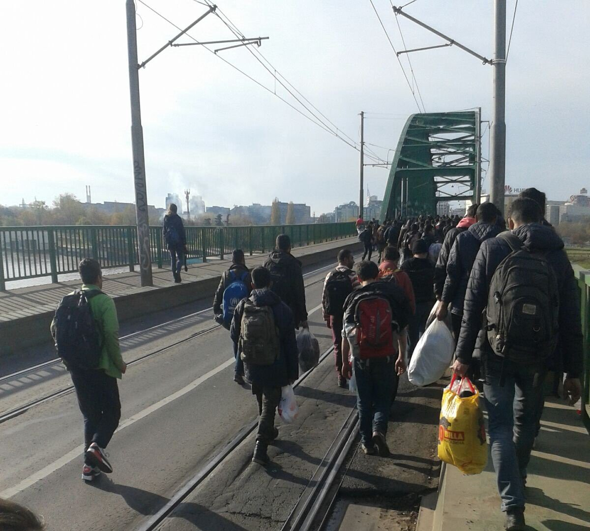
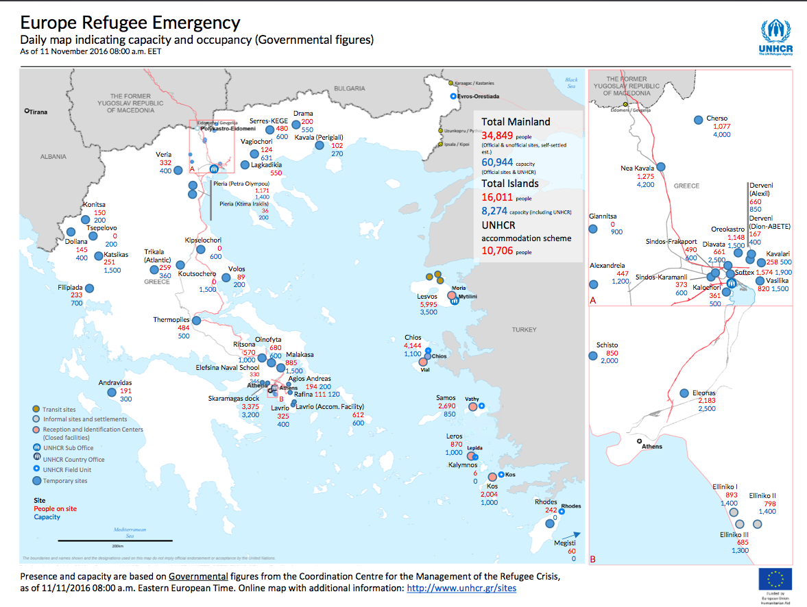
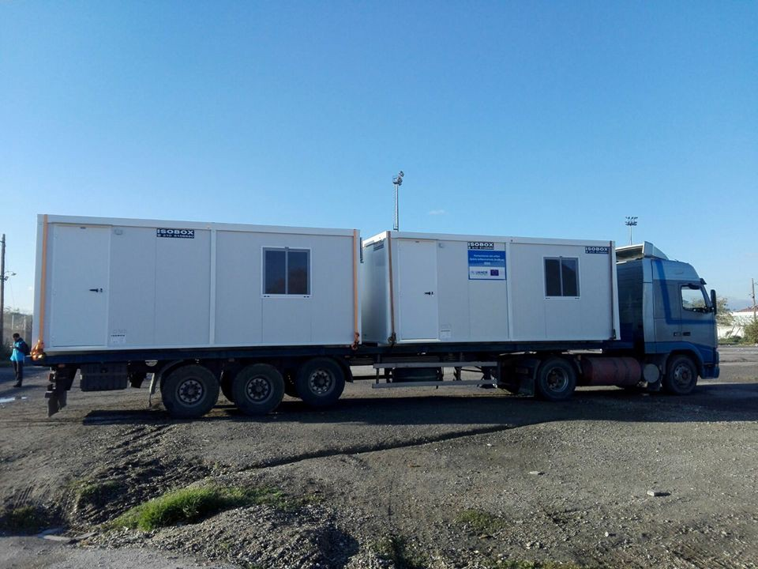
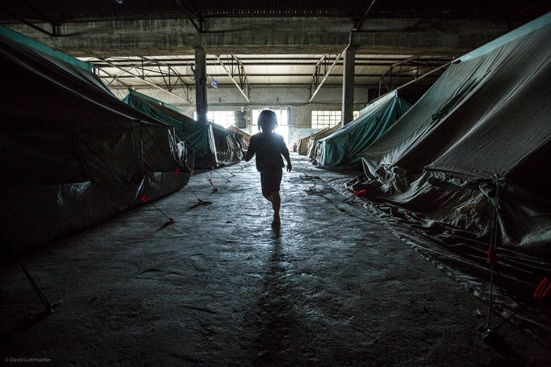
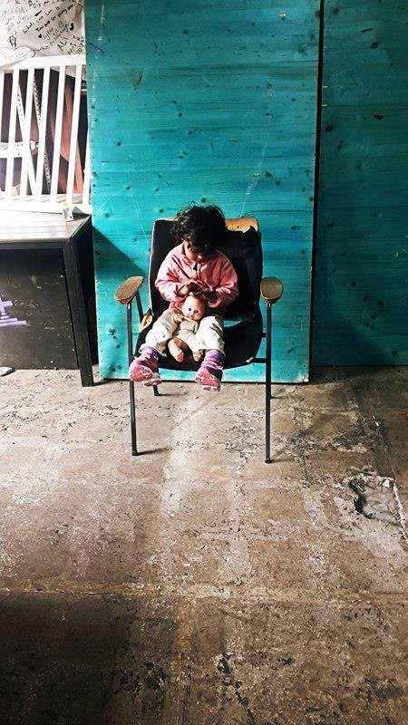
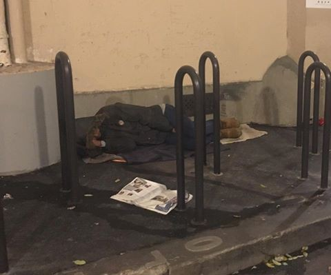
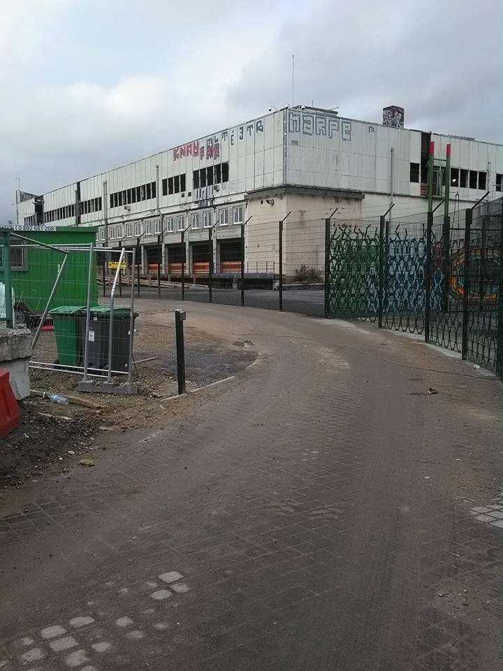

### AYS Digest 11/11: Refugees march towards the Croatian border

_UNHCR says transfers to the Greek mainland are necessary\. Shelters need to be improved as winter approaches\. Children sleep in the streets of Paris\._

Photo by Belgrade Updates
#### Syria & Iraq

**98 killed in Syria and 31 in Iraq**

The Syrian Human Rights Committee says 98 civilians were killed yesterday, including 11 children, seven women and one killed under torture\. 63 of those individuals died in Aleppo\. [The New York Times](http://www.nytimes.com/2016/11/11/world/middleeast/aleppo-un-starvation-risk-russia.html?smid=tw-nytimesworld&smtyp=cur&_r=0) reports that Russia has rejected the UN’s plea to allow food deliveries to eastern Aleppo\. Food could run out as soon as next week\. Other sources say electricity is not available for most residents, and basic medicine has run out as well\.

Iraqi Body Count says 31 people were killed in the country yesterday, including 22 executed in Hawija\.
#### Greece
### Transfers to the mainland necessary

UNHCR says reception centres on the islands “continue to face serious challenges with capacity and adequate shelter allocation for new arrivals\.” They believe transfers to the mainland need to be accelerated in order to alleviate tensions\.

The newest [map of Greek refugee camps](http://data.unhcr.org/mediterranean/download.php?id=2157) provides evidence for this position\. Currently, the mainland houses only 34,849 refugees, out of a total capacity of 60,944\. Meanwhile on the islands, over 16,000 live in camps meant for only 8,000 people\. However, after the Moria fire in September, a spokeswoman for the European Commission, argued that transfers to the mainland should remain limited, in order to “avoid secondary movement to the rest of Europe\.”

### Shelters need to improve as temperatures drop

UNHCR also states that “there is still an urgent need for authorities to equip all sites with adequate facilities to ensure the well being and safety of asylum\-seekers\.”

Refugee Support Greece reports that UNHCR has sent ISO Boxes to the Alexandreia camp, meaning that refugees can finally leave their tents before temperatures drop even further\.

Photo by Refugee Support Greece

UNHCR plans to replace tents in eight camps with 1,000 similar containers\.

‘Northern Greece Volunteers’, a coalition of independent teams, says that the opening of the Help Refugees Warehouse has allowed the distribution of more than 1,000 winter packs, 11,000 fresh fruit and vegetable packs and the creation of more than 3,200m2 of flooring, to lift tents off the ground and protect families from cold\. The different teams still need volunteers — you can apply directly through their [website](http://www.northerngreecevolunteers.com/) \. Other groups all around Greece are also looking for volunteers through [Greecevol](http://greecevol.info/) \.

Over the long\-term, the real solution is not only to improve conditions in the camps, but to finally accelerate the relocation of refugees from Greece to the rest of Europe\.

Until now, only 5,437 refugees out of a target of 66,400 have been relocated\.

Photo by David Lohmueller
### Useful contacts in Athens

[The list of useful contacts for refugees in Athens](https://lookaside.fbsbx.com/file/Other%20useful%20contacts%20in%20Athens%2011%20November%202016.pdf?token=AWw0RxAqleh4O2x3rc-5RlIFj4FE6Hwq-6NvGIMQzIh1HcT1pM4nX27-6hJwhlZ_fCZg6nRM6kkoA8DQX-j_sfAJd7IKdrQ6UR2L7HkcNcUWW-GW-71zzZI3u_dpi4x_9EmieYV2FMSz-w56GQhvo9cFTP8V9wTIEk-DqUyMD4H7Rg) has been updated\. It contains centres for medical, psychological and legal support, among other services\.
#### Serbia
### Refugees march towards the Croatian border

According to No Border Activists, around 100–150 people are walking on the highway towards the Croatian border in a third “march of hope” protest, asking for the borders to open\.

The march was prompted by yesterday’s police raid on refugees living in Belgrade’s abandoned warehouses, during which 109 people were taken on buses and sent to the Presevo camp\.

More than 1,000 people are still sleeping rough in Belgrade in extremely difficult conditions, and the approaching winter is only making matters worse\. However, camps are overcrowded and refugees fear being sent back to Macedonia, which partially explains why they prefer to sleep in the streets\.

Photo by Refugee Aid Miksalište
#### France
### Children sleeping in the streets of Paris

Paris Refugee Ground Support walked through Paris and still found several children sleeping in the streets:

> _“A 16 year old Afghan boy arrived 2 days ago had no idea where to go and is sleeping on his own under an archway of a small side street\. A 15 year old Afghan boy sleeping in a garden by the canal\. A 13 year old Afghan boy here alone, luckily found and helped by citizen volunteers opening their home for him but just for a night possibly two\.”_ 

Photo by Paris Refugee Ground Support

The new refugee camp in Paris is only meant for adult single men — children are supposed to go to a special office, the Demie, which will then provide them with shelter\. However, the Demie rejects around 75% of those going to the office, claiming that they are not really underage\. This decision can be appealed, but it takes between two and six months until a decision is taken, leaving them with no official shelter in the meantime\. As the street camp has been closed and is now under surveillance by the police, people are also forced to sleep in hidden streets, making it harder for volunteers to find them\.
### France prepares to accelerate deportations

As we recently wrote, an article by [Le Monde](http://www.lemonde.fr/immigration-et-diversite/article/2016/11/08/la-france-se-prepare-a-expulser-plus-de-migrants_5027326_1654200.html) explores the state’s desire to accelerate deportations\. The article recounts a recent call for project bids to create 5,531 places in accommodation centers, to process returns to other EU countries\. The blog [Passeurs d’hospitalités](https://passeursdhospitalites.wordpress.com/) says the reform of the Dublin III protocols will make it easier for countries to deport refugees to their point of entry; they argue that this explains why the French state is preparing the necessary infrastructure for deportations\. You can find an analysis of the reform in English [here](https://passeursdhospitalites.files.wordpress.com/2016/11/pro-asyl-positionpaper-dublin-iv-reform-june-2016.pdf) \.

Baam, a local NGO, fears that the Parisian camp will also act as a triage centre, allowing the administration to decide between “good” and “bad” migrants and deport refugees according to Dublin regulations\.

Photo by Baam
#### UK
### Urgent need for collectors

[Samara’s Aid Appeal](https://www.facebook.com/winterclothesappeal/) urgently needs more collectors across the UK to help them gather and pack aid items to send to Syria and Iraq\. Basic items like winter clothes and shoes are needed as temperatures drop\. You can request an information pack [here](http://information pack before you start collecting as we work in a specific way www.samarasaidappeal.org/collectors) \.

_Converted [Medium Post](https://areyousyrious.medium.com/ays-digest-11-11-refugees-march-towards-the-croatian-border-55804ac4c434) by [ZMediumToMarkdown](https://github.com/ZhgChgLi/ZMediumToMarkdown)._
