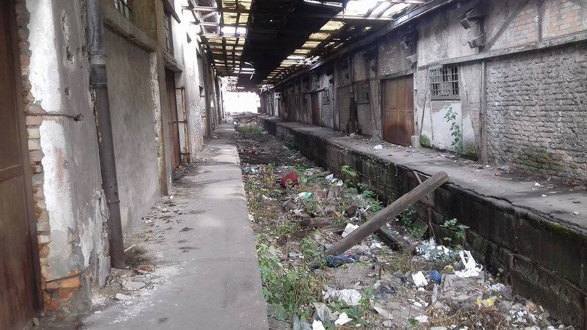
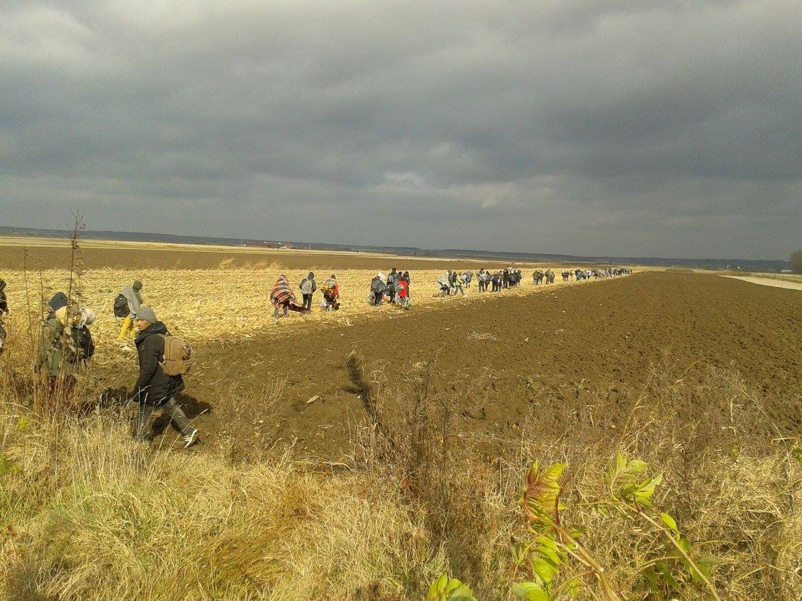
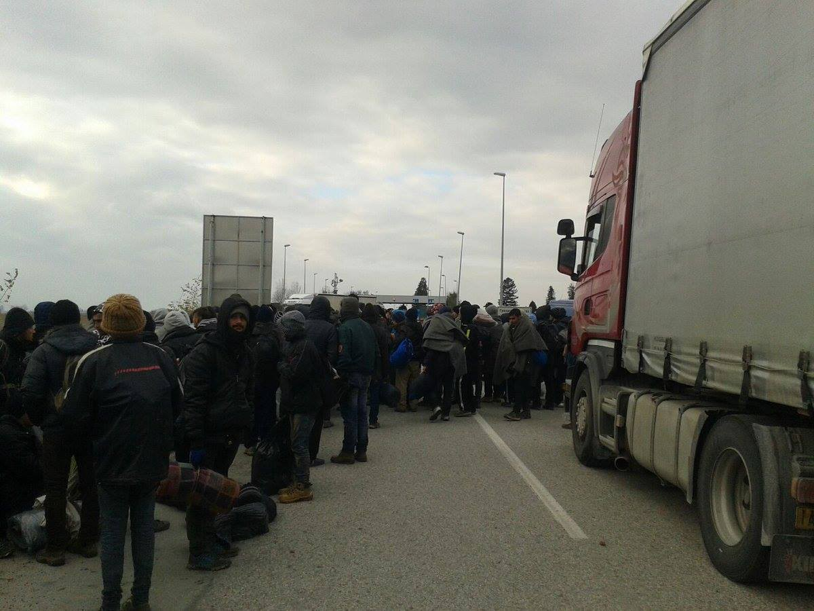
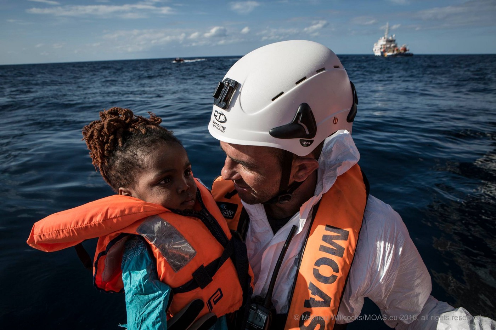
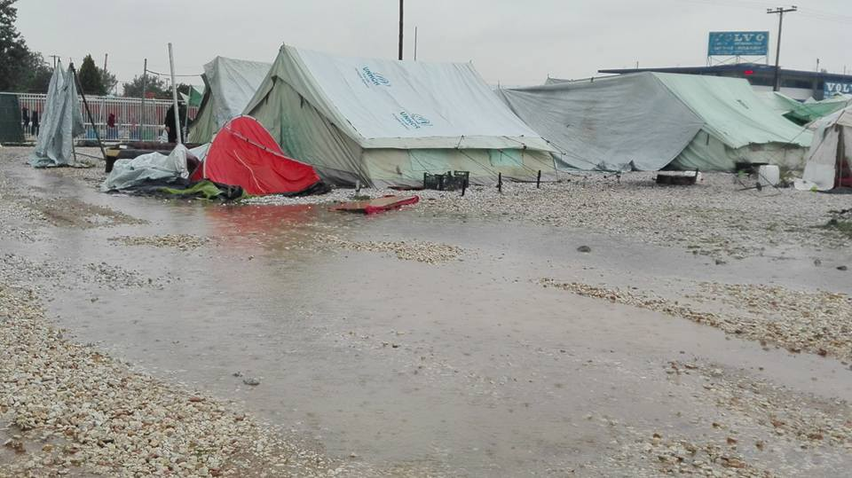
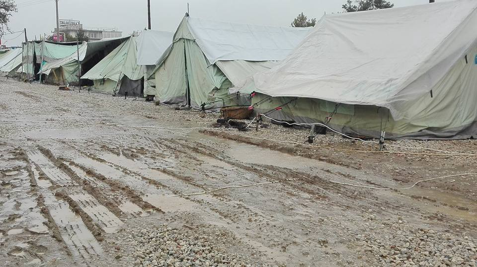
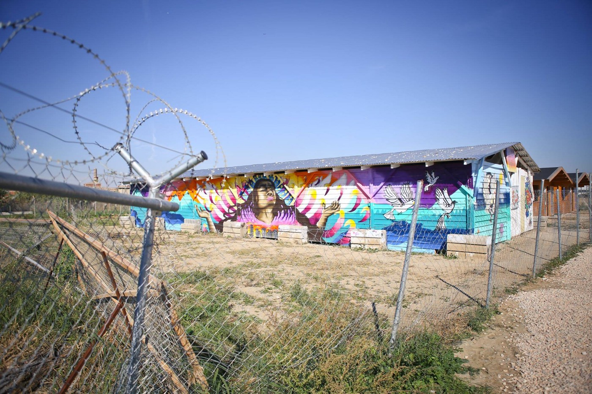
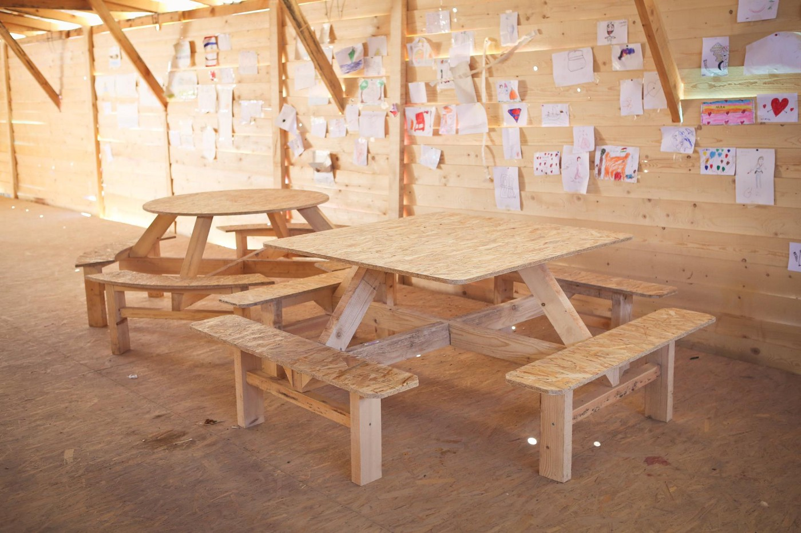
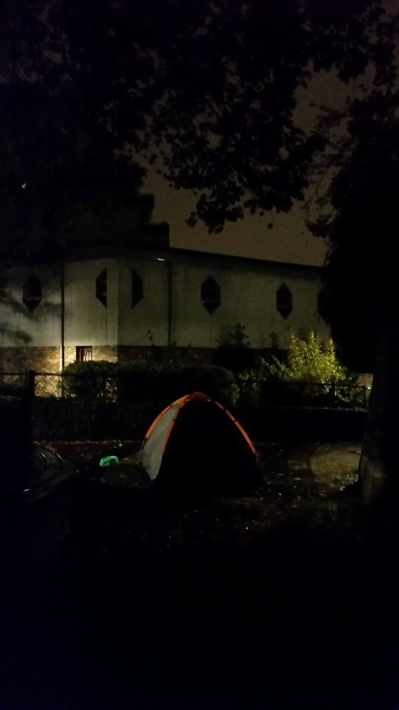
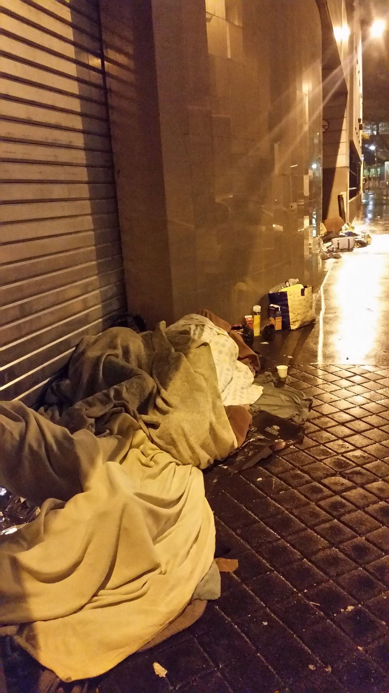

### AYS DAILY DIGEST 13/11: \#MarchOfHope in the front of the closed doors of the European Union

_Around 140 people who were marching in protest from Serbia stopped before the border with Croatia // More new arrivals to Italy and Greece // Extra police security to be dispatched to the refugee camps on the islands before neoNazi protest this week // In France, volunteers are faced with police mistreatment_

 \. Photo by بسام العيسى المقداد](assets/d77d96f3f1ef/1*AsLYl3MFuj5ZGF4UHLSysw.jpeg)

“Although everything in the camp Katsikas of grief and problems and the rigors of cold and everything, but when you look in the sky to feel hopeful\.” [KatsikasLive](https://www.facebook.com/muhammadalisyria/) \. Photo by بسام العيسى المقداد
### Serbia
### Feature story
#### Waiting for Europe to open its doors

Late this evening, around 140 people — mostly man from Pakistan and Afghanistan — arrived near to the city of Sid, Serbia, hoping to enter the EU at the border near Tovarnik, Croatia\. But the border remained closed for them, while police increased its presence on both sides of the border\. Police prevented group of volunteers to bring food, blankets and hot tea for refugees claiming that it is responsibility of the local authorities, who, whoever, did not put enough effort to help to the people who are protesting in this way\. Journalist from both sides of the border were also forbidden to come close to refugees\.

\#MarchOfHope\. Photo by @BelgradeUpdates

To all those who are hoping to cross, the Croatian minister of interior Vlaho Orepić sent a message that the border will be guarded and “nobody will be able to enter illegally”\. All of the people who took part in the march were offered accommodation at the center in Sid, but many refused and decided to stay over the night in the field protesting the EU policy of closed borders\. Volunteers who are following the march are asking for blankets, sleeping bags, or anything that can help people keep warm\.

This is a third time refugees in Serbia are protesting in similar way harsh conditions and close borders\. Previously they marched toward Hungary and than toward Croatia\. This \#MarchOfHope, as it is called by activists and refugees who are taking part, started on Friday when more than 150 people left Belgrade to walk toward Croatian border\. Serbian police closely follows march, while representatives of various organizations — including MSF, UNHCR, DRC… —are providing basic help\.

[The march was prompted by police raid on refugees living in Belgrade’s abandoned warehouses, during which 109 people were taken on buses and sent to the Presevo camp](https://medium.com/@AreYouSyrious/ays-news-digest-10-11-refugees-in-serbia-have-no-choice-but-to-run-and-hide-a21881df24d3#.y7yjc6rkd) \. Today Himad A\. … sent us a photo of a place where refugees are sleeping in Belgrade\.

Photo by Himad A\.

According to some estimates, over 1,000 people are sleeping rough in Belgrade, in extremely difficult conditions\. Camps in Serbia are overcrowded, and refugees fear being sent back to Macedonia\. [AYS published several reports this week warning about bad conditions and treatment of refugees in Serbia](https://medium.com/@AreYouSyrious/ays-daily-news-digest-9-11-refugee-testimonies-about-mistreatment-in-serbia-8c2bc49e529c#.7ad87s8go) , and we will continue following the situation, hoping that somebody will react\. This is all happening in the country that strives to become EU member soon\.

](assets/d77d96f3f1ef/1*qbaWP9qDMzAxa6a_5k7muw.jpeg)

Photo by [@BelgradeUpdates](http://twitter.com/BelgradeUpdates)
### Mediterranean

Two boats have been engaged since early this morning in multiple rescues at the sea\. According to [MOAS](https://www.facebook.com/migrantoffshoreaidstation/) , a total of 339 persons have been pulled to safety\.

Photo by MOAS\.

The day before, about 1400 people were rescued from six boats in the Mediterranean, including more than 700 who were taken off a large wooden boat spotted before dawn\.
### Greece
#### Neo\-Nazis to march in Greece

New arrivals are registered in Greece even today\. According to official figures, 78 people arrived by boats — 68 to Lesvos \(more than 6100 people are there at the moment\), and 10 to Chios\.

Meanwhile, Greek media are announcing big neo\-Nazi protests scheduled for Tuesday and Wednesday on Chios and Lesvos\. Authorities are afraid of violence as counter\-demonstrations\. Protest are organized by ultra\-right party Golden Dawn whose activists are distributing flyers in the islands saying that the main speakers during rallies will be senior ranking party members Ilias Kasidiaris and Yiannis Lagos\.

Extra police security will be dispatched to the refugee camps on the islands\.

By Abolfazl Mohtarami
Via Syrilution Creative Arts
#### Help if you can

People who are forced to live in inhumane conditions in camps in Greece are in desperate need of help\. It is cold, getting colder, and people do not have winter close, rain coats, rain boots…

Softex camp\. Photo InterVolve

_“It’s raining cats and dogs today in Softex\. The whole camp is flooding and most of the tents are not waterproof\. This is just the start of the rainy season and it will get way worse\. People are in desperate need of raincoats and rain boots\. It costs only 6 EUR per pair of rain boots, so please consider donating to help them stay dry\.”_

Donations can be made via [fundraising page](https://fundrazr.com/718SN9…) \.

Find [list of urgently needed items](https://drive.google.com/…/fol…/0B1nwHRSdkNdZcWNUdWEzN3hoUms) to cover the basic needs of the refugee community in the camp in English and Greek\.

> Info for volunteers 

> For all of you who would like to join volunteers in Greece, and have questions about it, you can contact one of the advisors, former and current volunteer\. The whole list with the names of advisors can be found [here](http://www.bit.ly/greecevoladvisers) \. 

> Latest calls for volunteers and helps you can find [here](http://greecevol.info/index.php) \. 

#### Beautiful story of solidarity and empathy from Softex

Refugees who are living in Softex and volunteers from [HelpRefugees](http://www.helprefugees.org.uk) and [InterVolve](https://www.facebook.com/InterVolve-International-Volunteers-219418945063168/) built a cultural center in this camp that is considered one of the most dangerous\. A range of workshops is offered in the center\. If you can, help these organizations to continue their great work in Softex\.

Cultural center\. Photo by HelpRefugees\.

We got the news that clowns are on their way to put smiles on children's faces in Ioannina where they will join at [The Flying Seagull Project](https://www.facebook.com/flyingseagulls/) , a charity working in with the children\. Their motto is:

> 1\. Find someone you love\. 
 

> 2\. Give them a hug\. 
 

> 3\. Squeeze their nose and make a honking sound to make them laugh\. 
 

> 4\. Repeat\. 

### France
#### Fear in the street of Paris

The situation in France for refugees is not much better than in Greece\. Many, too many, people are spending days and nights out in the open\. Volunteers who are trying to help are often stopped by the police and searched\. [Paris Refugee Ground Support](https://www.facebook.com/PRGS.team/?hc_ref=SEARCH) volunteers were stopped on their way to distribute some necessities for people in the streets of the city of light\.

> “Last night we were confronted by the Police\. We were giving tents to some French volunteers\. They tried to tell us we had no British vehicle tax \(England no longer uses display tax discs\) \. We asked the officer to check the law\. While he did that, another checked our passports, drivers license, and vehicle documents and another asked to see inside the van on the grounds of the possibility of harboring a terrorist\. He saw boxes of jumpers and raincoats\. Later, whilst distributing very discreetly in a narrow street to a small group of Afghans, one at a time, we were intensely monitored by a group of locals\. One of our team was then surrounded by five of them and told to leave the area\. We asked them who they were and on what grounds we should leave\. They answered with soft threats of calling the police\. It feels as though giving out anything to a refugee has been criminalized making us have to act stealthily and seem suspicious to the neighborhoods\. Paranoia is building up amongst the volunteers in Paris with more and more incidents involving police “control”\. We had to add a new role in our team: Police lookout\.” 

Photo by Paris Refugee Ground Support\.
### Germany

> Info about asylum procedure in 9 languages 

> [New information about asylum procedure in Germany](https://welcome2germany.wordpress.com) is available providing useful information about the asylum procedure in 9 languages, including Amharic, Arabic, Farsi, Turkish\. 

_Converted [Medium Post](https://areyousyrious.medium.com/ays-daily-digest-13-11-marchofhope-in-the-front-of-the-closed-doors-of-the-european-union-d77d96f3f1ef) by [ZMediumToMarkdown](https://github.com/ZhgChgLi/ZMediumToMarkdown)._
