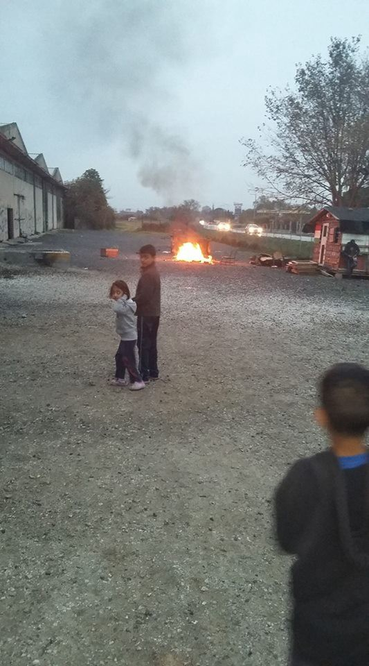
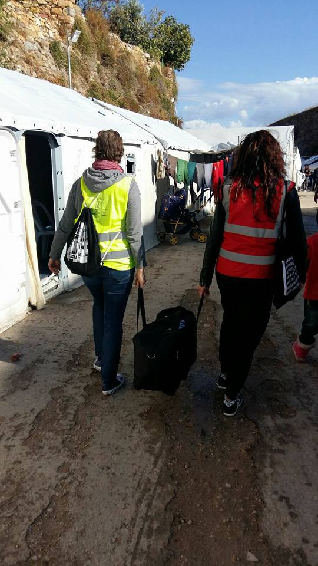
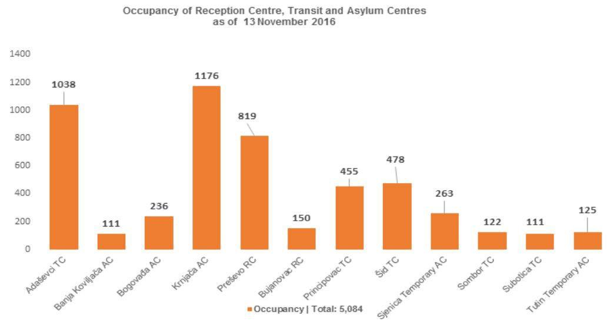
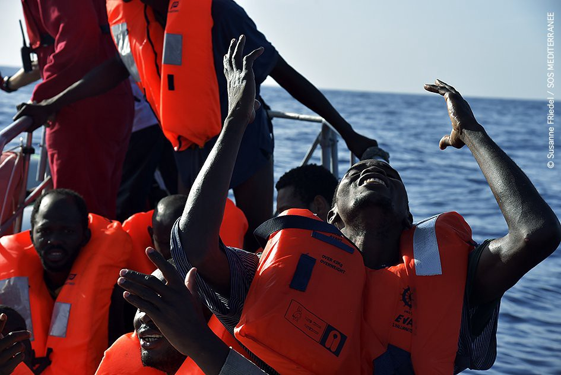
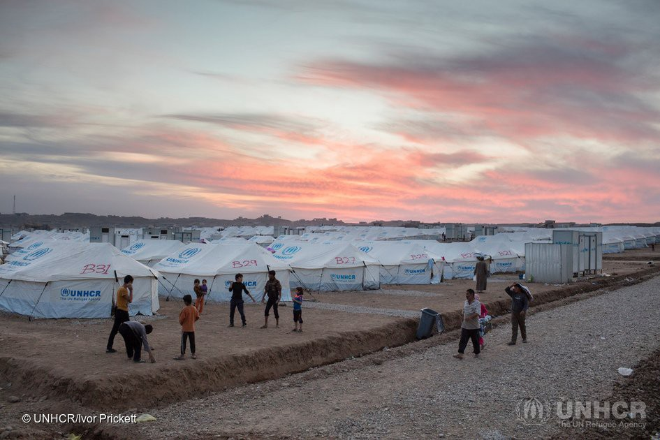

### AYS News 15/11: Winter is coming and bringing the new crisis for refugees in Europe

> Winter comes as another danger for refugees in Europe\. Greek refugee camps are in horrible condition\. Day five of March of Hope in Serbia\. Refugees continue to drown in the Mediterranean\. 

](assets/6e343d473a16/0*1OsZsfeFz-GURX8_.)

Credits: [**A Polaroid for a Refugee**](https://www.facebook.com/DelSartoGiovanna/)
#### Greece
### Winter poses new danger for refugees

A bleak winter beckons for many refugees and migrants trapped in Greece, with thousands left vulnerable to the elements\.

Aid organizations are offering winter assistance to those stuck in the country since the closure of the Balkan route last spring\.

The Greek government has largely succeeded in shifting most people from ad\-hoc sites into state\-run camps, but conditions in the camps vary widely\.

As one UNHCR spokesman admits, “more speed” is needed in efforts to minimize the impact of the coming cold\. Many still have no more than a tent to protect them in the coming months\.

More than 50,000 refugees and migrants are trapped in Greece\. Among them, 10,000 people who are still living in tents and exposed to the elements, with an estimated 6,000 more living in tents within warehouses, prompting fears of indoor fires as the cold bites\.

A few thousand more have found their way into squats, which can lack basic heating\.

Across the country, a patchwork of aid agencies and volunteers is moving to respond to the onset of winter, with a mixture of cash assistance and items such as warm clothing and sleeping bags being distributed, while some people are being moved into housing\.

Even in the best case scenario, however, it is expected that at least 10,000 people will be left to endure the elements in tents or warehouses\.

The UNHCR, the U\.N\. body that overseas aid for refugees, admits current measures are not up to pace\.

“It’s late in the game, and it is a serious matter if you have people in tents when it begins to snow,” Roland Schoenbauer, a UNHCR spokesman said\. “There is goodwill, but we need more speed\.”

Hamstrung with debt, and host to a new population because of the decisions of other states, Greece has found itself trapped in a situation not of its making\.

Although acknowledging the challenges it faces, the International Rescue Committee’s Jane Waite questions what she sees as a lack of planning by the government, which did not respond to a VOA request for comment\.

Waite, who said it could be a struggle to get permits to bring aid into the camps, pointed out that facilities in the Greek islands are well over capacity, but that the opposite held true on the mainland\. This provided an opportunity for the state to move people from inadequate camps into those with better facilities — but, she said, the opportunity was being missed\.

“Winter is not a new thing; everyone knows it will come,” Waite, the IRC’s deputy director for programs in Greece, added\. “While a plan is now being developed, it has taken a very long time\.”

Most of those in the camps remain stuck in the slow\-turning cogs of EU bureaucracy, waiting for permission to stay in Greece or legally relocate elsewhere in Europe\.

Of the 66,400 people the European Union pledged to move out of Greece and elsewhere on the continent, less than one tenth has moved on, prompting some to attempt crossing into the rest of Europe illegally\.

Having fled danger, refugees once again fears what the coming months will bring\. “Here, we are dying slowly\.”
### Numbers

Today’s registrations:
- [Lesvos](https://www.facebook.com/hashtag/lesvos?hc_location=ufi) 48
- [Chios](https://www.facebook.com/hashtag/chios?hc_location=ufi) 10
- [Samos](https://www.facebook.com/hashtag/samos?hc_location=ufi) 16
- [Leros](https://www.facebook.com/hashtag/leros?hc_location=ufi) 38

With todays registrations, the number of new registrations in November rose above 1000 \(1055\) \. This includes: 418 registratons on Lesvos, 95 on Chios, 274 on Samos, 131 on Leros, 39 on Kos, 11 on Rhodes, and 87 on Kastellorizo \(Megisti\) \.

While Samos has seen the most arrivals in the last month, this month \(in November\), it’s Leros island that is seeing the greatest number of new arrivals\.

There have been 1055 recorded new guests only on the Aegean islands\. The total number throughout Greece rose from 61\.327 \(1/11\) to 61\.907 today \(15/11\) \. Moreover, since 1/11, there have been 4 deportations to Turkey and 190 voluntary returns\.
### Vasilika camp: No electricity, no heating

](assets/6e343d473a16/0*xYhwKKmXkz2376sc.jpg)

Credits: [**Eidomeni Refugee Support**](https://www.facebook.com/groups/eidomeni.refugee.support/)

](assets/6e343d473a16/1*kA2Hu9HG30gPGY9B6gfOlw.jpeg)

Credits: [**Eidomeni Refugee Support**](https://www.facebook.com/groups/eidomeni.refugee.support/)
### Samos hotels refuse to take refugees from flooded camp: Choosing tourists over refugees

Rain flooded a refugee camp on Samos\. On Samos, the association of hoteliers on Monday said it will turn down applications by the United Nations High Commission for Refugees to house camp residents whose tents were destroyed by rain\. Hoteliers’ association head Kostas Kyriazis told Kathimerini he had received an ultimatum from tour operators to “choose between tourists and migrants\.”
### Riots in Athens on Thursday \(17/11\)

Every year on November 17th a lot of people in Athens pay tribute to the uprising at the Athens Polytechnic School in 1973\. This event is usually violent and dangerous, with fights between police and protestors\. This happens around the Polytechnic University in Exarcheia\.

In the past, people were not allowed to enter Exarcheia after a certain time, usually in the afternoon\.
It is important to inform refugees about the possibility of violent clashes happening in the area with Molotov Cocktails thrown, tear gas, trash bins on fire etc\. Everybody must have an ID on them if circulating in the area in the afternoon\. It is very important that people stay indoors\.
### Chios in the past 10 days

Many hours passed in sorting the warehouse\. English lessons, school lessons\.
Three pallets of emergency supplies arrived at Eleusina camp\. Unaccompanied minor from Kivotos were moved from Chios to Athens\.
Meal distribution from Zaporeak kitchen\. Distributions of male and baby donations to Souda camp\. And it continues\!

](assets/6e343d473a16/0*wQ516XNgMZqBF8hO.)

Credits: [**Chios Eastern Shore Response Team — Info Point**](https://www.facebook.com/groups/421759534684819/)

](assets/6e343d473a16/0*mc4NvSmonM6MyGdC.)

Credits: [**Chios Eastern Shore Response Team — Info Point**](https://www.facebook.com/groups/421759534684819/)

](assets/6e343d473a16/0*qt5s0sQNXmcCmxC3.)

Credits: [**Chios Eastern Shore Response Team — Info Point**](https://www.facebook.com/groups/421759534684819/)

](assets/6e343d473a16/0*9yOL3-Yp0ThJdts2.)

Credits: [**Chios Eastern Shore Response Team — Info Point**](https://www.facebook.com/groups/421759534684819/)

](assets/6e343d473a16/1*WNG62u7Wkc9w2Rn9MPIcVw.jpeg)

Credits: [**Chios Eastern Shore Response Team — Info Point**](https://www.facebook.com/groups/421759534684819/)
### Locals on Chios are demanding that two camps be shut down after a riot last week

Migration Minister Yiannis Mouzalas on Monday urged media representatives from Chios to quell local opposition to a proposal for a third camp to help ease the pressure on the two facilities\.
### Anti\-facists demonstration against the Golden Dawn presence on Chios
### A field trip to the Samos seaside

](assets/6e343d473a16/0*WRYIWyeTcq5u3Vd6.)

Credits: [**Samos Volunteers**](https://www.facebook.com/samosvolunteers/)

Here is a recording of a song about Winter that a group of girls from Afghanistan wrote and performed together\. It was recorded at the beach yesterday\. Enjoy\!

[https://soundcloud\.com/dav\-shiel/come\-back\-winter](https://soundcloud.com/dav-shiel/come-back-winter)

If you’d like to help us expand and enrich such educational and recreational programme at Samos, then please get involved here:
[https://samosvolunteers\.org/2016/08/09/donations/](https://www.facebook.com/l.php?u=https%3A%2F%2Fsamosvolunteers.org%2F2016%2F08%2F09%2Fdonations%2F&h=SAQEGIP6UAQGq-mhINnBrJOuKxmPGnWf5mVB_HAbFEMSLLQ&enc=AZPRi69t-pgxLr774_pvMkaLOkO7ckgQ4-Deuws7ntZ7MhXelB_4qMNxePCmUVqQpmYv1qiwvEdAHNHnvxLSg-gJgDV9S3YNzsnl_ZC_rd8I2q1cOfB8Kn9m1svhueVk7qSqWYvbOW_fYYCfMqLtJeRnHQXvXgCloDJxSgxeXDt0DwYdqyWVGSxkjTfZqvuNejg&s=1)
### Tomorrow, the construction starts in Oinofyta

Thus that volunteers can bring the 178 refugees from the tents in the abandoned building\. 49 of those are children under the age of 5\. Tonight, the temperatures are close to zero\.
### The Get Shit Done Team ensuring refugees get shoes for the winter

In addition to ensuring the needed quantities of shoes, the organzation has established a shoe shop where refugees can choose which pairof shoes they like and want\. In their words, “We believe in dignity and choice\.”

](assets/6e343d473a16/0*gZ1FvMVBXKlFxMTg.)

Shoe shop\. Credits: [**The Get Shit Done Team**](https://www.facebook.com/The-Get-Shit-Done-Team-304001796641127/)
### What is a refugee shop?

](assets/6e343d473a16/0*-cnZs_GtL8hqLv7T.jpg)

Credits: [**Refugee Support Greece**](https://www.facebook.com/RefugeeSupportGreece/)

In Alexandria Refugee Support Greece has transformed their free shop\. Instead of standard baskets the families in need of food can pick what they want or need by using a system of points\. Each family has ‘points’ they can spend relative to the size of family and every item has a ‘points’ value relative to their actual cost\. As the organization says, “It’s dignified, it’s fair, we can provide what people want and life can be a little more normal\.”

](assets/6e343d473a16/0*xJGHaNdi-mNo9ok8.)

Credits: [**Refugee Support Greece**](https://www.facebook.com/RefugeeSupportGreece/)
### Another school for refugee children on Chios opened by volunteers

](assets/6e343d473a16/0*PKwmqbVc-mcxaskK.jpg)

Credits: [**BE AWARE AND SHARE \(Humanitarian Aid Organisation\)**](https://www.facebook.com/groups/1159112204116287/)

The school has opened for primary school students between 6 and 11 years old\. Help the organization to do more by donating money to the bellow account:

BE AWARE AND SHARE
Donation Account:
BKB — Basler Kantonalbank
Konto Nummer: 40–61–4
IBAN: CH 42 0077 0253 8101 3200 1
BIC: BKBBCHBBXXX

](assets/6e343d473a16/0*kqjqxp6jq_Em5k3B.jpg)

Credits: [**BE AWARE AND SHARE \(Humanitarian Aid Organisation\)**](https://www.facebook.com/groups/1159112204116287/)

](assets/6e343d473a16/0*Ifz86LP0YOwlvsl0.jpg)

Credits: [**BE AWARE AND SHARE \(Humanitarian Aid Organisation\)**](https://www.facebook.com/groups/1159112204116287/)

](assets/6e343d473a16/0*vRcG6v8SXYKcaZl1.jpg)

Credits: [**BE AWARE AND SHARE \(Humanitarian Aid Organisation\)**](https://www.facebook.com/groups/1159112204116287/)

](assets/6e343d473a16/0*-Nylk9yzuGLltcbj.jpg)

Credits: [**BE AWARE AND SHARE \(Humanitarian Aid Organisation\)**](https://www.facebook.com/groups/1159112204116287/)

](assets/6e343d473a16/0*TkkCj_GrxyT6jd3Q.jpg)

Credits: [**BE AWARE AND SHARE \(Humanitarian Aid Organisation\)**](https://www.facebook.com/groups/1159112204116287/)

](assets/6e343d473a16/0*zsEVLlmMoHpMqzgV.jpg)

Credits: [**BE AWARE AND SHARE \(Humanitarian Aid Organisation\)**](https://www.facebook.com/groups/1159112204116287/)
### A polaroid for a refugee

Receive a hand embroidered polaroid reproduction postcards by donating 25 euro to The Athena Centre for Women in Chios\! It’s their latest artistic project for the refugee women coming to the centre to get a moment away from the crisis\. \(More info about the centre via [Action from Switzerland](https://actionfromswitzerland.ch/blog/) \) \.

](assets/6e343d473a16/0*--S12bpa_WPdMERK.)

Credits: [**A Polaroid for a Refugee**](https://www.facebook.com/DelSartoGiovanna/)

](assets/6e343d473a16/0*GgFz8DojIq1DWvcA.)

Credits: [**A Polaroid for a Refugee**](https://www.facebook.com/DelSartoGiovanna/)

](assets/6e343d473a16/0*SQDdenxgBLbLzW1k.)

Credits: [**A Polaroid for a Refugee**](https://www.facebook.com/DelSartoGiovanna/)
### Tent to Home campaign

**Tent to Home from Humanwire seeks to transfer vulnerable families from camps to private apartments\. First launched in Greece, Tent to Home is a response to the horrific conditions in Greece that refugees face with inadequate shelter\. Tent to Home campaigns are unique in that goals are preset to provide rent and ongoing support throughout a six\-month period, including a budget for food, utilities, transportation and other special needs\.**

[How to help](https://www.humanwire.org/tent-to-home/newcauses/) \.
#### Serbia
### Numbers

Credits: UNHCR Serbia

Around 6,400 refugees, asylum\-seekers and migrants were encountered by UNHCR and partners\.

79% of them were accommodated in 12 governmental facilities, including 1,911 in five Asylum Centres and 3,169 in “Transit” or Reception Centres\. The others were counted at the border with Hungary or sleeping rough in Belgrade City centre
- Since 08 November, police has been registering residents in the Presevo Reception Centre \(RC\) and issuing
certificates of intent to apply for asylum\. Authorities also advised unregistered refugees and migrants in Krnjaca
Asylum Centre to travel to the Belgrade police station to register as otherwise they would not be allowed to
reside in the centre much longer\.
- During the reporting period, 95 refugees/migrants registered intent to seek asylum, increasing the total for the
month of November to 599, and for the year to 10,937\.
- Since 06 November, a new Transit Centre in Sombor \(North\) was opened and is sheltering some 120 individuals,
mainly families from Afghanistan\.
- During reporting period 40 push\-backs from Hungary

### Refugees learning Serbian alphabet

#### Serbia\-Croatia
### Day five of the March Of Hope

The March of Hope is organized by refugees who were returned to Belgrade, Serbia, by train after they where confronted with police violence at the Serbian\-Croatian border\. They also didn’t receive food at the border and cops extinguished a fire so people could not get warm at \-1 degrees celsius\.

Testimony:

> We started a demonstration, walking from Belgrade to the Croatian border\. We were at the border for three days \(iz poruke nije jasno da li im je trebalo tri dana da stignu do granice ili su tri dana proveli na granici\) \. Volunteers brought us food but the police did not allow them to distribute it\. On the last day there were more than 300 guys there\. They were hungry, thirsty and some were in poor health\. The guys from Belgrade sent doctors but the police did not allow them to do check ups or give us medicine\. We decided to go back to Belgrade\. Some guys left, but 86 guys stayed for a few more hours\. Volunteers were serving tea\. The 86 guys who stayed tried to fight with the Croatian police to make them open the border\.They were very badly beaten and a lot of them are still injured\. The Croatian police did not allow any media presence and they did not allow any help to come\. The police were very angry\. All the guys decided to go back to Belgrade and now they are in Belgrade\. 

Those who spent last night in Sid are back in Belgrade\. Their squat risks being evicted but they say they’ve nothing left to lose\.
#### France
### Protesters stormed Brittany migrant centre

An anti\-migrant demonstration in the Brittany village of Arzon degenerated on Monday night when police were forced to fire tear gas after protesters kicked down the door of a centre where young migrants were being lodged\.

A number of protesters were arrested after forcing their way into the centre, regional newspaper Ouest\-France reported\.

Police were forced to stand guard at the entrance throughout the night\.
### What’s it really like in the Dunkirk refugee camp?

If you’re like most people, you probably thought the refugee ‘problem’ in France had been sorted\. The world’s media watched as the Calais ‘Jungle’ was dismantled and refugees shuffled onto buses\. But you would be wrong if you thought everyone had been relocated to comfortable lodgings, safe from traffickers, sex traders, drug pushers and rapists\. Many are still there, sleeping in the streets in Calais or eeking out an existance in the ‘official’ camp in Dunkirk\.

Read more [here](http://thebirthhub.co.uk/not-animals-day-dunkirk-refugee-camp/) \.
#### Italy
### Italian veto on the EU refugee budget proposal

Renzi: “No to the walls with our money”, Slovak Presidency: “We continue with the plan”\.
#### Italy\-Germany
### First Relocation Refugees from Rome arrived to Munich

A group of 188 Eritreans are heading to Germany in the first big batch of refugee relocations from Italy to other EU countries\.

The migrants danced and cheered before boarding buses on Tuesday taking them from the migrant center in Castelnuovo di Porto north of Rome to the airport\. They were bound for Munich\.

The transfer is the first tranche of the 500 people that Germany pledged in September to take monthly from Italy, which is on the front lines of the migrant crisis and has demanded that other EU countries help ease the burden\.

A European Union plan calls for relocating 160,000 asylum\-seekers by September 2017 from Italy and hard\-hit Greece\. But as of last week, only 1,549 refugees had been transferred from Italy and 5,437 from Greece\.
#### Mediterranean
### MSF report from today

> Inflatable dinghy had been at sea for some hours — began taking on water and deflating\. People jumped in the sea out of desperation 

At least 6 people dead after boat sank off coast of Libya yesterday\. Aquarius rescued 112 people and recovered 5 bodies\.

A refugee praying after being saved at sea by MSF\.
#### Iraq

The sun sets on Hasansham camp which reached capacity in just 4 days\. The camp now houses more than 10,000 people\.

Credits: UNHCR

_Converted [Medium Post](https://areyousyrious.medium.com/ays-news-15-11-winter-is-coming-and-bringing-the-new-crisis-for-refugees-in-europe-6e343d473a16) by [ZMediumToMarkdown](https://github.com/ZhgChgLi/ZMediumToMarkdown)._
