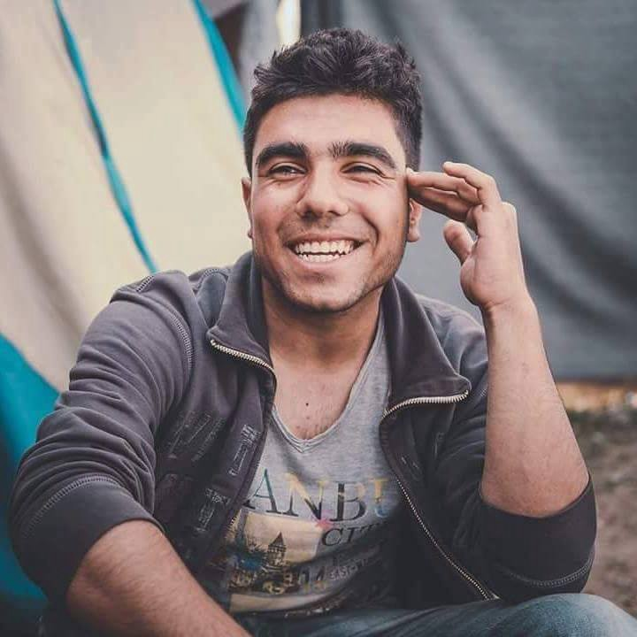
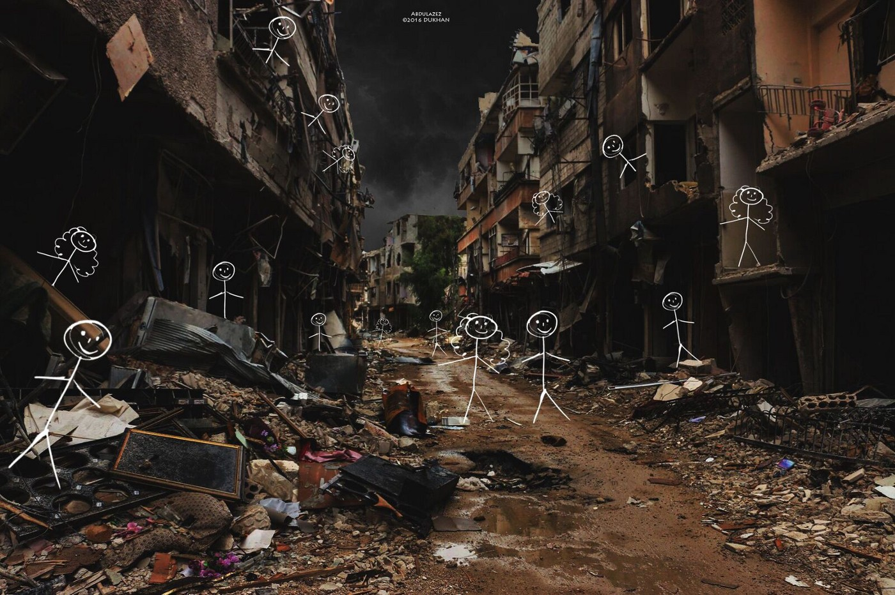
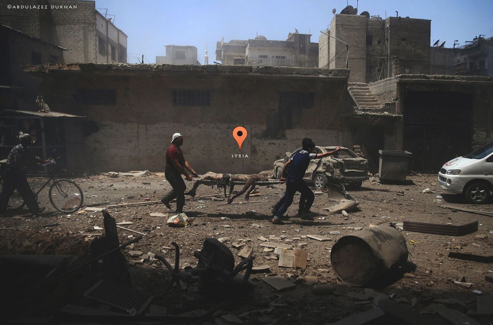
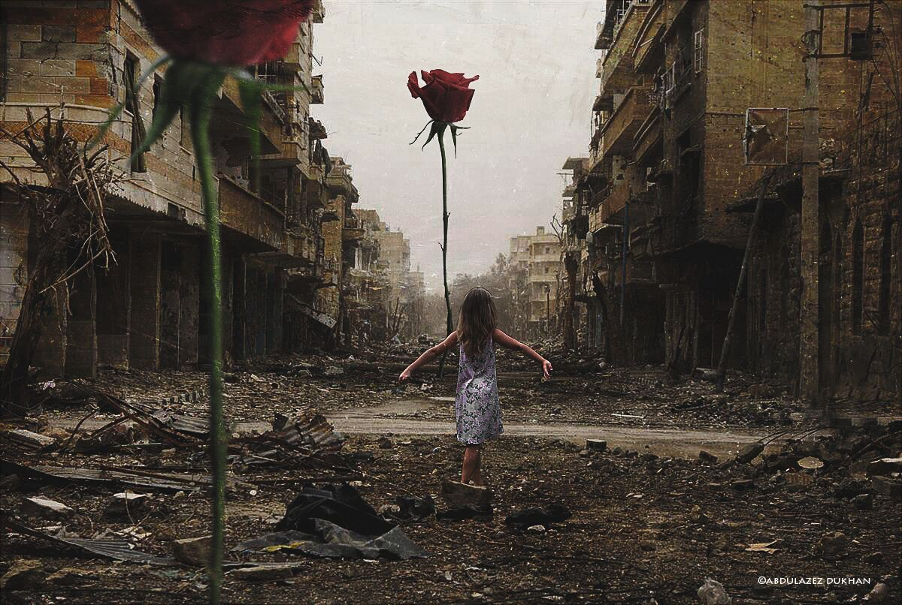
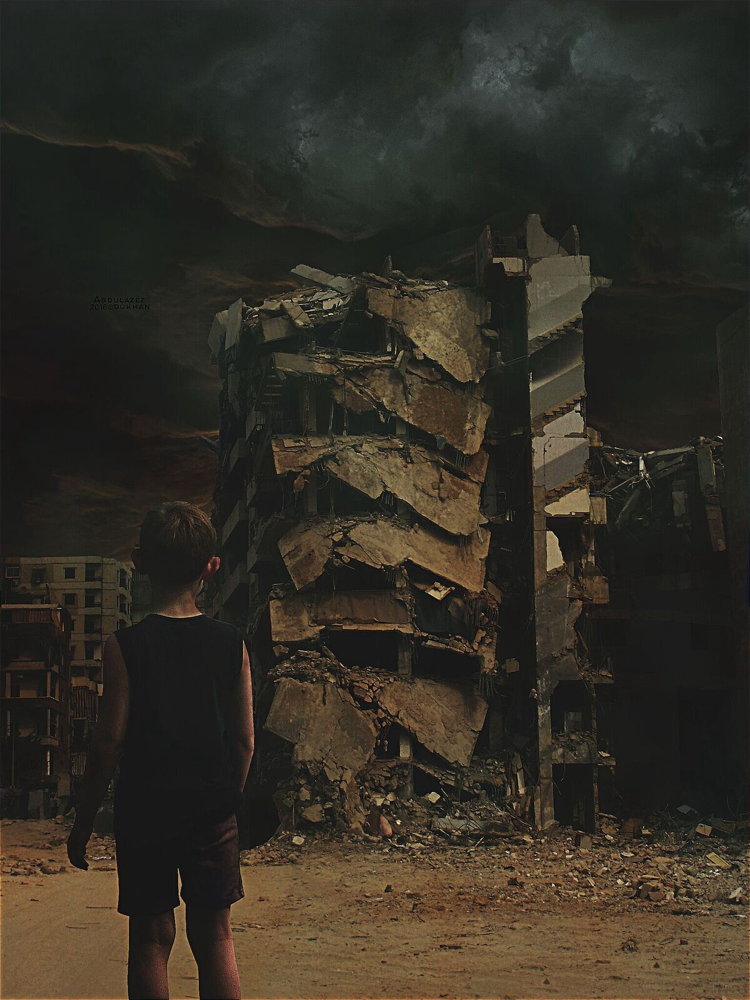
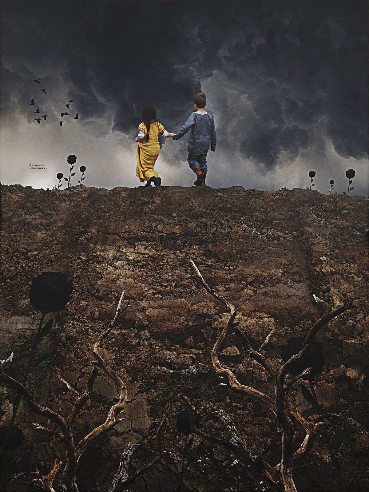

### AYS SPECIAL: My name is Refugee and I am an artist

_Abdulazez Dukhan is an 18 year\-old artist from Syria who came to Europe with his family hoping to find refuge from war\. Europe did not great him with open arms\. Abdulazez’s art tells us the story of his life and the lives of other people who fled the country to reach safety\. AYS is proud to have him as regular contributor\. This is the story of his life_

“My name is Refugee, 18 years old\. As I was growing up, I found myself in the middle of the war in Homs\. My city became a place where you couldn’t find breath\. I left my house together with my parents, brother \(Alaa\) and one sister \(Alaa\), and my sister\-in\-law \(Fatima\) \. \(My brother and sister have the same name in English but it’s different in Arabic\. \) \. We left after six months of the revolution leaving lot of friends behind\. Half of them are dead now, and the other half I don’t know anything about\.

_By Abdulazez Dukhan_

After we left home, I lived in the countryside for 3 years\. I went back to school\. I loved to do a lot of things but I wasn’t able to because of the situation\. My eyes were always looking outside, out of the box which we were in\. I wanted to find my life and to try to do something for my people\. I wasn’t able to while I was inside because every day I was afraid that maybe I’d die and no one would even remember who I was\!

I left the countryside, heading for Turkey with my family, in 2014\. I saw hope\. But I was surprised by many things we encountered, racism being maybe the worst of all\. However, I managed to go to school there too and that made me happy\. Soon I discovered the Internet, which I missed so much during the war in Syria, and I loved it\. I checked Youtube a lot and started learning Turkish online\. Then one of my best friends told me about something called Photoshop\. I didn’t like it at the beginning, but I tried to see what I could do with it\. Then I fell in love and started using it to create my art\.

I loved to make art about life, love, hope and smiles but my own feeling were different\. I was thinking about us back there in Syria and where we are today\. There are lot of people who would love to be here, but they don’t have the ability\. I started to talk and to represent us as a homeless people\. I found myself in that and started spending lot of time learning more about different ways to express myself\. I was learning not just about Photoshop, but about programs for 3D shapes, like Maxon Cinema 4D, programs to create games and programming language\. At the beginning, I was confused but I loved to dive into learning all this, kind of in a crazy way\. I love learning new things\. I also love books, and I was reading a lot of novels at the same time\.

By _Abdulazez Dukhan_

After one year in Turkey, my family decided to leave\. Because we could not make enough money to live, we could not stay any longer\. We were staying in an area just 5 km from Syria, and missiles were coming all the time from that side to the border village\. Turkish people were blaming us for that and they were treating us badly\. We sold everything, borrowed some money and headed toward Europe\. For life, for studying, running away from the war, from the racism\. Finally, we reached Idomeni\. After we arrived, I asked someone I met how long he had been there\. “One week,” he said\. I said “Oh\! how you can stay here for that long?” But we also stayed there for a very long time\. Some nights I could not sleep, thinking about where I was\.

To keep my head clear, I read books, kept my phone charged and tried to get online to download pdf\-files\. I was bored from everything\. We left Idomeni after period of three days of rain\. Our small tent could not withstand the water\. We had nothing\. I was standing, looking, breathing and asking why I came there\. Asking myself if it was better to die quickly than to die slowly\.

By _Abdulazez Dukhan_

We left Idomeni with broken hearts\. We were afraid when we left that the border would open and we would not be there, so we went to the Eko Station camp\. I found a new spot for myself, a small tent and some new people, new faces and new eyes\. There, when I didn’t feel like reading or writing, I started volunteering with different teams\. With time, I forgot about my art until one volunteer asked me what I was doing\. First, I just said that I was studying\. But after one minute of silence, I said that I was working on some art and asked her if she wanted to see\. She said yes and I showed her some of my old things\. She liked them, and I was surprised by that\. She liked them so much that she put me in touch with other volunteers and one of them got a laptop for me\. Then I started working again\.

I was really happy for that people did that for me\. I started working not only as a Syrian but as a refugee\. I started saying that I was an artist, with big confidence inside of me\. I started everything from the beginning\. Again, one awesome volunteer from Italy, sent me a small camera and it made me really happy\. I was taking pictures and showing them to some real photographers who came to the camp\. I showed them pictures about the reality, not pictures you get from the media\.

By _Abdulazez Dukhan_

I got my second camera from Spain, this one more professional\. After that I decided to create a platform for refugee voices which I called, “Through refugee eyes”\. Three months ago I got another camera, this time from Germany\. And in the meantime, many volunteers got me t lenses, stuff and bags for the camera and books from which allowed me to keep going\.

After a while, I left Eko camp, along with everyone else\. We did not choose to leave; we were evicted from there\. But I kept doing the same things wherever I went, and have continued until today\. I love taking pictures and I want to tell to the world the truth about our life\.

Today, I have been in Greece for over seven months already, and am still remembering when I believed it would be only seven days\. Every day is like a month\. But, as long as I am here, I will spread my messages towards Europe and the whole world saying that we are not terrorists, we didn’t come from nothing, we were forced to come\. No one chose to leave his home\. We love to live\. We didn’t come here to destroy anything\. We used to have everything you have\. We have mind, body and feelings like you\. I am a Muslim and proud of that\. If you think that because I am Muslim I’m a terrorist, let me tell you that you’re sick\! In Syria, people of different religions were living together before the war\. No one used to say anything about other people’s beliefs\. My message to Europe is “Open your mind”\. Try to learn the truth before judging anyone\.

By _Abdulazez Dukhan_

Today, I am here in Greece, in the middle of enormous human suffering\. But, I have my road toward the future, inshallah\. I want to be an artist, a photographer, and to study\. I always loved to show the world what I think and what is inside me\. And that is what I am doing with my art\. One day, I will again be a normal person\.

Our dreams are not so big: to breathe, to study, to live and to have friends\. Is that a lot?

I’m here today because of the war\. If tomorrow my country becomes safe, I will go back\.

My name is Abdulazez Dukhan, and I am a refugee\.

_Converted [Medium Post](https://medium.com/are-you-syrious/ays-special-my-name-is-refugee-and-i-am-artist-5ed2cbbcaf28) by [ZMediumToMarkdown](https://github.com/ZhgChgLi/ZMediumToMarkdown)._
