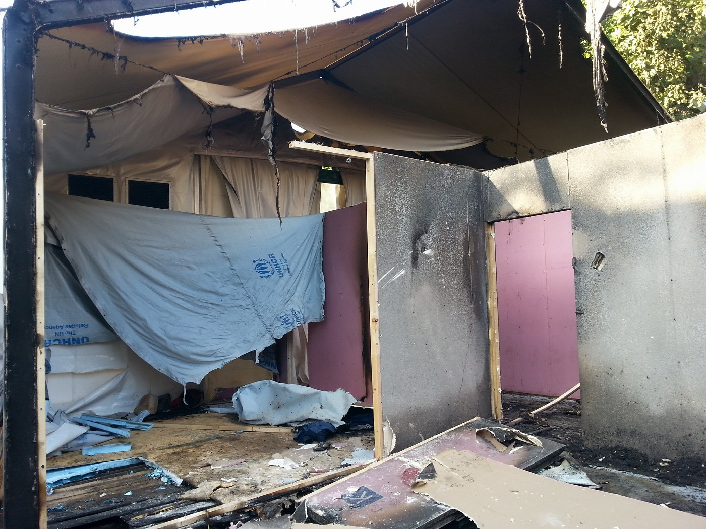
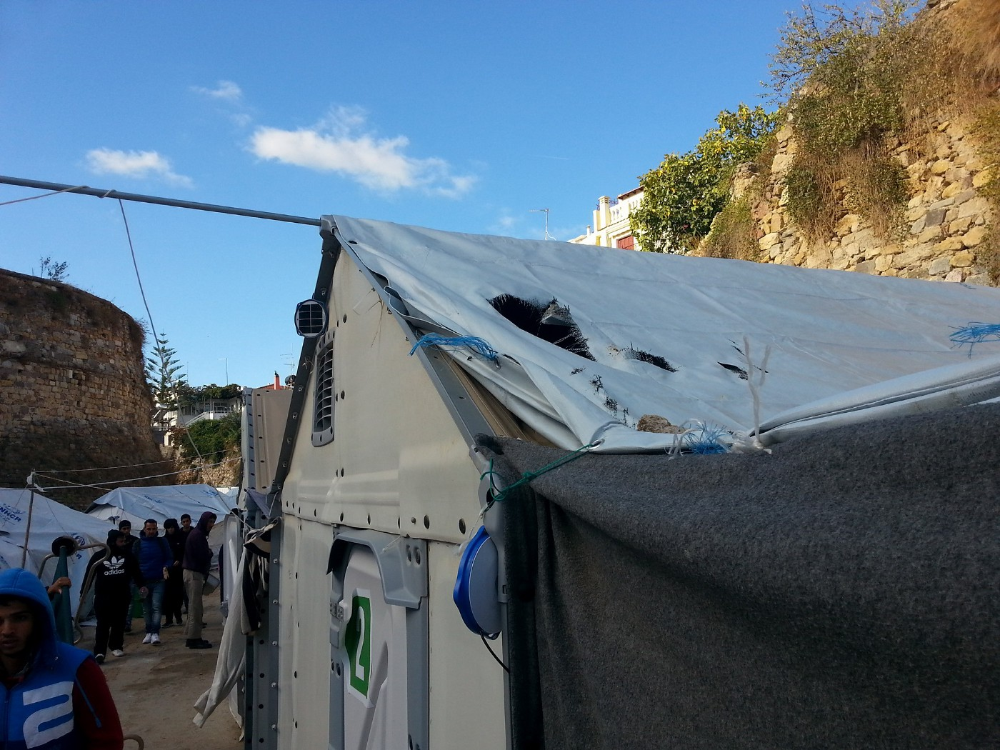
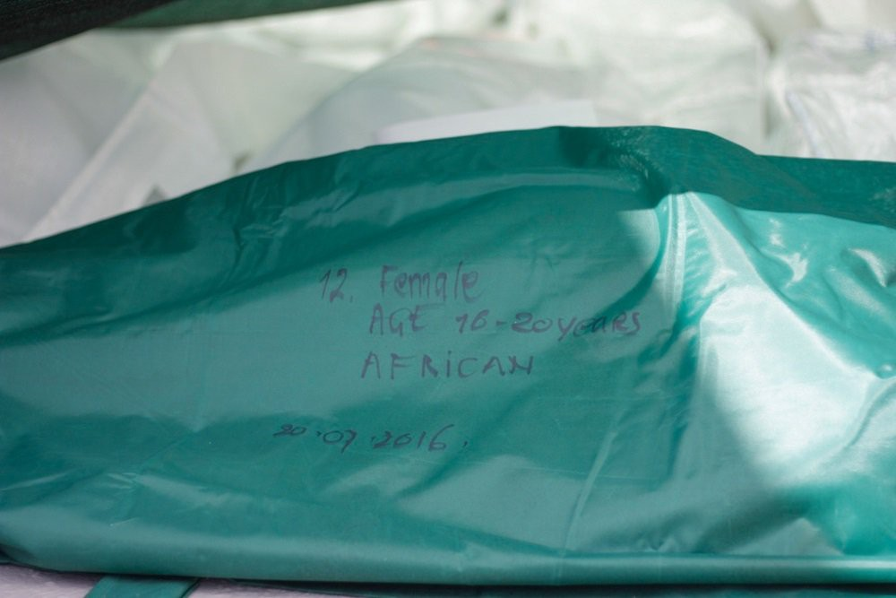

### AYS DAILY DIGEST 17/11: Second night of fascist attacks on Souda camp

_At least 2 injured in fascist attack on Souda camp // More than 40 persons killed in Aleppo // So far this year, 170,586 persons have arrived by sea to Greece and 164,694 to Italy // Only 27 persons were saved today from a boat carrying 130 // An estimated 151 persons camp in the open at the two border sites near the Hungarian transit zones // Europe to introduce a European Travel Information and Authorization System_

This is a refugee tent burned in fascist attack on Souda camp, Chios, Europe\. Photo by **Almwuostafaa Alkhtyipe\.**
### Terror in Souda camp

_“Terror night in the refugee camp in Chios\.”_ This is how volunteers from [Drop in the Ocean](https://www.facebook.com/drapenihavet/posts/1458407164176728?hc_location=ufi) described the second night of attacks on refugees in Souda camp, Chios\.

Groups of fascist started throwing molotov cocktails and rocks on tents early last evening, while the police — according to number of volunteers and refugees — stood aside\.

Ahamd, who lives in camp, posted this video of attack on his FB\.

Refugees told us that at least 2 persons were injured, while volunteers who tried to help were arrested\. During the day, as volunteers informed us, police was warning them not to enter the camp\.

At least two tents were on fire early this evening\. Golden Dawn fascists were throwing giant rocks down on the tents and containers from above, smashing through the thin ceilings and opening the containers to the cold, winter air\.

■■■■■■■■■■■■■■ 
> **[Huwaida Arraf](https://twitter.com/huwaidaarraf) @ Twitter Says:** 

> > More attacks on Souda camp tonight. Fire bombs thrown at refugee tents. Two burned. Greek police just standing around. #terror 

> **Tweeted at [2016-11-17 20:13:41](https://twitter.com/huwaidaarraf/status/799344778819276800).** 

■■■■■■■■■■■■■■ 

A couple of nights before the attacks, Ilias Kasidiaris from neo\-nazi party Golden Dawn announced their march and said: _“All illegal immigrant must return to their homelands\.”_ This obvious threat was not enough for local police to prevent the attack\.

During the day, volunteers and refugees were cleaning the rocks and burnt tents after the cruel attack from the night before\. Attackers used big rocks and threw fire bombs on tents\. \(for more read our [Digest from November 16](https://medium.com/@AreYouSyrious/ays-digest-16-11-support-needed-in-refugee-camps-as-temperatures-drop-d3299efbd2a0#.eq2u9sbik) \)

](assets/9a50d5721bce/1*JRA1pWX7GE4OknxnJoazQg.jpeg)

Photo by [**Almwuostafaa Alkhtyipe**](https://www.facebook.com/profile.php?id=100010483995512)

We join voices who are calling on all to speak out loud against fascism, and to call for openness and equality\. We call for solidarity with people at Chios\.
### Numbers and rules of Europe

According to the latest data from the UNHCR, so far in November, 792 people have arrived by sea to Greece\. This number adds to 170,586 who arrived since the beginning of this year\. Most of them are from Syria \(47 percent\), Afghanistan \(25 percent\), and Iraq \(15 percent\) \.

In the same period of time, 164,694 persons arrived by the sea to Italy\. It is 7 percent more than the same time last year\. The biggest number of people who arrived are from Nigeria \(21 percent\), Eritrea \(12 percent\), and from Guinea \(7 percent\) \.

While a number of people who are arriving increases, a number of relocations is still very slow\. Last week, 21 persons were relocated to Switzerland from Italy making the overall number of people transferred from this country rose to 1,570, which is the only percent of the 39,600 target\.

From Greece, 311 persons were relocated last week, and they went to Bulgaria, Estonia, France, Latvia, Netherlands, Portugal, Romania, Slovakia and Slovenia\. With this latest number, it makes a total of 5,654 \(only 8\.5 percent\) relocation completed so far out of the targeted 66,400\.

The EU is usually much faster when it comes to making the decisions to tighten border controls\. The new measure could be introduced by the end of the month — a European Travel Information and Authorization System\.

Jean\-Claude Juncker, president of the European Commission, announced this idea of a proposal for an automated system to determine who will be allowed to travel to Europe, saying _“we need to know who is crossing our borders\. This way we will know who is traveling to Europe before they even get here\.”_

The Commission is proposing the establishment of the European Travel Information and Authorization System \(ETIAS\) to strengthen security checks on visa\-free travelers\. _“This will contribute to a more efficient management of the EU’s external borders and improve internal security, whilst at the same time facilitating legal travel across Schengen borders,”_ press statement from the EC states\.

As hey explain, the ETIAS authorization is not a visa but _“a lighter and more visitor\-friendly regime”_ \. Basically, nationals of visa liberalization countries will still be able to travel without a visa but will have to obtain a simple travel authorization prior to their travel to the Schengen Area\. The authorization will be obtained online, will be valid for a period of five years and for multiple travels, and an application fee of €5 will apply to all applicants above the age of 18\.

The ETIAS will be managed by the European Border and Coast Guard in close cooperation with the competent authorities of the Member States and Europol\.
### Syria
#### Hospitals under attack

While Europe is tightening its borders, in Syria \- where most of the refugees are coming from \- war is raging\. Today, the World Health Organization condemned a wave of attacks on hospitals in Syria over the last couple of days\. The WHO mentioned heavy attacks on five hospitals in Aleppo and Idlib since Sunday\.

Only this year there were 126 attacks on health facilities and health workers recorded by the World Health Organisation and its partners\.

In the past five days, there have been 13 attacks on medical facilities across northern Syria — that’s one attack every 9 hours
### Mediterranean
### 340 people drowned during the last week

Photo MSF Sea

Only 27 men were saved today in the sea after a boat carrying 130 was found\. The smugglers allegedly towed them for 2hrs before forcing them \(at gunpoint\) to return the life jackets they already sold them, and taking the engine\. According to the MSF team, the boat left Libya at 2am on the 14th\. It means that people were drifting on a boat without an engine for over 2\.5 days\.

Last nigh, another rescue boat saved over 200 people\.

Since last Sunday, 340 people drowned in the Sea, according to UNHCR and MSF\. The number adds to more than 4,500 of who have died or disappeared so far this year while attempting to cross the sea\.
### Greece
#### The Voices of Oreikastro

We continue supporting [The Voices of Oreikastro](https://www.facebook.com/The-Voices-of-Oraiokastro-1627523520892089/) , the residents that run their camp\. This is their latest report and call for volunteers:

> “So this is happening tonight in Oraiokastro Camp\. There is still no heat in the warehouse, despite a sudden 15degree temperature drop\. All the agencies know that Greek winters are harsh but all are acting surprised\. To add to this joy, there is a power problem in the camp; tonight 3/4 of the warehouse has no light or power\. It was the same last night\. 

> Those with electricity, sit in their coats around an electric ring to stay warm\. In tents\. Can you imagine this? Those that don’t, are already under the blankets, fully dressed, by 6pm trying to stay warm\. 

> This is 2016 in Europe\. If you are volunteering in the Thessaloniki area; please consider volunteering directly with The Voices of Oraiokastro\. The residents there run their own camp and are feeling so fed up and forgotten\.” 

To learn more about this camp and this group, go to their blog site\.

#### Vaccination for kids

In Athens, MSF Sea is vaccinating kids from 8 weeks to 17 years\. Child refugees must have access to routine vaccinations\. Their health depends on it\. Fid MSF teams and ask for vaccination\.
### Hungary
#### Children left out in the cold to wait for Europe to wake up

Approximately, 150 people sleep in the open at the two border sites near the Hungarian transit zones\. Sometimes, more than 30 percent are children\.

Hungary continues to admit 10 people per day per\. The waiting period for families ranged between 60–120 days and for single men the average is around 120 days\.
### Spain
#### Family found in sealed container

Ten Kurds from Iran, including four children, were discovered hidden amongst clothes inside a sealed container belonging to a Spanish fashion chain\. People were discovered when the container was opened at a depot 30km from Barcelona, [local media reports](http://www.thelocal.es/20161117/refugee-stowaways-end-up-in-spain-trying-to-reach-uk) \.
### Germany
#### Refugees more democratic than Germans

Germany continues to implement the decision on deportation of people from Afghanistan\. Some 12,500 Afghans whose asylum applications have been rejected will be deported from Germany, a report in the “Neue Osnabrücker Zeitung” claims\. According to document they cite, the Interior Ministry estimates that 5 percent of the almost 247,000 Afghans who had reached Germany by the end of September will probably have to leave\.

The government considers Afghanistan as a safe country after the EU signed an agreement with Afghanistan to make the deportation of rejected asylum\-seekers easier\.

At the same time, the first survey to delve into the views and life experiences of refugees in Germany was made public discovering that refugees are more democratic than Germans\. The survey shows that slightly more refugees believed democracy was the best form of government, whereas slightly more Germans said they wanted a “strong leader” who didn’t worry about parliament or elections\. Refugees believe more than Germans in social justice, too\. More refugees thought that governments should support the poor and tax the rich, and more also believed that citizens’ rights should protect them from government oppression\.

Additionally, there was a slight difference overall when it came to respondents who believed parents should prioritize their sons’ educations over their daughters’, but this difference nearly disappeared when looking only at male respondents: 19 percent of refugee men and 18 percent of German men thought parents should care more about their son’s development\.
### Norway
#### Stop deporting people to Somali\!

As well as Germany, Norway is deporting people to not safe countries\. In October, the Norwegian government concluded that Somalia is safe enough to revoke refugee status from 1,600 people\. Unaccompanied minor and families with small children were among the first 120 Somalians to have receive notification of their repatriation\.

The UNHCR said there is continued violence and conflict in the Somali capital, and urged Norway to change its mind\.
### General
#### A reasonable basis for war crimes investigation in Afghanistan

The Prosecutor of the International Criminal Court announced the possibility that a full investigation into potential war crimes committed in Afghanistan could take place\. Fatou Bensouda said that she had _“a reasonable basis”_ to believe that war crimes, including torture, had been committed\. According to her proposal, crimes committed by the Taliban and their affiliated Haqqani Network could be investigated, as well as crimes committed by the Afghan government forces, in particular, the intelligence agency \(National Directorate for Security\), and the Afghan National Police; and war crimes of torture and related ill\-treatment by US military forces deployed to Afghanistan and in secret detention facilities operated by the Central Intelligence Agency\.

The possible charges relate to the period between 2003 and 2004, although allegedly continuing in some cases until 2014\.

_Converted [Medium Post](https://areyousyrious.medium.com/ays-daily-digest-17-11-second-night-of-fascist-attacks-on-souda-camp-9a50d5721bce) by [ZMediumToMarkdown](https://github.com/ZhgChgLi/ZMediumToMarkdown)._
