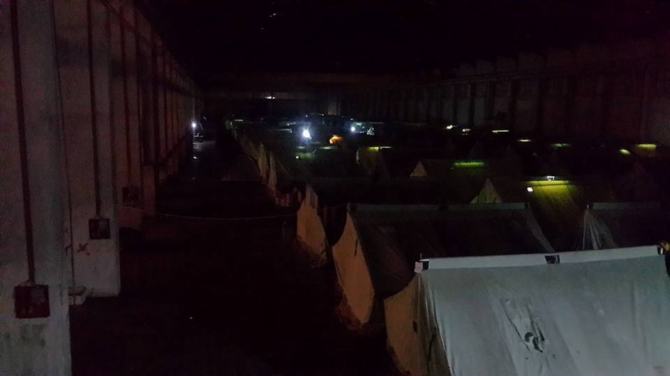
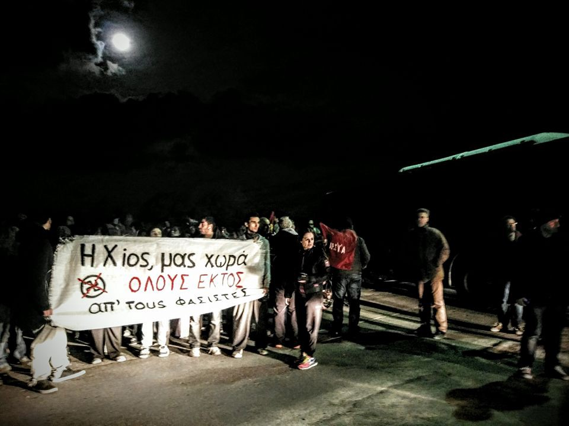
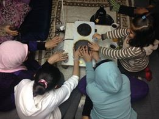
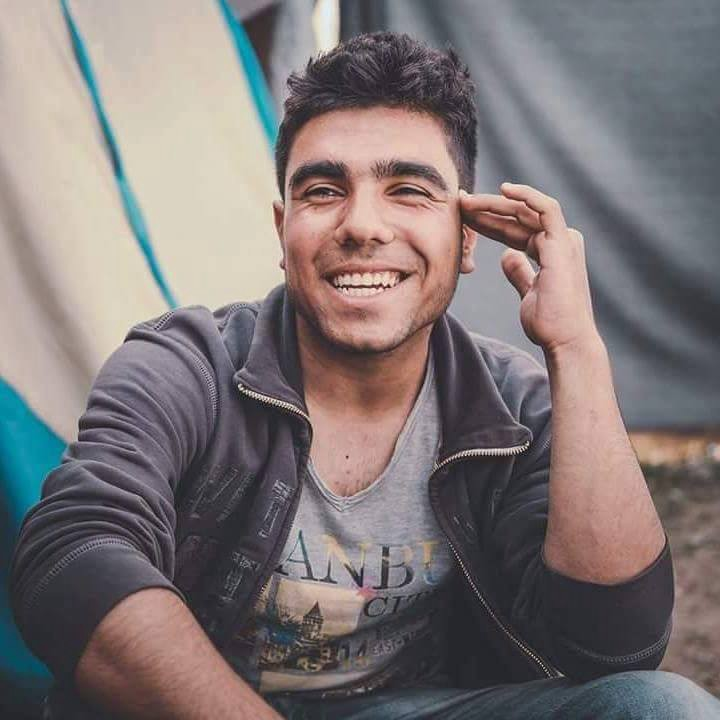
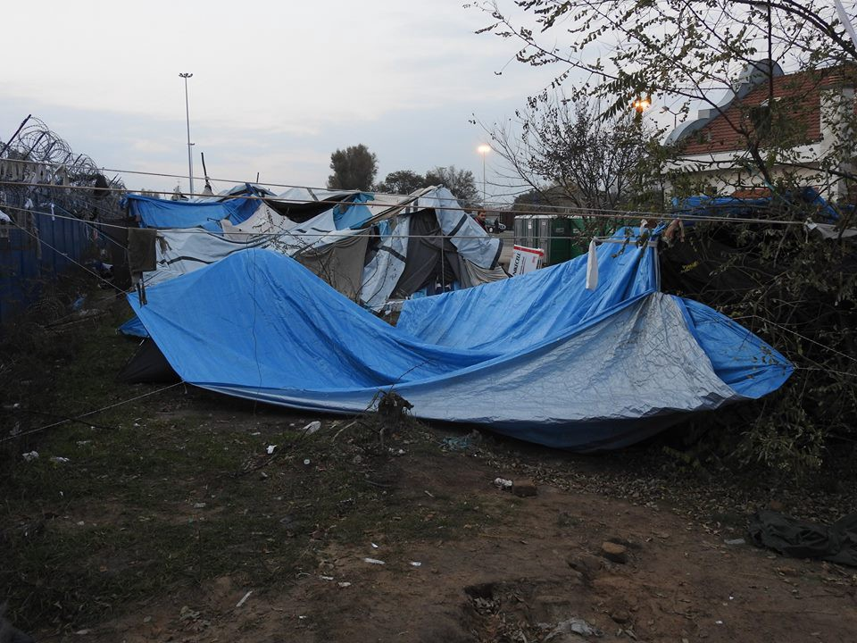
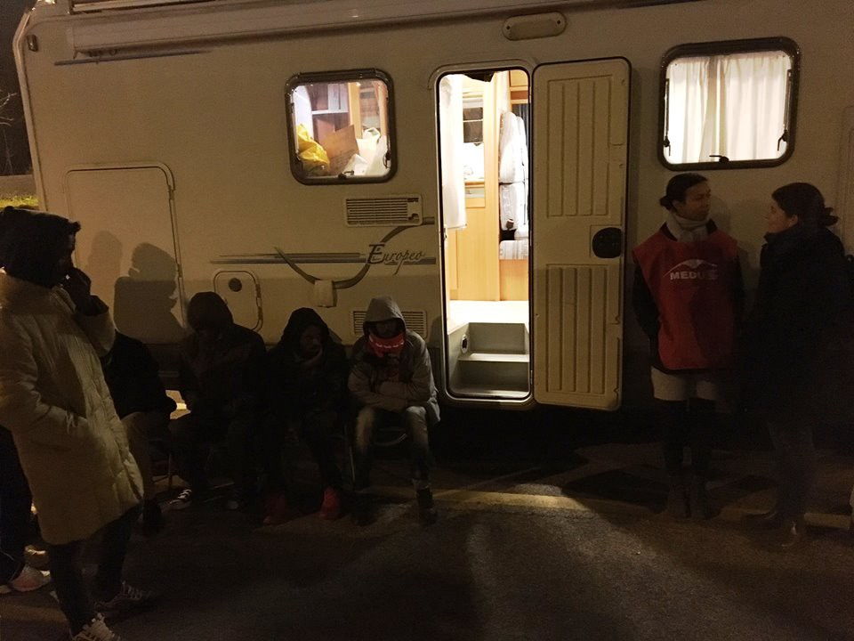

### AYS Digest 16/11: Support needed in refugee camps as temperatures drop

_Frontex reports drop in border\-crossing but IOM says more than 4,000 died in the Mediterranean this year\. Fascists attack the Souda camp in Chios\. Oreokastro camp struggles with the cold\. Update on situation in Bosnia\. Home Office guidelines restricts which children will be able to come to the UK\._
#### EU
### Frontex reports drop in border\-crossings

The Frontex Quarterly Report says the detection of “illegal border\-crossing” at the EU’s external borders dropped by more than half in the second quarter compared with the same period of 2015, with the majority of migrants detected on the Central Mediterranean route — on this route, three out of every four migrants departed from Libya, while the share of migrants who set out from Egypt increased to 14%\.

The Eastern Mediterranean sea route from Turkey to Greece was the second most common entry point to Europe in the second quarter, with some 7 000 arrivals on the Aegean Islands\. This represented a 95% drop in comparison with the first three months of this year\.

The number of irregular border\-crossings on the Western Balkan route, decreased by 90% between the first and second quarter of 2016 and amounted to 11 000\. Afghans accounted for the largest share of the detection\.
### At least 240 died in the Mediterranean this week

[Reuters](http://uk.reuters.com/article/uk-europe-migrants-italy-arrivals-idUKKBN13B12Z) reports at least 240 refugees died in the Mediterranean this week while another 580 people were pulled from overcrowded boats\. The death toll has now surpassed 4,000 according to the IOM\.
#### Afghanistan
### NGOs concerned about return of refugees to Afghanistan

[News that Moves](https://newsthatmoves.org/en/ngos-concerned-about-eu-afghanistan-deal/) says NGOs have written an open letter to the European Parliament, expressing their concerns over a plan to “return, on the basis of a back\-door agreement, thousands of women, men and children to Afghanistan\.” The NGOs note that the EU is wrongly presenting Afghanistan as a ‘safe country’ for return\.

This comes as [Euronews](http://www.euronews.com/2016/11/15/us-faces-investigation-into-war-crimes-in-afghanistan?utm_source=dlvr.it&utm_medium=gplus) reports the Prosecutor of the International Criminal Court has said a full investigation into potential war crimes committed in Afghanistan is likely\. The court believes war crimes have been committed by the Taliban, Afghan government forces and US military forces\. Charges relate to the period between 2003 and 2004, although allegedly continuing in some cases until 2014\.
#### Greece
### Refugee camp in Chios attacked

Volunteers report 60 fascists descended onto the Souda camp from both sides, attacking refugees with fireworks and rocks\.

Many volunteers and refugees were arrested inside the camp, with refugees reporting incidents of police brutality\. 4 to 5 people were forced to go to the hospital, a,d one man got his scull fractured by a thrown rock\. One of the camp’s rub halls burned down completely\.

One volunteer says:

> The population of Souda that we had no way of reaching inside, as we watched helplessly from the outside — the blind, the injured, men, women, children will huddle tonight in cold and fear after witnessing explosions and fire to one of the rub halls, as the rest of Europe sleeps warm in their beds\. 

Yesterday night, a senior member of the neo\-Nazi Golden Dawn party held a speech on the refugee crisis on Chios and an anti\-fascist demonstration took place against the presence of Golden Dawn on the island\.

Photo by Gabrielle Tan
### 14 refugees registered today

3 people were registered in Lesvos and 11 on Samos\. The total number of guests on Greek islands dropped from 16,194 to 15,990, indicating that some 200 people must have been transferred to the mainland from Lesvos and Chios\.
### Cold and lack of electricity causes problems in Oreokastro

_The Voices of Oreokastro_ reports on the situation inside the camp, saying

> Tonight we have a problem again with the electricity\. This mean no lighting for 3/4 of the camp\. It’s very dark inside the warehouse and difficult to see where the tent ropes are\. Most of us have no lighting in our tents\. Those that do have electricity heat themselves by electric ring\. 

> We need heat\. Desperately\. Most of the camp is sick with the cold and Army and NRC do nothing to fix the boiler or bring air cannon heating\. Is this another thing we must fix ourselves? 

In comments made to [_Time_](http://time.com/4569787/greece-refugees-migrants-syria-winter/) , Mohammad al Ali, a former pharmacist from Deir ez\-Zor , says “we have enough blankets, but blankets are not enough,” as warm clothes don’t help much when you’re forced to bathe in cold\-water\-only outdoor showers\. “We started hearing about water heaters in August, but they still haven’t done anything yet and it’s November\.” says al Ali\. “We need a better solution\. We can’t live in tents forever\.”

Photo by Caroline Dykes

An independent volunteer adds that those with electricity, sit in their coats around an electric ring to stay warm, while those that don’t, are already under the blankets, fully dressed, by 6pm \.The volunteer suggests supporting the Voices of Oreokastro directly, instead of going through NGOs, as the camp has developed a self\-organised structure, in order to distribute aid according to their own needs\.
### New distribution systems develop

Providing winter clothes is becoming urgent and distributing them in a dignified manner is essential\. The [“mobile truck shop” project](http://davidlohmueller.com/en/mobile-truck-shop/) aims to distribute clothes according to a registration system and “offers refugees the opportunity to choose clothing to suit their size and individual style”, making distribution much more dignified\. The project is currently in the process of expanding the size of the ‘truck shop”\.

](assets/d3299efbd2a0/0*apQbxKkBq1rEzXg1.jpg)

Photo by [David Lohmueller](http://davidlohmueller.com/en/mobile-truck-shop/)

](assets/d3299efbd2a0/0*PW-iZzFFij3vtcIz.jpg)

Photo by [David Lohmueller](http://davidlohmueller.com/en/mobile-truck-shop/)

](assets/d3299efbd2a0/0*MPmjDEDsTjb_eSMs.jpg)

Photo by [David Lohmueller](http://davidlohmueller.com/en/mobile-truck-shop/)

The Timber Project has completed a new distribution market place in Nea Kavala\. Using a system devised by Drop in the Ocean, “residents will use tokens to purchase the items they need rather than having to rely on prescribed hand\-outs”\.

### Asylum Q&A available in new languages

The Greek Asylum Office has just published a translation of the Q&A on full registration, transportation and general procedures in Farsi, Kurmanji, Sorani and Urdu\. It is available [here](http://asylo.gov.gr/en/?page_id=1499) \.
### My name is refugee and I am artist

[We are very proud to bring you the story of Abdulazez Dukhan, our friend and great young artist\.](https://medium.com/@AreYouSyrious/ays-special-my-name-is-refugee-and-i-am-artist-5ed2cbbcaf28#.xfrje5ih1) The story we can all learn a lot from:

“No one chose to leave his home\. We love to live\. We didn’t come here to destroy anything\. We used to have everything you have\. We have mind, body and feelings like you\. I am a Muslim and proud of that\. If you think that because I am Muslim I’m a terrorist, let me tell you that you’re sick\! In Syria, people of different religions were living together before the war\. No one used to say anything about other people’s beliefs\. My message to Europe is “Open your mind”\. Try to learn the truth before judging anyone\.”

#### Serbia
### Sirious Help needed at the Serbian\-Hungarian border

Sirious Help describes the situation at the Serbian\-Hungarian border, saying refugees often come unprepared from official refugee camps and are shocked by living conditions at the border\. People live in makeshift tents, the temperature at 8am was \-4 °C yesterday and there is no electricity, hot water or heating\. [They could use some support and donations](http://www.sirius.help/donate-now/) \.

Photo by Sirious Help
### Kelebija community kitchen up and running

North Star says “ _thanks to the efforts of volunteers, we are happy to say that the community kitchen \(run by our friends residing in the transit zone\) is serving tasty hot food every day\. People bring old favorite recipes from home, the materials are provided, and then folks get cooking\. A few nights ago, 74 meals were served\! \! \! Thank YOU all for making this possible\!”\._

](assets/d3299efbd2a0/0*cGeyh3Ujn-MBgKPd.jpg)

Photo by [North Star](https://www.facebook.com/NorthStarSerbia/photos/pcb.1779566872314563/1779566142314636/?type=3)
#### Bosnia
### Situation in Bosnia

Bosnia remains one of the countries in the region that was not part of the so called Balkan route, but this changed with the tightening of the EU borders\. However, even the limited number of people who entered the country are not receiving protection they are entitled to\.

All the refugees who are found by the police are forcibly taken into the Centre for immigration where they are investigated, and while they stay inside, closely watched by the police\. The center is of semi\-open type\. People can come to visit anybody, but during the visit police is present in the room\. The media are not allowed to film inside at all\. The doors are locked from 10pm to 7am\.

Currently, there are 29 people inside, some from Syria, Afghanistan, Pakistan, Turkey\.

In order to be transferred to a centre with more freedom, refugees have to apply for asylum\. In 2014, 45 people applied, 46 in 2015, but this year authorities are estimating the number could go up to 100\. However, officials are saying that most of the people who apply for the asylum, leave the country to continue their journey before the end of the procedure\.

Human rights activists are claiming that refugees are not offered all the protection they are entitled to\. Very often they do not even know their rights, mostly because they are not offered appropriate translation services\.

Nevertheless, most of the people who are arrested are immediately sent back to Serbia\. Human rights groups are claiming that this is being done since the country does not have possibility to offer any help to refugees\. Bosnia is the poorest country in Europe and one of the 20 poorest countries in the world\. State Office for Foreigners claims that they do not have enough capacities to deal with this issue\.

Officially, 160 refugees are registered in Bosnia\.
#### Italy
### Refugees evicted in Rome

Baobab Experience says that refugees were yet again evicted, this time from Piazzale Spadolini\. They were also threatened by police, with officers saying _“Don’t dare building another camp in the area because we’re going to throw everything away and you’re going get into trouble”, “we have the order from the police headquarters to evacuate you, from now on, in every place you’re going to be”, “we’re not going to let you fuck around with us”\._

Tonight, Medu and Baobab gave medical assistance and hot food to those sleeping in the streets\. After this morning’s evacuation, many were left without sleeping bags or warm clothes\.

Photo by Medu
#### France
### France to deport people to Sudan

Refugee Info Bus reports deportations from France to Sudan are scheduled to take place this week, with one deportation already planned for tomorrow evening, from Paris to Doha, likely on a flight by Qatar Airlines\.

Info Bus says

> President, Omar al\-Bashir, has several arrest warrants by the International Criminal Court out against him for war crimes, genocide and crimes against humanity, yet states including France still continue to threaten and sometimes achieve forced returns of people despite well documented evidence of a real risk of immediate imprisonment, persecution, torture or death\. 

Info Bus adds that these deportations are still exceptional in France but further deportations could set a dangerous precedent\. Recently deportations to Sudan have been ramped up throughout the EU, especially from Italy, where a new agreement between Italy and Sudan was signed in August\.

Info Bus asks people to contact the Pas\-de\-Calais Prefecture to demand that they cancel their decision to deport:

By telephone : \( \+33\) \(0\) 3\.21\.21\.20\.00 or via the prefecture contact form : [http://www\.pas\-de\-calais\.gouv\.fr/Contactez\-nous](http://www.pas-de-calais.gouv.fr/Contactez-nous)

Or contact Qatar Airways, to demand they refuse to operate the flight:

[http://www\.qatarairways\.com/fr/fr/contact\-us\.page](http://www.qatarairways.com/fr/fr/contact-us.page)
#### UK
### Home Office guidelines restricts which children will be able to come to the UK

New Home Office guidelines say children will be accepted under the Dubs amendment if they are 12 years or under, if they are deemed at high risk of sexual exploitation, and if they are “aged 15 or under and are of Sudanese or Syrian nationality”\.

In a joint release, Citizens UK, Calais Action, Refugee Action and Help Refugees accuse the Home Office of breaking its promises to vulnerable children, saying the guidance means “children as young as 13 and 14 from countries other than Syria and Sudan who lack family in the UK will be barred from being transferred to Britain” noting that “under international law, a child is defined as being younger than 18\.”

The organisations accuse the Home Office’s new guidance of being arbitrary, cruel and potentially illegal, and of creating an incentive for child refugees to run away from official centres in France and try to enter Britain illegally\.

_Converted [Medium Post](https://areyousyrious.medium.com/ays-digest-16-11-support-needed-in-refugee-camps-as-temperatures-drop-d3299efbd2a0) by [ZMediumToMarkdown](https://github.com/ZhgChgLi/ZMediumToMarkdown)._
