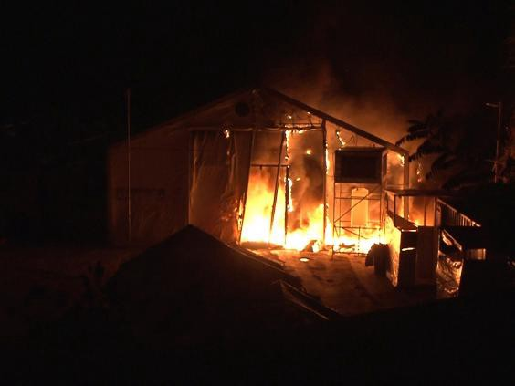
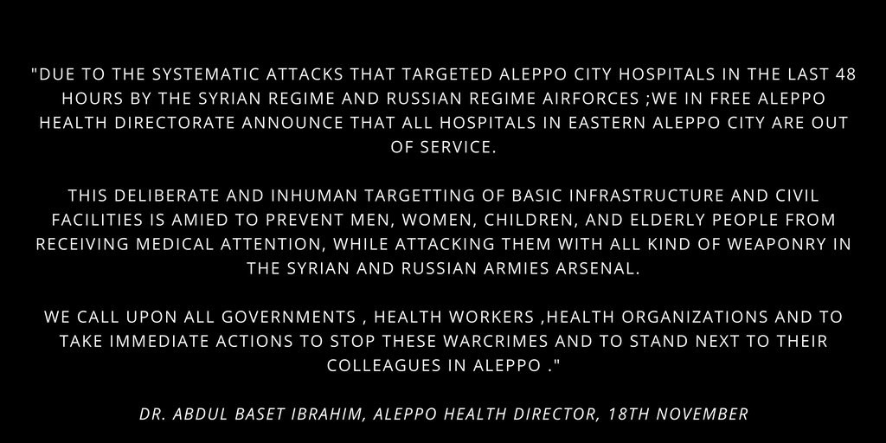

### AYS Daily News Digest 18/11: The world ignores one of Aleppo’s worst days; desperation in Greek camps
#### One of the most agonizing days for Aleppo: hospitals in East Aleppo close after the recent airstrikes; the city about to run out of food supplies soon / The aftermath of the fascist attacks on Chios; Already appalling conditions in camps across Greece worsening with winter / Smugglers cause more deaths in the Mediterranean

### Syria
#### ALEPPO

The Civil defense branch of the ancient city of Aleppo has reportedly been bombed with four barrel bombs, two missiles and twenty artillery shells today during ongoing air raids and shelling carried out by the regime forces and Russian Air Force, witnesses and activists report\.

](assets/e180c1193dde/1*w8_2mudwJx1tMPqgYc1jWg.jpeg)

Photo: [@SyriaCivilDef](https://twitter.com/SyriaCivilDef)

According to [Al Jazeera](http://www.aljazeera.com/news/2016/11/battle-aleppo-syria-army-intensifies-air-campaign-161118090027663.html) , on Sunday, the Syrian army sent a text message to residents of east Aleppo, demanding they leave areas held by opposition armed groups within 24 hours or risk their lives during a major offensive\. Civilians are now unable to leave their homes, after barrel bombs with chlorine gas containers were used in the attacks, sources report\. The [Guardian](https://www.theguardian.com/world/2016/nov/18/aleppos-childrens-hospital-bombed-as-it-treats-chlorine-gas-victims) reports that the only children’s hospital in besieged Aleppo is out of action after being bombed as it treated victims of a chlorine gas attack, forcing staff to evacuate babies in incubators and other patients injured over days of fierce bombardment\.

Health directorate in Aleppo announced that all hospitals in east Aleppo are out of service, as a result of shelling and airstrikes\.

According to [Reuters](http://uk.reuters.com/article/uk-mideast-crisis-syria-aleppo-idUKKBN13D1YW) , heavy bombardment also took place in the rebel\-held area of Eastern Ghouta near Damascus\. A witness said the ongoing shelling and air strikes since Thursday evening were the worst seen for at least a year\.

> **Civilians in besieged Aleppo face the winter with no food or medical supplies as attacks by Syrian and allied forces increase, UN humanitarian adviser Jan Egeland [warned](https://www.alaraby.co.uk/english/news/2016/11/18/aleppo-residents-face-very-bleak-winter-with-no-aid?utm_source=twitter&utm_medium=sf) on Friday\.** 

Hundreds of people have been killed in the east Aleppo assault since September, according to U\.N\. figures and rescue workers\.

■■■■■■■■■■■■■■ 
> **[Bana Alabed](https://twitter.com/AlabedBana) @ Twitter Says:** 

> > Notice!  Notice!. - Bana #Aleppo #StandWithAleppo https://t.co/DyksAPaqAj 

> **Tweeted at [2016-11-17 17:54:33](https://twitter.com/alabedbana/status/799309768770932736).** 

■■■■■■■■■■■■■■ 

### Turkey
#### 6 people die as refugee boat capsizes in Aegean sea

Turkish Coast Guard rescued four people off the Aydin coast\. Six people have died after a boat carrying refugees sank in the Aegean Sea off Turkey’s western province of Aydin on Friday\. The refugee boat was en route to Greece when it sank off the coast of Didim district, according to local sources\. The Turkish Coast Guard has rescued four refugees so far\. The [sources](http://aa.com.tr) added there was no information about how many people were on the boat\.
### Greece
#### **The Chios attack aftermath**

[Members and supporters of the Golden Dawn have attacked Souda camp](https://medium.com/@AreYouSyrious/ays-daily-digest-17-11-second-night-of-fascist-attacks-on-souda-camp-9a50d5721bce#.ackdv3ptv) on Chios, after refugees repeatedly voiced concerns to authorities about the lack of security there\. The attacks have left residents and volunteers afraid, beaten and more than 50 people detained by the police\. A Syrian refugee was seriously hurt and others left without shelter as assailants wielding rocks and firebombs targeted refugees’ provisional homes, destroying many dwellings\.

 \)](assets/e180c1193dde/1*k-mNYyBHo19MI-jEkmr5PQ.jpeg)

Molotov cocktails were also thrown from these positions above the Souda camp to the tents of the residents sleeping in tents \(Photo on the right by: [Humansnation](https://www.facebook.com/humansnation/) \)
#### European phenomena: Governments telling people how \(not\) to love their fellow human beings

According to many sources from the ground, in the midst of the violence at Chios camp, the police seem to have become violent with refugees, rather than stopping the perpetrators of the Golden Dawn attack\. The security of the men, women and children living in this island camp has further been threatened by the worsening weather conditions, as heavy rains and high winds have destroyed many canvas tents\. After [reportedly](http://www.huffingtonpost.ca/genevieve-zingg/refugee-camp-golden-dawn_b_13053790.html?ncid=engmodushpmg00000003) not protecting the refugees from attacks by hostile locals, the Greece police have also officially “advised” volunteers to stay away, forbidding them to help people in need\. Officials have [told AFP](http://www.worldbulletin.net/haberler/180401/syrian-hurt-in-attack-at-greek-island-refugee-camp?utm_source=dlvr.it&utm_medium=twitter) they cannot exclude that far\-right groups are seeking to exploit local anger\.

Today, this is what the refuge provided to people who fled violence in their own countries looks like in Camp Souda, Chios\. \(Photo: Theurgia\_Goetia — Twitter\)

> _“There have been grave injuries and there are people missing\. And it will go on: the mobilization of the people, who cowardly prey on the lives of their fellow human beings fleeing war and violence, continues\. And we cannot do anything to help the victims who we know and whose children we care for every day\. Any help is being prohibited by threat and execution of violence and arrest\. Scared families are sleeping at low temperatures on the street and are being cut off from help by the police in order to convince them to move back into the still smouldering camp with their children\.” — from a [statement](https://www.facebook.com/groups/1159112204116287/permalink/1486840514676786/) issued on Friday by the [Be Aware And Share](https://www.facebook.com/groups/1159112204116287/) team_ 

Fearing a third attack on Friday night, about 100 former occupants refused to re\-enter the camp, instead taking shelter in a nearby car park, including families with small children\. According to [The Guardian](https://www.theguardian.com/world/2016/nov/18/far-right-group-attacks-refugee-camp-greek-island-chios) , in the wake of this week’s events, the government announced it would send its migration minister, Yiannis Mouzalas, to Chios over the weekend\.

103 people have been registered on Lesvos, according to the Greek government’s summary [statement](http://media.gov.gr/index.php/component/content/article/258-%CF%80%CF%81%CE%BF%CF%83%CF%86%CF%85%CE%B3%CE%B9%CE%BA%CF%8C-%CE%B6%CE%AE%CF%84%CE%B7%CE%BC%CE%B1/4521-summary-statement-of-refugee-flows-18-11-2016?Itemid=595) of refugee flows from Friday\. It now counts a total of 5,072 residents in the state\-run or UNHCR hosting facilities on the islands\. The Eastern Aegean islands are for the time being a provisional home to 11,108 refugees\.
### Cherso: Burning school benches as firewood to keep warm

Residents of the Mazarakis camp in Cherso, northern Greece, are reporting worsening of their already poor living situation\. This camp currently hosts 1077 people who have been waiting for more than half a year to get a chance of relocation to another European country, to sleep in a bed for the first time after a year and to finally try to continue their lives in a safe place\. After talks of building new infrastructure in the camp that took place in June this year \(a hygiene kiosk, communal kitchens, more proper toilets and showers and a pipeline around the camp to ensure enough hot water, etc\. \), it seems the idea to build new showers will soon be put into practice, some refugees say\. Apart from that, some thermal plates have been set up in tents, but it is not enough to provide people with warm place to stay during the day, even less to sleep on such ground during the nights\. This is why some residents of Cherso have stolen all the wooden benches from the Cultural centre’s tent, seeking to turn them into much\-needed firewood\.

Tent used for the Cultural Centre activities largely ruined \(Photo: S\. B\. \)

This sort of atmosphere is creating a poor learning environment for the children, who have been completely left behind by the Greek educational system and public schools, which a majority of the refugee children currently attend\. The fact that these children staying on a field camp somewhere in the area of Cherso are not getting any education when they should be is certainly a big slip in the work of all those responsible for the camp, its residents and above all, for the children\.

The [OCC](https://www.facebook.com/OpenCulturalCenter/?hc_ref=PAGES_TIMELINE) volunteers who have been organizing informal school classes for the children for the past several months are the only ones organizing educational activities in the camp\. They have also spearheaded online charity [actions](https://www.facebook.com/OpenCulturalCenter/?hc_ref=PAGES_TIMELINE) to buy shoes for the children chere\.

the only light inside the school is the daylight\. Children have been doing self\-organized activities in their spare time \(Photos: S\.B\. \)
#### A member of the EP stresses out the importance of protecting the women in camps

Lack of security and surveillance in refugee camps in Greece increases the risk of sexual exploitation for refugee women and girls, said Constance Le Grip, member of the European parliament and of the Women’s Rights Committee, [News That Moves](https://newsthatmoves.org/en/risk-of-sexual-exploitation-for-women/) reports\. After leading a delegation through refugee camps in Greece last week, Le Grip, has called on EU states to take in more asylum seekers, especially women and children\. This conclusion by an EP member comes after a number of reports of appalling conditions at the camps\. Women and girls are particularly affected by these dangerous circumstances, making them more vulnerable\.
### Bulgaria
#### BHC demands Investigation into Treatment of Refugees

The Bulgarian Helsinki Committee \(BHC\), has demanded a full investigation into the scandalous and criminal behaviour of Bulgarian police officers at the country’s southern border\. The organization has received 33 reports of robbery, assault or degrading treatment of refugees on the part of border police officers, over the period from May to September of 2016, [sources](http://foreignersandfriends.com/bulgarian-helsinki-committee-ngo-demands-investigation-into-treatment-of-refugees/) report\. The police failed to implement practical solutions to managing the border, they claim, as well as failing to create a differentiated approach to secure access and protection for forcibly displaced people\.

They also mention the concern about forced returns to Turkey, not just from the southern border region, but also from inside the country\.

> “The BHC calls on the competent authorities to control the behavior of the police and investigate thoroughly, promptly and impartially all reports of unlawful use of force by law enforcement officials\.” 

### Serbia

 \)](assets/e180c1193dde/1*eE1cHNY-YHGF7USLoNZavw.jpeg)

“Today’s pre\-party before the launch of our new day centre tomorrow\. Hot tea, free wifi and a safe space for families\. Basic human comforts\.” \(Photo: [Fresh Response](https://www.facebook.com/freshresponseserbia/) \)
### Italy
#### 100 people feared drowned in a canal close to Sicily

A group of twenty\-seven survivors, all men, were plucked to safety on Wednesday, but roughly 100 other passengers who set off with them from Libya were missing and feared drowned, MSF said\. The survivors described being robbed of life jackets and boat engines and abandoned to drown\. The survivors rescued on Wednesday by a British Navy ship described being stripped of their sole means of survival by the men they had paid for safe passage, [La Repubblica](http://palermo.repubblica.it/cronaca/2016/11/18/news/naufragio_nel_canale_di_sicilia_parla_il_superstite_costretti_a_consegnare_i_giubbotti_di_salvataggio_-152250089/) reports\.

By: MSF Sea

> With the upcoming winter, hundreds of migrants, including a lot of minors, are sleeping rough on the sidewalks, under overpasses, in dangerous conditions for their health and security\. It is not sustainable\. Not intervening is a failure in the duty of care\. Medici per i Diritti Umani is present, since this morning, in the area of the Tiburtina station with their mobile clinic\. Together with the volunteers of Baobab, MEDU distributed tents\. It is necessary to create a temporary humanitarian and sanitary point, while waiting for the hub promised by the Rome Council\. 
 

> We ask for collaboration from citizens and institutions\. 

](assets/e180c1193dde/1*lJ-Wq8KVmfNXkPOb34UCIA.jpeg)

Photo: [MEDU — Medici per i Diritti Umani](https://www.facebook.com/MEDUonlus/)
### France
#### Paris

The Care4Calais team has once again packed their vans with sleeping bags, roll mats, emergency clothing & toiletries packs, winter coats and shoes and driven to Paris in order to assist the volunteers on the streets of the City of Light, who are trying to help the hopeless refugees stranded on the city streets in the cold\. You can join or [support](http://www.gofundme.com/prgsdonate) the small but efficient [PRGS](http://Paris%20Refugee%20Ground%20Support) team\.

> Volunteers have to make their drops in the middle of the night in order to avoid the authorities, often a source of agitation and fear rather than the protective presence you’d hope for\. We drove throughout the night, checking on the people already known to the team to make sure they were provided for, and identifying new faces in the area — there are constant new arrivals to the city\.
 

> There are hundreds, if not thousands, of people sleeping rough in Paris who need shelter and supplies — and there are many thousands more spread across France in CAOs and small camps\. The Care4Calais warehouse continues to be a vital hub for receiving, organising, and distributing donations to refugees dispersed across the country\. 

> There is still so much work to do\. 

> Please contact clare@care4calais\.org to volunteer\. 

Photo: PRSG
### United Kingdom

Readers in London are invited to [support](http://www.wifi4refugees.com/?utm_campaign=buffer&utm_content=bufferf4bb8&utm_medium=social&utm_source=twitter.com) a night of music, comedy, poetry, photography, films, talks and a live auction in order to provide WiFi for refugees with the Info Bus team\. The event will be held on December 6th, at Rich Mix Shoreditch\.
The Refugee Info Bus enables access to technology and vitally needed resources for refugees\.
### Australia
#### Australia’s approach to migrants arriving by boat criticized by the UN

Australia deters asylum seekers from attempting to reach its shores by boat, usually from Indonesian ports, by refusing to ever resettle them\. Australia’s approach towards migrants who arrive by boat has damaged the country’s human rights record, a UN special rapporteur [has said](http://m.dw.com/en/un-slams-australias-approach-to-migrants-arriving-by-boat/a-36432465) \. He also voiced concern that xenophobia and hate speech are on the rise\.

> “I would say that Australia would vehemently protest if its citizens were treated like this by other countries and especially if Australian children were treated like this by other countries,” Crepeau said\. 

The United States has [agreed](https://www.thestar.com/news/world/2016/11/18/us-deal-to-settle-australian-refugees-a-good-start-un-official-says.html) to resettle refugees from among 1,300 asylum seekers held on Nauru and on Papua New Guinea’s Manus Island for up to four years\. Another 370 who came to Australia for medical treatment then refused to return to the islands would also be eligible\.
This agreement, to resettle an unspecified number of refugees, would be a “great achievement” if it emptied Australia\-run Pacific island camps where asylum seekers were mistreated\.

_Converted [Medium Post](https://areyousyrious.medium.com/ays-daily-news-digest-18-11-the-world-ignores-one-of-the-worst-days-for-aleppo-desperation-in-e180c1193dde) by [ZMediumToMarkdown](https://github.com/ZhgChgLi/ZMediumToMarkdown)._
