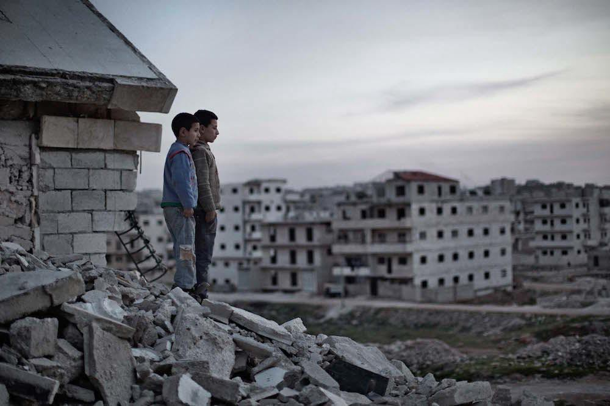
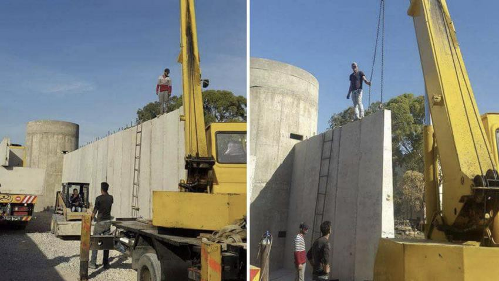
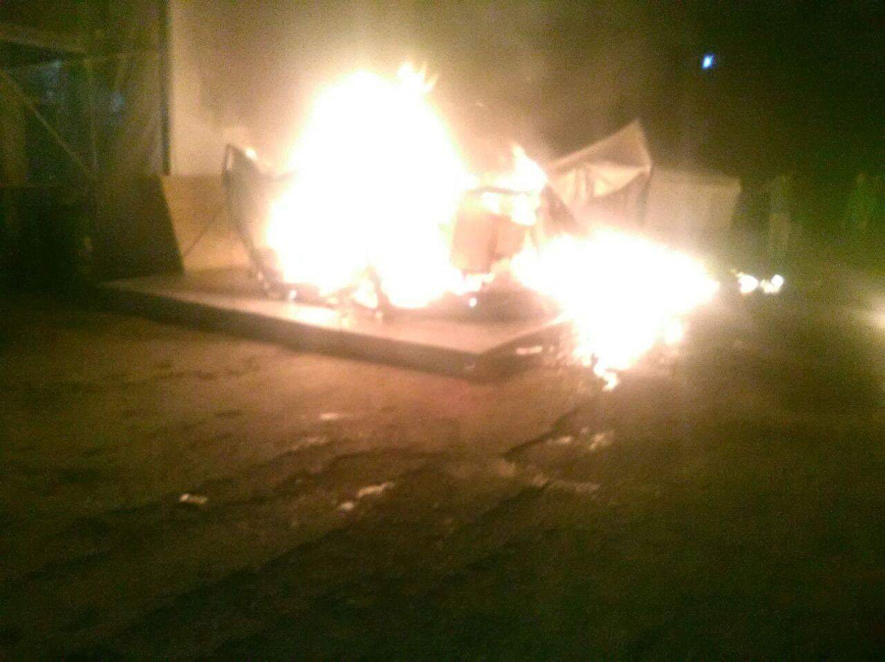
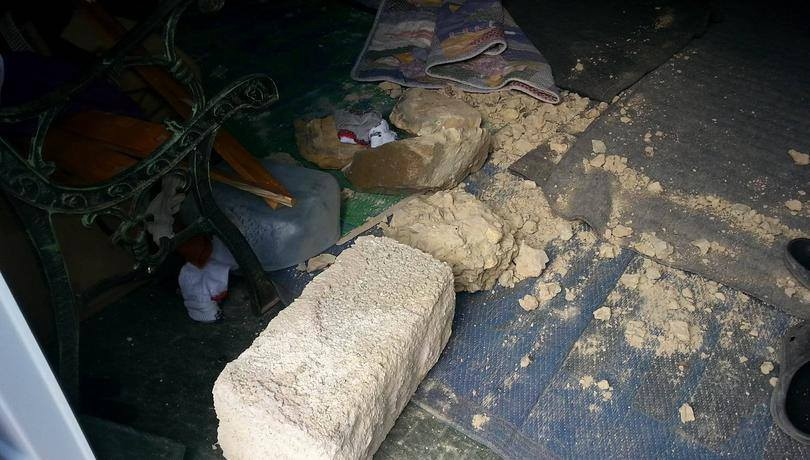
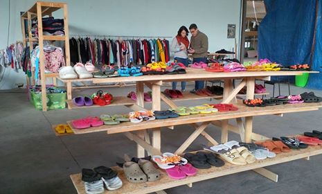
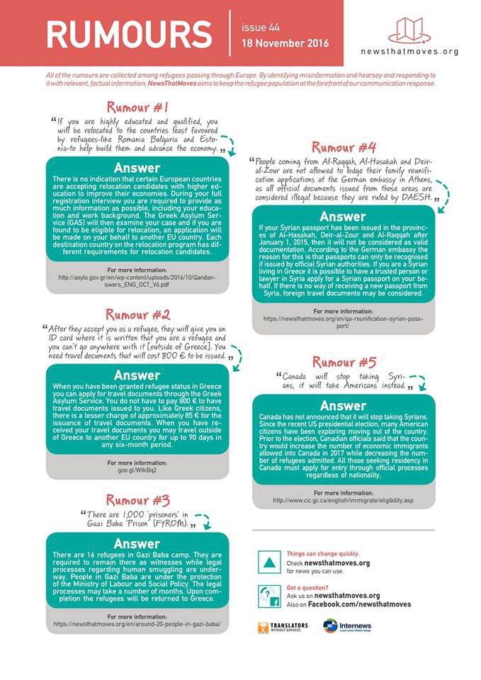
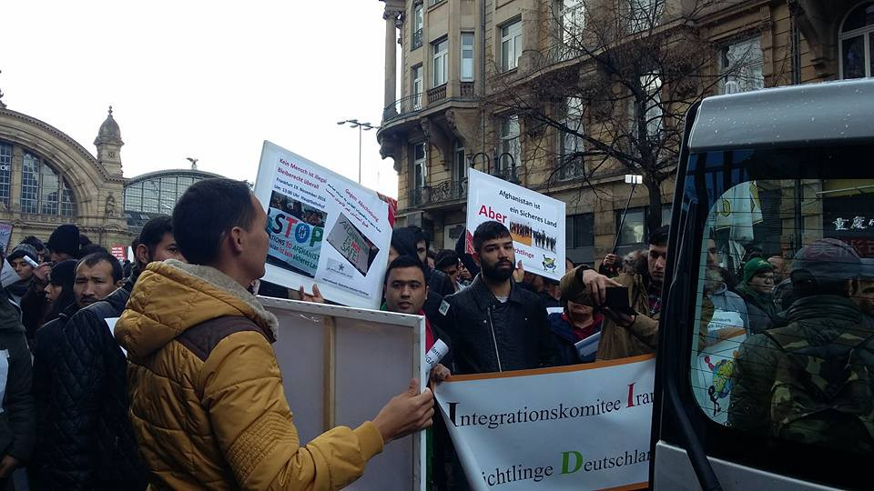

### AYS News Digest 19\.11 — Amidst campaign to take Eastern Aleppo, hospitals are destroyed and hundreds are killed and injured\.

Syrian boys in Aleppo standing atop rubble stare into the distance\. Photo Credit: Nish Nalbandian
#### Feature

The offensive that the Assad regime and its Russian allies have been threatening for weeks is at last taking place, at the expense of the residents of East Aleppo\. According to SOHR, a minimum of 51 people have been killed so far, in addition to 150 injuries\. These casualties are the result of the 2,000 shellings and 200 airstrikes undertaken by the regime and Russia in the course of the day\. Over 180 people have been killed, 97 of them in Eastern Aleppo, since Tuesday\.

It is a story all too well\-known during the course of this massacre\-laden war: hospitals are being deliberately targeted\. There were five functioning hospitals in East Aleppo on Friday morning\. Since then, they have all been put out of order as a result of the strikes, according to the World Health Organization\.

In addition to the desolation faced by East Aleppo hospitals, one should be reminded that necessary medicines are becoming near impossible to get ahold of in the besieged city\. Now more than ever, Syria is in need of medical resources\. If you have the money to spare, you may contribute to the UK Action For Refugees backed effort found [here](https://mydonate.bt.com/events/icu/337171) \.
#### Yemen
### Even as a ceasefire goes into effect, fighting continues\.

After having only just come into effect, both sides of the war are blaming the other for ceasefire violations\. Gun battles continue to plague the city of Taiz, and the Saudi coalition has accused the Houthis of launching a missile in violation of the ceasefire\.

The ceasefire is designed to last for a total of 48 hours to ease the humanitarian situation on the ground and to improve the prospects for peace\. The Houthis have voiced their willingness to lay down arms and join a unity government should such an offer appear on the table\. For now however, the prospects of such a move do not seem high\.
#### Lebanon
### Lebanon is enclosing a refugee camp in its own rendition of the Apartheid Wall in Palestine\.

Lebanon has began building a massive wall with watchtowers around the Ain al\-Hilweh Palestinian refugee camp following clashes between the military and refugees\. The camp is home to 70,000 Palestinian refugees who had lived there for a long time, as well as thousands more who fled Syria as a result of the brutal war\. Lebanon plans to finish building the wall in the span of 15 months\.

Sections of the newly built wall\. Source: Twitter
#### Turkey
### The Migrant Solidarity Network releases report detailing

“This Saturday, on November 19th, 123 migrants managed to escape the Kumkapı deportation center in Istanbul, after starting a fire in their cells\. While the fire brigades were working to extinguish the fire, the migrants broke through the gate of the courtyard and ran away despite the policemen shooting in the air\. The police forces brought 20 of them back while searching the neighborhood\.

Kumkapı “Removal Center”, is one of the oldest deportation centers in Turkey, infamous with its deplorable accommodation conditions and the corrupt treatment that devoid the migrants of their basic rights\. In Kumkapı, imprisoned migrants held another riot last December, and in the past the center was protested many times by migrant solidarity activists\. As a matter of fact, the European Court of Human Rights ruled, in 2014, that there had been violations of people’s freedom and security, right to efficient application and ban of torture and ill treatment\.

The number of migrant in prisons and deportation centers in Turkey tended to increase particularly after the EU\-Turkey deal, which requires Turkey to implement all means to prevent irregular migration to Europe\. As of today, there is an unknown number of migrants imprisoned in the deportation centers constructed in the cities of Adana, Antalya, Aydın, Bursa, Çanakkale, Edirne, Erzurum, Gaziantep, İstanbul, İzmir, Kırıkkale, Kırklareli, Tekirdağ and Van, with a capacity of 13,660 persons \(according to the official numbers of Directorate General of Migration Management\) \. The migrants detained in these centers are under constant risk of deportation that is to be implemented in the cause of diplomatic calculations\.

Turkey, as the committed watchdog of the Fortress Europe, distinguishes the migrants who are allowed to live or move freely, and condemns the others to live at survival level, or to be labeled as “illegal” or “criminal” and collected in deportation centers to be deported\. Among the migrants who liberated themselves with the Kumkapı fire, many were Afghan or Pakistani, and they were imprisoned at the first place despite the right for refuge or a better life they were looking for, leaving behind the dire conditions of poverty, violence, ethnic discrimination or political pressures in their respective countries\.

As of today, more than 720 migrants who managed to reach Greece from Turkey were sent back as part of the EU\-Turkey deal\. The Turkish government makes no comment on where and under which conditions these people are kept, and what is expected for them, while on the other hand mentioning the visa\-free travel promise constantly\.

We, as the Migrant Solidarity Network, still believe that every person has the right to free and unconditional movement and the freedom to live wherever he or she desires\. No one should be imprisoned for practicing this right\. While the war, destruction and oppression are on constant in this part of the world, it is inadmissible that walls are constructed on the border between Turkey and Europe, and state policies tend to classify, discriminate and imprison the migrants\. It has to be questioned once more how “safe” this country of ongoing\-state\-of\-emergency is, and the EU\-Turkey deal should be abolished\. We call for free passage to everyone\. And we call everyone to stand in solidarity with all migrants seeking freedom and a better life against the rising fascism and racism all around the World\.”
#### Greece
### Fascist assault on Souda Camp on Chios continues\.

Burning tents in Souda\.

An example of the kinds of stones used against the refugees\.

Fascists flung stones and Molotov cocktails into Souda camp for the second night in a row\. As a result, many have left the camp for fear of such an attack repeating\. At least two people were injured, and a woman had a stress\-induced miscarriage of twins as a result of the attacks\. The atmosphere on Chios continues to be tense, with Greece evacuating foreign experts from the island for fear that the violence will continue\. The perpetrators of the attack are suspected to be Golden Dawn supporters, and a Golden Dawn MP has been beaten by antifa partisans following the attacks\. It is shameful that Greek authorities were not prepared for further violence after the first night, and that more people had to suffer at the attackers’ hands\.
### [ClinicFinder app](http://www.clinicfinder.org/?locale=ar) helps refugees to find the nearest clinic\.
### A total of 110 have arrived on Lesvos\.
### The Clothing Shop in All Eipida is distributing winter clothing to minors 16 and younger\!

### Two new reception centers have opened in Ritsona and Koutsohero\.

Some of the latest rumors spread among refugees — answered\.
### Yellow Aid Truck seeks donations for repairs\!

The group has been delivering aid to refugees in Greece for a while, and as a result the trucks used are becoming worn\. Those capable of giving should do so [here](https://www.gofundme.com/YellowTruckForRefugees) \.
#### Serbia
### Confusion reigns along the Hungarian border\.

Officials in Serbia are still unsure if Hungary will be shortly lowering the daily quota to either 10 or 5, or whether the border will be sealed completely\. For now, it remains at 15\. It also should be known that many individuals after passing through the required checks at the Hungarian transit zones are often able to quietly move forward, although this is a fact that is not widely publicized\.
### Serbian facilities closely approaching full occupancy\.

[News That Moves has reported](https://newsthatmoves.org/en/still-places-in-reception-centers-in-serbia/) that 5,100 of the 6,000 spaces in government facilities have been occupied, in other words 85 percent of available spaces are full\. There are currently 6,400 refugees in the country, and as the Serbian government continues its efforts to bring them all under the care of governmental agencies, it is likely that what remains will fill up in the very near future\.
### Refugees testify against methods employed to transfer them to government camp\.

Moving Europe has published a [harrowing report](http://moving-europe.org/belgrade-police-raids-and-mass-transfers-to-presevo/) of the mishandling that refugees have had to deal with as a result of the Serbian police in Preševo and Belgrade\. The incident extensively covered in the report took place in the early hours of November 10, as police went around, waking and coaxing the refugees to board buses to be taken to government reception centers\. Those who refused were threatened with deportation\. Many of these refugees have dealt with worst, but the timing and the methods deployed by the Serbian police are absolutely deplorable\.
#### Germany

People protest the planned deportations in Frankfurt\. Photo Credit: City Plaza Squat
### Germany to deport almost 13,000 Afghans whose applications were rejected, prompting protests\.

The results of the much\-publicized EU agreement with Afghanistan, where the war\-torn country was threatened with cutbacks on economic aid lest reabsorbs Afghan refugees, are coming into fruition\. The government has announced that it is preparing for the deportation of 12,500 refugees from Afghanistan whose asylum applications had been rejected\. Germany is on course to deport 26,500 refugees in 2016, beating the previous year’s record of 20,888 deportations\.
#### France
### Minor refugees report having been coerced into performing unpaid labor\.

Last month’s evacuation of the Calais refugee camp has not meant the end of the relocated residents’ problems\. Some boys interviewed report having been forced to pick apples for a supermarket chain without compensation, [according to The Guardian](https://www.theguardian.com/world/2016/nov/19/calais-child-refugees-forced-to-work-for-nothing?CMP=share_btn_tw) \. Furthermore, 39% of those interviewed report having felt better in the notorious “Jungle” than they do in the new reception centers\. A quarter report not being given a change of clothes since their relocation\.
### France stands accused of illegally deporting refugees to Italy\.

Representatives of multiple human rights groups have come forward to report that on November 11–12, at least 62 people, among them children, were forcibly deported to Italy without their cases having been looked over\. Furthermore, the situation along the French\-Italian border is looking increasingly dim, with hundreds of people, many of them also minors, being unable to cross into France\. The border has been closed since last year’s Paris attacks\.

_Converted [Medium Post](https://areyousyrious.medium.com/ays-news-digest-19-11-2cf3456707ae) by [ZMediumToMarkdown](https://github.com/ZhgChgLi/ZMediumToMarkdown)._
