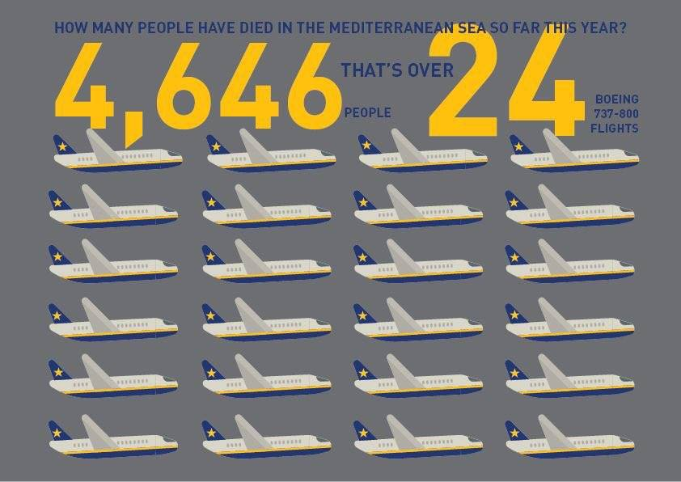
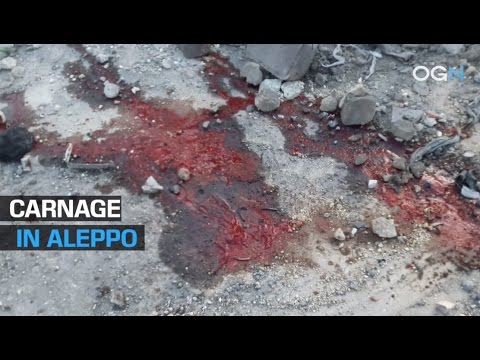
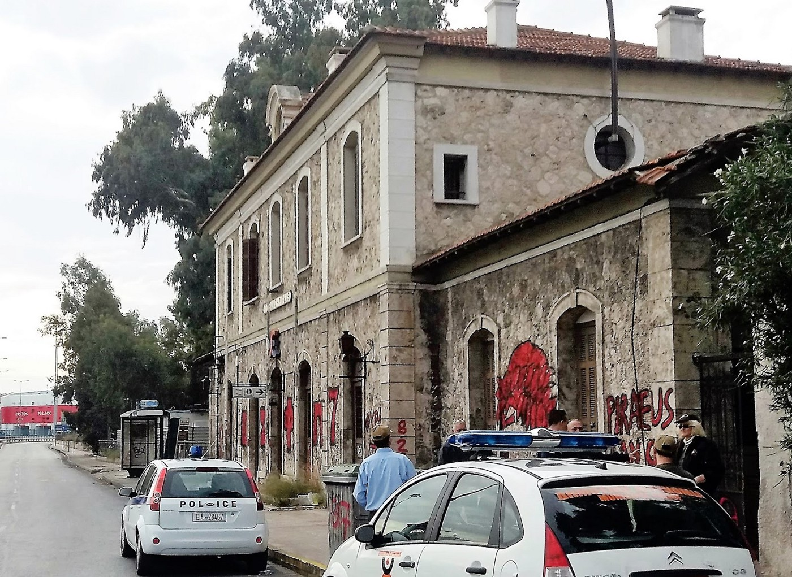
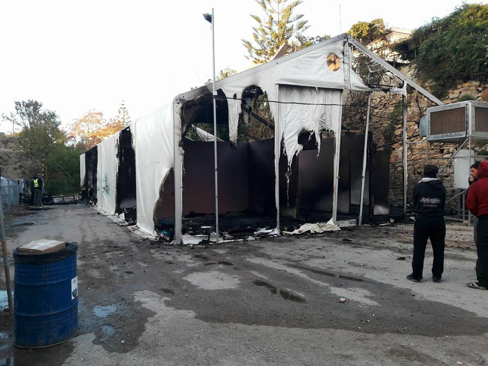
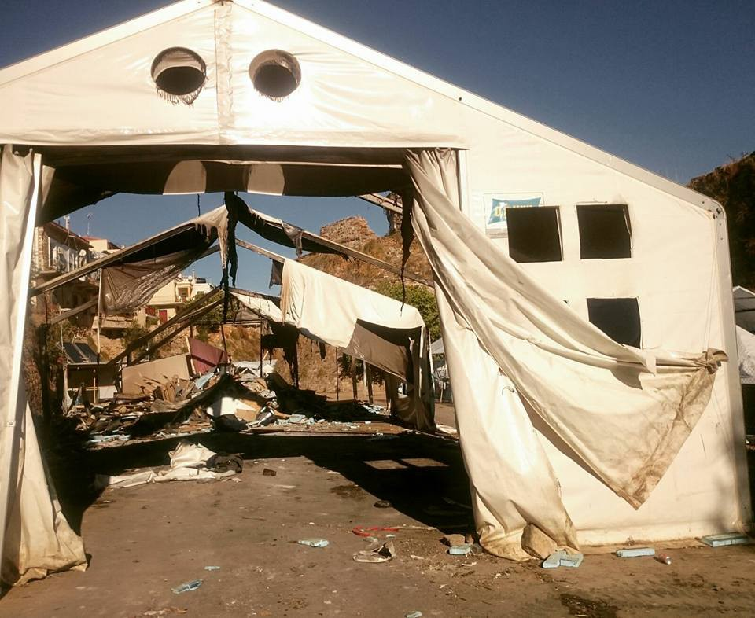

### AYS DIGEST 20/11/2016 — Universal Children’s Day or Universal mistreating day?

](assets/b8c6abdc447b/1*bXRAsaaEkf2P4IQKi-SYpQ.jpeg)

**I have a name, not a number to remember\-** [**Baobab Experience**](https://www.facebook.com/BaobabExperience/?fref=nf)
### Feature

Today, 100,000 children are being targeted with bombs in East Aleppo and all access to medical care has been destroyed\. Across Europe thousands of unaccompanied children are at risk of disappearing and exploitation in the absence of any government willing to take responsibility for them and 40 % of the 60,000 refugees trapped in Greece are children\.

Today it’s the Universal Children’s Day, established by the United Nations in 1954, Children’s Day is on November 20 each year to promote international togetherness, awareness among children worldwide, and improving children’s welfare\.

The UN General Assembly adopted the Declaration of the Rights of the Child on November 20, 1959, and then 30 years later it adopted the Convention on the Rights of the Child on the very same day\. The convention, outlines a number of children’s rights including the “right to life, to health, to education and to play, as well as the right to family life, to be protected from violence, to not be discriminated, and to have their views heard”\.

Nevertheless, more than 60 million people are currently displaced due to conflict, poverty and climate change and half of them are children\. While millions more face violence in their communities\.

All across the world and specifically in Europe human rights seem to have been forgotten as we get reports of so many cases of violations of human rights which take people question the role of the international institutions\.

“Who’s lives are valued? If 24 planes carrying 4,646 tourists crashed into the sea there’d be public outrage & legal investigations” Equality Aware

For the many of us that know modern History it’s not difficult to compare the failure of the United Nations to keep peace and provide security to the people around the world with the failure of the League of Nations, in the previous century, that became irrelevant and allowed some of the biggest atrocities to take place in the history of mankind\.

In a recently published article, [Is Aleppo the grave of the United Nations ?](http://www.thelancet.com/journals/lancet/article/PIIS0140-6736%2816%2932122-5/fulltext?elsca1=etoc) this subject is analyzed and ends with a demand to the all the parts involved:

> If nothing is done to prevent Aleppo’s destruction, and to end the impunity of those — from all parties — pursuing it and obstructing humanitarian action, these weeks will mark a resounding defeat of diplomacy and the triumph of brute force\. It is the UN as a whole that needs to act to save Aleppo — and in doing so, save itself\. 

### Syria

After the recent attacks on the last hospitals in Aleppo, once again we get bad reports from the city\. 23 civilians have been killed so far today by fighting between government and rebel forces in Eastern Aleppo, 12 of them children\. At least another 32 people were injured\. In addition another civil defense branch \(Sakhour district\) forced out of service as a result of a barrel bomb attack carried out by a Syrian regime chopper on the complex\. Northern Aleppo is witnessing repetitive use of cluster bombs carried out by Russian Air Force\. Hospitals in Aleppo are still out of service due to constant targeting, field hospitals have been set up in apartments on the front lines to avoid airstrikes\. It is estimated that in 20 days eastern Aleppo which is under total siege will run out of food and medical supplies\.

Also today UN’s special envoy, Staffan de Mistura held conversations in Damascus with foreign minister Walid al\-Moallem proposing the giving of opposition enclave of eastern Aleppo self\-administration as part of a process designed to bring calm to the city\. The syrian minister completely rejected the idea calling it a “violation of our sovereignty” saying that Syria would not accept 275000 people to be “hostage to 6000 gunmen”\.

De Mistura warned that time is “running out” for eastern Aleppo amid the government bombing campaign\.

### Greece

Today police evacuated the old train station at Pireaus port where some refugees have been finding shelter\. There are still some people arriving at the capital from the islands and very few can get accommodation in the city so some people occupied this small building that was today locked by the police\.

Police at the old train station at Pireaus port \(Athens\)
#### Samos

After the two days of violence at Souda camp on Chios the are reports of aggression today on the island of Samos with a friend of a volunteer witnessing uniformed and masked police throwing 4 refugees from the top of a refrigerated lorry\. The officers then proceeded to beat and kick the 4 young men with such violence that she was sure they would result in severe injuries\. They weren’t arrested, just beaten for trying to leave the island\. After the refugees left the port she ran to them and asked if they needed assistance and to go to the hospital but they refused saying they had no broken bones\. They tried to leave the island because they had been stuck for so long and being from Algeria they were constantly abused and picked on\. The witness also heard from the driver of the truck where the refugees were found, which was crying, and saying that he could not handle any more these acts of violence which he sees regularly at the ports\.

> What country am I in ? she asked me, where state officers can with such impunity attack people with such venom and violence\. 

Refugees are needlessly beaten whilst the inhabitants are humiliated by living on an island that allows such violence to go on unchecked\.
#### The Voices of Oraiokastro

From this camp in northern Greece comes an [ironic statement listing the 5](https://www.facebook.com/The-Voices-of-Oraiokastro-1627523520892089/) freedoms set out by the European Union for keeping livestock in wearhouses:

> 1\. Freedom from hunger and thirst — access to fresh water and a diet for full health and vigour;
 

> 2\. Freedom from discomfort — an appropriate environment with shelter and comfortable rest areas;
 

> 3\. Freedom from pain, injury and disease — prevention or rapid treatment;
 

> 4\. Freedom to express normal behavior — adequate space and facilities, company of the their own kind;
 

> 5\. Freedom from fear and distress — conditions and treatment which avoid mental suffering\. 

Sadly, this was written to ensure animal welfare standards don’t slip\. There is nothing written for humans in warehouses so the welfare of residents in Oraiokastro falls below the standard the EU set for animals\.
#### Chios

From Chios we keep getting evidence of the recent violence of the past 2 days\.

A tent destroyed by the fire

Several families end up sleeping on the street because of the attacks

Volunteers did the best they could to minimize the situation for refugees but many feel frustrated with the disregard for human life on the island\.

There has been a clarification from UNHCR regarding moving vulnerable families from the islands to mainland:

_“UNHCR is not, as a matter of course, asking people to move to Athens\. We do however, transfer people from the islands to the mainland, as follows:_ 
_1\) Within the framework of our urban accommodation scheme, through our offices on the islands, we are identifying families which must move to Athens because of certain vulnerabilities or could move to Athens because the next step of their asylum procedure is on the mainland\. Those identified, would also have to be free to move \(have no restriction of movement imposed by the authorities\* \) \._ 
_2\) Those identified by UNHCR as above, are transferred to the mainland \(Athens\) into urban accommodation under the UNHCR accommodation scheme\. Transfer to accommodation by UNHCR comes together with the full package of standard services \(meals, basic NFIs, interpretation, accompaniment, transportation, referral to education, health care etc\. \)_ 
_3\) This action is in support of the on\-going efforts to decongest the islands\. However, we are doing it in an organized and controlled manner; people are not left alone in Athens, they are entering the UNHCR urban living assistance package\._

For more information please click on the [link](https://www.facebook.com/groups/informationpointforlesvosvolunteers/permalink/609972532543531/) \.
#### Numbers:

Today the Greek islands saw many arrivals with 108 people landing on Lesvos, 94 on Chios and 15 on Samos being the total 217\.
### Serbia

Today at Miksaliste the numbers of people served were:

Men 24, women 68, 263 children, overall = 355

There have been also published 2 reports about the most recent situation in the country where there’s around 6000 people stuck\.

The first is about push\-backs to Macedonia and the conditions of the camps\.

For several weeks now, the Serbian police has been bringing people on the move to the now closed reception centre in Preševo\. These are people that have been staying in camps in the North before, for example in Subotica and Sid as well as in Belgrade\. Many people have launched their asylm process in Serbia\. Nonetheless, they are pushed\-back by the Serbian authorities\. It is reported that the Serbian authorities destroies their asylum papers in order to destroy all prove that these people have been in Serbia before\. The push\-backs are against the all international conventions and violate the asylum right of these people\. The push\-backs appear to happen in large numbers to make space in the reception centres, as Serbia has not enough spaces in reception centres for all the people currently stranded in Serbia\. Except for few unaccompanied minors and families all people who are brought to Preševo camp are subsequently pushed\-back to Macedonia\. Those vulnerable families and minors have been transferred to a new camp in Bujanovac, 20km north from Preševo…

For more reading please follow the [link](http://moving-europe.org/the-situation-in-serbias-south-systematic-push-backs-and-worrying-camp-conditions/) \.

The second is about the police methods in the country\.

On November the 10th in the middle of the night, a big police operation took place behind the main bus station in Belgrade and the parking lots near the so\-called “Afghan Park”\. 109 people were put onto buses and brought to the closed camp in Preševo near the Macedonian border\. From here, people are being pushed back on a constant basis\. Behind the bus station at the moment more than 700 refugees remain in empty warehouses and around 30 people are currently sleeping in the parking where night temperatures are at an average of 1 degree\. During the whole operation, although the people were very scared, they stayed remarkably calm and peaceful\. Police did not use actual physical force, but were sometimes deceitful towards the refugees by threatening them and lying over the bus’ destinations in order to get them to move from the park…

For more reading please follow the [link](http://moving-europe.org/belgrade-police-raids-and-mass-transfers-to-presevo/) \.
### France

Also from France we hear of mistreatment and injustice reported by Amnesty International\. They tell us the story of two Sudanese men currently detained near Paris and are at risk of being returned to Sudan or they may suffer serious violations of their human rights\.

Baker, originally from South Kordofan and Ibrahim from Darfur, were arrested in Calais following the dismantling of the camp\. They have received obligations to leave French territory and have been detained for this purpose\. Sudanese, and particularly those from South Kordofan and Darfur, should not be returned to their country of origin\.
The human rights situation in Sudan continues to be alarming, especially in conflict areas such as Darfur, South Kordofan and the Blue Nile State\. Security officials routinely interrogate those returned to Sudan\. The latter have often been responsible for serious violations of human rights, such as the use of arbitrary detention, torture and ill\-treatment\.

In August 2016, we sounded the alarm that 40 people identified as Sudanese were expelled from Italy to Sudan\.
The French authorities have always indicated that they do not want to make referrals to Sudan\. The rejection of Baker and Ibrahim may therefore create a new policy that could have catastrophic repercussions for other Sudanese\. The expulsion of Baker seemed to be scheduled for today November 17 at the end of the day; That of Ibrahim for the 19th of November\.

_Converted [Medium Post](https://areyousyrious.medium.com/ays-digest-20-11-2016-universal-childrens-day-or-universal-mistreating-day-b8c6abdc447b) by [ZMediumToMarkdown](https://github.com/ZhgChgLi/ZMediumToMarkdown)._
