### AYS 22/11: The population of refugees in Europe is growing, yet our understanding of the process of integration is limited

_What makes the integration of refugees in Europe difficult and how we can all do better? No hospitals left opened in Aleppo due to heavy bombing in the past days\. New 68,000 displaces people in Iraq\. Greek far\-right extremists attacking refugees and making their lives unsafe\._

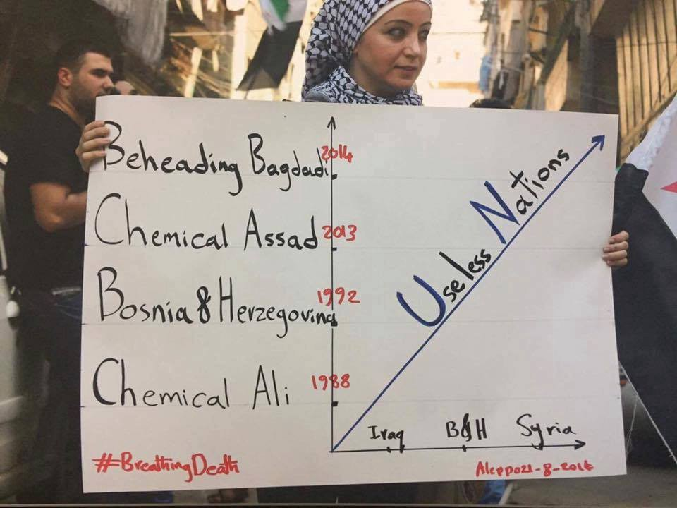

Integrating the more than one million refugees who have come to Europe since 2015 is a key challenge for the present social peace and the future economic prosperity of the continent\. In order to start their life in Europe, refugees have to learn languages, to find a way to continue studying, find jobs, and to deal with rising anti\-refugee sentiments all over European Union, that is becoming more and more xenophobic\.

Germany tried to introduce models of successful integration using slogan [“Wir schaffen das\. We can do it](http://www.debatingeurope.eu/2016/11/17/can-refugees-integrated-europes-job-market/#.WDVZW3fMz-Y) ”\. The government invested huge amounts of money to promote the campaign, that was soon dumped\. Even German Chancellor, Angela Merkel, admitted failure saying that slogan had become an _“almost meaningless formula”_ \.

Does that mean the sentiments behind it were also wrong?

[German MEP Cornelia Ernst, GUE/NGL coordinator on the European Parliament’s Civil Liberties Committee, said](http://www.guengl.eu/news/article/europe-needs-a-policy-framework-for-refugee-integration) that the EU does not have a policy framework for refugee integration and this reflects on the weak response to the crisis in some member states\.

> “There are serious gaps in the Commission’s approach: the directives do not provide support for people with special needs, children and the elderly and they do not make provisions for appropriate training and education to support the integration of vulnerable people\.” 

Several integration issues have been found across the continent\.

Lack of tailored English classes and job opportunities prevent people fleeing to the UK from integrating for many years, a new study on [Optimising Refugee Resettlement in the UK](http://www.sussex.ac.uk/migration/research/integrationcitizenship/refugeeresettlement) shows\. More needs to be done to ease the difficulties facing refugees if they are to reach their potential in the UK, according to the first major piece of research into the government’s resettlement scheme\.

In Croatia, volunteers are trying to help refugees overcome some of the barriers, like language skills\.

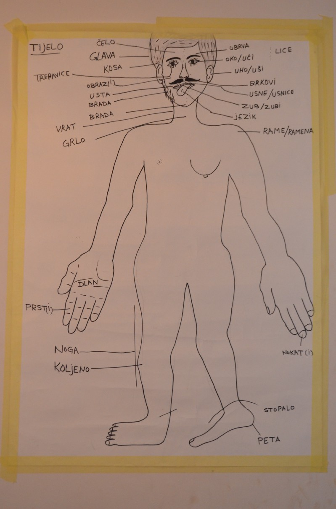

Refugees learning body parts in Croatian in refugee centre in Zagreb\. Credits: Sara Bencekovic \(AYS\)

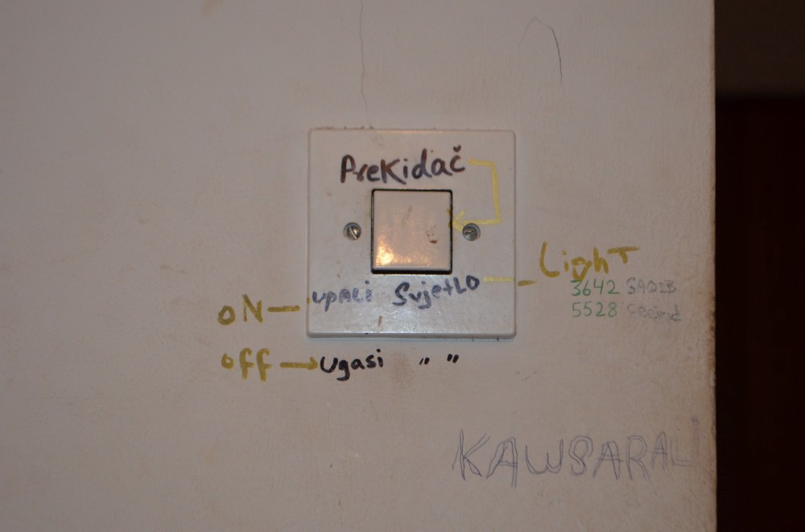

Creative ways refugees developed for learning Croatian terms for light and switching\. Credits: Sara Bencekovic \(AYS\)

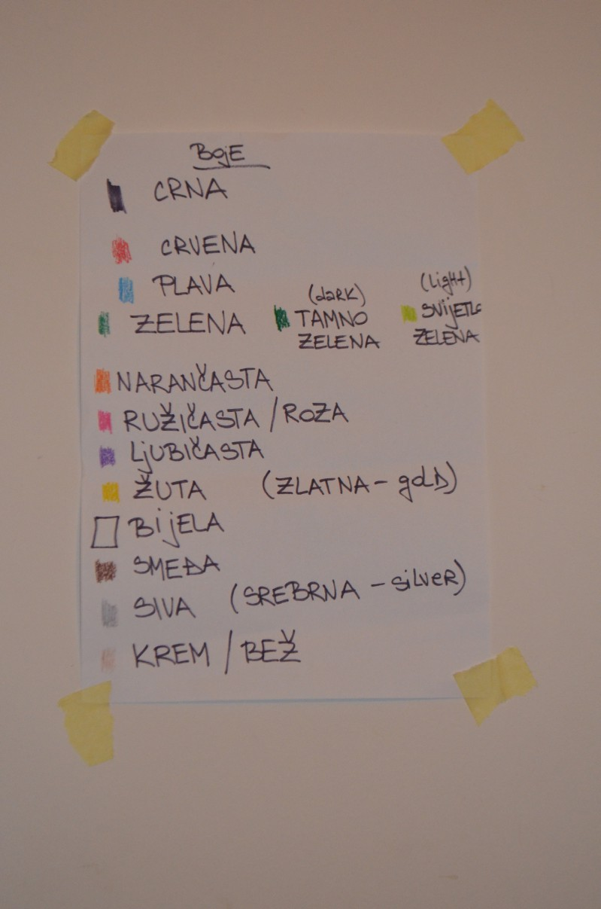

Refugees in Porin learning colours\. Credits: Sara Bencekovic \(AYS\)

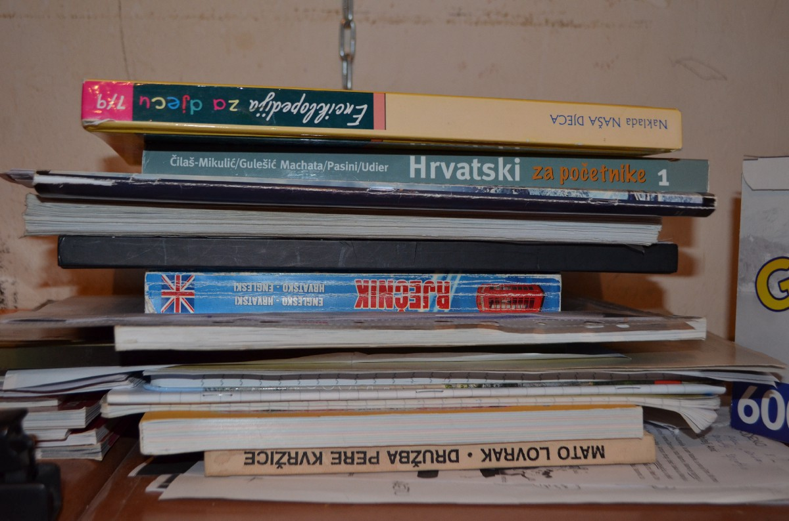

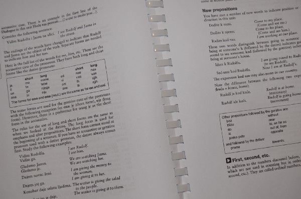

Learning Croatian\. Credits: Sara Bencekovic \(AYS\)

[Recent study conducted in Germany](https://libcom.org/blog/migration-refugees-labour-21022016) shows that it becomes easier for refugees to integrate in surroundings with low unemployment, good educational and training opportunities and lots of available housing\.

The OECD has estimated that it takes 20 years for refugees to achieve the same employment rates as native workers\. The study “ [From Refugees to Workers: Mapping Labour Market Integration Support Measures for Asylum\-Seekers and Refugees in EU Member States](https://www.bertelsmann-stiftung.de/en/publications/publication/did/from-refugees-to-workers-mapping-labour-market-integration-support-measures-for-asylum-seekers-and-3/) ,” reveals some challenges to the labour market integration of refugees throughout the European Union:

> “The legal and administrative hurdles making their integration more difficult; the lack of capacity in public employment services and other state institutions for tackling the specific needs of this group; and insufficient coordination among local and national governments, leading to some fragmentation in implemented measures\.” 

Successful integration rates also [differ between subcategories of refugees](http://www.tandfonline.com/doi/abs/10.1080/1369183X.2013.849569) : asylum refugees versus resettled refugees\. The main difference between asylum refugees and resettled refugees is that the former apply for asylum at the border of the destination country whereas the latter are resettled from UNHCR refugee camps or elsewhere\.

Specific policy initiatives to speed up the labour market integration of newly\-arrived refugees could include placing them in municipalities with low unemployment rates, better evaluating their skills, and improving language courses by connecting the courses directly to the needs of the job market\.

Integration policies should address the specific knowledge gaps of newly arrived refugees in relation to labour market demand in order to reduce the mismatch between their skills and those needed in the European job market\.
### Greece
#### Arrivals
- Lesvos 45
- Chios 52

Total 102

Total of 16,572 now on the islands\. Capacity remains at 7,450\.

Meanwhile, only migrants and refugees who are likely to be granted asylum can be moved from the islands to Greece’s mainland, [said government spokesman Dimitris Tzanakopoulos for the local media](http://greece.greekreporter.com/2016/11/21/only-migrants-likely-to-be-granted-asylum-can-leave-the-islands/) \.

Moreover, according to Tzanakopoulos, those migrants and refugees who leave the islands for the mainland cannot participate in the European Union\-Turkey agreement program\.

> “Decongestion of the islands and the relocation of refugees and migrants to the mainland is linked largely with the EU\-Turkey agreement\. When someone moves to the mainland, they are automatically out of the scope of the agreement\.” 

Mouzalas stated that at this point it is not in Greece’s interest to relocate any refugees from the islands\.
### UNHCR published various lists with names of organizations, institutions and ministries who are responsible for managing processes in the camps

Find it [here](http://data.unhcr.org/mediterranean/documents.php?page=1&view=grid&Country[0]=83&Type[0]=16) \.
### Plan for refugee children’s hostel causes tension in Piraeus

Dozens of residents at the port city of Piraeus heckled representatives at a meeting of the municipal council on Monday, in protest at plans by a nongovernmental organization to open a hostel for unaccompanied refugee and migrant children\.

According to reports, Piraeus residents are opposing a project by the NGO Praksis, which has rented a former school building in Piraeus’s fifth district and plans to turn it into a hostel\. Questioned by Piraeus Mayor Yiannis Moralis on the scheme, the NGO reportedly said that the hostel would only be hosting 20 children from the thousands that are left stranded in Greece after making the treacherous crossing from Turkey alone\.

Responding to citizens’ concerns, the municipality’s zoning commission put a stop to construction work at the site, as the NGO did not have the necessary license\. However, Moralis defended the plan and scolded protesters for their reaction\.
### Donatios needed in Athens

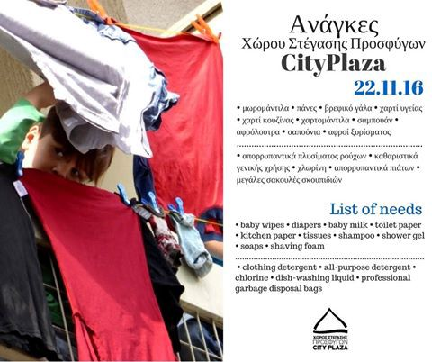

Credits: City Plaza Squat
### Volunteers needed to help on The Streets Project/Refugee Biriyani & Bananas Winter & Food aid mission in Thessaloniki, Northern Greece

](assets/e1570886dce5/0*p21q_BmjALqIY9SW.)

Credits: [**Refugee Biriyani & Bananas**](https://www.facebook.com/RefugeeBiriyaniAndBananas/)

](assets/e1570886dce5/0*uywvDoSpKL5U2_CP.)

Credits: [**Refugee Biriyani & Bananas**](https://www.facebook.com/RefugeeBiriyaniAndBananas/)

Please contact: ruhiloren@yahoo\.com
### English teacher needed in Athens

PM [Rafah Alderi](https://www.facebook.com/rafah.alderi?fref=ts) or [Shahzad Mahiudin](https://www.facebook.com/shahzad.mahiudin)
### A [‘Q&A’ on access to education](http://data.unhcr.org/mediterranean/download.php?id=2116) provides useful information to refugee parents and children about the plans of the authorities and about the rights of children to access formal schooling in Greece\.

In general:
- All children have the right to access public schools in Greece, at the condition that they are **vaccinated** ;
- At the first stage of the program, the MOE will focus on providing education to children aged 4–15;
- The MOE aims to gradually provide formal education to approximately 18,000 refugee children;
- MOE is responsible for [facilitating](http://www.minedu.gov.gr/eidiseis/22034-04-07-16-gia-tin-eggrafi-allodapon-mathiton-me-ellipi-dikaiologitika-stin-defterovathmia-ekpaidefsi) \(link in Greek only\) the school enrolment of refugee children, even in absence of documentation\.

**CHILDREN LIVING IN OPEN SITES ON MAINLAND**
- Those **aged 4–5** will be eligible to attend kindergarten facilities established in camps;
- Those **aged 6–15** will be enrolled in the ‘reception classes’ from 14\.00 to 18\.00 in schools close to their site and will be taught Greek, English, Mathematics, Sport, Arts, and Computer science\. Transportation is provided by IOM\.

For more information, read [this](http://data.unhcr.org/mediterranean/download.php?id=2113) \.
#### Bulgaria
### Local authorities registered cases of **scabies** , **leishmaniasis** and **varicella** among migrants and refugees hosted at the **Harmanli** reception center in **Bulgaria**

Harmanli’s refugee camp is thus under quarantine, although not everybody in the camp is ill\. The reasons for the spread of diseases are bad hygienic conditions and many other sources of infection\. [Volunteers criticize that the Ministry of Health was informed already two month ago about the problem of scabies and fleas in the camp](https://lydblog.wordpress.com/2016/11/21/karantina-harmanli/) \. 3,000 migrants are hosted at Harmanli\.
#### Macedonia
### Gazi Baba update

There are currently 16 migrants in Gazi Baba, a closed center for migrants in FYROM\.

People held there are required to remain in FYROM as witnesses in trials related to human smuggling\.

The completion of trials may take a number of months\. Afterward, people will be returned to Greece, according to FYROM authorities\.
#### Serbia
### Another push\-back of refugees from Subotica to Presevo

**Tonight, a group of people who were out of the official camp was rounded up at the brick factory in Subotica and put on the train to Presevo\. According to our sources in Serbia and Macedonia, such returns to Presevo have resulted in many recent push\-backs to Macedonia\. Serbian police is pushing them over the green border, towards a small village where limited volunteer support is provided, and refugees often end up paying the smugglers to get back to Serbia — a vicious circle that strips them off their money, dignity and faith in the system which was supposed to protect them\.**
### Serbian government’s vice\-president states that 2,000 smugglers have been arrested this year in Serbia
### Only hot meal of the day for refugees in warehouses in Belgrade, Serbia, served by volunteers banned from aiding the needy\. 900 refugees are left hungry and malnourished

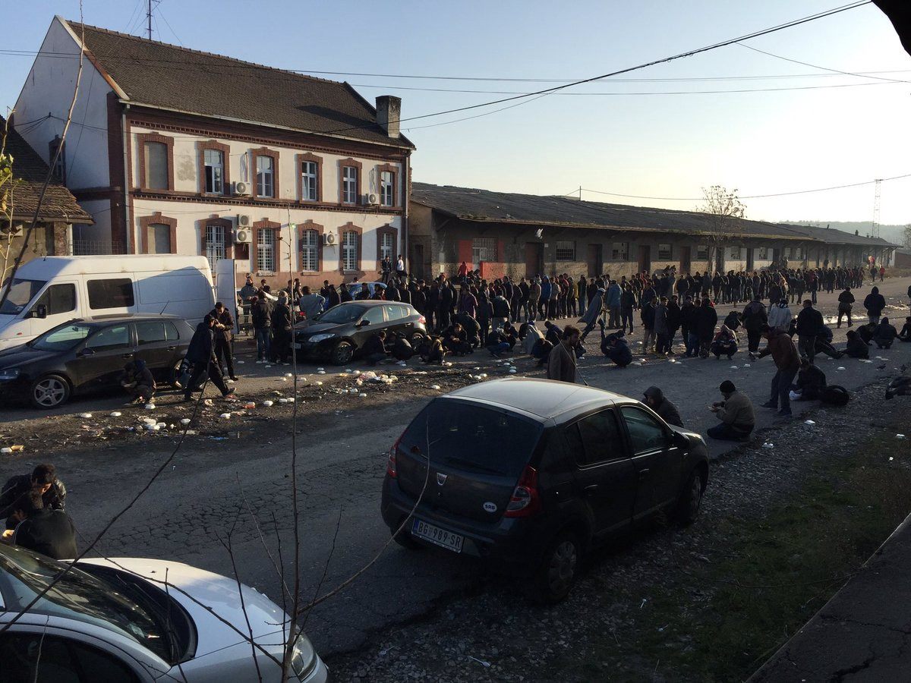

Credits: Lydia Gall

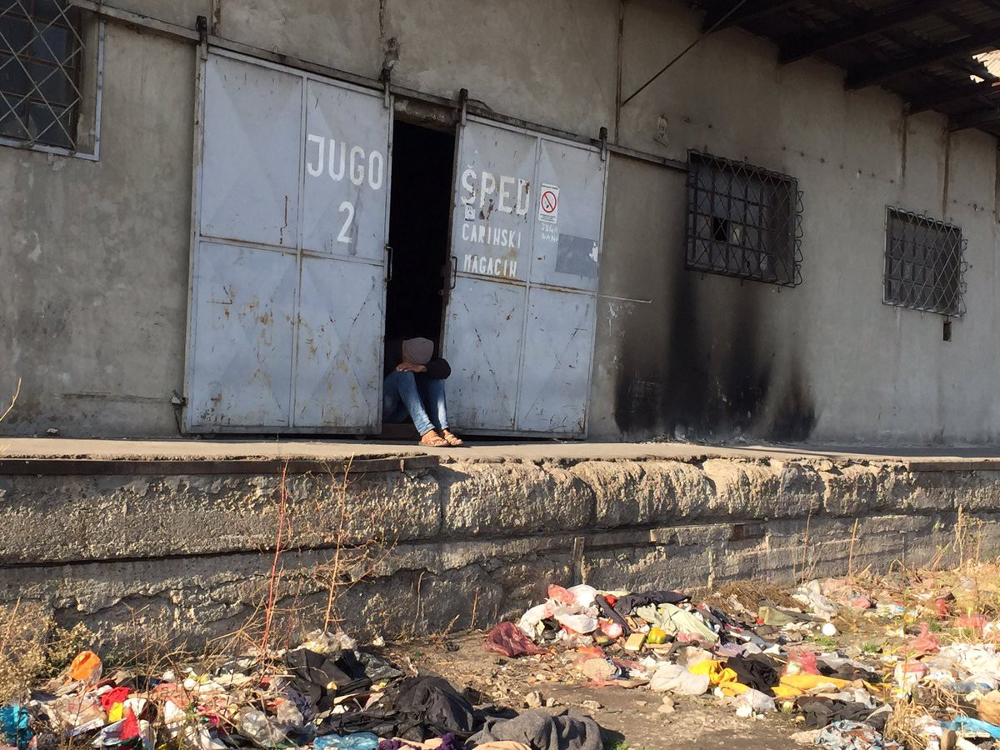

Credits: Lydia Gall
### Warehouse in Belgrade is hosting 100s of refugees\. Their reality is smoke, urine, scabies, lies; unbearable conditions

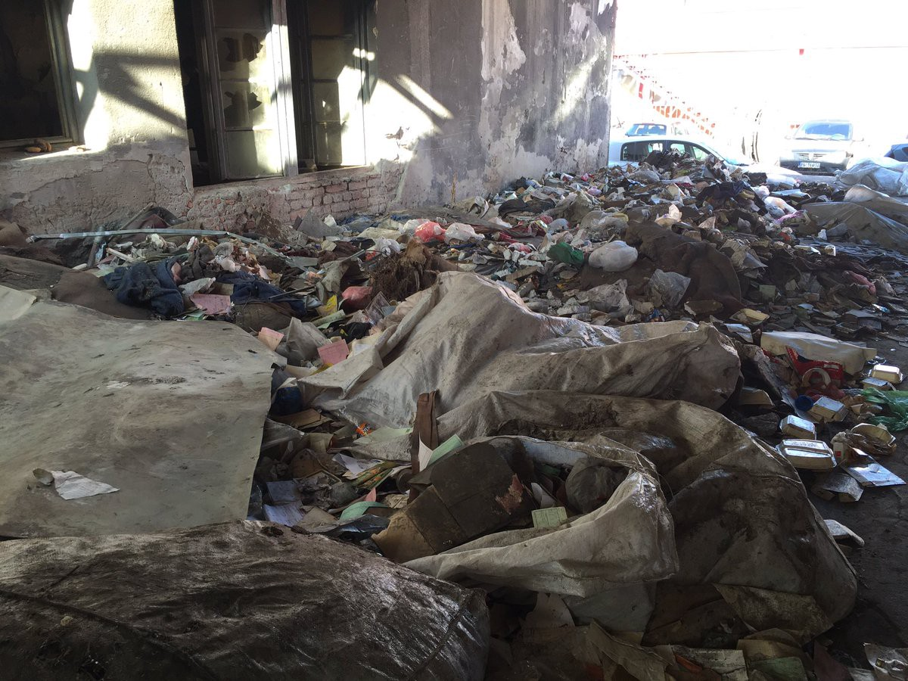

Credits: Lydia Gall

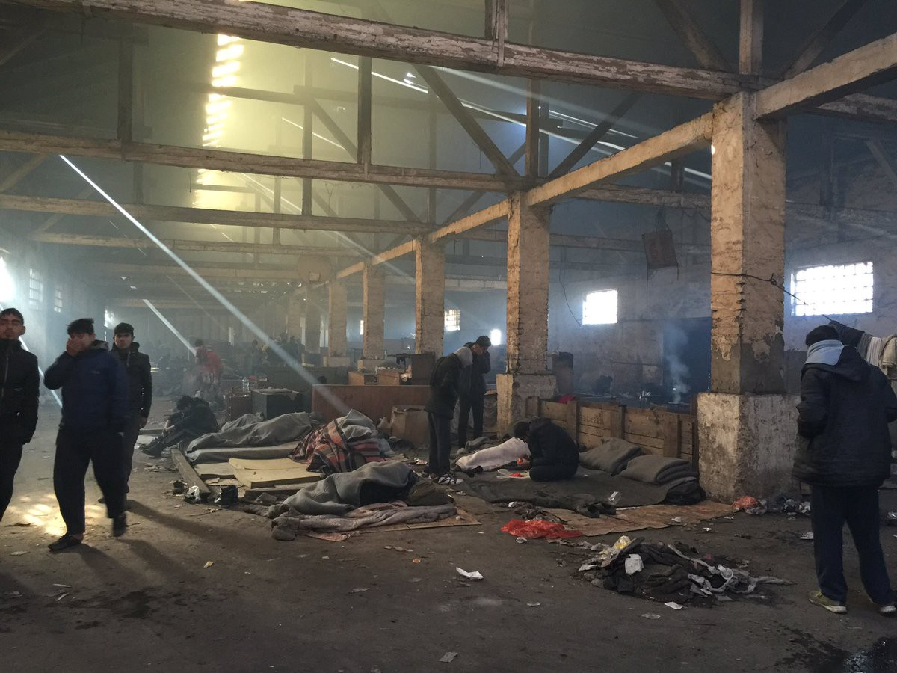

Credits: Lydia Gall
### Refugees addressing governments and people in Europe

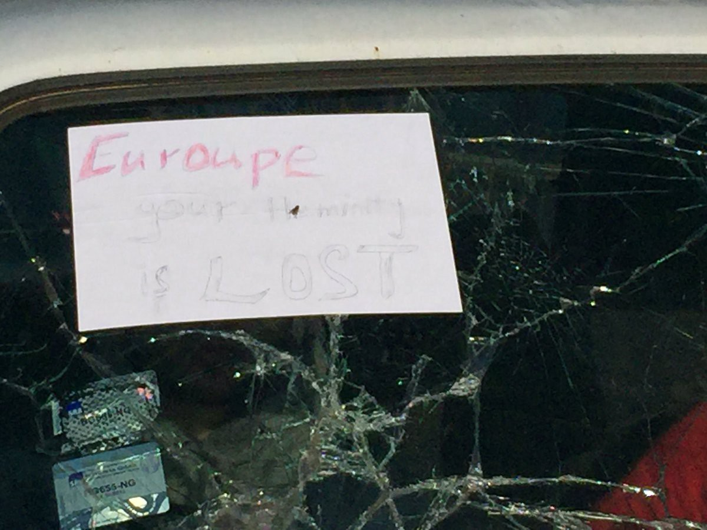

Credits: Lydia Gall

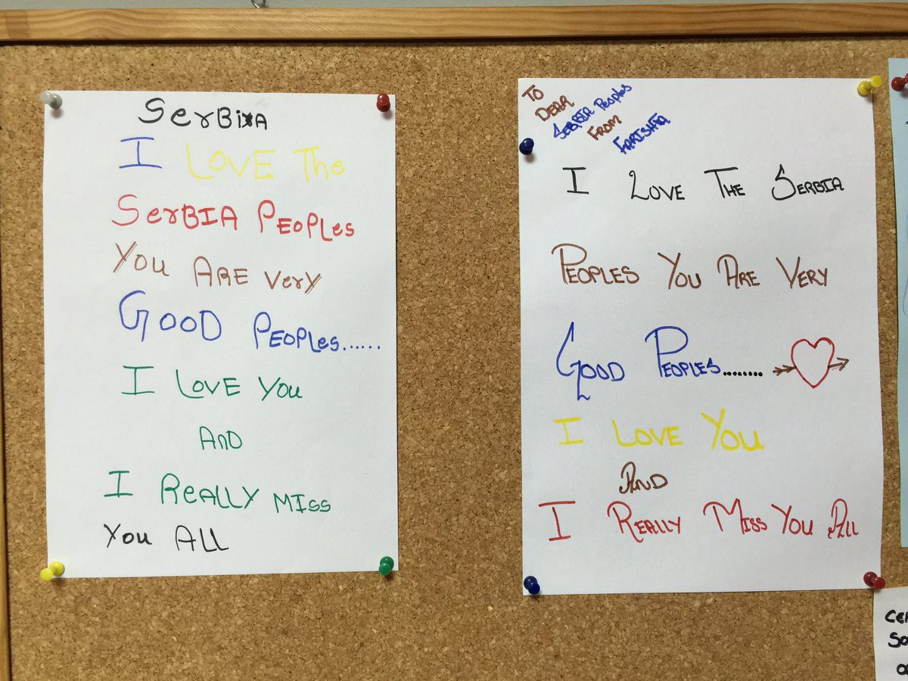

Credits: Lydia Gall
#### Mediterranean
### 345,440 refugees arrived by sea to Europe\. 4,655 dead/missing\.

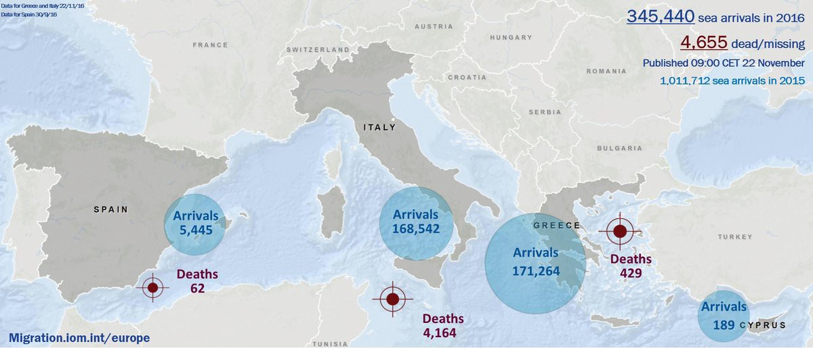

Credits: IOM
#### General
### The European Union Agency for Fundamental Rights has released a new paper on hate crime and hate speech against migrants

**Asylum seekers and migrants face various forms of violence and harassment across the European Union \(EU\) \. As this month’s report on the migration situation underscores, such acts are both perpetrated and condoned by state authorities, private individuals, as well as vigilante groups\. They increasingly also target activists and politicians perceived as ‘pro\-refugee’\.**

Read more [here](http://fra.europa.eu/en/publication/2016/current-migration-situation-eu-hate-crime-november-2016?_cldee=ZWxpc2FiZXRoLnNjaG1pZHQtaGllYmVyQHBpY3VtLm9yZw%3D%3D&recipientid=contact-18822bf59bf4e4119de700155d040d18-1e6940d09d9c4a3cabd63080d8576b66&esid=ef69adc2-08b0-e611-80ce-00155d040a3b&urlid=0) \.

_Converted [Medium Post](https://areyousyrious.medium.com/ays-22-11-the-population-of-refugees-in-europe-is-growing-yet-our-understanding-of-the-process-of-e1570886dce5) by [ZMediumToMarkdown](https://github.com/ZhgChgLi/ZMediumToMarkdown)._
