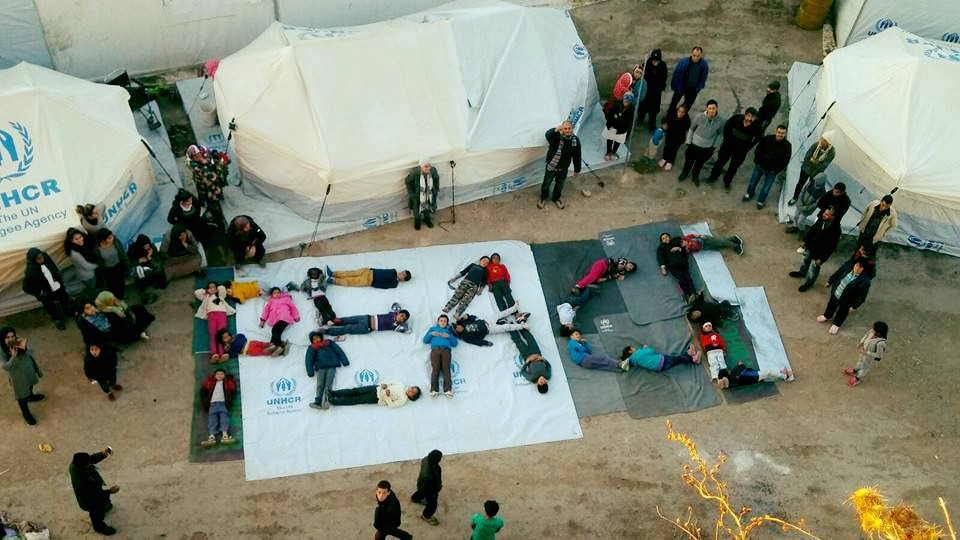
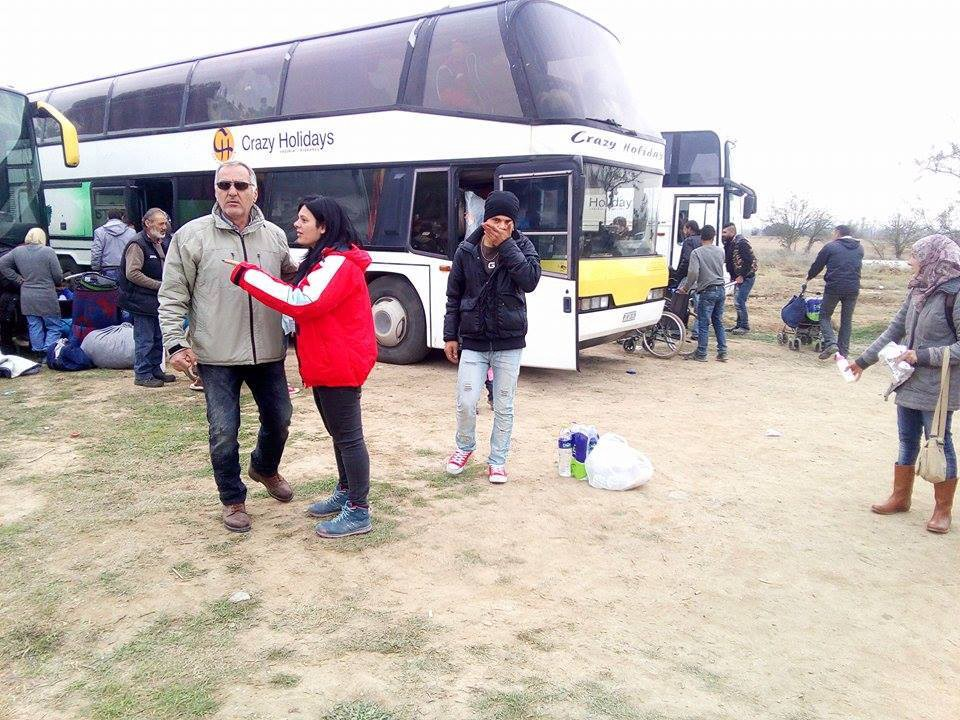
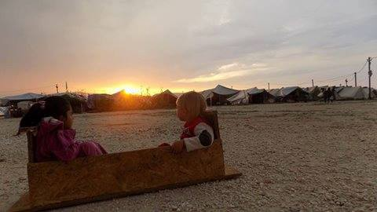
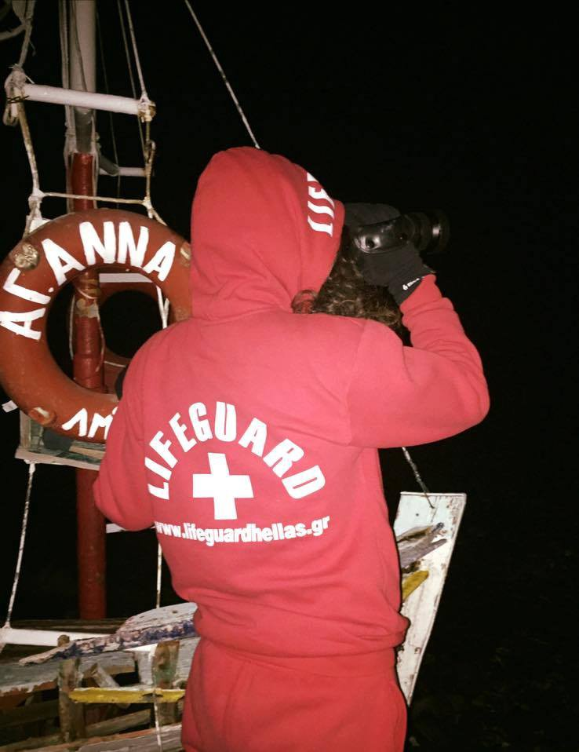
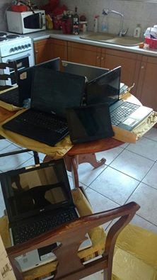
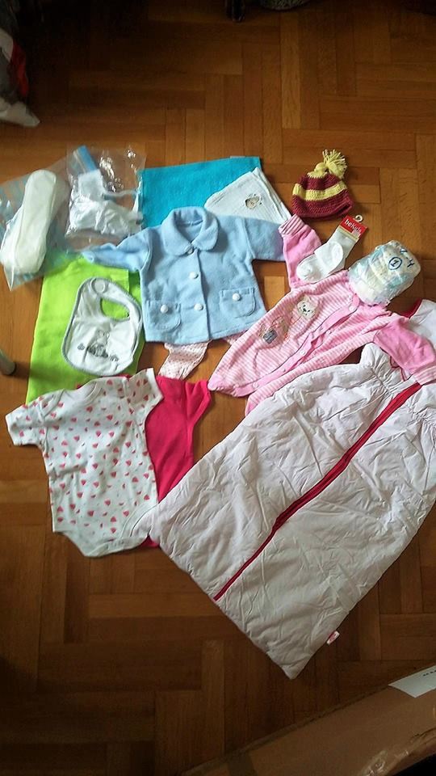
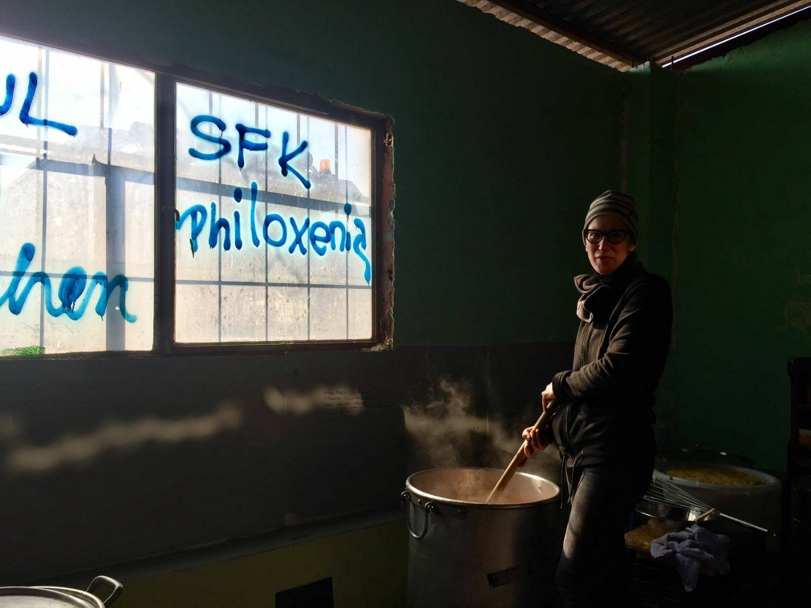
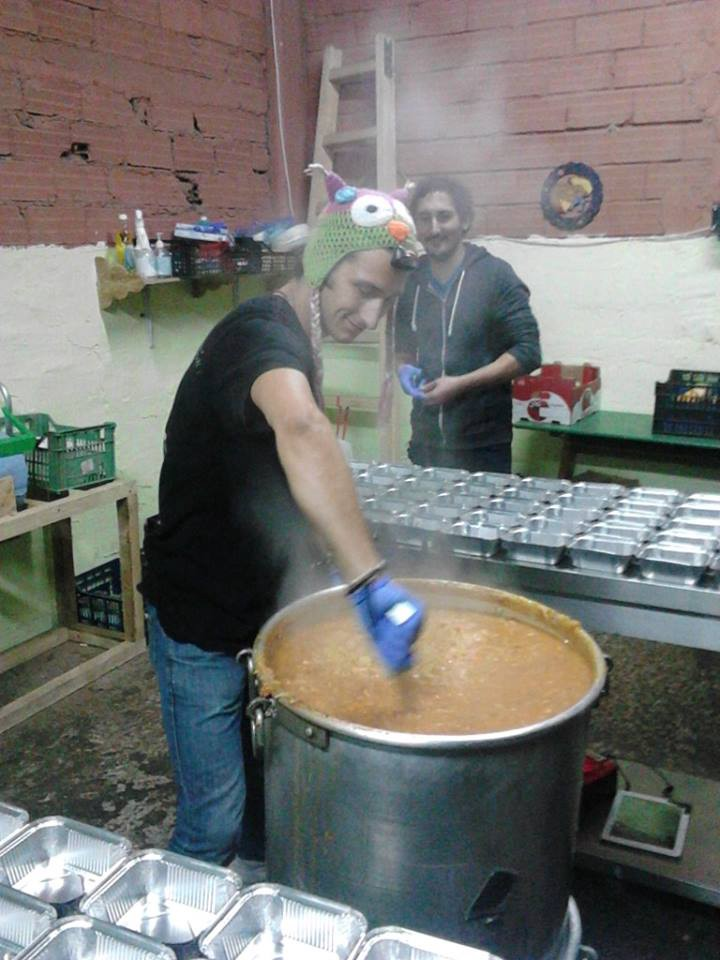

### AYS Digest 23/11: 2016, the year Europe “decided to shut the door to refugees”

_Europe focuses on preventing arrivals and outsources responsibility for refugees\. Changes in Greek camps\. Children disappear after Calais eviction\._

Demonstration for peace in Chios\. Photo by Lefki Pavlidis
#### Europe
### Europe outsources responsibility for refugees

In a new [report](https://www.hrw.org/news/2016/11/23/eu-policies-put-refugees-risk) , Human Rights Watch analyzes the EU’s efforts to outsource responsibility for asylum seekers, with Judith Sunderland, associate Europe and Central Asia director at Human Rights Watch, saying

> “The year 2016 stands out as a time when the EU decided to shut the door to refugees, and make life harder for those already here”\. The rush to make the EU a hostile environment and keep people away at all costs belittles the enormous often life\-endangering risks people take to escape conflict, persecution and human rights abuses, and runs counter to Europe’s values\.” 

HRW also claims that inside Europe, national governments are rolling back asylum rights, including the right to family reunification, while the EU’s emergency relocation plan has failed to function as needed, with only 7,000 asylum seekers transferred out of Greece and Italy out of the target number of 106,000\.

Recent decisions, taken in the EU, give the HRW’s analysis even more weight\.

The Danish government has just suspended a program to receive around 500 refugees per year through the UNCHR\. Denmark is also one of the few countries that has refused to take at all part in the EU’s relocation mechanism\.

A German state court has ruled that Syrians can be granted “subsidiary protection” instead of full asylum\. Around 113,000 refugees, including 94,000 Syrians have been granted subsidiary protection, which suspends family reunification for two years\.
#### Greece
### Refugees moved to other camps

Photo by Said Bilal

23 refugees were registered on Chios today\.

Yesterday, refugees were brought from Petra camp to a hotel in the Thessaloniki region and refugees from Mazarakis camp in Cherso write that six buses took some of them to another camp with ISO boxes\.
### Solutions needed for vulnerable families in Oreokastro

The [Voices of Oreokastro](https://www.facebook.com/ThevoicesofO/) says the Norwegian Refugee Council has rented an office building next to the camp in order to host a school, but argues it would make more sense to move the most vulnerable families inside the building because “the children are too cold to learn and yesterday we had another fire in two tents as people tried to warm themselves\.” Oreokastro continues to struggle with a lack of heat and electricity, while temperatures continue to drop\.

### Ritsona “refurbished” and provided with Isoboxes

Ritsona meanwhile, was refurbished according to [The Greek Reporter](http://greece.greekreporter.com/2016/11/23/refurbished-ritsona-camp-opens-to-160-refugee-families/) \. The website says that shared areas were added to the camp while tents were replaced with Isoboxes for 160 families\. It becomes increasingly clear that forcing refugees to sleep in tents, often for a second winter, is something that should be prevented at all cost\. Replacing these with Isoboxes is maybe not the ideal situation, but coupled with a good heating system will be far better than having families sleep in tents in freezing temperatures\.
### Olvidados forced out of Katsikas

The page [Katsikas Live](https://www.facebook.com/muhammadalisyria/) , reports on problems within the camp, saying the organisation Olvidados was forced out, despite being present for eight months and organising the valuable distribution of milk, pampers, food and clothing during that time\. Olvidados was previously forced out of Filipiada, were according to the NGO itself, ‘relations with the military were not always easy’\.

Photo by Katsikas Live
### Calls for donations
- [Team Bananas](https://www.facebook.com/TBananita/?fref=nf) says it had to suspend banana distribution in camps due to lack of funding and is currently providing bananas every morning to all homeless refugees in Thessaloniki centre\. Donations can be made directly on their Facebook page — one euro can provide breakfast for six children\.
- [The Lifeguard Hellas Save & Rescue Volunteer Team](https://www.facebook.com/lifeguardhellas/?fref=nf) needs [donations](http://www.savelife.gr/donate) , as it wants its team to be present on Lesvos all winter\. The team says their main cost concern is fuel for their rescue boats\.

Photo by Lifeguard Hellas
### Legal Info Sessions for Refugees

Mobile Info Team organizes a [Legal Info Session](https://www.facebook.com/events/1785073181741936/?active_tab=about) every Tuesday from 6pm to 8pm at Mikropolis Social Space library near the Aristotelous Square\. The Info Session takes place on the second floor on the left side and will try to answer questions regarding refugees asylum applications\. Relevant documents should be brought along\.
### Some good news out of Greece

Photo by Adb Hlal

The Filipiada camp was able to get five laptops and three Ipads and another six laptops will soon be delivered from Germany, for common use by refugees in the camp’s tea tent\.

This is also a good opportunity to mention a new Facebook group, [en route / e\-learning community for volunteers and refugees,](https://www.facebook.com/groups/505353956329728/) providing online education opportunities for both refugees and volunteers and focused on the unique challenges they face\.

[Amurtel](https://www.facebook.com/AmurtelHellasforRefugeeMothersandBabies/) was able to gift one of its first baby kits, for a mother and her baby that is expected to be born next week\. They are still looking new clothes given the cooler weather, especially outdoor baby suits, warm socks and hats and baby sleeping bags\.

Photo by Amurtel
### Soul Food Kitchen still working in the streets of Thessaloniki

Our comrades from Soul Food kitchen are still doing a great job on the streets of Thessaloniki\. We are happy and proud we got to support them in the initial phase of the project that has proved to be a reliable source of warm, nutritious meals for thousands who have passed through Thessaloniki in the past months\.

Photo by Adis Imamovic

Photo by Adis Imamovic
#### Serbia
### Afghan in hospital after trying to cross border

On Twitter, MSF says a young Afghan is in serious condition at the hospital, after being electrocuted, trying to cross from Serbia into Hungary\. MSF says refugees are trapped in Serbia in extremely poor living conditions, forcing them to take deadly risks\.

](assets/3a5668b066d8/0*g_YEqYk913ZLnEob.jpg)

Photo by [MSF Sea](https://twitter.com/MSF_Sea)

**152 people arrive in Presevo**

102 people, mostly unaccompanied minors from Afghanistan and Pakistan arrived during the afternoon, while another group of 50 people arrived later during the day\.
#### Hungary
### Last day of trial against Ahmed H on 30th of November

[Moving Europe](https://www.facebook.com/movingeuropeproject/) says the last day of the trial against Ahmed H\. will be on November 30th\.
The group says “ _in September 2015 Hungary sealed off its border for refugees which arrived via the so\-called Balkanroute\. Thousands of people stranded at the Hungarian fence; days of protests and conflicts with Hungarian border guards followed\. Afterwards the Hungarian police arbitrarily arrested 11 people and sued them for ‘illegal border crossing’, ‘participation in mass riots’ and ‘terrorism’ \(in Ahmad H\.’s case\) \. 10 of the accused were already sentenced to prison by political show trials in July\. On November 30th there will the final day of trial against Ahmad H\. He might be sentenced to 25 years of prison”\._
#### Italy
### Difficult situation for refugees in Trieste

The Italian Consortium of Solidarity, the main NGO working with refugees and migrants in Trieste, reports on a difficult situation for refugees in the city, claiming that there is no space anymore and people are forced to sleep in the streets\. According to the NGO, this means that newcomers could be moved to other cities in the future\.

On average people stay a whole year before getting some kind of protection and the Territorial Commission, the authority competent to examine asylum applications, gives many negative responses\. Rejected requests can be appealed but this procedure can take many years and nothing ensures it will be successful\.
#### France
### One third of 179 children tracked before Calais eviction disappeared

**The [Refugee Youth Service](https://www.facebook.com/baloosyouthcentre/) \(RYS\) has reported that a third of the 179 children tracked in October have gone missing** after the eviction of the ‘jungle’\. Ben Teuten, co\-founder of RYS, says “we are extremely concerned that they will be preyed upon by traffickers and are unlikely to seek state support due to their treatment to date” while Help Refugees co\-founder Josie Naughton adds “it is particularly worrying that alarm bells are not being raised\. Both governments need to start to take responsibility for minors and provide them with adequate safeguarding to ensure they are properly protected and uphold their responsibilities according to the UN convention on the rights of a child\.”

**This news comes after a recent article by [The Guardian](https://www.theguardian.com/world/2016/nov/19/calais-child-refugees-forced-to-work-for-nothing?utm_content=buffer7d484&utm_medium=social&utm_source=facebook.com&utm_campaign=buffer) , reporting that 39% of the 33 minors interviewed by Safe Passage UK have said they were better off in the Calais jungle** , while only five said they had been interviewed by Home Office officials\. One said: “It looks like a prison\. We don’t have any things to play, and all the time we are staying in our room and it is not safe for us\. We live in the middle of adults, their ages are over 20 years\.” Another added: “I am not happy staying in this accommodation, please, please take us out of here to the UK\. We have no proper food, clothes and I am bored here\. If the situation continues like this, I may go somewhere else\.”

Help Refugees concluded “ _we must call on our government to fulfill their commitment for 1,000 vulnerable children to be transferred to the UK before Christmas\._ ”

_Converted [Medium Post](https://areyousyrious.medium.com/ays-digest-23-11-2016-the-year-europe-decided-to-shut-the-door-to-refugees-3a5668b066d8) by [ZMediumToMarkdown](https://github.com/ZhgChgLi/ZMediumToMarkdown)._
