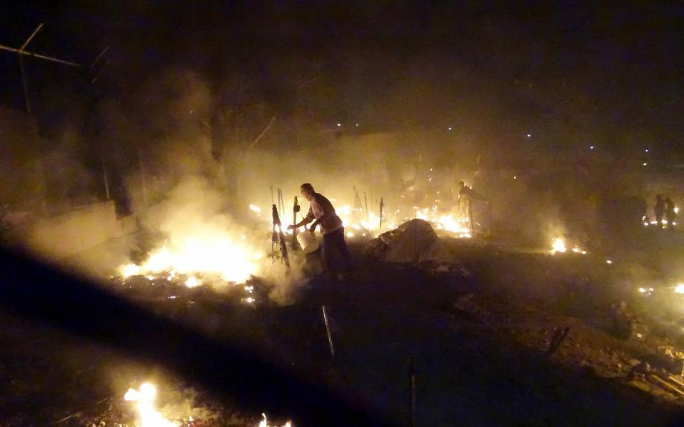

### AYS News Digest 24\.11\.16: Fire in Lesvos camp leads to the death of two refugees, eight more seriously injured\.

#### Feature

The deadly fire in Moria has taken at least two lives\. Photo Credit: Proactiva Open Arms

A fire broke out tonight in Moria, which led to the death of a 66 year old woman and a 6 year old child\. An additional 8 people were injured, 2 of them sustaining serious burns\. According to media reports, the fire began after a gas heater exploded\. The camp has since been evacuated and the fires brought under control\. Authorities maintain that the fire was most likely the result of an accident\.

It is a wonder that so few people were injured in the accident\. Moria has an official capacity for 3,500 people, but is currently housing over 5,000, making the camp uncomfortably cramped\. The victims of the explosion were a 66 year old woman and her 6 year old grandchild, in addition to another woman and another child who suffered severe burns from the blast and were flown to Athens for treatment\. It is believed that the fire started as the woman prepared dinner for her grandchild\. While such unfortunate accidents are commonplace, the circumstances of the victims tell the story of Greece’s failure to help refugees\.

The woman had been on Lesvos for 4 months according to authorities, a story all too common on the Greek islands\. The situation of the ground is difficult\. The asylum offices are severely undermanned, which results in the severe congestion and leads to massive buildups of refugees well beyond the official capacities\. Had the process been more streamlined, the woman and her grandchild could have been allowed to leave for the Greek mainland by now, and their lives may not have been extinguished when they were\.

One hopes that this incident will serve as a catalyst for much\-needed change in asylum processing\. For those who have been following the situation however, this seems unlikely\. This is just one of the many incidents that make up a long chain of tragic accidents and deaths which could have been avoided, all of which passed by with no effect on the situation on the ground\. Greece and the EU must be pressured to speed up processing to minimize the number of such accidents\.
#### Syria
### Rebels agree to UN plan for aid delivery to besieged East Aleppo\. Russian and regime approval needed\.

The UN estimates that there are 874,000 civilians under siege throughout Syria, 750,000 of which are being besieged by government forces\. Of those, 275,000 civilians are under siege in rebel\-occupied East Aleppo\. The city is starved for resources, and its residents face almost daily bombardment from the Syrian regime and its Russian allies\. In light of this, it remains quite difficult to bring food and other necessities into the city\. The last UN delivery took place on November 13, and the fear of starvation always lingers\. Hundreds of trucks remain on standby to bring much\-needed resources into the besieged area, but the Syrian regime and the Russians have not yet approved the plan\.

#### Turkey
### Online shop for crafts made by Syrian refugees\.

The Imece Shop is open for business\! Syrian refugees have begun to sell their crafts, the proceeds of which will go towards helping the refugees living in Turkey, who live in infamously dreadful conditions\. They are currently selling bags, T\-shirts, and bracelets\. You may find their selection [here](http://imeceshop.jimdo.com/shop/) \.
#### Bulgaria
### Refugees in Harmanli Center clash with police\.

Hundreds of refugees protested after being told that they will be unable to leave the camp\. Tires were set alight and refugees threw stones at police, who returned fire and even used rubber bullets and water canons in retaliation\. Following an initial calming of tensions, demonstrations continued well into the night\. The curtailment of the refugees’ freedom of movement came as a result of pressure placed on the government by right wing ideologues and their supporters\.

The camp is home to approximately 3,000 refugees\. There are around 13,000 refugees, mostly of Afghan origin, stranded in Bulgaria\. The vast majority see Bulgaria as a stepping stone into other European countries where more opportunities are available\.
#### Greece

### A total of 70 new registrations today, 57 in Chios and 13 on other islands\.
### Yellow Aid Truck down, they need your help\!

Yellow Aid Truck distributes food, warm clothing, and provides transportation for refugees daily\. The repairs are estimated to cost 700 euro\. If you can afford it, you may give at the link below\.

### Organization seeking volunteer translators for Arabic, Farsi, and Kurmanci\!

#### Serbia
### Refugee from Afghanistan commits suicide in Šid\.

The body of a 23 year old refugee from Afghanistan was found at 6am on Thursday morning\. His body was found not far from the Adaševci reception center\. His friends say that he was traveling alone without family\. He had made several attempts to cross the border into Hungary, but to no avail\. His friends noticed that he was missing a few days ago, and reported it to reception center authorities\.
### Asylum Info Center in Belgrade helps refugees\.

The center provides refugees with knowledge of their rights, internet, clothing, translation, and counseling\. They also help refugees to reach the asylum and reception centers in Serbia, and give referrals to other organizations which may provide legal aid, identification, family reunification, and searching for missing persons\. The center is located on Nemanjina Street 3 in Belgrade, and their website may be found at [www\.crpc\.rs](http://www.crpc.rs) \. You may call them at \+381 60 099 16 34\.
#### Hungary
### Refugee boy almost dies as a result of beating at the hands of Hungarian police\.

The boy provided testimony of the violence, which may be found [here](https://noborderserbia.wordpress.com/2016/11/24/testimony-another-case-of-brutal-police-violence-a-16-years-old-boy-almost-died-of-the-injuries-caused-by-the-hungarian-police/) \. The beating took place at night around 200 meters from the border\. Hungarian police crossed the border and members of the group were attacked so severely that they needed to be taken to the hospital\. Reports of such brutality at the hands of Hungarian police are far from uncommon, and yet nobody seems to be capable of doing anything to curb the violence\. Be the neglect from the lack of power or the lack of will by EU authorities, such incidents serve to show that dark forces linger in Europe, which inflict violence on people who are themselves escaping war\.
#### Germany
### Nazi\-era terminology finds new life amid the stoking of anti\-refugee sentiments\.

[The Independent reports](http://www.independent.co.uk/news/world/europe/nazi-language-germany-refugee-crisis-far-right-racism-a7429921.html) that Nazi\-era words such as _Volksverrater_ \(traitor of the people\), _Umvolkung_ \(ethnic cleansing\) and _Lügenpresse \(_ lying press\)are increasingly heard in anti\-refugee rallies and finding acceptance in larger sectors of German society\. Such a tendency comes at a time when violence against refugees is escalating\. There was a fivefold increase on refugee accommodations between 2014 and 2015, and a fourfold increase in crimes against refugees’ homes, a total of 1,031\. It comes as no surprise that the ramping up of fascist rhetoric goes hand in hand with violence directed against refugees, and the problem is expected to get worse lest such sentiments are actively combated\.
### German court approves second\-tier asylum for Syrian refugees\.

The decision makes the argument that since there is no evidence that refugees returning to Syria will face persecution for having fled, there is no reason to provide them with full\-fledged asylum\. The case revolved around a woman in a Schleswig court, who was told that she would need to provide proof that she would face persecution on returning to Syria\.

The second\-tier program is known as “subsidiary protection” and differs from full asylum in that the asylum seeker can only stay in the country for a total of 3 years, and have to wait 2 years before family reunification becomes possible\. Currently, 113,000 refugees in Germany fall under this category, which was implemented by Merkel’s coalition government following the massive influx in 2015\.
### Syrian baby named after Angela Merkel denied asylum\.

The baby was born on December 27, and just as her family was preparing to celebrate her first birthday, they received word from the BAMF that their asylum application was rejected\. The family will instead receive the above\-mentioned subsidiary protection, which means that their family will be unable to join them for at least another 2 years\.
### Mobile Info Team provides free resources for refugees seeking to learn German\.

#### France
### France seeks to bribe refugees to return to their countries of origin\.

The offer is valid until December 31, and promises to those who agree 2,500 euros, airfare to their country of origin, and up to 10,000 euros in financial aid to help refugees become economically stable\. The French Immigration Office hopes to speed up departures, and estimates that 4,500 will be returned by the end of the year\.
### Safe Passage UK release their Calais Demolition Report\.

The report, which may be read [here](http://safepassage.org.uk/wp-content/uploads/2016/11/Calais-Demolition-Report.pdf) , is full of valuable information, including lessons to be learned learned from the demolition, which might be useful for other NGOs\.
### An update from Paris\.

A source reports that each night there is a growing number of new arrivals, with groups as large as 30 people showing up and looking for places to spend the night\.

There is a new mini camp establishing itself near the humanitarian camp \(La Chapelle\) but its only a matter of time until the police put their boot in\.

Rastplatz is going to Paris and collecting donations\.

> _“We are heading to Paris to support people stranded in and around the city\. Donations like Sleeping Bags, Blankets or Backpacks are welcome\. You can drop them in Basel or Lausen until Sunday noon\. Contact us for details\. Thank you\!”_ 

#### Italy
### Clashes break out in Turin as tensions between refugees and local population grows\.

Refugees were frightened on Wednesday night as two small explosions went off\. After this, refugees living in the camp went out to the streets in an agitated mood, with media reporting that some of them damaged road signs and cars, and threw stones and bottles\. The police were thankfully able to diffuse the tensions before anyone was hurt\.
#### Mediterranean
### 146 were rescued today by MOAs\.

■■■■■■■■■■■■■■ 
> **[MOAS](https://twitter.com/moas_eu) @ Twitter Says:** 

> > 146 people were rescued from this rubber boat today, among them 16 women, 2 of whom are pregnant. Also 27 unaccompanied minors on board. [twitter.com/moas_it/status…](https://twitter.com/moas_it/status/801794839415230464) 

> **Tweeted at [2016-11-24 14:31:16](https://twitter.com/moas_eu/status/801795323148587009).** 

■■■■■■■■■■■■■■ 

_Converted [Medium Post](https://areyousyrious.medium.com/ays-news-digest-24-11-16-d2067a4339ac) by [ZMediumToMarkdown](https://github.com/ZhgChgLi/ZMediumToMarkdown)._
